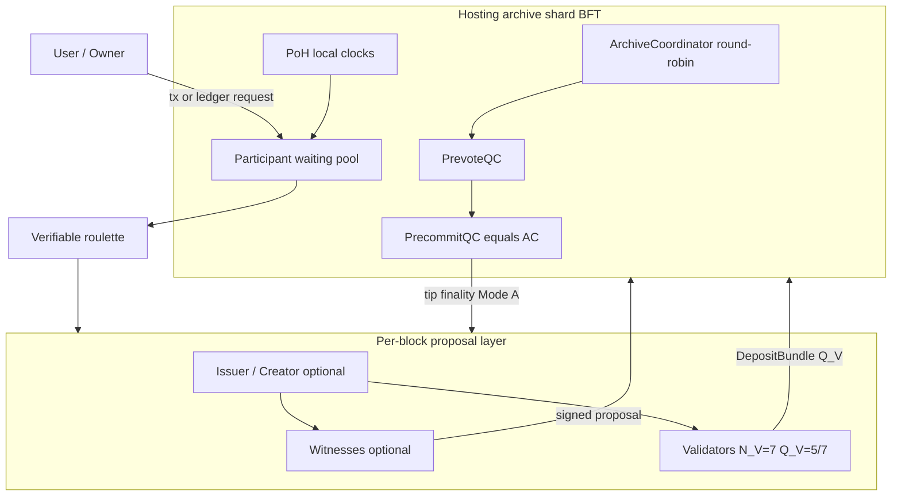

# Decentralization Cluster Multi-Chain

## Parallel Atomic Distributed Ledger Expansion (CoNET-DLE)

**Author:** Peter Xie  
**First draft:** 2023  
**Revision:** 2026-08-12 (7-active + 2-standby archive groups + 5/7 quorum + UniformPlacementV1 + challenged force exit + L1-anchored seller orders + class-specific fee currencies + universal L1 pool/TWAP asset admission + bonded archive exit / inactivity penalties; archives have no block-production right)

**Paired translation (must stay in sync):** [`Decentralization Cluster multi-chain.zh-CN.md`](./Decentralization%20Cluster%20multi-chain.zh-CN.md)  
**Sync rule:** `.cursor/rules/conet-layer2-whitepaper-bilingual-sync.mdc`

---

## Abstract

**CoNET Distributed Ledger Expansion (CoNET-DLE)** is a clustered, lightweight **Layer-2-style ledger-expansion** system: **many parallel, event-based atomic chains** (architecture target: capacity grows with staking / archive shards, not with one shared tip), each event block **produced only by a validator committee** drawn by the hosting **archive shard** (\(N_V=7\) drawn, **\(Q_V=5/7\)** signatures), then **finalized only** by that shard’s Archive Certificate under the explicitly frozen **Tendermint-style PrevoteQC → PrecommitQC protocol** (§5.2.1). Archive nodes have **no block-production right**: they independently replay, quality-check, vote, and aggregate certificates over validator-produced candidates.

- **Parallelism:** concurrent chains scale with staking and archive-plane fission; more capacity → more maintainable tips—not a claim of unbounded free speed.
- **Atomic (per chain):** tip advance requires a **\(Q_V=5/7\)** validator attestation, then an **Archive Certificate** from the hosting shard (§6.5, §5.2.1).
- **Event-only blocks:** **no event ⇒ no block.** Empty-slot mining and archive-produced control / anchor blocks are forbidden.
- **L1 birth certificate:** creating a new chain **must** mint a **unique NFT** on CoNET L1; that NFT binds class (**asset**, **storage**, or **trade**), ownership, and—after genesis AC—**`archiveGroupId`** of the hosting **7-active + 2-standby archive group**, finalized by a **\(Q_{\mathrm{placement}}=Q_A=5/7\)** PlacementCertificate that **any relayer** may submit (§5.2.0c). New-chain host is the globally replicated **QUEUED / NewChainQueue + publicly recomputable uniform-v1 roulette**, not hash(\(tokenId\)) mod \(S\).
- **Asset cap stays live:** each asset event **revalues** the tip; if balance **> 100 USDC**, outbound / excess **requires new chain(s)** (§4.6).
- **Trade-class (atomic NFT-style sale):** users open a **trade** tip as an **L2 order / state coordinator** to list an existing **asset** or **storage** chain. Listing quote is **seller-set** (`quoteAsset` + `quoteAmount`) with **no ≤100 USDC oracle cap**—DLE **cannot** oracle NFT market value (§4.7). Before the tip may open, the seller’s EIP-712 order digest and the subject NFT are atomically anchored in the CoNET **L1 Settlement Contract**. Tip advances via the frozen **Trade FSM** (`Open→Locked→SettleReady→…`, §10.2). **Final atomic delivery** (pay seller **and** move subject L1 NFT ownership) runs in one Settlement call; the trade tip then **closes**. An AC can attest readiness but cannot invent or rewrite seller terms.
- **Storage-class creator economy / private copyright delivery:** same thesis as Beamio **`CopyrightContentModule`**: owner fragments + seals a private assembly index to authorized DePIN miners; tip/L1 holds only hashes; buyers pay **conet-GB**, bind buyer PGP; **first-completer** miners deliver buyer-bound ciphertext; short-lived access URLs + periodic storage fees; plaintext never on-chain (§4.8).
- **Copyright ZERO / version tree:** storage tips form a **lineage tree** (original + modifiers); each branch point is an **independent L1 NFT** listable via trade-class; the tip stores **social history** (likes, comments, citations) as a **Web of Trust** signal for auction valuation (§4.9).
- **Storage sales ledger:** each storage tip keeps an append-only **sales-revenue journal** and **references** the parallel **asset-class** tip txs that actually move value (§4.10).
- **Archive-plane fission + BFT finality:** let \(G_e\) be the L1-registered live-group count, \(N_e=7G_e\) the unique active-voter count, and \(U_e\) the eligible `UnassignedPool` count; a serviceable new group may form iff **\(U_e\ge9\)**. Every group receives **seven newly assigned, non-overlapping active voters plus two dedicated ordered standbys** selected with public randomness; `maxGroupsPerArchive=1` and cross-group roster overlap is zero. Existing groups keep their assignments and only witness formation / serve proof-carrying read-only history or current finalized data for foreign groups. `groupId` is monotonic and never reused. New chains are roulette-assigned then bound on L1 1155; existing tips stay on `archiveGroupId`; **MigrationCertificate** is only for dissolve/re-home (§5.2). Each group finalizes validator-produced event blocks with the explicit Tendermint-style **PrevoteQC → PrecommitQC (= AC)** rule at \(N_A=7\Rightarrow f=2,\,Q_A=5\), and the whitepaper separately quantifies assumption breach \(P[X\ge3]\), quorum capture \(P[X\ge5]\), and any-shard risk (§5.2.1, §12.3.1a).
- **Archive-member exit and slashing:** archive identities exit through `ACTIVE → EXIT_REQUESTED → DRAINING → STANDBY_SYNCING → HANDOVER_READY → MEMBERSHIP_SWITCHED → UNBONDING → EXITED`; duties remain until the L1 `membershipRoot` atomically switches. Provable inactivity, pre-handover shutdown, DA fraud, and equivocation receive graduated penalties. Archive-member exit is distinct from a user’s challenged AssetVault `request → challenge → finalize` forced-exit claim (§5.2.1).
- **DA:** v1 freezes \((n,k)=(7,4)\): `chunkCount=7`, `recoveryThreshold=4`; each precommit signer still holds and verifies at least \(k=4\) distinct chunks before signing, with \(4\le N_A-f=5\).
- **Fees (class-specific denomination):** **storage-class** fees scale with content and settle in **conet-GB**; **asset-class** transfers pay **1 bp in canonical conet-USDC** after L1 pool/TWAP valuation; **trade-class** settlement pays **1 bp in the same `quoteAsset`**, with no NFT-price oracle. Every 1 bp fee splits **50% → hosting archive shard / 50% → \(Q_V\) accepting validators** (§13).

**Transport premise:** CoNET-DLE is loaded on **CoNET DePIN**. Control and data-plane gossip use **wallet addresses (EOA) as network identity**, not IP addresses. Messages are end-to-end encrypted (OpenPGP) and relayed through entry/mailbox nodes that **cannot read plaintext**.

**Natural privacy (product freeze):** privacy is **dual**—**communication privacy** (DePIN wallet-address gossip + OpenPGP) **and asset privacy**. Multi-address micro-fragmentation **raises on-chain clustering cost** and breaks the direct map **one address = whole portfolio**; it does **not** claim strong anonymity or that observers always fail (§4.5). On receive/transfer, CoNET freezes a **single canonical** wallet profile based on **ERC-5564** (stealth meta-address, ephemeral public key, view tag, announcement event, scan/spend keys, batch derivation, recover/scan)—**not** interchangeable BIP-47 / BIP-352 runtimes. BIP-47 / BIP-352 are **design references** only; BIP-352 is Bitcoin UTXO/Taproot-native and is **not** a CoNET L1/EVM drop-in. Stealth stays in the **wallet / client**; DLE tips / archive / validator committee do **not** run an address oracle (§4.5, §7.6).

**Custody security (qualified):** address fragmentation **alone** does **not** make custody safer. “No single private key controls the whole portfolio” holds only when fragment keys are under **independent key-domain and recovery-domain isolation**. If every fragment derives from one mnemonic, one device, one client DB, or one weak recovery password, seizing that seed or recombination database still takes **all** value. Product wallets SHOULD use a **hierarchical key vault** (online scan key; batched spend keys; hardware/threshold for high-value fragments; encrypted recovery map; per-shard derivation domains; per-device hourly merge/withdraw caps—§4.5, §12.9). **Higher recipient anonymity** is likewise a **client product** problem of *how* wallets use L2—not something DLE tip/archive/validator infrastructure can solve.

CoNET-DLE keeps blockchain-grade **immutability** while targeting continuous availability, flexible participation, and event-driven latency. Stake-based, group-local consensus removes the need for global PoW races. **As more miners join, more chains can be underwritten concurrently**; aggregate throughput can rise with independent archive shards—**not** “more miners ⇒ every tip gets monotonically faster.”

**Thesis on the blockchain trilemma (frozen):** CoNET-DLE **does not eliminate** the blockchain trilemma. It **changes its operating boundary** by replacing a shared global execution tip with many **operationally isolated**, **value-bounded (asset tips ≤ 100 USDC)**, event-driven state machines. Aggregate throughput **can** scale with independent archive shards, while security remains **conditional** on shard honesty, committee sampling, L1 settlement, data availability, and client-side key isolation (see §3.4).

This document is a design whitepaper for the **Decentralization Cluster / multi-chain** layer. Cryptography in §7 is restricted to **mature, production-proven primitives** (secp256k1 / EIP-191 for gossip, **EIP-712** for Archive Certificates / SettleReady / MembershipCheckpoint, OpenPGP, AES-GCM, SHA-256/Keccak-256, **CoNET L1 beacon finalized randomness** for production roulette seeds, optional **ECVRF** tickets after \(R_e\) is fixed, commit–reveal as **MVP-only**). It is complementary to CoNET DePIN / CoNET-SI and a CoNET **mainchain / registry**—not a replacement for a global PoS L1.

---

## 1. Introduction

As on-chain applications grow, more state must be recorded. Mainchain-centric consensus wastes compute when every participant races on one tip, and slow global block finality becomes the bottleneck. Many L1 and L2 designs still inherit a **single logical tip** (or a small set of shared tips), so they reintroduce the same congestion and fee pressure under load.

CoNET-DLE takes a different path: **shard by ledger**, not only by throughput tricks on one ledger. Each application or asset instance can own a **lightweight atomic chain** with its own issuer, witnesses, and validators—**many** such chains may run in parallel as staking and archive shards grow. Security and economic finality are reinforced by:

1. **Stake** of participants on CoNET.
2. **Random verifiable selection** (roulette over archive-node entropy) into **small** maintenance groups.
3. **\(Q_V=5/7\)** validator quorum for new-block proposals (or dissolve / promote standbys / reselect under §6.5).
4. **Archive node clusters** that store full state and perform quality checks / rollback.
5. **Mandatory CoNET L1 NFT** for every new chain: unique token id, **exactly one** of **asset / storage / trade** class, ownership, and (for asset class) **oracle-capped deposit ≤ 100 USDC-equivalent**—a **per-tip direct-loss ceiling**, **not** a claim that collusion motive → 0 (§12.2). **Trade-class** listings sell an existing asset or storage chain; direct seller terms are EIP-712 / EIP-1271 authorized and escrow-anchored on L1, and **cross-layer atomic settle** is performed by the CoNET **L1 Settlement Contract**, not by tip-local rollback (§4.7).

Staking miners choose how many chains to underwrite based on their compute and network capacity. Lightweight validators need not store full history, so participation can be on-demand—reducing the centralizing pressure of capital-heavy PoS and ASIC PoW monopolies.

**Deployment substrate:** the L2 does not invent a new IP overlay. It is **loaded on CoNET DePIN**, so every waiting-pool advertise, task offer, block proposal, and vote travels as **wallet-addressed, OpenPGP-encrypted gossip** (entry A → mailbox B; listen via entry C ≠ B). Cryptographic details are developed in **§7**.

---

## 2. Problem Statement

| Problem | Why it matters |
| --- | --- |
| Slow new-block consensus | Global tip agreement does not scale with demand. |
| Waste of computer resources | Idle or competing work on empty / contested tips. |
| High gas / fee pressure | One market for blockspace prices out small payments. |
| 51% / capital concentration | PoW and PoS tend toward resource monopolies. |
| Scalability bottleneck | Single-chain or single-rollup ceilings. |
| Centralizing consensus | Large validators / pools dominate selection. |

**Design goal:** keep decentralization and immutability, but make **parallel per-ledger consensus** the unit of scale—so aggregate capacity can grow with participants and archive shards, **without** claiming the classical trilemma is dissolved (security stays conditional—§3.4).

---

## 3. Design Thesis

### 3.1 Parallel atomic ledgers

- **Parallelism (design target):** the network hosts **many** independent atomic chains; capacity scales with staking / archive-plane width, not with a shared global tip—**not** a marketing claim of “infinite free TPS.”
- **Atomic (per chain):** within one chain, tip advance requires a **\(Q_V=5/7\)** validator-committee attestation, then an **Archive Certificate** (= PrecommitQC) from the hosting archive shard (§6.5, §5.2.1)—**not** “100% agreement of every maintenance role.”
- **Bounded blast radius:** compromise or crisis on one chain does not halt unrelated chains; **asset** tips further bound **direct** cash blast (≤ 100 USDC).
- **Miner-scale growth:** each additional honest miner expands how many chains the network can underwrite **at the same time**; larger roulette pools can **lower** attacker share \(p\)—capture risk still needs \(P_{\mathrm{prop}}\) / \(P_{\mathrm{year}}\) (§12.3.1).

### 3.2 Event-based block production

If there is no event (transaction / state-change / storage write request), **no new block** is produced. **No event ⇒ no block.** This forbids empty-block overhead and matches payment / receipt / storage workflows. Effective **transactions-per-second bandwidth** is the sum of active event streams across parallel tips—not the throughput of one global slot clock.

### 3.3 Clustered maintenance groups (\(N_V=7\), \(Q_V=5/7\) per block)

A chain is not secured by “the entire network voting every slot,” but by a **two-layer** path: a **small, randomly drawn validator committee** for the **current block proposal**, then **archive-shard BFT** that issues an **Archive Certificate**—the only object that makes the tip final (§5.2.1, §6.5).

**Security root (product freeze):** the validator committee is the **only block-production / proposal layer** (\(N_V=7\) drawn, deposit needs **\(Q_V=5\)** of **7** signatures); it does **not** alone constitute finality. Finality requires an **Archive Certificate (= PrecommitQC)** from the hosting shard’s Tendermint-style two-vote protocol (§5.2.1). Archive nodes never produce blocks and no single archive may accept, reject, roll back, or archive a tip unilaterally. **v1 does not use \(Q_V=5/5\)**—full-committee unanimity is rejected because one offline / timed-out / malicious signer can stall every round (§6.5).

**Canonical per-block path (product freeze):**

1. A **new event** appears on the chain (**no event ⇒ no block**).
2. The hosting **archive shard** (round coordinator + peers) draws **\(N_V=7\)** validators plus **\(S_{\mathrm{sb}}=2\)** standbys from the **on-demand miner waiting queue**.
3. The committee **votes**; on **≥ \(Q_V=5\)** accept signatures within \(T_{\mathrm{vote}}\), it **submits** the block / attestation set.
4. Archives **Mode A** replay the validator-produced DepositBundle; if **qualified**, they run **PrevoteQC → PrecommitQC (= AC)** and **archive**; else **ArbitrationPool** → **CandidateRejectCertificate** / reselect (§6.3, §9).

Dishonest or timed-out members are replaced under §6.5 liveness rules; stake is at risk for equivocation / unjustified refuse. Many such committees run **in parallel** across chains, so confirmation latency is a **tiny committee** quorum plus a **small-shard** archive quorum—not a planet-wide slot.

### 3.4 Redefining the trilemma’s operating boundary (not eliminating it)

Classical blockchain design is often framed as an **impossible triangle**: at most two of **decentralization**, **security**, and **scalability**.

**Product freeze (canonical claim):**

> CoNET-DLE **does not eliminate** the blockchain trilemma. It **changes its operating boundary** by replacing a shared global execution tip with many **operationally isolated**, **value-bounded** (asset tips ≤ **100 USDC**), **event-driven** state machines. Aggregate throughput **can** scale with independent archive shards, while security remains **conditional** on shard honesty, committee sampling, L1 settlement, data availability, and client-side key isolation.

| Trilemma corner | Classical single-tip pain | CoNET-DLE response (conditional) |
| --- | --- | --- |
| **Scalability** | One tip’s TPS / gas market saturates | **Event-based** blocks + **small-group parallel consensus** across many tips + **archive-plane fission** (7 active + 2 standbys, §5.2) → **aggregate** bandwidth can grow with active ledgers and shards; **per-tip** latency still bounded by \(T_{\mathrm{vote}}\), reselections, and archive quorum—not “more miners ⇒ always faster” |
| **Security** | Scaling often weakens economic finality or trusts sequencers | Remains **conditional**: archive Tendermint-style **PrevoteQC / PrecommitQC (= AC)** at \(N_A=7,f=2,Q_A=5\); committee \(Q_V=5/7\) + \(P_{\mathrm{prop}}\) / \(P_{\mathrm{year}}\) (§12.3.1); archive-group \(P_{\ge3}\), \(P_{\ge5}\), and any-shard risk (§12.3.1a); \(E_C\le E_{\max}\) (§12.3.2); L1 settle / NFT; DA; asset-tip **direct** blast ≤**100 USDC**; client key-domain isolation (§4.5, §12.9) |
| **Decentralization** | Full-node / validator hardware & capital barriers concentrate power | **Role-split**, on-demand participants **need not sync all chain data**—still subject to stake, anti-grinding bonds, and honest-shard assumptions |

**Not claimed:** mathematical dissolution of the trilemma; unbounded free TPS; collusion motive → 0; observers cannot correlate; more miners ⇒ every transaction gets faster.

### 3.5 Relation to CoNET stack (conceptual)

```text
+-------------------------------------------------------------+
| CoNET mainchain / registry (identity, stake, NFT, AddressPGP)|
+-----------------------------+-------------------------------+
                              | anchors / fees / NFT / PGP registry
+-----------------------------v-------------------------------+
| CoNET-DLE L2 - Decentralization Cluster (this paper)         |
|  many asset / storage / trade chains x concurrent maintenance groups|
+-----------------------------+-------------------------------+
                              | encrypted gossip (wallet != IP)
+-----------------------------v-------------------------------+
| CoNET DePIN / CoNET-SI - wallet-address P2P + entry/mailbox |
|  OpenPGP ciphertext; A->B send; C->B listen; zero-trust hops|
+-------------------------------------------------------------+
```

**Privacy by construction:** L2 roles do not dial each other by IP. They address **wallet / PGP identities**; DePIN relays forward ciphertext. Entry and mailbox nodes learn routing key IDs, not business plaintext or stable client IPs. Separately, **asset holdings are multi-wallet fragments** recombined only on the client (§4.5, §7.6).

Canonical product line: each ledger is an **L1 NFT–bound** chain of class **asset**, **storage**, or **trade** (asset tips ≤ **100 USDC** oracle valuation; trade listings use **L1-anchored seller-signed quotes without NFT oracle / without ≤100 USDC quote cap**, with **atomic delivery on L1 `settleTrade`**, §4.7), maintained by a randomly selected small group, with **event-driven** blocks only.

---

## 4. System Overview

### 4.0 Terminology hierarchy (normative vocabulary)

Use these layers **strictly**—do not treat them as synonyms:

| Layer | Name | Meaning |
| --- | --- | --- |
| L0 | **CoNET L1** | The PoS settlement / registry chain (NFT birth, `settleTrade`, MembershipCheckpoint, challenges, AssetVault). |
| L1 (DLE plane) | **Atomic chain / tip** | One L1-NFT-bound parallel ledger of class asset / storage / trade. “Chain” in DLE prose means this tip, **not** CoNET L1 unless marked “L1”. |
| L2 | **Micro-ledger** | Informal synonym for a tip’s event history under the class FSM—**not** a separate product. Prefer **tip**. |
| L3 | **Event FSM / state machine** | The frozen per-class transition table (§10). Tips have **no VM**; Mode A archives **replay** the FSM. |
| L4 | **Block / tip height** | One accepted event step on a tip (proposal → \(Q_V\) → AC). **No event ⇒ no block.** |
| L5 | **Archive shard** | The non-block-producing BFT committee that independently replays validator candidates and issues PrevoteQC / PrecommitQC (= AC). |
| L6 | **Validator committee** | Per-block \(N_V=7\), \(Q_V=5/7\) **block-production / proposal** layer—**not** tip finality. |

### 4.1 Chain creation gate (mandatory L1 NFT)

Creating a new DLE chain is **not** a free L2-only act. The creator **must first** obtain a **unique NFT** on **CoNET L1**. That NFT is the chain’s sole public identity for:

| Bound by L1 NFT | Rule |
| --- | --- |
| **Uniqueness** | One NFT id ↔ one DLE chain; no anonymous genesis without L1 mint. |
| **Class (ternary)** | At mint / configure time the chain is fixed as **exactly one** of: **asset-class**, **storage-class**, or **trade-class**. |
| **Ownership / archive placement** | Owner and fee payer hooks bind to the NFT id. **New-chain host** is NewChainQueue + **UniformPlacementV1** into a live 7-active + 2-standby group, then L1 **`archiveGroupId[tokenId]`** (§5.2)—**not** `tokenId mod S` and **not** hash residue. Later events follow the L1 pointer. **Canonical owner** of any DLE chain is **CoNET L1 `ownerOf(nftId)`**. |
| **Asset deposit (asset-class only)** | Asset must be `ACTIVE` in the L1 `AssetAdmissionRegistry`; **every asset, including conet-USDC**, requires an approved decentralized CoNET L1 pool / route + TWAP adapter + minimum liquidity. L1 deposits are valued in USDC-6 and must not exceed **100 USDC-equivalent**; the bound is re-checked on every asset event (§4.6, §13.3). |
| **Trade subject (trade-class only)** | Genesis binds an already-live L1 `escrowOrderHash` covering the **subject** collection + asset/storage NFT id and seller terms; **L1 Settlement Contract** atomically pays seller and transfers **that subject’s** L1 ownership (§4.7). |

**Micro-fragmentation as a loss bound (not an anti-collusion theorem):** capping each asset chain at **≤ 100 USDC** and encouraging many tiny parallel ledgers bounds **direct economic loss per successful asset-tip capture**—a first-class **loss ceiling**, not merely UX. It does **not** imply that collusion motive “tends to zero,” and it does **not** replace committee security, archive BFT, capture probabilities \(P_{\mathrm{prop}}\) / \(P_{\mathrm{year}}\) (§12.3.1), or **per-epoch committee cumulative exposure** \(E_C\le E_{\max}\) (§12.3.2). The same fragmentation is the substrate of **asset privacy**; **custody security** further requires **key-domain + recovery-domain isolation** (§4.5, §12.9). Runtime **revalue + spillover mint** (§4.6) keeps the oracle book-value cap honest after price moves.

### 4.2 Three classes of chains

| Class | Purpose | Ingress / fee rules |
| --- | --- | --- |
| **Asset-class chain** | Transferable value ledger bound to the L1 NFT | Asset must pass L1 admission with an approved decentralized CoNET L1 pool/TWAP **even when the asset is conet-USDC**. Deposit is oracle-valued and hard-capped at **≤ 100 USDC-equivalent**; every event revalues (§4.6). Each transfer proposer pre-locks **1 bp of USDC-6 notional in canonical conet-USDC**; no valid fee lock ⇒ reject (§13). |
| **Storage-class chain** | Data / logs / **creator content** with paid access; **Copyright ZERO** version nodes; **sales books** | Owner may embed **fragmented encrypted content** + access policy (§4.8). Tips may fork into a **version tree** (§4.9). Tip records **social events** and an append-only **sales-revenue ledger** that links to parallel **asset-class** txs (§4.10). **Content-based fees and access** settle in **conet-GB** (not the USDC 0.01% rail); unpaid → **new blocks stop**. Buying **access** ≠ buying the NFT; selling a branch uses trade-class (§4.7). |
| **Trade-class chain** | Short-lived **L2 listing / match coordinator** for selling an existing **asset** or **storage** chain (NFT-style whole-ledger sale) | User-opened only after L1 `escrowSubject`; genesis binds **sellerOrderHash + subject collection / ID**. Quote is seller-set and directly authorized with **no NFT oracle** and no ≤100 USDC quote cap (§4.7). On successful L1 settlement only, buyer pays seller `quoteAmount` plus **1 bp in the same `quoteAsset`**; the fee splits 50/50 archive/validators. No second percentage listing fee (§13). |

Class is chosen when the L1 NFT is created / configured and is **immutable** for that NFT. **No dual-class** chain: a tip cannot be asset and trade at once. Selling many asset fragments means **multiple trade listings** (one `subjectNftId` each); each **asset tip** still obeys its own ≤100 USDC oracle balance cap—**listing quotes** are not so capped.

### 4.6 Asset-class event revaluation & spillover new chain

Product freeze for **asset-class** tips (keeps the ≤ **100 USDC** invariant live, not only at mint):

1. At creation, the underlying asset **MUST** be `ACTIVE` in L1 `AssetAdmissionRegistry` and have an approved decentralized CoNET L1 pool/route, frozen TWAP adapter, minimum liquidity, and fresh observation (§13.3). This applies **including to canonical conet-USDC**; its admission route must detect depeg risk rather than assume a permanent USD 1.00 value. No approved pool/adapter means **no asset-class chain**.
2. On every **new event** (especially a transfer), the chain revalues its balance and proposed transfer with that canonical L1 oracle report. The event proposer pre-locks **1 bp of transfer USDC-6 notional in canonical conet-USDC** and binds the finalized `feeLockId`; absent / insufficient / consumed lock or stale oracle ⇒ reject (§13.2–§13.3).
3. If the revalued **chain balance ≤ 100 USDC-equivalent**, the transfer may proceed under normal §6.3 rules; after AC, the L1 FeeVault distributes the conet-USDC lock **50% archive / 50% validators** (§13.4).
4. If the revalued **chain balance > 100 USDC-equivalent**, the **outbound portion** that would leave this tip (or the excess over the cap) **must not** stay as a single over-cap transfer on this chain: the owner / client **must create one or more new asset-class chains** (new L1 NFT + oracle-capped deposit ≤ 100 USDC each) and move that outbound / excess value onto those new tips.
5. Consensus and archive reject an asset transfer event that would finalize a tip with revalued balance **> 100 USDC**, that lacks an active asset-admission record / fee lock, or that tries to send the over-cap slice without a matching **new-chain** birth certificate.

Oracle appreciation after mint is the typical trigger: ingress was ≤100 at genesis, but a later event’s revaluation can push the economic balance over the cap—hence **revalue on event + spillover mint**, not a one-time check.

**L1 AssetVault (product freeze — challenged force-exit binding).** Asset-class ingress collateral is locked in a CoNET **L1 AssetVault** keyed by `assetNftId` (same NFT that binds the tip). Tip spendable balances are **claims** against that vault up to the oracle-capped proven amount under the latest L1-known or dispute-frozen good AC `tipStateRoot` (§5.2.1). Ordinary transfers move tip claims; **L1 unlock / force withdraw** is the only path that returns vault assets to an EOA. A caller-selected old AC can never unlock immediately. Mapping rules (normative):

```text
unappliedL1Withdrawal(assetNftId, owner, proof) =
  saturatingSub(
    AssetVault.withdrawnByAssetOwner[assetNftId][owner],
    proof.appliedL1Withdrawn
  )

claimableAtAC(assetNftId, owner) =
  saturatingSub(
    proof.netTipBalance,
    unappliedL1Withdrawal(assetNftId, owner, proof)
  )

forceExitPayout ≤ min(
  AssetVault.locked(assetNftId) - AssetVault.released(assetNftId),
  requestedAmount,
  claimableAtAC(assetNftId, owner)
)
```

The owner state leaf proves both `netTipBalance` and cumulative `appliedL1Withdrawn`. This avoids double subtraction after the tip has already applied an L1 finalization while still blocking reuse of a pre-finalization proof. `withdrawnByAssetOwner` and vault-wide `released` are cumulative L1 accounting, updated before transfer; changing a claim id or starting another exit epoch cannot recreate an already released balance. The exact request → challenge → finalize protocol, deterministic claim id/nullifier, AC freshness registry, and tip freeze rule are frozen in §5.2.1.

Spillover mints open **new** vaults for new NFTs; they do not silently enlarge an existing vault past the per-tip 100 USDC ceiling.

### 4.7 Trade-class: L2 coordinator + L1 Settlement Contract atomicity

Product freeze for **decentralized atomic sales** of whole ledgers (analogous to **NFT trading** of the chain’s birth certificate).

**Role split (normative):**

| Layer | Role |
| --- | --- |
| **Trade-class DLE tip** | **Off-chain / L2 order book & state coordinator**: mirror the L1-anchored seller order, match intent, payment lock, `SettleReady` Archive Certificate |
| **CoNET L1 Settlement Contract** | **Seller-intent anchor and sole provider of cross-layer atomicity**: verify seller authorization, hold the subject NFT, pay seller **and** transfer `subjectNftId` in **one** L1 transaction—or neither |

**Why tip-local “atomic rollback” is not enough**

- A DLE tip **cannot reverse** an NFT transfer (or payment) that has already **finalized on L1**.
- Writing that buyer payment and `subjectNftId` transfer must succeed in the “same tip settlement event set,” then “roll back the tip,” does **not** create **cross-layer** atomicity: L1 state and tip state can diverge if either side commits alone.
- Therefore production **MUST** settle trades through an L1 contract; tip events alone are **insufficient**.

**SellerOrder: direct L1 seller-intent anchor (product freeze)**

Removing the ≤100 USDC **trade quote** cap is correct: a storage / copyright NFT has no reliable fair-value oracle, seller pricing is a market choice, and the ≤100 USDC **asset-tip balance cap** is a different invariant. The consequence is that neither a \(Q_V=5/7\) validator certificate nor a \(Q_A=5/7\) archive AC may act as seller authorization. Even joint committee capture must not be able to lower the quote, replace the subject, or alter a targeted-buyer condition.

The seller signs the following versioned EIP-712 struct before a trade tip opens (field names illustrative; field set and ordering frozen):

```text
SellerOrder {
    version,
    seller,
    tradeId,
    subjectNftContract,
    subjectNftId,
    quoteAsset,
    quoteAmount,
    buyerConstraint,   // zero = open listing; otherwise exact permitted buyer
    feePolicyHash,     // commits same-quote-asset 1 bp policy and exact seller proceeds
    deadline,
    sellerNonce
}

domain = {
    name: "CoNET-DLE-Settlement",
    version: "1",
    chainId: CoNET_L1_CHAIN_ID,
    verifyingContract: Settlement
}
sellerOrderHash = EIP712Digest(domain, SellerOrder)
```

`sellerOrderHash` is the typed-data digest, **not** `keccak256(signatureBytes)`: signatures may have multiple encodings and are evidence for authorization, not the canonical order identity. EOAs use canonical low-\(s\) ECDSA recovery; contract / AA sellers use **EIP-1271** `isValidSignature`. `subjectNftContract` is explicit (or a protocol-fixed singleton registry address still included in the digest), so equal token IDs in different collections cannot collide. In v1, `feePolicyHash` is the canonical §13.2 hash: the buyer pays `quoteAmount + ceilDiv(quoteAmount,10_000)` in `quoteAsset`, the seller receives exactly `quoteAmount`, and the 1 bp remainder splits 50/50. Settlement arithmetic uses **no NFT valuation and no quote-token conversion oracle**; an optional quote-token risk oracle is advisory / circuit-breaking only (§13.2).

The L1 entry point is:

```text
escrowSubject(SellerOrder order, bytes sellerAuthorization)
```

In one transaction it **MUST** verify the EIP-712 / EIP-1271 authorization, require `ownerOf(subjectNftId)==seller`, require an unused `tradeId` and fresh seller nonce, validate quote token / amount / deadline / fee policy, transfer the exact subject NFT into Settlement custody, verify post-transfer custody, and only then store:

```text
escrowOrderHash[tradeId] = sellerOrderHash
escrowSeller[tradeId] = seller
escrowedSubject[tradeId] = (subjectNftContract, subjectNftId)
escrowStatus[tradeId] = OPEN
sellerNonceState[seller][sellerNonce] = RESERVED
```

The nonce lifecycle is `UNUSED → RESERVED → CONSUMED`; cancellation also consumes it, so a cancelled or settled authorization cannot be replayed. The trade-tip genesis `TradeOpened` event **MUST** reference this already-live L1 escrow record and exact `sellerOrderHash`; committee signatures cannot create an unanchored order.

**L1 Settlement Contract (product freeze sketch)**

Call shape (ABI names illustrative; semantics frozen):

```text
settleTrade(
    tradeId,              // trade-class NFT / listing id
    buyer,
    paymentProof,         // escrow pull / pull-authorization for quote asset
    dleArchiveCertificate // AC proving tip SettleReady for this tradeId + quote + buyer + nonce + deadline
)
```

In **one** CoNET L1 transaction the contract **MUST**:

1. Load the L1 escrow record and require `escrowStatus[tradeId]` to be `OPEN` / `LOCKED`, its seller nonce to be `RESERVED`, and the stored `sellerOrderHash` to be canonical.
2. Verify the **DLE Archive Certificate (= PrecommitQC)** under the rules below (tip identity, SettleReady typed payload, DA binding, `membershipRoot`, ≥ \(Q_A=5/7\) **EIP-712** precommit signatures—§5.2.1).
3. Require the AC’s `sellerOrderHash`, subject, seller, **quote** (`quoteAsset` + `quoteAmount`), `buyerConstraint`, `feePolicyHash`, deadline, and seller nonce to equal the L1 escrow record / anchored order exactly. **Do not** oracle-value the subject NFT or enforce a ≤100 USDC quote cap.
4. Require `buyer != 0`; for a targeted order require `buyer==buyerConstraint`. For an open order (`buyerConstraint==0`), require the payment authorization / escrow debit and NFT recipient to be that same `buyer`.
5. Re-check current custody: `ownerOf(subjectNftId)==Settlement`, and the collection + token ID equal `escrowedSubject[tradeId]`.
6. Compute `tradeFeeAmount=ceilDiv(quoteAmount,10_000)` in `quoteAsset` native units and collect exact `buyerDebit=quoteAmount+tradeFeeAmount`. No oracle conversion to conet-USDC is permitted. Fee-on-transfer / rebasing assets are rejected unless a versioned adapter proves the exact anchored debit and proceeds.
7. Before external transfers, mark the trade settled and seller nonce `CONSUMED`; then atomically pay the stored seller exactly `quoteAmount`, allocate `tradeFeeAmount` under the 50/50 fee split, and transfer the escrowed subject NFT to `buyer`.
8. **Reject re-execution** of the same `tradeId`, order digest, or seller nonce (idempotent fail).

If any check fails, the **entire L1 call reverts**—no partial NFT move, no partial payment release.

**How L1 verifies the SettleReady AC (product freeze):**

| Rule | Normative requirement |
| --- | --- |
| **Seller authorization anchor** | AC validity is necessary but **never sufficient**. `settleTrade` must load `escrowOrderHash[tradeId]`, require exact equality with the AC-committed `sellerOrderHash`, and verify current Settlement custody. A validator/archive quorum cannot substitute a different order. |
| **Signature scheme** | Commit signatures on the AC are **EIP-712** typed data (domain: `CoNET-DLE-Archive`, `chainId` = CoNET L1, `verifyingContract` = Settlement / MembershipCheckpoint registry). **EIP-191 text blobs are rejected** for settle / DA-binding ACs. |
| **Typed SettleReady payload** | AC (or its `blockHash` / event commitment) **MUST** bind at least: `tradeId`, `sellerOrderHash`, `subjectNftContract`, `subjectNftId`, `seller`, `buyer`, `buyerConstraint`, `quoteAsset`, `quoteAmount`, `tradeFeeAmount`, `feePolicyHash`, `sellerNonce`, `settleNonce`, `deadline`, `paymentAuthHash` / escrow reference, `tipStateRoot`, `daRoot` (+ DA fields in §5.2.1), `membershipEpoch`, `membershipRoot`. |
| **Membership on L1** | Hosting shard publishes **`archiveMembershipRoot[membershipEpoch]`** to an L1 **MembershipCheckpoint** (via ≥ \(Q_A\) MembershipUpdateCertificate or bonded L1 forced update). `settleTrade` verifies AC signatures against **that checkpointed root**—not a tip-only gossip claim. |
| **Quorum economics** | L1 **MUST NOT** verify \(Q_A\) raw ECDSA recoveries on every settle when gas would dominate small payment notionals. Preferred v1 path: L1 stores a **short AC checkpoint / inclusion proof** (e.g. Merkle / aggregate attestation already checked off-chain and bonded) that commits the typed SettleReady fields + `membershipRoot`; open bytecode may use multi-sig only for small \(N_A\) testnets. |
| **Stale roster** | An AC with `membershipEpoch` / `membershipRoot` **not** equal to the L1 checkpoint for that shard+epoch is **invalid**. After roster change, old members **cannot** settle with a pre-change AC. |
| **Post-roster / tip writeback** | Tip marks **Settled** only after observing the L1 settle tx. L1 reorg deeper than the Settlement finality assumption: tip must follow L1—never invent tip-only Settled. |

**DLE tip workflow (coordinator):**

1. **Subject + seller intent:** an existing **asset-class** or **storage-class** chain is identified by `(subjectNftContract, subjectNftId)`. Its current L1 owner signs `SellerOrder`; Settlement verifies the authorization and atomically takes custody.
2. **Open listing:** only after the L1 escrow exists may the seller mint / open a trade-class L1 NFT / DLE tip whose genesis binds exact `sellerOrderHash`, subject, **seller-set** `quoteAsset` / `quoteAmount` (**no NFT oracle; no ≤100 USDC quote cap**), buyer constraint, fee policy, seller nonce, and deadline. Consensus verifies all fields against L1; it cannot amend them.
3. **Listing freeze:** while the trade tip is **Open** / **Locked** / **SettleReady**, the subject NFT remains in Settlement custody, and asset-class subjects reject outbound drains that would empty the tip before settle. This is an L1 escrow lock—not tip-only soft state.
4. **Match → SettleReady:** buyer locks / authorizes `quoteAmount + ceilDiv(quoteAmount,10_000)` in the same `quoteAsset` (typically into the **L1 settlement escrow** or through a single-use pull authorization). The tip records match fields and archives a **`SettleReady`** event under normal \(Q_V\) + **AC** rules, including exact `sellerOrderHash`, fee amount, and buyer/payment reference. That AC is the `dleArchiveCertificate` input to `settleTrade`.
5. **L1 settle (atomic delivery):** any permitted caller submits `settleTrade(...)`. **Only after** the L1 tx succeeds is canonical ownership **buyer = L1 `ownerOf(subjectNftId)`** and payment finalized. The tip then records **Settled** (with L1 tx hash) and **closes**. The **subject asset/storage tip continues** under the new owner (it is **not** closed).
6. **Failure / cancel / expire before L1 settle:** the stored seller may cancel an `OPEN` order directly on L1; expiry is checked against L1 time. Cancellation / expiry consumes the seller nonce, returns the subject NFT only to the stored seller, and refunds already locked buyer funds under the frozen payment rule. The tip then records **Cancelled** / **Expired → Closed** from the L1 receipt. After successful L1 settle, tip state **must** follow L1—never invent a tip-only “un-settle.”
7. **What is sold:** the **subject** NFT / ledger—not the trade-order shell. Transferring the trade NFT itself is not the product path for buying the listed chain.
8. **Portfolio sale:** selling many asset-class fragments still requires **many** trade listings (one `subjectNftId` each), because each **asset tip** remains ≤100 USDC at the oracle book (§4.6)—not because trade quotes are capped.
9. **Quote policy (product freeze):** DLE **MUST NOT** require an L1 oracle valuation of the listed NFT. Subject **asset tips** keep their own ≤100 USDC balance rules; **storage / copyright NFTs** have no oracle book value. Trade quotes are free market parameters between seller and buyer.

**Security consequence and residual trust:** even if both the validator committee and archive group are captured, they can at most censor / delay or attest a match that is already permitted by the anchored order. They cannot change the subject, seller, quote asset, quote amount, buyer constraint, fee policy, deadline, or nonce; and they cannot release the NFT without the anchored payment predicate. This does **not** protect against compromise of the seller key / EIP-1271 policy, a malicious allowlisted payment adapter, or compromise of the Settlement upgrade authority. Production therefore requires a timelocked, publicly observable Settlement upgrade path and conservative token adapters.

**Lifecycle (trade tip — normative, §10.2):** `None → Open → Locked → SettleReady → Settled → Closed` (or `Cancelled` / `Expired → Closed` without L1 settle). **Matched** is **not** a separate tip state: match fields are written on the **`SettleReady`** event while in **`Locked`**. **Settled** is defined by **L1 settlement success**, not by tip vote alone. Full transition table, encodings, `tipStateRoot`, and error codes: **§10**.

### 4.8 Storage-class creator economy (fragmented content + GB access)

Product freeze for **creator-economy storage tips** (paid content access without transferring the storage NFT):

1. **Publish (owner):** at create / configure time the owner splits the work into **encrypted fragments**, builds an **assembly index** (fragment hashes + order + fragment keys / unwrap material), and **seals that index to authorized delivery miners**—not to the tip, not to archive, not to the validator committee. Fragments and the encrypted index are stored on **Beamio IPFS** (`keccak256(utf8(payload))` fragment hashes). The storage tip records **only public commitments**: `contentIndexHash`, `authorizedNodeKeyHash[]` (AddressPGP / Guardian node key ids), **access price in conet-GB**, access duration, and optional retention policy. Plaintext content **and plaintext index** **never** sit in tip state or in consensus votes.
2. **Private index handoff (how miners get the secret without tip exposure):**
   | Layer | Holds | Who can read |
   | --- | --- | --- |
   | **Storage tip** | `contentIndexHash` + authorized key-hash set + prices | Everyone (commitment only) |
   | **IPFS** | OpenPGP (or hybrid) **ciphertext of the assembly index** | Only miners whose PGP was a recipient |
   | **IPFS** | Encrypted content fragments | Useless without index unwrap material |
   | **Miner local** | Decrypted index + temporary plaintext during assembly | That authorized delivery miner only |
   | **Buyer package** | Ciphertext under **buyer PGP** | Buyer only |

   - **Encryption mode (product default):** **OpenPGP multi-recipient** — one index ciphertext package whose recipients are the owner-chosen authorized miner PGP keys (any one of them can decrypt). Optional alternative: **per-miner copies** (`nodeKeyHash → indexCipherHash` manifest) when the owner wants independent revoke/re-seal without re-encrypting a shared blob.
   - **Configure path:** owner client (1) builds plaintext index locally; (2) encrypts to authorized keys; (3) uploads ciphertext → obtains `contentIndexHash`; (4) submits a tip **Configured** event carrying **only** the hash + authorized set + price policy. Tip gossip / DePIN never carries the decryptable index as tip payload.
   - **Trust boundary:** authorized delivery miners **are** trusted to see plaintext while assembling (delivery custody). Tip consensus validators and archive peers verify **hashes and events only**—they have **no** index private key and **must not** require plaintext for quality-check. Owner mitigates miner leak risk by: small authorized set, stake / reputation selection, rotation (re-encrypt index to a new set + new `contentIndexHash`), watermarks, and revoke events that drop a `nodeKeyHash`.
   - **No “submit secret on tip” anti-pattern:** rejecting any program that puts raw index JSON, fragment AES keys, or unencrypted assembly instructions into tip blocks or public votes.
3. **Access rights:** the owner sets who may purchase (open / allowlist), the **conet-GB** price, and expiry. Changing price / policy is an event on the storage tip (subject to the frozen storage-class event transition table, §4.8 / §6.3). Re-sealing the index (new authorized set) is a **Configured** update with a new `contentIndexHash`.
4. **Purchase (visitor):** the buyer pays the owner-set **conet-GB** price, binds **buyer PGP** (`buyerPgpKeyHash` + AddressPGP-resolvable public key), and opens a purchase event. Payment and PGP binding are verified before delivery starts. **Access purchase does not transfer** storage-chain L1 ownership (contrast §4.7). The purchase event is **public metadata** (who bought, buyer key hash, deadline)—it does **not** re-transmit the private index.
5. **Delivery (authorized miners):** miners listen for purchase events (DePIN gossip / tip feed). A miner that holds a matching authorized key:
   - fetches the index ciphertext from IPFS via `contentIndexHash`;
   - decrypts the index with **its** PGP private key (off-tip);
   - fetches fragments from IPFS and **reassembles** the content locally;
   - **re-encrypts** the delivery package under the **buyer’s PGP**;
   - uploads the buyer-bound ciphertext to IPFS and records `buyerEncryptedContentHash` (plus buyer-bound index pointer as required by the tip program).
6. **First-completer:** the first valid miner completion locks the delivery record for that purchase; later completers must fail or no-op. Consensus / archive attest the purchase and completion events via the normal **validator-committee** path; plaintext must not appear in public votes.
7. **Buyer restore:** only the buyer, with their PGP private key, can decrypt the buyer package and use the **buyer-bound index** to restore the original content. Relays, archive peers, and unrelated miners see ciphertext / hashes only.
8. **Currency:** access price and related content-delivery fees are denominated in **conet-GB** (storage-class content rail—§13). Tip retention / unpaid halt rules from §4.2 still apply to storage maintenance fees.
9. **Expiry / retention:** after `accessExpiresAt` (and/or unpaid `storagePaidUntil`), miners must stop serving access URLs; expired purchases cannot reopen without a new pay event.
10. **Tip / module state (CopyrightContentModule-aligned):** storage-class tip state (and the Beamio catalog module when used as an L1-adjacent surface) keep **bounded** fields only—**no** unbounded on-tip arrays of buyers, comments, or URLs:

| Field | Meaning |
| --- | --- |
| `contentIndexHash` | IPFS hash of the **encrypted** assembly index (`keccak256(utf8(payload))` → `bytes32`) |
| `authorizedNodeKeyHash[nodeKeyHash]` | Owner-chosen delivery miner / Guardian PGP key hashes |
| `purchaseId` | Derived id (`tipNft` / card + buyer + nonce) for one access purchase |
| `buyerPgpKeyHash` | Buyer PGP bound at purchase (AddressPGP-resolvable) |
| `accessExpiresAt` | Owner-set access deadline for that purchase |
| `storagePaidUntil` | How long the completer node is paid to retain / serve |
| `completedByNodeKeyHash` | First-completer; `0` until locked |
| `buyerEncryptedContentHash` | IPFS hash of buyer-PGP ciphertext package |

11. **Normative events (same semantic names as CopyrightContentModule):**
    - `CopyrightContentConfigured` — index hash, authorized set, price / policy;
    - `CopyrightPurchaseOpened` — `purchaseId`, buyer, `buyerPgpKeyHash`, `accessExpiresAt`;
    - `CopyrightDeliveryCompleted` — `purchaseId`, `nodeKeyHash`, `buyerEncryptedContentHash`;
    - `CopyrightStorageFeeCharged` — periodic retention fee to the completer (DLE: **conet-GB**; Beamio catalog path may mirror with B-Unit indexer rows).
12. **Buyer-bound purchase integrity:** purchase must be signed by the buyer EOA/AA; signature binds at least `buyer + tipNftId + buyerPgpKeyHash + deadline + nonce` so a third party cannot swap the delivery PGP after payment.
13. **Short-lived access URLs:** after `Completed`, serving miners (or a thin proxy) issue **time-limited HMAC / signed URLs** that re-check chain/tip expiry and buyer authorization on each issue. **Never** expose a permanent naked `getFragment` URL as the product access path.
14. **Storage / retention fees (completer economics):** owner pays the **first-completer** (or active authorized set) **periodically** to keep serving; update `storagePaidUntil`. Prefer cycle renewals over perpetual prepay. Unpaid → stop URLs; proven non-serving nodes may be revoked from `authorizedNodeKeyHash`. Settlement of false “complete” claims SHOULD wait for buyer-accessible confirmation, a challenge window, or access heartbeats—not instant unconditional payout on first report alone.
15. **Privacy & copyright thesis (what this design achieves):**

| Goal | Mechanism |
| --- | --- |
| **Decentralized delivery** | Any authorized DePIN miner may race; first valid completer locks; no central CDN required |
| **Copyright control** | Owner sets price, authorized set, expiry; access ≠ NFT ownership; forks are new NFTs (§4.9) |
| **Content privacy (public observers)** | Tip/L1: hashes only; IPFS: ciphertext; relays: OpenPGP E2E; validator committee never sees plaintext |
| **Buyer privacy of payload** | Final package encrypted only to **buyer PGP** |
| **Teaser vs secret** | Public metadata / teaser stays outside delivery state; dynamic delivery hashes stay in tip/module—not rewritten into marketing metadata JSON |
| **DoS-safe tip** | Counts + hashes + mappings on-tip; comment bodies / URL lists off-tip (IPFS / indexer) |

    **Honest limit:** authorized delivery miners see plaintext during assembly (trusted custody set). Default public purchase events may still link **buyer address ↔ content id**; stronger unlinkability (blinded purchase) is a future option, not v1 consensus.

16. **Two surfaces, one thesis:**

| Surface | Role |
| --- | --- |
| **DLE storage-class tip FSM (§4.8)** | Native Copyright ZERO / creator economy on parallel atomic tips; fees in **conet-GB**; \(Q_V=5/7\) + archive finality; **no tip VM** (§10) |
| **Beamio `CopyrightContentModuleV1`** | Same state machine on BeamioUserCard / issued-NFT catalog paths (Cluster precheck + Master write); **does not** replace DLE tips—product bridge / L1-adjacent catalog delivery |

    Card + Module extension stays within Factory-stable boundaries; DLE tips remain isolated programs. Indexer may book access sales on the storage tip (§4.10) independently of catalog metadata.

**Lifecycle (content access):** `Configured → Purchased → Delivering → Completed` (or `Expired` when `accessExpiresAt` / unpaid `storagePaidUntil`).

**Risk → mitigation (normative):**

| Risk | Mitigation |
| --- | --- |
| Fake first-completer | Lock `completedByNodeKeyHash`; delay storage fee until challenge / heartbeat |
| Buyer PGP swap | Purchase signature binds `buyerPgpKeyHash` |
| Authorized miner leaks index | Small trusted set; rotate / per-miner seal; watermark; revoke |
| URL replay | Short-lived signed URL + expiry checks |
| Paid but not serving | Periodic `storagePaidUntil`; challenge; revoke |
| Tip bloat | No infinite on-tip buyer/URL arrays |
| Plaintext in logs / tip | Forbidden; only hashes on-chain |

**Separation of concerns:**

| Action | Moves |
| --- | --- |
| Pay **conet-GB** for access (§4.8) | Buyer-bound ciphertext package; **not** storage NFT owner |
| Trade-class sell storage tip (§4.7) | **L1 NFT ownership** of the whole storage ledger (any tree node)—via L1 `settleTrade`, not tip-local rollback |
| Fork / modify content (§4.9) | New storage NFT + tip; parent lineage preserved |
| Record sale / link asset tx (§4.10) | Storage **revenue journal** row + pointer to parallel **asset-class** tip event |

### 4.9 Copyright ZERO: version tree, social history & Web of Trust valuation

Product freeze mapping storage-class tips to a **Copyright ZERO**-style creative graph (versioned works + attributable social proof for markets):

1. **Version tree:** each storage tip is a **node** in a directed lineage. The **root** is the original creator’s tip / L1 NFT. A **modifier** (derivative, edit, remix, localization, etc.) **forks** by minting a **new storage-class L1 NFT + tip** that binds:
   - `parentNftId` (immediate parent);
   - optional `rootNftId` (tree root);
   - `lineageHash` / content delta or new `contentIndexHash` (§4.8);
   - `modifier` identity (EOA / AddressPGP).
   The parent tip is **not** overwritten; history is append-only. The tree may grow arbitrarily deep / wide under retention fee rules.
2. **Each branch point is an independent NFT:** every node (root or branch) has its **own** L1 NFT and may be listed via **trade-class** (§4.7) independently of siblings or parent. Buying a branch transfers **that node’s** ownership—not the whole tree—unless separate listings cover other nodes.
3. **Social / citation ledger on the tip:** storage programs accept attested events such as:
   - **like** / unlike (or one-way like with anti-spam rules);
   - **comment** (hash of comment body + optional IPFS fragment; signer-bound);
   - **citation / reference count** (another tip or external id references this node);
   - optional **share / view** counters if product-enabled.
   These are **first-class tip history**, not off-chain scrapes. Fees for social writes (if any) settle in **conet-GB**.
4. **Web of Trust (WoT) basis:** valuation inputs are not raw counts alone. Markets and indexers weight signals by **who** signed them—wallet reputation, AddressPGP identity, historical stake / activity, and graph edges among signers. Example: a **like** or **comment** from a high-trust public figure (illustratively “Musk”) is a stronger auction signal than an anonymous spam wallet. DLE records the **signed event**; **WoT scoring** may be computed by open indexers / auction venues on top of that immutable history—consensus does not invent a single global “price oracle” from likes.
5. **Auction / market use:** trade-class listings and external auction UIs SHOULD surface, for each subject storage NFT:
   - tree position (root / depth / parent);
   - social histogram (likes, comments, citations) with **signer identities**;
   - access-economy metrics if configured (§4.8 purchase count—careful of privacy);
   as **trust-weighted evidence** for fair discovery and bidding—not as guaranteed floor prices.
6. **Separation:**
   | Layer | Role |
   | --- | --- |
   | Content ciphertext + GB access (§4.8) | Who may **read** the work |
   | Version tree + branch NFT (§4.9) | Who **owns / forks** which edition |
   | Social / WoT history (§4.9) | Public **reputation graph** for valuation |
   | Sales-revenue journal (§4.10) | Books for what was sold and which **asset-class** txs paid |
   | Trade-class settle (§4.7) | **L1 `settleTrade`** atomic **ownership transfer** of a chosen node NFT |
7. **Integrity:** social and fork events are tip blocks under §6.3 (event-only, \(Q_V=5/7\) + archive). Spoofed “celebrity likes” fail without a valid EIP-191 / AddressPGP-bound signature from that wallet. Tip state stores counts + event hashes; unbounded comment bodies live in IPFS fragments, not infinite on-tip arrays.

**Lifecycle (tree node):** `Minted (root|fork) → Social/content events… → (optional) Listed via trade → Settled under new owner`; the node tip **continues** after ownership change.

### 4.10 Storage sales-revenue ledger & parallel asset-class txs

Product freeze: a storage tip is not only content + social history—it is also the **sales books** for that creative node. Economic settlement may run on **separate, parallel asset-class** tips (micro-fragmented ≤ **100 USDC**); the storage tip **records** the sale and **points at** those asset txs.

1. **Sales-revenue journal (on the storage tip):** append-only events such as:
   - `saleKind`: `accessPurchase` | `nodeNftTrade` | `royalty` | `other` (program-defined);
   - `amount` + `currency` (typically **conet-GB** for access; oracle-valued units for NFT trade proceeds as configured);
   - `buyer` / `payee` / `feeSplit` (owner, modifiers, protocol share);
   - `storageEventId` (this tip’s sale event id);
   - optional privacy-safe aggregates (running `grossSales`, `netToOwner`) without putting plaintext content on-tip.
2. **Parallel asset-class link (mandatory when value moves on an asset tip):** each revenue row that corresponds to a value transfer MUST reference the parallel asset ledger:
   - `assetNftId` — the asset-class L1 NFT / tip that executed the payment or proceeds transfer;
   - `assetTxId` / `assetEventHash` — that tip’s transfer (or settle-linked) event;
   - optional `tradeNftId` when the sale was mediated by a trade-class tip (§4.7).
   Archive / indexers SHOULD reject a storage “sale booked” event that claims an asset settlement without a matching finalized asset-tip event (same economic amount / parties within program rules).
3. **Dual-track model (no free cross-chain calls):**
   | Track | Chain class | Holds |
   | --- | --- | --- |
   | **Books** | **Storage-class** | What was sold, to whom, fee split, lineage node, links |
   | **Cash / value** | **Asset-class** (parallel tip(s)) | Actual ≤100 USDC (revalued) transfers / balances |
   Isolation stays: tips do **not** call each other; linkage is by **committed references** inside each tip’s events + archive cross-check. Multiple asset tips may fund one storage node over time (fragmented proceeds).
4. **Access purchase (conet-GB):** GB paid for content access (§4.8) still writes a storage revenue row. If the product also moves oracle-valued collateral on an asset tip (escrow, tip, royalty pool), that asset tx is linked in the same row.
5. **Node NFT trade:** when trade-class settles ownership of the storage NFT (§4.7), the **subject storage tip** records a `nodeNftTrade` revenue/ownership-sale journal entry pointing at the trade tip settle event and any **asset-class** payment tip(s) used for the buyer’s funds.
6. **Royalty on forks (optional program rule):** a child tip sale (§4.9) may emit a royalty row on the **parent** (or root) storage tip, again linking the child sale’s asset tx ids—so the tree’s books stay auditable without merging tips.
7. **Auction / WoT use:** markets MAY show cumulative linked revenue (gross / net) next to social WoT signals (§4.9)—still evidence, not a consensus floor price. Failed or unlinked “sales” must not inflate books.

**Lifecycle (sale row):** `SaleOpened → (optional Locked) → Booked` with `assetTxId` (+ delivery complete for access) or `Cancelled` / `Expired` without booking.

### 4.3 Chain properties

- **Ownership** is defined by the **L1 NFT** (`ownerOf`) plus local genesis rules; trade settle updates **subject** ownership on L1 (§4.7). Storage **access** sales update purchase / delivery records, not NFT owner (§4.8). **Forks** mint a new NFT under the modifier; parent ownership is unchanged (§4.9). **Sales books** live on the storage tip and **reference** parallel asset-class txs (§4.10).
- **Limited functionality (no tip VM):** genesis binds **exactly one class** (**asset** / **storage** / **trade**) and that class’s **frozen event schema** / transition table (§6.3, §10). Tips do **not** host a general-purpose VM or user-deployed programs. Chains do **not** freely message each other (isolation by design). Trade tips bind a subject id; cross-tip matching uses index / matcher tasks, not free cross-chain calls. Storage tips host content-index hashes, purchase/delivery events, **parent lineage**, **social event** records, and a **sales-revenue journal** with **asset-tip references** (§4.8–§4.10). Arbitrary application workflows compose tips + L1 at the **application layer**.
- **Security source:** stake + random **small-group** selection + non-block-producing **archive-shard BFT** (Tendermint-style PrevoteQC→PrecommitQC=AC, §5.2.1) + **L1 NFT** binding; asset chains additionally inherit the **≤ 100 USDC** economic bound; trade listings use **L1-anchored seller-signed orders** (no NFT oracle) with **atomic delivery only via L1 `settleTrade`** and AC never substituting seller intent (§4.7); storage content delivery relies on **PGP fragmentation + buyer re-encryption** so public tip observers never receive plaintext (§4.8); social valuation relies on **signed WoT history**, not forgeable counters (§4.9); revenue claims require **linkable AC-finalized asset-class events** (§4.10).
- **Fee denomination (frozen):** **storage-class** content / access / retention → **conet-GB**; **asset-class transfers** → **1 bp of oracle USDC-6 notional in canonical conet-USDC**, pre-locked on L1; **trade-class settlement** → **1 bp in the seller-selected `quoteAsset`**, charged once on successful L1 settle. Both 1 bp rails split **50% hosting archive / 50% \(Q_V\) validators** (§13).

### 4.4 Role map



### 4.5 Natural privacy + custody security (raise clustering cost; ERC-5564 canonical)

Classical public ledgers leak **who owns how much** because a user’s economic identity collapses onto **one** (or few) addresses—and that same collapse means **one private key** can spend everything. CoNET-DLE’s product answer is **natural privacy** without requiring baseline ZK shielding, and **higher asset security** from the same fragment set. The asset-privacy claim is **deliberately modest**:

> **Claim (frozen):** multi-address fragmentation **raises the cost of on-chain clustering** and **breaks the direct correspondence** “one address = the owner’s complete portfolio.” It does **not** assert strong anonymity, unlinkable global identities, or that “the observer fails.”

1. **Ingress fragmentation:** when an owner moves value into L2 (asset-class deposit / mint path), the economic unit is **already fragmented**—many **≤ 100 USDC** atomic chains and/or balances under **many distinct wallet addresses**.
2. **Client-only ownership view:** only the **owner’s client** holds the mapping that **recombines** those fragments into a single logical asset for the user. Public tip scanners no longer get a **single-address portfolio dump**; they face a **harder clustering problem**.
3. **Residual clustering channels (honest residual risk):** observers may still correlate fragments via, among others:
   - the **same L1 deposit / bridge source**;
   - **many NFTs minted in the same time window**;
   - **similar amounts**;
   - the **same gas payer**;
   - **oracle call timing**;
   - **same-device network timing** (client ↔ entry/mailbox);
   - **simultaneous spend** patterns;
   - **re-aggregation** after NFT / trade settlement;
   - **fee-payer** addresses (including DLE fee EOAs).

   Product wallets SHOULD harden against the easy channels (fresh stealth receives, avoid shared gas EOAs when possible, avoid naive consolidation). Hardening does **not** turn the design into a mixnet or ZK anonymity set.
4. **Communication privacy:** every L2 task, transfer instruction, and consensus message rides **CoNET DePIN** wallet-address gossip with OpenPGP E2E (§7)—relays never see plaintext amounts or intent.
5. **Transfer privacy (same dual stack):** a transfer simultaneously enjoys **comms privacy** and **asset privacy**. Value moves as **fragmented** events; the **recipient does not accept into a single wallet address** either—receipt is spread across addresses only the recipient client can reassemble.
6. **Canonical receive protocol = ERC-5564 (CoNET L1 / EVM):** product wallets freeze **one** stealth / receive-code profile. BIP-47, BIP-352, and ERC-5564 share an ECDH “design-reference family,” but they are **not** freely interchangeable runtimes. CoNET L1 is an **EVM account model**; therefore:

   | Decision | Freeze |
   | --- | --- |
   | **Canonical on CoNET** | **ERC-5564** (+ ERC-6538 meta-address registry where used) |
   | **BIP-47** | Design reference only (reusable payment-code lineage)—**not** the CoNET L1 runtime |
   | **BIP-352** | Design reference only; specified for **Bitcoin UTXO / Taproot inputs**; **cannot** be dropped onto EVM accounts; recipients must **scan blocks** for payments—**not** adopted as CoNET’s EVM profile |

   **CoNET ERC-5564 profile MUST freeze (wallet-layer normative):**

   | Element | Role |
   | --- | --- |
   | **Stealth meta-address** | Payee’s public receive code (scan + spend pubkeys) |
   | **Ephemeral public key** | Sender-generated; published with the payment |
   | **View tag** | Cheap filter so scanners skip most announcements |
   | **Announcement event** | On-chain (or L1-indexed) notice that a stealth payment occurred |
   | **Scan key / spend key** | Scan detects ownership; spend alone controls funds |
   | **Multi-address batch derivation** | Sender predicts **n** receive EOAs and pays each a **≤ 100 USDC**-class atomic fragment (§4.6) |
   | **Wallet recover + scan protocol** | From mnemonic / scan key, re-scan announcements and rebuild the fragment map |

   | Layer | Role |
   | --- | --- |
   | **Recipient** | Publishes one **ERC-5564 stealth meta-address** |
   | **Sender client** | Derives **n** stealth addresses, emits announcements, pays ≤100 USDC-class fragments |
   | **Recipient only** | Scans with the **scan key**, spends with the **spend key**, recombines in the client map |
   | **DLE tip / archive / validator committee** | See ordinary multi-address events + hashes; **do not** generate, assign, or “oracle” receive addresses |

   **Hard boundary:** CoNET-DLE **does not** add an on-chain address oracle, archive-assisted address factory, or validator-mediated key exchange. Stealth derivation and scanning stay in the **wallet / client**; DLE only **carries the fragmented result**.

   **Recipient anonymity is not an L2-infrastructure duty:** raising payee unlinkability beyond “one address ≠ whole portfolio” (stronger anonymity sets, timing/gas hygiene, receive UX) is a **client product design** problem—*how* wallets use DLE’s multi-address + ERC-5564 surface. Tips, archive shards, and validator committees **cannot** invent recipient anonymity for poorly designed clients.
7. **Custody security (qualified—many keys ≠ safer by default):** fragments SHOULD be keyed by **distinct private keys**, but that claim is **conditional**:

   > “No single private key controls the entire portfolio” is true **only if** those keys are **independently protected**. If all fragment keys are derived or recovered from **one mnemonic**, **one device**, **one client database**, or **one weak recovery password** (e.g. six-digit PIN), an attacker who obtains the master seed or the client recombination database still seizes **all** value.

   Distinguish three layers:

   | Layer | What it does | Alone sufficient for custody? |
   | --- | --- | --- |
   | **Address fragmentation** | Many EOAs / tips; raises clustering cost; breaks one-address portfolio dump | **No** |
   | **Key-domain isolation** | Spend material not co-located; distinct derivation domains; hardware / threshold for high-value slices | **Required** for the multi-key safety claim |
   | **Recovery-domain isolation** | Encrypted recovery map; separate recovery secrets; no single weak password unlocks every spend key | **Required** for the multi-key safety claim |

   **Hierarchical key vault (product SHOULD):**

   | Practice | Role |
   | --- | --- |
   | **Scan key online** | Detect stealth payments / rebuild view without exposing spend |
   | **Spend keys batch-derived** | Derive spend material in batches; do not keep the entire spend tree hot |
   | **Hardware or threshold for high-value fragments** | Cold / multi-party control for larger slices |
   | **Encrypted recovery map** | Recombination DB ciphertext at rest; unlock ≠ plaintext dump of all keys |
   | **Per-shard derivation domains** | Different DLE / archive shard contexts use distinct derivation domains |
   | **Per-device hourly merge/withdraw cap** | Bound how much value one compromised hot client can consolidate or send per hour |

   Address fragmentation remains complementary to the ≤100 USDC **per-tip loss ceiling** and \(E_C\le E_{\max}\) (§12.2–§12.3.2)—those bound **tip / committee** blast, not **client seed** blast.
8. **Outcome (honest):** the product **raises clustering cost** and removes **single-address portfolio equivalence** without claiming correlation is impossible; custody blast shrinks **only** under key-domain + recovery-domain isolation (and optional vault hardening)—not from address count alone (§7.6, §12.8–§12.9).

---

## 5. Roles

### 5.1 Pledge archive nodes

- Global **full nodes** for the DLE plane: store chains and complete state needed for quality checks. Storage possession is not consensus membership: a node may retain old inventory or mirror another group’s finalized data as a proof-carrying read replica without acquiring that group’s vote.
- Replicate the global **QUEUED / NewChainQueue** admission pool; detect assignments for their own `groupId`; select the on-demand validator committee; serve authenticated history/state proofs to that committee; receive its signature / DepositBundle pool; independently replay and quality-check the candidate (§5.2.0, §6.3).
- Participate in **per-shard Tendermint-style BFT** without producing blocks: prevote / precommit only over validator-produced candidates. A single archive may withhold its own vote and propose a `CandidateRejectCertificate`, but **cannot unilaterally veto** a globally queued request or an already-finalized tip (§5.2.1).
- Peer networking among archive nodes is primarily for **archive discovery and archive consensus**; they do not freely accept arbitrary role-node gossip as peers.
- Expose **RPC** only to authorized participants and chain owners. Clients treat a tip as final **only** when they hold a verifiable **Archive Certificate**—not when a single archive RPC claims success.
- Run **Proof of History (PoH)** sequences **locally** as a verifiable sequencing clock / anti-rollback aid (see §7.9). **Canonical** waiting-pool and tip event order is **not** established by PoH alone—it requires **archive quorum certificates** (§5.2.1).

### 5.2 Archive node groups (clusters) — 7 active + 2 dedicated standbys

Archive nodes register on CoNET via **NFT**, each obtaining a unique token ID. As **archive participants increase**, the **entire L2 archive plane** does **not** stay one monolithic cluster: it **fissions** into parallel groups, each containing **seven active voters and two dedicated ordered standbys**, so load and gossip bandwidth scale with participation while planned exit has a ready handoff path.

**Canonical fission variables (product freeze):** active voting size \(N_A=7\), dedicated standby size \(S_A=2\), and total assigned identities per fully serviceable group \(T_A=N_A+S_A=9\). The prior symbol \(S_e\) was overloaded as both a derived capacity and “already-created groups”; that contradictory definition is removed.

| Symbol | Normative meaning |
| --- | --- |
| \(G_e\) | Number of L1-registered **live** archive groups in epoch \(e\) |
| \(N_e\) | Number of **unique membership-active voting archive identities** across all live groups in epoch \(e\); “active” means present in the L1 roster, not merely online/reachable, and excludes standbys, unassigned identities, and read-only replicas |
| \(U_e\) | Number of bonded, activated, cooldown-complete archives in **UnassignedPool**, not present in any live consensus roster |
| \(A_g\) | Exact seven-member active consensus roster of live group \(g\) |
| \(S_g\) | Exact two-member ordered standby roster; synced and challenge-ready, but non-voting until L1 promotion |
| \(O_g\) | Operator-control commitments bound into the nine membership leaves of group \(g\); cloud/ASN/region concentration remains a separately monitored risk metric |
| \(N_{\mathrm{eligible}}\) | Eligible archive identities, assigned or unassigned; \(\lfloor N_{\mathrm{eligible}}/9\rfloor\) is a fully serviceable capacity upper bound—not the created-group count |

\[
\mathrm{canFormGroup}\iff U_e\ge9,
\qquad
G_{e+1}=G_e+1.
\]

\[
N_e
=
\left|\bigcup_{g\in\mathrm{Live}(e)} A_g\right|
=
\sum_{g\in\mathrm{Live}(e)}|A_g|
=7G_e,
\qquad
N_{\mathrm{eligible}}=N_e+2G_e+U_e=9G_e+U_e.
\]

Examples: once formation certificates complete, **18** eligible archives can support **2** groups and **27** can support **3**. \(G_e\), \(N_e\), and \(U_e\) are therefore different state variables: created-group count, unique active-voter count, and eligible unassigned count. A group **MUST NOT** take a new-chain assignment unless it has all seven active voters and two ready standbys. Existing tips may continue only with five signatures from the current seven-member `membershipRoot`; fewer than five stalls rather than lowering quorum (read-only / replace / migrate / L1 escape).

**Roster independence and monotonic group numbers (product freeze):**

\[
\forall i:\;
m_i:=\sum_{g\in\mathrm{Live}(e)}
\mathbf{1}[i\in A_g\cup S_g]\le1,
\qquad
\forall g\ne h:\;(A_g\cup S_g)\cap(A_h\cup S_h)=\varnothing,
\qquad
A_g\cap S_g=\varnothing,
\qquad
\forall g\ne h:\;O_g\cap O_h=\varnothing.
\]

An archive NFT may be assigned to at most one live group in either its active or standby roster: `maxGroupsPerArchive = 1`, and the maximum roster overlap between any two groups is zero. This is enforced at both identity and operator-control levels: splitting one operator into multiple archive NFTs does not authorize that operator to occupy multiple live groups. Membership leaves bind a challengeable `operatorCommitment`; proven duplicate control blocks formation or triggers replacement/slashing. The former **3 old + 2 new** construction is rejected; an old member is neither removed from its source group nor cloned into a new voting roster. History replication or temporary sync service does **not** make a node a member of the receiving group. `groupId` is globally monotonic: a newly created group MUST use a number greater than every existing group, MUST NOT reuse a dissolved number, and MUST be registered through L1 `nextGroupId`.

**Seamless-fission history rule (product freeze):** at the fission checkpoint, every existing group keeps a read-only, verifiable copy of the pre-fission history, but write / finality authority for each chain remains with that chain’s recorded historical owner. The newly created group has **no authority to maintain pre-fission history**. It may serve copies, DA recovery, and audit proofs only; it may not issue a competing AC, alter the old state, or migrate the old history by itself.

**Cross-group read-replica rule (product freeze):** any archive may retain old inventory and continuously mirror **finalized** data for a chain whose L1 `archiveGroupId` names another group. It may serve RPC history, current finalized state, DA fragments, and audit proofs only when the response carries a verifiable proof bundle such as `{chainNftId, archiveGroupId, height, AC, stateRoot, membershipRoot}`. This read role:

- does **not** count toward \(A_g\), \(S_g\), \(N_e\), \(Q_A\), `GroupQueueAttestation`, or any reward reserved for that group’s consensus seats;
- grants no proposal, prevote, precommit, certificate-aggregation, rejection, migration, or state-mutation authority for the foreign group;
- cannot make its local head canonical or advertise an unfinalized candidate as current finalized state; clients resolve the host from L1 and verify the monotonic AC chain.

**Rejected (previous freeze):** power-of-two width \(S_e\in\{2,4,8,\ldots\}\) with hash routing \(i=H(\mathrm{nftContract}\|\mathrm{tokenId}\|R_e)\bmod S_e\). That formula is **not** used for **new-chain host assignment**. It remains **rejected** to grind `tokenId mod S`.

#### 5.2.0 Group identity & new-chain placement (queue + roulette + L1 1155)

**Group identity (product freeze).** Each live group is distinguished by:

| Field | Meaning |
| --- | --- |
| `groupId` | Globally monotonic integer; the next group MUST be greater than all prior group ids and is never reused |
| `groupKeyHash` | \(H(\texttt{"dle.archive.group.v1"}\,\|\,e\,\|\,\mathrm{groupId}\,\|\,\mathrm{membershipRoot}\,\|\,\mathrm{standbyRoot})\) — public fingerprint of the active and standby archive NFT ids + keys |
| `membershipRoot` | Merkle / hash of the **exactly seven** bonded active voters, with each leaf binding archive NFT, signing key, and `operatorCommitment` (same object as §5.2.1) |
| `standbyRoot` | Ordered commitment to the **exactly two** dedicated, synced, readiness-proven non-voting standbys, with the same identity/operator binding |

Archive nodes **do not** pick a group by grinding an archive NFT residue. When \(U_e\ge9\), public L1 finalized randomness selects **nine distinct eligible archives from UnassignedPool**: seven active voters and two dedicated ordered standbys. Selection MUST enforce distinct archive NFTs and SHOULD enforce distinct operator, key-management, cloud/ASN, and jurisdiction fault domains across all nine. Existing assigned members do not leave their source group or become assigned to the new group. Unbonded / cooldown archive NFTs do not enter either roster and cannot sign ACs.

For continuity, L1 randomness designates an existing **witness group** whose \(Q_A\) members attest the frozen `poolRoot`, selection proof, fission checkpoint, and history snapshot root. Witnessing does not transfer membership or grant the new group authority over old tips. At bootstrap, the L1 archive registry substitutes for the witness group.

**Global QUEUED pool and archive duties (product freeze):**

1. A user MAY submit a signed `QUEUED` new-ledger request to **any active archive node**. `requestId = H(canonicalRequest)` makes retransmission idempotent.
2. The receiving node MUST validate admission syntax, return a signed receipt, gossip the request to the full archive plane, and relay/sponsor its canonical enqueue to the L1 NewChainQueue. Before the L1 enqueue event, the item is pending gossip only and cannot be assigned.
3. Every active archive node maintains the same eventually replicated QUEUED set and mirrors the L1 canonical sequence. No single archive’s wall clock or local omission defines order.
4. Before assignment, archives compact the L1-ordered prefix into an **ArchiveQueueCheckpoint**. Each live group first emits a `GroupQueueAttestation` signed by ≥\(Q_A=5\) of its seven active members; a checkpoint is global only after attestations from
   \[
   Q_G=\left\lfloor\frac{2G_e}{3}\right\rfloor+1
   \]
   distinct live groups over the same `{fromSeq,toSeq,poolRoot,epoch}`. This is “joint maintenance” without requiring every archive to be online. A minority group cannot invent, delete, or reorder an L1-enqueued request.
5. Roulette consumes only a finalized ArchiveQueueCheckpoint and creates an L1 `assignmentId` / `attemptNonce`. Each group extracts only QUEUED items whose current assignment names its `groupId`.
6. The assigned archive group draws the on-demand validator committee from that group’s waiting queue, serves authenticated historical state / proof queries, and receives the committee’s signed DepositBundle pool.
7. Every assigned archive independently replays and quality-checks the validator-produced candidate. It may refuse its own vote and submit evidence for a `CandidateRejectCertificate`; final rejection requires \(Q_A\) and cannot undo an existing AC.

```text
ArchiveQueueCheckpoint = {
  epoch, fromSeq, toSeq, poolRoot,
  l1NewChainQueueBlockHash,
  liveGroupRegistryRoot,
  groupAttestationRoot
} + attestations from ≥ QG live groups,
    each backed by ≥ QA member signatures
```

Checkpoint signatures certify ordering / completeness of the L1 enqueue prefix; they do not create a ledger block, assign a host by themselves, or finalize a tip.

**New-chain host assignment (product freeze) — not hash(\(tokenId\)).**

1. User mints the chain’s **L1 ERC-1155** (class + ownership) and submits the signed request to any archive; all archives replicate it, while the L1 **NewChainQueue** event is the canonical enqueue.
2. Requests are sorted by the L1 sequence + public request commitment and frozen in an ArchiveQueueCheckpoint—not by a single archive’s wall clock.
3. Verifiable **UniformPlacementV1** consumes that checkpoint and maps the sorted batch onto fully serviceable live groups (\(N_A=7,S_A=2\)) using the exact deterministic rule below. Dynamic load weighting is not valid in v1.
4. The assigned group runs genesis (§6.2): draw \(N_V=7+2\), \(Q_V=5/7\); the validators produce the candidate, then archives perform Mode A replay and the §5.2.1 PrevoteQC → PrecommitQC (= AC) path without producing another block.
5. After genesis AC, the group binds **`archiveGroupId[tokenId] = groupId`** on the **same L1 ERC-1155** (§5.2.0c). Subsequent events **MUST** be hosted by that L1-recorded group—**not** recomputed from `tokenId` hash.

**Why not hash placement for new chains:** a seller / attacker must not choose the host group by minting until a residue matches a captured group. Roulette + L1 write makes host assignment a **public random draw at enqueue time**; the 1155 slot is the **canonical** pointer clients and miners follow.

#### 5.2.0a Deterministic host roulette: uniform v1, versioned weighted v2

**UniformPlacementV1 (product freeze).** Verifiability is more important than an unproven load optimum. v1 assigns new chains uniformly across the exact assignment-eligible group set:

1. `eligibleGroupIds` contains only L1-live groups with a complete 7-active + 2-ready-standby roster, no L1-certified drain/degraded freeze, and a current membership checkpoint; sort ascending by `groupId`. A group cannot self-declare a local degraded flag merely to escape assignment.
2. `ArchiveQueueCheckpoint` freezes the ordered request batch, `queueCheckpointHash`, and `liveGroupRegistryRoot` **before** a pre-declared future finalized beacon slot is revealed.
3. Derive the domain-separated placement seed:

\[
R^{\mathrm{place}}_e =
H(\texttt{"dle.newchain.placement.uniform.v1"}\|
\mathrm{L1BeaconFinalizedRandomness}_e\|e\|
\mathrm{queueCheckpointHash}_e\|
\mathrm{liveGroupRegistryRoot}_e).
\]

4. Apply Fisher–Yates to the ascending array with \(m=n,n-1,\ldots,2\): counter words are \(r_c=\mathrm{uint256}(H(\texttt{"dle.shuffle.word.v1"}\|R^{\mathrm{place}}_e\|\mathrm{uint64be}(c)))\); reject and increment \(c\) while \(r_c\ge\lfloor2^{256}/m\rfloor m\), then swap positions \(m-1\) and \(r_c\bmod m\). This produces \(\pi_e\) without modulo bias or implementation ambiguity. Assign zero-based sorted request position \(j\) to \(\pi_e[j\bmod |\pi_e|]\). Thus one frozen batch differs by at most one assignment per eligible group.
5. For re-roulette, define `retryEligible = eligibleGroupIds \ expiredGroupIds(requestId)` and
   \[
   R^{\mathrm{retry}} =
   H(\texttt{"dle.newchain.placement.retry.v1"}\|
   R^{\mathrm{place}}_e\|\mathrm{requestId}\|
   \mathrm{attemptNonce}\|H(\mathrm{retryEligible})).
   \]
   Apply the same unbiased Fisher–Yates and choose the first entry. If `retryEligible` is empty, the request waits for a new checkpoint / beacon epoch; the exclusion set MUST NOT be silently reset under the old seed. Membership eligibility and request order MUST NOT change after seeing the seed.

No floating point, local clock, RPC ordering, self-reported load, or implementation-defined tie break participates. The L1 reservation records `placementPolicyId = UNIFORM_V1`, the checkpoint roots, beacon reference, and proof inputs; a different mapping is invalid.

**LoadWeightedPlacementV2 (reserved, not active in v1).** The informal phrase “inverse current tip count” is not a protocol. A future version may activate dynamic load weighting only through a new L1 `placementPolicyId` after all implementations freeze the same integer formula, units, caps, snapshot window, and cumulative-weight mapping. A dimensionally safe form is:

\[
\widehat L_g=\left\lfloor\frac{\min(L_g,L_{\max})}{L_{\mathrm{unit}}}\right\rfloor,\quad
\widehat B_g=\left\lfloor\frac{\min(B_g,B_{\max})}{B_{\mathrm{unit}}}\right\rfloor,\quad
\widehat P_g=\left\lfloor\frac{\min(P_g,P_{\max})}{P_{\mathrm{unit}}}\right\rfloor,
\]
\[
d_g=1+\alpha\widehat L_g+\beta\widehat B_g+\gamma\widehat P_g,\qquad
q_g=\max\!\left(1,\left\lfloor\frac{W_{\mathrm{scale}}}{d_g}\right\rfloor\right).
\]

Here \(L_g\) is L1-recorded active hosted tips, \(B_g\) is fee-paid, AC-finalized processed bytes in one fixed prior window, and \(P_g\) is L1-canonical / certificate-derived pending event count at that window boundary. \(\alpha,\beta,\gamma,L_{\mathrm{unit}},B_{\mathrm{unit}},P_{\mathrm{unit}},L_{\max},B_{\max},P_{\max},W_{\mathrm{scale}}\), integer widths, rounding, and overflow behavior are protocol constants—not operator choices. Their numeric values MUST be activated together with the v2 policy; until then they have no consensus default.

Every load leaf is independently derivable from public L1 / AC / queue roots and does **not** require the measured group to self-report or sign its own counters. A global **ArchiveLoadCheckpoint** commits the groupId-sorted leaves and becomes valid only after `GroupLoadAttestation`s from the same \(Q_G\) cross-group threshold as `ArchiveQueueCheckpoint`, each group attestation backed by \(Q_A\) members. Both `loadSnapshotRoot_e` and the eligible-group root MUST be frozen before the bound future beacon is known:

\[
R^{\mathrm{place,v2}}_e =
H(\texttt{"dle.newchain.placement.weighted.v2"}\|
\mathrm{L1BeaconFinalizedRandomness}_e\|e\|
\mathrm{queueCheckpointHash}_e\|
\mathrm{liveGroupRegistryRoot}_e\|
\mathrm{loadSnapshotRoot}_e).
\]

For each request, let \(W=\sum_g q_g\) and \(r_c=\mathrm{uint256}(H(\texttt{"dle.weight.word.v2"}\|R^{\mathrm{place,v2}}_e\|\mathrm{requestId}\|\mathrm{attemptNonce}\|\mathrm{uint64be}(c)))\). Starting at \(c=0\), reject and increment \(c\) while \(r_c\ge\lfloor2^{256}/W\rfloor W\), then set \(x=r_c\bmod W\). Choose the first ascending `groupId` whose cumulative integer weight exceeds \(x\). Missing/stale/unverifiable source evidence deterministically maps the affected metric to its protocol cap and triggers readiness/service penalties; it MUST NOT be interpreted as zero load or allow the measured group to omit itself. Self-reported byte or pending counters are forbidden. Until this complete v2 policy is activated on L1, every “load-aware” implementation is non-canonical.

**Anti-grinding (product freeze):**

| Rule | Requirement |
| --- | --- |
| **No cheap archive grind** | Archive-NFT mint / activation requires a **non-trivial bond / stake** (and cooldown) on CoNET L1. An EOA **cannot** buy into a chosen `groupId` by low-cost repeated mint. Unbonded / cooldown NFTs stay out of UnassignedPool. |
| **No cheap chain-to-group grind** | New-chain host is **roulette**, not \(H(tokenId)\bmod S\). Repeating mint only buys another lottery ticket priced by class fees (§4.1)—not a chosen group. |
| **Rate limits** | Per-EOA / per-block archive activation and new-chain enqueue caps (governance). |

**New-group formation certificate (product freeze):**

```text
MembershipFormationCertificate = {
  newGroupId, witnessGroupId, fissionEpoch,
  poolRoot, selectionSeed, selectionProof,
  selectedActiveArchiveNftIds[7],
  selectedStandbyArchiveNftIds[2],
  selectedOperatorDomainCommitments[9],
  activeMemberActivationProofs[7],
  standbyReadinessProofs[2],
  newMembershipRoot, newStandbyRoot, groupKeyHash,
  fissionCheckpointAC, historySnapshotRoot,
  readinessRoot, formationDeadline
} + ≥ QA=5/7 witness-group signatures
  + ≥ QA=5/7 selected-active acceptance signatures
  + both selected-standby acceptance/readiness signatures
  + L1 registration
```

All seven active archives and both dedicated standbys MUST complete bond, activation, cooldown, history synchronization, and readiness challenges before the group becomes live or accepts a new chain. The active acceptance quorum is \(Q_A=5/7\); both standby readiness signatures are mandatory because standby availability is an exit/liveness precondition, not consensus authority. Existing groups provide continuity through checkpoint/history commitments; they do not copy permanent active or standby members into the new group.

**Load balance & bandwidth:** QUEUED admission is globally replicated, while each group has an **independent on-demand-miner waiting queue**, local PoH clock, and archive BFT. Aggregate event execution bandwidth grows with \(G_e\); the global QUEUED mirror carries request metadata and assignment proofs, not every group’s full execution traffic.

**Economics:** each group’s archive reward must fund active storage/service, timely precommit work, and standby readiness. More disjoint groups increase parallel tip capacity; security must not be weakened merely to increase per-node fee share.

#### 5.2.0c L1 ERC-1155 `archiveGroupId` bind (product freeze)

Roulette first reserves an assignment on the chain’s CoNET L1 **ERC-1155**; after the assigned group finalizes genesis AC, any relayer may finalize that reservation:

```text
reserveArchiveGroup(
  tokenId, groupId, groupKeyHash,
  assignmentId, attemptNonce, deadline, assignmentProof
)

finalizeArchiveGroup(
  tokenId, assignmentId, attemptNonce,
  genesisAC, placementCert
)
```

| Rule | Normative requirement |
| --- | --- |
| **Placement quorum** | \(Q_{\mathrm{placement}}=Q_A=5/7\). Placement signatures bind `tokenId`, `requestId`, `assignmentId`, `attemptNonce`, `groupId`, `groupKeyHash`, `genesisAC.hash`, `membershipEpoch`, `membershipRoot`, and `deadline`. Seven-of-seven has no extra finality power. |
| **Who submits** | **Any relayer** holding a valid PlacementCertificate may submit. Signatures are an address-sorted set; “last signer” has no security, leadership, reward, or execution meaning. |
| **L1 minimum** | L1 MUST verify ≥\(Q_A\) distinct signatures against the checkpointed roster and that the reservation is current, unexpired, and matches the exact genesis AC. A lone archive signature is insufficient. |
| **Idempotence** | The first valid finalize transaction sets `archiveGroupId[tokenId]`; duplicate submissions of the same assignment are no-ops / rejected without changing state. |
| **Standby readiness** | Both dedicated standbys must already be readiness-proven before the group is assignment-eligible. They do not sign PlacementCertificate and do not delay `BOUND` once the active 5/7 certificate exists. |
| **Timeout / re-roulette** | If no valid \(Q_A\) certificate lands by `deadline`, L1 marks the reservation `EXPIRED`, records the failed `groupId`, increments `attemptNonce`, and applies the exact retry/exclusion rule in §5.2.0a. Every old partial certificate and old genesis AC is non-canonical and cryptographically unusable for a later attempt. |
| **Canonical host** | After a successful bind, `archiveGroupId[tokenId]` on L1 is the **sole** host pointer. Tip ACs **MUST** carry matching `archiveShardId` / `groupId`. Clients **MUST NOT** infer host from `tokenId` hash. |
| **What L1 stores** | Current assignment state, `attemptNonce`, `groupId`, `groupKeyHash`, `membershipEpoch`, `membershipRoot`, `standbyRoot`, deadline, and final bind status. Full roster may live in MembershipCheckpoint. L1 also enforces monotonic `groupId`, disjoint 7-active + 2-standby formation, and the formation/history witness proof. |

**Placement state machine (product freeze):**

```text
QUEUED
  → RESERVED(assignmentId, attemptNonce, groupId, deadline)
  → GENESIS_AC
  → BOUND                 // QA=5/7 PlacementCertificate, any relayer

RESERVED | GENESIS_AC --deadline--> EXPIRED
  → attemptNonce + 1
  → re-roulette
```

**Tip AC vs placement votes (do not confuse):** both use the current archive quorum \(Q_A=5/7\), but they certify different objects. Tip finality uses PrevoteQC → PrecommitQC; PlacementCertificate binds one genesis AC to one current L1 assignment. Neither requires 7/7 unanimity.

### 5.2.1 Archive-shard BFT & Archive Certificate (product freeze)

The waiting pool, roulette draw, quality check, accept/reject, rollback, and archival **run on the hosting archive shard**—but the **security root is not a single archive operator**. Each shard is a classical partially synchronous BFT committee. **Quorum size alone is not a protocol:** without the lock / justify state machine below, collecting \(Q_A\) signatures does **not** constitute complete BFT.

**Protocol baseline (product freeze):** archive finality uses the **Tendermint consensus state machine**—Proposal reference → Prevote → Precommit—adapted only to certify an externally produced candidate. Archive nodes have **no block-production right**. The \(N_V=7\) validator committee is the only role that builds the event block / DepositBundle; the archive coordinator may only nominate an immutable `candidateId` already present in ArchiveIngressPool. This specification does **not** claim Jolteon, DiemBFT-v4, two-chain HotStuff, or Basic HotStuff inheritance.

| Symbol | Definition |
| --- | --- |
| \(N_A\) | Active bonded archive members of the shard (count under current `membershipRoot`) |
| \(f\) | Byzantine bound: \(f=\big\lfloor(N_A-1)/3\big\rfloor\) (require \(f \ge 1\)) |
| \(Q_A\) | Quorum size: \(Q_A=\big\lfloor 2N_A/3\big\rfloor+1\) |
| **Product floor** | Fixed active roster \(N_A=7\) (hence \(f=2\), \(Q_A=5\)) plus two dedicated standbys. New-chain assignment requires all 7 active + 2 ready standbys. Existing tips require 5 signatures from the current seven-member root; fewer than 5 means no new AC (read-only / replace / migrate / L1 escape). |

Here \(N_A=3f+1\) and \(Q_A=2f+1\). Two 5-of-7 quorums intersect in at least three members, so under the \(f=2\) bound at least one intersection member is honest. **Do not lower or recompute \(Q_A\) because a member is offline, slashed, or exiting:** until an atomic L1 membership update, signatures remain checked against the same seven-member `membershipRoot` and \(Q_A=5\). Safety assumes at most \(f\) Byzantine members, durable anti-double-vote state, and DLS partial synchrony for liveness.

**Two layers:**

| Layer | Role | Quorum |
| --- | --- | --- |
| **Validator committee** | Sole producer of the tip block; deposit needs **\(Q_V=5\)** of **\(N_V=7\)** | **\(Q_V = 5/7\)** (§6.5)—proposal / production, not finality |
| **Archive shard** | **Sole finality layer** — independent replay + quality check + archival; **no block production** | **PrevoteQC → PrecommitQC (= AC)** with \(Q_A\) |

“Simple majority alone,” “unanimous archive set,” “one-shot collect \(Q_A\) signatures without locks,” “archive-produced blocks,” and “\(Q_V=5/5\) validator unanimity” are **not** the product rule.

**Membership (product freeze).** Every Proposal / QC / AC **must** bind:

| Field | Meaning |
| --- | --- |
| `membershipEpoch` | Shard roster version |
| `membershipRoot` | Commitment (Merkle / hash) to the active archive NFT + key set |

Only signatures from active members in that root count toward \(Q_A\). Standbys, unbonded, or cooldown archive NFTs **cannot** sign before an L1 promotion. Roster changes require the checkpointed **MembershipUpdateCertificate** below (≥5/7 of the old active set) or an evidence-backed L1-forced replacement. Fission remapping still uses **MigrationCertificate** (§5.2.2). A removed or unavailable identity does not lower quorum; fewer than five current-root signatures stops new ACs.

**Unified archive-certificate threshold (product freeze).** Except for cross-group \(Q_G\), `PrevoteQC`, `PrecommitQC / AC`, `GroupQueueAttestation`, `PlacementCertificate`, `MembershipFormationCertificate` formation witnesses, `CandidateRejectCertificate`, old-roster approval of `MembershipUpdateCertificate`, and both source/target sides of `MigrationCertificate` all require **\(Q_A=5/7\)** distinct active signers under the applicable `membershipRoot`. No separate 4/5, 7/7, dynamic-online quorum, or “last signer” privilege exists for any of these certificates.

#### 5.2.1a Normal archive exit, standby promotion, and atomic roster switch

Archive-node exit is a **bonded service handoff** and is distinct from a chain owner’s AssetVault `requestForceWithdraw → challengeForceWithdraw → finalizeForceWithdraw` claim. A planned exit follows:

```text
ACTIVE
  → EXIT_REQUESTED
  → DRAINING
  → STANDBY_SYNCING
  → HANDOVER_READY
  → MEMBERSHIP_SWITCHED
  → UNBONDING
  → EXITED
```

| State / rule | Normative requirement |
| --- | --- |
| `ACTIVE → EXIT_REQUESTED` | The outgoing identity submits a unique L1 `exitNonce`; the request does not release voting, storage, DA, challenge-response, or history duties. |
| `DRAINING` | Finish assigned rounds and preserve the latest AC/checkpoint/DA; an exit request is not permission to stop signing or power off. |
| `STANDBY_SYNCING` | Promote `standby[0]` by default; it must sync current history/state/DA and `lastAC`, then prove readiness. |
| `HANDOVER_READY` | Planned exit may finalize only if both standbys were ready before promotion. After `standby[0]` enters active duty, old `standby[1]` moves first and one ready reserve remains; assignment eligibility resumes only after a new second standby is filled. |
| `MEMBERSHIP_SWITCHED` | Any relayer atomically submits a valid `MembershipUpdateCertificate`; old root deactivates while new membership/standby roots activate. At most one active slot changes per `membershipEpoch`, preserving six-of-seven overlap. |
| `UNBONDING → EXITED` | The old identity remains inside evidence, rebuttal, and slashing windows; stake unlocks only after pending liability ends. Pre-switch evidence discovered later remains slashable. |

**Emergency forced replacement.** A forced replacement does **not** require the outgoing node’s signature. Planned exit requires two ready standbys when handoff begins. A proven emergency may promote the only ready standby to recover five-signature liveness, but the degraded group immediately freezes new-chain assignments until a second standby restores the 7+2 invariant. Before the L1 switch, quorum remains five and the old identity remains fully duty-bound.

```text
MembershipUpdateCertificate = {
  groupId, exitNonce,
  oldMembershipEpoch, newMembershipEpoch,
  oldMembershipRoot, newMembershipRoot,
  oldStandbyRoot, newStandbyRoot,
  outgoingArchiveNftId, incomingArchiveNftId,
  activationHeight, checkpointRef, lastArchiveCertificateRef,
  standbyReadinessRoot, evidenceWindowEnd
} + ≥ 5/7 old-active signatures
  + incoming-member acceptance/readiness signature
```

Any relayer may submit the certificate to L1; the membership/standby roots switch atomically at `activationHeight`. During forced replacement, the old active roster’s 5/7 approval may be supplied by non-accused members. If the shard cannot form five signatures, it must use an evidence-backed L1 forced-governance / migration path rather than lowering quorum. After switching, the old identity remains slashable for pre-switch conduct throughout the evidence and unbonding window.

#### 5.2.1b Verifiable non-participation, ArchiveInactivityCertificate, and graduated penalties

**Forced shutdown is non-participation.** Power loss, network loss, operator shutdown, or other intent does not erase the bonded availability obligation before `MEMBERSHIP_SWITCHED`; motive may affect evidence interpretation but not whether service was delivered. Availability failure is nevertheless not equivocation and must not receive the same penalty.

**Verifiable non-participation includes:**

- missing a timely `Prevote(value|nil)`, `Precommit(value|nil)`, or protocol-required nil vote;
- failing a deterministic availability challenge;
- failing pre-sign DA possession, assigned-chunk opening, or history/state/DA service;
- repeated absence from assigned coordination, voting, storage, or handoff duties.

**The following counts as participation and cannot be slashed merely for absence from the final AC:** a valid `Prevote(nil)` / `Precommit(nil)`, evidence-backed rejection, or a timely valid signature omitted by an aggregator.

```text
ArchiveInactivityCertificate = {
  groupId, membershipEpoch, membershipRoot,
  accusedArchiveNftId,
  missedHeightsRoundsSteps[],
  participationBitmap,
  availabilityChallenge, responseDeadline,
  qcAcRefs[], evidenceHash,
  rebuttalDeadline
} + ≥ 5/7 current-active signatures
```

The accused may rebut within the challenge window using timely signed votes, receipt attestations, or valid challenge responses. Aggregator omission or relay delay does not prove inactivity when timely verifiable receipt evidence exists. The normative penalty ordering is

\[
0 < B_{\mathrm{miss}} \ll B_{\mathrm{abrupt}}
  \ll B_{\mathrm{da\_fraud}}
  < B_{\mathrm{equivocation}} \le 100\%.
\]

Exact fractions, rolling-window thresholds, rebuttal duration, and unbonding duration are governance parameters. No single archive or minority may declare another inactive; the evidence-bound 5/7 certificate and L1 challenge window are mandatory.

| Violation | Minimum consequence |
| --- | --- |
| One-off / light verified absence | No service, vote, or readiness reward for the missed duty; availability strike and optional small \(B_{\mathrm{miss}}\) slash. |
| Availability-challenge default / repeated absence | Accumulated strikes, longer cooldown, small slash, and replacement review. |
| Shutdown before `MEMBERSHIP_SWITCHED` | Larger \(B_{\mathrm{abrupt}}\) slash, forced replacement, and longer unbonding; not automatically treated as equivocation. |
| DA fraud | Severe \(B_{\mathrm{da\_fraud}}\) slash, freeze affected height, and begin recovery / migration. |
| Double-prevote / double-precommit / conflicting AC | Highest \(B_{\mathrm{equivocation}}\) slash up to 100% and permanent or long-term exclusion. |

**Consensus value and conflict domain (product freeze).** v1 archive consensus finalizes only an **accepted validator-produced candidate**. Rejection is a separate evidence certificate below and is not a second ledger value.

```text
ArchiveConsensusDomain = {
  protocolVersion: "dle.archive.tendermint.v1",
  l1ChainId, archiveGroupId,
  membershipEpoch, membershipRoot,
  chainNftId, tipHeight, attemptNonce
}

ArchiveValue = {
  decision: ACCEPT,
  candidateId, validatorProducedBlockHash,
  parentBlockHash, parentStateRoot,
  parentArchiveCertificateHash,
  l1ContextBlockNumber, l1ContextBlockHash,
  selectionLogRef, validatorBundleHash,
  tipStateRoot, daRoot,
  erasureCodingVersion, chunkCount,
  recoveryThreshold, chunkAssignmentRoot
}

valueHash =
  H("CoNET-DLE-ArchiveValue-v1" ||
    canonicalEncode(ArchiveConsensusDomain, ArchiveValue))
```

The `decision` field is deliberately inside `valueHash`; the same validator block cannot be signed as both accept and reject in independent domains. In v1, `decision=REJECT` is forbidden in `ArchiveValue` and uses `CandidateRejectCertificate`. If a later version makes reject a ledger value, it MUST use this same conflict domain and consume the same tip height.

Every non-genesis AC MUST therefore commit the immediately preceding canonical `parentArchiveCertificateHash` (genesis uses the fixed zero hash). This makes AC ancestry independently provable and prevents a merely higher-height certificate from being treated as a descendant in L1 settlement, migration, or forced-exit challenges.

`l1ContextBlockNumber/hash` freezes the finalized CoNET L1 view used by replay. Any AC that claims to observe an AssetVault exit request MUST cite an L1 context at or after that request’s finalized block and include the corresponding deterministic asset-FSM freeze transition.

**Round proposal (a reference, not a block):**

```text
ArchiveRoundProposal = {
  chainNftId, tipHeight, round,
  candidateId, valueHash,
  validRound, validPrevoteQCRef,
  coordinator, archiveGroupId,
  membershipEpoch, membershipRoot,
  roundChangeCertificateRef?
}
```

The coordinator selects only among validator-produced candidates already in ArchiveIngressPool. It may not create, mutate, reorder, or add an event block. Any node may relay the coordinator’s signed proposal bytes; only the deterministic coordinator for `(chainNftId, tipHeight, round)` may originate them.

**Persistent safety state (per chain tip height):**

```text
currentRound
lockedValueHash, lockedRound
validValueHash, validRound
signedPrevote[round], signedPrecommit[round]
```

Before transmitting a vote, the archive MUST atomically persist its exact EIP-712 vote bytes. A restart reloads this state; deleting local vote state does not legalize a second vote. A node MUST NOT prevote or precommit two different values at the same `(domain, tipHeight, round, step)`.

**Prevote / Precommit rules (normative):**

```text
onProposal(P):
  verify coordinator, membership, candidate, valueHash,
         validator QV bundle, Mode-A replay, DA, validRound proof

  if P invalid or candidate unavailable:
      persist-and-broadcast Prevote(nil, P.round)
  else if lockedValueHash == nil or lockedValueHash == P.valueHash:
      persist-and-broadcast Prevote(P.valueHash, P.round)
  else if P.validRound > lockedRound
          and valid PrevoteQC(P.valueHash, P.validRound):
      persist-and-broadcast Prevote(P.valueHash, P.round)
  else:
      persist-and-broadcast Prevote(lockedValueHash, P.round)

onPrevoteQC(QC, round):
  if QC.valueHash != nil:
      validValueHash, validRound = QC.valueHash, round
      lockedValueHash, lockedRound = QC.valueHash, round
      persist-and-broadcast
        Precommit(QC.valueHash, round, prevoteQCRef=H(QC))
  else:
      lockedValueHash, lockedRound = nil, -1
      persist-and-broadcast Precommit(nil, round, prevoteQCRef=H(QC))

onPrevoteTimeout(round):
  if no QA PrevoteQC:
      persist-and-broadcast Precommit(nil, round, prevoteQCRef=nil)

onPrecommitQC(QC, round):
  if QC.valueHash != nil:
      finalize ArchiveCertificate(QC.valueHash, round)
  else:
      enter round + 1
```

Every non-nil Precommit vote signs the exact `prevoteQCRef`; a PrecommitQC is invalid unless all included votes bind the same valid PrevoteQC, domain, round, height, membership root, and value hash.

**Archive Certificate:**

```text
ArchiveCertificate = {
  domain, value, valueHash,
  round, prevoteQC, precommitQC
}
```

An AC is valid only when both QCs contain ≥\(Q_A\) distinct current members and bind the same non-nil `valueHash`. It asserts: a valid \(Q_V=5/7\) validator DepositBundle exists; every archive signer independently replayed the fixed FSM; quality invariants hold; precommit signers hold the required reconstructible DA set; and all vote/lock rules were obeyed.

**Round change / TimeoutQC (TC).** Timeout messages are Tendermint pacemaker evidence, not an unlock shortcut:

```text
TimeoutVote = Sign(
  domain, tipHeight, round, step,
  lockedRound, lockedValueHash,
  validRound, validValueHash,
  highestPrevoteQCRef
)

TC(round, step) = QA distinct TimeoutVotes for the same round/step
```

The next coordinator MUST propose `validValueHash` from the highest valid non-nil `validRound` reported with a verifiable PrevoteQC; ties must name the same value or constitute slashable evidence. A TC alone never unlocks a value. Nodes advance only after a valid QC/TC or the Tendermint step timeout with the required vote evidence; timers grow after GST. \(T_{\mathrm{archiveRound}}\) / TC is ordinary round progress, while persistent no-AC progress uses `ArchiveCensorshipChallenge`.

**No block-producing archive leader.** The rotating archive **coordinator** is only a candidate-reference and certificate assembler. It has no block-production, candidate-mutation, unilateral veto, or finality power. If it is silent, the group advances round; archives never manufacture an empty event or anchor block.

**Candidate rejection / quality veto.**

```text
CandidateRejectCertificate = {
  chainNftId, tipHeight,
  candidateId, attemptNonce,
  reasonCode, evidenceHash,
  archiveGroupId,
  membershipEpoch, membershipRoot
} + ≥ QA distinct archive EIP-712 signatures
```

Each archive may independently fail quality checks, refuse to vote for the candidate, and publish evidence. Only a \(Q_A\) CandidateRejectCertificate removes that candidate / committee attempt and permits reselection. It does not advance tip height, is not an AC, cannot reverse a finalized AC, and cannot remove the QUEUED request itself. This is the group’s collective veto; **no single archive has veto power**.

**Conflicting finals.** Under the ≤\(f\) assumption and lock rules there is at most one valid AC per `(chainNftId, tipHeight)`. Two apparently valid conflicting ACs are a **safety violation**, not a “pick the higher round” fork-choice: freeze the tip, slash provable double-prevote / double-precommit signers, and resolve via the L1 dispute/checkpoint path.

**Network partition (safety over liveness).** Only a component able to form both QCs (≥\(Q_A\) each) may finalize. A minority cannot finalize; if no component reaches \(Q_A\), the tip stalls rather than forks. Clients ignore single-node RPC claims without a verifiable AC.

**Archive censorship (L1 escape hatch — no AC progress).** After timeout \(T_{\mathrm{archive}}\) with no new AC for a live chain (despite round TCs), the chain owner (or a challenger holding the latest **\(Q_V\)-valid** validator attestation plus witness evidence) may post a bonded **`ArchiveCensorshipChallenge`** on CoNET L1 with reason `NO_PROGRESS`. On success: suspend that shard’s custody, allow **deterministic re-home**, and/or establish the frozen AC reference required to open the challenged forced-exit protocol (§ below). Malicious challenges lose the bond. **Round TC ≠ censorship challenge.**

**Verifiable data availability (product freeze).** “Signing an AC” is a **cryptographic attestation of share custody**, not a verbal promise. Production **MUST** freeze encoding, thresholds, pre-sign duties, and an **UnavailableChallenge** game.

| Parameter | v1 freeze |
| --- | --- |
| **Encoding** | Systematic Reed–Solomon (or equivalent MDS code) over fixed chunk size; version tag `erasureCodingVersion` (initial: `dle.rs.v1`) |
| **\((n,k)\)** | **\((n,k)=(7,4)\)**: encode each block body into **7** chunks; **any 4** reconstruct. `chunkCount=7`, `recoveryThreshold=4`. Here \(k=4\le N_A-f=5\), so an honest \(f=2\)-bound shard remains recoverable. |
| **Relation to \(Q_A\)** | Placement **MUST** keep \(k \le N_A - f\) under the current `membershipRoot` so that an honest \(f\)-bound shard can still recover. If \(N_A\) shrinks below this, stop new ACs until membership / coding epoch upgrades |
| **`daRoot`** | Merkle / hash commitment to the ordered chunk set (or coded blob) for `(chainNftId, height)` |
| **`chunkAssignmentRoot`** | Commitment to deterministic map `archiveMember → chunkIndices[]` for this height (publicly recomputeable from `membershipRoot` + height + `daRoot`) |
| **Witnesses** | Keep **full** tip bodies (not only shares) for chains they serve |
| **Pre-sign download** | Before casting a **precommit** vote, each signing archive **MUST** have downloaded and locally verified **≥ \(k\)** distinct chunks covering a reconstructible set for that `daRoot` (implementation MAY require the member’s **assigned** chunks plus enough peers to reach \(k\)). Precommit without holding shares is **slashable DA fraud** |

**UnavailableChallenge (has AC, missing data):**

```text
1. Challenger posts bonded UnavailableChallenge(chainNftId, height, daRoot, accusedMembers[])
   on CoNET L1 within T_daOpen after AC publication (or after failed local reconstruct).
2. L1 (or bonded referee) samples / lists required (member, chunkIndex) pairs from chunkAssignmentRoot.
3. Each accused member MUST open the named chunk within T_daResponse:
   prove chunk ∈ daRoot (Merkle / KZG open) AND chunk matches assignment.
4. Timeout / wrong open → slash that member’s archive bond; reassign chunk duty if needed.
5. If after the game fewer than k valid opens exist → FREEZE height:
   - tip spendable state reverts to previousAC.tipStateRoot (events at frozen height are non-spendable);
   - owner MAY open a challenged forced-exit claim against the L1-frozen previous good AC (§ below);
   - shard may be suspended / re-homed under ArchiveCensorshipChallenge reason UNAVAILABLE.
```

**Economic truth:** only tip states covered by an AC **with reconstructible DA** are spendable. Uncertified or frozen-height events are not final.

**Forced exit (request → challenge → finalize; one-shot `forceWithdraw` is forbidden).** The old shape `forceWithdraw(assetNftId,lastAC,proof,userChosenNullifier)` is unsafe: a claimant can select a pre-spend AC and race the current claim holder. A dispute window alone is still only optimistic, so v1 combines an L1 monotonic AC-freshness registry, an owner-spend freeze, permissionless challenge, deterministic identifiers, and cumulative vault accounting:

```text
requestForceWithdraw(
    assetNftId,
    acHeight,
    acHash,
    accountStateProof,
    claimType,
    requestedAmount
) returns (claimId)

challengeForceWithdraw(
    claimId,
    newerArchiveCertificate,
    newerAccountStateProof,
    ancestryProof
)

finalizeForceWithdraw(claimId)

claim state:
NONE → PENDING ↔ PROOF_REQUIRED → FINALIZED | CANCELLED
```

ABI names are illustrative; the following semantics are frozen:

1. **Request and freshness.** The requester is `owner = msg.sender`; the proof must open that owner’s `(netTipBalance,appliedL1Withdrawn,…)` leaf under a valid, reconstructible-DA AC for this `assetNftId`. AssetVault maintains monotonic `latestKnownAC[assetNftId] = (height,hash)`. A request below that height is rejected; equal height must match the stored hash; a higher AC advances the registry only with valid quorum/membership/DA checks and proof that it descends from the stored AC through `parentArchiveCertificateHash` (or an equivalent checkpoint-inclusion proof).
2. **Contract-assigned identity.** AssetVault allocates a monotonically increasing `exitEpoch` for `(assetNftId,owner,claimType)` and derives—never accepts from the user:

   \[
   \mathrm{claimId}=\mathrm{nullifier}
   =H(\texttt{"CoNET-DLE-ForceExit-v1"}\|
      \mathrm{l1ChainId}\|\mathrm{AssetVaultAddress}\|
      \mathrm{assetNftId}\|\mathrm{owner}\|
      \mathrm{claimType}\|\mathrm{exitEpoch}).
   \]

   Only one pending claim per tuple is allowed. Reusing an epoch or finalized `claimId` fails.
3. **Pending freeze.** The finalized L1 request records `requestL1Block`, `requestL1Timestamp`, claimant bond, requested amount, best AC, and `challengeDeadline = requestL1Timestamp + T_exit`. Once that L1 event is observable, validators and archives MUST reject new outgoing spends from the pending owner claim. Pre-request/in-flight events remain valid and can produce a newer AC that defeats the stale request. The first AC citing the finalized request becomes the normal `exitSnapshotAC`; during proven `NO_PROGRESS` / `UNAVAILABLE`, the L1 dispute result instead names one exact `frozenExitReferenceAC`.
4. **Permissionless challenge.** Before the deadline, anyone may submit a strictly higher, valid descendant AC with reconstructible DA and a Merkle inclusion/non-inclusion proof for the same owner. The challenge advances `latestKnownAC`, replaces the claim’s best state proof, and recomputes its cap with the §4.6 `netTipBalance` / `appliedL1Withdrawn` formula. It may reduce or cancel the claim but never increase it above the originally requested amount. An accepted higher AC starts a fresh response window so a last-block challenge cannot be finalized immediately. A successful stale/double-spend challenge earns a protocol share of the requester bond; an invalid challenge loses its bond.
5. **Finalize.** `finalizeForceWithdraw` succeeds only after the window, with no unresolved challenge, when the claim’s `(bestAcHeight,bestAcHash)` equals AssetVault’s current `latestKnownAC`, and when that AC is either (a) the `exitSnapshotAC` whose `l1ContextBlockNumber/hash` proves it observed this finalized request, or (b) the exact `frozenExitReferenceAC` established by an L1 `NO_PROGRESS` / `UNAVAILABLE` dispute. A pre-request AC cannot finalize on the normal path. If a newer AC is known but its owner proof has not been supplied, the claim is `PROOF_REQUIRED` and cannot finalize.
6. **Checks-effects-interactions.** Before transferring value, L1 marks the deterministic nullifier consumed, increments `withdrawnByAssetOwner[assetNftId][owner]` and vault-wide `released`, reduces `remainingLocked`, and marks the claim `FINALIZED`. Payout is bounded by §4.6. Full exhaustion may mark the vault `EXITED`; partial exits preserve cumulative accounting. Changing `exitEpoch` cannot claim the same proven balance again.
7. **Tip/re-home writeback.** `ForceWithdrawFinalized`—not request or challenge—is a mandatory L1-observed asset-FSM debit. Any resumed or re-homed tip state MUST reconcile L1 `withdrawnByAssetOwner` against the leaf’s `appliedL1Withdrawn` and subtract only the unapplied delta; later ACs cannot spend the released claim. Cancellation unfreezes only after the L1 cancellation event is final.

| Rule | Normative requirement |
| --- | --- |
| **Where value lives** | Unlockable funds sit in **L1 AssetVault[`assetNftId`]**. Tip balances are claims, not a second free float |
| **No caller-selected old final** | A valid signature set on height \(h\) proves finality at \(h\), not that no AC exists above \(h\). Caller-selected stale ACs and user-selected nullifiers cannot unlock |
| **Watcher assumption** | If no exact L1 freeze/checkpoint exists, the challenge path is an optimistic bridge assumption: at least one honest watcher must surface a newer AC. Production MUST run permissionless checkpoint relayers, expose reconstructible DA, and fund challenger rewards; prose MUST NOT claim the window cryptographically proves “latest” |
| **NFT ownership** | `ownerOf(assetNftId)` stays on L1; finalization moves vault assets, not necessarily the NFT (product MAY burn/transfer NFT on full exit) |
| **Trade tips** | Incomplete trades use cancel/unfreeze (§4.7), not this vault path, unless the **subject** asset tip itself is force-exiting |

**Worked stale-AC case.** If height 100 proves Alice = 100 USDC and height 101 finalizes Alice → Bob 100 USDC, Alice’s height-100 request is rejected immediately when height 101 is already checkpointed. Otherwise it remains pending: a height-101 descendant challenge proves Alice = 0 and cancels/reduces the claim, while the normal path cannot finalize until a post-request `exitSnapshotAC` is available. Bob’s height-101 claim therefore remains the only spendable entitlement. Only the explicitly stated optimistic-watcher failure remains when a newer AC exists but has neither reached L1 nor any honest challenger.

#### 5.2.2 Epoch fission migration & MigrationCertificate

When \(U_e\ge9\), one new group is formed from **seven eligible active members plus two dedicated standbys** selected from `UnassignedPool`. All nine are mutually distinct, should not share operator-failure domains, and do not remain assigned to any old active group. Existing groups retain their assignments and only witness formation / serve historical data. The new group receives the next unused `groupId`; \(G_{e+1}=G_e+1\), \(U_{e+1}=U_e-9\). **Existing tips stay on their L1 `archiveGroupId`;** there is no mass remap.

**Silent remapping is still forbidden** when a group dissolves or tips must move (slash below floor, censorship challenge, merge). Those edges produce a **MigrationCertificate (MC)** co-signed by the old and new groups, then any relayer submits the valid dual-\(Q_A\) certificate to L1 to update the 1155 pointer.

**MigrationCertificate (product freeze sketch):**

```text
MC = {
  e, e+1,
  G_e, G_{e+1},
  R_e, R_{e+1},
  fromGroupId, toGroupId,
  fromGroupKeyHash, toGroupKeyHash,
  tipSetRoot,           // Merkle / DA root of tips (chainNftId, height, tipHead) migrating this edge
  historyCommit,        // commitment to archival history the old group must still serve
  fromMembershipRoot, toMembershipRoot,
  fromMembershipEpoch, toMembershipEpoch,
  migrateDeadline
} + ≥ Q_A EIP-712 migration signatures from fromGroup
  + ≥ Q_A EIP-712 migration signatures from toGroup
```

| Phase | Rule |
| --- | --- |
| **Grow (\(G\to G+1\))** | When \(U_e\ge9\), select seven active members and two dedicated standbys from `UnassignedPool`; old groups keep their assignments and only witness formation. Publish `MembershipFormationCertificate`, operator-domain commitments, `groupKeyHash`, `membershipRoot`, and `standbyRoot`. **No** tip MC required. The new group has no write/finality authority over pre-formation history; roulette includes it only after all nine complete cooldown, history sync, and readiness proof. |
| **Announce (move/dissolve)** | Governance / automated threshold emits move intent: `fromGroupId` → `toGroupId`, window \([t_0,t_1]\). Clients read **L1 1155** after bind—not a local hash. |
| **Freeze / drain** | Tips scheduled to leave: reject new block deposits that would race the handoff (or allow only “migrate-safe” closes). In-flight archive rounds must reach AC, a TC-backed round abort, or `CandidateRejectCertificate` under the old group before handoff. Incomplete trade tips stay until Settled/Cancelled/Expired under §4.7; L1 `settleTrade` remains L1-authoritative. |
| **Dual-serve window** | Until MC + L1 bind finalize, **old group** remains authoritative for pre-migration heights; **new group** may warm-copy history. Clients **SHOULD** query both; conflict → prefer old-group AC until L1 `archiveGroupId` updates. |
| **Data duty** | Old group **must** provide tip bodies / DA shares referenced by `historyCommit`. Withholding → **`ArchiveCensorshipChallenge`** / slash (§5.2.1). |
| **MC + L1 finalize** | Both groups form \(Q_A\) EIP-712 quorums on the same MC payload; **any relayer** submits it. The L1 transition is nonce-bound and idempotent. Old group stops issuing new ACs only after L1 finalization. |
| **Post-migrate** | New group alone draws validators and issues ACs. Tip `archiveShardId` in subsequent ACs **must** match L1 `archiveGroupId`. |

**Invariants:**

1. No tip may have **two conflicting live hosts** after L1 `archiveGroupId` updates.
2. No tip may be left **orphaned** (old stopped, new never accepted) without L1 escape hatch.
3. New-chain placement is **roulette + L1 bind**—**not** `tokenId mod S` and **not** epoch-salted hash residue.
4. A new group may read and replicate old history, but may not produce an old-history AC or change the historical owner without an L1-approved MC.
5. `groupId` is strictly increasing and never reused; the L1 registry is the authority for group existence and membership.

### 5.3 Pledge witnesses

- Participate across the **full lifecycle** of a given chain.
- Store **all data** of that chain (chain-local full participants).
- Dishonesty → removal from the chain; stake / income at risk.
- Stake size limits how many chains a witness can underwrite concurrently.

### 5.4 On-demand validators (waiting queue)

- **Lightweight** miners: need not store full chain history.
- Advertise readiness by posting a **wait-to-mine hook** into each group’s **on-demand miner waiting queue** hosted / ordered by that group (§8).
- **Parallel hooks (product freeze):** a miner **MAY** post hooks to **every live group at once**, bounded only by its own capacity.
- **One in-flight hook per group:** for each pair \((\mathrm{miner},\,\mathrm{groupId})\) there is **at most one** outstanding wait hook. The miner **MUST NOT** stack multiple slots in the same group’s queue.
- After that group draws the miner and verification of that task completes (AC / CandidateRejectCertificate / dissolve+cooldown per §6.5), the miner may post the next wait hook to that group. Until then, a second hook to the same group is rejected.
- May be drawn for a **single block** as one of **\(N_V=7\)** committee members (or **\(S_{\mathrm{sb}}=2\)** standbys), then leave.
- Enable on-demand decentralization without storage monopolies.

### 5.5 Issuer / creator (optional proposer role)

- For genesis or when a designated proposer is required: drawn by roulette among staking miners, or one of the drawn committee may act as block assembler per class rules.
- Assembles a candidate block from **typed tip events**, checking them against the class’s **frozen transition table** (no VM execution)—then the **validator committee** votes.
- After **≥ \(Q_V\)** votes, the submission is deposited to the **archive shard** for quality check and **Archive Certificate** aggregation—**not** finalized by the committee alone (§5.2.1).

---

## 6. Consensus Model

### 6.1 Per-chain consensus rule

- For each **event-driven** block: the maintenance committee draws **\(N_V=7\)** validators plus **\(S_{\mathrm{sb}}=2\)** standbys, by the hosting **archive shard**, from the **on-demand miner waiting queue** (§6.5).
- Tip proposal acceptance requires ≥\(Q_V=5\) accept signatures out of seven. Tip finality requires a valid **PrevoteQC → PrecommitQC (= AC)** on the hosting shard (§5.2.1)—not a single archive node’s accept/reject and not archive block production.
- **Rejected product rule:** \(Q_V=5/5\) (unanimous five). It maximizes safety against a single honest veto of an illegal block, but **any** offline / timeout / attack / malicious refuse stalls the round; griefers can re-enter the waiting pool and refuse forever unless §6.5 bounds apply.
- If proposal quorum or archive quorum check fails (timeout, refuse-to-sign, conflicting signatures, CandidateRejectCertificate): apply **standby promotion → dissolve → cooldown → reselect** under §6.5, then archive rejection / rollback under §9 when applicable.

### 6.2 Genesis block flow

1. User **mints / configures a unique CoNET L1 NFT** and selects **exactly one** class: **asset**, **storage**, or **trade**.
2. **Asset-class only:** require `AssetAdmissionRegistry.status(asset)==ACTIVE` and, for **every asset including conet-USDC**, its approved CoNET L1 decentralized pool/route + TWAP adapter + minimum liquidity. Deposit L1 assets; reject stale/unavailable valuation or value **> 100 USDC-equivalent**.
3. **Trade-class only:** require a live L1 Settlement escrow whose `escrowOrderHash[tradeId]` exactly equals genesis `sellerOrderHash`; bind its subject collection + NFT ID, seller, quote, buyer constraint, fee policy, seller nonce, and deadline. Reject absent / mismatched custody, zero / unsupported payment assets, or replayed nonce; **do not oracle-cap the quote** (§4.7).
4. **Storage-class creator content (optional):** owner may attach `contentIndexHash`, authorized miner PGP key hashes, and **access price in conet-GB** (§4.8).
5. **Storage-class fork (optional):** if minting a branch, bind `parentNftId` / `rootNftId` / `lineageHash` for the Copyright ZERO version tree (§4.9).
6. User submits a **new ledger request** (referencing the NFT id + class + deposit / subject proof) to **NewChainQueue** (sorted; §5.2.0).
7. **UniformPlacementV1 roulette** assigns a fully serviceable **7-active + 2-standby group** (\(N_A=7,S_A=2\)); dynamic load weighting is reserved for the versioned v2 policy (§5.2.0a).
8. Roulette selects an **issuer** among staking miners; issuer assembles genesis from the **class-fixed event schema** (including class-specific fee hooks: asset 1 bp in conet-USDC, trade 1 bp in `quoteAsset` on settle, storage in conet-GB—§13)—**no tip VM**.
9. Assigned **archive group** draws **\(N_V=7\)** on-demand validators + **\(S_{\mathrm{sb}}=2\)** standbys from **that group’s** waiting queue; optional issuer assembles genesis.
10. The committee votes; on **≥ \(Q_V=5\)** accept signatures, submit genesis attestations.
11. Archive group independently replays the validator-produced genesis and, if qualified, forms **PrevoteQC → PrecommitQC (= AC)** without producing another block (§5.2.1).
12. At least \(Q_A=5/7\) active members sign the nonce-bound **PlacementCertificate**; **any relayer** finalizes the current L1 reservation and writes `archiveGroupId` (§5.2.0c).

### 6.3 New block flow (canonical)

**Archive verification mode (product freeze — Mode A).** Every archive member that signs Prevote/Precommit for an AC **MUST independently replay** the class-fixed FSM state transition for that tip (same typed events + parent state as the validators). Archives **MUST NOT** issue PrecommitQC by verifying the \(Q_V=5/7\) signature set alone and **MUST NOT** produce a replacement / anchor block. Mode B (archive trust of committee + fraud proofs / sampling / challenge windows) is out of v1.

**Validator committee role under Mode A.** The \(N_V=7\) / \(Q_V=5\) committee is the **sole block-production layer** and a pre-execution / witness layer, but not the finality root. It builds the candidate from typed events, runs the fixed FSM, and deposits an independently slashable attestation set. Archives fully re-execute and then vote; clients must not treat a \(Q_V\) deposit as tip finality.

**Shard-local pipeline pools (product freeze).** Hosting-shard state for each tip height uses four named queues (names are normative; storage layout is engineering):

| Pool | Role |
| --- | --- |
| **RequestPool** | User / owner state-change requests for `chainNftId` (**no event ⇒ no block**). |
| **SelectionLog** | \(Q_A\)-attested waiting-pool snapshot + roulette result: `committee[7]` + `standby[2]` under public \(R_e\) (§7.8). The rotating **ArchiveCoordinator** assembles evidence; it **cannot** privately edit the seat list. |
| **ArchiveIngressPool** | Validator **DepositBundle** (typed events, parent tip identity, `selectionLogRef`, ≥ \(Q_V\) votes, `daRoot`) awaiting archive Mode A replay. Proposal layer only—**not** final. |
| **ArbitrationPool** | Deposits that fail Mode A replay or miss \(Q_V\) after standbys; maps to §6.5 dissolve → cooldown → reselect (\(R < R_{\max}\)). Not a second finality track. After \(R_{\max}\): **CandidateRejectCertificate** / stalled / optional L1 escape. |

```text
user → RequestPool
  → ArchiveCoordinator (rotating) + SelectionLog roulette
  → validators execute FSM → DepositBundle → ArchiveIngressPool
  → every active archive: Mode A FSM replay
       ├─ pass → PrevoteQC → PrecommitQC (= AC) → archive store
       └─ fail → ArbitrationPool → reselect (R < R_max) or CandidateRejectCertificate
```

1. A **new event** enters the hosting shard **RequestPool**. **If there is no event, no block is produced.**
2. **Asset-class only — admission, revalue, fee lock:** require `ACTIVE` asset admission and a fresh canonical pool/TWAP report; revalue chain balance / transfer (§4.6). Require the proposer’s finalized conet-USDC `feeLockId` for 1 bp of USDC-6 transfer notional. Reject missing/consumed/underfunded fee, inactive/stale pricing, or over-cap balance without spillover new chain(s).
3. **Trade-class only — listing invariants:** reject `TradeOpened` without exact L1 `escrowOrderHash`, any AC/order mismatch, zero/unsupported quotes, quote / subject / buyer-constraint / fee-policy / nonce mutations, release of Settlement custody without cancel/expire/L1 settle, **Settled** without a verified L1 `settleTrade` tx, or tip-only “atomic rollback” of L1 state (§4.7). **Do not** reject solely because quote > 100 USDC. After **Closed**, refuse all new blocks.
4. **Storage-class only — content access:** purchase events require **conet-GB** payment + **buyer PGP** binding; delivery-complete events require a valid authorized-miner first-completer proof (`buyerEncryptedContentHash`). Reject events that would put plaintext content into tip state (§4.8).
5. **Storage-class only — social / fork:** like / comment / citation events require a valid signer binding (EIP-191 / AddressPGP); fork genesis must reference an existing `parentNftId`. Reject unsigned “celebrity” attributions (§4.9).
6. **Storage-class only — sales books:** `SaleBooked` / revenue journal events that claim value movement MUST include `assetNftId` + `assetTxId` (or an explicit GB-only access sale with no asset rail); reject unlinked inflate-the-books rows (§4.10).
7. Rotating **ArchiveCoordinator** (deterministic per round — §5.2.1) pulls a cap-compliant request and appends a **SelectionLog** entry: verifiable roulette over the **on-demand miner waiting queue** (coordinator assembles evidence; peers attest — §5.2.1, §7.8). Seat assignment is publicly recomputeable from `poolRoot_e` + \(R_e\); the coordinator has **no** unilateral seat veto.
8. Archive shard **draws \(N_V=7\) validators + \(S_{\mathrm{sb}}=2\) standbys** for **this chain’s current block** (§6.5).
9. Candidate block is assembled from typed events against the class transition table (optional issuer among staking miners or committee assembler)—**no tip VM** (§10).
10. **Fee collection (class-specific denomination — §13):**
   - **Asset-class transfer:** proposer pre-locks **1 bp of canonical oracle USDC-6 notional in conet-USDC**; invalid lock rejects. After AC, split **50% hosting archive / 50% \(Q_V\) accepting validators**.
   - **Storage-class write / retention / access purchase / social:** **content-based** fees in **conet-GB**; unpaid retention → refuse new blocks; access price goes to owner (delivery miners may take a configured share).
   - **Trade-class settle:** exactly once on successful L1 settle, buyer pays `quoteAmount + ceilDiv(quoteAmount,10_000)` in the same `quoteAsset`; seller receives exact `quoteAmount`; split the fee 50/50. No second percentage fee at listing-open.
11. The committee **votes**; on **≥ \(Q_V=5\)** accept signatures within \(T_{\mathrm{vote}}\), it **submits** a **DepositBundle** into the **ArchiveIngressPool** (**proposal / witness layer only**—not final).
12. **Every active archive (Mode A)** independently replays the validator-produced candidate and checks the vote set, block quality, DA, and class invariants. **Forbidden:** PrecommitQC from committee signatures alone without replay; any archive-produced substitute block.
13. If qualified, archive members run **PrevoteQC → PrecommitQC**; a valid **AC (= PrecommitQC)** finalizes and stores the validator-produced block. If not qualified, place it in ArbitrationPool and apply reselection; on exhaustion use CandidateRejectCertificate / stalled / L1 escape.

### 6.4 Timeout and succession

| Fault | Recovery (product freeze — detail in §6.5) |
| --- | --- |
| **Committee member timeout / silence** | Count as **non-vote** after \(T_{\mathrm{vote}}\); if still **≥ \(Q_V\)** accepts → continue; else **promote standbys**, then dissolve / reselect. |
| **Unjustified refuse-to-sign** (online but no ballot) | **Slash** that identity’s bonded stake; apply **cooldown**; promote standbys or reselect. |
| **Network fault** (no listen heartbeat / unreachable) | **Exclude without slash** (or light availability penalty only); may still reselect if \(Q_V\) missed. |
| **Archive incomplete / failed quality check** | Form **CandidateRejectCertificate**; run rollback (§9); prior validator committee enters cooldown. |
| **Archive shard partition / < \(Q_A\)** | Tip **stalls**; no conflicting finality (§5.2.1). |
| **Archive censorship past \(T_{\mathrm{archive}}\)** | Bonded L1 **`ArchiveCensorshipChallenge`** → re-home / L1 arbitration (§5.2.1). |
| **Reselect griefing past \(R_{\max}\)** | Stop validator redraws for that height; escalate to archive reject / L1 challenge path (§6.5). |

### 6.5 Validator-committee quorum & liveness (product freeze)

**Problem with \(Q_V=5/5\):** requiring all five signatures means one offline, timed-out, attacked, or malicious refuse blocks the tip. v1 therefore freezes a **7-draw / 5-of-7 block-production layer**, then non-block-producing archive confirmation via **PrevoteQC → PrecommitQC (= AC)** (§5.2.1).

| Symbol | v1 freeze | Meaning |
| --- | --- | --- |
| \(N_V\) | **7** | Validators drawn as the **active committee** for this tip height |
| \(Q_V\) | **5** | Accept signatures required to deposit (**\(Q_V/N_V = 5/7\)**) |
| \(S_{\mathrm{sb}}\) | **2** | **Standby** validators drawn in the same roulette round (ordered) |
| \(T_{\mathrm{vote}}\) | **30 s** wall-clock (optional local PoH measurement) | **Maximum voting window** from committee publication to ballot close |
| \(C_{\mathrm{cool}}\) | **32** subsequent tip heights **or** **15 min**, whichever longer | **Per-identity reselection cooldown** after serving a failed / dissolved round for that chain |
| \(R_{\max}\) | **3** | **Max consecutive** dissolve→reselect cycles for the **same** `(chainNftId, height)` before escalation |
| \(B_{\mathrm{refuse}}\) | bonded stake fraction (contract) | **Slash** on **unjustified refuse** (see fault attribution) |

**Why \(5/7\) tolerates faults:** with \(N_V=7\), \(Q_V=5\), the tip can still deposit if **up to 2** drawn validators are offline, slow, or Byzantine (non-signing), while **5** honest acceptances still clear the proposal layer. Illegal blocks still fail if **≥ 3** honest members refuse to accept (they can keep the accept count below \(Q_V\)). Archive finality remains independent under §5.2.1.

**Standby committee mechanism.**

1. Roulette publishes ordered lists: `committee[7]` and `standby[2]` in one selection log entry.
2. If at \(T_{\mathrm{vote}}\) the accept count is **< \(Q_V\)**, the archive coordinator **promotes** standbys in order into empty / timed-out seats (**without** a full redraw) and opens a **short extension** \(T_{\mathrm{sb}} = 15\,\mathrm{s}\).
3. If after promotion still **< \(Q_V\)**, **dissolve** the active set, apply cooldowns, and if \(R < R_{\max}\) **reselect** a fresh \(N_V+S_{\mathrm{sb}}\) draw; else escalate.

**Fault attribution (network vs malice).**

| Evidence | Classification | Penalty |
| --- | --- | --- |
| Valid **accept** or **reject** ballot inside \(T_{\mathrm{vote}}\) | Honest participation | Fee share only if accept is on the archived tip |
| Identity **in** mailbox / gossip **listen pool** (heartbeat fresh) but **no** ballot by \(T_{\mathrm{vote}}\) | **Unjustified refuse** | **Slash** \(B_{\mathrm{refuse}}\); **cooldown** \(C_{\mathrm{cool}}\); remove from immediate redraw |
| Identity **not** in listen pool / no heartbeat for ≥ \(T_{\mathrm{vote}}\) | **Network / availability fault** | **No slash** (optional light availability score decay); still **cooldown** for that seat’s identity; seat eligible for standby promotion |
| Conflicting accept+reject / double-sign same height | **Equivocation** | Full slash + permanent exclude from this chain’s waiting pool until L1 clear |
| Ballot after \(T_{\mathrm{vote}}\) | Ignored | No slash solely for late ballot |

Archive members must record `selectionLogRef`, ballot bitmaps, and listen-heartbeat witnesses in the deposit package so disputes are auditable.

**Anti-griefing bounds.**

- An identity that was drawn (committee or standby) in a dissolved round for `(chain, height)` **cannot** be redrawn for that same height and must wait \(C_{\mathrm{cool}}\) before serving **any** new tip on that chain.
- After **\(R_{\max}=3\)** consecutive reselections without a \(Q_V\) deposit, the hosting shard **must not** continue roulette for that height: form a **CandidateRejectCertificate** (if a deposit was attempted) or mark the event **stalled**, and allow owner / challenger **L1** escalation (same family as `ArchiveCensorshipChallenge`, with evidence of \(R_{\max}\) exhausted).
- Waiting-pool **re-entry** after unjustified refuse requires serving the slash + cooldown; spam join without stake is rejected at queue admission (§8).

**Security note.** \(Q_V=5/7\) is weaker than unanimous 5/5 against “one honest veto of an illegal proposal,” but stronger for liveness. Under Mode A, a malicious \(5/7\) validator-produced candidate cannot finalize unless ≥\(Q_A\) archives also fail or skip independent replay. Finalized-tip safety rests on archive Prevote/Precommit locks and AC verification; validators alone never finalize, while archives never produce a substitute block.

---

## 7. Cryptography (Mature Primitives Only)

This chapter specifies the cryptographic plane of CoNET-DLE **as an L2 loaded on CoNET DePIN**. Every construction below is chosen because it is already standardized or battle-tested in production systems. Novel ZK/SNARK stacks are **out of scope** for the baseline.

### 7.1 Threat model and privacy goals

| Adversary | Assumed capability | Goal of crypto layer |
| --- | --- | --- |
| Curious entry / mailbox hop | Sees ciphertext, timing, recipient **PGP key id** | Cannot read L2 business plaintext |
| Network observer on one hop | Sees IP of that hop’s TCP peer | Cannot map that IP to the **logical** sender/receiver wallet across A≠B / C≠B paths |
| Colluding minority of a maintenance group | Holds some secp256k1 keys | Cannot forge a **\(Q_V=5/7\)** deposit without enough keys |
| Colluding ≤ \(f\) archives in a shard | Holds ≤ \(f\) archive keys | Cannot forge PrecommitQC / AC (need \(Q_A\)) (§5.2.1) |
| Adaptive stake attacker | Buys stake, joins waiting pool | Cannot bias production \(R_e\) by omitting archive VRF (seed is L1 beacon randomness + frozen `poolRoot_e`); MVP commit–reveal admits last-revealer abort bias (§7.8) |
| Offline storage attacker | Steals disk of one validator | Limited by per-task keys + no full-history requirement for validators |

**Non-goals (baseline):** perfect global traffic-analysis resistance against a world-wide passive adversary that correlates *all* entry nodes; content-hiding from parties who *must* see a block (witnesses of that chain). **Communication privacy** is **natural** from wallet-address gossip + E2E encryption (not mixnets). **Asset privacy** is **natural** from multi-wallet fragmentation that **raises clustering cost** (client-only recombination; ERC-5564 receive)—**not** strong anonymity and **not** baseline ZK (§4.5).

### 7.2 Primitive catalogue (implementation baseline)

| Layer | Primitive | Maturity anchor | Use in CoNET-DLE |
| --- | --- | --- | --- |
| Wallet identity | **secp256k1** ECDSA | Bitcoin / Ethereum | Node & user EOA |
| Auth signatures | **EIP-191** `personal_sign` | Ethereum wallets | Gossip commands, listen, task ACKs |
| Structured domain sigs (**required** for AC / settle) | **EIP-712** | Ethereum dApps | Archive Prevote / Precommit / AC, SettleReady settle payload, MembershipCheckpoint; gossip may remain EIP-191 |
| Directory | **AddressPGP** on-chain registry | CoNET production | Map EOA → user PGP + route key |
| Asymmetric message crypto | **OpenPGP** (RFC 4880 / **RFC 9580**) with **X25519** (+ Ed25519 where used) | OpenPGP ecosystem | Encrypt L2 envelopes to recipient |
| Symmetric AEAD | **AES-256-GCM** (NIST SP 800-38D) | TLS, age, modern apps | Optional bulk payload / session wrap |
| Session (listen path) | AES-256-CBC + explicit MAC *or* prefer GCM | Existing CoNET-SI listen | Long-lived listen channel key |
| Hashing | **SHA-256**, **Keccak-256** | NIST / Ethereum | Local PoH ticks, Ethereum digests, armor hashes |
| KDF | **HKDF-SHA256** (RFC 5869) | TLS 1.3, OpenPGP v6 | Derive task / fragment keys |
| Random beacon (**production**) | **CoNET L1 beacon finalized randomness** (+ frozen `poolRoot_e`) | CoNET PoS CL / RANDAO-class finalized beacon | Production roulette seed \(R_e\) (§7.8.1); **not** execution `block.hash` |
| Optional tickets (post-\(R_e\)) | **ECVRF** over fixed \(R_e\) | IETF ECVRF / Algorand-class VRFs | Stake-weighted role tickets only; **MUST NOT** rewrite \(R_e\) (§7.8.2) |
| Random beacon (**MVP only**) | **Commit–reveal** over secp256k1 | Classic distributed RNG | Bootstrap / testnets; **last-revealer bias** (§7.8.3) |
| Integrity of ciphertext | `keccak256(utf8(armor))` | CoNET fragment / ACK practice | Delivery dedup & mailbox ACK |

**Library guidance (non-normative):** `openpgp.js` / Sequoia / GPG for OpenPGP; `ethers.js` / libsecp256k1 for EIP-191; OpenSSL / BoringSSL / WebCrypto for AES-GCM; no custom ECC curves.

### 7.3 Identity: wallet address, not IP

1. Every L2 participant (user, issuer, witness, validator, archive operator process) is identified by an **EOA** `0x`-address derived from secp256k1.
2. The same EOA stakes on the mainchain and signs DePIN commands with **EIP-191**.
3. Each participant registers an **OpenPGP** certificate (encryption subkey = routing key id) in **AddressPGP**, bound to that EOA.
4. **IP addresses are transport accidents of a single hop**, never protocol identifiers. Clients **MUST NOT** require knowledge of peer IPs to join consensus.

```text
Logical identity:  EOA  ──registers──►  userPublicKeyArmored + routeKeyID
Gossip address:    encrypt(to = user PGP | route PGP)
Physical path:     client → entry A/C → mailbox B   (A,C ≠ B)
```

### 7.4 DePIN gossip crypto (send path S → A → B)

Aligned with CoNET DePIN zero-trust mailbox routing:

1. Sender builds an L2 envelope (JSON): `{ timestamp, text, from: EOA, signMessage }` where `signMessage = EIP-191(text)`.
2. `literal = base64(UTF8(JSON.stringify(envelope)))`.
3. OpenPGP-encrypt `literal` to the **recipient’s user PGP** (not to the mailbox route key for business payloads).
4. `POST { data: armoredCiphertext }` to one or more healthy **entry nodes A**, with **A ≠ B** (mailbox of recipient).
5. Entry **A** inspects only OpenPGP recipient key id → looks up mailbox **B** → forwards over node-to-node HTTP. **A does not decrypt.**
6. Mailbox **B** stores ciphertext; **B does not decrypt** business payloads. Only recipient R opens with user private key.

**L2 message types** carried in `text` (examples): waiting-pool advertise, task offer, block proposal digest, signature share, timeout complaint, storage-fee receipt. Application parsers unwrap nested JSON as needed.

### 7.5 DePIN listen crypto (R → C → B)

For long-lived participation (waiting pool / SSE push of tasks):

1. Participant encrypts a listen command to **mailbox B’s route PGP** (not user PGP):
   `{ command: 'mining', listenKind: 'dle' /* or product tag */, walletAddress, algorithm, Securitykey, timestamp }` signed EIP-191.
2. HTTP/SSE connects via healthy **entry C ≠ B**.
3. **B** decrypts listen command only (route key), binds `walletAddress` to the SSE, pushes later ciphertext.
4. Prefer **AES-256-GCM** for the session `Securitykey` channel; if compatibility requires AES-CBC, require an explicit HMAC-SHA256 over ciphertext (Encrypt-then-MAC). New deployments should standardize on GCM.

`listenKind` distinguishes DLE task streams from LayerMinus mining / chat, so eviction policies never cross pipes.

### 7.6 Why this yields “natural privacy” for the L2

Natural privacy is **two layers that always travel together** (§4.5):

**A. Communication privacy (DePIN transport)**

| Property | Mechanism |
| --- | --- |
| No IP identity | Peers addressed by EOA / PGP key id |
| Hidden sender ingress | Send via arbitrary entry **A**, not direct to B |
| Hidden receiver ingress | Listen via arbitrary entry **C**, not direct to B |
| Confidentiality | OpenPGP E2E; hops see only ciphertext |
| Authenticity | EIP-191 bind `from` to envelope `text` |
| Limited linkability of roles | Fresh task keys (§7.10); optional per-chain ephemeral PGP subkeys |
| Bounded metadata | Relays learn “cipher for key id K”, not payment amounts or block bodies |

**B. Asset privacy (raise clustering cost + ERC-5564 receive)**

| Property | Mechanism |
| --- | --- |
| Ingress already fragmented | On deposit into L2, value is split across **many wallet addresses** / ≤100 USDC atomic chains |
| Client-only portfolio map | Only the **client** recombines fragments into one logical holding |
| Transfer is dual-private | Same transfer uses encrypted DePIN paths **and** multi-address send |
| Recipient not a single address | Payee receives across **many** wallets; only the payee client reassembles |
| Canonical receive = ERC-5564 | Meta-address, ephemeral key, view tag, announcement, scan/spend keys, batch *n*, recover/scan (§4.5) |
| Atomic ≤100 USDC per stealth EOA | Sender pays each derived address a micro-fragment; DLE tips enforce the cap (§4.6) |
| Recipient-only spend keys | Sender can compute stealth addresses, **not** spend keys |
| Not L2 infrastructure | Tip / archive / validator committee do **not** run an address oracle |
| Breaks single-address equivalence | One EOA is **not** the user’s whole portfolio (clustering may still succeed via residual channels—§4.5) |
| Conditional multi-key custody | Distinct spend keys help **only** with key-domain + recovery-domain isolation; same mnemonic/device/DB/PIN ⇒ full portfolio still lost (§4.5, §12.9) |
| Hierarchical key vault (client) | Online scan key; batched spend; hardware/threshold high-value; encrypted recovery map; per-shard domains; hourly merge/withdraw caps (§4.5) |

Residual transport metadata (size, time, key id) and the **residual clustering channels** in §4.5 are accepted; mixnet-level padding / ZK shielding are optional hardening, **not** the baseline claim. Asset privacy does **not** claim strong anonymity if the client leaks its recombination map or if observers exploit shared deposit / gas / timing signals. **Higher recipient anonymity** is a **client product** choice when using L2—not a DLE tip/archive/validator feature. Custody gain is **not** “more addresses = safer”; it is **isolated spend/recovery domains** (plus optional vault hardening). **BIP-47 / BIP-352 are design references only**; CoNET’s EVM runtime is **ERC-5564**. DLE only **carries** the resulting fragmented tips.

### 7.7 Block and vote cryptography (consensus plane)

**Block digest**

```text
blockHash = keccak256(rlp_or_canonical_encode(header || txs || stateRoot))
```

Use a frozen canonical encoding (RLP or deterministic JSON + length prefixes). Prefer **Keccak-256** where Ethereum tooling is reused; **SHA-256** is acceptable if consistently used for PoH and digests—but **do not mix** digest functions for the same object.

**Per-member vote (validator / witness proposal layer)**

```text
vote = EIP-191( "CoNET-DLE/vote/v1" || chainId || chainNFT || height || blockHash || role || eoa )
```

Collect ECDSA signatures from the **validator committee** (and optional issuer / witness) roles. Completeness means **\(Q_V=5/7\)** on the proposal layer—**not** gathering every drawn seat, and **not** “100% of all roles.” Archive verifies:

1. `ecrecover` matches the roulette-selected set.
2. Accept count ≥ \(Q_V=5\) of \(N_V=7\) (standbys per §6.5).
3. `blockHash` matches recomputed digest from deposited body (or DA proof).

**Archive prevote / precommit (finality layer):** votes that form PrevoteQC / PrecommitQC (= AC) **MUST** be **EIP-712** over the typed domain and `valueHash` in §5.2.1 (including DA binding + `membershipRoot`). L1 `settleTrade` / MembershipCheckpoint **reject** EIP-191-only ACs.

**No custom BLS threshold crypto in baseline**—threshold BLS is mature in some stacks but adds operational complexity; **explicit multi-signature collection** of secp256k1 signatures is enough and already ubiquitous.

### 7.8 Verifiable roulette cryptography

**Scope distinction.** This section governs the hosting shard’s **on-demand validator / standby draw** from its waiting pool. New-chain **host-group placement** uses the separate domain, eligibility root, and UniformPlacementV1 mapping frozen in §5.2.0a. Implementations MUST NOT reuse `shardId`-scoped validator selection as an implementation-defined host-placement rule.

**Product freeze:** production validator roulette **MUST** derive \(R_e\) from **CoNET L1 beacon-chain finalized randomness** plus a **\(Q_A\)-attested** waiting-pool root `poolRoot_e`. **Commit–reveal is MVP / bootstrap only**—it is **not** the production randomness claim. The informal slogan “bias-free if at least one honest reveal” is **incomplete** (see §7.8.3 last-revealer bias). Concatenating **optional per-archive ECVRF outputs** into \(R_e\) is **rejected for v1** (see selective-omission bias below).

#### 7.8.1 Production: L1 beacon finalized randomness ∥ epoch ∥ shardId ∥ poolRoot

For fixed epoch \(e\), hosting `shardId`, and a **publicly agreed** CoNET consensus-layer entropy value that is **already finalized**:

\[
R_e \;=\; H\!\big(\texttt{"dle.roulette.v1"}\;\big\|\; \mathrm{L1BeaconFinalizedRandomness}_e\;\big\|\; e\;\big\|\; \mathrm{shardId}\;\big\|\; \mathrm{poolRoot}_e\big)
\]

where \(H\) is **Keccak-256** (or SHA-256; freeze one in the ABI) and concatenation is canonical length-prefixed.

**Entropy source (normative):**

| Allowed | Forbidden |
| --- | --- |
| CoNET **beacon / CL** **finalized randomness** (RANDAO or the chain’s equivalent finalized random beacon field for the bound epoch / slot) | Unpublished or non-final CL values |
| Same family as placement salt (§5.2.0) | Pure **execution-layer** `block.hash` as the production seed (proposer can still grind block contents within limited bounds) |

**Rejected design (do not ship):** \(R_e = H(\mathrm{L1Hash}\,\|\,e\,\|\,\mathrm{VRF}_1\,\|\,\cdots)\) where missing VRF outputs are **dropped from the concatenation**. Even if each \(\mathrm{VRF}_i=\mathsf{ECVRF}_{sk_i}(\ldots)\) is unforgeable and non-re-sampleable, a member that has already seen the L1 entropy and peers’ VRF outputs can still choose **publish vs withhold** their own output and thereby select among two different aggregates—a weaker **last-publisher / selective-omission bias**. v1 therefore **does not** mix optional archive VRF into \(R_e\). If a future revision re-introduces archive VRF mixing, it **MUST** freeze a `vrfContributorRoot` **before** the bound L1 beacon is known and require **all** listed contributors (or a pre-committed fallback)—**never** “omit missing values from the hash.” Stronger still: \(R_e=\mathrm{ThresholdVRF}_{t,N}(m_e)\) (§15).

**Normative steps:**

1. **Epoch binding:** \(e\) is a fixed integer schedule published in the **\(Q_A\)-attested** selection log (wall-clock / L1-slot aligned). Local PoH may annotate proposals; **canonical** \(e\) is the quorum-certified value. Draws for a tip height bind to exactly one \(e\).
2. **Freeze `poolRoot_e` first:** eligibility list \(\mathcal{W}_e\) is the set of on-demand miners whose **join commitments** are included in snapshot root `poolRoot_e`, attested by **≥ \(Q_A\)** archive signatures (or anchored to L1). The snapshot **MUST** be frozen **before** the bound \(\mathrm{L1BeaconFinalizedRandomness}_e\) is known (or bound to a **pre-declared future** CL slot / epoch). A single archive **MUST NOT** privately edit the pool after the freeze; **MUST NOT** re-open the pool after seeing \(R_e\).
3. **Read L1 beacon entropy:** take \(\mathrm{L1BeaconFinalizedRandomness}_e\) from CoNET CL **after** finality for the bound epoch/slot. Archives **MUST NOT** substitute execution `block.hash`, an unpublished beacon value, or a non-final head.
4. **Compute \(R_e\):** hash as above. **Any** participant with the domain tag, beacon randomness, \(e\), `shardId`, and `poolRoot_e` can **recompute** \(R_e\) and the selected set—no trust in a single archive RPC and **no** dependence on which archives published optional VRF proofs.
5. **Map to seats:** Fisher–Yates / modular indexing of \(\mathcal{W}_e\) under \(R_e\) yields the ordered **\(N_V=7\)** committee + **\(S_{\mathrm{sb}}=2\)** standbys (§6.5). Optional issuer slot uses the same \(R_e\) stream with a distinct domain tag.

**Properties:** unpredictability before CL finality of the bound beacon value; **no selective-omission channel** over optional archive VRF; publicly recomputeable; pool snapshot quorum-attested and pre-committed relative to the beacon.

#### 7.8.2 Optional ECVRF tickets (stake-weighted path — after \(R_e\))

When stake-weighted tickets are desired, eligible stakers may publish

`ticket = ECVRF_sk(R_e || roleDomain)` (subscript \(sk\) = signing secret).

Highest / hash-ordered **valid** tickets win roles. Verification uses standard ECVRF verify. Tickets gossip over DePIN ciphertext channels. This path **consumes** the already-fixed §7.8.1 seed; tickets **MUST NOT** be concatenated back into \(R_e\) and **MUST NOT** change the production seed.

#### 7.8.3 MVP only: commit–reveal (and why “one honest seed” is incomplete)

For early testnets / bootstrap when L1 beacon plumbing is unavailable, archives may run classic commit–reveal:

1. Each archive \(i\) samples \(s_i ← \{0,1\}^{256}\).
2. **Commit:** `C_i = keccak256(s_i || eoa_i || e || shardId)` with EIP-191 attestation.
3. After cutoff, **Reveal** \(s_i\); peers check the commitment.
4. Aggregate `R = keccak256(s_1 || … || s_n || e || chainSeed)` over **revealed** values only.
5. Map \(R\) to \(\mathcal{W}_e\) as in production.

**Last-revealer bias (mandatory caveat).** The claim “bias-resistant if at least one honest \(s_i\)” assumes all committed parties **reveal**. The **last revealer** can observe others’ reveals, recompute the would-be \(R\), and then:

- reveal their \(s_i\) if the resulting committee is favorable; or
- **withhold** the reveal (abort / force redraw) if unfavorable.

Slash / fee denial for non-reveal **raises the cost** of abort attacks but **does not remove** this cryptographic bias channel. Therefore commit–reveal is **MVP-only**, must be labeled as such in clients, and **MUST NOT** be advertised as production-unbiasable randomness. Production deployments **MUST** migrate to §7.8.1 (L1 beacon + `poolRoot_e`)—**not** to optional-VRF concatenation.

#### 7.8.4 Selection log

Archive shard appends `{ e, L1BeaconFinalizedRandomness, poolRoot_e, R_e, selected[] }` (or MVP `{ e, commits, reveals, R, selected[] }`) to a selection chain. Entries are gossiped and mirrored on archive storage. The **validator block-production layer** consumes `selected[]` only after a ≥\(Q_A\) archive quorum attestation over the selection log; this attestation is not a block and not an AC. Clients should recompute \(R_e\).

### 7.9 Proof of History (local sequencing clock — not shared order)

**Product freeze:**

> **PoH provides a verifiable local sequencing clock; canonical event ordering is determined by archive quorum certificates.**

Each archive node may maintain a **local** sequence:

```text
h_0 = IV
h_{t+1} = SHA-256(h_t)
```

and periodically publish `(t, h_t, eventDigest)` **checkpoints** as evidence of continuous local computation (verifiable delay / anti-rollback relative to that node’s IV). Peers can recompute a claimed interval on **that** chain.

**What a lone PoH chain does *not* prove** (and MUST NOT be claimed to prove):

| Claim | Why PoH alone fails |
| --- | --- |
| Event \(A\) was seen by **all** archives before event \(B\) | Other nodes may have different inputs or delivery order |
| Every archive used the **same** input set | Local hashes do not force identical mempools |
| No event was **censored** | An archive can omit events from its local chain |
| There are **no two competing orders** | Two archives can publish conflicting PoH-labeled sequences |

Therefore PoH is a local metronome / anti-rollback clock, not event-order agreement. Canonical waiting-pool order, `poolRoot_e`, selection-log entries, tip height, and archival finality require the relevant ≥\(Q_A\) archive quorum object; only PrecommitQC over an ArchiveValue is an AC.

**Allowed uses of PoH:**

1. Local wall-clock substitute / rate limit for proposal pacing.
2. Binding a *proposal* to a local `(t, h_t)` so a signer cannot easily rewrite its own recent history.
3. Optional measurement aid for timeouts (\(T_{\mathrm{vote}}\), etc.)—**timeout enforcement and liveness still follow wall-clock / L1-aligned rules** unless a future ABI freezes otherwise.

**Forbidden framing:** describing PoH checkpoints, by themselves, as cross-archive consensus, shared FIFO, or the sole source of waiting-pool ranks.

### 7.10 Task keys and witness storage

| Material | Derivation | Lifetime |
| --- | --- | --- |
| Task session key | `HKDF-SHA256(master = ECDH_or_shared, info = "dle/task/" ‖ taskId)` | Single block task |
| Chain witness store key | Derived from witness stake key + `chainNFT` | Chain lifetime |
| Delivery ACK id | `keccak256(utf8(openpgp_armor))` | Until ACK |

Validators **SHOULD** wipe task keys after vote. Witnesses retain chain data encrypted at rest with OS keystore / age / OpenPGP symmetric pack—implementation choice, not protocol-mandated.

### 7.11 Anti-lazy verification (false proof sampling)

For storage / PoRep-style checks: replication nodes occasionally submit a **false proof** with a hidden seed. Verifiers who accept it are slashable when the seed is revealed. Construction uses only hashes and EIP-191 reveals—no exotic crypto.

### 7.12 Concrete message profile (normative sketch)

```text
L2Envelope {
  v: 1
  kind: "dle.task.offer" | "dle.block.propose" | "dle.vote" | "dle.roulette.commit" | …
  chainId: uint64          // CoNET L1 id, e.g. 224422
  chainNFT: bytes32
  from: address            // EOA
  ts: uint64               // unix seconds; reject |now-ts| > 600
  body: json               // kind-specific
  signMessage: hex         // EIP-191 over canonical(body fields)
}
→ UTF-8 JSON → base64 → OpenPGP encrypt(to = recipientUserPGP | routePGP)
→ POST /post on entry A or C
```

### 7.13 Implementation checklist

- [ ] Encrypt business L2 payloads to **user PGP**; listen commands to **route PGP**.
- [ ] HTTP entry **A/C ≠ mailbox B**; never treat direct-B as the product path.
- [ ] EIP-191 on every command; reject bad `ecrecover`.
- [ ] AES-GCM (or CBC+HMAC) for listen session keys; ban bare CBC.
- [ ] Production roulette = \(R_e = H(\texttt{"dle.roulette.v1"}\,\|\,\mathrm{L1BeaconFinalizedRandomness}_e\,\|\,e\,\|\,\mathrm{shardId}\,\|\,\mathrm{poolRoot}_e)\); `poolRoot_e` frozen before beacon known; commit–reveal only for MVP; no optional-VRF concatenation (§7.8).
- [ ] New-chain host placement = `UniformPlacementV1` with frozen queue checkpoint + eligible-group root before beacon reveal; no dynamic load or self-reported counters in v1 (§5.2.0a).
- [ ] Block acceptance = full set of secp256k1 votes on `blockHash`.
- [ ] No private keys in logs; no plaintext mirroring on relays.

---

## 8. Verifiable Roulette and Waiting Pool (Operations)

Cryptographic details are normative in **§7.8–§7.9**. This section states operational behavior.

### 8.1 On-demand miner waiting queue

- Non-archive **on-demand miners** advertise readiness over **DePIN gossip** (and may keep an archive-facing REST/SSE wait handle) by posting a **wait-to-mine hook** into a group’s **waiting queue**.
- Each live group has its **own** queue. This queue is the **only** source from which **that** group draws the **\(N_V=7\)** validators + **\(S_{\mathrm{sb}}=2\)** standbys for a chain it hosts when a **new event** arrives.
- **Parallel hooks:** a miner **MAY** hook **every** live group at once, up to its processing capacity (§5.4).
- **One in-flight hook per group:** for each \((\mathrm{miner},\,\mathrm{groupId})\) there is at most one outstanding wait hook. A second hook to the same group must be rejected until the miner is drawn and that task ends in AC / CandidateRejectCertificate / dissolve+cooldown.
- **Rejected:** stacking multiple slots in one group’s queue; treating a global single queue as canonical.
- If a participant already has a live waiting session **on that group**, the group **terminates the previous** session and places the participant **last** in **that** group’s order (anti-hoarding of slots). This does **not** cancel hooks on **other** groups.
- **Canonical** ordering of awaiting participants **per group** is the order encoded in that group’s **\(Q_A\)-attested** `poolRoot_e` / selection-log entry (§7.8.1, §7.9)—**not** “PoH timestamps agreed across archives.” Nodes may attach local PoH labels to join proposals for anti-rollback evidence.
- **Snapshot for a draw:** at epoch \(e\), the hosting group freezes \(\mathcal{W}_e\) under `poolRoot_e` attested by **≥ \(Q_A\)** members **before** the bound \(\mathrm{L1BeaconFinalizedRandomness}_e\) is known (§7.8.1). Clients and validators recompute selection from that root + \(R_e\); **no** single archive’s local wait list or local PoH chain is authoritative.

### 8.2 Anonymous participation via CoNET DePIN

- Participant nodes reach CoNET-DLE through **wallet-address gossip** on CoNET DePIN / CoNET-SI—**without using IP as identity** (§7.3–§7.6).
- Waiting-pool and task messages are OpenPGP ciphertext; entry/mailbox hops remain zero-trust.

### 8.3 Creating a validator committee (per event / block)

1. Hosting **archive group** (L1 `archiveGroupId`, or NewChainQueue assignee at genesis) observes a **new event** on a chain (or genesis request).
2. Shard freezes `poolRoot_e` (≥ \(Q_A\) attestation) **before** the bound beacon is known, then computes production seed
   \(R_e = H(\texttt{"dle.roulette.v1"}\,\|\,\mathrm{L1BeaconFinalizedRandomness}_e\,\|\,e\,\|\,\mathrm{shardId}\,\|\,\mathrm{poolRoot}_e)\) (§7.8.1). MVP testnets may temporarily use commit–reveal (§7.8.3) with the last-revealer caveat.
3. Roulette maps \(R_e\) over \(\mathcal{W}_e\) to **\(N_V=7\) validators + \(S_{\mathrm{sb}}=2\) standbys** for that chain’s **current block** (optional: also a proposer / issuer slot if required by the contract) (§6.5), **rejecting** draws that would violate committee cumulative exposure \(E_C\le E_{\max}\) (§12.3.2). **Any** party with the public inputs can recompute the same set.
4. After **≥ \(Q_A\)** archive attestation of the draw, selection is recorded on the **selection log**.
5. The validator committee produces and votes on the candidate; on ≥\(Q_V=5\) signatures it submits. Archives independently replay, then run PrevoteQC → PrecommitQC (= AC) without producing another block.
6. Selected miners leave the waiting list for this task; unused standbys that were never promoted return to their prior positions; dissolved identities enter **cooldown** \(C_{\mathrm{cool}}\).

### 8.4 Tragedy of the commons (PoRep / lazy verification)

See §7.11. Split mining payout between PoS verifiers and PoRep replication nodes; false-proof sampling slashes lazy verifiers.

---

## 9. Archive Quality Check and Rollback

Any archive member may report a failed validator deposit or quality check; execution requires a **CandidateRejectCertificate** with ≥\(Q_A\) evidence-bound signatures—not a unilateral archive decision.

1. Form a **CandidateRejectCertificate** for the unqualified candidate (or fail to reach an AC).
2. Dissolve the chain’s current maintenance group (apply §6.5 cooldowns / refuse slash).
3. Reselect a fresh random group if \(R < R_{\max}\) (**prior members under cooldown**).
4. Regenerate the block under the new group; if \(R_{\max}\) exhausted, escalate (§6.5).
5. Punish cheating:

   - Cheaters may be banned from archive participation; income and stake move to an **income / reward pool**.
   - Equivocating archive members (conflicting prevote/precommit votes or ACs at the same height/round/step) are **slashed** and removed from the shard roster.
   - Unjustified validator refuse-to-sign is slashed per §6.5; network-fault silence is not.
   - Honest reporters may be rewarded per contract rules.

**Finalization:** a validator-produced deposited block is final only when the hosting shard provides a valid **Archive Certificate (= PrecommitQC)** under §5.2.1. Incomplete PrevoteQC / PrecommitQC means no finality (stall, TC→new round, or CandidateRejectCertificate + rollback). A single archive RPC success is never final.

---

## 10. No tip VM — class-fixed event state machines

**Product freeze:** Atomic tips do **not** host a general-purpose VM. Each tip is a **class-fixed event state machine** (**asset** / **storage** / **trade**). Tip validators and Mode A archives **replay** the same deterministic transition function (§6.3); they do **not** execute user-deployed programs.

| Layer | Role |
| --- | --- |
| **DLE tip** | Fixed event schemas + AC finality for the three classes; isolation by design (no free cross-tip calls). |
| **CoNET L1 EVM** | NFT birth / ownership, oracle valuation, `settleTrade`, registry / ERC-5564—**not** tip bytecode. |
| **Application layer** | Wallets, indexers, Beamio modules, and optional L1 business contracts **compose** tips + L1 into products. |

**Why no tip VM:** asset transfer, storage/copyright delivery, and trade coordination already cover the L2 value surface; a tip VM would add execution / metering / upgrade surface without proportional product gain, and would fight tip isolation.

**Why prose alone is not enough:** cancelling the tip VM removes arbitrary bytecode divergence, but Mode A still requires a **unique** \((\mathrm{parentState}, \mathrm{event}) \mapsto (\mathrm{nextState}, \mathrm{tipStateRoot})\) function. Natural-language FSM sketches allow third-party implementations to accept/reject different DepositBundles or compute different roots—i.e. **consensus forks**. Sections **§10.1–§10.4** freeze the normative metamodel and the **Trade** table; Asset / Storage use the same metamodel with class-specific tables (§10.3–§10.4).

### 10.1 FSM metamodel (normative for all classes)

Every class FSM **MUST** specify the following. Implementations that differ on any row are **non-interoperable**.

| Item | Normative rule |
| --- | --- |
| **States** | Finite explicit enum per class. No grey / implicit states. Terminal states are absorbing except documented reopen (none in v1). |
| **Events** | Finite typed set. One tip block advances **exactly one** accepted event (event-only blocks, §3.2). |
| **Transition table** | Total function on \((\mathrm{state}, \mathrm{eventType})\): either a unique row with preconditions → `nextState` + effects, or **reject** with a fixed error code. Missing rows = reject `ERR_FSM_NO_TRANSITION`. |
| **Preconditions** | Pure predicates over parent tip state + event fields + (when cited) L1 views / oracle answers. Failed precondition → reject; **no** partial tip write. |
| **Effects** | Split **tipEffects** (mutate tip leaves) vs **l1Effects** (`none` / signal / observe). Tip **MUST NOT** claim to reverse finalized L1 transfers. |
| **Event binary encoding** | Canonical bytes: `version:u8 ‖ classId:u8 ‖ eventType:u16 ‖ tipId:bytes32 ‖ nonce:u64 ‖ payload` with **big-endian** integers, **no** implicit JSON key order. `payload` fields are class-defined fixed order (SSZ-style offsets or length-prefixed bytes—**one** encoding family per release; open: exact SSZ vs RLP choice is §15 engineering, field **order and widths** below are frozen). |
| **`classId`** | `1=asset`, `2=storage`, `3=trade`. |
| **Replay domain** | EIP-712 / hash domain string `CoNET-DLE-TipFSM-v1` + `chainId` (CoNET L1) + `tipId` (= birth NFT id / tradeId as `bytes32`). Event signatures and AC bindings **MUST** include this domain. |
| **Nonce** | Per-tip `u64`, strictly increasing by **1** on each accepted event. Replay of equal/lower nonce → `ERR_FSM_NONCE`. Genesis initializes nonce `0`; first event uses `1`. |
| **Timestamp source** | Consensus-relevant time is **only**: (a) event field `deadline` / `expiresAt` as absolute unix **seconds** `u64`, and/or (b) L1 block timestamp of a **cited** L1 tx / oracle update when the transition requires L1 observation. **Forbidden** as consensus truth: validator wall-clock, local PoH alone, archive host clock. Soft UX clocks may display locally but **MUST NOT** alter accept/reject. |
| **Integer widths** | Addresses `bytes20`; ids `bytes32`; amounts **`u128`** in token native units; percentages / bps **`u32`**; enums **`u8`/`u16`**. No floating point in tip state. |
| **Fee / quote decimals** | Canonical conet-USDC asset fees and USDC-6 oracle notionals use **6 decimals** (`1 conet-USDC = 1_000_000`). Trade `quoteAmount` and `tradeFeeAmount` use **`quoteAsset` native units / decimals**; settlement performs no decimal conversion or quote-token oracle conversion. An optional token-risk oracle may gate admission / circuit breakers only. The **≤ 100 USDC-equivalent** oracle cap applies only to asset-class tip balances (§4.6), not trade quotes. |
| **Oracle round** | Any transition that depends on valuation **MUST** bind `oracleRoundId:u64`, `oracleAnswerUsdc6:u128`, `oracleUpdatedAt:u64` (or an equivalent oracle report hash) inside the event payload. Accept iff the report is from the allowlisted oracle and `answerUsdc6 ≤ 100_000_000` when the cap applies. |
| **`tipStateRoot`** | `Keccak256` Merkle root over sorted leaves `(path:bytes, value:bytes)`. Mandatory leaves include at least: `state`, `nonce`, class-specific account/object leaves, and (trade) listing/match fields. Empty optional leaves use fixed zero hash. Path encoding: ASCII path strings as in §10.2–§10.4. Parent AC’s `tipStateRoot` **MUST** equal the root after applying the event. |
| **Error codes** | Stable `u16` in `0x01xx` (metamodel), `0x11xx` (asset), `0x12xx` (storage), `0x13xx` (trade). Mode A reject **MUST** surface the same code the validators used. |

**Shared error codes (metamodel):**

| Code | Name | Meaning |
| --- | --- | --- |
| `0x0101` | `ERR_FSM_NO_TRANSITION` | No row for `(state, eventType)` |
| `0x0102` | `ERR_FSM_NONCE` | Nonce not parent+1 |
| `0x0103` | `ERR_FSM_DOMAIN` | Bad replay domain / classId / tipId |
| `0x0104` | `ERR_FSM_ENCODING` | Payload decode / width failure |
| `0x0105` | `ERR_FSM_ORACLE` | Missing/stale/over-cap oracle binding |
| `0x0106` | `ERR_FSM_AUTH` | Signer is not authorized for this event |
| `0x0107` | `ERR_FSM_L1_PRECONDITION` | Required L1 view failed (ownership, escrow, settle tx) |
| `0x0108` | `ERR_FSM_DEADLINE` | Deadline / expiry predicate failed |

### 10.2 Trade-class FSM (product freeze)

**States (`u8`):** `None=0`, `Open=1`, `Locked=2`, `SettleReady=3`, `Settled=4`, `Closed=5`.

**Events (`u16`):** `TradeOpened=0x1301`, `BuyerLocked=0x1302`, `SettleReady=0x1303`, `L1Settled=0x1304`, `Cancelled=0x1305`, `Expired=0x1306`.

**Transition table:**

| Current | Event | Preconditions (summary) | Next | Tip effects | L1 effects |
| --- | --- | --- | --- | --- | --- |
| `None` | `TradeOpened` | A live L1 Settlement escrow exists; its `sellerOrderHash`, subject, seller, quote, buyer constraint, fee policy, seller nonce, and deadline equal this event; Settlement currently owns the subject NFT; genesis class=`trade`; **no** NFT-oracle / ≤100 USDC quote check | `Open` | Init anchored-order leaves; nonce←1 | Already escrowed by `escrowSubject`; tip only references the L1 record |
| `Open` | `BuyerLocked` | Signer authorized buyer path; payment authorization / escrow deposit covers exact `quoteAmount + ceilDiv(quoteAmount,10_000)` in `quoteAsset`; nonce ok | `Locked` | Record `buyer`, `tradeFeeAmount`, `paymentAuthHash` / escrow ref | Lock **funds** (or single-use pull authorization) in Settlement escrow |
| `Locked` | `SettleReady` | `sellerOrderHash`, buyer constraint, buyer / payment, quote, computed `tradeFeeAmount`, seller nonce, fee policy, and deadline still equal the L1 escrow + locked auth; nonce ok | `SettleReady` | Commit exact seller order + match / fee fields required by SettleReady AC (§4.7); expose `tipStateRoot` | **none** (AC is tip/archive plane) |
| `SettleReady` | `L1Settled` | Observe successful L1 `settleTrade` for this `tradeId`+nonce; receipt fields match AC payload | `Settled` then auto-`Closed` in same accept (or two-step with identical effects) | Record `l1TxHash`; mark closed | Already applied on L1 (NFT+payment); tip **follows** |
| `Open` or `Locked` | `Cancelled` | Observe valid L1 cancel receipt by stored seller (or frozen buyer-refund rule); no L1 settle | `Closed` | Clear match intent | Consume seller nonce; return subject only to stored seller; refund locked funds |
| `Open` or `Locked` | `Expired` | Observe valid L1 expiry receipt with L1 time `>` `deadline`; no L1 settle | `Closed` | Mark expired | Consume seller nonce; return subject only to stored seller; refund locked funds |
| `SettleReady` | `Cancelled` / `Expired` | Same as above **and** no L1 settle observed | `Closed` | Clear SettleReady | Unlock |
| `Settled` / `Closed` | * | — | — | reject `ERR_FSM_NO_TRANSITION` | — |

**Forbidden:** tip-only `TradeOpened` without the exact L1 `escrowOrderHash`; tip-only `Settled` without `L1Settled` observation; inventing `Matched` as a tip state; accepting `SettleReady` from `Open` without `BuyerLocked`; treating an AC as seller authorization.

**Trade payload field order (normative widths):**

| Event | Payload fields (in order) |
| --- | --- |
| `TradeOpened` | `sellerOrderHash:bytes32`, `subjectNftContract:address`, `subjectNftId:bytes32`, `seller:address`, `quoteAsset:address`, `quoteAmount:u128`, `buyerConstraint:address`, `feePolicyHash:bytes32`, `deadline:u64`, `sellerNonce:u256` |
| `BuyerLocked` | `buyer:address`, `paymentAuthHash:bytes32`, `escrowRef:bytes32` |
| `SettleReady` | `sellerOrderHash:bytes32`, `buyer:address`, `buyerConstraint:address`, `quoteAsset:address`, `quoteAmount:u128`, `tradeFeeAmount:u128`, `feePolicyHash:bytes32`, `sellerNonce:u256`, `deadline:u64`, `settleNonce:u64` (= tip nonce) |
| `L1Settled` | `l1TxHash:bytes32`, `l1BlockNumber:u64`, `l1BlockHash:bytes32` |
| `Cancelled` | `reasonCode:u16`, `initiator:address` |
| `Expired` | `citedL1BlockNumber:u64`, `citedL1Timestamp:u64` |

**Trade `tipStateRoot` paths (minimum):** `/state`, `/nonce`, `/sellerOrderHash`, `/subjectNftContract`, `/subjectNftId`, `/seller`, `/sellerNonce`, `/buyer`, `/buyerConstraint`, `/quoteAsset`, `/quoteAmount`, `/tradeFeeAmount`, `/feePolicyHash`, `/deadline`, `/paymentAuthHash`, `/l1TxHash`.

**Trade error codes:** `0x1301 ERR_TRADE_NOT_OWNER`, `0x1302 ERR_TRADE_BAD_QUOTE`, `0x1303 ERR_TRADE_BAD_PAYMENT`, `0x1304 ERR_TRADE_AC_MISMATCH`, `0x1305 ERR_TRADE_L1_NOT_FOUND`, `0x1306 ERR_TRADE_ALREADY_SETTLED`, `0x1307 ERR_TRADE_SELLER_ORDER_MISMATCH`, `0x1308 ERR_TRADE_ESCROW_CUSTODY`, `0x1309 ERR_TRADE_SELLER_NONCE`.

### 10.3 Asset-class FSM (form freeze; table skeleton)

**States:** `Active`, `SpilloverPending`, `Exited` (plus ordinary holding under `Active`).  
**Core events (ids `0x11xx`):** `DepositAck`, `Transfer`, `FeePaid`, `Revalue`, `SpilloverOpen`, `ForceWithdrawn`. `ForceWithdrawn` is emitted into the tip FSM only after an L1 `finalizeForceWithdraw` receipt; request/challenge events freeze or update the pending claim but do not debit value.

Each asset-owner leaf MUST include `netTipBalance:u128` and `appliedL1Withdrawn:u128`. Applying `ForceWithdrawn` debits only `L1.withdrawnByAssetOwner - appliedL1Withdrawn` (saturating at zero), then sets `appliedL1Withdrawn` to the observed L1 cumulative value. This is the anti-replay bridge between AssetVault accounting and later AC roots (§4.6).

Each accepted transfer/revalue **MUST** bind `asset`, the `ACTIVE` admission record/version, oracle round fields, `feePayer`, `feeAsset=CONET_USDC`, exact `feeUsdc6`, and single-use L1 `feeLockId`; it enforces post-event oracle value **≤ 100 USDC-6** or requires spillover new-chain events before outbound excess. Missing/stale admission, oracle, or fee-lock proof is deterministic reject. Full leaf paths and every precondition row follow the §10.1 metamodel; engineering may extend the table without adding a tip VM. Open: exact fee-distribution receipt leaf updates and spillover multi-event packaging (§15).

### 10.4 Storage-class FSM (form freeze; table skeleton)

**States:** `Configured`, `PurchaseOpen`, `Delivering`, `Completed`, `Expired` (content access); lineage/social/sales journal events are **append-only side journals** that **MUST NOT** mutate content-access state except via documented rows.  
**Core events (ids `0x12xx`):** `ContentConfigured`, `PurchaseOpened`, `DeliveryCompleted`, `StorageRenewed`, `AccessExpired`, plus journal events `ParentLinked`, `SocialSigned`, `SaleBooked` (§4.8–§4.10).

First-completer and buyer-PGP rules stay as tip preconditions (hash commitments only—no plaintext). Open: numeric challenge windows and sales↔asset finality timing (§15).

### 10.5 Mode A replay obligation (restated)

Given parent `(tipStateRoot₀, state₀, nonce₀)` and event bytes `E`:

1. Decode `E` under §10.1; verify domain, classId, tipId, nonce.
2. Look up transition row; evaluate preconditions (including L1/oracle as required).
3. Apply tipEffects → `(state₁, tipStateRoot₁)`.
4. Accept iff roots/state match the proposed block; else reject with the table’s error code.

Committee \(Q_V\) attestations **do not** replace this function (§6.3).

---

## 11. Features Summary

| Feature | Mechanism |
| --- | --- |
| Proof of Stake participation | Stake to become issuer, witness, validator; **\(N_V=7\)**, **\(Q_V=5/7\)** proposal quorum per block (§6.5). |
| Many parallel atomic chains | Concurrent tips scale with staking / archive shards; each chain is event-atomic (not “infinite free TPS”). |
| Archive draws 7 + 2 standbys | RequestPool → SelectionLog roulette → **validator-produced** DepositBundle → Mode A archive replay → **PrevoteQC → PrecommitQC (= AC)** (§6.3, §6.5, §5.2.1). |
| Mode A archive verification | Every AC-signing archive replays the fixed FSM; archives produce no block; Mode B fraud proofs are out of v1 (§6.3). |
| Archive-plane fission (7 active + 2 standbys) | \(G_e\) live groups + \(U_e\) unassigned eligible archives; form one disjoint serviceable group iff \(U_e\ge9\); old groups retain their assignments; no existing-tip remap; MC only for dissolve/re-home (§5.2). |
| Archive-shard BFT finality | Tendermint-style PrevoteQC → PrecommitQC; \(f=\lfloor(N_A-1)/3\rfloor\), \(Q_A=\lfloor2N_A/3\rfloor+1\); AC=PrecommitQC; durable locks + `membershipRoot`; no archive block production (§5.2.1). |
| Trilemma boundary (§3.4) | Does **not** eliminate the trilemma; many isolated, value-bounded tips; aggregate scale with archive shards; security **conditional**. |
| On-demand role participation | Role-split actors need not sync all data; join/exit consensus as capacity allows. |
| L1 NFT birth certificate | Unique CoNET L1 NFT before genesis; class = asset **or** storage **or** trade. |
| Asset cap + micro-fragmentation | Oracle ≤ **100 USDC** at mint **and** on each event; over-cap outbound → **new chain** (§4.6). |
| Trade-class atomic NFT sale | Seller EIP-712 / EIP-1271 order + subject custody are anchored on L1 first; tip = L2 coordinator; L1 `settleTrade` requires exact order/AC equality and atomically pays + moves **subject NFT**; tip then **closes** (§4.7). |
| Storage / CopyrightContent delivery | Fragmented ciphertext; private index → authorized miner PGP; tip = hashes only; **conet-GB** access; first-completer → buyer PGP package; short-lived URLs + `storagePaidUntil` (§4.8). |
| Copyright ZERO version tree | Parent/child storage NFTs; each branch independently trade-listable; social likes/comments/citations as tip history; WoT-weighted auction signals (§4.9). |
| Storage sales ↔ asset txs | Storage tip keeps sales-revenue journal; value moves on parallel **asset-class** tips; rows link `assetNftId`/`assetTxId` (§4.10). |
| Class-specific fee rails (§13) | **Storage:** content / access / retention in **conet-GB**. **Asset transfer:** 1 bp of oracle USDC-6 notional in canonical **conet-USDC** via an L1 fee lock. **Trade settle:** 1 bp in the same **`quoteAsset`**, with no NFT valuation or quote-token conversion in settlement arithmetic. Each 1 bp fee is **50% archive / 50% \(Q_V\) validators**; 1 bp alone is not a full security budget. |
| No tip VM (§10) | Class-fixed FSMs + normative metamodel; Trade full transition table; Mode A deterministic replay; app-layer composes tips + L1; **no** user bytecode. |
| Event-driven blocks | **No event ⇒ no block**; empty tips are never mined. |
| Natural privacy (dual) | Comms: DePIN + OpenPGP (§7); assets: raise clustering cost + break one-address portfolio map; **not** strong anonymity (§4.5). |
| Receive-code predict-*n* (client) | **Canonical ERC-5564** (meta-address, ephemeral key, view tag, announcement, scan/spend, batch *n*, recover/scan); BIP-47/BIP-352 = references only; **not** tip/archive/validator-committee duty (§4.5). |
| Fragment custody security | Conditional: many EOAs ≠ safer; need **key-domain + recovery-domain** isolation + hierarchical vault SHOULD (§4.5, §12.9). |
| Recipient anonymity boundary | Stronger payee unlinkability = **client product** design using L2; **not** tip/archive/validator infra (§4.5). |
| Better decentralization | Lightweight validators; on-demand participation without full storage. |
| Concurrent execution | One staker can serve many chains under different role rules. |
| Aggregate scalability | Dynamic clustering by chain; more participants / shards → more maintainable tips (conditional on DA & honesty). |
| Safe and reliable | Random distinct miners; \(5/7\) quorum + standbys + \(R_{\max}\) anti-grief; non-block-producing archive PrecommitQC / AC finality. |
| Efficient resources | Work is scoped to active events and small groups. |
| Limited per-tip cash blast | Asset-tip **direct** oracle loss ≤ **100 USDC**; does **not** zero collusion motive (§12.2). |
| Capture probability quantified | Validator \(P_{\mathrm{prop}}\) / \(P_{\mathrm{year}}\) plus archive \(P_{\ge3}\), \(P_{\ge5}\), and any-shard risk (§12.3.1–§12.3.1a). |
| Committee exposure cap | Per epoch / round: \(E_C=\sum_j V_j\le E_{\max}\) over concurrent assignments to the same committee (§12.3.2). |

---

## 12. Security Threat Model

### 12.1 Byzantine disagreement inside a group

**Mitigation:** require **\(Q_V=5/7\)** (not \(5/5\)); on failure promote standbys then dissolve/reselect under §6.5; slash **equivocation** and **unjustified refuse**; bound consecutive reselections by \(R_{\max}\).

### 12.2 Limited value per asset chain (≤ 100 USDC) — what the cap does and does not do

Each asset-class chain is hard-capped at **≤ 100 USDC-equivalent** by the **L1 oracle** at deposit / mint **and again on every new event** (§4.6). If revaluation shows balance **> 100 USDC**, outbound / excess **must** move via **new chain(s)**—not by growing one tip past the cap.

**Accurate product conclusion (freeze):**

> The **100 USDC** ceiling constrains **direct economic loss on a single asset tip**. It does **not** replace committee security, archive security, or **cross-tip** risk control—and it does **not** imply that collusion motive “tends to zero.”

**Why the cap alone cannot eliminate collusion motive**

| Residual channel | Why ≤100 USDC per tip is insufficient |
| --- | --- |
| **Many tips, one committee** | A malicious \(Q_V\) set can be assigned (or re-drawn into) **many** tips in a window; losses **add** across tips unless \(E_C\) is capped (§12.3.2) |
| **Batch-synchronized transfers** | An attacker can stage many parallel micro-tips / events so a single corrupted draw window hits a **portfolio** of ≤100 USDC slices |
| **Off-book / NFT utility value** | Storage / identity / copyright NFTs may represent content or rights **worth far more than 100 USDC** even when a linked asset tip is capped |
| **Oracle under-valuation** | Manipulated or lagging oracles can make **book** value ≤100 while **true** transferable value is higher |
| **Trade-class attached rights** | Listing quotes are **uncapped** (no NFT oracle); settle moves **subject NFT ownership**; attached rights / future cashflows may far exceed any payment notional |
| **Non-theft attack payoffs** | Censorship, ransom, selective delay, or **privacy leakage** can pay more than stealing the tip’s book balance |

**Important:** a low **per-committee** capture probability is **not** the same as a low **annual** capture probability. Operators and clients **must** use §12.3.1; citing only “≤ 100 USDC” without \(P_{\mathrm{year}}\) **and** without \(E_C\le E_{\max}\) (§12.3.2) is incomplete security reasoning.

### 12.3 Collusion of creator + witnesses / validators

Mitigations stack:

1. **Random short-lived small groups** across a large staking set → small **single-shot** \(P_{\mathrm{prop}}\) when attacker waiting-pool share \(p\) is modest (§12.3.1).
2. **Per-tip loss ceiling:** each asset tip’s **direct** oracle loss ≤100 USDC—**not** a claim that total attacker EV → 0 (§12.2).
3. **Committee cumulative exposure** \(E_C\le E_{\max}\) so one draw cannot underwrite unbounded concurrent micro-tips (§12.3.2).
4. Failed collusion risks **stake slash**; honest members may be rewarded from fees / slash redistributions.
5. **Archive Certificate** still required for spendable finality—proposal-layer capture alone is not enough (§5.2.1, §12.3.1).

### 12.3.1 Committee capture probability (must quantify)

**Pedagogical baseline (rejected v0 \(Q_V=5/5\)).** If an attacker controls waiting-pool fraction \(p\) and draws are i.i.d. uniform, the probability that **all five** seats are adversarial is

\[
P_{\mathrm{capture}}^{(5/5)} = p^{5}.
\]

| Attacker pool share \(p\) (%) | \(P_{\mathrm{capture}}^{(5/5)}=p^{5}\) |
| ---: | ---: |
| 10 | \(10^{-5}\) |
| 20 | \(3.2\times 10^{-4}\) |
| 33 | \(\approx 3.9\times 10^{-3}\) |
| 50 | \(3.125\times 10^{-2}\) |

**v1 product freeze (\(N_V=7\), \(Q_V=5\)).** A malicious **proposal deposit** does **not** require all seven seats—only **≥ 5** accept signatures. Under the same i.i.d. model (\(K\sim\mathrm{Binomial}(7,p)\)):

\[
P_{\mathrm{prop}}
= \Pr[K \ge 5]
= \binom{7}{5} p^{5}(1-p)^{2}
+ \binom{7}{6} p^{6}(1-p)
+ p^{7}.
\]

| Attacker pool share \(p\) (%) | \(P_{\mathrm{prop}}=\Pr[K\ge 5]\) (approx.) |
| ---: | ---: |
| 10 | \(1.765\times 10^{-4}\) |
| 20 | \(4.672\times 10^{-3}\) |
| 33 | \(\approx 4.34\times 10^{-2}\) |
| 50 | \(2.266\times 10^{-1}\) |

So moving from \(5/5\) to \(5/7\) **raises** single-shot proposal-capture probability (the liveness trade-off of §6.5). Security arguments **must** use \(P_{\mathrm{prop}}\), not \(p^{5}\).

**Cumulative / annual risk.** If the network forms \(M\) independent committee draws in a window (e.g. a year), the probability of **at least one** proposal-layer capture is

\[
P_{\mathrm{year}}^{\mathrm{prop}}
= 1 - (1 - P_{\mathrm{prop}})^{M}
\approx 1 - e^{-M\,P_{\mathrm{prop}}}
\quad (P_{\mathrm{prop}}\ll 1).
\]

Expected captures in that window: \(\mathbb{E}[N_{\mathrm{cap}}] = M\,P_{\mathrm{prop}}\).

Illustrative \(M\) (order-of-magnitude; production must measure real draws):

| Draws / day | \(M\) / year | \(p=5\%\) | \(p=10\%\) | \(p=20\%\) |
| --- | ---: | ---: | ---: | ---: |
| \(10^{2}\) | \(\approx 3.65\times 10^{4}\) | \(\mathbb{E}\approx 0.22\), \(P_{\mathrm{year}}\approx 0.20\) | \(\mathbb{E}\approx 6.4\), \(P_{\mathrm{year}}\approx 1\) | \(\mathbb{E}\approx 1.7\times 10^{2}\), \(P_{\mathrm{year}}\approx 1\) |
| \(10^{3}\) | \(\approx 3.65\times 10^{5}\) | \(\mathbb{E}\approx 2.2\), \(P_{\mathrm{year}}\approx 0.89\) | \(\mathbb{E}\approx 64\), \(P_{\mathrm{year}}\approx 1\) | \(\mathbb{E}\gg 1\), \(P_{\mathrm{year}}\approx 1\) |
| \(10^{6}\) | \(\approx 3.65\times 10^{8}\) | \(\mathbb{E}\gg 1\), \(P_{\mathrm{year}}\approx 1\) | same | same |

**Conclusion:** with millions of committees per day, a “small” \(P_{\mathrm{prop}}\) still yields **near-certain** annual proposal captures unless \(p\) is kept **very** small (and/or \(M\) is rate-limited). **Therefore “each chain ≤ 100 USDC” is a per-tip direct-loss ceiling, not a substitute for \(P_{\mathrm{year}}\), archive BFT, or \(E_C\le E_{\max}\).**

**Loss accounting (product freeze) — cash book-value only.**

\[
\mathbb{E}[\text{annual proposal-capture book loss}]
\;\le\;
100\,\mathrm{USDC}\,\times\,\mathbb{E}[N_{\mathrm{cap}}]
\;=\;
100\,\mathrm{USDC}\,\times M\,P_{\mathrm{prop}},
\]

**before** slash redistributions, **before** noting that **spendable** theft also needs an **Archive Certificate** (§5.2.1), and **excluding** non-cash payoffs (censorship / ransom / privacy) and under-oracle NFT utility (§12.2). If archive Byzantine share is \(p_A\) on the fixed active shard \(N_A=7\), \(Q_A=5\), independently,

\[
P_{\mathrm{AC}} = \Pr[\mathrm{Binomial}(7,p_A)\ge 5],
\qquad
P_{\mathrm{tip}}^{\mathrm{final}} \approx P_{\mathrm{prop}}\cdot P_{\mathrm{AC}}
\]

(only as an **illustration**—real adversaries may correlate pools). Example at \(p=p_A=0.10\): \(P_{\mathrm{prop}}\approx 1.765\times 10^{-4}\), \(P_{\mathrm{AC}}\approx1.765\times 10^{-4}\), joint \(\approx 3.12\times 10^{-8}\) per tip—still must be folded into \(1-(1-P_{\mathrm{tip}})^{M}\).

**Operational obligations (product freeze).**

1. Publish and monitor waiting-pool attacker-share proxies (stake concentration, identity clustering).
2. Track \(M\) (committee draws / day) and compute \(P_{\mathrm{year}}\) under conservative \(p\).
3. Keep \(p\) down via Sybil-costly stake, cooldowns (§6.5), and queue admission—not by rhetoric alone.
4. Never claim “capture is negligible because \(p^{5}\) is tiny” or “because tips are ≤ 100 USDC” without stating \(M\), \(P_{\mathrm{year}}\), and the active \(E_{\max}\) policy (§12.3.2).
5. Never claim “collusion motive → 0” from the per-tip cap alone (§12.2).

### 12.3.1a Seven-member archive-group risk (must quantify)

Let \(p_A\) be the fraction of eligible archive identities controlled by one adversary or common-failure domain. For an illustrative i.i.d. seven-active-seat draw, \(X\sim\mathrm{Binomial}(7,p_A)\). Dedicated standbys are excluded until promoted.

**Assumption-breach probability.** The BFT proof assumes \(f=2\). A group with at least three Byzantine active archives is outside that proof, even though three keys alone cannot forge a five-signature AC:

\[
P_{\ge3}
=\Pr[X\ge3]
=1-\sum_{k=0}^{2}{7\choose k}p_A^k(1-p_A)^{7-k}.
\]

**Direct quorum-capture probability.** An attacker that independently controls \(Q_A=5\) active archive keys can forge a PrecommitQC / AC:

\[
P_{\mathrm{archive\text{-}capture}}
=P_{\ge5}
=\sum_{k=5}^{7}{7\choose k}p_A^k(1-p_A)^{7-k}.
\]

| Global archive adversary share \(p_A\) | \(P_{\ge3}\): outside \(f=2\) proof | \(P_{\ge5}\): direct \(Q_A=5\) capture |
| ---: | ---: | ---: |
| 5% | 0.3757% | 0.000603% |
| 10% | 2.56915% | 0.01765% |
| 20% | 14.8032% | 0.4672% |
| 33⅓% | 42.9355% | 4.52675% |

For \(G_e\) groups, under the **strong and usually optimistic independence assumption**:

\[
P_{\mathrm{any\text{-}assumption\text{-}breach}}
=1-(1-P_{\ge3})^{G_e},
\qquad
P_{\mathrm{any\text{-}shard\text{-}capture}}
=1-(1-P_{\ge5})^{G_e}.
\]

At \(p_A=10\%\) and \(G_e=100\), these are approximately **92.59%** and **1.75%**, respectively. “At least one group exceeds \(f\)” is not identical to “at least one forged AC,” but it means the formal safety proof no longer covers that group.

**Production interpretation (normative):**

1. The binomial model is only an approximation. Selection without replacement uses a hypergeometric distribution; shared operators, hosting providers, regions, key custody, software supply chains, bribery, and adaptive compromise make groups **correlated** and can increase real risk.
2. Formation MUST enforce nine distinct operator-domain commitments across seven active and two standby seats, zero identity **and operator-control** overlap between live groups, and no old-member cloning into new groups. A single archive identity and a single operator-control commitment each have membership multiplicity one across all active/standby roles.
3. L1 / monitoring MUST publish concentration metrics and recompute both per-group and any-shard risk under conservative \(p_A\); random selection rhetoric is not a control.
4. A fixed seven-active group is a long-lived attack target. Membership re-key / replacement requires the one-slot-per-epoch checkpointed transition, standby readiness, cooldown, and no simultaneous old/new write authority.
5. If policy cannot keep `P_any-shard-capture` below its governance threshold, the protocol MUST enlarge group size / quorum or reduce adversarial concentration before increasing \(G_e\). The ≤100 USDC asset-tip cap limits direct loss per tip but does not repair archive finality.

### 12.3.2 Committee cumulative exposure \(E_C\le E_{\max}\) (product freeze)

The per-tip cap does **not** stop one malicious committee from underwriting **many** micro-tips in a short window. Production selection **MUST** enforce a **committee cumulative exposure** bound per **epoch** (or per selection-log round window—freeze one ABI schedule):

\[
E_C
\;=\;
\sum_{j\,\in\,\text{committee assignments}} V_j
\;\le\;
E_{\max}.
\]

| Symbol | Meaning |
| --- | --- |
| \(j\) | A tip / event assignment currently under that committee (or overlapping membership set) in the epoch |
| \(V_j\) | Oracle-valued **direct** exposure of assignment \(j\) (asset tip revalued balance; for trade listings use quote; storage-linked asset rails counted when the committee can move them) |
| \(E_C\) | Sum of those \(V_j\) for the committee in the epoch |
| \(E_{\max}\) | Protocol constant (governance-tunable); **must** satisfy \(E_{\max}\ge 100\,\mathrm{USDC}\) and **should** be \(\ll\) “unbounded multi-tip portfolio” |

**Normative rules:**

1. Roulette / assignment **MUST reject** (or queue) a new tip assignment that would make \(E_C>E_{\max}\) for the drawn committee.
2. Archives **MUST NOT** issue an AC for a tip whose concurrent committee exposure set violates \(E_C\le E_{\max}\) under the published epoch snapshot.
3. \(E_{\max}\) is a **cross-tip** control; it complements—not replaces—\(P_{\mathrm{year}}\) and archive \(Q_A\) finality.
4. Exact numeric \(E_{\max}\), whether exposure is per exact 7-tuple or per overlapping miner, and how storage-only tips contribute to \(V_j\), remain open parameters (§15)—the **inequality form** is frozen.

### 12.4 Signature / liveness faults

Handled by \(T_{\mathrm{vote}}\), standby promotion, fault attribution (network vs malice), cooldown \(C_{\mathrm{cool}}\), and \(R_{\max}\) escalation (§6.4, §6.5).

### 12.5 Double-spend and spam (asset chains)

Transfers verified by issuer + witnesses + validators. Detected collusion → slash CBDC/witness stake and reward honest validators. Mint/redeem through mainchain contracts controls spam; capped per-tip book value **limits direct cash upside of a single tip**, while \(E_C\le E_{\max}\) limits concurrent multi-tip cash upside (§12.2–§12.3.2).

### 12.6 Archive capture / equivocation / censorship

Archive plane grows as disjoint 7-active + 2-standby groups when \(U_e\ge9\); \(G_e\) is the L1-registered live-group count (§5.2). A capture targets a chain’s L1-recorded host group. Grindable `tokenId mod S`, hash-residue placement, overlapping assignments, and old-member cloning are rejected.

**BFT assumption (product freeze):** each shard uses non-block-producing Tendermint-style **PrevoteQC → PrecommitQC (= AC)** with \(f=\lfloor(N_A-1)/3\rfloor\), \(Q_A=\lfloor2N_A/3\rfloor+1\), durable locks, and membership-bound votes (§5.2.1). Safety holds only at ≤\(f\) Byzantine members. A partition without \(Q_A\) stalls. Archive-group breach / capture probabilities are explicitly quantified in §12.3.1a.

**Censorship:** a single archive (or minority) cannot unilaterally reject or withhold finality forever—reject needs \(Q_A\); sustained non-progress past \(T_{\mathrm{archive}}\) unlocks bonded L1 **`ArchiveCensorshipChallenge`** and re-home. **DA:** AC-bound `daRoot` + \((n,k)=(7,4)\) + pre-sign hold-≥\(k\) + **UnavailableChallenge**; spendable balances require an AC with **reconstructible DA**; failure escalates to the challenged forced-exit state machine ↔ AssetVault. Inactivity, abrupt shutdown, DA fraud, and equivocation follow §5.2.1a’s evidence-bound replacement/slashing ladder. Long-term security still depends on the \(f=2\) bound per shard and mainchain registry integrity.

### 12.7 Transport / privacy adversaries

Covered in §7.1 and §7.6. Relays that attempt plaintext decryption fail by construction (no session keys). Direct-to-mailbox clients are a **protocol violation**, not a supported mode—they would weaken ingress privacy.

### 12.8 Asset-linkage adversaries

Fragmentation **raises the cost** of inventing “Alice’s total balance” from a **single** payee EOA and breaks **one-address portfolio equivalence**—it does **not** make correlation fail by default. Observers may still cluster via shared L1 deposit sources, mint timing, similar amounts, shared gas / fee payers, oracle and device-network timing, simultaneous spends, and post-trade re-aggregation (§4.5). Compromising a user’s client (or leaked recombination / scan secrets) is out of scope for on-chain privacy—custody of the map is a **client security** problem.

### 12.9 Single-key seizure / phishing / shared recovery domain

On classical chains, stealing **one** hot-wallet key often empties the user’s economic life. Under DLE fragmentation, a key that controls **only one independently protected** fragment EOA can move at most that fragment’s ≤100 USDC slice (plus whatever the victim consolidated). That blast-radius claim **fails** if all fragments share one mnemonic, one device vault, one client recombination database, or one weak recovery password—then compromising that **recovery domain** still empties the portfolio (§4.5).

**Product obligation:** wallets SHOULD implement hierarchical key-vault practices (online scan key; batched spend derivation; hardware/threshold for high-value fragments; encrypted recovery map; per-shard derivation domains; per-device hourly merge/withdraw caps). Tip / archive / validator infrastructure does **not** enforce these client controls.

### 12.10 Priority-six correction closure review (normative)

The six highest-severity review findings are closed as follows. Earlier five-member examples are historical critique, not current parameters:

1. **Fission mathematics — closed.** \(G_e\), \(N_e\), and \(U_e\) separately denote live groups, unique active voters, and eligible unassigned identities. With disjoint 7-active + 2-standby rosters, \(N_e=7G_e\), \(N_{\mathrm{eligible}}=9G_e+U_e\), and a new serviceable group forms iff \(U_e\ge9\).
2. **Cross-group membership ambiguity — closed.** `maxGroupsPerArchive=1`; both membership identities and `operatorCommitment` sets have zero overlap between live groups. The 3-old + 2-new construction is rejected. Retaining old inventory or mirroring another group’s finalized chain grants proof-carrying read service only—never foreign-group voting, certification, rejection, migration, or write authority.
3. **Archive capture quantification — closed and upgraded to seven members.** The former five-member \(P_{\ge2}\) critique is superseded by \(P_{\ge3}\) for breach of the \(f=2\) proof assumption, \(P_{\ge5}\) for direct \(Q_A=5\) capture, and both any-shard probabilities across \(G_e\) (§12.3.1a).
4. **Placement liveness — closed and upgraded to seven members.** The old recommendation \(4/5\) becomes the current group’s \(Q_A=5/7\). Any relayer may submit the nonce-bound certificate; the first valid L1 transition is idempotent, and “last signer executes” has no protocol meaning (§5.2.0c).
5. **High-value NFT seller authorization — closed.** A direct EIP-712 `SellerOrder` is verified and hash-anchored when L1 takes custody; an AC cannot mutate quote, subject, buyer constraint, deadline, fee policy, or nonce (§4.7).
6. **Stale-AC force exit — closed.** Exit uses request → challenge → finalize, contract-derived nullifiers, newer-AC contradiction, owner-spend freeze, and cumulative `withdrawnByAssetOwner` / `released` AssetVault accounting (§5.2.1).

---

## 13. Economics (Design Outline)

### 13.1 Why **0.01% alone** is not a full security budget

Each asset tip is capped at **≤ 100 USDC-equivalent**. Asset transfer fees are paid in canonical **CoNET L1 conet-USDC**. At fee rate **0.01% = 1 bp**, the **maximum** tip-event fee on a full-cap transfer is:

\[
100\ \mathrm{USDC\text{-}equivalent} \times 0.01\% = 0.01\ \mathrm{conet\text{-}USDC}.
\]

Under the frozen **50% hosting archive / 50% \(Q_V\) validators** split (§13.4):

\[
\begin{aligned}
\text{archive half} &= 0.01 \times 50\% = 0.005\ \mathrm{conet\text{-}USDC},\\
\text{validator half} &= 0.01 \times 50\% = 0.005\ \mathrm{conet\text{-}USDC},\\
\text{per accepting validator (among 5)} &= 0.005 / 5 = 0.001\ \mathrm{conet\text{-}USDC}.
\end{aligned}
\]

Do **not** illustrate “\(0.01/5=0.002\) conet-USDC per validator”—that ignores the archive half. Even \(0.001\) conet-USDC/validator is **before** paying: **network transport**, **oracle**, **L1 NFT mint**, **data retention**, **reselection / failed-draw costs**, and **conet-GB / trade-quote-asset volatility**.

**Honest freeze:** the **0.01%** rate is a **product constant**, but its payment asset differs by class: asset transfers pay conet-USDC; a successful trade pays its own `quoteAsset`; storage uses conet-GB content pricing. It is **not** a claim that 1 bp alone funds a sustainable end-to-end security budget. Sustainable economics also needs separate L1 mint / oracle / challenge bonds and volume-scaled storage fees—not “0.01% covers everything.”

### 13.2 Fee denomination (product freeze)

| Chain class | Fee base | Currency |
| --- | --- | --- |
| **Storage-class** | **Content size / retention / access / social** as configured (§4.8–§4.9) | **conet-GB** (CoNET L1 `GBToken` ERC-20) |
| **Asset-class** | Each **transfer** event: **0.01%** of the canonical oracle’s USDC-6 notional | canonical **CoNET L1 conet-USDC** |
| **Trade-class** | **Exactly once on successful L1 settlement:** **0.01%** of `quoteAmount` | the same **`quoteAsset`** as the seller order |

CNET stake remains the **qualification / slash** asset for roles; it is **not** the per-event fee unit.

**Frozen arithmetic (integer-only):**

```text
BPS_DENOMINATOR = 10_000

assetNotionalUsdc6 = canonicalOracle.quoteUsdc6(asset, transferAmount, oracleRoundId)
assetFeeUsdc6      = ceilDiv(assetNotionalUsdc6, BPS_DENOMINATOR)
assetFeeAsset      = CONET_USDC

tradeFeeAmount = ceilDiv(quoteAmount, BPS_DENOMINATOR)
tradeFeeAsset  = quoteAsset
buyerDebit     = quoteAmount + tradeFeeAmount
sellerProceeds = quoteAmount
```

Rounding is **up** in the fee token’s smallest unit; no floating point is allowed. The fee is therefore at least one smallest unit for any non-zero chargeable amount. To stop a dust transfer from facing an effective fee far above 1 bp, `AssetAdmissionRegistry` and each trade-token adapter MUST publish a `minChargeableNotional`; requests below it are rejected or explicitly batched before consensus. A seller’s quoted amount remains the seller’s exact gross proceeds, while the buyer pays the 1 bp fee **on top**. `SellerOrder.feePolicyHash` binds at least `{version="dle.trade.fee.v1", feeBps=1, feeAsset=quoteAsset, buyerPaysOnTop=true, rounding=ceil, archiveShareBps=5000, validatorShareBps=5000}`. A listing-open hook does **not** charge another percentage fee: any anti-spam listing bond / fixed fee is separate, explicitly named, and refundable under its own rule. This prevents accidental double charging at both listing and settlement.

`quoteAsset` is economically seller-selected and requires **no NFT valuation oracle**, but “freely selected” means selected from the current versioned Settlement adapter / allowlist—not an arbitrary contract address. V1 admits native CNET only through its explicit native-asset path and standard ERC-20s covered by an adapter. Wrapped / bridged ETH is eligible only through such an adapter. A quote-token oracle MAY support admission, UI reference, anti-spam bonds, or circuit breakers, but it MUST NOT rewrite `quoteAmount`, convert the 1 bp fee to conet-USDC, or participate in settlement arithmetic. Fee-on-transfer, rebasing, callback-capable, or otherwise non-standard tokens are rejected unless an adapter proves exact buyer debit, seller proceeds, and protocol-fee allocation.

### 13.3 Asset admission, oracle, and fee-lock rule

Every newly created **asset-class** tip is restricted to an asset registered `ACTIVE` in the CoNET L1 `AssetAdmissionRegistry`. **Every asset, including canonical conet-USDC,** requires the following. Conet-USDC remains the fee asset and USDC-6 accounting reference, but asset-chain admission must still use a depeg-sensitive decentralized pool/route rather than hard-code USD 1.00:

| Registry field | Requirement |
| --- | --- |
| `pool` | Approved **decentralized CoNET L1 trading pool / route** yielding a USDC-6 reference; conet-USDC itself uses a depeg-sensitive governance-approved route and cannot use conet-USDC as its sole circular reference |
| `oracleAdapter` | Deterministic adapter deriving USDC-6 notional from that pool; no centralized API |
| `referenceSetHash` | Commitment to the economically independent reference assets/routes used for valuation; conet-USDC depeg checks require at least one non-conet-USDC reference and SHOULD use a median across independent liquidity / bridge domains |
| `routeHash / policyVersion` | Immutable route + adapter parameters for the cited event; governance updates are timelocked and create a new version |
| `twapWindow` | Governance-frozen observation window; same-block spot reserve is insufficient |
| `minObservationCount` | Minimum independent observations / cardinality required by the TWAP |
| `minLiquidity` | Minimum manipulation-resistant pool depth |
| `minChargeableNotional` | Dust floor ensuring smallest-unit ceiling does not turn the advertised 1 bp into an unbounded effective rate |
| `maxAggregateExposureUsdc6 / maxPerEpochNotionalUsdc6` | Route-wide risk limits across all tips; splitting one asset into many ≤100-USDC tips cannot bypass oracle-manipulation exposure limits |
| `maxStaleness` | Maximum age of the cited observation |
| `maxDeviationBps` | Circuit breaker against excessive spot/TWAP or route/reference deviation |
| `status` | `ACTIVE / PAUSED / REMOVED`; only `ACTIVE` permits new asset tips and ordinary state changes |

**No approved CoNET L1 pool / adapter ⇒ no asset-class chain creation.** Pool existence alone is not enough: insufficient depth, missing history, stale observations, invalid decimals, or paused status also rejects creation. If eligibility later becomes unavailable, validators and archives reject ordinary value-changing events rather than inventing a price or treating failure as zero; challenged L1 force exit remains available under §4.6 using the frozen good AC.

The party proposing an asset state change is the default fee payer. Before the request can enter validator voting, that party must lock `assetFeeUsdc6` canonical conet-USDC in the L1 `FeeVault`. The event binds:

```text
feePayer, feeAsset=CONET_USDC, feeUsdc6, feeLockId,
eventDigest, oracleRoundId, oracleAnswerUsdc6, oracleUpdatedAt,
routeHash, admissionPolicyVersion, deadline
```

`FeeVault` derives—not accepts caller choice of—

\[
\mathrm{feeLockId}=H(\texttt{"dle.asset.fee.v1"}\parallel chainNftId\parallel eventNonce\parallel eventDigest\parallel feePayer\parallel feeUsdc6\parallel oracleRoundId\parallel admissionPolicyVersion\parallel deadline).
\]

Its state machine is `NONE → LOCKED → DISTRIBUTED | REFUNDABLE → REFUNDED`. Validators and archives verify the same finalized L1 fee lock, event digest, admission version, and oracle report. Missing / underfunded / already-consumed fee lock, stale oracle data, inactive pool, route-version mismatch, exposure-limit breach, or tripped deviation breaker is a deterministic reject. An optional sponsor may pay only with an EIP-712 authorization binding the exact event digest and fee.

L1 maintains `consumedEvent[chainNftId][eventNonce]` and performs `LOCKED → DISTRIBUTED` atomically with acceptance of the corresponding AC. After `deadline`, anyone may perform `LOCKED → REFUNDABLE` only while `consumedEvent == false`; that transition permanently invalidates every late AC for the same event nonce. This is an L1 state check—not an unverifiable “proof of absence.” `REFUNDABLE → REFUNDED` pays only the recorded `feePayer` / authorized sponsor. A bare ERC-20 allowance is not a fee proof because it can be raced or reused.

### 13.4 Split of class-specific **1 bp** fees

Every 1 bp fee is split in the **fee asset of that flow**—conet-USDC for asset transfers, `quoteAsset` for trade settlement:

| Share | Recipient | Split rule |
| --- | --- | --- |
| **50%** | **Hosting archive shard** | Internally split by \(w_{\mathrm{service}}+w_{\mathrm{vote}}+w_{\mathrm{standby}}=1\): active storage/history service, timely PrecommitQC / AC signers, and readiness-proven dedicated standbys. Exact weights are governance parameters. |
| **50%** | **\(Q_V\) accepting validators** | Equal among the ≥5 accept signers on the archived tip |

Integer dust is deterministic: `archiveFee = floor(feeAmount/2)` and `validatorFee = feeAmount - archiveFee`; validator division uses ascending signer-address order, assigning one extra smallest unit to the first `validatorFee mod signerCount` signers. No fee unit may be stranded or assigned by relayer order.

Distribution is **accounting-first, pull-payment**. FeeVault / Settlement credits `claimable[feeAsset][recipient]` atomically with AC acceptance / trade settlement; it MUST NOT call arbitrary quote-token recipients or fan out untrusted ERC-20 transfers inside the critical settlement transaction. Recipients claim later through a non-reentrant adapter path. Unsupported callback / transfer semantics reject the asset before listing, and a failed claim cannot roll back an already-finalized trade or reassign another recipient’s balance.

Standbys do **not** receive voting rewards and their readiness stipend grants no consensus authority. A standby earns only the \(w_{\mathrm{standby}}\) share while it passes periodic sync, DA, history, and challenge-readiness proofs; failure withholds that share and can trigger replacement. Reject-only or absent active voters receive no \(w_{\mathrm{vote}}\) share, while valid timely nil/reject evidence still counts as protocol participation under §5.2.1b. Storage-class **conet-GB** content / access streams are **separate** from this 50/50 event-fee split (owner / delivery-miner shares per §4.8).

### 13.5 Flow table

| Flow | Intent |
| --- | --- |
| Stake CONET (CNET) | Qualify as archive / witness / validator / issuer; slash collateral. |
| L1 NFT mint + class | Birth certificate of every chain; binds **asset / storage / trade**; mint gas / protocol mint fee **separate** from tip 0.01%. |
| Asset admission / ingress | Asset must be `ACTIVE` in L1 `AssetAdmissionRegistry`; **every asset including conet-USDC** needs an approved decentralized CoNET L1 pool/route + TWAP adapter + minimum liquidity; then deposit and enforce **≤ 100 USDC-equivalent**. |
| Asset event revalue | Each asset **event** revalues balance; if **> 100 USDC**, outbound excess requires **new chain(s)** (§4.6). |
| Asset event fee | Proposer pre-locks **0.01%** of oracle USDC-6 notional in canonical **conet-USDC**; missing fee lock rejects; **50% archive / 50% \(Q_V\) validators** (§13.3–§13.4). |
| Storage fees | Scale with **stored content**; paid in **conet-GB**; unpaid → halt new blocks. |
| Storage access purchase | Owner-priced **conet-GB** payment for buyer-bound delivery; does **not** transfer storage NFT (§4.8). |
| Delivery-node retention fee | Periodic **conet-GB** to first-completer / authorized set; advances `storagePaidUntil` (§4.8). |
| Storage social / fork | Signed like / comment / cite events; fork mints child storage NFT with `parentNftId`; WoT inputs for auctions (§4.9). |
| Storage sales journal | Book access / NFT / royalty sales on storage tip; link parallel **asset-class** payment txs (§4.10). |
| Trade listing / settle | L1-anchored seller-signed order + seller-set quote (**no NFT oracle / no ≤100 USDC quote cap**); one successful settle charges buyer `quoteAmount + ceil(quoteAmount/10,000)` in the same `quoteAsset`; seller receives exact `quoteAmount`; AC/order/payment/custody must match (§4.7). |
| Mining / task rewards | Pay honest group members from asset **conet-USDC**, trade **quoteAsset**, and storage **conet-GB** streams; fund slash redistributions. |
| Group size vs income | Fission to more disjoint 7-active + 2-standby groups → greater **parallel bandwidth**; the archive 50% is weighted among active service/AC signers and standby-readiness duties (§5.2, §13.4). |
| Mainchain governance | Asset-admission registry, pools / adapters, quote-asset adapters, and rates. v1 defaults: **1 bp**, **100 USDC-equivalent asset cap**, **50/50 archive/validators**, **asset fee = conet-USDC**, **trade fee = quoteAsset**, **storage = conet-GB**. |

---

## 14. Comparison Sketch

| Approach | Tip model | Typical bottleneck | CoNET-DLE contrast |
| --- | --- | --- | --- |
| Monolithic L1 | One global tip | Gas + block time | Many independent tips |
| Optimistic / ZK L2 | Shared rollup tip / batch market | Sequencer + L1 data cost | Parallel per-ledger groups + DePIN privacy transport |
| App-chains / subnets | One chain per app (heavy) | Validator set cost | Ultra-light, event-driven, value-capped chains |
| Side DB / centralized API | Off-chain mutability | Trust & availability | On-chain immutability with archive checks |
| IP-address P2P L2 | libp2p / TCP identity | IP metadata leakage | Wallet-address gossip; relays never see plaintext |

CoNET-DLE is closest in spirit to **“many tiny ledgers + random committees + archive finalizers”**, carried on **CoNET DePIN wallet-address gossip**, optimized for private, payment-friendly bounded state machines rather than general-purpose shared blockspace. Versus slogans that claim to **solve** the **trilemma**, DLE’s claim is to **redefine the operating boundary** with conditional security (§3.4).

---

## 15. Open Design Questions / Implementation Notes

**2026-08-12 normative addendum:** Archive nodes have **no block-production right**. Validators alone produce event blocks; archives independently replay and finalize them through Tendermint-style PrevoteQC → PrecommitQC. Fission uses \(G_e\) (registered live groups), \(N_e=7G_e\) (unique active voters), and \(U_e\) (eligible unassigned archives): one disjoint group of seven active voters plus two dedicated ordered standbys may form iff \(U_e\ge9\). Each identity occupies at most one active/standby group; foreign-group inventory is read-only and proof-carrying, never consensus membership. Existing groups retain their assignments and only witness formation / serve history. Placement uses \(Q_A=5/7\), a nonce-bound reservation, and any relayer—not seven-of-seven or “last signer.” These rules supersede every older conflicting sentence.

These items are left explicit so engineering can freeze parameters without rewriting the thesis:

1. Archive-plane width is product-frozen as disjoint **7-active + 2-standby groups**. \(G_e\) is the L1-registered live-group count; \(U_e\) is the eligible `UnassignedPool` count; form one fully serviceable group iff \(U_e\ge9\). New-chain admission is the globally replicated **QUEUED / NewChainQueue**, followed by a frozen checkpoint, deterministic **UniformPlacementV1**, L1 reservation, validator-produced genesis, archive AC, and \(Q_A=5/7\) PlacementCertificate submitted by any relayer. Growth does not remap existing tips; MC is for dissolve/re-home only. Validator block production is frozen at \(N_V=7,Q_V=5,S_{\mathrm{sb}}=2\). Archives have no block-production right; Mode A replay and RequestPool → SelectionLog → ArchiveIngressPool → ArbitrationPool are frozen; Mode B is out of v1. Archive finality is frozen to Tendermint-style PrevoteQC → PrecommitQC (= AC), with durable vote/lock state, `membershipRoot`, TC pacemaker, and L1 escape. Exit is an atomic standby handoff; forced shutdown before membership switch is evidence-bound non-participation, not automatic equivocation. Open engineering items include timeout values, EIP-712 ABI encoding, membership/standby leaves, queue-checkpoint ABI, MC ABI, **versioned-v2** load units/caps/weights and `ArchiveLoadCheckpoint` encoding, DepositBundle encoding, slash fractions, strike windows, rebuttal duration, and unbonding duration. Validator and archive risk formulae are both normative (§12.3.1–§12.3.1a); measured concentration and correlation remain operational inputs.
2. Roulette randomness is product-frozen in two domain-separated uses. Validator selection (§7.8) uses \(R_e = H(\texttt{"dle.roulette.v1"}\,\|\,\mathrm{L1BeaconFinalizedRandomness}_e\,\|\,e\,\|\,\mathrm{shardId}\,\|\,\mathrm{poolRoot}_e)\). New-chain host placement (§5.2.0a) uses \(R^{\mathrm{place}}_e\) over the queue checkpoint and eligible-group registry root, with deterministic uniform batch permutation in v1. Both freeze all participant-set roots before the bound **CoNET beacon / CL finalized randomness** is known; neither uses execution `block.hash`. Optional ECVRF tickets may consume \(R_e\) but **MUST NOT** rewrite it; concatenating optional archive VRF into a seed is **rejected** (selective-omission / last-publisher bias). Commit–reveal is **MVP-only**. Open items: exact CL randomness field / slot alignment ABI, Merkle encodings, and freeze-vs-beacon timing constants. Phase-2 candidates: \(\mathrm{ThresholdVRF}_{t,N}(m_e)\) and the fully specified `LoadWeightedPlacementV2`; if archive VRF mixing returns, require a pre-beacon `vrfContributorRoot` with no “drop missing outputs” aggregation.
3. Exact bonded fraction \(B_{\mathrm{refuse}}\) for unjustified refuse-to-sign, optional light availability-score decay for network-fault silence, and whether \(T_{\mathrm{vote}}\) / \(T_{\mathrm{sb}}\) remain wall-clock-only or also cite local PoH measurements (§6.5)—**without** treating PoH as shared order (§7.9).
4. PoH is product-frozen as a local sequencing clock only; canonical order comes from queue checkpoints, selection attestations, and ACs—not archive-produced blocks (§7.9).
5. Slash amounts, bounty shares, ban durations, and concrete \(T_{\mathrm{archive}}\) / bond sizes for **`ArchiveCensorshipChallenge`** remain open. Fee currency is **not** open: product-frozen v1 uses **storage=conet-GB**, **asset transfer=canonical CoNET L1 conet-USDC after approved pool/TWAP valuation and L1 fee lock**, and **trade settle=the same `quoteAsset`**; every 1 bp fee splits **50/50 archive/validators** (§13). Open: exact \(w_{\mathrm{service}},w_{\mathrm{vote}},w_{\mathrm{standby}}\) weights inside the archive 50%, standby-readiness window, concrete `AssetAdmissionRegistry` / `FeeVault` / adapter addresses and governance delays, and separate fixed L1 mint / oracle / retention fees beyond 1 bp.
6. **Class FSM metamodel + Trade transition table** are product-frozen (§10): no tip VM; shared rules for event encoding widths, replay domain `CoNET-DLE-TipFSM-v1`, nonce, timestamp source, USDC-6, oracle round binding, `tipStateRoot` Merkle paths, and error codes; Trade states `None/Open/Locked/SettleReady/Settled/Closed` with events `TradeOpened…Expired` (§10.2). Asset / Storage tables are **form-frozen skeletons** (§10.3–§10.4). Open items: exact SSZ vs RLP container choice, DepositBundle byte layout, Asset/Storage full precondition rows, fee-split leaf updates, storage challenge / sales↔asset timing constants—**not** whether Mode A may skip deterministic replay.
7. Matcher / order-index discovery for open trade tips (off-tip index vs dedicated index role)—must not bypass L1 ownership / escrow rules (§4.7); **must not** invent an NFT price oracle or re-impose a ≤100 USDC **quote** cap. Direct seller intent is product-frozen: versioned EIP-712 `SellerOrder` (EIP-1271 for AA sellers), typed digest stored as `escrowOrderHash[tradeId]` in the same L1 transaction that takes subject custody, nonce `UNUSED→RESERVED→CONSUMED`, and exact `sellerOrderHash` binding in TradeOpened / SettleReady AC. **`settleTrade` AC verification** is also frozen: L1 seller-order equality, custody, payment / buyer constraint, EIP-712 SettleReady fields, L1 `archiveMembershipRoot` checkpoint, stale-roster rejection, and tip Settled only after L1 success. Open items: Settlement / MembershipCheckpoint **addresses**, payment-token / adapter allowlist, concrete fee-policy encoding, caller policy (anyone vs bonded relayer), and the exact **gas-efficient** AC checkpoint / aggregate format (vs raw multi-ECDSA on every settle).
8. Delivery-miner authorization set size, first-completer **challenge / heartbeat** before retention payout, signed-URL TTL, multi-recipient vs per-miner index ciphertext, and optional blinded-purchase privacy (§4.8 / CopyrightContentModule thesis).
9. Open **Web of Trust** scoring formulas for auction UIs (which identity graphs, decay, anti-sybil)—DLE freezes **signed history**, not a single global WoT oracle (§4.9).
10. Archive cross-check policy for storage `SaleBooked` ↔ asset-tip finality (timing windows, multi-asset fragment proceeds) (§4.10)—asset tip “final” means **AC present**.
11. `listenKind` string for DLE vs mining vs chat; session AEAD = AES-256-GCM only for new clients.
12. Canonical block encoding (RLP vs deterministic JSON) and single hash function choice for `blockHash` / AC fields.
13. Cross-version migration of archive state, selection logs, and AC checkpoints.
14. Clear separation between **historical Avalanche-subnet era mainchain sketches** and **later CoNET L1 / DePIN deployments**—DLE cluster logic remains the same thesis either way.
15. Wallet-layer **ERC-5564 CoNET profile** details (announcement contract / registry, default *n*, view-tag parameters, recover/scan UX) and how clients advertise the **stealth meta-address** (AddressPGP / off-tip QR)—must stay **off** tip/archive/validator-committee paths; do **not** leave BIP-47 / BIP-352 as alternate CoNET L1 runtimes (§4.5).
16. Hierarchical **key vault** parameters (batch size for spend derivation, hardware/threshold policy, recovery-map encryption, per-shard derivation domain IDs, default per-device hourly merge/withdraw caps) and UX for **key-domain / recovery-domain** isolation—client product only; not tip/archive/validator consensus (§4.5, §12.9).
17. **Verifiable DA + force exit** are product-frozen in form (§5.2.1, §4.6): Reed–Solomon-class coding **\((n,k)=(7,4)\)**, AC fields `daRoot` / `erasureCodingVersion` / `chunkCount=7` / `recoveryThreshold=4` / `chunkAssignmentRoot` / `tipStateRoot` / `parentArchiveCertificateHash` / `l1ContextBlockNumber/hash`, pre-sign hold-≥\(k\) duty, **UnavailableChallenge** open/response game, and L1 AssetVault **`requestForceWithdraw → challengeForceWithdraw → finalizeForceWithdraw`**. Force exit uses a monotonic `latestKnownAC`, deterministic contract-derived claim id/nullifier, pending-owner spend freeze, cumulative `withdrawnByAssetOwner` + vault `released`, and dispute window \(T_{\mathrm{exit}}\); the old one-shot caller-selected-AC interface is forbidden. Open items: numeric \(T_{\mathrm{daOpen}}\) / \(T_{\mathrm{daResponse}}\) / \(T_{\mathrm{exit}}\) / \(T_{\mathrm{archive}}\), request/challenge bond sizes and bounty shares, chunk byte size, Merkle vs KZG open encoding, exact AC ancestry/checkpoint proof encoding, and AssetVault token allowlist—**not** whether signing alone counts as DA or whether a user may choose the nullifier.

---

## 16. Conclusion

CoNET-DLE maintains many parallel, event-driven atomic chains: **no event ⇒ no block**. A globally replicated `QUEUED / NewChainQueue` accepts a new-ledger request through any archive node; a quorum checkpoint freezes ordering, and deterministic **UniformPlacementV1** reserves one fully serviceable 7-active + 2-standby host group on L1. Dynamic load weighting remains a versioned-v2 feature requiring a pre-beacon `ArchiveLoadCheckpoint`, fully frozen integer arithmetic, and L1 policy activation. The hosting group selects \(N_V=7\) on-demand validators plus two standbys. The validator committee is the **only block-production layer**: it builds the class-fixed FSM candidate and deposits it with \(Q_V=5/7\) signatures. Archives produce no block. They independently replay the immutable candidate, enforce quality and DA, and finalize only through Tendermint-style **PrevoteQC → PrecommitQC (= Archive Certificate)** at \(Q_A=5/7\).

Archive growth uses \(G_e\) registered groups and \(U_e\) eligible unassigned archives. When \(U_e\ge9\), seven new active operator domains plus two dedicated standbys form the next group; existing groups retain their assignments and only witness formation / serve history. Existing tips never move merely because width increases. Dissolve/re-home requires a dual-\(Q_A\) MigrationCertificate. Genesis placement likewise uses a nonce-bound \(Q_A=5/7\) PlacementCertificate submitted by any relayer; “last signer” and 7/7 placement are rejected. Planned exit uses standby promotion plus an atomic MembershipUpdateCertificate; shutdown before that switch is punishable non-participation under an evidence/rebuttal process.

Security remains conditional. The ≤100 USDC-equivalent asset-tip cap limits direct loss per tip but does not repair committee or archive capture. Asset chains additionally require L1 `AssetAdmissionRegistry` admission, approved pool/TWAP valuation, and proposer-funded canonical conet-USDC fee locks; trade settlement instead charges the seller-selected `quoteAsset` directly and never oracle-values the NFT or converts the quote token for settlement arithmetic. Optional quote-token pricing may only support admission / risk circuit breakers. Production must track validator \(P_{\mathrm{prop}}\)/\(P_{\mathrm{year}}\), archive \(P_{\ge3}\)/\(P_{\ge5}\)/any-shard risk, correlated operator domains, and cumulative committee exposure \(E_C\le E_{\max}\). L1 NFT identity, settlement, membership checkpoints, standby readiness, reconstructible DA, force-exit, and client key-domain isolation remain independent safety layers. Aggregate throughput can grow with disjoint archive groups and event streams, but the design does not claim to eliminate the blockchain trilemma.

---

## References

1. Original CoNET-DLE design note — Peter Xie, 2023 (this document lineage).
2. CoNET ecosystem commentary covering CoNET-SI, CoNETCash, and CoNET-DLE — Cointime / 0x237, *“CoNET：从基础设施层面出发，能否解决加密隐私问题？”* (2023).
3. **RFC 9580** — OpenPGP (obsoletes RFC 4880 / 6637); X25519 encryption profiles.
4. **EIP-191** — Signed Data Standard (`personal_sign`, gossip / validator proposal votes); **EIP-712** — typed structured data (**required** for AC / SettleReady / MembershipCheckpoint).
5. **NIST SP 800-38D** — AES-GCM; **RFC 5869** — HKDF; **FIPS 180-4** — SHA-256; Ethereum **Keccak-256**.
6. CoNET L1 **beacon / CL finalized randomness** (RANDAO-class) — **normative production** roulette entropy with frozen `poolRoot_e` (§7.8.1); IETF **ECVRF** reserved for optional post-\(R_e\) tickets (§7.8.2) and phase-2 threshold-VRF candidates (§15).
7. Solana — Proof of History as verifiable delay / local sequencing prior art; CoNET-DLE uses PoH only as a **local** clock—**canonical** event order is archive quorum certificates (§7.9).
8. Hardin, G. — *The Tragedy of the Commons* (incentive misalignment cited in §7.11 / §8.4).
9. CoNET Project — Layer Minus / DePIN / AddressPGP mailbox routing (wallet-address gossip, A/B/C zero-trust hops).
10. **BIP-47** — Reusable Payment Codes (design **reference** only for CoNET L1; not the canonical EVM runtime).
11. **BIP-352** — Silent Payments for Bitcoin UTXO/Taproot (design **reference** only; **not** an EVM drop-in; requires recipient block scan).
12. **ERC-5564** / **ERC-6538** — **CoNET L1 / EVM canonical** stealth addresses and stealth meta-address registry (wallet-layer freeze in §4.5).
13. Buchman, Kwon, Milosevic — **The latest gossip on BFT consensus** / Tendermint consensus; normative safety-state baseline for archive Proposal-reference → Prevote → Precommit (§5.2.1), adapted so archives certify but never produce application blocks.

---

## Appendix A — Glossary

| Term | Meaning |
| --- | --- |
| **CoNET-DLE** | Distributed Ledger Expansion; this cluster multi-chain L2 layer. |
| **Terminology hierarchy** | CoNET L1 → tip/atomic chain → (micro-ledger = tip history) → event FSM → block height → archive shard → validator committee (§4.0). |
| **Tip / atomic chain** | One L1-NFT-bound parallel ledger; default meaning of “chain” in DLE prose (§4.0). |
| **Micro-ledger** | Informal synonym for tip event history—not a separate product layer (§4.0). |
| **CoNET DePIN** | Wallet-address P2P substrate; L2 gossip transport (not IP identity). |
| **Entry A / Mailbox B / Entry C** | Send ingress / ciphertext mailbox / listen ingress; A,C ≠ B. |
| **AddressPGP** | On-chain registry binding EOA → user PGP + route key. |
| **Maintenance group** | Per block: **\(N_V=7\)** on-demand validators + **\(S_{\mathrm{sb}}=2\)** standbys; deposit needs **\(Q_V=5\)** (§6.5). |
| **\(N_V\) / \(Q_V\)** | Drawn committee size **7** / accept quorum **5** (product freeze §6.5). |
| **Standby \(S_{\mathrm{sb}}\)** | **2** ordered reserves promoted before full dissolve (§6.5). |
| **\(P_{\mathrm{prop}}\) / \(P_{\mathrm{year}}\)** | Proposal capture \(\Pr[\mathrm{Bin}(7,p)\ge 5]\); annual ≥1 capture \(1-(1-P_{\mathrm{prop}})^{M}\) (§12.3.1). |
| **\(E_C\) / \(E_{\max}\)** | Per-epoch committee cumulative exposure \(\sum_j V_j\le E_{\max}\); blocks one committee from underwriting unbounded micro-tips (§12.3.2). |
| **100 USDC per-tip ceiling** | Caps **direct** oracle loss on one asset tip; does **not** zero collusion motive or replace \(P_{\mathrm{year}}\) / archive BFT / \(E_{\max}\) (§12.2). |
| **On-demand miner waiting queue** | Queue of lightweight miners ready for single-block draw (§8.1). |
| **Archive node** | Non-block-producing full-state replayer, quality checker, DA/history server, QUEUED replica, validator selector, and BFT voter. |
| **\(G_e\) / \(N_e\) / \(U_e\)** | Registered live-group count / unique active voting archive count / eligible unassigned count. With disjoint seven-voter rosters, \(N_e=7G_e\); one fully serviceable group may form iff \(U_e\ge9\). |
| **Archive-plane fission** | L2 archive groups of seven newly assigned active voters plus two dedicated ordered standbys; assigned identities do not overlap; no existing-tip remap (§5.2). |
| **Cross-group read replica** | An archive retaining old inventory or mirroring another group’s finalized AC chain. It may serve proof-carrying history/current-finalized-state/DA reads, but is not a member and has no foreign-group consensus or write authority (§5.2). |
| **Placement salt \(R_e\)** | Public epoch salt from **L1 beacon finalized randomness** for archive placement hash (§5.2.0, §7.8). |
| **L1BeaconFinalizedRandomness** | CoNET CL finalized random beacon field (RANDAO or equivalent) bound into production \(R_e\); **not** execution `block.hash` (§7.8.1). |
| **MigrationCertificate (MC)** | Dual-\(Q_A\) EIP-712 certificate for a tip handoff during dissolve/re-home; binds membership roots and nonce; forbids silent remapping (§5.2.2). |
| **\(N_A\) / \(Q_A\) / \(f\)** | Fixed active archive count \(N_A=7\), Byzantine bound \(f=2\), and quorum \(Q_A=5\) (§5.2.1). |
| **Archive standby \(S_A\)** | Two dedicated ordered, ready members per group; they sync history/state/DA but do not vote until L1 promotion (§5.2). |
| **membershipRoot / membershipEpoch** | Commitment to active archive set + roster version; required on proposal references, votes, QCs, and ACs (§5.2.1). |
| **PrevoteQC** | ≥\(Q_A\) EIP-712 prevotes for the same non-nil value or nil at one height/round (§5.2.1). |
| **PrecommitQC / Archive Certificate (AC)** | Sole tip-finality object: ≥\(Q_A\) precommits over one validator-produced `valueHash`, binding its PrevoteQC, DA, tip state, and membership (§5.2.1). |
| **lockedValue / validValue** | Tendermint persistent lock and highest proposal-safe value; TC alone cannot unlock (§5.2.1). |
| **TimeoutQC (TC)** | ≥\(Q_A\) timeout status votes carrying lock / valid-value / highest-PrevoteQC evidence for round progress (§5.2.1). |
| **CandidateRejectCertificate** | ≥\(Q_A\) evidence-bound archive signatures removing an invalid validator candidate; not a block, AC, or unilateral veto (§5.2.1). |
| **Mode A (archive verification)** | Every AC-signing archive independently replays the validator-produced FSM candidate; archives never produce substitute blocks (§6.3). |
| **Mode B (out of v1)** | Archive trusts committee + fraud proofs / sampling; not product-frozen (§6.3, §15). |
| **RequestPool** | Per-shard queue of tip state-change requests; empty ⇒ no block (§6.3). |
| **SelectionLog** | \(Q_A\)-attested roulette seats (`committee[7]`+`standby[2]`); coordinator cannot privately edit (§6.3, §7.8). |
| **ArchiveIngressPool** | Validator DepositBundles awaiting Mode A replay; proposal layer only (§6.3). |
| **ArbitrationPool** | Failed / incomplete validator deposits → §6.5 reselect or CandidateRejectCertificate; not a second finality track (§6.3). |
| **Archive coordinator** | Deterministic per-round candidate-reference / certificate assembler; no block production, candidate mutation, sticky leadership, or unilateral finality (§5.2.1). |
| **\(P_{\ge3}\) / \(P_{\ge5}\)** | Seven-active archive group outside-\(f=2\) probability / direct \(Q_A=5\) capture probability (§12.3.1a). |
| **MembershipUpdateCertificate** | Evidence/checkpoint-bound 5/7 old-roster certificate that atomically replaces one active slot, promotes a ready standby, and updates both roots (§5.2.1a). |
| **ArchiveInactivityCertificate** | Evidence-bound 5/7 certificate plus rebuttal window proving missed archive duties; absence from a final AC alone is insufficient (§5.2.1b). |
| **ArchiveCensorshipChallenge** | Bonded L1 escape hatch: `NO_PROGRESS` after \(T_{\mathrm{archive}}\), or escalate after failed DA / UnavailableChallenge (§5.2.1). |
| **UnavailableChallenge** | L1 game: AC exists but chunks missing; accused members must open assigned shares or be slashed; < \(k\) opens → freeze height (§5.2.1). |
| **\((n,k)=(7,4)\)** | v1 erasure coding for seven active archives: 7 chunks, any 4 reconstruct; AC binds `chunkCount` / `recoveryThreshold` (§5.2.1). |
| **L1 AssetVault** | Holds asset-class ingress collateral per `assetNftId`; tracks `latestKnownAC`, cumulative owner withdrawals, vault-wide released/remaining value, and pending challenged exits (§4.6, §5.2.1). |
| **Forced-exit claim** | L1 `request → challenge → finalize` state machine. Claim id/nullifier is contract-derived; a higher descendant AC can reduce/cancel a stale claim; only finalization releases cumulatively accounted vault value (§5.2.1). |
| **Natural privacy** | Dual: DePIN **comms** privacy + **asset** privacy that **raises clustering cost** and breaks one-address portfolio equivalence—**not** strong anonymity (§4.5, §7.6). |
| **Stealth meta-address (ERC-5564)** | Payee’s public receive code on CoNET L1/EVM; sender derives *n* stealth EOAs (client layer) (§4.5). |
| **Forward-predict *n* wallets** | Sender client derives *n* receive addresses via the **ERC-5564** CoNET profile; pays ≤100 USDC atomic quotas each (§4.5). |
| **Address oracle (forbidden on DLE)** | Tip/archive/validator committee must **not** generate or assign receive addresses; stealth stays wallet-layer (§4.5). |
| **Clustering residual channels** | Shared L1 deposit, mint timing, amounts, gas/fee payer, oracle/device timing, simultaneous spend, re-aggregation (§4.5, §12.8). |
| **Address fragmentation** | Many EOAs / tips; raises clustering cost; **not** by itself custody isolation (§4.5). |
| **Key-domain isolation** | Spend material not co-located; distinct derivation / hardware / threshold domains (§4.5, §12.9). |
| **Recovery-domain isolation** | Encrypted recovery map; separate recovery secrets; no single weak PIN unlocks all spend keys (§4.5, §12.9). |
| **Hierarchical key vault** | Online scan key; batched spend; hardware/threshold high-value; encrypted recovery map; per-shard domains; hourly merge/withdraw caps (§4.5). |
| **Fragment custody** | Conditional multi-key safety under key-domain + recovery-domain isolation—not address count alone (§4.5, §12.9). |
| **Witness** | Chain-local full participant storing chain data. |
| **Validator** | Lightweight consensus participant. |
| **Verifiable roulette** | Publicly recomputeable committee draw: production \(R_e\) from L1 beacon finalized randomness + epoch + `shardId` + frozen `poolRoot_e`; commit–reveal MVP-only (§7.8). |
| **UniformPlacementV1** | New-chain host policy: pre-beacon-frozen queue checkpoint + eligible-group root, canonical Fisher–Yates over ascending `groupId`, then balanced round-robin assignment; no dynamic load inputs (§5.2.0a). |
| **ArchiveLoadCheckpoint** | Reserved v2 cross-group certificate over publicly derivable, normalized load leaves; `loadSnapshotRoot_e` must be frozen before beacon reveal and is invalid as a self-reported counter root (§5.2.0a). |
| **Selective-omission bias** | Optional archive VRF concatenation where missing outputs are dropped; a late party chooses publish vs withhold to pick among aggregates—rejected for v1 \(R_e\) (§7.8.1). |
| **Last-revealer bias** | Commit–reveal abort channel: last party sees others’ reveals then reveals or withholds; slash raises cost, does not remove bias (§7.8.3). |
| **Selection chain** | Log of agreed draws before tip genesis / block assembly; entries are canonical only with **≥ \(Q_A\)** attestation. |
| **No tip VM** | Product freeze: tips are class-fixed event FSMs; no general-purpose or user-deployed tip programs; compose at app layer + L1 (§10). |
| **Class event FSM** | Deterministic class-fixed transition function (§10 metamodel + tables); Mode A archives replay it; no tip bytecode (§6.3, §10). |
| **tipStateRoot** | Keccak Merkle root of tip FSM leaves after an accepted event; bound into SettleReady / DA ACs (§4.7, §5.2.1, §10.1). |
| **Proof of History (PoH)** | Verifiable **local** sequencing clock / anti-rollback aid (\(h_{t+1}=\mathrm{SHA256}(h_t)\)); **not** shared cross-archive order (§7.9). |
| **Canonical event order** | Determined by **archive quorum certificates** (AC / selection-log / `poolRoot_e`), not by any single PoH chain (§7.9). |
| **Asset-class chain** | Transferable ledger for an `ACTIVE` L1-admitted asset; **every asset including conet-USDC** requires an approved decentralized CoNET L1 pool/route + TWAP; L1 deposit ≤ **100 USDC-equivalent** and revalued on each event; over-cap outbound → new chain (§4.6). Transfer proposer pre-locks **1 bp of oracle USDC-6 notional in canonical conet-USDC** (§13). |
| **AssetAdmissionRegistry** | CoNET L1 registry that gates asset-class creation and events by `ACTIVE` status, independent reference-set commitment, canonical pool/TWAP adapter, liquidity, dust floor, aggregate/per-epoch exposure, staleness, deviation breaker, and policy version (§13.3). |
| **FeeVault / feeLockId** | CoNET L1 conet-USDC lock for an asset event’s exact `feeUsdc6`; one event nonce atomically consumes one finalized lock id exactly once or becomes refundable after deadline, then credits pull-based 50/50 archive/validator claims (§13.3–§13.4). |
| **Spillover new chain** | When revalued asset balance **> 100 USDC**, outbound / excess must mint new asset tip(s) (§4.6). |
| **Storage-class chain** | Data/state / creator-content ledger; retention fees + optional **GB-priced access** (§4.8); Copyright ZERO tree node (§4.9); sales books (§4.10). |
| **Content access purchase** | Pay **conet-GB** for buyer-bound encrypted delivery; does not transfer storage NFT ownership (§4.8). |
| **Private index handoff** | Assembly index sealed to authorized miner PGP on IPFS; tip stores only `contentIndexHash` (§4.8). |
| **CopyrightContentModule thesis** | Same private-copyright delivery state machine on Beamio catalog / UserCard module; DLE tips are the native parallel-ledger surface (§4.8). |
| **First-completer** | First valid authorized miner to post `buyerEncryptedContentHash` locks delivery for that `purchaseId` (§4.8). |
| **storagePaidUntil** | Retention / serve deadline paid to delivery miners; unpaid → stop access URLs (§4.8). |
| **Buyer-bound index** | Assembly index / package decryptable only with the buyer’s PGP after miner re-encryption (§4.8). |
| **Copyright ZERO tree** | Lineage of storage NFTs: root creator + modifier forks; each node independently listable (§4.9). |
| **Web of Trust (WoT) signal** | Signed social/citation history weighted by signer identity for auction discovery—not a consensus price (§4.9). |
| **Sales-revenue journal** | Append-only storage-tip books for access / NFT / royalty sales; links `assetNftId`/`assetTxId` (§4.10). |
| **Parallel asset-class tx** | Value-rail tip event referenced by a storage sale row; still ≤ **100 USDC** revalued (§4.6, §4.10). |
| **Trade-class chain** | Short-lived **L2 listing / match coordinator** tip; mirrors an L1-escrowed subject and **seller-signed order digest**; **seller-set quote** (no NFT valuation / no quote-token conversion in settlement / no ≤100 USDC quote cap); tip reaches **SettleReady**; successful L1 settle charges buyer `quoteAmount + tradeFeeAmount` in the same `quoteAsset`, pays seller exact `quoteAmount`, atomically transfers the NFT, then closes (§4.7, §13). |
| **SellerOrder / sellerOrderHash** | Versioned EIP-712 seller authorization binding seller, trade, subject collection+ID, quote, buyer constraint, fee policy, deadline, and seller nonce. Settlement stores the **typed digest** (not signature-byte hash) when it takes NFT custody; EOA signatures use ECDSA and AA sellers use EIP-1271 (§4.7). |
| **L1 Settlement Contract** | CoNET L1 seller-intent anchor and atomic executor: `escrowSubject` verifies SellerOrder + ownership and stores `escrowOrderHash`; `settleTrade` requires exact AC/order equality, custody, buyer/payment predicate, and reserved nonce, then pays seller + transfers the subject NFT in **one** L1 transaction and prevents replay. AC alone is insufficient (§4.7). |
| **SettleReady** | Trade-tip status after matched freeze + buyer intent are AC-archived; signals readiness for L1 `settleTrade`—**not** yet L1 ownership transfer (§4.7). |
| **Subject NFT** | The asset or storage L1 NFT being sold via a trade tip; ownership authority is L1 `ownerOf`. |
| **conet-GB** | **Storage-class** fee currency (content / access / retention): CoNET L1 `GBToken` ERC-20. Asset transfer fees use canonical conet-USDC; trade-settlement fees use the seller order’s `quoteAsset` (§13). |
| **Blockchain trilemma** | Classical trade-off among decentralization, security, and scalability; CoNET-DLE **redefines the operating boundary** and does **not** claim to eliminate it (§3.4). |
| **EIP-191 vote** | secp256k1 signature over canonical block/task digest. |

## Appendix B — End-to-End Sequence (New Asset Chain)

```text
User → mint unique CoNET L1 NFT (class = asset)
     → require asset ACTIVE in AssetAdmissionRegistry;
       every asset including conet-USDC requires approved CoNET L1
       pool/route + independent reference set + TWAP + minimum liquidity;
       enforce dust floor + aggregate/per-epoch route exposure
     → deposit L1 assets; L1 oracle valuation ≤ 100 USDC-equivalent
     → any active archive receives request → global QUEUED / L1 NewChainQueue
     → ArchiveQueueCheckpoint freezes ordered prefix
     → UniformPlacementV1 → live group of 7 active + 2 standbys (§5.2)
     → that group draws N_V=7 + S_sb=2 from its on-demand waiting queue
     → validator committee produces genesis; 5/7 vote + submit
     → archives replay only; PrevoteQC → PrecommitQC / AC (QA)
     → 5/7 PlacementCertificate; any relayer finalizes L1 reservation
     → (later) each new event → oracle revalue balance (§4.6)
     → if balance > 100 USDC → mint new chain(s) for outbound excess
     → proposer pre-locks ceilDiv(transferNotionalUsdc6,10,000) canonical conet-USDC
       in L1 FeeVault; event binds finalized single-use feeLockId
     → same shard draws new 7+2 → Q_V=5/7 vote → archive (cap/admission/fee-lock compliant only)
     → accept AC + atomically consume feeLockId/eventNonce once;
       credit pull-based claims: 50% archive shard / 50% to that block’s ≥5 accept validators (§13)
     → no event ⇒ no block; fail ⇒ standbys / dissolve + reselect (≤ R_max) (§6.5)
```

## Appendix C — End-to-End Sequence (New Storage Chain)

```text
User → mint unique CoNET L1 NFT (class = storage)
     → (optional creator content) fragment + encrypt content;
       encrypt assembly index to authorized miner PGPs;
       upload fragments/index to IPFS; set access price in conet-GB (§4.8)
     → NewChainQueue + UniformPlacementV1 → live group of 7 active + 2 standbys (§5.2)
     → that group draws 7+2 → Q_V=5/7 → genesis AC → L1 archiveGroupId bind
     → request pool on that archive group (NFT id + contentIndexHash)
     → write / retain events → content-based fees in conet-GB
     → unpaid ⇒ halt new blocks; no event ⇒ no block
```

## Appendix D — End-to-End Sequence (Trade-Class Atomic Sale)

```text
Seller owns subject chain C (asset or storage L1 NFT #S)
     → sign versioned EIP-712 SellerOrder (subject contract+#S, quote, buyerConstraint,
       feePolicyHash, deadline, sellerNonce); no NFT oracle / no ≤100 USDC quote cap
     → L1 Settlement.escrowSubject(order, sellerAuthorization)
           → verify quoteAsset adapter/allowlist + minChargeableNotional
           → verify EOA ECDSA / AA EIP-1271 + current owner + fresh nonce
           → take #S custody and store escrowOrderHash[tradeId] = sellerOrderHash
     → mint/open unique CoNET L1 NFT (class = trade), bind #S + exact sellerOrderHash
     → NewChainQueue + UniformPlacementV1 → live group of 7 active + 2 standbys; L1 archiveGroupId after genesis AC (§5.2)
     → Settlement custody remains while Open/Locked/SettleReady (§4.7)
     → archive draws 7+2 → Q_V=5/7 → open listing tip archived
     → buyer locks / authorizes quoteAmount + ceilDiv(quoteAmount,10,000)
       in the same quoteAsset in L1 settlement escrow
     → tip match binds sellerOrderHash + tradeFeeAmount → SettleReady event → Archive Certificate (AC)
     → caller: L1 Settlement.settleTrade(tradeId, buyer, paymentProof, AC)
           → verify stored sellerOrderHash == AC order hash
           → verify AC + custody + quote/buyerConstraint/payment/tradeFeeAmount/deadline/reserved nonce
           → pay seller exact quoteAmount; credit pull-based tradeFeeAmount claims 50/50;
             transfer subject NFT → buyer (one L1 tx)
           → consume seller nonce + mark tradeId settled before external transfer (no re-exec)
     → tip records Settled (L1 tx hash) → Closed; archive keeps proof
     → subject chain C continues under new owner
     → L1 cancel/expire before settle → consume nonce, return #S only to stored seller,
       refund locked buyer funds, then tip Closed
     → tip alone cannot undo an L1-finalized transfer (must not happen)
```

## Appendix E — End-to-End Sequence (Storage Content Access Purchase)

```text
Owner (client-local) → build assembly index + encrypt fragments
     → OpenPGP-encrypt index to authorized miner PGP keys (multi-recipient)
     → upload index ciphertext + fragments to IPFS → contentIndexHash
     → tip Configured (= CopyrightContentConfigured): ONLY hash + authorizedNodeKeyHash[] + GB price
       (plaintext index NEVER on tip / never in validator-committee votes) (§4.8)
Visitor → pay owner-set conet-GB + bind buyer PGP (sig binds buyerPgpKeyHash)
     → archive draws 7+2 → Q_V=5/7 → CopyrightPurchaseOpened archived (Purchased)
Authorized miner → listen purchase → confirm nodeKeyHash in authorized set
     → fetch index ciphertext by contentIndexHash → decrypt with miner PGP (off-tip)
     → fetch fragments → reassemble plaintext off-tip
     → re-encrypt package under buyer PGP → upload to IPFS
     → first-completer → CopyrightDeliveryCompleted + buyerEncryptedContentHash
Owner / tip → periodic CopyrightStorageFeeCharged → storagePaidUntil
Buyer → short-lived signed URL (checks expiry) → decrypt with buyer PGP
     → restore via buyer-bound index
     → accessExpiresAt or unpaid storagePaidUntil → stop serving; new pay to reopen
Note: does NOT transfer storage L1 NFT ownership (contrast Appendix D)
      Beamio CopyrightContentModuleV1 uses the same state machine on catalog paths
```

## Appendix F — End-to-End Sequence (Copyright ZERO Fork + Social + Auction Signal)

```text
Root storage NFT #R (creator tip) already live
Modifier → mint storage NFT #B with parentNftId=#R, new contentIndexHash (§4.9)
     → archive draws 7+2 → Q_V=5/7 → fork genesis archived
Visitor V (high-trust wallet) → like + comment on #B (EIP-191 / AddressPGP)
     → tip records signed social events (immutable history)
Indexer / auction UI → WoT-weight V’s signals higher than sybil wallets
Seller → sign + L1-escrow SellerOrder for subjectNftId=#B, then open trade tip
         (seller-set quote; no NFT oracle / no ≤100 USDC quote cap; tip binds sellerOrderHash)
Buyer → settle → L1 ownerOf(#B)=buyer; #R unchanged; #B tip continues
Market still shows #B’s tree position + social/WoT histogram for discovery
```

## Appendix G — End-to-End Sequence (Storage Sale Books ↔ Asset Tip)

```text
Storage tip #S (creator content) listed / access priced
Buyer pays on parallel asset-class tip #A (≤100 USDC rail) → asset event TxA finalized
     → (and/or) pays conet-GB for access on #S
Storage tip #S → SaleBooked row: saleKind, amount, parties, assetNftId=#A, assetTxId=TxA
Archive / indexer cross-check: TxA exists & matches → books accepted
Optional: trade settle of #S ownership → another journal row + trade tip id + payment asset tip(s)
Fork child #B sale may emit royalty row on #S linking #B’s asset TxB (§4.9–§4.10)
```
