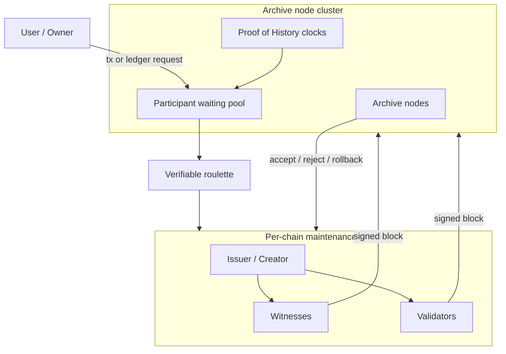

# Decentralization Cluster Multi-Chain

## Parallel Atomic Distributed Ledger Expansion (CoNET-DLE)

**Author:** Peter Xie  
**First draft:** 2023  
**Revision:** 2026-08-11o (BIP-47 / BIP-352 / ERC-5564 receive-code predict-*n*; client-only; not tip/archive/5-validator — §4.5)

**Paired translation (must stay in sync):** [`Decentralization Cluster multi-chain.zh-CN.md`](./Decentralization%20Cluster%20multi-chain.zh-CN.md)  
**Sync rule:** `.cursor/rules/conet-layer2-whitepaper-bilingual-sync.mdc`

---

## Abstract

**CoNET Distributed Ledger Expansion (CoNET-DLE)** is a clustered, lightweight **Layer-2-style ledger-expansion** system: **infinitely parallel, event-based atomic chains**, each block secured by a **committee of 5 validators** drawn by **archive nodes** from the **on-demand miner waiting queue**—not by a single global tip.

- **Parallelism:** the number of concurrent chains is unbounded in principle; more staking capacity → more maintainable chains.
- **Atomic (per chain):** tip advance requires full agreement of that chain’s current maintenance group.
- **Event-only blocks:** **no event ⇒ no block.** Empty-slot mining is forbidden.
- **L1 birth certificate:** creating a new chain **must** mint a **unique NFT** on CoNET L1; that NFT binds class (**asset**, **storage**, or **trade**), ownership, and **which archive cluster** hosts it (trailing residue of the token id).
- **Asset cap stays live:** each asset event **revalues** the tip; if balance **> 100 USDC**, outbound / excess **requires new chain(s)** (§4.6).
- **Trade-class (atomic NFT-style sale):** users open a **trade** chain to list an existing **asset** or **storage** chain; listings are **atomic only** (quote ≤ **100 USDC**-equivalent); **no large orders**. On settle, **subject chain L1 NFT ownership** moves to the buyer; the **trade** chain **closes** (§4.7).
- **Storage-class creator economy / private copyright delivery:** same thesis as Beamio **`CopyrightContentModule`**: owner fragments + seals a private assembly index to authorized DePIN miners; tip/L1 holds only hashes; buyers pay **conet-GB**, bind buyer PGP; **first-completer** miners deliver buyer-bound ciphertext; short-lived access URLs + periodic storage fees; plaintext never on-chain (§4.8).
- **Copyright ZERO / version tree:** storage tips form a **lineage tree** (original + modifiers); each branch point is an **independent L1 NFT** listable via trade-class; the tip stores **social history** (likes, comments, citations) as a **Web of Trust** signal for auction valuation (§4.9).
- **Storage sales ledger:** each storage tip keeps an append-only **sales-revenue journal** and **references** the parallel **asset-class** tip txs that actually move value (§4.10).
- **Archive-plane fission:** as archive participants grow, the L2 archive plane **fissions** into **2 → 4 → 8 → …** parallel clusters (powers of two), each like a load-balanced **cluster** with higher aggregate bandwidth (§5.2).
- **Fees in conet-GB:** all DLE service fees settle in **conet-GB** (CoNET L1 `GBToken` ERC-20) as the unified currency.

**Transport premise:** CoNET-DLE is loaded on **CoNET DePIN**. Control and data-plane gossip use **wallet addresses (EOA) as network identity**, not IP addresses. Messages are end-to-end encrypted (OpenPGP) and relayed through entry/mailbox nodes that **cannot read plaintext**.

**Natural privacy (product freeze):** privacy is **dual**—**communication privacy** (DePIN wallet-address gossip + OpenPGP) **and asset privacy**. On L2 ingress, the owner’s value is **already micro-fragmented** across **many wallet addresses**; only the **client** can recombine those fragments into one logical holding. The same dual privacy applies on **transfer**: encrypted task/comms paths plus multi-address send/receive. **Receive-code / stealth payment** reuses **existing privacy-transfer / stealth-address technology** (**BIP-47** / **BIP-352** / **ERC-5564** family): the payee shares one **public receive code**; the payer’s **client** predicts **n** receive addresses and sends **≤ 100 USDC**-class atomic quotas to them; **only the payee** can derive those private keys. This is **not** a duty of DLE tips, archive shards, or the **5**-validator committee—DLE only accepts the fragmented multi-address result and client-side recombination; it does **not** invent an on-chain “address oracle” (§4.5). Together this addresses classical blockchain **asset-linkage privacy** failures (§4.5, §7.6).

**Custody security from the same fragmentation:** because value is not concentrated under **one** EOA / **one** private key, compromise or coercion of a single key cannot seize the owner’s **entire** portfolio—asset security rises with the fragment set (§4.5, §12.9).

CoNET-DLE keeps blockchain-grade **immutability** while targeting continuous availability, linear scalability, flexible participation, and event-driven latency. Stake-based, group-local consensus removes the need for global PoW races. **As more miners join, more chains can be maintained concurrently and global security capacity rises**—the opposite of single-tip congestion.

**Thesis on the blockchain trilemma:** by combining **infinite parallel atomic tips**, **event-only blocks**, **small-group parallel consensus**, **≤100 USDC micro-fragmented assets**, and **role-based on-demand participants** (no full-history sync for every role), CoNET-DLE is designed so that **scalability, security, and decentralization reinforce each other** as participation grows—rather than forcing a permanent three-way trade-off (see §3.4).

This document is a design whitepaper for the **Decentralization Cluster / multi-chain** layer. Cryptography in §7 is restricted to **mature, production-proven primitives** (secp256k1 / EIP-191, OpenPGP, AES-GCM, SHA-256/Keccak-256, commit–reveal, optional ECVRF). It is complementary to CoNET DePIN / CoNET-SI and a CoNET **mainchain / registry**—not a replacement for a global PoS L1.

---

## 1. Introduction

As on-chain applications grow, more state must be recorded. Mainchain-centric consensus wastes compute when every participant races on one tip, and slow global block finality becomes the bottleneck. Many L1 and L2 designs still inherit a **single logical tip** (or a small set of shared tips), so they reintroduce the same congestion and fee pressure under load.

CoNET-DLE takes a different path: **shard by ledger**, not only by throughput tricks on one ledger. Each application or asset instance can own a **lightweight atomic chain** with its own issuer, witnesses, and validators—**infinitely many** such chains may run in parallel. Security and economic finality are reinforced by:

1. **Stake** of participants on CoNET.
2. **Random verifiable selection** (roulette over archive-node entropy) into **small** maintenance groups.
3. **100% group consensus** for new blocks (or dissolve and reselect).
4. **Archive node clusters** that store full state and perform quality checks / rollback.
5. **Mandatory CoNET L1 NFT** for every new chain: unique token id, **exactly one** of **asset / storage / trade** class, ownership, and (for asset class) **oracle-capped deposit ≤ 100 USDC-equivalent**—micropayment fragmentation that makes collusion of a small maintenance group uneconomic. **Trade-class** listings sell an existing asset or storage chain by transferring that subject NFT’s ownership on atomic settle (§4.7).

Staking miners choose how many chains to underwrite based on their compute and network capacity. Lightweight validators need not store full history, so participation can be on-demand—reducing the centralizing pressure of capital-heavy PoS and ASIC PoW monopolies.

**Deployment substrate:** the L2 does not invent a new IP overlay. It is **loaded on CoNET DePIN**, so every waiting-pool advertise, task offer, block proposal, and vote travels as **wallet-addressed, OpenPGP-encrypted gossip** (entry A → mailbox B; listen via entry C ≠ B). Cryptographic details are developed in **§7**.

---

## 2. Problem Statement

| Problem | Why it matters |
| --- | --- |
| Slow new-block consensus | Global tip agreement does not scale with demand. |
| Waste of computer resources | Idle or competing work on empty / contested tips. |
| High gas / fee pressure | One market for blockspace prices out small payments. |
| 51% / capital concentration | PoW and PoS tend toward resource monopolies. |
| Scalability bottleneck | Single-chain or single-rollup ceilings. |
| Centralizing consensus | Large validators / pools dominate selection. |

**Design goal:** keep decentralization and immutability, but make **parallel per-ledger consensus** the unit of scale—so that **more participants → more concurrent chains → stronger global security → lower barriers**, instead of **more load → higher fees → more centralization**.

---

## 3. Design Thesis

### 3.1 Parallel atomic ledgers

- **Infinite parallelism (design target):** the network hosts an **unbounded** set of independent atomic chains; capacity scales with staking participation, not with a shared global tip.
- **Atomic (per chain):** within one chain, a new block requires full agreement of the selected **small** maintenance group (issuer / creator, witnesses, validators as defined by that chain’s contract).
- **Bounded blast radius:** compromise or crisis on one chain does not halt unrelated chains.
- **Miner-scale growth:** each additional honest miner expands how many chains the network can underwrite **at the same time**; aggregate security capacity **increases** with participation.

### 3.2 Event-based block production

If there is no event (transaction / state-change / storage write request), **no new block** is produced. **No event ⇒ no block.** This forbids empty-block overhead and matches payment / receipt / storage workflows. Effective **transactions-per-second bandwidth** is the sum of active event streams across parallel tips—not the throughput of one global slot clock.

### 3.3 Clustered maintenance groups (5 validators per block)

A chain is not secured by “the entire network voting every slot,” but by a **small, randomly drawn committee of 5 validators** for the **current block**, plus archive-cluster quality check and archival.

**Canonical per-block path (product freeze):**

1. A **new event** appears on the chain (**no event ⇒ no block**).
2. The hosting **archive node(s)** draw **5** validators from the **on-demand miner waiting queue**.
3. That **5-validator group** **votes** and **submits** the block / attestation set.
4. Archive nodes **verify** the submission; if **qualified**, they **archive** (finalize and store); else reject / reselect (§6.3, §9).

Dishonest or timed-out members are replaced; stake is at risk. Many such 5-validator groups run **in parallel** across chains, so confirmation latency is a **tiny committee** vote—not a planet-wide slot.

### 3.4 Resolving the blockchain trilemma

Classical blockchain design is often framed as an **impossible triangle**: at most two of **decentralization**, **security**, and **scalability**. CoNET-DLE’s product thesis is that this L2 **breaks that forced trade-off** by changing the unit of consensus from “one shared tip” to “many event-driven atomic tips”:

| Trilemma corner | Classical single-tip pain | CoNET-DLE response |
| --- | --- | --- |
| **Scalability** | One tip’s TPS / gas market saturates | **Event-based** blocks + **small-group parallel consensus** across unbounded chains + **archive-plane fission** (2/4/8… by NFT residue, §5.2) → aggregate bandwidth and confirmation speed grow with active ledgers, miners, and archive shards |
| **Security** | Scaling often weakens economic finality or trusts sequencers | More miners → **more concurrent maintenance capacity** and a larger roulette set → **stronger global security**; per-chain blast radius stays bounded; **≤100 USDC micro-fragmentation** drives **collusion motive toward zero** for any one maintenance group; **multi-key fragments** shrink single-key seizure blast radius (§4.5) |
| **Decentralization** | Full-node / validator hardware & capital barriers concentrate power | **Role-split** participants (issuer / witness / lightweight validator / archive) **need not sync all chain data**; they **join and leave consensus on demand** → lower participation threshold → a **more dispersed, healthier** network over time |

**Virtuous cycle:** more dispersed miners → more parallel atomic chains underwriteable → higher event TPS and faster tips → micro-assets remain uneconomic to attack → still lower barriers attract more participants. Security, scale, and decentralization **co-scale** instead of trading off.

### 3.5 Relation to CoNET stack (conceptual)

```text
+-------------------------------------------------------------+
| CoNET mainchain / registry (identity, stake, NFT, AddressPGP)|
+-----------------------------+-------------------------------+
                              | anchors / fees / NFT / PGP registry
+-----------------------------v-------------------------------+
| CoNET-DLE L2 - Decentralization Cluster (this paper)         |
|  many asset / storage / trade chains x concurrent maintenance groups|
+-----------------------------+-------------------------------+
                              | encrypted gossip (wallet != IP)
+-----------------------------v-------------------------------+
| CoNET DePIN / CoNET-SI - wallet-address P2P + entry/mailbox |
|  OpenPGP ciphertext; A->B send; C->B listen; zero-trust hops|
+-------------------------------------------------------------+
```

**Privacy by construction:** L2 roles do not dial each other by IP. They address **wallet / PGP identities**; DePIN relays forward ciphertext. Entry and mailbox nodes learn routing key IDs, not business plaintext or stable client IPs. Separately, **asset holdings are multi-wallet fragments** recombined only on the client (§4.5, §7.6).

Canonical product line: each ledger is an **L1 NFT–bound** chain of class **asset**, **storage**, or **trade** (asset tips ≤ **100 USDC** oracle valuation; trade listings are **atomic ≤ 100 USDC** quotes), maintained by a randomly selected small group, with **event-driven** blocks only.

---

## 4. System Overview

### 4.1 Chain creation gate (mandatory L1 NFT)

Creating a new DLE chain is **not** a free L2-only act. The creator **must first** obtain a **unique NFT** on **CoNET L1**. That NFT is the chain’s sole public identity for:

| Bound by L1 NFT | Rule |
| --- | --- |
| **Uniqueness** | One NFT id ↔ one DLE chain; no anonymous genesis without L1 mint. |
| **Class (ternary)** | At mint / configure time the chain is fixed as **exactly one** of: **asset-class**, **storage-class**, or **trade-class**. |
| **Ownership / archive placement** | Owner, fee payer hooks, and archive-group mapping derive from the NFT id. **Canonical owner** of any DLE chain is **CoNET L1 `ownerOf(nftId)`**. |
| **Asset deposit (asset-class only)** | L1 assets are deposited as **ingress collateral / funding**; valuation uses the **L1 oracle**; total value **must not exceed 100 USDC-equivalent**. The **≤ 100 USDC** bound is **re-checked on every asset event** via oracle revaluation; over-cap outbound requires a **new chain** (§4.6). |
| **Trade subject (trade-class only)** | Genesis binds a **subject** asset- or storage-class NFT id to list for sale; settle transfers **that subject’s** L1 ownership (§4.7). |

**Anti-collusion via micro-fragmentation:** by capping each asset chain at **≤ 100 USDC** and encouraging many tiny parallel ledgers, the expected profit from bribing or capturing a **small** maintenance group stays below the stake / reputation cost of attack—**fragmentation and micropayment scale** are first-class security, not merely UX. The same fragmentation is the substrate of **asset privacy** and of **custody security** (no single private key holds the whole portfolio—§4.5). Runtime **revalue + spillover mint** (§4.6) keeps the cap honest after oracle moves.

### 4.2 Three classes of chains

| Class | Purpose | Ingress / fee rules |
| --- | --- | --- |
| **Asset-class chain** | Transferable value ledger bound to the L1 NFT | Deposit **L1 assets** as chain funding; **L1 oracle** values the deposit; **hard cap ≤ 100 USDC-equivalent**. On every **new event**, the transfer / balance is **revalued** (§4.6). From genesis onward, every **transfer event** pays **0.01%** of the transferred value to the **current 5-validator consensus group**, settled in **conet-GB**. |
| **Storage-class chain** | Data / logs / **creator content** with paid access; **Copyright ZERO** version nodes; **sales books** | Owner may embed **fragmented encrypted content** + access policy (§4.8). Tips may fork into a **version tree** (§4.9). Tip records **social events** and an append-only **sales-revenue ledger** that links to parallel **asset-class** txs (§4.10). Access / fees in **conet-GB**; unpaid → **new blocks stop**. Buying **access** ≠ buying the NFT; selling a branch uses trade-class (§4.7). |
| **Trade-class chain** | Short-lived **atomic listing / escrow** for selling an existing **asset** or **storage** chain (NFT-style whole-ledger sale) | User-opened; binds **subjectNftId** at genesis; listing quote **≤ 100 USDC-equivalent**; **large orders forbidden**. On settle: **subject L1 NFT ownership → buyer**, payment to seller, then **trade tip closes** (§4.7). Fees in **conet-GB** (listing / settle hooks). |

Class is chosen when the L1 NFT is created / configured and is **immutable** for that NFT. **No dual-class** chain: a tip cannot be asset and trade at once. Selling “more than one fragment” means **multiple atomic trade listings**, each ≤ 100 USDC—not one oversized order.

### 4.6 Asset-class event revaluation & spillover new chain

Product freeze for **asset-class** tips (keeps the ≤ **100 USDC** invariant live, not only at mint):

1. On every **new event** (especially a **transfer**), the chain **revalues** its balance / the proposed transfer with the **L1 oracle** (same oracle family as ingress).
2. If the revalued **chain balance ≤ 100 USDC-equivalent**, the transfer may proceed on **this** chain under normal §6.3 rules (including the **0.01%** fee in **conet-GB**).
3. If the revalued **chain balance > 100 USDC-equivalent**, the **outbound portion** that would leave this tip (or the excess over the cap) **must not** stay as a single over-cap transfer on this chain: the owner / client **must create one or more new asset-class chains** (new L1 NFT + oracle-capped deposit ≤ 100 USDC each) and move that outbound / excess value onto those new tips.
4. Consensus and archive reject an asset transfer event that would finalize a tip with revalued balance **> 100 USDC** or that tries to send the over-cap slice without a matching **new-chain** birth certificate.

Oracle appreciation after mint is the typical trigger: ingress was ≤100 at genesis, but a later event’s revaluation can push the economic balance over the cap—hence **revalue on event + spillover mint**, not a one-time check.

### 4.7 Trade-class: atomic listing & subject NFT ownership transfer

Product freeze for **decentralized atomic sales** of whole ledgers (analogous to **NFT trading** of the chain’s birth certificate):

1. **Subject:** an existing **asset-class** or **storage-class** chain identified by its **L1 NFT** (`subjectNftId`). The seller must be the current L1 owner of that subject.
2. **Open listing:** the seller **mints a trade-class** L1 NFT / DLE tip whose genesis binds `subjectNftId`, quote currency/amount (**oracle-valued ≤ 100 USDC-equivalent**), and escrow rules. **Atomic orders only—no large orders** (quotes or fills above the cap are rejected).
3. **Listing freeze:** while the trade tip is **Open** / **Locked**, the subject chain’s L1 NFT is **frozen against transfer**, and asset-class subjects reject outbound drains that would empty the tip before settle (archive / registry enforce).
4. **Match & settle (atomic):** buyer payment escrow and **L1 `transferFrom` / ownership update of `subjectNftId` to the buyer** succeed in one settlement event set, or the tip **rolls back**. Canonical ownership of the **subject** after success is **buyer = L1 `ownerOf(subjectNftId)`**. The **subject asset/storage tip continues** under the new owner (it is **not** closed).
5. **Close trade tip:** on **Settled**, **Cancelled**, or **Expired**, the **trade-class** chain **closes**: no further blocks; archive retains the proof trail. Closing the trade tip does **not** delete or halt the subject ledger.
6. **What is sold:** the **subject** NFT / ledger—not the trade-order shell. Transferring ownership of the trade NFT itself is not the product path for buying the listed chain.
7. **Portfolio sale:** selling many ≤100 USDC fragments requires **many** trade listings (one subject tip each), consistent with micro-fragmentation and anti-collusion (§4.1, §4.5).

**Lifecycle (trade tip):** `Open → Locked → Matched → Settled → Closed` (or `Cancelled` / `Expired → Closed`).

### 4.8 Storage-class creator economy (fragmented content + GB access)

Product freeze for **creator-economy storage tips** (paid content access without transferring the storage NFT):

1. **Publish (owner):** at create / configure time the owner splits the work into **encrypted fragments**, builds an **assembly index** (fragment hashes + order + fragment keys / unwrap material), and **seals that index to authorized delivery miners**—not to the tip, not to archive, not to the 5-validator committee. Fragments and the encrypted index are stored on **Beamio IPFS** (`keccak256(utf8(payload))` fragment hashes). The storage tip records **only public commitments**: `contentIndexHash`, `authorizedNodeKeyHash[]` (AddressPGP / Guardian node key ids), **access price in conet-GB**, access duration, and optional retention policy. Plaintext content **and plaintext index** **never** sit in tip state or in consensus votes.
2. **Private index handoff (how miners get the secret without tip exposure):**
   | Layer | Holds | Who can read |
   | --- | --- | --- |
   | **Storage tip** | `contentIndexHash` + authorized key-hash set + prices | Everyone (commitment only) |
   | **IPFS** | OpenPGP (or hybrid) **ciphertext of the assembly index** | Only miners whose PGP was a recipient |
   | **IPFS** | Encrypted content fragments | Useless without index unwrap material |
   | **Miner local** | Decrypted index + temporary plaintext during assembly | That authorized delivery miner only |
   | **Buyer package** | Ciphertext under **buyer PGP** | Buyer only |

   - **Encryption mode (product default):** **OpenPGP multi-recipient** — one index ciphertext package whose recipients are the owner-chosen authorized miner PGP keys (any one of them can decrypt). Optional alternative: **per-miner copies** (`nodeKeyHash → indexCipherHash` manifest) when the owner wants independent revoke/re-seal without re-encrypting a shared blob.
   - **Configure path:** owner client (1) builds plaintext index locally; (2) encrypts to authorized keys; (3) uploads ciphertext → obtains `contentIndexHash`; (4) submits a tip **Configured** event carrying **only** the hash + authorized set + price policy. Tip gossip / DePIN never carries the decryptable index as tip payload.
   - **Trust boundary:** authorized delivery miners **are** trusted to see plaintext while assembling (delivery custody). Tip consensus validators and archive peers verify **hashes and events only**—they have **no** index private key and **must not** require plaintext for quality-check. Owner mitigates miner leak risk by: small authorized set, stake / reputation selection, rotation (re-encrypt index to a new set + new `contentIndexHash`), watermarks, and revoke events that drop a `nodeKeyHash`.
   - **No “submit secret on tip” anti-pattern:** rejecting any program that puts raw index JSON, fragment AES keys, or unencrypted assembly instructions into tip blocks or public votes.
3. **Access rights:** the owner sets who may purchase (open / allowlist), the **conet-GB** price, and expiry. Changing price / policy is an event on the storage tip (subject to the tip’s VM rules). Re-sealing the index (new authorized set) is a **Configured** update with a new `contentIndexHash`.
4. **Purchase (visitor):** the buyer pays the owner-set **conet-GB** price, binds **buyer PGP** (`buyerPgpKeyHash` + AddressPGP-resolvable public key), and opens a purchase event. Payment and PGP binding are verified before delivery starts. **Access purchase does not transfer** storage-chain L1 ownership (contrast §4.7). The purchase event is **public metadata** (who bought, buyer key hash, deadline)—it does **not** re-transmit the private index.
5. **Delivery (authorized miners):** miners listen for purchase events (DePIN gossip / tip feed). A miner that holds a matching authorized key:
   - fetches the index ciphertext from IPFS via `contentIndexHash`;
   - decrypts the index with **its** PGP private key (off-tip);
   - fetches fragments from IPFS and **reassembles** the content locally;
   - **re-encrypts** the delivery package under the **buyer’s PGP**;
   - uploads the buyer-bound ciphertext to IPFS and records `buyerEncryptedContentHash` (plus buyer-bound index pointer as required by the tip program).
6. **First-completer:** the first valid miner completion locks the delivery record for that purchase; later completers must fail or no-op. Consensus / archive attest the purchase and completion events via the normal **5-validator** path; plaintext must not appear in public votes.
7. **Buyer restore:** only the buyer, with their PGP private key, can decrypt the buyer package and use the **buyer-bound index** to restore the original content. Relays, archive peers, and unrelated miners see ciphertext / hashes only.
8. **Currency:** access price and related content-delivery fees are denominated in **conet-GB** (same unified DLE fee currency). Tip retention / unpaid halt rules from §4.2 still apply to storage maintenance fees.
9. **Expiry / retention:** after `accessExpiresAt` (and/or unpaid `storagePaidUntil`), miners must stop serving access URLs; expired purchases cannot reopen without a new pay event.
10. **Tip / module state (CopyrightContentModule-aligned):** storage programs (and the Beamio catalog module when used as an L1-adjacent surface) keep **bounded** fields only—**no** unbounded on-tip arrays of buyers, comments, or URLs:

| Field | Meaning |
| --- | --- |
| `contentIndexHash` | IPFS hash of the **encrypted** assembly index (`keccak256(utf8(payload))` → `bytes32`) |
| `authorizedNodeKeyHash[nodeKeyHash]` | Owner-chosen delivery miner / Guardian PGP key hashes |
| `purchaseId` | Derived id (`tipNft` / card + buyer + nonce) for one access purchase |
| `buyerPgpKeyHash` | Buyer PGP bound at purchase (AddressPGP-resolvable) |
| `accessExpiresAt` | Owner-set access deadline for that purchase |
| `storagePaidUntil` | How long the completer node is paid to retain / serve |
| `completedByNodeKeyHash` | First-completer; `0` until locked |
| `buyerEncryptedContentHash` | IPFS hash of buyer-PGP ciphertext package |

11. **Normative events (same semantic names as CopyrightContentModule):**
    - `CopyrightContentConfigured` — index hash, authorized set, price / policy;
    - `CopyrightPurchaseOpened` — `purchaseId`, buyer, `buyerPgpKeyHash`, `accessExpiresAt`;
    - `CopyrightDeliveryCompleted` — `purchaseId`, `nodeKeyHash`, `buyerEncryptedContentHash`;
    - `CopyrightStorageFeeCharged` — periodic retention fee to the completer (DLE: **conet-GB**; Beamio catalog path may mirror with B-Unit indexer rows).
12. **Buyer-bound purchase integrity:** purchase must be signed by the buyer EOA/AA; signature binds at least `buyer + tipNftId + buyerPgpKeyHash + deadline + nonce` so a third party cannot swap the delivery PGP after payment.
13. **Short-lived access URLs:** after `Completed`, serving miners (or a thin proxy) issue **time-limited HMAC / signed URLs** that re-check chain/tip expiry and buyer authorization on each issue. **Never** expose a permanent naked `getFragment` URL as the product access path.
14. **Storage / retention fees (completer economics):** owner pays the **first-completer** (or active authorized set) **periodically** to keep serving; update `storagePaidUntil`. Prefer cycle renewals over perpetual prepay. Unpaid → stop URLs; proven non-serving nodes may be revoked from `authorizedNodeKeyHash`. Settlement of false “complete” claims SHOULD wait for buyer-accessible confirmation, a challenge window, or access heartbeats—not instant unconditional payout on first report alone.
15. **Privacy & copyright thesis (what this design achieves):**

| Goal | Mechanism |
| --- | --- |
| **Decentralized delivery** | Any authorized DePIN miner may race; first valid completer locks; no central CDN required |
| **Copyright control** | Owner sets price, authorized set, expiry; access ≠ NFT ownership; forks are new NFTs (§4.9) |
| **Content privacy (public observers)** | Tip/L1: hashes only; IPFS: ciphertext; relays: OpenPGP E2E; 5-validators never see plaintext |
| **Buyer privacy of payload** | Final package encrypted only to **buyer PGP** |
| **Teaser vs secret** | Public metadata / teaser stays outside delivery state; dynamic delivery hashes stay in tip/module—not rewritten into marketing metadata JSON |
| **DoS-safe tip** | Counts + hashes + mappings on-tip; comment bodies / URL lists off-tip (IPFS / indexer) |

    **Honest limit:** authorized delivery miners see plaintext during assembly (trusted custody set). Default public purchase events may still link **buyer address ↔ content id**; stronger unlinkability (blinded purchase) is a future option, not v1 consensus.

16. **Two surfaces, one thesis:**

| Surface | Role |
| --- | --- |
| **DLE storage-class tip VM (§4.8)** | Native Copyright ZERO / creator economy on parallel atomic tips; fees in **conet-GB**; 5-validator + archive finality |
| **Beamio `CopyrightContentModuleV1`** | Same state machine on BeamioUserCard / issued-NFT catalog paths (Cluster precheck + Master write); **does not** replace DLE tips—product bridge / L1-adjacent catalog delivery |

    Card + Module extension stays within Factory-stable boundaries; DLE tips remain isolated programs. Indexer may book access sales on the storage tip (§4.10) independently of catalog metadata.

**Lifecycle (content access):** `Configured → Purchased → Delivering → Completed` (or `Expired` when `accessExpiresAt` / unpaid `storagePaidUntil`).

**Risk → mitigation (normative):**

| Risk | Mitigation |
| --- | --- |
| Fake first-completer | Lock `completedByNodeKeyHash`; delay storage fee until challenge / heartbeat |
| Buyer PGP swap | Purchase signature binds `buyerPgpKeyHash` |
| Authorized miner leaks index | Small trusted set; rotate / per-miner seal; watermark; revoke |
| URL replay | Short-lived signed URL + expiry checks |
| Paid but not serving | Periodic `storagePaidUntil`; challenge; revoke |
| Tip bloat | No infinite on-tip buyer/URL arrays |
| Plaintext in logs / tip | Forbidden; only hashes on-chain |

**Separation of concerns:**

| Action | Moves |
| --- | --- |
| Pay **conet-GB** for access (§4.8) | Buyer-bound ciphertext package; **not** storage NFT owner |
| Trade-class sell storage tip (§4.7) | **L1 NFT ownership** of the whole storage ledger (any tree node) |
| Fork / modify content (§4.9) | New storage NFT + tip; parent lineage preserved |
| Record sale / link asset tx (§4.10) | Storage **revenue journal** row + pointer to parallel **asset-class** tip event |

### 4.9 Copyright ZERO: version tree, social history & Web of Trust valuation

Product freeze mapping storage-class tips to a **Copyright ZERO**-style creative graph (versioned works + attributable social proof for markets):

1. **Version tree:** each storage tip is a **node** in a directed lineage. The **root** is the original creator’s tip / L1 NFT. A **modifier** (derivative, edit, remix, localization, etc.) **forks** by minting a **new storage-class L1 NFT + tip** that binds:
   - `parentNftId` (immediate parent);
   - optional `rootNftId` (tree root);
   - `lineageHash` / content delta or new `contentIndexHash` (§4.8);
   - `modifier` identity (EOA / AddressPGP).
   The parent tip is **not** overwritten; history is append-only. The tree may grow arbitrarily deep / wide under retention fee rules.
2. **Each branch point is an independent NFT:** every node (root or branch) has its **own** L1 NFT and may be listed via **trade-class** (§4.7) independently of siblings or parent. Buying a branch transfers **that node’s** ownership—not the whole tree—unless separate listings cover other nodes.
3. **Social / citation ledger on the tip:** storage programs accept attested events such as:
   - **like** / unlike (or one-way like with anti-spam rules);
   - **comment** (hash of comment body + optional IPFS fragment; signer-bound);
   - **citation / reference count** (another tip or external id references this node);
   - optional **share / view** counters if product-enabled.
   These are **first-class tip history**, not off-chain scrapes. Fees for social writes (if any) settle in **conet-GB**.
4. **Web of Trust (WoT) basis:** valuation inputs are not raw counts alone. Markets and indexers weight signals by **who** signed them—wallet reputation, AddressPGP identity, historical stake / activity, and graph edges among signers. Example: a **like** or **comment** from a high-trust public figure (illustratively “Musk”) is a stronger auction signal than an anonymous spam wallet. DLE records the **signed event**; **WoT scoring** may be computed by open indexers / auction venues on top of that immutable history—consensus does not invent a single global “price oracle” from likes.
5. **Auction / market use:** trade-class listings and external auction UIs SHOULD surface, for each subject storage NFT:
   - tree position (root / depth / parent);
   - social histogram (likes, comments, citations) with **signer identities**;
   - access-economy metrics if configured (§4.8 purchase count—careful of privacy);
   as **trust-weighted evidence** for fair discovery and bidding—not as guaranteed floor prices.
6. **Separation:**
   | Layer | Role |
   | --- | --- |
   | Content ciphertext + GB access (§4.8) | Who may **read** the work |
   | Version tree + branch NFT (§4.9) | Who **owns / forks** which edition |
   | Social / WoT history (§4.9) | Public **reputation graph** for valuation |
   | Sales-revenue journal (§4.10) | Books for what was sold and which **asset-class** txs paid |
   | Trade-class settle (§4.7) | Atomic **ownership transfer** of a chosen node NFT |
7. **Integrity:** social and fork events are tip blocks under §6.3 (event-only, 5-validator + archive). Spoofed “celebrity likes” fail without a valid EIP-191 / AddressPGP-bound signature from that wallet. Tip state stores counts + event hashes; unbounded comment bodies live in IPFS fragments, not infinite on-tip arrays.

**Lifecycle (tree node):** `Minted (root|fork) → Social/content events… → (optional) Listed via trade → Settled under new owner`; the node tip **continues** after ownership change.

### 4.10 Storage sales-revenue ledger & parallel asset-class txs

Product freeze: a storage tip is not only content + social history—it is also the **sales books** for that creative node. Economic settlement may run on **separate, parallel asset-class** tips (micro-fragmented ≤ **100 USDC**); the storage tip **records** the sale and **points at** those asset txs.

1. **Sales-revenue journal (on the storage tip):** append-only events such as:
   - `saleKind`: `accessPurchase` | `nodeNftTrade` | `royalty` | `other` (program-defined);
   - `amount` + `currency` (typically **conet-GB** for access; oracle-valued units for NFT trade proceeds as configured);
   - `buyer` / `payee` / `feeSplit` (owner, modifiers, protocol share);
   - `storageEventId` (this tip’s sale event id);
   - optional privacy-safe aggregates (running `grossSales`, `netToOwner`) without putting plaintext content on-tip.
2. **Parallel asset-class link (mandatory when value moves on an asset tip):** each revenue row that corresponds to a value transfer MUST reference the parallel asset ledger:
   - `assetNftId` — the asset-class L1 NFT / tip that executed the payment or proceeds transfer;
   - `assetTxId` / `assetEventHash` — that tip’s transfer (or settle-linked) event;
   - optional `tradeNftId` when the sale was mediated by a trade-class tip (§4.7).
   Archive / indexers SHOULD reject a storage “sale booked” event that claims an asset settlement without a matching finalized asset-tip event (same economic amount / parties within program rules).
3. **Dual-track model (no free cross-chain calls):**
   | Track | Chain class | Holds |
   | --- | --- | --- |
   | **Books** | **Storage-class** | What was sold, to whom, fee split, lineage node, links |
   | **Cash / value** | **Asset-class** (parallel tip(s)) | Actual ≤100 USDC (revalued) transfers / balances |
   Isolation stays: tips do **not** call each other; linkage is by **committed references** inside each tip’s events + archive cross-check. Multiple asset tips may fund one storage node over time (fragmented proceeds).
4. **Access purchase (conet-GB):** GB paid for content access (§4.8) still writes a storage revenue row. If the product also moves oracle-valued collateral on an asset tip (escrow, tip, royalty pool), that asset tx is linked in the same row.
5. **Node NFT trade:** when trade-class settles ownership of the storage NFT (§4.7), the **subject storage tip** records a `nodeNftTrade` revenue/ownership-sale journal entry pointing at the trade tip settle event and any **asset-class** payment tip(s) used for the buyer’s funds.
6. **Royalty on forks (optional program rule):** a child tip sale (§4.9) may emit a royalty row on the **parent** (or root) storage tip, again linking the child sale’s asset tx ids—so the tree’s books stay auditable without merging tips.
7. **Auction / WoT use:** markets MAY show cumulative linked revenue (gross / net) next to social WoT signals (§4.9)—still evidence, not a consensus floor price. Failed or unlinked “sales” must not inflate books.

**Lifecycle (sale row):** `SaleOpened → (optional Locked) → Booked` with `assetTxId` (+ delivery complete for access) or `Cancelled` / `Expired` without booking.

### 4.3 Chain properties

- **Ownership** is defined by the **L1 NFT** (`ownerOf`) plus local genesis rules; trade settle updates **subject** ownership on L1 (§4.7). Storage **access** sales update purchase / delivery records, not NFT owner (§4.8). **Forks** mint a new NFT under the modifier; parent ownership is unchanged (§4.9). **Sales books** live on the storage tip and **reference** parallel asset-class txs (§4.10).
- **Limited functionality:** genesis embeds a **single predefined VM program** for that chain. Chains do **not** freely message each other (isolation by design). Trade tips bind a subject id; cross-tip matching uses index / matcher tasks, not free cross-chain calls. Storage creator programs host content-index hashes, purchase/delivery hooks, **parent lineage**, **social event** hooks, and a **sales-revenue journal** with **asset-tip references** (§4.8–§4.10).
- **Security source:** stake + random **small-group** selection + archive quality check + **L1 NFT** binding; asset chains additionally inherit the **≤ 100 USDC** economic bound; trade listings inherit the **atomic ≤ 100 USDC** quote bound; storage content delivery relies on **PGP fragmentation + buyer re-encryption** so public tip observers never receive plaintext (§4.8); social valuation relies on **signed WoT history**, not forgeable counters (§4.9); revenue claims require **linkable finalized asset-class events** (§4.10).
- **Unified fee currency:** **conet-GB** (CoNET L1 GBToken ERC-20)—not a per-chain fiat unit and not a second L2 gas token—including storage **access purchase** and optional social-write fees. Asset-class tips remain the parallel **value rails** under the oracle ≤100 USDC cap.

### 4.4 Role map



### 4.5 Natural privacy + custody security (client-only recombination)

Classical public ledgers leak **who owns how much** because a user’s economic identity collapses onto **one** (or few) addresses—and that same collapse means **one private key** can spend everything. CoNET-DLE’s product answer is **natural privacy** without requiring baseline ZK shielding, and **higher asset security** from the same fragment set:

1. **Ingress fragmentation:** when an owner moves value into L2 (asset-class deposit / mint path), the economic unit is **already fragmented**—many **≤ 100 USDC** atomic chains and/or balances under **many distinct wallet addresses**.
2. **Client-only ownership view:** only the **owner’s client** holds the mapping that **recombines** those fragments into a single logical asset for the user. Observers who scan the L2 tip set see many unrelated EOAs and tiny ledgers—not one consolidated portfolio.
3. **Communication privacy:** every L2 task, transfer instruction, and consensus message rides **CoNET DePIN** wallet-address gossip with OpenPGP E2E (§7)—relays never see plaintext amounts or intent.
4. **Transfer privacy (same dual stack):** a transfer simultaneously enjoys **comms privacy** and **asset privacy**. Value moves as **fragmented** events; the **recipient does not accept into a single wallet address** either—receipt is spread across addresses only the recipient client can reassemble.
5. **Receive-code → predict *n* addresses (existing stealth / privacy-transfer tech):** product wallets integrate **mature, already-specified** client cryptography—not a new DLE consensus feature:
   | Layer | Role |
   | --- | --- |
   | **Recipient** | Publishes one **public receive code** (payment code / silent-payment address / stealth meta-address) |
   | **Sender client** | From that code (plus protocol ECDH / ephemeral material), **predicts *n* receive addresses** and pays each with a **≤ 100 USDC**-class atomic fragment (new asset tip or balance slice as required by §4.6) |
   | **Recipient only** | Derives the **private keys** for those addresses and recombines fragments in the client map |
   | **DLE tip / archive / 5 validators** | See ordinary multi-address transfer events + hashes; **do not** generate, assign, or “oracle” receive addresses |

   **Prior art (normative family, not reinvented on tip):** **BIP-47** reusable payment codes (static code → large address sequence after ECDH), **BIP-352** Silent Payments (static code → sender-derived one-time outputs; recipient-only spend key), **ERC-5564 / ERC-6538** stealth meta-addresses (same ECDH stealth pattern on EVM). Implementations MAY pick one profile; the whitepaper freezes the **product semantics** above.

   **Hard boundary:** CoNET-DLE **does not** add an on-chain address oracle, archive-assisted address factory, or validator-mediated key exchange. Privacy-transfer derivation stays in the **wallet / client**; DLE only **carries the fragmented result** (many EOAs / tips + client-only recombination).
6. **Custody security (no single-key total control):** fragments are keyed by **distinct private keys**. Theft, phishing, or coercion of **one** key exposes at most that fragment’s slice—not the owner’s **entire** portfolio. Asset security therefore **rises with fragmentation**, complementary to the ≤100 USDC anti-collusion bound.
7. **Outcome:** chain observers cannot trivially link “person ↔ total wealth” or “payer ↔ payee”; attackers cannot trivially drain “all wealth from one key”—the paper’s claim for **blockchain asset privacy** and **stronger custody** at the product layer (§7.6, §12.9).

---

## 5. Roles

### 5.1 Pledge archive nodes

- Global **full nodes** for the DLE plane: store chains and complete state needed for quality checks.
- Perform **final quality check** on deposited blocks: accept, or **dissolve the group** and organize rollback / re-consensus.
- Peer networking among archive nodes is primarily for **archive discovery and archive consensus**; they do not freely accept arbitrary role-node gossip as peers.
- Expose **RPC** only to authorized participants and chain owners.
- Run **Proof of History (PoH)** sequences locally to timestamp and order waiting-pool events (see §7).

### 5.2 Archive node groups (clusters) — power-of-two fission

Archive nodes register on CoNET via **NFT**, each obtaining a unique token ID. As **archive participants increase**, the **entire L2 archive plane** does **not** stay one monolithic cluster: it **fissions** into **parallel cluster-like shards** so load and gossip bandwidth scale with participation.

**Canonical fission ladder (product freeze):**

| Archive-plane width \(S\) | Chain / archive placement key | Meaning |
| --- | --- | --- |
| **2** | `tokenId mod 2` | Trailing parity — **even / odd** residue of the NFT id |
| **4** | `tokenId mod 4` | Trailing residue class **mod 4** |
| **8** | `tokenId mod 8` | Trailing residue class **mod 8** |
| **\(2^k\)** (\(k \ge 4\)) | `tokenId mod 2^k` | Same rule continues: **16 / 32 / …** as archive population warrants |

- **Trigger:** when archive membership (and sustained load) crosses design thresholds, the plane upgrades \(S \leftarrow 2S\) (2→4→8→…). Each step **doubles** the number of parallel archive clusters.
- **Deterministic routing:** every **chain NFT** and every **archive NFT** maps to shard index \(i = \mathrm{tokenId} \bmod S\). That shard is the only archive cluster authorized to host that chain’s waiting queue, draw the **5** validators, quality-check, and archive (§6.3).
- **Load balance & bandwidth:** fission yields **cluster-style parallel capacity**—independent waiting queues, PoH ticks, and archive consensus per shard—so aggregate **event bandwidth** grows with \(S\), not with a single archive gossip mesh.
- **Membership:** archive nodes serve the shard matching their own archive NFT residue (or an explicit rebalance rule that preserves \(i = \mathrm{tokenId} \bmod S\)). New archives join under the current \(S\); after a fission, remapping is deterministic from the same token ids—no manual reassignment of chain ownership.
- **Economics:** smaller per-shard cohorts can raise per-node fee share; that pressure **aligns** with fission (more shards → more parallel tips underwritable).

### 5.3 Pledge witnesses

- Participate across the **full lifecycle** of a given chain.
- Store **all data** of that chain (chain-local full participants).
- Dishonesty → removal from the chain; stake / income at risk.
- Stake size limits how many chains a witness can underwrite concurrently.

### 5.4 On-demand validators (waiting queue)

- **Lightweight** miners: need not store full chain history.
- Advertise readiness into the **on-demand miner waiting queue** hosted / ordered by archive nodes (§8).
- May be drawn for a **single block** as one of **exactly 5** committee members, then leave.
- Enable on-demand decentralization without storage monopolies.

### 5.5 Issuer / creator (optional proposer role)

- For genesis or when a designated proposer is required: drawn by roulette among staking miners, or one of the 5 may act as block assembler per contract rules.
- Executes the chain’s predefined smart-contract / VM logic to assemble the candidate block that the **5-validator group** then votes on.
- After votes, the submission is deposited to the **archive** for quality check—not finalized by the committee alone.

---

## 6. Consensus Model

### 6.1 Per-chain consensus rule

- For each **event-driven** block: the maintenance committee is **exactly 5 validators**, drawn by the hosting **archive** from the **on-demand miner waiting queue**.
- New block acceptance requires **100% agreement** of those **5** (full-group vote), then **archive quality check** before archival.
- If agreement or archive check fails (timeout, refuse-to-sign, conflicting signatures, archive rejection):

  1. **Dissolve** the current 5 for that tip.
  2. **Exclude** prior group members from the immediate reselection (anti-collusion).
  3. **Reselect** a new set of **5** from the waiting queue via verifiable roulette.
  4. Optionally **slash / redistribute** stake according to smart-contract rules.

### 6.2 Genesis block flow

1. User **mints / configures a unique CoNET L1 NFT** and selects **exactly one** class: **asset**, **storage**, or **trade**.
2. **Asset-class only:** deposit L1 assets; **L1 oracle** values them; reject if valuation **> 100 USDC-equivalent**.
3. **Trade-class only:** bind `subjectNftId` (existing asset or storage NFT owned by the seller); set atomic listing quote **≤ 100 USDC-equivalent**; reject oversized quotes (§4.7).
4. **Storage-class creator content (optional):** owner may attach `contentIndexHash`, authorized miner PGP key hashes, and **access price in conet-GB** (§4.8).
5. **Storage-class fork (optional):** if minting a branch, bind `parentNftId` / `rootNftId` / `lineageHash` for the Copyright ZERO version tree (§4.9).
6. User submits a **new ledger request** (referencing the NFT id + class + deposit / subject proof) to the request pool.
7. Roulette selects an **issuer** among staking miners; issuer runs the predefined contract to build genesis (global definitions for this chain, including fee hooks in **conet-GB**).
8. Hosting **archive** draws **5 on-demand validators** from the waiting queue (same committee size as later blocks); optional issuer assembles genesis.
9. The **5** vote and submit genesis attestations.
10. Archive cluster **verifies** and, if qualified, **archives** finalized genesis.

### 6.3 New block flow (canonical)

1. A **new event** is committed on the chain. **If there is no event, no block is produced.**
2. **Asset-class only — revalue:** run **L1 oracle** revaluation of chain balance / transfer (§4.6). If revalued balance **> 100 USDC**, require **spillover new chain(s)** for the outbound / excess portion before this tip may accept the transfer; otherwise reject.
3. **Trade-class only — listing invariants:** reject events that raise the quote above **100 USDC**, unfreeze the subject NFT without cancel/settle, or attempt settle without atomic payment + **subject ownership transfer** (§4.7). After **Closed**, refuse all new blocks.
4. **Storage-class only — content access:** purchase events require **conet-GB** payment + **buyer PGP** binding; delivery-complete events require a valid authorized-miner first-completer proof (`buyerEncryptedContentHash`). Reject events that would put plaintext content into tip state (§4.8).
5. **Storage-class only — social / fork:** like / comment / citation events require a valid signer binding (EIP-191 / AddressPGP); fork genesis must reference an existing `parentNftId`. Reject unsigned “celebrity” attributions (§4.9).
6. **Storage-class only — sales books:** `SaleBooked` / revenue journal events that claim value movement MUST include `assetNftId` + `assetTxId` (or an explicit GB-only access sale with no asset rail); reject unlinked inflate-the-books rows (§4.10).
7. Hosting **archive node(s)** detect / accept the (cap-compliant) event and run verifiable roulette over the **on-demand miner waiting queue**.
8. Archive **draws exactly 5 validators** as the committee for **this chain’s current block**.
9. Candidate block is assembled (predefined chain VM / contract; optional issuer among staking miners or committee assembler).
10. **Fee collection (conet-GB):**
   - **Asset-class transfer:** **0.01%** of transferred value to the **5-validator consensus group**.
   - **Storage-class write / retention / access purchase / social:** content-based, owner-priced **access**, and optional social-write fees; unpaid retention → refuse new blocks; access price paid to owner (delivery miners may take a configured share).
   - **Trade-class listing / settle:** listing and settlement fee hooks (product parameters); unpaid listing fees may halt further trade events.
11. The **5-validator group votes** and **submits** the attestation / signed block to the archive path.
12. **Archive nodes verify** the vote set, block quality, (asset-class) **≤ 100 USDC** post-revaluation invariant, (trade-class) atomic settle / close rules, and (storage-class) purchase / delivery / social-signer / lineage / **sales↔asset-tx link** invariants (§4.8–§4.10).
13. If **qualified** → **archive** (finalize and store); if not → reject, dissolve the 5, reselect (§9).

### 6.4 Timeout and succession

| Fault | Recovery (design) |
| --- | --- |
| **Committee member timeout** | Exclude that validator; dissolve the 5 if quorum incomplete; archive **redraws 5** from the waiting queue. |
| **Refuse to sign** | Dissolve the 5; new random **5**; attackers lose stake; honest actors may be rewarded. |
| **Archive incomplete / failed quality check** | Reject tip; run rollback procedure (§9); prior 5 not eligible for immediate redraw. |

---

## 7. Cryptography (Mature Primitives Only)

This chapter specifies the cryptographic plane of CoNET-DLE **as an L2 loaded on CoNET DePIN**. Every construction below is chosen because it is already standardized or battle-tested in production systems. Novel ZK/SNARK stacks are **out of scope** for the baseline.

### 7.1 Threat model and privacy goals

| Adversary | Assumed capability | Goal of crypto layer |
| --- | --- | --- |
| Curious entry / mailbox hop | Sees ciphertext, timing, recipient **PGP key id** | Cannot read L2 business plaintext |
| Network observer on one hop | Sees IP of that hop’s TCP peer | Cannot map that IP to the **logical** sender/receiver wallet across A≠B / C≠B paths |
| Colluding minority of a maintenance group | Holds some secp256k1 keys | Cannot forge full-group block acceptance |
| Adaptive stake attacker | Buys stake, joins waiting pool | Cannot bias roulette without detectable commit failure / VRF verify fail |
| Offline storage attacker | Steals disk of one validator | Limited by per-task keys + no full-history requirement for validators |

**Non-goals (baseline):** perfect global traffic-analysis resistance against a world-wide passive adversary that correlates *all* entry nodes; content-hiding from parties who *must* see a block (witnesses of that chain). **Communication privacy** is **natural** from wallet-address gossip + E2E encryption (not mixnets). **Asset privacy** is **natural** from multi-wallet ingress fragmentation and client-only recombination (§4.5)—not from baseline ZK.

### 7.2 Primitive catalogue (implementation baseline)

| Layer | Primitive | Maturity anchor | Use in CoNET-DLE |
| --- | --- | --- | --- |
| Wallet identity | **secp256k1** ECDSA | Bitcoin / Ethereum | Node & user EOA |
| Auth signatures | **EIP-191** `personal_sign` | Ethereum wallets | Gossip commands, listen, task ACKs |
| Structured domain sigs (optional) | **EIP-712** | Ethereum dApps | Archive selection commits, stake ops |
| Directory | **AddressPGP** on-chain registry | CoNET production | Map EOA → user PGP + route key |
| Asymmetric message crypto | **OpenPGP** (RFC 4880 / **RFC 9580**) with **X25519** (+ Ed25519 where used) | OpenPGP ecosystem | Encrypt L2 envelopes to recipient |
| Symmetric AEAD | **AES-256-GCM** (NIST SP 800-38D) | TLS, age, modern apps | Optional bulk payload / session wrap |
| Session (listen path) | AES-256-CBC + explicit MAC *or* prefer GCM | Existing CoNET-SI listen | Long-lived listen channel key |
| Hashing | **SHA-256**, **Keccak-256** | NIST / Ethereum | PoH ticks, Ethereum digests, armor hashes |
| KDF | **HKDF-SHA256** (RFC 5869) | TLS 1.3, OpenPGP v6 | Derive task / fragment keys |
| Random beacon (primary) | **Commit–reveal** over secp256k1 | Classic distributed RNG | Archive roulette entropy |
| Random beacon (optional) | **ECVRF** (IETF draft / production VRFs) | Algorand, etc. | Unbiasable per-node ticket |
| Integrity of ciphertext | `keccak256(utf8(armor))` | CoNET fragment / ACK practice | Delivery dedup & mailbox ACK |

**Library guidance (non-normative):** `openpgp.js` / Sequoia / GPG for OpenPGP; `ethers.js` / libsecp256k1 for EIP-191; OpenSSL / BoringSSL / WebCrypto for AES-GCM; no custom ECC curves.

### 7.3 Identity: wallet address, not IP

1. Every L2 participant (user, issuer, witness, validator, archive operator process) is identified by an **EOA** `0x`-address derived from secp256k1.
2. The same EOA stakes on the mainchain and signs DePIN commands with **EIP-191**.
3. Each participant registers an **OpenPGP** certificate (encryption subkey = routing key id) in **AddressPGP**, bound to that EOA.
4. **IP addresses are transport accidents of a single hop**, never protocol identifiers. Clients **MUST NOT** require knowledge of peer IPs to join consensus.

```text
Logical identity:  EOA  ──registers──►  userPublicKeyArmored + routeKeyID
Gossip address:    encrypt(to = user PGP | route PGP)
Physical path:     client → entry A/C → mailbox B   (A,C ≠ B)
```

### 7.4 DePIN gossip crypto (send path S → A → B)

Aligned with CoNET DePIN zero-trust mailbox routing:

1. Sender builds an L2 envelope (JSON): `{ timestamp, text, from: EOA, signMessage }` where `signMessage = EIP-191(text)`.
2. `literal = base64(UTF8(JSON.stringify(envelope)))`.
3. OpenPGP-encrypt `literal` to the **recipient’s user PGP** (not to the mailbox route key for business payloads).
4. `POST { data: armoredCiphertext }` to one or more healthy **entry nodes A**, with **A ≠ B** (mailbox of recipient).
5. Entry **A** inspects only OpenPGP recipient key id → looks up mailbox **B** → forwards over node-to-node HTTP. **A does not decrypt.**
6. Mailbox **B** stores ciphertext; **B does not decrypt** business payloads. Only recipient R opens with user private key.

**L2 message types** carried in `text` (examples): waiting-pool advertise, task offer, block proposal digest, signature share, timeout complaint, storage-fee receipt. Application parsers unwrap nested JSON as needed.

### 7.5 DePIN listen crypto (R → C → B)

For long-lived participation (waiting pool / SSE push of tasks):

1. Participant encrypts a listen command to **mailbox B’s route PGP** (not user PGP):
   `{ command: 'mining', listenKind: 'dle' /* or product tag */, walletAddress, algorithm, Securitykey, timestamp }` signed EIP-191.
2. HTTP/SSE connects via healthy **entry C ≠ B**.
3. **B** decrypts listen command only (route key), binds `walletAddress` to the SSE, pushes later ciphertext.
4. Prefer **AES-256-GCM** for the session `Securitykey` channel; if compatibility requires AES-CBC, require an explicit HMAC-SHA256 over ciphertext (Encrypt-then-MAC). New deployments should standardize on GCM.

`listenKind` distinguishes DLE task streams from LayerMinus mining / chat, so eviction policies never cross pipes.

### 7.6 Why this yields “natural privacy” for the L2

Natural privacy is **two layers that always travel together** (§4.5):

**A. Communication privacy (DePIN transport)**

| Property | Mechanism |
| --- | --- |
| No IP identity | Peers addressed by EOA / PGP key id |
| Hidden sender ingress | Send via arbitrary entry **A**, not direct to B |
| Hidden receiver ingress | Listen via arbitrary entry **C**, not direct to B |
| Confidentiality | OpenPGP E2E; hops see only ciphertext |
| Authenticity | EIP-191 bind `from` to envelope `text` |
| Limited linkability of roles | Fresh task keys (§7.10); optional per-chain ephemeral PGP subkeys |
| Bounded metadata | Relays learn “cipher for key id K”, not payment amounts or block bodies |

**B. Asset privacy (multi-wallet fragments + client recombination)**

| Property | Mechanism |
| --- | --- |
| Ingress already fragmented | On deposit into L2, value is split across **many wallet addresses** / ≤100 USDC atomic chains |
| No public portfolio | Only the **client** recombines fragments into one logical holding |
| Transfer is dual-private | Same transfer uses encrypted DePIN paths **and** multi-address send |
| Recipient not a single address | Payee receives across **many** wallets; only the payee client reassembles |
| Public receive code → predict *n* | Client uses BIP-47 / BIP-352 / ERC-5564-family stealth / payment-code crypto (§4.5) |
| Atomic ≤100 USDC per predicted EOA | Sender pays each predicted address a micro-fragment; DLE tips enforce the cap (§4.6) |
| Recipient-only private keys | Sender can compute addresses, **not** spend keys |
| Not L2 infrastructure | Tip / archive / 5 validators do **not** run an address oracle |
| Breaks single-address linkage | Observers cannot treat one EOA as “the user’s whole asset” |
| No single-key total control | Distinct keys per fragment; one compromised key ≠ whole portfolio |

Residual transport metadata (size, time, key id) is accepted; mixnet-level padding is optional hardening. Asset privacy does **not** claim perfect anonymity against a client that leaks its recombination map—**custody of that map stays on the client**. Fragment keys still require ordinary wallet hygiene; the gain is **blast-radius reduction**, not magic immunity. Stealth / payment-code profiles are **wallet-layer** standards; DLE only **carries** the resulting fragmented tips.

### 7.7 Block and vote cryptography (consensus plane)

**Block digest**

```text
blockHash = keccak256(rlp_or_canonical_encode(header || txs || stateRoot))
```

Use a frozen canonical encoding (RLP or deterministic JSON + length prefixes). Prefer **Keccak-256** where Ethereum tooling is reused; **SHA-256** is acceptable if consistently used for PoH and digests—but **do not mix** digest functions for the same object.

**Per-member vote**

```text
vote = EIP-191( "CoNET-DLE/vote/v1" || chainId || chainNFT || height || blockHash || role || eoa )
```

Collect ECDSA signatures from **all** required members (issuer, witnesses, validators). Archive verifies:

1. `ecrecover` matches the roulette-selected set.
2. Set completeness = 100% of required roles.
3. `blockHash` matches recomputed digest from deposited body (or body availability proof).

**No custom BLS threshold crypto in baseline**—threshold BLS is mature in some stacks but adds operational complexity; **explicit multi-signature collection** of secp256k1 signatures is enough and already ubiquitous.

### 7.8 Verifiable roulette cryptography

#### 7.8.1 Primary: commit–reveal (recommended baseline)

For archive group size \(n\), round \(r\):

1. Each archive \(i\) samples \(s_i ← \{0,1\}^{256}\).
2. **Commit:** broadcast OpenPGP-encrypted (to archive peers) or gossip:
   `C_i = keccak256(s_i || eoa_i || r || groupId)` with EIP-191 attestation of `C_i`.
3. After commit cutoff (PoH tick / wall-clock bound), **Reveal** \(s_i\); peers check `keccak256(...) = C_i`.
4. Aggregate:
   `R = keccak256(s_1 || … || s_n || r || chainSeed)`
   Missing reveals → exclude that archive from reward for round \(r\); if too many missing, abort round.
5. Map \(R\) to waiting-pool ranks (Fisher–Yates or modular indexing over the PoH-ordered list) to pick issuer, witnesses, validators, standbys.

**Properties:** unpredictability before reveal; bias resistance if at least one honest \(s_i\); fully implementable with hashes + signatures only.

#### 7.8.2 Optional: ECVRF tickets

Each eligible staker publishes `ticket = VRF_sk(seed_r)`. Highest / hash-ordered valid tickets win roles. Verification uses standard ECVRF verify. Use as an **upgrade path** when stake-weighted selection must be unbiasable under adaptive participation; still gossip tickets over DePIN ciphertext channels.

#### 7.8.3 Selection log

Archive cluster appends `{ r, R, commits, reveals, selected[] }` to a **selection chain** (hash-linked SHA-256/Keccak). Entries are gossiped as L2 messages and mirrored on archive storage. Smart-contract genesis consumes `selected[]` only after archive attestation signatures.

### 7.9 Proof of History (ordering substrate)

Archive nodes maintain a local sequence:

```text
h_0 = IV
h_{t+1} = SHA-256(h_t)
```

Periodically publish `(t, h_t, eventDigest)` checkpoints. Waiting-pool join/leave events bind to the latest `(t, h_t)`. Peers verify a claimed interval by recomputing (or verifying checkpoints). This is **not** Solana consensus; it is a **verifiable delay / ordering aid** so archives agree on participant order without trusting NTP alone.

### 7.10 Task keys and witness storage

| Material | Derivation | Lifetime |
| --- | --- | --- |
| Task session key | `HKDF-SHA256(master = ECDH_or_shared, info = "dle|task|"‖taskId)` | Single block task |
| Chain witness store key | Derived from witness stake key + `chainNFT` | Chain lifetime |
| Delivery ACK id | `keccak256(utf8(openpgp_armor))` | Until ACK |

Validators **SHOULD** wipe task keys after vote. Witnesses retain chain data encrypted at rest with OS keystore / age / OpenPGP symmetric pack—implementation choice, not protocol-mandated.

### 7.11 Anti-lazy verification (false proof sampling)

For storage / PoRep-style checks: replication nodes occasionally submit a **false proof** with a hidden seed. Verifiers who accept it are slashable when the seed is revealed. Construction uses only hashes and EIP-191 reveals—no exotic crypto.

### 7.12 Concrete message profile (normative sketch)

```text
L2Envelope {
  v: 1
  kind: "dle.task.offer" | "dle.block.propose" | "dle.vote" | "dle.roulette.commit" | …
  chainId: uint64          // CoNET L1 id, e.g. 224422
  chainNFT: bytes32
  from: address            // EOA
  ts: uint64               // unix seconds; reject |now-ts| > 600
  body: json               // kind-specific
  signMessage: hex         // EIP-191 over canonical(body fields)
}
→ UTF-8 JSON → base64 → OpenPGP encrypt(to = recipientUserPGP | routePGP)
→ POST /post on entry A or C
```

### 7.13 Implementation checklist

- [ ] Encrypt business L2 payloads to **user PGP**; listen commands to **route PGP**.
- [ ] HTTP entry **A/C ≠ mailbox B**; never treat direct-B as the product path.
- [ ] EIP-191 on every command; reject bad `ecrecover`.
- [ ] AES-GCM (or CBC+HMAC) for listen session keys; ban bare CBC.
- [ ] Roulette = commit–reveal (baseline) with SHA-256/Keccak; optional ECVRF later.
- [ ] Block acceptance = full set of secp256k1 votes on `blockHash`.
- [ ] No private keys in logs; no plaintext mirroring on relays.

---

## 8. Verifiable Roulette and Waiting Pool (Operations)

Cryptographic details are normative in **§7.8–§7.9**. This section states operational behavior.

### 8.1 On-demand miner waiting queue

- Non-archive **on-demand miners** advertise readiness over **DePIN gossip** (and may keep an archive-facing REST/SSE wait handle) into the **waiting queue**.
- This queue is the **only** source from which archive nodes draw the **5 validators** for a chain’s current block when a **new event** arrives.
- If a participant already has a live waiting session, archive **terminates the previous** session and places the participant **last** in order (anti-hoarding of slots).
- Ordering of awaiting participants is agreed using **Proof of History** timestamps across archive nodes (§7.9).

### 8.2 Anonymous participation via CoNET DePIN

- Participant nodes reach CoNET-DLE through **wallet-address gossip** on CoNET DePIN / CoNET-SI—**without using IP as identity** (§7.3–§7.6).
- Waiting-pool and task messages are OpenPGP ciphertext; entry/mailbox hops remain zero-trust.

### 8.3 Creating a 5-validator group (per event / block)

1. Hosting **archive** observes a **new event** on a chain (or genesis request).
2. Archive runs **commit–reveal** (or ECVRF) entropy round (§7.8) over the **on-demand miner waiting queue**.
3. Roulette draws **exactly 5 validators** for that chain’s **current block** (optional: also a proposer / issuer slot if required by the contract).
4. After archive nodes attest the draw, selection is recorded on the **selection log**.
5. The **5** vote and **submit**; archive **quality-checks** then **archives** if qualified (§6.3).
6. Selected miners leave the waiting list for this task; unused standby (if any) return to their prior positions.

### 8.4 Tragedy of the commons (PoRep / lazy verification)

See §7.11. Split mining payout between PoS verifiers and PoRep replication nodes; false-proof sampling slashes lazy verifiers.

---

## 9. Archive Quality Check and Rollback

Any archive node may trigger rollback when group or archive consensus fails quality checks.

1. Reject the unqualified tip.
2. Dissolve the chain’s current maintenance group.
3. Reselect a fresh random group (**prior members not eligible** for the immediate round).
4. Regenerate the block under the new group.
5. Punish cheating:

   - Cheaters may be banned from archive participation; income and stake move to an **income / reward pool**.
   - Honest reporters may be rewarded per contract rules.

**Finalization:** archive signatures finalize a deposited block when the archive group reaches its required consensus. Incomplete consensus → reject + rollback.

---

## 10. Virtual Machine

CoNET-DLE VM is specified as a **simplified, EOS-contract-compatible** execution environment with DLE-specific extensions:

- Developers define **transaction-scoped** chain logic at genesis.
- Global platform capabilities (selection, stake hooks, fee hooks) are available through DLE host functions.
- Each chain runs **one** predefined program surface—not an open multi-contract world computer with free cross-chain calls.

*(Editorial note: some early drafts mentioned “unique EVM”; the coherent design line is **EOS-compatible simplified VM** with limited, genesis-bound logic.)*

---

## 11. Features Summary

| Feature | Mechanism |
| --- | --- |
| Proof of Stake participation | Stake to become issuer, witness, validator; **5-validator** group 100% consensus per block. |
| Infinite parallel atomic chains | Unbounded concurrent tips; each chain is event-atomic. |
| Archive draws 5 from waiting queue | On new event: archive roulette → **5** on-demand validators → vote → archive (§6.3). |
| Archive-plane fission 2/4/8… | More archive nodes → \(S=2^k\) parallel clusters; route by `tokenId mod S` (§5.2). |
| Trilemma co-scaling | More miners → more chains + stronger security + lower barriers (§3.4). |
| On-demand role participation | Role-split actors need not sync all data; join/exit consensus as capacity allows. |
| L1 NFT birth certificate | Unique CoNET L1 NFT before genesis; class = asset **or** storage **or** trade. |
| Asset cap + micro-fragmentation | Oracle ≤ **100 USDC** at mint **and** on each event; over-cap outbound → **new chain** (§4.6). |
| Trade-class atomic NFT sale | List asset/storage subject; quote ≤ **100 USDC**; settle → **subject L1 owner = buyer**; trade tip **closes** (§4.7). |
| Storage / CopyrightContent delivery | Fragmented ciphertext; private index → authorized miner PGP; tip = hashes only; **conet-GB** access; first-completer → buyer PGP package; short-lived URLs + `storagePaidUntil` (§4.8). |
| Copyright ZERO version tree | Parent/child storage NFTs; each branch independently trade-listable; social likes/comments/citations as tip history; WoT-weighted auction signals (§4.9). |
| Storage sales ↔ asset txs | Storage tip keeps sales-revenue journal; value moves on parallel **asset-class** tips; rows link `assetNftId`/`assetTxId` (§4.10). |
| Fees in conet-GB | Asset transfers: **0.01%** to consensus; storage: content + **access** + optional social fees; trade: listing/settle hooks; all in **conet-GB**. |
| Event-driven blocks | **No event ⇒ no block**; empty tips are never mined. |
| Natural privacy (dual) | Comms: DePIN + OpenPGP (§7); assets: multi-wallet fragments, client-only recombine; transfers same dual stack (§4.5). |
| Receive-code predict-*n* (client) | BIP-47 / BIP-352 / ERC-5564 family; public code → *n* addresses → ≤100 USDC atomic pays; **not** tip/archive/5-validator duty (§4.5). |
| Fragment custody security | No single private key controls the full portfolio; one-key theft blast radius shrinks (§4.5, §12.9). |
| Better decentralization | Lightweight validators; on-demand participation without full storage. |
| Concurrent execution | One staker can serve many chains under different role rules. |
| High scalability | Dynamic clustering by chain; more participants → more maintainable chains. |
| Safe and reliable | Random distinct miners per group; dissolve + reselect on failure. |
| Efficient resources | Work is scoped to active events and small groups. |
| Limited damage | Chain crises stay local. |

---

## 12. Security Threat Model

### 12.1 Byzantine disagreement inside a group

**Mitigation:** require full group consensus; on failure dissolve and reselect; slash stake of attackers.

### 12.2 Limited value per asset chain (≤ 100 USDC)

Each asset-class chain is hard-capped at **≤ 100 USDC-equivalent** by the **L1 oracle** at deposit / mint **and again on every new event** (§4.6). If revaluation shows balance **> 100 USDC**, outbound / excess **must** move via **new chain(s)**—not by growing one tip past the cap. That bound—not an after-the-fact soft target—limits attacker profit relative to stake risk and coordination cost.

### 12.3 Collusion of creator + witnesses / validators

Mitigations stack:

1. **Random short-lived small groups** across a large staking set → low probability of assembling a fixed colluding majority for a **specific** NFT chain.
2. **Micro-fragmentation:** value is split across many ≤100 USDC atomic chains, so capturing one maintenance group yields little.
3. Failed collusion risks **stake slash**; honest members may be rewarded from fees / slash redistributions.

### 12.4 Signature / liveness faults

Handled by timeout succession and refuse-to-sign dissolution (§6.4).

### 12.5 Double-spend and spam (asset chains)

Transfers verified by issuer + witnesses + validators. Detected collusion → slash CBDC/witness stake and reward honest validators. Mint/redeem through mainchain contracts controls spam; capped chain value limits upside of a successful attack.

### 12.6 Archive capture

Archive plane **fissions** to \(S \in \{2,4,8,\ldots\}\) by NFT trailing residue as membership grows (§5.2), so a capture must target the shard that hosts a given chain—not one global archive set. Quality checks require that shard’s archive consensus; cheating archive participants can be banned and have stake redirected. Long-term security still depends on honest majority assumptions inside each archive cluster and mainchain registry integrity.

### 12.7 Transport / privacy adversaries

Covered in §7.1 and §7.6. Relays that attempt plaintext decryption fail by construction (no session keys). Direct-to-mailbox clients are a **protocol violation**, not a supported mode—they would weaken ingress privacy.

### 12.8 Asset-linkage adversaries

An observer who correlates public tips to invent “Alice’s total balance” or a single payee EOA fails when holdings and receipts are **spread across many wallets** with **client-only** recombination maps (§4.5). Compromising a user’s client (or leaked recombination secrets) is out of scope for on-chain privacy—custody of the map is a **client security** problem.

### 12.9 Single-key seizure / phishing of the “main” wallet

On classical chains, stealing **one** hot-wallet key often empties the user’s economic life. Under DLE fragmentation, that key—if it controls only one fragment EOA—can move at most that fragment’s ≤100 USDC slice (plus whatever else the victim foolishly consolidated). **Asset security rises** because **no single private key is the master key to the whole portfolio** (§4.5). Operators should still isolate the client recombination map and never store all fragment keys in one unprotected dump.

---

## 13. Economics (Design Outline)

**Unified currency:** all DLE service fees (asset transfer fee, storage fee, and related consensus payouts) are denominated and settled in **conet-GB** (CoNET L1 `GBToken` ERC-20). CNET stake remains the **qualification / slash** asset for roles; it is not the per-event fee unit.

| Flow | Intent |
| --- | --- |
| Stake CONET (CNET) | Qualify as archive / witness / validator / issuer; slash collateral. |
| L1 NFT mint + class | Birth certificate of every chain; binds **asset / storage / trade**. |
| Asset ingress | Deposit L1 assets; **L1 oracle** valuation; **≤ 100 USDC-equivalent** hard cap. |
| Asset event revalue | Each asset **event** revalues balance; if **> 100 USDC**, outbound excess requires **new chain(s)** (§4.6). |
| Asset event fee | From genesis: each **transfer** event pays **0.01%** of transferred value to the **5-validator consensus group**, in **conet-GB**. |
| Storage fees | Scale with **stored content**; paid in **conet-GB**; unpaid → halt new blocks. |
| Storage access purchase | Owner-priced **conet-GB** payment for buyer-bound delivery; does **not** transfer storage NFT (§4.8). |
| Delivery-node retention fee | Periodic **conet-GB** to first-completer / authorized set; advances `storagePaidUntil` (§4.8). |
| Storage social / fork | Signed like / comment / cite events; fork mints child storage NFT with `parentNftId`; WoT inputs for auctions (§4.9). |
| Storage sales journal | Book access / NFT / royalty sales on storage tip; link parallel **asset-class** payment txs (§4.10). |
| Trade listing / settle | Atomic quote ≤ **100 USDC**; settle transfers **subject NFT** ownership (any tree node); trade tip closes; fees in **conet-GB** (§4.7). |
| Mining / task rewards | Pay honest group members (primarily from the 0.01% / storage fee streams); fund slash redistributions. |
| Group size vs income | Fission to more \(2^k\) shards + smaller per-shard cohorts → higher per-node share and **parallel bandwidth** (§5.2). |
| Mainchain governance | Supported deposit assets for oracle valuation, listing rules—voted by token holders where applicable. **Fee rate 0.01%** and **100 USDC cap** are product constants unless governance explicitly revises them. |

---

## 14. Comparison Sketch

| Approach | Tip model | Typical bottleneck | CoNET-DLE contrast |
| --- | --- | --- | --- |
| Monolithic L1 | One global tip | Gas + block time | Many independent tips |
| Optimistic / ZK L2 | Shared rollup tip / batch market | Sequencer + L1 data cost | Parallel per-ledger groups + DePIN privacy transport |
| App-chains / subnets | One chain per app (heavy) | Validator set cost | Ultra-light, event-driven, value-capped chains |
| Side DB / centralized API | Off-chain mutability | Trust & availability | On-chain immutability with archive checks |
| IP-address P2P L2 | libp2p / TCP identity | IP metadata leakage | Wallet-address gossip; relays never see plaintext |

CoNET-DLE is closest in spirit to **“many tiny ledgers + random committees + archive finalizers”**, carried on **CoNET DePIN wallet-address gossip**, optimized for private, payment-friendly bounded state machines rather than general-purpose shared blockspace. Versus designs that pick two corners of the **trilemma**, DLE’s claim is **co-scaling** of all three as miners grow (§3.4).

---

## 15. Open Design Questions / Implementation Notes

These items are left explicit so engineering can freeze parameters without rewriting the thesis:

1. Exact **thresholds** that advance archive-plane width \(S\) along \(2 \to 4 \to 8 \to \cdots\) (membership / load). Placement mapping is product-frozen: \(i = \mathrm{tokenId} \bmod S\) (§5.2). Per-block validator committee size is product-frozen at **5** (§6.3).
2. Freeze **commit–reveal** as v1 roulette; schedule for optional **ECVRF** (§7.8).
3. Precise signature thresholds if any role is allowed a standby/quorum short of literal 100% in production hardening.
4. PoH parameters: SHA-256 tick rate, checkpoint interval, cross-archive verification budget.
5. Slash amounts, bounty shares, and ban durations (fee rate **0.01%** and asset cap **100 USDC** are product-frozen defaults—see §13).
6. VM instruction set freeze and host ABI for stake / roulette / **conet-GB** fee hooks; L1 NFT mint ABI for class + deposit; trade host ABI for **subject freeze / atomic settle / close**; storage host ABI for **contentIndexHash / purchase / first-completer delivery** (§4.8), **parent lineage / social events** (§4.9), and **sales journal + asset-tx references** (§4.10).
7. Matcher / order-index discovery for open trade tips (off-tip index vs dedicated index role)—must not bypass atomic ≤100 USDC or L1 ownership rules (§4.7).
8. Delivery-miner authorization set size, first-completer **challenge / heartbeat** before retention payout, signed-URL TTL, multi-recipient vs per-miner index ciphertext, and optional blinded-purchase privacy (§4.8 / CopyrightContentModule thesis).
9. Open **Web of Trust** scoring formulas for auction UIs (which identity graphs, decay, anti-sybil)—DLE freezes **signed history**, not a single global WoT oracle (§4.9).
10. Archive cross-check policy for storage `SaleBooked` ↔ asset-tip finality (timing windows, multi-asset fragment proceeds) (§4.10).
11. `listenKind` string for DLE vs mining vs chat; session AEAD = AES-256-GCM only for new clients.
12. Canonical block encoding (RLP vs deterministic JSON) and single hash function choice for `blockHash`.
13. Cross-version migration of archive state and selection logs.
14. Clear separation between **historical Avalanche-subnet era mainchain sketches** and **later CoNET L1 / DePIN deployments**—DLE cluster logic remains the same thesis either way.
15. Wallet-layer stealth / payment-code **profile freeze** (BIP-47 vs BIP-352 vs ERC-5564), default *n* for forward-predict batches, and how clients advertise the **public receive code** (AddressPGP / off-tip QR)—must stay **off** tip/archive/5-validator paths (§4.5).

---

## 16. Conclusion

CoNET-DLE proposes **decentralization clusters** that maintain **infinitely parallel, event-based atomic chains**: **no event ⇒ no block**; on each event the hosting **archive shard** (selected by NFT `tokenId mod S`, \(S \in \{2,4,8,\ldots\}\)) draws **5** on-demand validators from its waiting queue, they **vote and submit**, and that shard **quality-checks then archives**. As archive participants grow, the archive plane **fissions** \(2 \to 4 \to 8 \to \cdots\) for cluster-like load balance and higher bandwidth (§5.2). **L1 NFT** birth certificates force a ternary **asset / storage / trade** class. Asset chains deposit oracle-valued L1 collateral capped at **≤ 100 USDC**, **revalue on every event**, and if balance **> 100 USDC** require **new chain(s)** for outbound excess (§4.6); each transfer pays **0.01%** to consensus in **conet-GB**. Storage chains charge by content in the same currency and may host **creator content** under the same **CopyrightContentModule** thesis: fragmented ciphertext, private index to authorized miners, **conet-GB**-priced access, **first-completer** buyer-PGP delivery, short-lived URLs, and tip/L1 hashes only (§4.8). Under **Copyright ZERO**, storage tips form a **version tree** of original and modified editions—each node an independently tradeable L1 NFT—while **signed likes, comments, and citations** accumulate as a **Web of Trust** evidence base for auction valuation (§4.9). Each storage tip also keeps a **sales-revenue journal** that **links** to parallel **asset-class** tip transactions where value actually moves (§4.10). **Trade-class** tips list an existing asset or storage chain for an **atomic ≤ 100 USDC** sale; on settle the **subject L1 NFT ownership** moves to the buyer and the **trade tip closes**, while the subject ledger continues (§4.7). Micro-fragmentation drives collusion motive against any one maintenance group **toward zero**. Role-split, on-demand participants lower the barrier that concentrates today’s networks. Together these mechanisms are the paper’s answer to the **blockchain trilemma**: as miners increase, concurrent chains, aggregate TPS, and global security co-scale with decentralization (§3.4). As an L2 **loaded on CoNET DePIN**, it inherits **wallet-address (non-IP) gossip** with OpenPGP end-to-end encryption and zero-trust entry/mailbox hops. **Natural privacy** is dual: that **communication** plane plus **asset** privacy from multi-wallet ingress fragments that **only the client** recombines—transfers keep the same dual stack. Multi-address receipt uses **existing** stealth / payment-code tech (BIP-47 / BIP-352 / ERC-5564 family): one **public receive code** lets the sender predict **n** addresses for **≤ 100 USDC** atomic quotas; **only the recipient** holds the spend keys—**not** a DLE tip/archive/5-validator address oracle (§4.5). The same fragmentation **raises custody security**: **no single private key** controls the full portfolio (§4.5, §7.6, §12.9). Stake and NFT security anchor on the CoNET mainchain registry. Cryptography stays within mature primitives (§7) so the design is implementable without exotic proving systems.

---

## References

1. Original CoNET-DLE design note — Peter Xie, 2023 (this document lineage).
2. CoNET ecosystem commentary covering CoNET-SI, CoNETCash, and CoNET-DLE — Cointime / 0x237, *“CoNET：从基础设施层面出发，能否解决加密隐私问题？”* (2023).
3. **RFC 9580** — OpenPGP (obsoletes RFC 4880 / 6637); X25519 encryption profiles.
4. **EIP-191** — Signed Data Standard (`personal_sign`); **EIP-712** — typed structured data (optional domain separation).
5. **NIST SP 800-38D** — AES-GCM; **RFC 5869** — HKDF; **FIPS 180-4** — SHA-256; Ethereum **Keccak-256**.
6. IETF **ECVRF** drafts / production VRF deployments (optional roulette upgrade path).
7. Solana — Proof of History as verifiable delay / sequencing substrate (conceptual prior art; CoNET-DLE uses PoH as archive ordering aid only).
8. Hardin, G. — *The Tragedy of the Commons* (incentive misalignment cited in §7.11 / §8.4).
9. CoNET Project — Layer Minus / DePIN / AddressPGP mailbox routing (wallet-address gossip, A/B/C zero-trust hops).
10. EOSIO / Antelope contract model — prior art for the simplified contract VM target.
11. **BIP-47** — Reusable Payment Codes for Hierarchical Deterministic Wallets (Justus Ranvier); static payment code → ECDH-derived address sequence.
12. **BIP-352** — Silent Payments; static silent-payment address → sender-derived one-time outputs; recipient-only spend key.
13. **ERC-5564** / **ERC-6538** — Ethereum stealth addresses and stealth meta-address registry (ECDH stealth pattern on EVM).

---

## Appendix A — Glossary

| Term | Meaning |
| --- | --- |
| **CoNET-DLE** | Distributed Ledger Expansion; this cluster multi-chain L2 layer. |
| **CoNET DePIN** | Wallet-address P2P substrate; L2 gossip transport (not IP identity). |
| **Entry A / Mailbox B / Entry C** | Send ingress / ciphertext mailbox / listen ingress; A,C ≠ B. |
| **AddressPGP** | On-chain registry binding EOA → user PGP + route key. |
| **Maintenance group** | Per block: **exactly 5** on-demand validators drawn by archive from the waiting queue. |
| **On-demand miner waiting queue** | Queue of lightweight miners ready for single-block draw (§8.1). |
| **Archive node** | Full-state quality checker and waiting-pool host. |
| **Archive-plane fission** | L2 archive shards grow \(S=2,4,8,\ldots\); route by NFT `tokenId mod S` (§5.2). |
| **Natural privacy** | Dual: DePIN **comms** privacy + multi-wallet **asset** fragments with client-only recombination (§4.5, §7.6). |
| **Public receive code** | Static payment / silent / stealth meta-address the payee publishes; sender predicts *n* EOAs from it (client layer) (§4.5). |
| **Forward-predict *n* wallets** | Sender client derives *n* receive addresses via BIP-47 / BIP-352 / ERC-5564 family; pays ≤100 USDC atomic quotas each (§4.5). |
| **Address oracle (forbidden on DLE)** | Tip/archive/5-validator must **not** generate or assign receive addresses; stealth stays wallet-layer (§4.5). |
| **Fragment custody** | Many keys / EOAs; compromise of one key does not seize the full portfolio (§4.5, §12.9). |
| **Witness** | Chain-local full participant storing chain data. |
| **Validator** | Lightweight consensus participant. |
| **Verifiable roulette** | Archive-agreed random selection (commit–reveal or ECVRF). |
| **Selection chain** | Log of agreed draws before contract execution. |
| **Asset-class chain** | Transferable ledger; L1 deposit ≤ **100 USDC** (oracle); revalue on each event; over-cap outbound → new chain (§4.6); **0.01%** fee in **conet-GB**. |
| **Spillover new chain** | When revalued asset balance **> 100 USDC**, outbound / excess must mint new asset tip(s) (§4.6). |
| **Storage-class chain** | Data/state / creator-content ledger; retention fees + optional **GB-priced access** (§4.8); Copyright ZERO tree node (§4.9); sales books (§4.10). |
| **Content access purchase** | Pay **conet-GB** for buyer-bound encrypted delivery; does not transfer storage NFT ownership (§4.8). |
| **Private index handoff** | Assembly index sealed to authorized miner PGP on IPFS; tip stores only `contentIndexHash` (§4.8). |
| **CopyrightContentModule thesis** | Same private-copyright delivery state machine on Beamio catalog / UserCard module; DLE tips are the native parallel-ledger surface (§4.8). |
| **First-completer** | First valid authorized miner to post `buyerEncryptedContentHash` locks delivery for that `purchaseId` (§4.8). |
| **storagePaidUntil** | Retention / serve deadline paid to delivery miners; unpaid → stop access URLs (§4.8). |
| **Buyer-bound index** | Assembly index / package decryptable only with the buyer’s PGP after miner re-encryption (§4.8). |
| **Copyright ZERO tree** | Lineage of storage NFTs: root creator + modifier forks; each node independently listable (§4.9). |
| **Web of Trust (WoT) signal** | Signed social/citation history weighted by signer identity for auction discovery—not a consensus price (§4.9). |
| **Sales-revenue journal** | Append-only storage-tip books for access / NFT / royalty sales; links `assetNftId`/`assetTxId` (§4.10). |
| **Parallel asset-class tx** | Value-rail tip event referenced by a storage sale row; still ≤ **100 USDC** revalued (§4.6, §4.10). |
| **Trade-class chain** | Atomic listing/escrow tip; binds subject asset/storage NFT; quote ≤ **100 USDC**; settle → subject owner = buyer; then **close** (§4.7). |
| **Subject NFT** | The asset or storage L1 NFT being sold via a trade tip; ownership authority is L1 `ownerOf`. |
| **conet-GB** | Unified DLE fee currency: CoNET L1 `GBToken` ERC-20 (incl. storage access prices). |
| **Blockchain trilemma** | Classical trade-off among decentralization, security, and scalability; CoNET-DLE’s thesis is co-scaling via parallel atomic tips (§3.4). |
| **EIP-191 vote** | secp256k1 signature over canonical block/task digest. |

## Appendix B — End-to-End Sequence (New Asset Chain)

```text
User → mint unique CoNET L1 NFT (class = asset)
     → deposit L1 assets; L1 oracle valuation ≤ 100 USDC
     → host shard i = tokenId mod S  (S ∈ {2,4,8,…}; §5.2)
     → request pool on that archive cluster (NFT id + deposit proof)
     → that cluster’s archive draws 5 from its on-demand waiting queue
     → 5 vote + submit genesis / first tip
     → archive quality check → archive if qualified
     → (later) each new event → oracle revalue balance (§4.6)
     → if balance > 100 USDC → mint new chain(s) for outbound excess
     → same shard draws new 5 → vote → archive (cap-compliant tip only)
     → transfer fee 0.01% to that block’s 5, in conet-GB
     → no event ⇒ no block; fail ⇒ dissolve + reselect 5
```

## Appendix C — End-to-End Sequence (New Storage Chain)

```text
User → mint unique CoNET L1 NFT (class = storage)
     → (optional creator content) fragment + encrypt content;
       encrypt assembly index to authorized miner PGPs;
       upload fragments/index to IPFS; set access price in conet-GB (§4.8)
     → host shard i = tokenId mod S  (S ∈ {2,4,8,…}; §5.2)
     → request pool on that archive cluster (NFT id + contentIndexHash)
     → that cluster draws 5 → vote → archive
     → write / retain events → content-based fees in conet-GB
     → unpaid ⇒ halt new blocks; no event ⇒ no block
```

## Appendix D — End-to-End Sequence (Trade-Class Atomic Sale)

```text
Seller owns subject chain C (asset or storage L1 NFT #S)
     → mint unique CoNET L1 NFT (class = trade), bind subjectNftId = #S
     → set atomic quote ≤ 100 USDC (oracle); reject large orders
     → host shard i = tradeTokenId mod S
     → freeze subject NFT transfer / anti-drain while Open/Locked (§4.7)
     → archive draws 5 → open listing tip archived
     → buyer locks payment → match → settle event
     → atomic: pay seller AND L1 ownerOf(#S) → buyer
     → subject chain C continues under new owner
     → trade tip → Closed (no further blocks); archive keeps proof
     → cancel/expire without settle → unfreeze #S, close trade tip
```

## Appendix E — End-to-End Sequence (Storage Content Access Purchase)

```text
Owner (client-local) → build assembly index + encrypt fragments
     → OpenPGP-encrypt index to authorized miner PGP keys (multi-recipient)
     → upload index ciphertext + fragments to IPFS → contentIndexHash
     → tip Configured (= CopyrightContentConfigured): ONLY hash + authorizedNodeKeyHash[] + GB price
       (plaintext index NEVER on tip / never in 5-validator votes) (§4.8)
Visitor → pay owner-set conet-GB + bind buyer PGP (sig binds buyerPgpKeyHash)
     → archive draws 5 → CopyrightPurchaseOpened archived (Purchased)
Authorized miner → listen purchase → confirm nodeKeyHash in authorized set
     → fetch index ciphertext by contentIndexHash → decrypt with miner PGP (off-tip)
     → fetch fragments → reassemble plaintext off-tip
     → re-encrypt package under buyer PGP → upload to IPFS
     → first-completer → CopyrightDeliveryCompleted + buyerEncryptedContentHash
Owner / tip → periodic CopyrightStorageFeeCharged → storagePaidUntil
Buyer → short-lived signed URL (checks expiry) → decrypt with buyer PGP
     → restore via buyer-bound index
     → accessExpiresAt or unpaid storagePaidUntil → stop serving; new pay to reopen
Note: does NOT transfer storage L1 NFT ownership (contrast Appendix D)
      Beamio CopyrightContentModuleV1 uses the same state machine on catalog paths
```

## Appendix F — End-to-End Sequence (Copyright ZERO Fork + Social + Auction Signal)

```text
Root storage NFT #R (creator tip) already live
Modifier → mint storage NFT #B with parentNftId=#R, new contentIndexHash (§4.9)
     → archive draws 5 → fork genesis archived
Visitor V (high-trust wallet) → like + comment on #B (EIP-191 / AddressPGP)
     → tip records signed social events (immutable history)
Indexer / auction UI → WoT-weight V’s signals higher than sybil wallets
Seller → open trade-class tip listing subjectNftId=#B (≤100 USDC atomic)
Buyer → settle → L1 ownerOf(#B)=buyer; #R unchanged; #B tip continues
Market still shows #B’s tree position + social/WoT histogram for discovery
```

## Appendix G — End-to-End Sequence (Storage Sale Books ↔ Asset Tip)

```text
Storage tip #S (creator content) listed / access priced
Buyer pays on parallel asset-class tip #A (≤100 USDC rail) → asset event TxA finalized
     → (and/or) pays conet-GB for access on #S
Storage tip #S → SaleBooked row: saleKind, amount, parties, assetNftId=#A, assetTxId=TxA
Archive / indexer cross-check: TxA exists & matches → books accepted
Optional: trade settle of #S ownership → another journal row + trade tip id + payment asset tip(s)
Fork child #B sale may emit royalty row on #S linking #B’s asset TxB (§4.9–§4.10)
```
