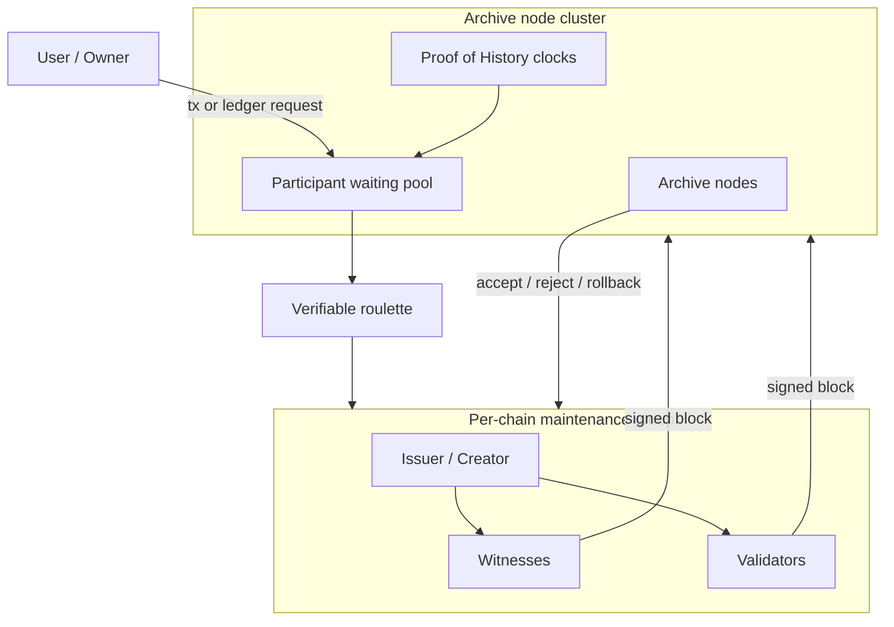

# Decentralization Cluster Multi-Chain

## Parallel Atomic Distributed Ledger Expansion (CoNET-DLE)

**Author:** Peter Xie  
**First draft:** 2023  
**Revision:** 2026-08-11 (editorial expansion + cryptography chapter; preserves the 2023 CoNET-DLE thesis)

**Paired translation (must stay in sync):** [`Decentralization Cluster multi-chain.zh-CN.md`](./Decentralization%20Cluster%20multi-chain.zh-CN.md)  
**Sync rule:** `.cursor/rules/conet-layer2-whitepaper-bilingual-sync.mdc`

---

## Abstract

**CoNET Distributed Ledger Expansion (CoNET-DLE)** is a clustered, lightweight **Layer-2-style ledger-expansion** system. Multiple randomly selected witnesses and validators form a **maintenance group** for a single short-lived or bounded-value chain. Many such groups run concurrently across the network, producing **parallel atomic ledgers** rather than a single congested mainchain.

**Transport premise:** CoNET-DLE is loaded on **CoNET DePIN**. Control and data-plane gossip use **wallet addresses (EOA) as network identity**, not IP addresses. Messages are end-to-end encrypted (OpenPGP) and relayed through entry/mailbox nodes that **cannot read plaintext**, yielding **natural metadata privacy** for L2 participants (issuer, witnesses, validators, users).

CoNET-DLE keeps blockchain-grade **immutability** while targeting continuous availability, linear scalability, flexible participation, and event-driven latency. Stake-based, group-local consensus removes the need for global PoW races. As more staking nodes join, concurrent chain maintenance capacity grows. Blocks are produced **only when events occur**, which fits transaction-scoped ledgers (for example CoNETCash-class asset chains) better than fixed-interval empty blocks.

This document is a design whitepaper for the **Decentralization Cluster / multi-chain** layer. Cryptography in §7 is restricted to **mature, production-proven primitives** (secp256k1 / EIP-191, OpenPGP, AES-GCM, SHA-256/Keccak-256, commit–reveal, optional ECVRF). It is complementary to CoNET DePIN / CoNET-SI and a CoNET **mainchain / registry**—not a replacement for a global PoS L1.

---

## 1. Introduction

As on-chain applications grow, more state must be recorded. Mainchain-centric consensus wastes compute when every participant races on one tip, and slow global block finality becomes the bottleneck. Many L1 and L2 designs still inherit a **single logical tip** (or a small set of shared tips), so they reintroduce the same congestion and fee pressure under load.

CoNET-DLE takes a different path: **shard by ledger**, not only by throughput tricks on one ledger. Each application or asset instance can own a **lightweight chain** with its own issuer, witnesses, and validators. Security and economic finality are reinforced by:

1. **Stake** of participants on CoNET.
2. **Random verifiable selection** (roulette over archive-node entropy).
3. **100% group consensus** for new blocks (or dissolve and reselect).
4. **Archive node clusters** that store full state and perform quality checks / rollback.
5. Optional **mainchain NFT** binding that caps value and ownership of asset-class chains.

Staking miners choose how many chains to underwrite based on their compute and network capacity. Lightweight validators need not store full history, so participation can be on-demand—reducing the centralizing pressure of capital-heavy PoS and ASIC PoW monopolies.

**Deployment substrate:** the L2 does not invent a new IP overlay. It is **loaded on CoNET DePIN**, so every waiting-pool advertise, task offer, block proposal, and vote travels as **wallet-addressed, OpenPGP-encrypted gossip** (entry A → mailbox B; listen via entry C ≠ B). Cryptographic details are developed in **§7**.

---

## 2. Problem Statement

| Problem | Why it matters |
| --- | --- |
| Slow new-block consensus | Global tip agreement does not scale with demand. |
| Waste of computer resources | Idle or competing work on empty / contested tips. |
| High gas / fee pressure | One market for blockspace prices out small payments. |
| 51% / capital concentration | PoW and PoS tend toward resource monopolies. |
| Scalability bottleneck | Single-chain or single-rollup ceilings. |
| Centralizing consensus | Large validators / pools dominate selection. |

**Design goal:** keep decentralization and immutability, but make **parallel per-ledger consensus** the unit of scale.

---

## 3. Design Thesis

### 3.1 Parallel atomic ledgers

- **Parallel:** many chains progress independently; adding nodes increases the number of maintainable chains.
- **Atomic (per chain):** within one chain, a new block requires full agreement of the selected maintenance group (issuer / creator, witnesses, validators as defined by that chain’s contract).
- **Bounded blast radius:** compromise or crisis on one chain does not halt unrelated chains.

### 3.2 Event-based block production

If there is no event (transaction / state-change request), **no new block** is produced. This avoids empty-block overhead and matches payment / receipt workflows.

### 3.3 Clustered maintenance groups

A chain is not secured by “the entire network voting every slot,” but by a **small, randomly drawn group** plus archive-cluster final quality check. Dishonest or timed-out members are replaced; stake is at risk.

### 3.4 Relation to CoNET stack (conceptual)

```text
+-------------------------------------------------------------+
| CoNET mainchain / registry (identity, stake, NFT, AddressPGP)|
+-----------------------------+-------------------------------+
                              | anchors / fees / NFT / PGP registry
+-----------------------------v-------------------------------+
| CoNET-DLE L2 - Decentralization Cluster (this paper)         |
|  many asset / storage chains x concurrent maintenance groups|
+-----------------------------+-------------------------------+
                              | encrypted gossip (wallet != IP)
+-----------------------------v-------------------------------+
| CoNET DePIN / CoNET-SI - wallet-address P2P + entry/mailbox |
|  OpenPGP ciphertext; A->B send; C->B listen; zero-trust hops|
+-------------------------------------------------------------+
```

**Privacy by construction:** L2 roles do not dial each other by IP. They address **wallet / PGP identities**; DePIN relays forward ciphertext. Entry and mailbox nodes learn routing key IDs, not business plaintext or stable client IPs (see §7).

Historical product example: **CoNETCash**-style instruments—each note is an NFT-backed, value-capped ledger (classically up to **$100**) with its own lightweight chain, maintained by a randomly selected CBDC/issuer, witnesses, and validators, with event-driven blocks.

---

## 4. System Overview

### 4.1 Two classes of chains

| Class | Purpose | Notes |
| --- | --- | --- |
| **Asset-class chain** | Transferable value, often NFT-bound on the mainchain | Value of each asset chain is **capped** (design target: not exceed **$100** equivalent). Transfer fees can be deducted from the asset itself. |
| **Storage-class chain** | Data / logs / application state | Bundled CoNET wallet pays storage; if payment fails, **new blocks stop**. The bundled wallet may be replaced. |

### 4.2 Chain properties

- **Ownership** is defined by mainchain binding (NFT / registry) plus local genesis rules.
- **Limited functionality:** genesis embeds a **single predefined VM program** for that chain. Chains do **not** freely message each other (isolation by design).
- **Security source:** stake + random group selection + archive quality check; asset chains additionally inherit security from the **mainchain NFT** binding.

### 4.3 Role map



---

## 5. Roles

### 5.1 Pledge archive nodes

- Global **full nodes** for the DLE plane: store chains and complete state needed for quality checks.
- Perform **final quality check** on deposited blocks: accept, or **dissolve the group** and organize rollback / re-consensus.
- Peer networking among archive nodes is primarily for **archive discovery and archive consensus**; they do not freely accept arbitrary role-node gossip as peers.
- Expose **RPC** only to authorized participants and chain owners.
- Run **Proof of History (PoH)** sequences locally to timestamp and order waiting-pool events (see §7).

### 5.2 Archive node groups (clusters)

- Archive nodes register on CoNET via **NFT**, obtaining a unique token ID.
- When the number of archive nodes exceeds multiples of a design parameter (document baseline: **groups of 10**), the set **splits** into more groups (e.g. when total \(> N \times 10\), form \(N+1\) groups).
- Membership is deterministic by **token ID ordering** (automatic group assignment).
- New archive nodes join the **currently smallest** group (load balance).
- A new chain’s hosting archive group is derived from the **chain NFT token ID** (odd/even or modular placement as implemented by the registry).
- Smaller groups can yield higher per-node income; economic pressure encourages splitting and rebalancing.

### 5.3 Pledge witnesses

- Participate across the **full lifecycle** of a given chain.
- Store **all data** of that chain (chain-local full participants).
- Dishonesty → removal from the chain; stake / income at risk.
- Stake size limits how many chains a witness can underwrite concurrently.

### 5.4 Pledge validators

- **Lightweight** nodes: need not store full chain history.
- May join consensus for a **single block** (or short task) and leave.
- Enable on-demand decentralization without storage monopolies.

### 5.5 Issuer / creator

- Drawn by roulette for genesis or block creation tasks.
- Executes the chain’s predefined smart-contract / VM logic to propose a block.
- Collects signatures from witnesses and validators, then deposits toward the archive cluster.

---

## 6. Consensus Model

### 6.1 Per-chain consensus rule

- New block acceptance requires **100% agreement** of the selected maintenance group members defined for that step.
- If agreement fails (timeout, refuse-to-sign, conflicting signatures, archive rejection):

  1. **Dissolve** the current group for that tip.
  2. **Exclude** prior group members from the immediate reselection (anti-collusion).
  3. **Reselect** a new group via verifiable roulette.
  4. Optionally **slash / redistribute** stake according to smart-contract rules.

### 6.2 Genesis block flow

1. User submits a **new ledger request** to the request pool.
2. Roulette selects an **issuer** among staking miners; issuer runs the predefined contract to build genesis (global definitions for this chain).
3. Contract returns randomly selected **witnesses and validators**.
4. Issuer signs genesis and submits to witnesses/validators.
5. Witnesses and validators verify, store locally, and return signatures.
6. Archive cluster records finalized genesis after quality check.

### 6.3 New block flow

1. User commits a transaction / event to the issuer (or current tip issuer role).
2. Issuer runs the chain’s predefined transaction contract → candidate block.
3. Contract (or selection layer) returns validators (and witness set as required).
4. Issuer signs and distributes for verification.
5. Witnesses/validators verify and store; signatures return to issuer / archive path.
6. Archive cluster finalizes or rolls back.

### 6.4 Timeout and succession

| Fault | Recovery (design) |
| --- | --- |
| **Creator / issuer timeout** | First witness becomes issuer; last-block verifier may graduate to witness; revalidate the tip. |
| **Witness timeout** | Exclude witness; last-block validator may become witness; revalidate. |
| **Refuse to sign** | Contract dissolves group; new random group; attackers lose stake; honest actors may be rewarded. |
| **Archive incomplete consensus** | Reject tip; run rollback procedure (§9). |

---

## 7. Cryptography (Mature Primitives Only)

This chapter specifies the cryptographic plane of CoNET-DLE **as an L2 loaded on CoNET DePIN**. Every construction below is chosen because it is already standardized or battle-tested in production systems. Novel ZK/SNARK stacks are **out of scope** for the baseline.

### 7.1 Threat model and privacy goals

| Adversary | Assumed capability | Goal of crypto layer |
| --- | --- | --- |
| Curious entry / mailbox hop | Sees ciphertext, timing, recipient **PGP key id** | Cannot read L2 business plaintext |
| Network observer on one hop | Sees IP of that hop’s TCP peer | Cannot map that IP to the **logical** sender/receiver wallet across A≠B / C≠B paths |
| Colluding minority of a maintenance group | Holds some secp256k1 keys | Cannot forge full-group block acceptance |
| Adaptive stake attacker | Buys stake, joins waiting pool | Cannot bias roulette without detectable commit failure / VRF verify fail |
| Offline storage attacker | Steals disk of one validator | Limited by per-task keys + no full-history requirement for validators |

**Non-goals (baseline):** perfect global traffic-analysis resistance against a world-wide passive adversary that correlates *all* entry nodes; content-hiding from parties who *must* see a block (witnesses of that chain). Privacy is **natural** from wallet-address gossip + E2E encryption, not from mixnets.

### 7.2 Primitive catalogue (implementation baseline)

| Layer | Primitive | Maturity anchor | Use in CoNET-DLE |
| --- | --- | --- | --- |
| Wallet identity | **secp256k1** ECDSA | Bitcoin / Ethereum | Node & user EOA |
| Auth signatures | **EIP-191** `personal_sign` | Ethereum wallets | Gossip commands, listen, task ACKs |
| Structured domain sigs (optional) | **EIP-712** | Ethereum dApps | Archive selection commits, stake ops |
| Directory | **AddressPGP** on-chain registry | CoNET production | Map EOA → user PGP + route key |
| Asymmetric message crypto | **OpenPGP** (RFC 4880 / **RFC 9580**) with **X25519** (+ Ed25519 where used) | OpenPGP ecosystem | Encrypt L2 envelopes to recipient |
| Symmetric AEAD | **AES-256-GCM** (NIST SP 800-38D) | TLS, age, modern apps | Optional bulk payload / session wrap |
| Session (listen path) | AES-256-CBC + explicit MAC *or* prefer GCM | Existing CoNET-SI listen | Long-lived listen channel key |
| Hashing | **SHA-256**, **Keccak-256** | NIST / Ethereum | PoH ticks, Ethereum digests, armor hashes |
| KDF | **HKDF-SHA256** (RFC 5869) | TLS 1.3, OpenPGP v6 | Derive task / fragment keys |
| Random beacon (primary) | **Commit–reveal** over secp256k1 | Classic distributed RNG | Archive roulette entropy |
| Random beacon (optional) | **ECVRF** (IETF draft / production VRFs) | Algorand, etc. | Unbiasable per-node ticket |
| Integrity of ciphertext | `keccak256(utf8(armor))` | CoNET fragment / ACK practice | Delivery dedup & mailbox ACK |

**Library guidance (non-normative):** `openpgp.js` / Sequoia / GPG for OpenPGP; `ethers.js` / libsecp256k1 for EIP-191; OpenSSL / BoringSSL / WebCrypto for AES-GCM; no custom ECC curves.

### 7.3 Identity: wallet address, not IP

1. Every L2 participant (user, issuer, witness, validator, archive operator process) is identified by an **EOA** `0x`-address derived from secp256k1.
2. The same EOA stakes on the mainchain and signs DePIN commands with **EIP-191**.
3. Each participant registers an **OpenPGP** certificate (encryption subkey = routing key id) in **AddressPGP**, bound to that EOA.
4. **IP addresses are transport accidents of a single hop**, never protocol identifiers. Clients **MUST NOT** require knowledge of peer IPs to join consensus.

```text
Logical identity:  EOA  ──registers──►  userPublicKeyArmored + routeKeyID
Gossip address:    encrypt(to = user PGP | route PGP)
Physical path:     client → entry A/C → mailbox B   (A,C ≠ B)
```

### 7.4 DePIN gossip crypto (send path S → A → B)

Aligned with CoNET DePIN zero-trust mailbox routing:

1. Sender builds an L2 envelope (JSON): `{ timestamp, text, from: EOA, signMessage }` where `signMessage = EIP-191(text)`.
2. `literal = base64(UTF8(JSON.stringify(envelope)))`.
3. OpenPGP-encrypt `literal` to the **recipient’s user PGP** (not to the mailbox route key for business payloads).
4. `POST { data: armoredCiphertext }` to one or more healthy **entry nodes A**, with **A ≠ B** (mailbox of recipient).
5. Entry **A** inspects only OpenPGP recipient key id → looks up mailbox **B** → forwards over node-to-node HTTP. **A does not decrypt.**
6. Mailbox **B** stores ciphertext; **B does not decrypt** business payloads. Only recipient R opens with user private key.

**L2 message types** carried in `text` (examples): waiting-pool advertise, task offer, block proposal digest, signature share, timeout complaint, storage-fee receipt. Application parsers unwrap nested JSON as needed.

### 7.5 DePIN listen crypto (R → C → B)

For long-lived participation (waiting pool / SSE push of tasks):

1. Participant encrypts a listen command to **mailbox B’s route PGP** (not user PGP):
   `{ command: 'mining', listenKind: 'dle' /* or product tag */, walletAddress, algorithm, Securitykey, timestamp }` signed EIP-191.
2. HTTP/SSE connects via healthy **entry C ≠ B**.
3. **B** decrypts listen command only (route key), binds `walletAddress` to the SSE, pushes later ciphertext.
4. Prefer **AES-256-GCM** for the session `Securitykey` channel; if compatibility requires AES-CBC, require an explicit HMAC-SHA256 over ciphertext (Encrypt-then-MAC). New deployments should standardize on GCM.

`listenKind` distinguishes DLE task streams from LayerMinus mining / chat, so eviction policies never cross pipes.

### 7.6 Why this yields “natural privacy” for the L2

| Property | Mechanism |
| --- | --- |
| No IP identity | Peers addressed by EOA / PGP key id |
| Hidden sender ingress | Send via arbitrary entry **A**, not direct to B |
| Hidden receiver ingress | Listen via arbitrary entry **C**, not direct to B |
| Confidentiality | OpenPGP E2E; hops see only ciphertext |
| Authenticity | EIP-191 bind `from` to envelope `text` |
| Limited linkability of roles | Fresh task keys (§7.10); optional per-chain ephemeral PGP subkeys |
| Bounded metadata | Relays learn “cipher for key id K”, not payment amounts or block bodies |

Residual metadata (size, time, key id) is accepted; mixnet-level padding is optional hardening, not required for baseline.

### 7.7 Block and vote cryptography (consensus plane)

**Block digest**

```text
blockHash = keccak256(rlp_or_canonical_encode(header || txs || stateRoot))
```

Use a frozen canonical encoding (RLP or deterministic JSON + length prefixes). Prefer **Keccak-256** where Ethereum tooling is reused; **SHA-256** is acceptable if consistently used for PoH and digests—but **do not mix** digest functions for the same object.

**Per-member vote**

```text
vote = EIP-191( "CoNET-DLE/vote/v1" || chainId || chainNFT || height || blockHash || role || eoa )
```

Collect ECDSA signatures from **all** required members (issuer, witnesses, validators). Archive verifies:

1. `ecrecover` matches the roulette-selected set.
2. Set completeness = 100% of required roles.
3. `blockHash` matches recomputed digest from deposited body (or body availability proof).

**No custom BLS threshold crypto in baseline**—threshold BLS is mature in some stacks but adds operational complexity; **explicit multi-signature collection** of secp256k1 signatures is enough and already ubiquitous.

### 7.8 Verifiable roulette cryptography

#### 7.8.1 Primary: commit–reveal (recommended baseline)

For archive group size \(n\), round \(r\):

1. Each archive \(i\) samples \(s_i ← \{0,1\}^{256}\).
2. **Commit:** broadcast OpenPGP-encrypted (to archive peers) or gossip:
   `C_i = keccak256(s_i || eoa_i || r || groupId)` with EIP-191 attestation of `C_i`.
3. After commit cutoff (PoH tick / wall-clock bound), **Reveal** \(s_i\); peers check `keccak256(...) = C_i`.
4. Aggregate:
   `R = keccak256(s_1 || … || s_n || r || chainSeed)`
   Missing reveals → exclude that archive from reward for round \(r\); if too many missing, abort round.
5. Map \(R\) to waiting-pool ranks (Fisher–Yates or modular indexing over the PoH-ordered list) to pick issuer, witnesses, validators, standbys.

**Properties:** unpredictability before reveal; bias resistance if at least one honest \(s_i\); fully implementable with hashes + signatures only.

#### 7.8.2 Optional: ECVRF tickets

Each eligible staker publishes `ticket = VRF_sk(seed_r)`. Highest / hash-ordered valid tickets win roles. Verification uses standard ECVRF verify. Use as an **upgrade path** when stake-weighted selection must be unbiasable under adaptive participation; still gossip tickets over DePIN ciphertext channels.

#### 7.8.3 Selection log

Archive cluster appends `{ r, R, commits, reveals, selected[] }` to a **selection chain** (hash-linked SHA-256/Keccak). Entries are gossiped as L2 messages and mirrored on archive storage. Smart-contract genesis consumes `selected[]` only after archive attestation signatures.

### 7.9 Proof of History (ordering substrate)

Archive nodes maintain a local sequence:

```text
h_0 = IV
h_{t+1} = SHA-256(h_t)
```

Periodically publish `(t, h_t, eventDigest)` checkpoints. Waiting-pool join/leave events bind to the latest `(t, h_t)`. Peers verify a claimed interval by recomputing (or verifying checkpoints). This is **not** Solana consensus; it is a **verifiable delay / ordering aid** so archives agree on participant order without trusting NTP alone.

### 7.10 Task keys and witness storage

| Material | Derivation | Lifetime |
| --- | --- | --- |
| Task session key | `HKDF-SHA256(master = ECDH_or_shared, info = "dle|task|"‖taskId)` | Single block task |
| Chain witness store key | Derived from witness stake key + `chainNFT` | Chain lifetime |
| Delivery ACK id | `keccak256(utf8(openpgp_armor))` | Until ACK |

Validators **SHOULD** wipe task keys after vote. Witnesses retain chain data encrypted at rest with OS keystore / age / OpenPGP symmetric pack—implementation choice, not protocol-mandated.

### 7.11 Anti-lazy verification (false proof sampling)

For storage / PoRep-style checks: replication nodes occasionally submit a **false proof** with a hidden seed. Verifiers who accept it are slashable when the seed is revealed. Construction uses only hashes and EIP-191 reveals—no exotic crypto.

### 7.12 Concrete message profile (normative sketch)

```text
L2Envelope {
  v: 1
  kind: "dle.task.offer" | "dle.block.propose" | "dle.vote" | "dle.roulette.commit" | …
  chainId: uint64          // CoNET L1 id, e.g. 224422
  chainNFT: bytes32
  from: address            // EOA
  ts: uint64               // unix seconds; reject |now-ts| > 600
  body: json               // kind-specific
  signMessage: hex         // EIP-191 over canonical(body fields)
}
→ UTF-8 JSON → base64 → OpenPGP encrypt(to = recipientUserPGP | routePGP)
→ POST /post on entry A or C
```

### 7.13 Implementation checklist

- [ ] Encrypt business L2 payloads to **user PGP**; listen commands to **route PGP**.
- [ ] HTTP entry **A/C ≠ mailbox B**; never treat direct-B as the product path.
- [ ] EIP-191 on every command; reject bad `ecrecover`.
- [ ] AES-GCM (or CBC+HMAC) for listen session keys; ban bare CBC.
- [ ] Roulette = commit–reveal (baseline) with SHA-256/Keccak; optional ECVRF later.
- [ ] Block acceptance = full set of secp256k1 votes on `blockHash`.
- [ ] No private keys in logs; no plaintext mirroring on relays.

---

## 8. Verifiable Roulette and Waiting Pool (Operations)

Cryptographic details are normative in **§7.8–§7.9**. This section states operational behavior.

### 8.1 REST / gossip waiting pool

- Non-archive participants advertise readiness over **DePIN gossip** (and may keep an archive-facing REST/SSE wait handle) for the next verification task.
- If a participant already has a live waiting session, archive **terminates the previous** session and places the participant **last** in order (anti-hoarding of slots).
- Ordering of awaiting participants is agreed using **Proof of History** timestamps across archive nodes (§7.9).

### 8.2 Anonymous participation via CoNET DePIN

- Participant nodes reach CoNET-DLE through **wallet-address gossip** on CoNET DePIN / CoNET-SI—**without using IP as identity** (§7.3–§7.6).
- Waiting-pool and task messages are OpenPGP ciphertext; entry/mailbox hops remain zero-trust.

### 8.3 Creating a verification group

1. Hosting archive runs **commit–reveal** (or ECVRF) entropy round (§7.8).
2. Aggregate randomness drives **roulette** draws for creator, witnesses, validators (and standby slots).
3. After archive nodes attest the draw, selection is recorded on the **selection log**.
4. Creator executes the smart contract to instantiate or extend the chain.
5. Selected nodes leave the waiting list; unused standby nodes return to their prior positions.

### 8.4 Tragedy of the commons (PoRep / lazy verification)

See §7.11. Split mining payout between PoS verifiers and PoRep replication nodes; false-proof sampling slashes lazy verifiers.

---

## 9. Archive Quality Check and Rollback

Any archive node may trigger rollback when group or archive consensus fails quality checks.

1. Reject the unqualified tip.
2. Dissolve the chain’s current maintenance group.
3. Reselect a fresh random group (**prior members not eligible** for the immediate round).
4. Regenerate the block under the new group.
5. Punish cheating:

   - Cheaters may be banned from archive participation; income and stake move to an **income / reward pool**.
   - Honest reporters may be rewarded per contract rules.

**Finalization:** archive signatures finalize a deposited block when the archive group reaches its required consensus. Incomplete consensus → reject + rollback.

---

## 10. Virtual Machine

CoNET-DLE VM is specified as a **simplified, EOS-contract-compatible** execution environment with DLE-specific extensions:

- Developers define **transaction-scoped** chain logic at genesis.
- Global platform capabilities (selection, stake hooks, fee hooks) are available through DLE host functions.
- Each chain runs **one** predefined program surface—not an open multi-contract world computer with free cross-chain calls.

*(Editorial note: some early drafts mentioned “unique EVM”; the coherent design line is **EOS-compatible simplified VM** with limited, genesis-bound logic.)*

---

## 11. Features Summary

| Feature | Mechanism |
| --- | --- |
| Proof of Stake participation | Stake to become issuer, witness, validator; 100% group consensus. |
| Natural privacy transport | L2 on CoNET DePIN: wallet-address gossip + OpenPGP E2E (§7). |
| Better decentralization | Lightweight validators; on-demand participation without full storage. |
| Concurrent execution | One staker can serve many chains under different role rules. |
| High scalability | Dynamic clustering by chain; more participants → more maintainable chains. |
| Safe and reliable | Random distinct miners per group; dissolve + reselect on failure. |
| Efficient resources | Work is scoped to active events and small groups. |
| Limited damage | Chain crises stay local. |

---

## 12. Security Threat Model

### 12.1 Byzantine disagreement inside a group

**Mitigation:** require full group consensus; on failure dissolve and reselect; slash stake of attackers.

### 12.2 Limited value per asset chain

Capping value (e.g. **$100**) bounds attacker profit relative to stake risk and coordination cost—especially relevant to CoNETCash-like notes.

### 12.3 Collusion of creator + witnesses / validators

Because selection is random across a large staking set and groups are short-lived / task-scoped, assembling a fixed colluding majority for a **specific** target chain is low-probability and expensive. Failed collusion risks stake.

### 12.4 Signature / liveness faults

Handled by timeout succession and refuse-to-sign dissolution (§6.4).

### 12.5 Double-spend and spam (asset chains)

Transfers verified by issuer + witnesses + validators. Detected collusion → slash CBDC/witness stake and reward honest validators. Mint/redeem through mainchain contracts controls spam; capped chain value limits upside of a successful attack.

### 12.6 Archive capture

Archive groups split as membership grows; quality checks require archive-group consensus; cheating archive participants can be banned and have stake redirected. Long-term security still depends on honest majority assumptions inside archive clusters and mainchain registry integrity.

### 12.7 Transport / privacy adversaries

Covered in §7.1 and §7.6. Relays that attempt plaintext decryption fail by construction (no session keys). Direct-to-mailbox clients are a **protocol violation**, not a supported mode—they would weaken ingress privacy.

---

## 13. Economics (Design Outline)

| Flow | Intent |
| --- | --- |
| Stake CONET (or designated assets) | Qualify as archive / witness / validator / issuer. |
| Storage fees | Bundled wallet pays storage-class chains; unpaid → halt new blocks. |
| Asset transfer fees | Deducted from asset-class value where configured. |
| Mining / task rewards | Pay honest group members; fund slash redistributions. |
| Group size vs income | Smaller archive groups can yield higher per-node share → natural split/rebalance. |
| Mainchain governance | Subjective fee parameters, supported stable assets for minting notes, listing rules—voted by token holders where applicable. |

CoNETCash-class mint/burn designs historically tied a fraction of note mint/redeem activity to CONET supply dynamics (burn/mint around market pricing)—that is an **application-layer** policy on top of DLE, not required for every storage chain.

---

## 14. Comparison Sketch

| Approach | Tip model | Typical bottleneck | CoNET-DLE contrast |
| --- | --- | --- | --- |
| Monolithic L1 | One global tip | Gas + block time | Many independent tips |
| Optimistic / ZK L2 | Shared rollup tip / batch market | Sequencer + L1 data cost | Parallel per-ledger groups + DePIN privacy transport |
| App-chains / subnets | One chain per app (heavy) | Validator set cost | Ultra-light, event-driven, value-capped chains |
| Side DB / centralized API | Off-chain mutability | Trust & availability | On-chain immutability with archive checks |
| IP-address P2P L2 | libp2p / TCP identity | IP metadata leakage | Wallet-address gossip; relays never see plaintext |

CoNET-DLE is closest in spirit to **“many tiny ledgers + random committees + archive finalizers”**, carried on **CoNET DePIN wallet-address gossip**, optimized for private, payment-friendly bounded state machines rather than general-purpose shared blockspace.

---

## 15. Open Design Questions / Implementation Notes

These items are left explicit so engineering can freeze parameters without rewriting the thesis:

1. Exact archive group size \(K\), split threshold, and NFT→group mapping function.
2. Freeze **commit–reveal** as v1 roulette; schedule for optional **ECVRF** (§7.8).
3. Precise signature thresholds if any role is allowed a standby/quorum short of literal 100% in production hardening.
4. PoH parameters: SHA-256 tick rate, checkpoint interval, cross-archive verification budget.
5. Slash amounts, bounty shares, and ban durations.
6. VM instruction set freeze and host ABI for stake / roulette / fees.
7. `listenKind` string for DLE vs mining vs chat; session AEAD = AES-256-GCM only for new clients.
8. Canonical block encoding (RLP vs deterministic JSON) and single hash function choice for `blockHash`.
9. Cross-version migration of archive state and selection logs.
10. Clear separation between **historical Avalanche-subnet era mainchain sketches** and **later CoNET L1 / DePIN deployments**—DLE cluster logic remains the same thesis either way.

---

## 16. Conclusion

CoNET-DLE proposes **decentralization clusters** that maintain **parallel atomic multi-chains**: event-driven blocks, stake-secured random maintenance groups, archive-cluster quality finalization, and bounded per-chain damage. As an L2 **loaded on CoNET DePIN**, it inherits **wallet-address (non-IP) gossip** with OpenPGP end-to-end encryption and zero-trust entry/mailbox hops—natural privacy for participants—while anchoring stake and NFT security on the CoNET mainchain registry. Cryptography stays within mature primitives (§7) so the design is implementable without exotic proving systems.

---

## References

1. Original CoNET-DLE design note — Peter Xie, 2023 (this document lineage).
2. CoNET ecosystem commentary covering CoNET-SI, CoNETCash, and CoNET-DLE — Cointime / 0x237, *“CoNET：从基础设施层面出发，能否解决加密隐私问题？”* (2023).
3. **RFC 9580** — OpenPGP (obsoletes RFC 4880 / 6637); X25519 encryption profiles.
4. **EIP-191** — Signed Data Standard (`personal_sign`); **EIP-712** — typed structured data (optional domain separation).
5. **NIST SP 800-38D** — AES-GCM; **RFC 5869** — HKDF; **FIPS 180-4** — SHA-256; Ethereum **Keccak-256**.
6. IETF **ECVRF** drafts / production VRF deployments (optional roulette upgrade path).
7. Solana — Proof of History as verifiable delay / sequencing substrate (conceptual prior art; CoNET-DLE uses PoH as archive ordering aid only).
8. Hardin, G. — *The Tragedy of the Commons* (incentive misalignment cited in §7.11 / §8.4).
9. CoNET Project — Layer Minus / DePIN / AddressPGP mailbox routing (wallet-address gossip, A/B/C zero-trust hops).
10. EOSIO / Antelope contract model — prior art for the simplified contract VM target.

---

## Appendix A — Glossary

| Term | Meaning |
| --- | --- |
| **CoNET-DLE** | Distributed Ledger Expansion; this cluster multi-chain L2 layer. |
| **CoNET DePIN** | Wallet-address P2P substrate; L2 gossip transport (not IP identity). |
| **Entry A / Mailbox B / Entry C** | Send ingress / ciphertext mailbox / listen ingress; A,C ≠ B. |
| **AddressPGP** | On-chain registry binding EOA → user PGP + route key. |
| **Maintenance group** | Issuer/creator + witnesses + validators for a chain tip/task. |
| **Archive node** | Full-state quality checker and waiting-pool host. |
| **Witness** | Chain-local full participant storing chain data. |
| **Validator** | Lightweight consensus participant. |
| **Verifiable roulette** | Archive-agreed random selection (commit–reveal or ECVRF). |
| **Selection chain** | Log of agreed draws before contract execution. |
| **Asset-class chain** | Value-capped transferable ledger (e.g. CoNETCash note). |
| **Storage-class chain** | Fee-paid data/state ledger. |
| **EIP-191 vote** | secp256k1 signature over canonical block/task digest. |

## Appendix B — End-to-End Sequence (New Asset Chain)

```text
User → request pool
     → archive roulette (issuer, witnesses, validators)
     → issuer runs genesis contract
     → group signs genesis
     → archive quality check / finalize
     → (later) user events → event blocks only when needed
     → unpaid storage or slash events → halt or reselect as rules dictate
```
