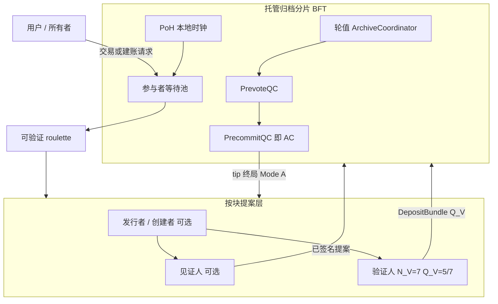

# 去中心化集群多链

## 并行原子分布式账本扩展（CoNET-DLE）

**作者：** Peter Xie  
**初稿：** 2023  
**修订：** 2026-08-17（实验室 MVP 评估：控制面 P0–P11 已 live；诚实轨 P12–P22 引擎/单测 154/154；P23 keep-deploy 证据已收 — 6/7 LIVE_OK + fd-01 409→accept；fd-06 HTTP 不稳；P24 隔离 `node.ts` 新链 accept 与 `lab-cli` 共用同一 `officialStandbysReady` 回调（不启入座 tick / 不冻库存）；不是 7/7 健康 / 不是 30 天 / 不是生产；P25 Explorer overlay 已落地（Certificates + Home 非绿芯片；绿点仍只 seatingQualified === true；explorer:test 8/8）；下一闸停放 / 仅审查；实验室 P22：官方 standby 就绪签为实验室 EIP-712 `ArchiveStandbyReadiness`；extra `fd-08` 不计入；新链 accept 须等两台官方 standby — 不是生产 OperatorDomain / secp256k1 / 不是 30 天资格；此前实验室 P21：实验室 BFT 票 / QC / AC 绑定 `hashIndexRoot`；树视图 `committedInAc` 仍为 false；AC 携带非零 bound root 时 Health/Explorer 可显示 overlay — 不是生产 AC 承诺 / 不是 30 天资格；此前 2026-08-16：实验室门面已实现 `ArchiveStateChallengeV1`；G1 fd-05/fd-07 从零加入 `accept.json` 为 `ok:true`（leaf 4956，四根对齐）— 仍不是 30 天资格；同日此前：ArchiveSyncQualificationV1：追块 `SYNCING` 不得入席位资格；自报已同步仅为 `CLAIMED_SYNC`；须对本组全部托管链做随机状态抽检，并由现任 active \(Q_A=4/5\)（已大于 2/3，禁止 3/5）投票 — §5.2.0f；仍不是 30 天资格；同日此前：实验室 G2 主机 `hop1.ownGroupId` / `liveGroupIds` 已 emit L1 登记 tx `0xf781f2c23fe3b3dac09dc3e1929016b0af200ee93978e916df64d750876d5153`；实验室 keccak 仅为别名；仍不是 30 天资格；同日此前：实验室 G2 L1 registerLiveGroup 已落地；用户可见 G2 Group ID 为该 tx；仍不是 30 天资格；同日此前：实验室 P6 live keep：7/7 独立 AC，NFT 42 tip 仍为 `0x1`；新链创世为实验室 \(Q_V=5/7\) HMAC + 该链自己的 \(Q_A=4/5\) PrevoteQC/AC — 禁止写入 NFT 42 Tendermint / `bft-state.json`；旧 `DleLabGenesisCertificateV1` stub 不是 AC；仍不是 L1 出生证 / 不是 30 天资格；同日此前：实验室 M7：`tipStateRoot` / `membershipRoot` 为一等 `HashObjectKind` — 方案 C；禁止 AC 字段别名；仍不是 L1 登记 / 不是 30 天资格；同日此前：实验室 M6 第二归档组 + 全平面 gather 已落地；G2 Group ID 为实验室 hash，不是 L1 登记交易；全平面 JSON-RPC `null` 仅当每个活跃组都返回可信本组 `notFound`；一组超时是 `unavailable`；仍不是生产 DePIN / 不是 30 天资格；此前 2026-08-15：hash RPC 事实核查：DLE 已承诺的每个 hash 返回 `hit` 或本组 `notFound`；仅核查未完成才 `unavailable`；PrevoteQC 为一等 `kind=prevoteQc` — 方案 C；今后 hash 种类必须新增 typed `HashObjectKind`，禁止 AC 字段别名 — §5.2.0e；实验室清零后 M0–M5 hash 管道已上线；hop-1 `historyProviders` 走实验室 HTTP :27101；每组 `hashIndexRoot` 是独立实验室检查点，不是 AC 投票字段 — 仍不是生产 DePIN；hash-only RPC 必须先击中 `chainNftId`，再 hop-1 代理 — §5.2.0e；组内 geth 式热 KV + 按 `(nft, height)` 的 freezer；每组 `HashIndexTreeV1` / `hashIndexRoot`；全平面 `null` 仅在可信 not-found 之后；同日此前：on-demand 等待钩组内投递：钩 **不得** 视为已在归档间 gossip；miner/daemon **必须** 把同一等待钩投到该组每一台活跃归档 — §5.4 / §8.1；实验室 HTTP `POST /ondemand/hook` 是实验室 / MVP 控制面路径，**不是** 生产 DePIN gossip，也 **不是** explorer HTTPS；实验室 beacon ≠ L1 CL RANDAO — §7.8.5；HTTP 30 miner 排队是实测实验室证据，**不是** 30 天资格 — §15；此前 2026-08-14：全局 DLE RPC 真相面：任一活跃归档均可作为 RPC 入口；非本组查询 **必须** 代理到该组 `historyProviders` — §5.2.0d；EIP-155 平面 Chain ID（testnet `0x44c45`）与用户可见 Group ID = L1 登记交易 hash；L1 uint `groupId` 仍为存储键；L1 Global 归档路由注册表：归档钱包 + 所托管链 NFT id，链路由 / 历史提供者 — §5.2.0d；每组 5 名活跃归档 + 2 名专属有序备选、严格 4/5 quorum、可执行 Archive Tendermint v2 语料/Archive A MVP、五槽 AdaptiveRotationV1、OperatorDomainRegistryV1、L1QueueAccumulatorV1、线级 Tendermint/SSZ/WAL 规则、确定性 `dle.rs.v1` 正确编码证明、带挑战期强制退出、Treasury V3 规范 ERC-20 burn/remint 网关、**P1 实测证据边界：100-USDC 安全封顶已冻结，10-USDC 下限与 1.2× coverage 仍属临时参数**、L1 锚定卖方订单、x402 v2 AI pay-per-use / API gateway 目标 profile、协议费/执行准备金/可用性预算三账本、Treasury 规范资产 L1 pool/TWAP 准入；归档无出块权）

**成对译本（必须同步更新）：** [`Decentralization Cluster multi-chain.md`](./Decentralization%20Cluster%20multi-chain.md)
**同步守则：** `.cursor/rules/conet-layer2-whitepaper-bilingual-sync.mdc`

**规范性实现规范：**

- [`AssetBurnMintGateway 不变量规范`](./DLE-AssetBurnMintGateway-Invariant-Spec.zh-CN.md) + 有界 [`TLA+ 模型`](./DLEAssetBurnMintGateway.tla)
- [`Archive Tendermint 一致性规范`](./DLE-Archive-Tendermint-Conformance-Spec.zh-CN.md) + 不可变 [`v1 Proposal/Vote 向量`](./DLE-Archive-Tendermint-Vectors-v1.json) + 规范可执行 [`v2 语料`](../../conformance/corpus/DLE-Archive-Tendermint-Vectors-v2.json)
- [`OperatorDomainRegistryV1 规范`](./DLE-OperatorDomainRegistryV1-Spec.zh-CN.md)

**开发评估快照：** [`DLE P0/P1 形式化补正评估`](../../../canvas/dle-p0-p1-formalization-review.md) 记录本轮批评到控制项的映射及尚未完成的工程发布门；该快照不具规范性。

---

## 摘要

**CoNET 分布式账本扩展（CoNET-DLE）** 是一种集群化、轻量级的类 Layer-2 账本扩展系统：大量并行、事件驱动的原子链。每个事件块 **仅由验证人委员会生产**（抽选 \(N_V=7\)，需 \(Q_V=5/7\) 签名），再由托管归档分片按明确冻结的 **Tendermint 式 PrevoteQC → PrecommitQC** 协议终局。归档节点 **没有出块权**：只对验证人产生的不可变候选做独立重放、质检、投票与证书聚合。

- **并行：** 并发链随质押与归档平面裂变扩展；容量↑ → 可维护 tip↑——**不是** 无界免费吞吐的断言。
- **原子（按链）：** tip 前进须获 **Q_V=5/7** 验证人证明，再获托管分片的 **归档证书**（§6.5、§5.2.1）。
- **仅事件出块：** **无事件 ⇒ 不出块**；禁止空 slot、归档控制块与 anchor 块。
- **L1 出生证明：** 创建新链必须在 CoNET L1 铸造唯一 NFT；任意归档均可接收请求，全体归档镜像 `QUEUED / NewChainQueue`。规范顺序由 CoNET L1 **`L1QueueAccumulatorV1`** 单调累加并冻结区间，再经**可公开复算的 v1 均匀 roulette** 与 L1 reservation；创世 AC 的 \(Q_A=4/5\) PlacementCertificate 可由 **任意 relayer** 提交。不采用跨组 \(Q_G\) 检查点、5/5 或“最后签字者执行”。
- **资产价值区间：** 每笔外部 burn 流入和每个新分配的 spillover tip 激活时必须位于**证据批准的 `minIngressUsdc6`** 与已冻结 **100-USDC 等值封顶**之间；当前 10-USDC 下限只是预生产校准种子。后续每个资产事件都重估 tip，若余额 **> 100 USDC**，转出 / 超额 **须建新链**。市场价格下跌导致低于 active floor 时不得没收资产，也不得阻断安全退出（§4.6、§13.3）。
- **资产流入/退出守恒：** DLE v1 只接受 **CoNET L1 Treasury V3 规范 ERC-20**——即经 `TreasuryBridgeV3` 规范资产路径发行/登记、地址稳定的 `TreasuryCanonicalERC20V3` 代理。资产进入 L2 时，由 `AssetBurnMintGateway` 协调 Treasury V3 权限轨精确 burn；仅在失败创世退款终局或普通/强制退出终局后，由 Treasury V3 精确 remint 同一规范 token。任意外部 ERC-20 与调用方私自提供的 burn/mint adapter 均不得准入（§4.6）。
- **交易类（原子 NFT 式出售）：** 用户开设 **交易** tip 作为 **L2 订单 / 状态协调器**，挂牌既有 **资产** 或 **存储** 链。挂单报价由卖方设定（`quoteAsset` + `quoteAmount`），**无 ≤100 USDC oracle 封顶**——去中心化系统 **无法** 对 NFT 做可靠 oracle 估值（§4.7）。Tip 开启前，卖方 EIP-712 订单摘要与标的 NFT 必须在 CoNET **L1 Settlement Contract** 内原子锚定。Tip 按冻结的 **Trade FSM** 前进（`Open→Locked→SettleReady→…`，§10.2）。**最终原子交割**（支付卖方 **且** 转移标的 L1 NFT 所有权）在一笔 Settlement 调用中完成；交易 tip 随后 **关闭**。AC 只能证明已就绪，不能发明或改写卖方条款。
- **AI pay-per-use / x402 API gateway：** x402 v2 保持为标准侧 HTTP 支付边缘——`402 Payment Required`、`PAYMENT-REQUIRED`、`PAYMENT-SIGNATURE` 与 `PAYMENT-RESPONSE`；DLE 提供可选的不可变用量回执与未来的资本担保批量结算轨。固定价调用使用 `exact`；单请求可变 LLM / 计算用量可使用单次消费 `upto`；高频 agent/tool 调用须另行规范 `batch-settlement` 网络 binding。CoNET profile 以 `eip155:224422` 标识 L1，只准入带版本的规范资产，不把 prompt/output 明文写入公共 tip，也 **不** 把任意 API 代码变成 tip VM（§4.7a）。
- **存储类创作者经济 / 私密版权交付：** 与 Beamio `CopyrightContentModule` 同一论题：所有者碎片化并以授权 DePIN miner 封存私密组装 index；tip/L1 仅存 hash；买方付 **conet-GB**、绑定买方 PGP；**最先完成者** miner 交付买方绑定密文；短期访问 URL + 周期存储费；明文永不上链（§4.8）。
- **版权 ZERO / 版本树：** 存储 tip 形成 **谱系树**（原创 + 修改者）；每个分支点是可经交易类挂牌的 **独立 L1 NFT**；tip 记录 **社交历史**（点赞、评论、引用）作为拍卖估值的 **Web of Trust** 信号（§4.9）。
- **存储销售账本：** 每条存储 tip 维护仅追加的 **销售收入流水**，并 **引用** 实际发生价值转移的并行 **资产类** tip 交易（§4.10）。
- **归档平面裂变 + BFT 终局：** \(G_e\) 表示 L1 已注册活跃组数，\(N_e=5G_e\) 表示唯一活跃投票归档数，\(U_e\) 表示 `UnassignedPool` 中合格未分配归档数；仅当 \(U_e\ge7\) 才消耗七个全新、互不重叠身份，组成 **5 名活跃 + 2 名专属有序备选**。`maxGroupsPerArchive=1`，跨组名册交集为零。`OperatorDomainRegistryV1` 以可挑战的规范运营者、基础设施与角色域约束成组及归档/验证人隔离。既有组保留当前归属，只见证新组形成或经 **全局 RPC 代理** 为其它组提供带证明的只读数据（§5.2.0d）；`groupId` 单调且不复用。增长不重映射已有 tip，MigrationCertificate 仅用于解散/re-home。每组以 \(N_A=5,f=1,Q_A=4\) 的 **PrevoteQC → PrecommitQC（= AC）** 终局验证人产生的事件块；`AdaptiveRotationV1` 即使无故障也必须逐槽轮换，并在期限内完成五槽 churn。共识使用规范 SSZ sign-bytes、正确 nil/锁规则与 crash-consistent WAL；静态二项数值仅是初始抽签基线，长期风险须计入自适应腐化与相关故障（§5.2、§5.2.1a、§12.3.1a）。
- **EIP-155 Chain ID 与 Group ID：** 平面唯一的 **EIP-155 Chain ID**（`eth_chainId` / 钱包）用来把本 DLE 平面与 CoNET L1 `224422` 及其它 EVM 链区分开。**CoNET-DLE Testnet** 为 `0x44c45` / `281669`。用户可见 **Group ID** 是该归档组在 L1 的 **登记交易 hash**。L1 `archiveGroupId[tokenId]` 仍是 uint **存储键**（引导组 `1`）。创世时只有 **一个** 活跃组；裂变后形成第二个唯一组（新的登记 hash）、第三个唯一组，以此类推。CoNET L1 **Global 归档路由注册表** 登记每个参与归档的 **钱包地址** 以及该组托管的全部链 **NFT id**，客户端据此获得 **链路由** 与 **可提供该链历史的归档节点**（§5.2.0d）。
- **全局 RPC 真相 + 跨组代理：** 每个活跃归档 **必须** 暴露同一套全局 DLE RPC 面，客户端可向 **任一** 归档发起查询。若请求 **不是** 该节点自身 **Group ID**（门面 `route(chainNftId)` = 登记 hash），节点 **必须** 代理到 `historyProviders(chainNftId)`——托管组的归档钱包——**不得** 用本地副本冒充该外组的 RPC 真相。外组比较的是 **Group ID**，不是 EIP-155（§5.2.0d）。
- **Hash-only 检索先击中一条 tip：** 客户端若只持有块 / 交易 / AC / PrevoteQC / `daRoot` / `tipStateRoot` / `membershipRoot` 的 hash，入口 **必须** 先解析出含 **`chainNftId`** 的 `HashLocatorV1`，再 `route(nftId)` 并 hop-1 代理。RPC **必须** 对本组出现过的每个 hash 做事实核查：`hit`（按 `kind` 投影的对象）或本组 `notFound`。`unavailable` 仅表示核查未完成。本地未命中 **不是** 全平面 `null`。本组热路径为 geth 式 KV `hash → (chainNftId, kind, height)`，freezer 键为 `(nft, height)` 且按 `kind` 分对象；每组承诺 `hashIndexRoot` 以做包含 / 不包含证明。成功响应缺少 `chainNftId` 是协议错误（§5.2.0e）。
- **归档同步资格：** 新启动或仍在追最新 hash 的归档处于 `SYNCING`，**不得**获得席位资格。自报已同步只是 `CLAIMED_SYNC`。目标组现任 active 必须对该组 **全部托管链** 做确定性随机状态抽检；入席须 `ArchiveSyncQualificationCertificate`，门槛为 \(Q_A=4/5\)（已大于 2/3；**禁止 3/5**）。这 **不是** 30 天试点门（§5.2.0f）。
- **归档成员退出与罚没：** 归档身份按 `ACTIVE → EXIT_REQUESTED → DRAINING → STANDBY_SYNCING → HANDOVER_READY → MEMBERSHIP_SWITCHED → UNBONDING → EXITED` 退出；L1 `membershipRoot` 原子切换前仍承担全部职责。可验证不参与、交接前强行关机、DA 欺诈与双签按递增等级处罚；归档退出 **不同于** 用户 `AssetBurnMintGateway` 的 request → challenge → finalize 强制退出 claim（§5.2.1）。
- **DA：** v1 固定字节精确的 **`dle.rs.v1`** 系统型 Reed–Solomon \((n,k)=(7,4)\)。每个 precommit 签署者必须先取得规范完整 body、独立重放、确定性重编码全部七份 chunk，并重新计算 `bodyCommitment` 与 `daRoot`；仅证明 Merkle 成员关系或持有四份 chunk 不足。错误码字由 `BadEncodingEvidence / BadEncodingProof` 处理（§5.2.1）。
- **经济层（三个独立账本）：** **存储类** 按内容计费并以 **conet-GB** 结算；**资产类** 转账在 L1 pool/TWAP 估值后以规范 **conet-USDC** 支付 1 bp 协议价值费；**交易类** 成交以同一 `quoteAsset` 支付 1 bp，且不使用 NFT 价格 oracle。付款人封顶的规范 conet-USDC **执行准备金**仅偿付可客观验证的 L1 gas 与 `FeeScheduleV1` 冻结资源单位；每 epoch 独立 **可用性预算**以链租金、创建准备金或显式封顶 bootstrap 补贴承保固定 5+2 归档、备选就绪、验证人与历史服务容量。1 bp 协议费按 **50% 托管归档 / 50% \(Q_V\) 接受验证人** 拆分，且不得宣称其足以覆盖执行或固定可用性成本（§13）。

**传输前提：** CoNET-DLE **加载在 CoNET DePIN 之上**。控制面与数据面的 gossip 以 **钱包地址（EOA）为网络身份**，而非 IP。消息经 OpenPGP 端到端加密，并由 **无法阅读明文** 的入口 / 邮箱节点中继。

**天然隐私（产品冻结）：** 隐私为 **双轨**——**通讯隐私**（DePIN 钱包地址 gossip + OpenPGP）与 **资产隐私**。多地址微额碎片化 **提高链上聚类成本**，并打断 **单地址 = 完整投资组合** 的直接对应；**不** 声称强匿名性，也 **不** 声称「观察者必然失败」（§4.5）。收款 / 转账时，CoNET 冻结 **唯一规范**：基于 **ERC-5564** 的钱包配置（隐身元地址、临时公钥、view tag、announcement 事件、scan/spend 密钥、批量派生、恢复与扫描）——**不是** 可互换的 BIP-47 / BIP-352 运行时。BIP-47 / BIP-352 仅作 **设计参考**；BIP-352 面向 Bitcoin UTXO/Taproot，**不能** 直接作为 CoNET L1/EVM 方案。隐身留在 **钱包 / 客户端**；DLE tip / 归档 / 验证人委员会 **不** 运行地址预言机（§4.5、§7.6）。

**保管安全（有条件）：** 仅有地址碎片化 **并不会** 自动更安全。「非单一私钥掌控全部资产」只有在各碎片密钥处于 **独立密钥域与恢复域隔离** 时才成立。若全部碎片由 **同一助记词、同一设备、同一客户端数据库或同一弱恢复密码** 派生/恢复，攻击者拿到主种子或重组数据库后仍可拿走 **全部** 价值。产品钱包 **应当** 采用 **分层密钥保险库**（scan key 可在线；spend keys 分批派生；高价值碎片硬件或阈值签名；恢复映射加密；不同 shard 不同 derivation domain；单设备每小时合并/转出上限——§4.5、§12.9）。**更高要求的收款人匿名** 同样是 **客户端产品** 问题——钱包如何使用 L2——**不是** DLE tip/归档/验证人基础设施能替客户端解决的问题。

CoNET-DLE 保持区块链级的 **不可篡改性**，并面向持续可用、灵活参与与事件驱动时延。基于质押、按组本地的共识消除全局 PoW 竞跑。**随加入的 miner 增多，能并发承销的链可以更多**；聚合吞吐量可随独立归档分片上升——**不是**「miner 越多 ⇒ 每条 tip 单调越快」。

**关于区块链不可能三角的论题（冻结）：** CoNET-DLE **并非在数学上消除**区块链不可能三角，而是通过大量相互隔离、价值有界（资产 tip ≤ 100 USDC）、事件驱动的微型状态机，**重新划分**安全与扩展边界。聚合吞吐量可以随归档分片横向增长，但其安全性仍取决于归档分片诚实假设、委员会随机抽样、L1 原子结算、数据可用性及客户端密钥隔离（见 §3.4）。

本文是 **去中心化集群 / 多链** 层的设计白皮书。§7 密码学仅采用 **成熟、生产验证过的原语**（gossip 用 secp256k1 / EIP-191；归档证书 / SettleReady / MembershipCheckpoint 用 **EIP-712**；OpenPGP、AES-GCM、SHA-256/Keccak-256、生产 roulette 种子用 **CoNET L1 beacon 已终局随机信标**、\(R_e\) 固定后可选 **ECVRF** 票据、commit–reveal **仅 MVP**）。它与 CoNET DePIN / CoNET-SI 及 CoNET **主链 / 注册表** 互补——**不是** 全局 PoS L1 的替代品。

---

## 1. 引言

链上应用扩展后，需要记录的状态越来越多。以主链为中心的共识在单一 tip 上浪费算力，全局出块终局过慢成为瓶颈。许多 L1 / L2 仍继承 **单一逻辑 tip**（或少量共享 tip），负载升高时再次出现拥堵与手续费压力。

CoNET-DLE 走另一条路：按 **账本分片**，而不只是在一条账本上做吞吐技巧。每个应用或资产实例可拥有自带发行者、见证人、验证者的 **轻量原子链**——随质押与归档分片增长，可有 **大量** 此类链并行。安全与经济终局由以下机制加固：

1. 参与者在 CoNET 上的 **质押**。
2. **可验证随机选取**（归档节点熵上的 roulette）进入 **小规模** 维护组。
3. 新区块提案的 **Q_V=5/7** 验证人法定人数（否则按 §6.5 解散 / 提升候补 / 重选）。
4. **归档节点集群** 存储全量状态并做质量检查 / 回滚。
5. **强制 CoNET L1 NFT**：每条新链唯一 token id、**恰好一类**（**资产 / 存储 / 交易**）、所有权，以及（资产类）基于 Treasury V3 规范 ERC-20、由**实测 active floor 至已冻结 100-USDC 等值封顶**的 oracle 激活流入区间。外部资产必须先通过独立的 Treasury V3 去中心化跨链路由成为 CoNET L1 规范表示；DLE 不直接 burn 外链 token。10 USDC 只是当前经济粉尘下限校准候选；100 USDC 是 **单 tip 直接损失上限**，**不是** 串谋动机 → 0 的断言（§12.2、§13.3）。**交易类** 挂单出售既有资产或存储链；卖方条款须经 EIP-712 / EIP-1271 直接授权并在 L1 托管锚定，**跨层原子成交** 由 CoNET **L1 Settlement Contract** 执行，而非 tip 本地回滚（§4.7）。

质押矿工按自身算力与网络能力决定同时承销多少条链。轻量验证者不必存全历史，可按需参与——减轻资本型 PoS 与 ASIC PoW 垄断带来的中心化压力。

**部署基底：** 该 L2 不另造 IP 覆盖网。它 **加载在 CoNET DePIN** 上，因此 waiting-pool 宣告、任务要约、出块提案与投票均以 **钱包寻址、OpenPGP 加密的 gossip** 传输（入口 A → 邮箱 B；listen 经入口 C ≠ B）。密码学细节见 **§7**。

---

## 2. 问题陈述


| 问题          | 为何重要                   |
| ----------- | ---------------------- |
| 新区块共识缓慢     | 全局 tip 协定无法随需求扩展       |
| 计算资源浪费      | 空 tip / 争夺 tip 上的空转或竞跑 |
| 高 gas / 手续费 | 单一区块空间市场排挤小额支付         |
| 51% / 资本集中  | PoW 与 PoS 倾向资源垄断       |
| 可扩展性瓶颈      | 单链或单 rollup 天花板        |
| 共识中心化       | 大验证者 / 矿池主导选取          |


**设计目标：** 保留去中心化与不可篡改，但以 **并行、按账本的共识** 作为扩展单位——使聚合容量可随参与者与归档分片增长，**而不** 声称经典不可能三角已被消解（安全性仍有条件——§3.4）。

---

## 3. 设计论题

### 3.1 并行原子账本

- **并行（设计目标）：** 网络承载 **大量** 独立原子链；容量随质押 / 归档平面宽度扩展，而非共享全局 tip——**不是**「无限免费 TPS」的营销断言。
- **原子（按链）：** 新 tip 前进须获验证人委员会的 \(Q_V=5/7\) 区块证明，再获托管归档分片的 **归档证书（= PrecommitQC）**；归档不生产第二个块。
- **爆炸半径有界且无粉尘链：** 一条链的危机不阻断无关链；**资产** tip 仅在证据批准下限与已冻结 **100-USDC 等值封顶**之间流入或新拆分，上限约束直接现金爆炸，实测下限避免固定成本粉尘 tip。
- **随 miner 扩容：** 每增加诚实 miner，网络可 **同时** 承销的链更多；更大 roulette 池可 **降低** 攻击者份额 \(p\)——俘获风险仍须 \(P_{\mathrm{prop}}\) / \(P_{\mathrm{year}}\)（§12.3.1）。

### 3.2 事件驱动出块

若无事件（交易 / 状态变更 / 存储写入请求），则 **不产生新块**。**无事件 ⇒ 不出块。** 禁止空块开销，匹配支付 / 回执 / 存储工作流。有效 **每秒交易带宽** 是并行 tip 上活跃事件流之和——不是单一全局 slot 时钟的吞吐。

### 3.3 集群化维护组（每块 N_V=7、Q_V=5/7）

链的安全不依赖「全网每 slot 投票」，而依赖 **双层** 路径：针对 **当前区块提案** 的 **小规模、随机抽选验证人委员会**，再由 **归档分片 BFT** 签发 **归档证书**——唯有后者使 tip 终局（§5.2.1、§6.5）。

**安全根（产品冻结）：** 验证人委员会是 **唯一出块 / 提案层**（\(N_V=7,Q_V=5\)），但单独不构成终局。归档节点没有出块权；其通过 Tendermint 式两投票形成归档证书（= PrecommitQC）。任何单一归档不得单方接受、拒绝、回滚或存档 tip。

**规范的按块路径（产品冻结）：**

1. 链上出现 **新事件**（**无事件 ⇒ 不出块**）。
2. 托管该链的 **归档分片**（轮次协调者 + 对等方）从 **on-demand miner 等待队列** 中抽选 **N_V=7** 名验证人，外加 **S_{\mathrm{sb}}=2** 名候补。
3. 委员会 **投票**；在 T_{\mathrm{vote}} 内凑齐 **≥ Q_V=5** 个接受签名后 **提交** 区块 / 证明集。
4. 归档对验证人产生的 DepositBundle 做 Mode A 重放；合格则执行 **PrevoteQC → PrecommitQC（= AC）**，否则进入 ArbitrationPool → CandidateRejectCertificate / 重选。

不诚实或超时成员按 §6.5 活性规则替换；双签 / 无正当拒签面临质押风险。大量此类委员会跨链 **并行**，确认时延是 **极小委员会** 法定人数加上 **小分片** 归档法定人数，而非全球 slot。

### 3.4 重新划分不可能三角的运行边界（并非消除）

经典区块链常被表述为 **不可能三角**：在 **去中心化、安全、可扩展** 三者中至多兼顾其二。

**产品冻结（规范主张）：**

> CoNET-DLE **并非在数学上消除**区块链不可能三角，而是通过大量相互隔离、价值有界（资产 tip ≤ **100 USDC**）、事件驱动的微型状态机，**重新划分**安全与扩展边界。聚合吞吐量可以随归档分片横向增长，但其安全性仍取决于归档分片诚实假设、委员会随机抽样、L1 原子结算、数据可用性及客户端密钥隔离。


| 三角顶点     | 经典单 tip 痛点             | CoNET-DLE 回应（有条件）                                                                                                                                                                                               |
| -------- | ---------------------- | ---------------------------------------------------------------------------------------------------------------------------------------------------------------------------------------------------------- |
| **可扩展性** | 单 tip 的 TPS / gas 市场饱和 | **事件驱动** 出块 + 跨大量 tip 的 **小集团并行共识** + **归档平面裂变**（每组 5 活跃 + 2 专属有序备选，§5.2）→ **聚合** 带宽可随活跃账本与分片增长；**单 tip** 时延仍受 \(T_{\mathrm{vote}}\)、重选与归档固定 4/5 法定人数约束——不是「miner 越多 ⇒ 永远更快」 |
| **安全性**  | 扩容常削弱经济终局或依赖 sequencer | 仍有条件：归档 Tendermint 式 PrevoteQC / PrecommitQC（固定 \(N_A=5,f=1,Q_A=4\)）；验证人 \(P_{\mathrm{prop}}/P_{\mathrm{year}}\)；归档 \(P_{\ge2}/P_{\ge4}\) 与任一分片风险；\(E_C\le E_{\max}\)；L1、DA 与客户端密钥隔离 |
| **去中心化** | 全节点 / 验证者硬件与资本门槛集中权力   | **分角色**、按需参与者 **无需同步全部链数据**——仍受质押、抗磨号保证金与诚实分片假设约束                                                                                                              |


**不声称：** 数学上消解不可能三角；无界免费 TPS；串谋动机 → 0；观察者无法关联；miner 越多 ⇒ 每笔交易都更快。

### 3.5 与 CoNET 栈的关系（概念）

```text
+-------------------------------------------------------------+
| CoNET 主链 / 注册表（身份、质押、NFT、AddressPGP）            |
+-----------------------------+-------------------------------+
                              | 锚定 / 费用 / NFT / PGP 注册
+-----------------------------v-------------------------------+
| CoNET-DLE L2 - 去中心化集群（本文）                           |
|  多条资产 / 存储 / 交易链 x 并发维护组                        |
+-----------------------------+-------------------------------+
                              | 加密 gossip（钱包 != IP）
+-----------------------------v-------------------------------+
| CoNET DePIN / CoNET-SI - 钱包地址 P2P + 入口/邮箱            |
|  OpenPGP 密文; A->B 发送; C->B listen; 零信任跳              |
+-------------------------------------------------------------+
```

**构造级隐私：** L2 角色不以 IP 互拨。它们寻址 **钱包 / PGP 身份**；DePIN 中继只转发密文。入口与邮箱节点获知路由 key id，而非业务明文或稳定客户端 IP。另有 **资产持仓为多钱包碎片**，仅在客户端重组（§4.5、§7.6）。

产品主线：每条账本均为 **L1 NFT 绑定** 的 **资产 / 存储 / 交易** 类链（资产 tip 经 oracle **≤ 100 USDC**；交易挂单为 **L1 锚定的卖方签名报价、无 NFT oracle、无 ≤100 USDC 报价封顶**，**原子交割在 L1 `settleTrade`**，§4.7），由随机小维护组维护，且 **仅事件驱动** 出块。

---

## 4. 系统概览

### 4.0 术语层级（规范用语）

下列层级须 **严格区分**——不得当作同义词混用：

| 层 | 名称 | 含义 |
| --- | --- | --- |
| L0 | **CoNET L1** | PoS 结算 / 注册主链（NFT 出生、`settleTrade`、MembershipCheckpoint、挑战、`AssetBurnMintGateway`）。 |
| L1（DLE 平面） | **原子链 / tip** | 由 L1 NFT 绑定的并行账本（资产 / 存储 / 交易）。文中「链」默认指 tip，**除非** 标明「L1 / 主链」。 |
| L2 | **微账本** | tip 上按类 FSM 的事件史之口语别名——**不是** 独立产品层；正式用语优先 **tip**。 |
| L3 | **事件 FSM / 状态机** | 按类冻结的转移表（§10）。Tip **无 VM**；Mode A 归档 **重放** FSM。 |
| L4 | **块 / tip 高度** | tip 上一次被接受的事件步进（提案 → \(Q_V\) → AC）。**无事件 ⇒ 不出块。** |
| L5 | **归档分片** | 无出块权；独立重放验证人候选并签发 PrevoteQC / PrecommitQC（=AC）的 BFT 委员会。 |
| L6 | **验证人委员会** | 每块 \(N_V=7,Q_V=5/7\) 的唯一出块 / 提案层——不是 tip 终局。 |
| **EIP-155 Chain ID** | **平面唯一 uint** | 钱包 / `eth_chainId` / `net_version` 用它把 DLE 平面与 CoNET L1 `224422` 及其它 EVM 链区分开。**CoNET-DLE Testnet** = `0x44c45` / `281669`。它 **不是** Group ID，也 **不是** tip NFT id。见 §5.2.0d。 |
| **Group ID** | **L1 登记交易 hash** | 一组 5 活跃 + 2 备选归档名册的用户可见身份。L1 `archiveGroupId[tokenId]` 只是 uint **存储键**（引导组 `1`）。见 §5.2.0d。 |

### 4.1 创链门闸（强制 L1 NFT）

创建新 DLE 链 **不是** 可游离于 L2 的自由行为。创建者 **必须先** 在 **CoNET L1** 取得 **唯一 NFT**。该 NFT 是链的唯一公开身份，绑定：


| L1 NFT 绑定项     | 规则                                                                                                                               |
| -------------- | -------------------------------------------------------------------------------------------------------------------------------- |
| **唯一性**        | 一个 NFT id ↔ 一条 DLE 链；无 L1 mint 则无匿名创世。                                                                                           |
| **类别（三选一）**    | mint / 配置时固定为 **恰好一种**：**资产类**、**存储类** 或 **交易类**。                                                                                |
| **所有权 / 归档归属** | 所有者与付费方钩子绑定 NFT id。**新链托管** 为 NewChainQueue + **UniformPlacementV1** 进入具备完整 **5 活跃 + 2 ready 备选** 的归档组，再写 L1 **`archiveGroupId[tokenId]`**（§5.2）——**不是** `tokenId mod S`，也 **不是** 哈希残类。后续事件跟随 L1 指针。该 uint 是注册表 **存储键**；用户可见 **Group ID** 是该组的 L1 登记交易 hash。权威归档钱包与所托管 NFT 清单见 L1 **Global 归档路由注册表**（§5.2.0d）。任一 DLE 链的 **权威所有者** 为 CoNET L1 **`ownerOf(nftId)`**。 |
| **资产 burn 流入（仅资产类）** | 资产须在 L1 `AssetAdmissionRegistry` 为 `ACTIVE`，且必须是被规范 `TreasuryBridgeV3` 代理识别的 CoNET L1 `TreasuryCanonicalERC20V3` 代理。**包括 conet-USDC 在内的每种规范资产** 仍须有经批准的 CoNET L1 去中心化池 / 路由 + TWAP adapter + 最低流动性。每笔激活流入必须由 gateway 自身的新鲜 L1 TWAP 报价——而非客户端报价——证明处于该 policy 的**证据批准 `minIngressUsdc6` 至 100 USDC 等值**之间；10 USDC 只是当前预生产种子。Treasury V3 执行物理 burn/remint；`AssetBurnMintGateway` 证明并记账 DLE 状态转换。未先成为 Treasury V3 规范资产的外部或任意 ERC-20 不得进入资产类 L2（§4.6、§13.3）。 |
| **交易标的（仅交易类）** | 创世绑定已生效的 L1 `escrowOrderHash`；该摘要覆盖 **标的** collection + 资产/存储 NFT id 及卖方条款；由 **L1 Settlement Contract** 原子支付卖方并转移 **该标的** 的 L1 所有权（§4.7）。 |


**有界碎片化作为损失与成本规则（非防串谋定理）：** v1 外部流入与新 tip 区间从**证据批准下限**至已冻结 **100-USDC 等值封顶**。上限约束 **每次成功资产 tip 俘获的直接经济损失**；下限避免为任意小的“粉尘 tip”承担固定 L1 burn/activation、oracle、DA、归档与后续退出成本。当前 10-USDC 候选尚未得到经济证明。Active floor 是准入规则，不是手续费，也不是没收：后续价格下跌导致低于它时，不得抹除或强制关闭既有 tip。该区间 **并不** 意味着串谋动机「趋于零」，也 **不能替代** 委员会安全、归档 BFT、俘获概率 P_{\mathrm{prop}} / P_{\mathrm{year}}（§12.3.1），或 **每 epoch 委员会累计暴露** E_C\le E_{\max}（§12.3.2）。同一碎片化亦是 **资产隐私** 的基底；**保管安全** 还须 **密钥域 + 恢复域隔离**（§4.5、§12.9）。运行期 **重估 + 溢出新链分配**（§4.6）在价格变动后仍守住 oracle 账面封顶。

### 4.2 三类链


| 类别       | 用途                                                       | 流入 / 收费规则                                                                                                                                                                                                     |
| -------- | -------------------------------------------------------- | ------------------------------------------------------------------------------------------------------------------------------------------------------------------------------------------------------------- |
| **资产类链** | 绑定 L1 NFT 的可转让价值账本                                       | Principal 仅限 CoNET L1 上的 Treasury V3 规范 ERC-20，且 **即使资产本身是 conet-USDC** 也须通过 L1 池/TWAP 准入。Treasury V3 burn L1 单位；只有 DLE 退款/退出终局指令才能 remint 同量规范单位。每笔外部流入和每个新建 spillover tip 在有效 policy 下经 oracle 估值位于**证据批准 active floor** 与已冻结 **100-USDC 等值封顶**之间；每事件重估（§4.6、§13.3）。每次转账由发起方预锁定 USDC-6 名义金额的 **1 bp 规范 conet-USDC**；无有效手续费锁即拒绝（§13）。 |
| **存储类链** | 数据 / 日志 / **创作者内容**（付费访问）；**版权 ZERO** 版本节点；**销售账本**      | 所有者可嵌入 **碎片化加密内容** + 访问策略（§4.8）。Tip 可分叉成 **版本树**（§4.9）。Tip 记录 **社交事件** 与仅追加的 **销售收入账本**，并关联并行 **资产类** tx（§4.10）。**按内容的费用与访问** 以 **conet-GB** 结算（非 USDC 0.01% 轨）；欠费则 **停止新块**。购买 **访问权** ≠ 购买 NFT；出售某分支走交易类（§4.7）。                       |
| **交易类链** | 出售既有 **资产** 或 **存储** 链的短命 **L2 挂单 / 撮合协调器**（整账本 NFT 式交易） | 仅在 L1 `escrowSubject` 后开设；创世绑定 **sellerOrderHash + 标的 collection / ID**。报价由卖方直接授权，**无 NFT oracle**、无 ≤100 USDC 报价封顶（§4.7）。只在 L1 成交成功时，买方以同一 `quoteAsset` 向卖方支付 `quoteAmount` 并另付 **1 bp**；费用 50/50 分给归档/验证人，挂牌不再重复收百分比费（§13）。 |


类别在 L1 NFT 创建 / 配置时选定，对该 NFT **不可变**。**无双类链：** 同一 tip 不能既是资产又是交易。「卖掉多枚碎片」= **多笔交易挂单**（各一 `subjectNftId`）；每一 **资产 tip** 仍遵守自身 ≤100 USDC oracle 余额封顶——**挂单报价** 不受此封顶。

### 4.6 资产类事件重估与溢出建新链

**Treasury V3 规范 principal 边界（规范性）。** DLE v1 不维护一套独立的任意 token adapter 宇宙。唯一可准入的 principal，是经 `TreasuryBridgeV3`、`TreasuryCanonicalERC20V3`，以及开发者 FX 场景下的 `DeveloperFxIssuer` 所构成规范资产路径发行或登记的 CoNET L1 ERC-20。「由 Treasury V3 发行」是协议资格，不表示当前 `TreasuryBridgeV3` bytecode 自身直接部署 token proxy：token 可单独部署，但在 Treasury V3 识别它、所需 role/policy 获得证明、且 `AssetAdmissionRegistry` 激活精确代理/版本之前，它不具有 DLE 规范性。

| 层 | 冻结职责 |
| --- | --- |
| **外链 → CoNET L1** | 独立的 CoNET 去中心化国库基础设施先完成跨链 leg。依实际部署路由，该操作可走 `TreasuryBridgeV3` 的 `BurnMint` / `LockMint` / `BurnRelease`，或独立部署的 CREATE2 `ConetTreasury` / `ConetTreasuryPeer` 轨；两者是并行状态机，不是可互换入口。所得 CoNET ERC-20 只有在 Treasury V3 将其识别为 canonical，且精确 proxy/version 完成准入后，才可进入 DLE。该链路位于 DLE 流入 receipt 之外，不能与 DLE finality 合并。 |
| **Treasury V3 规范资产轨** | 持有 token 级 mint/burn authority、路由/policy 版本、全局单次消费的 treasury operation id、role proof 与 replacement-capacity reservation。开发者 FX 的普通流入还必须满足实时 `DeveloperFxIssuer.isForwardAllowed(token)` 资格。 |
| **`AssetBurnMintGateway`** | 持有 DLE 专属 oracle 准入、`BURNED_PENDING → ACTIVATED \| REFUNDED`、AC 验证、exit-right/nullifier、per-tip/global 守恒会计与带挑战期强制退出。它必须调用 Treasury V3 改变物理 token supply，且不得成为平行、自由浮动的 ERC-20 minter。 |
| **DLE tip** | 只持有对 **已激活 Treasury V3 burn** 的索取权；不托管或包装 L1 principal。 |

因此，非 CoNET 资产须先通过独立的 CoNET 去中心化国库路由成为 Treasury V3 认可的 CoNET 规范表示；只有该表示才能进入 DLE。DLE 退出 remint 的是 CoNET 规范 token。之后若要转往 Base 或其它链，须在已配置国库路由上发起新操作——可为 `TreasuryBridgeV3`，也可为独立的 `ConetTreasury` / `ConetTreasuryPeer` 轨——并使用不同的 operation id、policy、费用与 finality 边界；DLE 不承诺直接兑回原外链 token。

**资产类** tip 的产品冻结（使**证据批准下限至 100-USDC 等值创链区间**与 ≤ **100 USDC** 运行期封顶均可执行）：

1. 创建时，底层资产 **必须** 在 L1 `AssetAdmissionRegistry` 为 `ACTIVE`、属于 Treasury V3 规范 ERC-20，并具有经批准的 CoNET L1 去中心化池/路由、冻结 TWAP adapter、最低流动性与新鲜观察值，同时通过 Treasury V3 的 DLE role、route、replay 与 capacity 检查（§13.3）。这 **也适用于规范 conet-USDC**；其准入路由须能观测脱锚风险，而不能永久硬编码为 USD 1.00。缺少批准池/oracle adapter、Treasury V3 规范登记，**或**不存在由 Treasury 控制且可强制执行的精确 burn/remint 路径，即 **不得创建资产类链**。当前准入版本须公布 `minIngressUsdc6` 与 `maxTipUsdc6`；**10,000,000 只是 v1 预生产校准种子**，**100,000,000** 则为已冻结安全封顶。
2. 每个 **新事件**（尤其是转账）须用同一规范 L1 oracle 报告重估链余额和拟议转账。事件发起方须预锁定转账 USDC-6 名义金额 **1 bp 的规范 conet-USDC** 并绑定已终局 `feeLockId`；锁缺失 / 不足 / 已消费或 oracle 过期即拒绝（§13.2–§13.3）。
3. 若重估后 **链余额 ≤ 100 USDC 等值**，转账可按 §6.3 正常进行；形成 AC 后，L1 FeeVault 将 conet-USDC 锁按 **50% 归档 / 50% 验证人** 分配（§13.4）。既有 active tip 后续因市场价格下跌低于 active measured floor 时，不追溯适用该下限。
4. 若重估后 **链余额 > 100 USDC 等值**，拟离开本 tip 的 **转出部分**（或超过封顶的超额）**不得** 作为单笔超顶转账留在本链：所有者 / 客户端 **必须新建一条或多条资产类链**（新 L1 NFT），并把该转出 / 超额价值迁到新 tip 上。每个新分配的 live tip 都必须独立满足当前 **`minIngressUsdc6 … maxTipUsdc6`** 区间。L2 内部分拆只重新分配已经 burn 的 backing，不再次 burn 或 mint L1 供应量。
5. Spillover 分配必须确定性且均衡，不得“先填满一个 100-USDC tip，再留下粉尘余数”。对总名义价值 \(V\)，取满足 \(V/n\ge\mathrm{minIngressUsdc6}\) 的最小 \(n=\lceil V/\mathrm{maxTipUsdc6}\rceil\)，按整数精度尽可能均分底层资产单位，余数按新 NFT id 升序分配，再用同一 oracle round 验证每个结果 tip。不存在合法 partition 时，必须在投票前拒绝。
6. 共识与归档 **拒绝** 会使 tip 以重估余额 **> 100 USDC** 终局、缺少 ACTIVE 资产准入记录 / 手续费锁、新建非零 tip 低于 `minIngressUsdc6`，或试图在无匹配 **新链** 出生证明时送出超顶切片的资产转账事件。普通部分转账或普通退出也不得故意留下低于当前下限的非零余数：必须清零、保留至少下限，或采用确定性 rebalance/top-up 路径。

典型触发是流入后的 oracle 升值：创世时 L1 burn / 初始 L2 credit ≤100，但后续事件重估可能把经济余额推过封顶——故需 **事件时重估 + 溢出建链**，而非一次性检查。

**L1 AssetBurnMintGateway + TreasuryBridgeV3（产品冻结 — Treasury burn 流入、Treasury mint 退出）。** 资产类流入 **不**在 vault 中托管可转让 principal。Gateway 而非客户端从规范 L1 TWAP 取得新鲜报价，并要求同一 active `admissionPolicyVersion` 下满足 `minIngressUsdc6 ≤ burnNotionalUsdc6 ≤ maxTipUsdc6`；只有随后才可请求规范 Treasury V3 proxy 精确 burn 合格 CoNET L1 token 单位，并返回全局单次消费的 `treasuryOperationId`。Gateway 把该 id、Treasury proxy、token proxy、Treasury policy/version 与精确数量绑定到状态为 `BURNED_PENDING` 的已终局 `BurnReceiptV1`。Pending burn **不是**可花费 L2 backing。被分配的验证人和归档组形成绑定精确 `burnId`、DA 可重建的 genesis ingress AC 后，任意 relayer 调用 `activateBurnIngress`。激活时须在 receipt 仍有效的 policy 下取得另一份新鲜规范报价，并要求激活名义价值仍处于同一区间；只有该 L1 转换才把 receipt 置为 `ACTIVATED`、增加已激活 burn 账本，并允许同量金额在绑定 `assetNftId` 下变为可花费。若超过 `burnActivationDeadline` 仍未激活——包括新鲜报价落到区间外——任何人可调用 `refundBurnIngress`；Gateway 先把 receipt 标为 `REFUNDED` 并记入退款账本，再消费另一份 Treasury V3 replacement operation，只向原 burn 方精确 mint 同量规范资产。`ACTIVATED` 永远不能退款，`REFUNDED` 永远不能激活。普通 L2 转账只移动对已激活 Treasury burn 供应量的索取权。普通或强制退出同样只能在终局后消费一份 DLE exit right 与一份 Treasury V3 mint operation。本规则仅适用于资产类 principal；§4.7 交易类 Settlement escrow 是对标的 NFT 的独立 L1 托管模型。

已部署 Treasury V3 合约已经提供 UUPS 地址稳定的规范 token、Treasury-only mint 路径、可 burn 的 managed asset、miner 治理 bridge policy/operation、排序 quorum attestation 与 `operationExecuted` replay protection。`AssetBurnMintGateway` 与 DLE authority interface 是目标 DLE 协议组件，并非已部署 `TreasuryBridgeV3` 合约的别名；现有能力 **不会仅凭文档** 自动满足 DLE 的 pending/refund/exit-right reservation 协议。生产前，规范 Treasury V3 proxy 必须升级，或配套经验证的 DLE 专属 authority interface，原子保证：（a）只接受已配置 `AssetBurnMintGateway` 调用；（b）派生并消费跨域 treasury operation id；（c）burn 时预留 replacement capacity；（d）在普通 pause/oracle 故障下仍保持 refund 与 safety-exit mint 可用；（e）暴露累计 burn/mint 事实供差分对账。仅把 `BRIDGE_ROLE` 直接授予不受这些约束的 gateway 不合规。

形式化记账变量、\(L2Credit+RefundedPending+MintedExit\le BurnedIn\) 不变量、更强守恒等式、receipt/exit-right 竞态、adapter-epoch 隔离、capacity reservation、stale-AC 检查、pause/oracle 行为、replay domain 与强制 prover/fuzzer 发布门以 [`AssetBurnMintGateway 不变量规范`](./DLE-AssetBurnMintGateway-Invariant-Spec.zh-CN.md) 及其 [`TLA+ 参考模型`](./DLEAssetBurnMintGateway.tla) 为规范。本白皮书摘要不能豁免这些要求。

流入状态机为 `NONE → BURNED_PENDING → ACTIVATED | REFUNDED`。激活前 genesis 状态把该 burn 承诺为不可花费；普通转账前，包含 activation oracle round 与精确 USDC-6 名义价值的 L1 `BurnIngressActivated` receipt 必须成为资产 FSM 的强制输入。希望流入低于 `minIngressUsdc6` 的客户端只能本地保存可撤销 intent 并继续聚合；达到下限前 **不得** burn、不得创建链上 pending receipt，也不得把 principal 交给中心化 batch custodian。若激活成功后该 receipt 又被 tip 审查，已激活 backing 仍受带挑战期强制退出保护。该两阶段规则同时防止「未 burn 却 credit」、「永久 burn、既无 L2 backing 也无 L1 refund」以及把固定成本外部化的低于下限 burn。

```text
burnId = H(
  "CoNET-DLE-AssetBurn-v1",
  l1ChainId, gatewayAddress, asset,
  from, amount, burnNonce, assetNftId
)

BurnReceiptV1 = {
  version, burnId, assetNftId, asset, from, amount, burnNonce,
  treasuryProxy, treasuryOperationId, treasuryPolicyVersion,
  canonicalTokenProxy, canonicalTokenImplementationVersion,
  assetSupplyBefore, assetSupplyAfter,
  status=BURNED_PENDING, burnActivationDeadline,
  burnOracleRoundId, burnNotionalUsdc6,
  minIngressUsdc6, maxTipUsdc6, costEpoch,
  pendingBurnedByAssetAfter, totalPhysicalBurnedAfter,
  l1BlockNumber, admissionPolicyVersion
}

BurnActivationV1 = {
  burnId, assetNftId, activationOracleRoundId,
  activatedNotionalUsdc6, activatedAt, admissionPolicyVersion
}

outstandingAssetSupply(asset) =
  AssetBurnMintGateway.totalBurnedIn(asset)
  - AssetBurnMintGateway.totalMintedOut(asset)

outstandingTipSupply(assetNftId) =
  sum(
    AssetBurnMintGateway.l2CreditByTip[assetNftId][adapterEpoch]
    for each live adapterEpoch
  )
```

`burnNonce` 按 `(asset,from)` 单调递增，`burnId` 与 `treasuryOperationId` 均由合约派生且只能消费一次；每份 receipt 只能进入一个终局分支：激活或退款。Treasury V3 必须证明 `userDebit = assetSupplyBefore - assetSupplyAfter = amount`；fee-on-transfer、rebasing、callback-capable、特权绕过或非精确 burn 语义一律拒绝。Pending burn 单独记账，只有 `activateBurnIngress` 才计入 `l2CreditByTip / totalBurnedIn`；流入退款增加 `ingressRefundMinted`，但绝不成为 L2 backing 或 `totalMintedOut`。Treasury V3 是 DLE 唯一暴露的 token 级 mint/burn authority；`AssetBurnMintGateway` 是其 proof/accounting coordinator。`AssetAdmissionRegistry` 冻结规范 Treasury/token proxy、role proof、policy/version、DLE interface code hash、timelock cap/reservation、pause 语义与累计会计。L1 账本分开维护 `normalMintedByAssetOwner` 与 `forceMintedByAssetOwner`，而 `mintedByAssetOwner`、`mintedOutByAssetNftId` 与 `totalMintedOut` 分别保持 owner、退出 tip 与资产范围的累计报告；当前退出授权以已分配 `l2CreditByTip` 为上限，而不以历史物理 burn 来源为上限。每次成功退出 mint 还分配严格递增的 per-tip `mintSequence`。Bridge 不变量为：

\[
\begin{aligned}
0 &\le \mathrm{outstandingTipSupply}(t),\\
0 &\le \mathrm{totalMintedOut}(a)
   \le \mathrm{totalBurnedIn}(a),\\
\sum_{t:\,\mathrm{asset}(t)=a}\mathrm{outstandingTipSupply}(t)
  &= \mathrm{totalBurnedIn}(a)-\mathrm{totalMintedOut}(a),\\
\mathrm{outstandingAssetSupply}(a)
  &= \mathrm{totalBurnedIn}(a)-\mathrm{totalMintedOut}(a).
\end{aligned}
\]

同一守恒规则还必须通过当前已分配 credit 分别约束每个 tip。同一资产全部 tip/epoch 的 `l2CreditByTip` 总和必须等于 `outstandingAssetSupply`；内部 spillover 只改变分配而不改变总和。`mintedOutByAssetNftId` 仍是累计退出归因账本，不再作为历史 burn 来源上限。退出必须同时满足当前 tip-local 已分配 credit 与 asset-global 剩余供应量上限，任何 tip 都不得占用另一 tip 的 backing。对原始 token supply，还有 `totalPhysicalBurned - ingressRefundMinted - totalMintedOut = pendingBurned + outstandingAssetSupply`；因此 pending 流入退款与已终局退出 mint 是互斥会计路径。

调用者自行选择的旧 AC 绝不能即时 mint。对应规则（规范）：

```text
unappliedL1ForceMintedOut(assetNftId, owner, proof) =
  saturatingSub(
    AssetBurnMintGateway.forceMintedByAssetOwner[assetNftId][owner],
    proof.appliedL1ForceMintedOut
  )

forceClaimableAtAC(assetNftId, owner) =
  saturatingSub(
    proof.netTipBalance,
    unappliedL1ForceMintedOut(assetNftId, owner, proof)
  )

normalExitMintAmount =
  proof.pendingNormalExit[exitNonce].amount

normalExitMintAmount ≤
  outstandingTipSupply(assetNftId)

normalExitMintAmount ≤
  AssetBurnMintGateway.totalBurnedIn(asset)
    - AssetBurnMintGateway.totalMintedOut(asset)

forceExitMintAmount ≤ min(
  outstandingTipSupply(assetNftId),
  AssetBurnMintGateway.totalBurnedIn(asset)
    - AssetBurnMintGateway.totalMintedOut(asset),
  requestedAmount,
  forceClaimableAtAC(assetNftId, owner)
)
```

Owner 状态叶须证明 `netTipBalance`、`pendingNormalExitRoot`、累计 `appliedL1ForceMintedOut` 与 `appliedGatewayMintSeq`。`ExitRequested` 已从可花费 `netTipBalance` 中移除普通退出金额；因此后续观察 L1 `ExitFinalized` receipt 时只消费匹配 pending 记录并推进 applied sequence，**不得再次扣减价值**。强制退出此前没有 L2 debit，因此只扣尚未应用的 `forceMintedByAssetOwner` 差额。每个 gateway mint 事件承诺 `{mintSequence,exitKind,exitNonceOrClaimId,amount,cumulativeMintedByOwnerAfter}`；replay 或 re-home 必须从 `appliedGatewayMintSeq + 1` 无缺口应用该事件流。`mintedByAssetOwner` 与资产全局 `totalMintedOut` 是 L1 累计账本，必须在外部 mint 调用前更新；更换 claim id 或重新开启退出 epoch 不能复活已经 remint 的供应量。

**普通退出。** Owner 先创建 L2 `ExitRequested` 事件，原子扣减可花费 `netTipBalance`，并创建 `pendingNormalExit[exitNonce] = {owner,asset,amount}`。部分普通退出只有在当前规范报价证明 request 后可花费余数为零或至少为 `minIngressUsdc6` 时才可准入；这用于防止故意制造粉尘余数，但不得追溯惩罚因市场价格变化已经低于下限的 tip。验证人负责出块，归档组以 AC 终局。其后每个后继 AC 都必须保留该 pending debit，直至 L1 已终局 `ExitFinalized` 或 mint 前显式取消 AC；验证人和归档必须拒绝复用 pending 金额的出账。任意 relayer 可把该聚合证书提交到 L1——归档在链下签名，不是五笔独立 L1 投票交易。`finalizeExit` 验证当前 membership checkpoint、原始 request 包含证明、退出 nonce、当前 tip 已分配 credit、asset-global 守恒，并满足以下之一：（a）提交 AC 不低于 gateway 单调 `latestKnownAC[assetNftId]`；或（b）证明 request AC 到当前 latest-known AC 的 ancestry，且当前 owner proof 证明同一 pending debit 未变。已被取代的分支，或低于 `latestKnownAC` 且没有该后继证明的 AC，必须 revert。Gateway 先记录 `normalMintedByAssetOwner`、`mintedOutByAssetNftId`、资产全局累计 effects 与 `mintSequence`，再消费一笔 receipt-bound Treasury V3 operation，向 owner 精确 remint 规范数量。其 `ExitFinalized` receipt 在 tip FSM 中消费 pending 记录并推进 `appliedGatewayMintSeq`，不得再次扣减 `netTipBalance`。

普通退出使用 §13.2a 下单独签名、以规范 conet-USDC 计价的 `ExitFeeQuoteV1` / 执行准备金，覆盖有界证书验证、proof class、L1 submission 与 finalize gas。它是按客观资源计价的执行费，**不是**按比例的退出税，也**不得**从 remint 的资产 principal 中扣除。未使用准备金退款；可由 sponsor 支付。没有普通准备金的用户仍可使用下述安全强制退出路径。

**强制退出。** 精确的 request → challenge → finalize 协议、确定性 claim id/nullifier、AC 新鲜度注册表与 tip 冻结规则见 §5.2.1。`minIngressUsdc6` 与普通 no-dust 余数规则均不得阻止或减少强制退出。若部分强制退出留下低于下限的余额，剩余 tip 进入 `DRAIN_ONLY`：禁止普通转账和新 split，但仍可 top-up 到合法区间、完整普通退出或再次强制退出。强制退出不得因用户缺少 conet-USDC 而受阻；其 request/challenge/finalize gas 与 proof schedule 由单独预注资的 `emergencyReserveUsdc6` 垫付。成功 mint 后，协议只能从显式 sponsor/bond 路径追回客观结算且经治理封顶的执行费；不得减少 remint 的资产 principal，也不得以欠费为由扣住安全退出。

溢出建链创建 **新** L1 NFT，并将既有 L2 backing 确定性均衡到每个都满足当前**证据批准下限至 100-USDC 等值封顶**创链区间的 tip；不得静默突破既有 tip 封顶、产生粉尘余数，也不再次 mint/burn L1 供应量。

### 4.7 交易类：L2 协调器 + L1 Settlement Contract 原子性

**整账本去中心化原子出售** 的产品冻结（类比对链出生证明做 **NFT 交易**）。

**角色分工（规范）：**


| 层                                | 职责                                                                   |
| -------------------------------- | -------------------------------------------------------------------- |
| **交易类 DLE tip**                  | **链下 / L2 订单簿与状态协调器**：镜像 L1 已锚定卖方订单、撮合意向、付款锁定、`SettleReady` 归档证书 |
| **CoNET L1 Settlement Contract** | **卖方意图锚点与跨层原子性的唯一提供者**：验证卖方授权、托管标的 NFT，并在 **一笔** L1 交易中支付卖方 **且** 转移 `subjectNftId`——否则二者皆不成 |


**为何 tip 本地「原子回滚」不够**

- DLE tip **无法回滚** 已在 **L1 终局** 的 NFT 转移（或付款）。
- 仅写「买方付款与 `subjectNftId` 转移须在同一 tip 结算事件集内成功，否则 tip 回滚」**并不构成跨层原子性**：任一侧单独提交都会使 L1 与 tip 状态分叉。
- 因此生产成交 **必须** 走 L1 结算合约；仅 tip 事件 **不足**。

**SellerOrder：卖方意图直接锚定 L1（产品冻结）**

取消 ≤100 USDC 的 **交易报价** 封顶是正确的：存储 / 版权 NFT 没有可靠公允价值 oracle，卖方定价属于市场选择，而 ≤100 USDC 的 **资产 tip 余额封顶** 是另一条不变量。由此必须明确：无论 \(Q_V=5/7\) 验证人证书还是 \(Q_A=4/5\) 归档 AC，都不能充当卖方授权。即使两个委员会同时被俘获，也不能降低报价、更换标的，或改变定向买方条件。

交易 tip 开启前，卖方签署以下带版本的 EIP-712 结构（字段名示意；字段集合与顺序冻结）：

```text
SellerOrder {
    version,
    seller,
    tradeId,
    subjectNftContract,
    subjectNftId,
    quoteAsset,
    quoteAmount,
    buyerConstraint,   // 零地址 = 公开挂单；否则只能是该买方
    feePolicyHash,     // 承诺同报价资产 1 bp 规则及卖方精确收入
    deadline,
    sellerNonce
}

domain = {
    name: "CoNET-DLE-Settlement",
    version: "1",
    chainId: CoNET_L1_CHAIN_ID,
    verifyingContract: Settlement
}
sellerOrderHash = EIP712Digest(domain, SellerOrder)
```

`sellerOrderHash` 是类型化数据摘要，**不是** `keccak256(signatureBytes)`：签名可能有多种编码，签名是授权证据，不是订单的权威身份。EOA 使用 canonical low-\(s\) ECDSA recover；合约 / AA 卖方使用 **EIP-1271** `isValidSignature`。`subjectNftContract` 必须显式纳入（若采用协议固定的单一注册表，也须把该固定地址写入摘要），防止不同 collection 的相同 token ID 冲突。v1 中 `feePolicyHash` 是 §13.2 的规范哈希：买方以 `quoteAsset` 支付 `quoteAmount + ceilDiv(quoteAmount,10_000)`，卖方精确收到 `quoteAmount`，其余 1 bp 按 50/50 拆分。结算算术 **不对 NFT 估值，也不使用报价 token 换算 oracle**；可选报价 token 风险 oracle 仅用于提示 / 熔断（§13.2）。

L1 入口为：

```text
escrowSubject(SellerOrder order, bytes sellerAuthorization)
```

该函数在一笔交易内 **必须**：验证 EIP-712 / EIP-1271 授权；要求 `ownerOf(subjectNftId)==seller`；要求 `tradeId` 未用且卖方 nonce 新鲜；校验报价 token / 金额 / deadline / fee policy；把准确标的 NFT 转入 Settlement 托管；验证转移后托管状态；随后才写入：

```text
escrowOrderHash[tradeId] = sellerOrderHash
escrowSeller[tradeId] = seller
escrowedSubject[tradeId] = (subjectNftContract, subjectNftId)
escrowStatus[tradeId] = OPEN
sellerNonceState[seller][sellerNonce] = RESERVED
```

Nonce 生命周期为 `UNUSED → RESERVED → CONSUMED`；取消也会消费 nonce，因此已取消或已成交的授权不能重放。交易 tip 的 `TradeOpened` 创世事件 **必须** 引用这个已生效的 L1 托管记录及准确 `sellerOrderHash`；委员会签名不能创建未锚定订单。

**L1 Settlement Contract（产品冻结草图）**

调用形态（ABI 名示意；语义冻结）：

```text
settleTrade(
    tradeId,              // 交易类 NFT / 挂单 id
    buyer,
    paymentProof,         // 报价资产的托管扣款 / 授权证明
    dleArchiveCertificate // 证明 tip 对该 tradeId + 报价 + 买方 + nonce + 期限已 SettleReady 的 AC
)
```

在 **一笔** CoNET L1 交易中，合约 **必须**：

1. 读取 L1 托管记录，要求 `escrowStatus[tradeId]` 为 `OPEN` / `LOCKED`、卖方 nonce 为 `RESERVED`，且已存 `sellerOrderHash` 为权威值。
2. 按下表规则验证 DLE 归档证书（= PrecommitQC）（tip 身份、SettleReady 载荷、DA、`membershipRoot`、≥\(Q_A=4/5\) 条 EIP-712 precommit 签名）。
3. 要求 AC 中的 `sellerOrderHash`、标的、卖方、**报价**（`quoteAsset` + `quoteAmount`）、`buyerConstraint`、`feePolicyHash`、期限与 seller nonce 全部准确等于 L1 托管记录 / 锚定订单。**不得** 对标的 NFT 做 oracle 估值，也 **不得** 强制 ≤100 USDC 报价封顶。
4. 要求 `buyer != 0`；定向订单须满足 `buyer==buyerConstraint`。公开订单（`buyerConstraint==0`）则要求付款授权 / 托管扣款方与 NFT 接收方为同一个 `buyer`。
5. 再次检查当前托管：`ownerOf(subjectNftId)==Settlement`，且 collection + token ID 等于 `escrowedSubject[tradeId]`。
6. 以 `quoteAsset` 最小单位计算 `tradeFeeAmount=ceilDiv(quoteAmount,10_000)`，并精确收取 `buyerDebit=quoteAmount+tradeFeeAmount`；禁止通过 oracle 换成 conet-USDC。拒绝 fee-on-transfer / rebasing 资产，除非带版本 adapter 可证明锚定的精确扣款和收入。
7. 在任何外部转账前，先把交易标为 settled、卖方 nonce 标为 `CONSUMED`；随后原子地向已存卖方精确支付 `quoteAmount`，按 50/50 分配 `tradeFeeAmount`，并把托管标的 NFT 转给 `buyer`。
8. **拒绝重复执行** 同一 `tradeId`、订单摘要或 seller nonce（幂等失败）。

任一步失败则 **整笔 L1 调用回滚**——无部分 NFT 转移、无部分放款。

**L1 如何验证 SettleReady AC（产品冻结）：**

| 规则 | 规范要求 |
| --- | --- |
| **卖方授权锚点** | AC 合法是必要条件，但 **永远不充分**。`settleTrade` 必须读取 `escrowOrderHash[tradeId]`，要求其与 AC 承诺的 `sellerOrderHash` 完全相等，并验证 Settlement 当前托管。验证人 / 归档 quorum 不能替换订单。 |
| **签名方案** | AC 上的 precommit 签名为 **EIP-712** 类型化数据（domain：`CoNET-DLE-Archive`，`chainId` = CoNET L1，`verifyingContract` = Settlement / MembershipCheckpoint 注册表）。Settle / DA 绑定 AC **拒绝** EIP-191 文本 blob。 |
| **类型化 SettleReady 载荷** | AC（或其 `blockHash` / 事件承诺）**必须** 至少绑定：`tradeId`、`sellerOrderHash`、`subjectNftContract`、`subjectNftId`、`seller`、`buyer`、`buyerConstraint`、`quoteAsset`、`quoteAmount`、`tradeFeeAmount`、`feePolicyHash`、`sellerNonce`、`settleNonce`、`deadline`、`paymentAuthHash` / 托管引用、`tipStateRoot`、`daRoot`（及 §5.2.1 DA 字段）、`membershipEpoch`、`membershipRoot`。 |
| **L1 上的成员集合** | 托管分片将 **`archiveMembershipRoot[membershipEpoch]`** 发布到 L1 **MembershipCheckpoint**（经 ≥ \(Q_A\) MembershipUpdateCertificate 或有保证金的 L1 强制更新）。`settleTrade` 对照 **该 checkpoint 根** 验签——**不是** tip 仅有的 gossip 声明。 |
| **法定人数与 gas** | 当 gas 将主导小额付款名义金额时，L1 **不得** 在每笔 settle 上做 \(Q_A\) 次原始 ECDSA recover。v1 优先：L1 存 **短 AC checkpoint / 包含证明**（已在链下核对并有保证金），承诺类型化 SettleReady 字段 + `membershipRoot`；开放字节码仅可在小 \(N_A\) 测试网用多签。 |
| **过期名册** | AC 的 `membershipEpoch` / `membershipRoot` **不等于** 该分片+epoch 的 L1 checkpoint 时 **无效**。名册变更后，旧成员 **不能** 用变更前 AC 成交。 |
| **名册后 / tip 回写** | Tip **仅在** 观察到 L1 settle tx 后标记 **Settled**。若 L1 重组深于 Settlement 终局假设：tip 必须跟随 L1——不得发明 tip 独有 Settled。 |

**DLE tip 流程（协调器）：**

1. **标的 + 卖方意图：** 既有 **资产类** 或 **存储类** 链由 `(subjectNftContract, subjectNftId)` 标识。其当前 L1 所有者签署 `SellerOrder`；Settlement 验证授权并原子取得托管。
2. **开挂单：** 只有 L1 托管存在后，卖方才能铸造 / 开启交易类 L1 NFT / DLE tip；创世精确绑定 `sellerOrderHash`、标的、**卖方设定** 的 `quoteAsset` / `quoteAmount`（**无 NFT oracle；无 ≤100 USDC 报价封顶**）、买方约束、fee policy、seller nonce 与 deadline。共识只能对照 L1 验证，不能修改。
3. **挂单冻结：** 交易 tip 处于 **Open** / **Locked** / **SettleReady** 时，标的 NFT 始终由 Settlement 托管；资产类标的拒绝成交前掏空 tip 的转出。这是 **L1 托管锁**，不是 tip 仅有软状态。
4. **撮合 → SettleReady：** 买方以同一 `quoteAsset` 锁定 / 授权 `quoteAmount + ceilDiv(quoteAmount,10_000)`（通常进入 **L1 结算托管**，或使用一次性 pull authorization）。Tip 记录撮合字段，并按正常 Q_V + **AC** 规则归档 **`SettleReady`** 事件，其中包含准确 `sellerOrderHash`、手续费金额与买方 / 付款引用。该 AC 即 `settleTrade` 的 `dleArchiveCertificate` 输入。
5. **L1 成交（原子交割）：** 任一允许调用方提交 `settleTrade(...)`。**仅当** L1 tx 成功后，权威所有权才是 **买方 = L1 `ownerOf(subjectNftId)`**，付款才终局。Tip 随后记录 **Settled**（附 L1 tx hash）并 **关闭**。**标的资产/存储 tip 在新所有者下继续**（**不**关闭）。
6. **L1 成交前失败 / 取消 / 过期：** 已存卖方可在 L1 直接取消 `OPEN` 订单；过期以 L1 时间检查。取消 / 过期会消费 seller nonce，只把标的 NFT 退给已存卖方，并按冻结付款规则退回已锁定买方资金。Tip 随后依据 L1 receipt 记录 **Cancelled** / **Expired → Closed**。L1 成交成功后，tip 状态 **必须** 跟随 L1——不得发明 tip 独有的「反结算」。
7. **所售对象：** 是 **标的** NFT / 账本——不是挂单外壳。转让交易 NFT 本身 **不是** 购买挂牌链的产品路径。
8. **组合出售：** 出售多枚资产类碎片仍须开 **多笔** 交易挂单（各一 `subjectNftId`），因为每一 **资产 tip** 在 oracle 账本上仍 ≤100 USDC（§4.6）——**不是** 因为交易报价封顶。
9. **报价策略（产品冻结）：** DLE **不得** 要求对挂牌 NFT 做 L1 oracle 估值。标的 **资产 tip** 保留自身 ≤100 USDC 余额规则；**存储 / 版权 NFT** 无 oracle 账面价值。交易报价是卖方与买方之间的自由市场参数。

**安全结果与剩余信任：** 即使验证人委员会和归档组同时被俘获，它们最多只能审查 / 延迟，或为锚定订单本就允许的撮合出具证明。它们不能改变标的、卖方、报价资产、报价金额、买方约束、fee policy、deadline 或 nonce，也不能在不满足锚定付款谓词时释放 NFT。该机制 **不能** 防御卖方密钥 / EIP-1271 policy 被攻破、恶意白名单付款 adapter，或 Settlement 升级权限被攻破。因此生产环境须采用带 timelock、公开可观察的 Settlement 升级路径及保守的 token adapter。

**交易 tip 生命周期（规范，§10.2）：** `None → Open → Locked → SettleReady → Settled → Closed`（或未经 L1 成交的 `Cancelled` / `Expired → Closed`）。**Matched 不是** 独立 tip 状态：撮合字段在 **`Locked`** 下由 **`SettleReady`** 事件写入。**Settled** 由 **L1 结算成功** 定义，而非仅 tip 投票。完整转移表、编码、`tipStateRoot` 与错误码见 **§10**。

### 4.7a AI pay-per-use：x402 v2 HTTP / API gateway 目标 profile

本节定义的是 **目标互操作 profile**，不表示当前已部署 Beamio API 已通过 x402 v2 一致性验证。x402 是资源服务器边缘面向标准的支付协议；CoNET-DLE 是其后方可选的回执、可用性与聚合结算基底。DLE **不** 替代 x402 类型、header、scheme 或 facilitator 语义；x402 也 **不** 自动证明 AI 服务者上报的用量真实。

**组件边界（规范目标）：**

| 组件 | 职责 |
| --- | --- |
| **AI client / agent** | 请求受保护的模型、tool、数据、推理、检索或存储资源；选择一项已公布付款要求；签署 scheme 专属 payload |
| **x402 API gateway / resource server** | 使用规范 x402 v2 HTTP；冻结资源/价格/计量 policy；校验幂等性；只计 policy 定义的单位；所选 payment flow 的执行前检查未成功前，不交付或只在担保上限内交付不可逆结果 |
| **Facilitator** | 暴露标准 `POST /verify`、`POST /settle` 与 `GET /supported`；只验证和结算已公布的 scheme/network/asset-transfer-method/payment-flow 组合 |
| **CoNET-DLE** | 可选归档保护隐私的 `AiUsageReceiptV1` 承诺、顺序、DA 与累计 voucher checkpoint；绝不执行模型或任意 API 代码 |
| **CoNET L1 结算轨** | 持有权威 token/channel/escrow 状态，消费授权 nonce 或 commitment，转移或预留规范价值 |

**规范 x402 v2 线协议。** HTTP 集成必须使用：

1. 首次请求不带付款 payload → 返回 `402 Payment Required`，并在 **`PAYMENT-REQUIRED`** 中携带 base64 编码的 `PaymentRequired`。
2. 客户端重试 → 在 **`PAYMENT-SIGNATURE`** 中携带 base64 编码的 `PaymentPayload`。
3. 资源成功响应 → 在 **`PAYMENT-RESPONSE`** 中携带 base64 编码的 `SettlementResponse`。
4. `x402Version=2`；CoNET L1 使用 `network="eip155:224422"`；金额为最小单位十进制字符串；`asset` 与 `payTo` 必须准确；`maxTimeoutSeconds` 有界。CoNET profile 拒绝任意 ERC-20：`asset` 必须是适用 L1 registry 与已公布 x402 mechanism 均准入、版本已钉定且状态为 active 的 Treasury V3 规范 ERC-20 proxy。
5. Facilitator `/verify` 只读；`/settle` 持久提交付款状态；`/supported` 是已实现 scheme、network、extension、signer、transfer method 与 payment flow 的可发现真相。

Gateway 只能公布自己实际实现的组合。不得把 legacy `X-PAYMENT` / `X-PAYMENT-RESPONSE`、`network:"base"` 一类别名或私有 JSON 402 body 静默翻译成「已兼容 x402 v2」。截至本次修订，`src/x402sdk` 含一套有参考价值、基于 `@coinbase/x402` 0.7.x、`X-PAYMENT` 与 Base USDC 的 legacy exact 付款实现；它是迁移输入，**不是** 已冻结的 CoNET-DLE x402-v2 profile。生产一致性要求 v2 headers/schemas、CAIP-2 网络标识、`/supported` 可发现表面，以及已发布 golden/interoperability vectors。

**Scheme 与 payment-flow 选型：**

| AI 用量模式 | x402 profile | DLE / 风险规则 |
| --- | --- | --- |
| 固定价 embedding、lookup、model call、tool call 或数据对象 | `exact` | 一个签名金额、一个收款人、一个授权 nonce、一次 settle；只使用已公布 transfer method |
| 单请求可变量——LLM 输入/输出 token、字节或有界计算单位 | `upto` | 客户端授权最大额；服务端结算一个 `≤` 最大额的实际值。即使实际扣款为零，该授权也最多消费一次；`upto` **不是** 多次结算 streaming |
| 高频 agent/tool loop，单次 L1 gas 高于调用价格 | `batch-settlement` | 须另行冻结 CoNET network binding。DLE 基线 **应当**为资本担保（预注资 escrow/channel）；信用担保 profile 必须具名 underwriter，不得把违约风险外部化给验证人或归档 |
| 昂贵且不可逆任务 | 机制支持的 `upfront` 或 `escrow` flow | Gateway 可要求计算前已持久承诺价值；只有所选 scheme/transfer method 明确定义时才可公布该 flow |
| 普通可逆请求 | `authorization` flow | 只读 verify → 资源执行 → settle → response；服务者只承担显式有界的结算前暴露 |

核心 payment-flow 顺序继续服从 x402：`authorization = verify → resource → settle → respond`，`upfront = settle → resource → respond`，`escrow = settle → resource → settle → respond`。受保护资源执行前至少须完成一次有效 verify 或 settle。对于 streaming AI 输出，gateway 不得先放出无界响应，再假设付款可回滚；它只能：（a）先 escrow / settle；（b）只释放已验证资本覆盖的有界前缀；或（c）滚动使用短期、单次消费授权。一个 `upto` 授权只结算一次；逐 chunk 多次收费须使用新的授权或一致的 batch/channel scheme。

**DLE 集成不增加第四种 v1 链类别。** x402 profile 组合现有表面：

1. 服务者可在 **存储类** tip 上公布带版本的资源、价格、tokenizer/meter、retention 与 dispute policy 承诺。
2. 规范价值通过所选 CoNET L1 x402 结算机制，或显式关联的 **资产类**付款事件移动。
3. 存储流水可追加 `UsageBooked` / `AiUsageReceiptV1`，关联 x402 结算 tx / commitment id 与可选 asset-tip tx——语义类似 §4.10 销售流水。
4. DLE 支持的 `batch-settlement` 轨须有独立 network-binding 规范、L1 escrow/channel 合约、voucher 编码、redemption 规则与固定 FSM 版本。既有交易类 NFT 出售 FSM **不得**改作任意 API 调用。
5. 若现有类别没有显式支持该回执事件，x402 结算真相仍在 L1/facilitator，DLE 只可作为 index/audit mirror。「在 DLE 上运行 AI」绝不等于向通用 tip VM 部署服务者代码。

**DLE extension 与回执承诺。** DLE 专属数据应进入 x402 v2 `extensions` map 的带版本键（如 `conet-dle`）；不得覆盖核心 `PaymentRequirements` 字段，也不得改写协议保留的 `extra.assetTransferMethod` / `extra.paymentFlow`。服务端同时提供 `info` 与 JSON Schema；客户端回显已公布 extension 时不得删除或改写服务端字段。最小承诺 profile 为：

```text
extensions["conet-dle"].info = {
  profile: "dle.x402.ai.v1",
  requestId,
  resourceHash,
  pricingPolicyHash,
  meteringPolicyHash,
  requestBodyHash,
  feeQuoteHash,
  receiptMode,            // "l1-final" | "dle-batch"
  maxUsageUnits,
  expiry
}

AiUsageReceiptV1 = {
  requestId,
  payer, payTo,
  network, asset, scheme,
  authorizationNonce,
  resourceHash,
  pricingPolicyHash,
  meteringPolicyHash,
  inputCommitment,
  outputCommitment,
  usageUnits,
  authorizedMaxAmount,
  actualAmount,
  settlementRef,          // L1 tx hash 或 batch commitment id
  dleEventNonce,
  status,
  startedAt,
  completedAt
}
```

`resourceHash` 承诺规范 method + resource URL + media type；`requestBodyHash` 按冻结的 canonicalization 规则承诺请求字节。Prompt 文本、模型输出、secret、API key、tool credential 与私密检索上下文不得进入 extension、公共 tip leaf、L1 calldata、日志或回执。可选审计材料须先加密给授权方再进入 DA；公共状态只保留承诺与非敏感计数。

**计量与价格完整性。** x402 传递授权；它不证明 AI 服务者隐藏的 GPU 时间或 token 计数。每个 `meteringPolicyHash` 至少须冻结：model/version、tokenizer/version、输入/输出计数规则、tool call 与 cache hit 处理、取整、单位价格、失败/取消收费、最大单位及争议窗口。应优先采用客户端可复算单位——规范输入/输出 tokenization、响应字节或显式 tool calls。服务者单方可见的 CPU/GPU milliseconds 并非客观 DLE 事实，除非另有 attestation/challenge 规范。委员会 AC 可终局回执承诺，但不能凭签名制造真实用量。

对 `upto` profile：

```text
authorizedMaxAmount =
  serviceChargeCap
  + applicableProtocolFeeCap
  + executionReserveCap

actualSettlement =
  meteredServiceCharge
  + applicableProtocolFee
  + deterministicExecutionCharge

0 ≤ actualSettlement ≤ authorizedMaxAmount
```

Facilitator verify 阶段的 `PaymentRequirements.amount` 表示授权上限；settle 阶段表示实际金额。Facilitator 必须根据已签署上限重新验签——不能按较低实际金额验签——并另行校验 actual `≤` maximum。x402 amount 是所选要求允许的最大总扣款。任何 service principal / protocol / execution 拆分均须成为可审计 DLE extension 与 fee-policy 承诺，不得在签名外追加收费。固定 epoch 可用性资金仍由服务者/链承担，除非已接受 policy 显式披露每请求贡献。AI/API 用量 **不** 自动继承 NFT 交易 1 bp；启用任何百分比协议费前，必须先有经 timelock 激活的专用 `AiUsageFeePolicyV1`。

**防重放、重试与终局。**

\[
\mathrm{requestId}=H(\texttt{"dle.x402.ai.v1"}\parallel network\parallel resourceHash\parallel requestBodyHash\parallel payer\parallel payTo\parallel asset\parallel authorizationNonce\parallel pricingPolicyHash).
\]

- x402 authorization nonce、API `requestId`、DLE `eventNonce`、facilitator settlement/commitment id 与 Treasury operation id 是 **相互隔离的 replay domain**，不得互相替代。
- 一个授权最多 settle/commit 一次。以相同身份重复 `/settle` 或原 HTTP 请求时，须返回同一终态结果或确定性的 already-consumed 错误，绝不能二次扣款。
- 相同 `requestId` 若请求字节、资源、policy、金额上限、收款人、资产或 nonce 不同，必须拒绝。只有付款终态匹配后，才可从校验完整性的缓存重新提供响应。
- 对 `exact` / `upto`，`PAYMENT-RESPONSE` 成功表示所选机制已经持久结算。对 `batch-settlement`，成功只表示 commitment 已接受；响应必须带非空 commitment id，且不得谎称 token redemption 已完成。
- 资源在用量产生前失败时，按冻结 policy 执行：scheme 允许时 settle zero / void，或只收显式授权的失败单位。Facilitator 故障、不支持 scheme、授权过期、L1 重组未达所需终局、DLE 回执失败或计量歧义均不得变成「免费成功」，也不得成为二次收费理由。

**Cluster / Master 实现映射。** Beamio 部署可保留既有内部拆分：公共 x402 adapter 与 **Cluster** 解析规范 v2 headers、规范化 resource，完成全部格式/业务/签名/余额/replay 预检，并在转发标准化 job 前执行 scheme 在 settle 阶段要求的全部重新验签（含 `upto` 上限绑定）。**Master** 只排队并执行已批准 settlement；不得重新解释不可信 header 或重复产品校验。`authorization` 的资源执行位于必需的只读 verify 与状态提交 settle 之间；`upfront` / `escrow` 按 `/supported` 公布顺序执行。该内部拓扑不是 x402 标准的一部分，对互操作客户端必须不可见。

### 4.8 存储类创作者经济（碎片化内容 + GB 访问权）

**创作者经济存储 tip** 的产品冻结（付费内容访问，**不**转移存储 NFT）：

1. **发布（所有者）：** 创建 / 配置时，所有者将作品拆成 **加密碎片**，生成 **组装 index**（碎片 hash + 顺序 + 碎片密钥 / 解包材料），并把该 index **封给授权交付 miner**——不是 tip、不是归档、也不是验证人委员会。碎片与加密 index 存入 **Beamio IPFS**（`keccak256(utf8(payload))` fragment hash）。存储 tip **只记公开承诺**：`contentIndexHash`、`authorizedNodeKeyHash[]`（AddressPGP / Guardian 节点 key id）、以 **conet-GB** 计价的 **访问价格**、访问有效期与可选保留策略。明文内容 **与明文 index** **绝不** 进入 tip 状态或共识投票。
2. **私密 index 移交（miner 如何拿到秘密且 tip 不暴露）：**

  | 层            | 承载                                       | 谁可读                |
  | ------------ | ---------------------------------------- | ------------------ |
  | **存储 tip**   | `contentIndexHash` + 授权 key-hash 集合 + 价格 | 所有人（仅承诺）           |
  | **IPFS**     | 组装 index 的 OpenPGP（或混合）**密文**            | 仅被列为收件人的 miner PGP |
  | **IPFS**     | 加密内容碎片                                   | 无 index 解包材料则无用    |
  | **Miner 本地** | 解密后的 index + 组装期临时明文                     | 仅该授权交付 miner       |
  | **买方包**      | 以 **买方 PGP** 加密的密文                       | 仅买方                |

  - **加密模式（产品默认）：** **OpenPGP 多收件人** — 一份 index 密文包，收件人为所有者选定的授权 miner PGP（任一可解密）。可选替代：**每 miner 一份副本**（`nodeKeyHash → indexCipherHash` 清单），便于独立吊销 / 重封而不必重加密共享 blob。
  - **配置路径：** 所有者客户端（1）本地生成明文 index；（2）加密给授权密钥；（3）上传密文 → 得到 `contentIndexHash`；（4）提交 tip **Configured** 事件，**仅**携带 hash + 授权集合 + 价格策略。Tip gossip / DePIN **从不**把可解密 index 当作 tip 载荷。
  - **信任边界：** 授权交付 miner **被信任** 在组装时可见明文（交付保管）。Tip 共识验证人与归档对等方只验证 **hash 与事件**——**没有** index 私钥，质检 **不得** 要求明文。所有者用以下手段缓解 miner 泄露：小授权集、质押 / 声誉遴选、轮换（向新集合重加密 index + 新 `contentIndexHash`）、水印、以及剔除 `nodeKeyHash` 的吊销事件。
  - **禁止「把秘密提交上 tip」反模式：** 拒绝任何把原始 index JSON、碎片 AES 密钥或未加密组装指令写入 tip 块或公开投票的程序。
3. **访问权：** 所有者设定谁可购买（开放 / 白名单）、**conet-GB** 价格与过期时间。改价 / 改策略是存储 tip 上的事件（服从冻结的存储类事件转移表，§4.8 / §6.3）。重封 index（新授权集）是带新 `contentIndexHash` 的 **Configured** 更新。
4. **购买（访客）：** 买方支付所有者设定的 **conet-GB** 价格，绑定 **买方 PGP**（`buyerPgpKeyHash` + AddressPGP 可查公钥），并开启购买事件。交付开始前须验付款与 PGP 绑定。**访问购买不转移** 存储链 L1 所有权（对照 §4.7）。购买事件是 **公开元数据**（谁买了、买方 key hash、截止时间）——**不** 再传私密 index。
5. **交付（授权 miner）：** miner 监听购买事件（DePIN gossip / tip feed）。持有匹配授权密钥的 miner：
  - 按 `contentIndexHash` 从 IPFS 拉取 index 密文；
  - 用 **自身** PGP 私钥链下解密 index；
  - 从 IPFS 拉取碎片并在本地 **重组** 内容；
  - 以 **买方 PGP** **再加密** 交付包；
  - 将买方绑定密文上传 IPFS，并记录 `buyerEncryptedContentHash`（以及 tip 程序要求的买方绑定 index 指针）。
6. **最先完成者：** 对该购买的首次有效完成锁定交付记录；后续完成者须失败或 no-op。共识 / 归档经正常 **Q_V=5/7** 提案路径证明购买与完成事件；明文不得出现在公开投票中。
7. **买方还原：** 仅买方持其 PGP 私钥可解密买方包，并凭 **买方绑定 index** 还原原文。中继、归档对等方与无关 miner 仅见密文 / hash。
8. **币种：** 访问价与相关内容交付费以 **conet-GB** 计价（存储类内容轨——§13）。§4.2 的 tip 保留 / 欠费停块规则对存储维护费仍适用。
9. **过期 / 保留：** 超过 `accessExpiresAt`（及/或欠费的 `storagePaidUntil`）后，miner 须停止签发访问 URL；过期购买须重新付费才能再开。
10. **Tip / 模块状态（对齐 CopyrightContentModule）：** 存储程序（以及作为 L1 邻近面的 Beamio catalog 模块）仅保留 **有界** 字段——**禁止** tip 上无界买方 / 评论 / URL 数组：


| 字段                                   | 含义                                                                  |
| ------------------------------------ | ------------------------------------------------------------------- |
| `contentIndexHash`                   | **加密** 组装 index 的 IPFS hash（`keccak256(utf8(payload))` → `bytes32`） |
| `authorizedNodeKeyHash[nodeKeyHash]` | 所有者选定的交付 miner / Guardian PGP key hash                              |
| `purchaseId`                         | 单次访问购买派生 id（`tipNft` / card + buyer + nonce）                        |
| `buyerPgpKeyHash`                    | 购买时绑定的买方 PGP（AddressPGP 可解析）                                        |
| `accessExpiresAt`                    | 该次购买的所有者设定访问截止                                                      |
| `storagePaidUntil`                   | 完成者节点被付费保留 / 服务的期限                                                  |
| `completedByNodeKeyHash`             | 最先完成者；锁定前为 `0`                                                      |
| `buyerEncryptedContentHash`          | 买方 PGP 密文包的 IPFS hash                                               |


11. **规范事件（与 CopyrightContentModule 同名语义）：**
  - `CopyrightContentConfigured` — index hash、授权集、价格 / 策略；
    - `CopyrightPurchaseOpened` — `purchaseId`、买方、`buyerPgpKeyHash`、`accessExpiresAt`；
    - `CopyrightDeliveryCompleted` — `purchaseId`、`nodeKeyHash`、`buyerEncryptedContentHash`；
    - `CopyrightStorageFeeCharged` — 向完成者收取周期保留费（DLE：**conet-GB**；Beamio catalog 路径可用 B-Unit indexer 行镜像）。
12. **买方绑定购买完整性：** 购买须由买方 EOA/AA 签名；签名至少绑定 `buyer + tipNftId + buyerPgpKeyHash + deadline + nonce`，防止第三方付款后替换交付用 PGP。
13. **短期访问 URL：** `Completed` 后，服务 miner（或薄代理）签发 **时限 HMAC / 签名 URL**，每次签发重新检查链 / tip 过期与买方授权。**禁止** 把永久裸 `getFragment` URL 当作产品访问路径。
14. **存储 / 保留费（完成者经济）：** 所有者 **周期** 向 **最先完成者**（或活跃授权集）付费以继续服务；更新 `storagePaidUntil`。优先周期续费而非一次永久预付。欠费 → 停 URL；被证明不服务的节点可从 `authorizedNodeKeyHash` 吊销。虚假「完成」索赔的结算 **宜** 等待买方可访问确认、挑战窗口或访问心跳——而非仅凭首次上报立即无条件打款。
15. **隐私与版权论题（本设计达成什么）：**


| 目标              | 机制                                                                          |
| --------------- | --------------------------------------------------------------------------- |
| **去中心化交付**      | 任一授权 DePIN miner 可竞速；首个有效完成者锁定；无需中心 CDN                                     |
| **版权控制**        | 所有者定价格、授权集、过期；访问 ≠ NFT 所有权；分叉为新 NFT（§4.9）                                   |
| **内容隐私（公开观察者）** | Tip/L1：仅 hash；IPFS：密文；中继：OpenPGP E2E；验证人委员会永不见明文                            |
| **载荷对买方私密**     | 最终包仅加密给 **买方 PGP**                                                          |
| **预告 vs 秘密**    | 公开 metadata / teaser 留在交付状态之外；动态交付 hash 留在 tip/模块——**不** 回写营销 metadata JSON |
| **抗 DoS tip**   | tip 上计数 + hash + mapping；评论正文 / URL 列表链下（IPFS / indexer）                    |


**诚实边界：** 授权交付 miner 在组装期可见明文（受信任保管集）。默认公开购买事件仍可能关联 **买方地址 ↔ 内容 id**；更强的不可链接（盲购）是未来选项，非 v1 共识。

16. **双表面、同一论题：**


| 表面                                    | 角色                                                                                                              |
| ------------------------------------- | --------------------------------------------------------------------------------------------------------------- |
| **DLE 存储类 tip FSM（§4.8）**             | 并行原子 tip 上的原生版权 ZERO / 创作者经济；费用用 **conet-GB**；Q_V=5/7 + 归档终局；**无 tip VM**（§10）                                                    |
| **Beamio `CopyrightContentModuleV1`** | 在 BeamioUserCard / issued-NFT catalog 路径上的同一状态机（Cluster 预检 + Master 写）；**不** 替代 DLE tip——产品桥 / L1 邻近 catalog 交付 |


Card + Module 扩展遵守 Factory 稳定边界；DLE tip 仍是隔离程序。Indexer 可在存储 tip 上独立记账访问销售（§4.10），与 catalog metadata 无关。

**内容访问生命周期：** `Configured → Purchased → Delivering → Completed`（或当 `accessExpiresAt` / 欠费 `storagePaidUntil` 时 `Expired`）。

**风险 → 缓解（规范）：**


| 风险                | 缓解                                        |
| ----------------- | ----------------------------------------- |
| 虚假最先完成者           | 锁定 `completedByNodeKeyHash`；延迟存储费至挑战 / 心跳 |
| 买方 PGP 被替换        | 购买签名绑定 `buyerPgpKeyHash`                  |
| 授权 miner 泄露 index | 小信任集；轮换 / 每 miner 封存；水印；吊销                |
| URL 重放            | 短期签名 URL + 过期检查                           |
| 已付费却不服务           | 周期 `storagePaidUntil`；挑战；吊销               |
| Tip 膨胀            | tip 上无无限买方 / URL 数组                       |
| 日志 / tip 明文       | 禁止；链上仅 hash                               |


**职责分离：**


| 动作                          | 转移对象                                   |
| --------------------------- | -------------------------------------- |
| 支付 **conet-GB** 购买访问权（§4.8） | 买方绑定密文包；**不是** 存储 NFT 所有者              |
| 交易类出售存储 tip（§4.7）           | 整本存储账本的 **L1 NFT 所有权**（任意树节点）——经 L1 `settleTrade`，非 tip 本地回滚 |
| 分叉 / 修改内容（§4.9）             | 新存储 NFT + tip；父节点谱系保留                  |
| 记账销售 / 关联资产 tx（§4.10）       | 存储 **收入流水** 行 + 指向并行 **资产类** tip 事件的指针 |


### 4.9 版权 ZERO：版本树、社交历史与 Web of Trust 估值

将存储类 tip 映射为 **版权 ZERO** 式创作图的产品冻结（版本化作品 + 可归因社交证明，服务市场）：

1. **版本树：** 每个存储 tip 是有向谱系中的一个 **节点**。**根** 为原创者 tip / L1 NFT。**修改者**（衍生、编辑、remix、本地化等）通过铸造 **新的存储类 L1 NFT + tip** **分叉**，并绑定：
  - `parentNftId`（直接父节点）；
  - 可选 `rootNftId`（树根）；
  - `lineageHash` / 内容增量或新的 `contentIndexHash`（§4.8）；
  - `modifier` 身份（EOA / AddressPGP）。
   父 tip **不被覆盖**；历史只追加。树可在保留费规则下任意加深 / 加宽。
2. **每个分支点是独立 NFT：** 每个节点（根或分支）有 **自己的** L1 NFT，可经 **交易类**（§4.7）独立挂牌，与兄弟或父节点无关。买某一分支只转移 **该节点** 所有权——除非另有挂单覆盖其他节点。
3. **Tip 上的社交 / 引用账本：** 存储程序接受经证明的事件，例如：
  - **点赞** / 取消（或带防刷规则的单向点赞）；
  - **评论**（评论正文 hash + 可选 IPFS fragment；签名绑定）；
  - **引用 / 引用计数**（另一 tip 或外部 id 引用本节点）；
  - 若产品开启，可选 **分享 / 浏览** 计数。
   这些是 **一等 tip 历史**，不是链下抓取。社交写入费（若有）以 **conet-GB** 结算。
4. **Web of Trust（WoT）基础：** 估值输入 **不只** 看原始计数。市场与索引器按 **谁** 签名加权——钱包声誉、AddressPGP 身份、历史质押 / 活跃度、签名者之间的图边。例：高信任公众人物（示意「马斯克」）的 **点赞** 或 **评论**，比匿名刷号钱包是更强的拍卖信号。DLE 记录 **已签名事件**；**WoT 评分** 可由开放索引器 / 拍卖场基于该不可变历史计算——共识 **不** 从点赞发明单一全局「价格预言机」。
5. **拍卖 / 市场用途：** 交易类挂单与外部拍卖 UI 宜为每个标的存储 NFT 展示：
  - 树位置（根 / 深度 / 父节点）；
  - 社交直方图（点赞、评论、引用）及 **签名者身份**；
  - 若配置了访问经济指标（§4.8 购买次数——注意隐私）；
   作为发现与出价的 **信任加权证据**——**不是** 保证底价。
6. **分离：**

  | 层                  | 角色                     |
  | ------------------ | ---------------------- |
  | 内容密文 + GB 访问（§4.8） | 谁可 **阅读** 作品           |
  | 版本树 + 分支 NFT（§4.9） | 谁 **拥有 / 分叉** 哪一版      |
  | 社交 / WoT 历史（§4.9）  | 用于估值的公开 **声誉图**        |
  | 销售收入流水（§4.10）      | 卖了什么、哪笔 **资产类** tx 付了款 |
  | 交易类成交（§4.7）        | **L1 `settleTrade`** 对所选节点 NFT 的原子 **所有权转移** |

7. **完整性：** 社交与分叉事件按 §6.3 成为 tip 块（仅事件、Q_V=5/7 + 归档）。无该钱包有效 EIP-191 / AddressPGP 绑定签名则无法伪造「名人点赞」。Tip 状态存计数 + 事件 hash；无界评论文本放 IPFS fragment，而非无限 on-tip 数组。

**树节点生命周期：** `Minted（根|分叉）→ 社交/内容事件… →（可选）经交易挂牌 → 在新所有者下 Settled`；所有权变更后节点 tip **继续存在**。

### 4.10 存储销售收入记账与并行资产类 tx

产品冻结：存储 tip 不仅是内容 + 社交历史——它也是该创作节点的 **销售账本**。经济结算可在 **独立、并行的资产类** tip 上完成（微额碎片化 ≤ **100 USDC**）；存储 tip **记录** 销售并 **指向** 这些资产 tx。

1. **销售收入流水（在存储 tip 上）：** 仅追加事件，例如：
  - `saleKind`：`accessPurchase` | `nodeNftTrade` | `royalty` | `other`（程序定义）；
  - `amount` + `currency`（访问通常为 **conet-GB**；NFT 交易货款按配置为 oracle 估值单位）；
  - `buyer` / `payee` / `feeSplit`（所有者、修改者、协议分成）；
  - `storageEventId`（本 tip 的销售事件 id）；
  - 可选隐私安全聚合（累计 `grossSales`、`netToOwner`），而不把明文内容放上 tip。
2. **并行资产类关联（价值在资产 tip 上移动时强制）：** 对应价值转移的每条收入行 **必须** 引用并行资产账本：
  - `assetNftId` — 执行付款或货款转移的资产类 L1 NFT / tip；
  - `assetTxId` / `assetEventHash` — 该 tip 的转账（或成交关联）事件；
  - 若销售由交易类 tip 中介，可选 `tradeNftId`（§4.7）。
   归档 / 索引器 **应** 拒绝声称资产结算却无匹配已终局资产 tip 事件的存储「已记账销售」（金额 / 当事方须符合程序规则）。
3. **双轨模型（无自由跨链调用）：**

  | 轨道                                                                                  | 链类别             | 承载                       |
  | ----------------------------------------------------------------------------------- | --------------- | ------------------------ |
  | **账本（Books）**                                                                       | **存储类**         | 卖了什么、卖给谁、费用拆分、谱系节点、关联指针  |
  | **现金 / 价值**                                                                         | **资产类**（并行 tip） | 实际 ≤100 USDC（重估）的转账 / 余额 |
  | 隔离保持：tip **不** 互相调用；关联靠各 tip 事件内的 **已提交引用** + 归档交叉核对。多个资产 tip 可随时间为同一存储节点注资（碎片化货款）。 |                 |                          |

4. **访问购买（conet-GB）：** 为内容访问支付的 GB（§4.8）仍写入存储收入行。若产品还在资产 tip 上移动 oracle 估值抵押（托管、打赏、版税池），同一行须关联该资产 tx。
5. **节点 NFT 交易：** 交易类成交转移存储 NFT 所有权时（§4.7），**标的存储 tip** 记一条 `nodeNftTrade` 收入 / 所有权出售流水，指向交易 tip 成交事件及买方资金所用的任意 **资产类** 付款 tip。
6. **分叉版税（可选程序规则）：** 子 tip 销售（§4.9）可在 **父**（或根）存储 tip 上发出版税行，并再次关联子销售的资产 tx id——树的账本可审计且无需合并 tip。
7. **拍卖 / WoT 用途：** 市场 **可** 在社交 WoT 信号旁展示累计已关联收入（毛 / 净）（§4.9）——仍是证据，不是共识底价。失败或未关联的「销售」不得虚增账本。

**销售行生命周期：** `SaleOpened →（可选 Locked）→ Booked`（含 `assetTxId`；访问还须交付完成）或未记账的 `Cancelled` / `Expired`。

### 4.3 链属性

- **所有权** 由 **L1 NFT**（`ownerOf`）与本地创世规则定义；交易成交在 L1 更新 **标的** 所有权（§4.7）。存储 **访问权** 出售更新购买 / 交付记录，而非 NFT 所有者（§4.8）。**分叉** 为修改者 mint 新 NFT；父节点所有权不变（§4.9）。**销售账本** 在存储 tip 上，并 **引用** 并行资产类 tx（§4.10）。
- **功能有限（无 tip VM）：** 创世绑定 **恰好一类**（**资产** / **存储** / **交易**）及该类的 **冻结事件模式** / 转移表（§6.3、§10）。Tip **不** 承载通用虚拟机或用户部署程序。链之间 **不** 自由互通（刻意隔离）。交易 tip 绑定标的 id；跨 tip 撮合靠索引 / matcher 任务，而非自由跨链调用。存储 tip 承载 content-index hash、购买 / 交付事件、**父谱系**、**社交事件** 记录，以及带 **资产 tip 引用** 的 **销售收入流水**（§4.8–§4.10）。任意应用工作流在 **应用层** 组合 tip + L1。
- **安全来源：** 质押 + 随机小组 + 无出块权归档的 Tendermint 式 PrevoteQC→PrecommitQC=AC + L1 NFT；交易挂单额外要求 **L1 锚定的卖方签名订单** 与原子 `settleTrade`，AC 永远不能替代卖方意图；其余资产封顶、PGP 内容交付与 WoT 约束保持不变。
- **手续费计价（冻结）：** **存储类** 内容 / 访问 / 保留 → **conet-GB**；**资产类转账** → 规范 oracle USDC-6 名义金额的 **1 bp 规范 conet-USDC**，并预锁定于 L1；**交易类成交** → 卖方所选同一 `quoteAsset` 中的 **1 bp**，仅在 L1 成交成功时收取一次。两条 1 bp 轨均按 **50% 托管归档 / 50% \(Q_V\) 验证人** 拆分（§13）。

### 4.4 角色图




### 4.5 天然隐私 + 保管安全（提高聚类成本；ERC-5564 为规范）

经典公链因用户经济身份坍缩到 **一个**（或少数）地址而泄露 **谁拥有多少**——同一坍缩也意味着 **一把私钥** 可花光全部。CoNET-DLE 的产品回答是基线 **不要求** ZK 的 **天然隐私**，并以同一碎片集合获得 **更高资产安全**。资产隐私主张 **刻意收缩**：

> **主张（冻结）：** 多地址碎片化 **提高链上聚类成本**，并 **打断**「单地址 = 所有者完整投资组合」的直接对应。它 **不** 主张强匿名性、全局身份不可链接，或「观察者必然失败」。

1. **流入即碎片化：** 所有者将价值移入 L2（L1 burn / L2 credit）时，经济单元 **已经碎片化**——大量在**证据批准下限与已冻结 100-USDC 等值封顶**之间激活的原子链，和/或分布在 **大量不同钱包地址** 上的余额。
2. **仅客户端可见完整持仓：** 只有 **所有者客户端** 持有将这些碎片 **重组** 为单一逻辑资产的映射。公开 tip 扫描者不再能轻易拿到 **单地址投资组合倾倒**；他们面对的是 **更难的聚类问题**。
3. **残留聚类通道（诚实残留风险）：** 观察者仍可能通过下列信息（等）聚类碎片：
   - **同一 L1 burn 交易 / gateway 来源**；
   - **同一时间窗口创建的大量 NFT**；
   - **相似金额**；
   - **同一 gas payer**；
   - **Oracle 调用时序**；
   - **同一设备的网络时序**（客户端 ↔ 入口/邮箱）；
   - **同时花费** 行为；
   - NFT / 交易结算后的 **重新汇集**；
   - **费用付款地址**（含 DLE 手续费 EOA）。

   产品钱包 **应当** 针对易用通道做加固（新鲜隐身收款、尽量避免共享 gas EOA、避免天真合并）。加固 **不会** 把本设计变成 mixnet 或 ZK 匿名集。
4. **通讯隐私：** 一切 L2 任务、转账指令与共识消息走 **CoNET DePIN** 钱包地址 gossip + OpenPGP E2E（§7）——中继永不见明文金额或意图。
5. **转账同享双轨隐私：** 一次转账同时具备 **通讯隐私** 与 **资产隐私**。价值以 **碎片化** 事件移动；**接收方也不是单一钱包地址收款**——收款散落在仅接收方客户端能重组的地址集合上。
6. **规范收款协议 = ERC-5564（CoNET L1 / EVM）：** 产品钱包冻结 **唯一** 隐身 / 收款码配置。BIP-47、BIP-352 与 ERC-5564 同属 ECDH「设计参考族」，但 **不是** 可任意互换的运行时。CoNET L1 为 **EVM 账户模型**，因此：

   | 决策 | 冻结 |
   | --- | --- |
   | **CoNET 规范** | **ERC-5564**（需要时配合 ERC-6538 元地址注册表） |
   | **BIP-47** | 仅设计参考（可复用支付码谱系）——**不是** CoNET L1 运行时 |
   | **BIP-352** | 仅设计参考；面向 **Bitcoin UTXO / Taproot 输入**；**不能** 直接套到 EVM 账户；收款方须 **扫描区块** 检测付款——**不** 作为 CoNET 的 EVM 配置 |

   **CoNET ERC-5564 配置必须冻结（钱包层规范）：**

   | 元素 | 角色 |
   | --- | --- |
   | **隐身元地址（stealth meta-address）** | 收款方公开收款码（scan + spend 公钥） |
   | **临时公钥（ephemeral public key）** | 付款方生成；随付款公布 |
   | **View tag** | 廉价过滤器，使扫描者跳过多数 announcement |
   | **Announcement 事件** | 链上（或 L1 索引）通知：发生了隐身付款 |
   | **Scan key / spend key** | Scan 发现归属；仅 spend 可动用资金 |
   | **多地址批量派生** | 付款方预测 **n** 个收款 EOA，各付 **≤ 100 USDC** 级原子碎片（§4.6） |
   | **钱包恢复与扫描协议** | 由助记词 / scan key 重扫 announcement，重建碎片映射 |

   | 层 | 角色 |
   | --- | --- |
   | **收款方** | 发布一份 **ERC-5564 隐身元地址** |
   | **付款方客户端** | 派生 **n** 个隐身地址、发出 announcement、支付 ≤100 USDC 级碎片 |
   | **仅收款方** | 用 **scan key** 扫描，用 **spend key** 花费，并在客户端映射中重组 |
   | **DLE tip / 归档 / 验证人委员会** | 只见普通多地址事件 + hash；**不** 生成、分配或「预言」收款地址 |

   **硬边界：** CoNET-DLE **不** 增加链上地址预言机、归档辅助地址工厂或验证人介导的密钥交换。隐身派生与扫描留在 **钱包 / 客户端**；DLE 只 **承接碎片化结果**。

   **收款人匿名不是 L2 基础设施职责：** 在「单地址 ≠ 完整投资组合」之上进一步提高收款方可链接性成本（更强匿名集、时序/gas 卫生、收款 UX）属于 **客户端产品设计**——钱包如何使用 DLE 的多地址 + ERC-5564 表面。tip、归档分片与验证人委员会 **不能** 为设计不良的客户端发明收款人匿名。
7. **保管安全（有条件——多私钥 ≠ 默认更安全）：** 各碎片 **应当** 由 **不同私钥** 控制，但该主张是 **有条件的**：

   > 「非单一私钥掌控全部资产」**仅当** 这些密钥被 **独立保护** 时成立。若全部碎片私钥由 **同一助记词、同一设备、同一客户端数据库或同一弱恢复密码**（如六位 PIN）派生或恢复，攻击者获得主种子或客户端重组数据库后仍可夺走 **全部** 价值。

   须区分三层：

   | 层 | 作用 | 单独是否足以构成保管安全？ |
   | --- | --- | --- |
   | **地址碎片化** | 多 EOA / tip；提高聚类成本；打断单地址投资组合倾倒 | **否** |
   | **密钥域隔离** | 花费材料不共置；不同派生域；高价值切片硬件 / 阈值 | 多钥安全主张的 **必要条件** |
   | **恢复域隔离** | 恢复映射加密；独立恢复秘密；无单一弱密码解锁全部 spend key | 多钥安全主张的 **必要条件** |

   **分层密钥保险库（产品应当）：**

   | 实践 | 角色 |
   | --- | --- |
   | **Scan key 可在线** | 发现隐身付款 / 重建视图，而不暴露 spend |
   | **Spend keys 分批派生** | 分批派生花费材料；勿将整棵 spend 树常开常热 |
   | **高价值碎片硬件或阈值签名** | 较大切片冷存 / 多方控制 |
   | **恢复映射加密** | 重组库静态密文；解锁 ≠ 明文倾倒全部密钥 |
   | **不同 shard 不同 derivation domain** | 不同 DLE / 归档分片上下文使用不同派生域 |
   | **单设备每小时合并/转出上限** | 约束一台被攻破的热客户端每小时可合并或转出的价值 |

   地址碎片化仍与 ≤100 USDC **单 tip 损失上限** 及 E_C\le E_{\max}（§12.2–§12.3.2）互补——它们约束 **tip / 委员会** 爆炸，而非 **客户端种子** 爆炸。
8. **结果（诚实表述）：** 产品 **提高聚类成本** 并消除 **单地址投资组合等价**，**不** 声称关联不可能；保管爆炸半径 **仅在** 密钥域 + 恢复域隔离（及可选保险库加固）下缩小——而非仅靠地址数量（§7.6、§12.8–§12.9）。

---

## 5. 角色

### 5.1 质押归档节点

- DLE 平面的全局全节点：存储质量检查所需完整状态。持有存储不等于拥有共识成员资格；节点可以保留旧库存，或作为带证明的只读副本持续镜像其它组已终局数据，但不会因此获得该组投票权。
- 复制全局 `QUEUED / NewChainQueue`；检出分配给本组的请求；抽选 on-demand 验证人；向其提供认证历史查询；接收验证人签字 / DepositBundle；独立重放与质检。
- 归档节点 **无出块权**。仅对验证人产生的候选执行 Tendermint 式 prevote / precommit；可拒绝自己的票并提交 `CandidateRejectCertificate` 证据，但单个归档无否决权。
- 归档节点之间的对等网络主要用于 **归档发现与归档共识**；不随意把其它角色节点当对等 gossip 对象。
- 向授权参与者与链所有者暴露 **全局 DLE RPC** 面：任一活跃归档都是全平面合法入口。本组查询可本地应答；**非本组** 查询 **必须** 代理到该组归档（`historyProviders` / `archivesOf`，§5.2.0d）。客户端仅在持有可验证 **归档证书** 时视 tip 为终局——**不** 以单一归档 RPC（本地或代理）HTTP 成功为准。
- **本地**运行 **Proof of History（PoH）** 序列，作为可验证节拍 / 防回拨时钟（见 §7.9）。等待池与 tip 事件的 **规范顺序不能** 仅靠 PoH 建立——须有 **归档法定人数证书**（§5.2.1）。

### 5.2 归档节点组（集群）— 每组 5 名活跃 + 2 名专属有序备选

归档节点通过 **NFT** 在 CoNET 注册，各获唯一 token ID。随 **归档参与者增多**，整个 **L2 归档平面** 不会永久停留在单一巨型集群，而是裂变为多个并行组。每组恰好包含 **5 名活跃、已质押、可投票归档** 与 **2 名专属、有序、ready 备选归档**。备选同步该组历史、状态、DA 与 readiness，但在 L1 提升前不进入 `membershipRoot`、不投票、不计入 \(N_A\)。

**规范裂变变量（产品冻结）：** 活跃规模 \(N_A=5\)，专属备选规模 \(S_A=2\)，每个完整可服务组占用的身份总数 \(T_A=N_A+S_A=7\)。旧符号 \(S_e\) 曾同时表示容量与“已创建组数”，逻辑矛盾，现废止。

| 符号 | 规范含义 |
| --- | --- |
| \(G_e\) | epoch \(e\) 中 L1 已注册的活跃归档组数 |
| \(N_e\) | epoch \(e\) 中所有活跃组的**唯一名册活跃投票归档身份数**；“活跃”指仍在 L1 名册内，而非仅指当前在线 / 可达，不含备选、未分配身份与跨组只读副本 |
| \(U_e\) | `UnassignedPool` 中 **IdentityEligible** 归档数（已质押、已激活、冷静期完成、`OperatorDomainRegistryV1 = ELIGIBLE`），且既不属于任何活跃名册、也不属于任何备选名册。\(U_e\) **不是** 席位资格：投票 / standby-ready / 形成接受仍须对该目标组取得 `SyncQualified`（§5.2.0f） |
| \(A_g\) | 组 \(g\) 的恰好 **5 名**活跃共识名册 |
| \(S_g\) | 组 \(g\) 的恰好 **2 名**专属有序备选名册 `standby[0..1]` |
| \(O_g\) | 经 `OperatorDomainRegistryV1` 绑定进组 \(g\) 七个成员叶的 `canonicalOperatorId` 集合 |
| \(I_g\) | 同七个席位的基础设施域承诺：精确云 tenant / 证明根、ASN/provider、region/metro 与声明的电力/机房域 |
| \(N_{\mathrm{eligible}}\) | 已分配或未分配的合格身份总数；\(\lfloor N_{\mathrm{eligible}}/7\rfloor\) 仅为容量上限 |

\[
\mathrm{canFormGroup}\iff U_e\ge7,\qquad G_{e+1}=G_e+1.
\]

\[
N_e
=
\left|\bigcup_{g\in\mathrm{Live}(e)} A_g\right|
=
\sum_{g\in\mathrm{Live}(e)}|A_g|
=5G_e,
\qquad
N_{\mathrm{eligible}}=N_e+2G_e+U_e=7G_e+U_e.
\]

因此 \(G_e\)、\(N_e\)、\(U_e\) 分别是已创建活跃组数、唯一活跃投票成员数和合格未分配成员数，不得混用。例如 14 个已分配合格身份形成 2 组，21 个形成 3 组。新链仅可分配给具有完整 **5 活跃 + 2 ready 备选** 的组；活跃签名少于 4 时已有 tip 停滞，不得降低 quorum。

**名册独立与组号单调（产品冻结）：**

\[
\forall i:\;
m_i:=\sum_{g\in\mathrm{Live}(e)}
\mathbf{1}[i\in A_g\cup S_g]\le1,\qquad
\forall g\ne h:\;(A_g\cup S_g)\cap(A_h\cup S_h)=\varnothing,\qquad
A_g\cap S_g=\varnothing,\qquad
\forall g\ne h:\;O_g\cap O_h=\varnothing.
\]

任一归档 NFT 在 **活跃或备选角色合计** 最多归属一个组，即 `maxGroupsPerArchive = 1`，任意两组名册最大重叠为零。该约束同时作用于身份和运营控制层：同一运营者拆分多个归档 NFT，不能据此占据多个活跃组。成员叶绑定来自 `OperatorDomainRegistryV1` 的可挑战 `canonicalOperatorId` 与基础设施域承诺；被证明重复控制时，阻止成组或触发身份合并、替换、未分配收益追回与罚没。旧 **3 名旧成员 + 2 名新成员** 方案明确废弃。公开历史副本不构成成员资格。新 `groupId` 必须大于全部历史组号、不得复用，并经 L1 `nextGroupId` 注册。

**OperatorDomainRegistryV1（产品冻结）。** 地址/NFT 唯一不等于控制独立。白皮书只冻结产品边界：运营者、基础设施与 archive↔validator 角色域彼此独立；mandatory evidence 缺失、过期或有争议时 fail closed；一个 canonical operator 在全部 live group 的 archive active-or-standby multiplicity 合计为一；后续 identity decision 永不改写 finalized AC。精确 record、evidence class、确定性 `ELIGIBLE | INELIGIBLE | UNKNOWN` 裁决顺序、attestor conflict、challenge/appeal 状态机、merge effect、policy activation、拒绝向量与禁止 governance 自由裁量均由规范性 [`OperatorDomainRegistryV1 规范`](./DLE-OperatorDomainRegistryV1-Spec.zh-CN.md) 唯一定义。实现者不得从本摘要另造身份独立性裁决路径。

**无缝裂变历史规则（产品冻结）：** 在裂变检查点，所有现有组都保留裂变前历史的只读、可验证副本，但每条链的写入 / 终局权仍归该链记录的历史维护组。新产生的组 **无权维护裂变前历史**，只能提供副本、DA 恢复和审计证明；不得签发竞争性 AC、修改旧状态，或自行迁移旧历史。

**跨组只读副本规则（产品冻结）：** 任一归档可以保留旧库存，并持续镜像 L1 `archiveGroupId` 指向其它组之链的**已终局**数据。副本用于 **DA 恢复、追赶与审计**（须先验证托管组 AC）。它 **不是** 全局 RPC 真相源。对该外组链的公开 RPC **必须** 遵循 §5.2.0d **代理** 规则（转发至 `historyProviders`）。即使本地已有证明包，副本也 **不得** 绕过代理、把本地字节当作 RPC 应答。允许在代理成功并验证 AC 之后缓存托管组响应。该只读角色：

- 不计入目标组 \(A_g\)、\(S_g\)、\(N_e\)、\(Q_A\)，也不领取目标组共识席位奖励；
- 不获得目标组提案、prevote、precommit、证书聚合、拒绝、迁移或状态修改权限；
- 不得把本地 head 变成规范 head，也不得把未终局候选宣称为当前已终局状态；客户端必须从 L1 解析托管组并验证单调 AC 链。

**已拒绝（上一冻结）：** 二的幂宽度 \(S_e\in\{2,4,8,\ldots\}\) 加哈希路由 \(i=H(\mathrm{nftContract}\|\mathrm{tokenId}\|R_e)\bmod S_e\)。该公式 **不** 用于 **新链托管分配**。磨号式 `tokenId mod S` **仍拒绝**。

#### 5.2.0 组身份与新链归属（队列 + roulette + L1 1155）

**组身份（产品冻结）。** 每个活跃组以下列字段彼此区分：

| 字段 | 含义 |
| --- | --- |
| `groupId` | 全局单调递增整数；新组必须大于所有历史组号，且不得复用旧组号 |
| `groupKeyHash` | \(H(\texttt{"dle.archive.group.v2"}\,\|\,e\,\|\,\mathrm{groupId}\,\|\,\mathrm{membershipRoot}\,\|\,\mathrm{standbyRoot}\,\|\,\mathrm{operatorDomainRoot}\,\|\,\mathrm{infrastructurePolicyRoot}\,\|\,\mathrm{keyEpoch})\) |
| `membershipRoot` | **恰好 5 名**活跃已质押归档；每个叶绑定归档 NFT、签名密钥、`canonicalOperatorId`、基础设施域承诺、角色域承诺与证据版本 |
| `standbyRoot` | **恰好 2 名**专属有序、同步且 readiness 已证明的非投票备选，并采用相同身份/运营者/基础设施绑定 |
| `operatorDomainRoot` | 证明规范运营者唯一性与归档/验证人角色排斥的注册表根 |
| `infrastructurePolicyRoot` | 版本化故障域策略与七个已声明/证明基础设施叶 |
| `keyEpoch` | 组签名密钥 epoch；全部投票/证书均须绑定，L1 原子切换后旧 key epoch 失效 |

归档节点不得通过磨 archive NFT 余数自选组。当 \(U_e\ge7\) 时，公开 L1 已终局随机性从 `UnassignedPool` 选择七名互不相同、全新分配的归档：前 5 名进入 `active[5]`，后 2 名按顺序进入 `standby[2]`。选取必须强制 archive NFT 与 `canonicalOperatorId` 均不同、无精确 tenant/证明根复用、满足版本化基础设施集中度上限，并排斥可进入本组所托管 tip 验证人委员会的角色域。既有已分配成员不离开源组，也不进入新组；未解押/冷静期内的归档 NFT 不得进入任一名册或签署 AC。

为保证连续性，L1 随机性指定一个既有 **见证组**，由其 \(Q_A\) 成员证明冻结的 `poolRoot`、选取证明、裂变 checkpoint 与历史快照根。见证不转移成员资格，也不授予新组对旧 tip 的权限。bootstrap 阶段由 L1 archive registry 替代见证组。

**全局 QUEUED 池与归档职责（产品冻结）：**

1. 用户可向 **任意活跃归档节点** 提交已签名 `QUEUED` 新账本请求；`requestId=H(canonicalRequest)` 保证重传幂等。
2. 接收节点校验 admission 格式、返回签名回执、向全归档平面 gossip，并中继 / 代付 L1 `NewChainQueue` 规范入队。L1 事件前仅为待确认 gossip，不可分配。
3. 全体活跃归档维护相同的最终复制集合并镜像 L1 序号；单一归档的墙钟或遗漏不定义顺序。
4. CoNET L1 **`L1QueueAccumulatorV1`** 是唯一排序权威。`enqueue(requestCommitment)` 分配单调 `seq=nextSeq++` 并更新固定深度、仅追加 Merkle 累加器。任意 relayer 可调用 `freezeQueueRange(futureBeaconSlot)`；L1 冻结当时尚未分配的前缀及其累加器根。任何归档组签名、\(Q_G\)、BLS 聚合或递归证明都不是安全/活性前置条件。
5. Roulette 仅消费 L1 冻结区间，创建 L1 `assignmentId/attemptNonce`。每组只检出当前分配给自身 `groupId` 的请求。
6. 被分配组抽选本组 on-demand 验证人，提供历史查询，接收验证人产生的 DepositBundle。归档仅重放、质检、投票，不出块。

```text
L1QueueRangeCheckpoint = {
  queueContract, l1ChainId,
  fromSeq, toSeq, queueAccumulatorRoot,
  l1BlockNumber, l1BlockHash,
  liveGroupRegistryRoot, placementPolicyId,
  futureBeaconSlot
} 由 L1QueueAccumulatorV1 记录
```

区间仅在 `fromSeq == nextUnassignedSeq`、冻结交易时 `toSeq == nextSeq-1`，且 `futureBeaconSlot` 尚未揭示时有效。合约仅在每个请求已 reservation 或按 retry 状态机显式 carry forward 后推进 `nextUnassignedSeq`。入队是固定深度 \(O(\log Q_{\max})\) hash 更新；区间冻结是 \(O(1)\) L1 状态更新。placement 证明只有在 v1 直接读取 L1 pending `requestCommitmentBySeq` 时才是 \(O(1)\)；纯 accumulator inclusion proof 为 \(O(\log Q_{\max})\)。归档 gossip 的全网 header 交付总量下界为 \(O(A)\)，必须使用有界 fanout/batch，且每个归档最终只接收一次 header；完整 payload 按内容寻址，仅由入口、DA 与被分配组拉取。不可用组不能阻断规范入队、排序或区间冻结。归档产生的 `ArchiveQueueCheckpoint` 仅可作为可选缓存/可用性遥测，绝不能覆盖 L1 序号/根。

**QueueScaleProfileV1（部署门闸）。** 生产激活前必须发布实测的 accumulator 深度、最大 enqueue/freeze batch、最大 queue-header bytes、gossip fanout、catch-up batch、最大未分配队列长度、L1 reorg 恢复时间，以及 enqueue/freeze/reserve/placement 的 p50/p95/p99 gas。超预算时只限速新链创建，不得影响既有 tip 终局。分层 cache、BLS 遥测聚合或递归证明只可加速同步，不得成为规范顺序或活性前置条件。

**新链托管分配（产品冻结）— 不是 hash(\(tokenId\))。**

1. 用户铸造 L1 ERC-1155，并可向任意归档提交新账本请求；规范资格与顺序来自 L1 `NewChainQueue`。
2. `L1QueueRangeCheckpoint` 冻结待分配前缀，按 `(l1Sequence,requestCommitment)` 排序。
3. 可验证 **UniformPlacementV1** 按下文唯一确定规则，从该检查点选择具备完整 **5 活跃 + 2 ready 备选** 的组，并先在 L1 记录 `assignmentId,groupId,attemptNonce,expiry`；v1 不允许动态负载加权。
4. **验证人委员会生产创世块**并形成 \(Q_V=5/7\) DepositBundle；归档无出块权，只做 Mode A 重放与 **PrevoteQC → PrecommitQC（= AC）**。
5. 创世 AC 后，任意 relayer 提交 \(Q_A=4/5\) PlacementCertificate，将 `archiveGroupId[tokenId]=groupId` 写回同一 ERC-1155。后续事件只由该 L1 记录组托管。

**为何新链不用哈希归属：** 卖方 / 攻击者不得靠反复 mint 直到残类落入已俘获组来自选托管。Roulette + L1 写入使托管成为 **入队时的公开随机抽签**；1155 槽位是客户端与 miner 跟随的 **权威指针**。

#### 5.2.0a 确定性托管 roulette：v1 均匀，v2 版本化负载加权

**UniformPlacementV1（产品冻结）。** 可验证性优先于未经证明的负载最优。v1 在严格定义的 assignment-eligible 组集合上均匀分配新链：

1. `eligibleGroupIds` 仅包含 L1 活跃、具有完整 5 active + 2 ready standby、未处于 **L1 证书确认的** drain / degraded freeze、且 membership checkpoint 有效的组；按 `groupId` 升序排列。组不得靠本地自报 degraded 来逃避分配。
2. `L1QueueRangeCheckpoint` 必须在预先声明的未来 finalized beacon slot 揭示前，冻结请求顺序、`queueRangeHash`、`queueAccumulatorRoot` 与 `liveGroupRegistryRoot`。
3. 派生域隔离的托管种子：

\[
R^{\mathrm{place}}_e =
H(\texttt{"dle.newchain.placement.uniform.v1"}\|
\mathrm{L1BeaconFinalizedRandomness}_e\|e\|
\mathrm{queueRangeHash}_e\|
\mathrm{liveGroupRegistryRoot}_e).
\]

4. 对升序数组执行 Fisher–Yates，依次取 \(m=n,n-1,\ldots,2\)：counter 字为 \(r_c=\mathrm{uint256}(H(\texttt{"dle.shuffle.word.v1"}\|R^{\mathrm{place}}_e\|\mathrm{uint64be}(c)))\)；当 \(r_c\ge\lfloor2^{256}/m\rfloor m\) 时丢弃并递增 \(c\)，接受后交换位置 \(m-1\) 与 \(r_c\bmod m\)。由此得到无模偏差、无实现歧义的 \(\pi_e\)。零基排序请求位置 \(j\) 分配到 \(\pi_e[j\bmod|\pi_e|]\)；同一冻结 batch 中任意两组合计分配数最多相差 1。
5. 再抽签定义 `retryEligible = eligibleGroupIds \ expiredGroupIds(requestId)`，并计算：
   \[
   R^{\mathrm{retry}} =
   H(\texttt{"dle.newchain.placement.retry.v1"}\|
   R^{\mathrm{place}}_e\|\mathrm{requestId}\|
   \mathrm{attemptNonce}\|H(\mathrm{retryEligible})).
   \]
   使用同一无偏 Fisher–Yates 并选择第一项。若 `retryEligible` 为空，请求须等待新的检查点 / beacon epoch；不得在旧种子下静默清空排除集。看到种子后不得修改资格集合或请求顺序。

浮点数、本地墙钟、RPC 返回顺序、自报负载和实现自定 tie-break 均不得参与。L1 reservation 记录 `placementPolicyId = UNIFORM_V1`、检查点根、beacon 引用与证明输入；任何不同映射均无效。

**LoadWeightedPlacementV2（保留，v1 不启用）。** “按现有 tip 数反比”不是完整协议。未来版本仅可在新的 L1 `placementPolicyId` 激活后采用动态负载，并须让所有实现冻结同一套整数公式、单位、上限、快照窗口和累积权重映射。量纲安全的形式为：

\[
\widehat L_g=\left\lfloor\frac{\min(L_g,L_{\max})}{L_{\mathrm{unit}}}\right\rfloor,\quad
\widehat B_g=\left\lfloor\frac{\min(B_g,B_{\max})}{B_{\mathrm{unit}}}\right\rfloor,\quad
\widehat P_g=\left\lfloor\frac{\min(P_g,P_{\max})}{P_{\mathrm{unit}}}\right\rfloor,
\]
\[
d_g=1+\alpha\widehat L_g+\beta\widehat B_g+\gamma\widehat P_g,\qquad
q_g=\max\!\left(1,\left\lfloor\frac{W_{\mathrm{scale}}}{d_g}\right\rfloor\right).
\]

其中 \(L_g\) 是 L1 登记的活跃托管 tip 数；\(B_g\) 是固定上一窗口内 **已付费且 AC 终局** 的处理字节；\(P_g\) 是该窗口边界由 L1 规范队列 / 证书推导的待处理事件数。\(\alpha,\beta,\gamma,L_{\mathrm{unit}},B_{\mathrm{unit}},P_{\mathrm{unit}},L_{\max},B_{\max},P_{\max},W_{\mathrm{scale}}\)、整数位宽、取整与溢出行为全部是协议常量，不由运营者选择。其数值必须与 v2 策略同时激活；此前不存在任何共识默认值。

每个负载叶均须可从公开 L1 / AC / queue roots 独立推导，**不要求被计量组自报或签署自己的计数**。未来 **ArchiveLoadSnapshotV2** 必须由 L1 registry 直接计算，或由带保证金的无许可 relayer 提交并经过逐叶欺诈/挑战窗口；不得依赖跨组 \(Q_G\) 可用性投票。`loadSnapshotRoot_e` 与合格组根均必须在绑定未来 beacon 已知前由 L1 冻结：

\[
R^{\mathrm{place,v2}}_e =
H(\texttt{"dle.newchain.placement.weighted.v2"}\|
\mathrm{L1BeaconFinalizedRandomness}_e\|e\|
\mathrm{queueRangeHash}_e\|
\mathrm{liveGroupRegistryRoot}_e\|
\mathrm{loadSnapshotRoot}_e).
\]

对每个请求令 \(W=\sum_g q_g\)，并定义 \(r_c=\mathrm{uint256}(H(\texttt{"dle.weight.word.v2"}\|R^{\mathrm{place,v2}}_e\|\mathrm{requestId}\|\mathrm{attemptNonce}\|\mathrm{uint64be}(c)))\)。从 \(c=0\) 开始；当 \(r_c\ge\lfloor2^{256}/W\rfloor W\) 时递增 \(c\)，接受后令 \(x=r_c\bmod W\)。再按 `groupId` 升序选择累计整数权重首次超过 \(x\) 的组。缺失、过期或不可验证的来源证据必须将相应指标确定性映射到协议上限，并触发 readiness / service 处罚；不得当作零负载，也不得允许被计量组靠不提交数据把自身排除。禁止使用自报字节数或待处理计数。在该完整 v2 策略通过 L1 激活前，任何“负载感知”实现均不具规范性。

**抗磨号（产品冻结）：**

| 规则 | 要求 |
| --- | --- |
| **禁止廉价归档磨号** | 归档 NFT 铸造 / 激活须在 CoNET L1 缴纳 **实质性保证金 / 质押**（及冷静期）。EOA **不得** 靠低成本反复 mint 买进自选 `groupId`。未质押 / 冷静期 NFT 不进 UnassignedPool。 |
| **禁止廉价链→组磨号** | 新链托管是 **roulette**，不是 \(H(tokenId)\bmod S\)。反复 mint 只买到按类别费用定价的另一张彩票（§4.1）——不是自选组。 |
| **速率限制** | 每 EOA / 每块归档激活与新链入队上限（治理）。 |

**新组形成证书（产品冻结）：**

```text
MembershipFormationCertificate = {
  newGroupId, witnessGroupId, fissionEpoch,
  poolRoot, selectionSeed, selectionProof,
  selectedActiveArchiveNftIds[5],
  selectedStandbyArchiveNftIds[2],
  selectedOperatorDomainCommitments[7],
  selectedInfrastructureDomainCommitments[7],
  operatorDomainRoot, infrastructurePolicyRoot,
  activeMemberActivationProofs[5],
  standbyReadinessProofs[2],
  newMembershipRoot, newStandbyRoot, groupKeyHash, keyEpoch,
  fissionCheckpointAC, historySnapshotRoot,
  readinessRoot, formationDeadline
} + ≥ QA=4/5 见证组签名
  + ≥ QA=4/5 被选 active 接受签名
  + 两名被选 standby 接受签名/readiness 证明
  + L1 注册
```

五名 active 与两名 standby 在组上线或接受新链前必须完成质押、激活、冷静期、历史同步与 readiness challenges。席位 readiness 证明是 `ArchiveSyncQualificationV1`（§5.2.0f）：追块 `SYNCING` 无资格；自报已同步不是证据；同组现任 active 必须对该组全部托管链（\(C_G\) 为空时则对见证组 `historySnapshotRoot` / 空库存承诺）做随机状态抽检；投票门槛为 \(Q_A=4/5\)，禁止 3/5。active 接受门槛为 \(Q_A=4/5\)；两名 standby readiness 签名均为必需，因为 standby availability 是退出/活性前置条件，而不是共识权限。既有组通过 checkpoint/history commitments 提供连续性，不会把永久 active/standby 成员复制进新组。

**负载均衡与带宽：** `QUEUED` admission 是全局复制控制面；每组仅有独立的 on-demand miner 等待队列、PoH 时钟与归档 BFT。聚合事件带宽随 \(G_e\) 增长。

**经济：** 组↑ → 可并行承销的 tip↑。归档 50% 的内部分为活跃服务 / 存储份额、precommit 投票奖励与 standby readiness 津贴；权重见 §13。

#### 5.2.0c L1 ERC-1155 `archiveGroupId` 绑定（产品冻结）

Roulette 先在该链的 CoNET L1 **ERC-1155** 上预留分配；被分配组终局创世 AC 后，任意 relayer 均可完成该 reservation：

```text
reserveArchiveGroup(
  tokenId, groupId, groupKeyHash,
  assignmentId, attemptNonce, deadline, assignmentProof
)

finalizeArchiveGroup(
  tokenId, assignmentId, attemptNonce,
  genesisAC, placementCert
)
```

| 规则 | 规范要求 |
| --- | --- |
| **Placement quorum** | \(Q_{\mathrm{placement}}=Q_A=4/5\)。Placement 签名绑定 `tokenId`、`requestId`、`assignmentId`、`attemptNonce`、`groupId`、`groupKeyHash`、`genesisAC.hash`、`membershipEpoch`、`membershipRoot` 与 `deadline`；5/5 全票不增加终局安全性，反而允许一名不可用成员阻塞绑定。 |
| **谁提交** | 持有合法 PlacementCertificate 的 **任意 relayer** 均可提交。签名是按地址排序的集合；“最后签字者”没有安全、领导、奖励或执行语义。 |
| **L1 最低要求** | L1 必须验证当前检查点名册中的至少 \(Q_A\) 个不同签名，并确认 reservation 当前有效、未过期且精确匹配该创世 AC。单个归档签名不足。 |
| **幂等** | 第一笔合法 finalize 设置 `archiveGroupId[tokenId]`；同一 assignment 的重复提交为 no-op 或拒绝，且不得改变状态。 |
| **Standby readiness** | 两名专属 standby 必须已通过 readiness，组才可进入 assignment 候选；standby 不签 PlacementCertificate，活跃成员形成 4/5 证书后不得由 standby 延迟 `BOUND`。 |
| **超时 / 再抽签** | 若 `deadline` 前无合法 \(Q_A\) 证书上链，L1 把 reservation 标为 `EXPIRED`、记录失败 `groupId`、递增 `attemptNonce`，并执行 §5.2.0a 的精确 retry / 排除规则。旧部分证书与旧创世 AC 对后续 attempt 永久无效。 |
| **权威托管** | 绑定成功后，L1 上 `archiveGroupId[tokenId]` 是 **唯一** 托管指针。Tip AC **必须** 携带匹配的 `archiveShardId` / `groupId`。客户端 **不得** 从 `tokenId` 哈希推断托管。 |
| **L1 存什么** | 当前 assignment 状态、`attemptNonce`、`groupId`、`groupKeyHash`、`membershipEpoch`、`membershipRoot`、`standbyRoot`、deadline 与最终绑定状态。完整名册可保存在 MembershipCheckpoint。L1 还强制组号单调、5-active + 2-standby 形成不重叠，并验证 formation / history witness proof。 |

**Placement 状态机（产品冻结）：**

```text
QUEUED
  → RESERVED(assignmentId, attemptNonce, groupId, deadline)
  → GENESIS_AC
  → BOUND                 // QA=4/5 PlacementCertificate，任意 relayer

RESERVED | GENESIS_AC --deadline--> EXPIRED
  → attemptNonce + 1
  → re-roulette
```

**Tip AC vs 归属投票（勿混淆）：** tip 终局与 Placement 均使用固定 \(Q_A=4/5\)，但签名域和状态机不同：AC 证明候选终局；PlacementCertificate 只授权 L1 `RESERVED→BOUND`。两者都不要求 5/5。

#### 5.2.0d EIP-155 Chain ID 与 Group ID 及 L1 Global 路由注册表（产品冻结）

**标识冻结。** CoNET-DLE 有两个用户可见标识。**EIP-155 Chain ID** 是本 DLE 平面的唯一 uint。钱包、`eth_chainId` 与 `net_version` **必须** 用它把本平面与 CoNET L1 `224422` 及其它 EVM 链区分开。**CoNET-DLE Testnet** 为 `0x44c45` / `281669`。**Group ID** 是该归档组在 L1 的 **登记交易 hash**。客户端、探索器、RPC 路由器与证书 **必须** 用该登记 hash 作为 Group ID。L1 `archiveGroupId[tokenId]` / `nextGroupId` 仍是 uint **存储键**（引导组 `1`），**不得** 展示为 Group ID。

| 标识 | 含义 | **不得**当作 |
| --- | --- | --- |
| **EIP-155 Chain ID** | 本 DLE 平面的唯一 uint。Testnet = `0x44c45` / `281669` | 组成员资格或 tip 身份 |
| **Group ID** | 一组实时 5 活跃 + 2 备选名册的 L1 登记交易 hash | EIP-155 chain id 或 tip NFT id |
| **L1 uint `groupId`** | 注册表存储键（`nextGroupId`、`archiveGroupId[tokenId]`）。引导组 = `1` | 用户可见 Group ID 或 EIP-155 |
| CoNET L1 EVM `chainId` | 结算 L1 `224422` / `0x36ca6` | DLE 平面 id、Group ID、tip 路由、AC `archiveShardId` |
| Tip / 链 NFT id | 一条原子账本的 L1 ERC-1155 `tokenId` | 组名册或「哪些归档投票」 |
| 归档 NFT id | 单个归档节点的登记 NFT | EIP-155、Group ID 或 tip 身份 |

**创世与裂变。** 归档平面启动时 **恰好一个** 活跃组（\(G_e=1\)）；L1 `nextGroupId` 发放第一个未用 uint，**永不复用** 已解散编号。该组的用户可见 **Group ID** 是其 L1 登记交易 hash。当 \(U_e\ge7\) 时，裂变登记 **第二个唯一组** 并产生 **新的** 登记交易 hash，再第三个，以此类推。已解散的 hash 与 uint **永不复用**。既有组保留当前已绑定 tip；新组只接收成组之后的分配，除非 **MigrationCertificate** 再安置某条 tip（§5.2）。

**L1 Global 合约（产品冻结）。** 每个活跃组、每个参与归档的 **钱包地址**，以及该组托管的每条链 **NFT id**，**必须** 写入 CoNET L1 **Global 归档路由注册表**。Gossip 自广告、`tokenId` 哈希、以及本地假定的「默认 chain id」**都不是** 路由真相。

```text
GlobalGroupRecord = {
  groupId,                          // L1 uint 存储键（引导组 1）；不是用户可见 Group ID
  registerTxHash,                   // 用户可见 Group ID = 本组 L1 登记交易
  live, assignmentEligible,
  membershipEpoch, keyEpoch,
  groupKeyHash, membershipRoot, standbyRoot,
  activeWallets[5],                 // 投票归档 EOA
  standbyWallets[2],                // 专属备选 EOA
  hostedChainNftIds[]               // 绑定到本组的 L1 1155 token id
}
```

规范视图。实现可以是单一 UUPS 门面，或 `ArchiveGroupRegistryV1`（名册 / 钱包）与 `DLEChainRegistry1155V1`（NFT → uint `groupId`）的组合。无论何种形状，**必须** 暴露：

| 视图 | 返回 | 用途 |
| --- | --- | --- |
| `liveGroupIds()` | 协议门面上的活跃 **Group ID hash**（今日 L1 Solidity 仍返回 uint 键） | 枚举组 |
| `archivesOf(groupId)` | 当前 membership epoch 下五名活跃 + 两名备选 **EOA 钱包** | 谁投票；谁是专属历史委员会。Solidity 吃 uint 键；门面接受登记 hash |
| `chainsOf(groupId)` | 所托管链的 **NFT id** | 该 **组** 托管哪些 tip |
| `route(chainNftId)` | 协议门面上的 **Group ID hash**（今日 L1 Solidity 仍返回 uint 键） | **链路由** — 不是 EIP-155 |
| `historyProviders(chainNftId)` | `archivesOf(route(chainNftId))` | 哪些归档可提供该 tip 的 **权威** 历史 |

**路由规则。** 定位一条 tip：Group ID = 门面 `route(nftId)`，再联系 `historyProviders(nftId)`。只有在相关 L1 membership epoch 列入该组的钱包才是 **权威** 历史提供者。**未** 列入该组的钱包 **不得** 被当作规范托管方。客户端仍可直接拨打 `historyProviders`；也可拨打 **任一** 活跃归档并依赖下述代理规则。

**全局 RPC 真相面与跨组代理（产品冻结）。** 每个活跃归档 **必须** 暴露 **同一套全局 DLE RPC 面**。客户端可将 **任一** 活跃归档视为整个归档平面的单一 RPC 入口。该便利 **不** 使非托管副本成为真相源。

| 查询类别 | 判定 | 规范行为 |
| --- | --- | --- |
| **本组** | 门面 `route(chainNftId) = self.Group ID`（登记 hash），或方法严格限于本组（本组 WAL / AC 链 / 已分配 QUEUED 切片） | 可从本地权威存储应答。响应 **仍须** 携带或允许验证 AC / `membershipRoot`。客户端终局仍是 AC，不是 HTTP 200。 |
| **非本组** | 门面 `route(chainNftId) ≠ self.Group ID`，或请求点名另一 Group ID | **必须** 代理到 `archivesOf(targetGroupId)` = `historyProviders(chainNftId)` 中的一个或多个钱包，再返回 **托管组** 响应（含证明包）。比较的是 **Group ID**，不是 EIP-155。**不得** 发明、合成或把本地副本字节当作该外组的 RPC 真相。 |

代理义务：

1. **目标** 仅为查询所指名册 epoch（未指定则为当前 live epoch）下 L1 `archivesOf(groupId)`。Gossip 自广告主机 **不是** 路由表。
2. **传输** 仍走 CoNET DePIN（钱包寻址、OpenPGP）。接收节点是 **中继**： **不得** 改写 AC / `stateRoot` / `daRoot` / `membershipRoot`，也 **不得** 解密自己并非收件人的载荷。
3. **失败即关闭：** 若托管组归档均无应答，代理 **必须** 返回 unavailable / timeout —— **不得** 把本地拼凑的「尽力而为」外组 tip 当作成功。
4. **副本 ≠ RPC 真相：** 跨组只读副本 **不得** 在公开 RPC 路径上绕过本代理（§5.2）。允许缓存已代理且 AC 已验证的托管组响应。
5. **不额外赋权：** 代理不授予外组成员资格、\(Q_A\) 计数、提案或写/终局权。
6. **等价：** 直连托管组 RPC 与经代理的 RPC 在 AC 验证后 **必须** 一致；冲突 → 以托管组 AC 与 L1 `route()` 为准。

**写入（必须留在 L1）。**

| 事件 | Global 注册表效果 |
| --- | --- |
| 组成组 | 分配下一个 `groupId`；写入 `activeWallets[5]` + `standbyWallets[2]` |
| 名册轮换 | 在新 `membershipEpoch` 下替换钱包；旧 epoch 仍可审计 |
| `finalizeArchiveGroup` | 把 `tokenId` 追加到该 `groupId` 的 `hostedChainNftIds`；设置 `archiveGroupId[tokenId]` |
| 再安置 / 解散 | 移动或删除 NFT id；**永不** 把旧 uint 或旧登记 hash 当作新的 Group ID 复用 |

**不得** 把公开探索器主机名写入 Solidity 常量。Global 注册表只存 **钱包、uint `groupId` 键与 NFT id**。用户可见 Group ID 是该组的 L1 登记交易 hash。

### 5.2.0e Hash-only 检索：先击中 tip，再 hop-1 代理（产品冻结）

§5.2.0d 冻结的是客户端 **已持有 `chainNftId`** 时的路由。客户端常常只持有 32 字节对象 hash（块、交易、归档证书或 `daRoot` 证明包）。DLE 是 **多 tip 聚合器**：一个活跃组托管 `hostedChainNftIds[]` / `chainsOf(groupId)`。因此，只答 `groupId`、或把本地未命中当成以太坊式 `null`，都是不完整的。

**身份拆分（不得混用）。**

| 名字 | 含义 | hash-only 查询是否击中它？ |
| --- | --- | --- |
| **`chainNftId`** | 一条原子 tip 的 L1 ERC-1155 token id | **必须。** 成功 locator 的第一字段。 |
| **EIP-155 Chain ID** | 平面唯一 uint（`eth_chainId`）。Testnet = `0x44c45` | **否。** 仅钱包 / `eth_chainId`。 |
| **Group ID** | 托管的 5 活跃 + 2 备选委员会；用户可见 id = L1 登记交易 hash。L1 uint 只是存储键 | **派生。** 门面 `route(chainNftId)` 返回该 hash。 |
| CoNET L1 `224422` | 结算层 EVM | **否。** 不是 DLE 对象目录。 |

**命中定义。** 成功的 `dle_locateHash` / `dle_getByHash`（以及共用同一管道的以太坊兼容包装）**必须** 返回含 **`chainNftId`** 的 `HashLocatorV1`。缺少 `chainNftId` 的 200 是 **协议错误**。只知道托管组不算命中：两条托管 tip 都可以有 `height=9`；freezer 槽与 `historyProviders` 按 NFT 键控，而不是按组级高度。

```
HashLocatorV1 = {
  chainNftId,          // 必填
  kind,                // ac | prevoteQc | tipStateRoot | membershipRoot | block | tx | daRootProof
  height,              // 该 tip 上的高度
  acRef?,              // 绑定该 tip 的 AC / valueHash
  groupId?             // 仅调试；权威路由是当时 L1 route(nftId)
}
```

**规范管道。**

```
hash
 → locator { chainNftId, kind, height, acRef }   // 必须有 nft
 → groupId = route(chainNftId)
 → hop-1 fetch (chainNftId, height) 于 historyProviders(chainNftId)
```

- 若请求已带 `chainNftId` hint，**只** 查该 tip 命名空间。叶上 nft 不符 **不得** 当作成功（可附诊断 `foundOnChain`）。
- 同一 object hash 出现在两条 `chainNftId` 下，是 **域隔离不变量破坏**：失败即关闭；**不得** 返回多命中数组。
- re-home 后 `groupId` 可能变化；权威路由是 **当前** L1 `route(nftId)`。响应 **可以** 回显 `groupId` 供调试。
- 进入公开目录的事件 hash 预映像 **必须** 已绑定 `chainNftId`（`ArchiveConsensusDomain` / `valueHash` 已如此）。

**组内热路径（借鉴 geth；不是克隆 geth）。**

Archive geth 用扁平 KV（`H` / `l`）应答 `eth_getBlockByHash` / `eth_getTransactionByHash`，再按高度读 header/body。Freezer 存 ancient 正文，**索引留在热库**。DLE **可以** 在 **一组之内** 抄这一形状，但必须做两处扩展：

| Geth（单链） | DLE（一组多 tip） |
| --- | --- |
| `hash → number` | `hash → (chainNftId, kind, height)` |
| freezer 键 = height | freezer / WAL 键 = **`(chainNftId, height)`**，绝不是 `(groupId, height)` |
| 本地未命中 ⇒ JSON-RPC `null` | 本组检索完成 ⇒ `notFound`（`planeWideNull: false`）；核查未完成 ⇒ `unavailable`；**不得** 变成全平面 `null` |

本组热 RPC 是 **O(1) KV**。打开 `HashIndexTreeV1` **不得** 当作热 Get。正文进入仅追加 freezer 后，索引仍留热库。Archive 模式的历史 **state trie** 是另一开关，**不是** 对象目录。DLE `/rpc` **不得** 反代到 CoNET `publicrpc` / `rpc1` 来冒充本管道。

**每组 `HashIndexTreeV1`。**

每个活跃组维护一棵稀疏 / 排序 Merkle 树，其根 `hashIndexRoot` 由该组 \(Q_A\) 经 AC / membership checkpoint 承诺。实验室 M5 将树落地为**独立检查点**（`committedInAc: false`）。实验室 P21 把 live/bound 根写入实验室 BFT 票 / QC / AC typed data；树视图仍为 `committedInAc: false`。当 AC 携带非零 bound root 时，Health/Explorer 可显示 overlay `hashIndexCommittedInAc`。这 **不是** 生产 AC 承诺公式。

| 字段 | 规则 |
| --- | --- |
| 键 | 对象 hash |
| 叶 | `{ kind, chainNftId, height 或 acRef, migratedTo? }` — **不存正文** |
| 证明 | 包含 **与** 不包含（稀疏 Merkle 或排序范围证明） |
| 范围 | **每组一棵树**，不是全球一棵，也不是每 tip 一棵 |
| 不是 | 该树 **不是** DA / membership / tip-state **trie**。这些 32 字节根 **是** 热 locate 键（实验室 M7：各自独立 `HashObjectKind` + typed 对象）。该树仍 **不是** 那些 trie，也 **不是** AC 字段别名。 |
| 哈希 | v1 用域隔离 Keccak；v1 **不上** Verkle / KZG |

该树加速外组 locate 与客户端可验证的 not-found。它 **不** 替代托管组的 O(1) KV，也 **不** 授权副本应答外组 RPC。

**RPC 方法（同一管道）。**

| 方法 | 角色 |
| --- | --- |
| `dle_locateHash(hash [, hint])` | 返回含 **`chainNftId`** 的 `HashLocatorV1`；无正文；**O(1) KV**，不是打开树 |
| `dle_getByHash(hash [, hint])` | locate 后 hop-1 取回对象 |
| `dle_getHashIndexRoot` | 本组 `hashIndexRoot`（实验室独立检查点；**`committedInAc: false`**） |
| `dle_proveHash(hash)` | 包含或排序范围不包含；**不是**热 Get；单组未命中 **不是** 全平面 `null` |
| `eth_getBlockByHash` / `eth_getTransactionByHash` | 同一管道的兼容包装 |

**范围内 / 范围外。**

| 走 hash 管道 | 不走 hash 管道 |
| --- | --- |
| AC / `valueHash`（`kind=ac`）；PrevoteQC / `prevoteQCRef`（`kind=prevoteQc`）；`tipStateRoot`（`kind=tipStateRoot`）；`membershipRoot`（`kind=membershipRoot`）；块；交易；`daRoot` 证明包 | 版权明文 / IPFS fragment |
|  | 等待池状态（组局部） |

**失败语义（三分；可信空 vs 不可用）。**

- **`hit`：** 本组已承诺语料含该 hash → locator + **按 `kind` 投影后的对象**。
- **`notFound`：** 本组目录已完整检索且不在语料中；`planeWideNull: false`；`scope: 'thisGroup'`。
- **`unavailable`：** 事实核查 **未完成**（超时、hop 失败且无本地回落、hint 冲突、lookup 适配器未挂、非法输入）。
- JSON-RPC `null` / 全平面可信 not-found **仅** 当每个 **活跃** 组都对所查命名空间返回了 **可信** `notFound`（M6；实验室 gather 已落地；G2 L1 `registerLiveGroup` 已落地；主机 emit 该 tx）。本组 KV 已查完的 miss **必须** 是 `notFound`，不是 `unavailable`，也不是 `null`。
- 副本 **不得** 把「我没有这个 hash」转换成全平面 `null`。

**代理义务（扩展 §5.2.0d）。**

1. locate 得到 `chainNftId` 后，只 hop-1 到 `historyProviders(chainNftId)`。
2. **不得** 把正文扇出到每一个活跃组。
3. **不得** 把每个对象 hash 登记到 L1 当目录。
4. 跨组副本不是 RPC 真相。
5. 传输仍走 CoNET DePIN；实验室控制口 27101 上的 HTTP **不是** 产品路径。

**严禁。**

- 把本地 tip-hash 比对未命中当成以太坊 `null`
- `locate(hash) → groupId` 后再扫该组全部 tip
- freezer / WAL 只按 `(groupId, height)` 键控
- 成功响应缺少 `chainNftId`
- 正文扇出；把 L1 当 hash 目录；把副本当 RPC 真相
- 用 `HashIndexTreeV1` 做本组热 Get
- 把版权明文或等待池条目放进公开 hash 目录
- 已有承诺的 `prevoteQCRef` 却只编目 `valueHash`
- 把 `tipStateRoot` / `membershipRoot` 别名到 AC，而不用 **各自** 的 typed `HashObjectKind`（实验室 M7）
- 在该链 PrecommitQC 形成前把新链 `valueHash` 编目为 `kind=ac`（实验室 P6）
- 把新链票写入 NFT 42 `/bft/message` 或 `bft-state.json`
- 本组 KV 已查完却返回 `unavailable`
- 用 `boundField` 别名新增 hash 种类，而不新增 `HashObjectKind` + typed freezer 对象

#### 5.2.0f ArchiveSyncQualificationV1 — 追块不是席位资格（产品冻结）

**问题。** 新启动或重启后尚未追上该组最新 hash 的归档处于 **追块 sync**。自报 `eth_syncing = false`、HTTP `/health` 成功、实验室 `lastQuorumOk` 或 HMAC 心跳 **不得** 授予归档席位资格。只持有托管 tip 子集（例如仅 NFT 42）的节点 **不得** 视为持有该组状态。

**两层资格（禁止合并）：**

| 层 | 名称 | 授予 |
| --- | --- | --- |
| 身份 | `IdentityEligible` | 归档 NFT + 质押 + 激活 + 冷静期 + `OperatorDomainRegistryV1 = ELIGIBLE` + 角色域排斥。可进入 `UnassignedPool` 并计入 \(U_e\)。**不**授予投票、standby-ready、形成接受或 `lastQuorumOk` 席位。 |
| 同步席位 | `SyncQualified` | 针对 **特定目标组** \(G\) 的 `ArchiveSyncQualificationCertificate`。身份须持有该证书，才可投票、计为 ready standby、接受 `MembershipFormationCertificate` / `MembershipUpdateCertificate`，或被宣传为投票对等点。 |

30 天试点门（`PilotQualificationGate`、`pilotStartedAt`、轮换 / re-home / takeover）是 **另一扇** 生产准入时钟。完成 §5.2.0f **不得** 启动该时钟。

**托管集合。** 对活跃组 \(G\)，令 \(C_G\) 为 L1 `archiveGroupId` 指向 \(G\) 的全部 `chainNftId` 的有序集合，再加上该组当前 `lastAC` / `membershipRoot` / `hashIndexRoot` 对象。正在形成且 \(C_G\) 为空的组仍须抽检见证组 `historySnapshotRoot` / 空库存承诺。\(C_G\) 的 **每一个** 元素都必须出现在抽检样本集中。只抽 NFT 42、只抽新链 tip 或自选子集均无效。

**状态机（按身份、按目标组）：**

```text
BOOT / RESTART / SELECTED
  → SYNCING
  → CLAIMED_SYNC          // 仅自报；仍无资格
  → STATE_CHALLENGE       // 他证随机抽检
  → QUALIFIED | REJECTED
```

| 状态 | 规范效果 |
| --- | --- |
| `SYNCING` | 本地 tip / `lastAC` / freezer / `hashIndex` 落后 \(C_G\) 中任一条链，或 WAL 恢复未完成。**不得** 签 AC / Prevote / Precommit，**不得** 入席，**不得** 计为 ready standby。Quorum 仍为当前 `membershipRoot` 的 \(Q_A=4/5\)；正在 sync 的成员 **不** 降低 quorum。 |
| `CLAIMED_SYNC` | 候选人声称追块完成。该声称 **不是** 证据。其他现任 active **必须** 运行 `ArchiveStateChallengeV1`。 |
| `STATE_CHALLENGE` | 覆盖 \(C_G\) **全部** 的确定性随机样本。候选人用 **本地 freezer** 字节作答（`dle_getObject` 语义）。挑战期间 hop-1 / `historyProviders` / 外组 proxy **即失败**。抽检方与自己的可信 freezer 逐字节比对。超时 / 不匹配 / 缺链 / 远程鹦鹉学舌 → 拒绝。 |
| `QUALIFIED` | `ArchiveSyncQualificationCertificate` 取得 \(\ge Q_A=4/5\) 现任 active ACCEPT 签名。方可入席。 |
| `REJECTED` | 保持无资格；回到 `SYNCING`。仅在新的 challenge nonce 后可重试。 |

**谁投票。** 投票人是目标组 \(G\) **当前 active** `membershipRoot`。若 \(G\) 正在形成，则由 L1 指定 **见证组** 的现任 active 投票。候选人 **不得** 投自己。Standby、未分配身份与外组归档 **不得** 投票。全平面 \(Q_G\) 与「在线者的 2/3」均 **拒绝**。

**门槛。** 口语「其他归档的 2/3」映射到已冻结的 \(Q_A=\lfloor 2N_A/3\rfloor+1=4\)（\(N_A=5\)），该值已大于 2/3。两个 4-of-5 法定人数至少相交三名。**3/5 不安全且禁止**（两个三签集合可能只在唯一拜占庭成员处相交）。不得对六名非候选人或全部七个席位另设第二套 2/3 计数。

**抽检种子（生产）：**

\[
R^{\mathrm{sync}}_e=H(\texttt{"dle.archive.sync.challenge.v1"}\|
\mathrm{L1BeaconFinalizedRandomness}_e\|
\mathrm{groupId}\|\mathrm{candidateNftId}\|
\mathrm{challengeNonce}\|\mathrm{lastACRef}\|
\mathrm{hostedChainSetRoot})
\]

在绑定 beacon 已知前冻结 `hostedChainSetRoot`、`lastACRef` 与候选集合。实验室实现 **必须** 把 freeze 后 keccak beacon 标注为非生产，且 **不得** 把 `publicrpc` / `rpc1` 读成 live CL RANDAO。

每个样本是抽检方可信 freezer 中已有的 `(chainNftId, kind, hash|height)`。\(C_G\) 中 **每条链都必须出现**。「每链至少 1 个样本」只是 **覆盖** 约束，**单独不是** 持有证明。对每条托管链，样本集必须 **分层**：一个 tip 类对象（`ac` 或 `tipStateRoot`）；当该链 freezer 高度跨度 \(> 0\) 时再抽一个非 tip 历史对象；该链有 DA 时再抽一个 `daRootProof`；整次挑战还必须在同一 `hashIndexRoot` 下抽随机 `hashIndex` 叶（不得只抽 tip）。候选人必须返回精确对象字节；仅 locator 或「我有 tip hash」作答即失败。作答必须来自本地 freezer（`dle_getObject`）。`STATE_CHALLENGE` 期间走 `dle_getByHash` hop-1 / `historyProviders` / 任何远程鹦鹉学舌 → `REJECTED`。

**可靠性 — 为何通过 test 即视为已持有该组信息（产品冻结）。**

通过 `ArchiveStateChallengeV1` 断言的是 **席位级持有：组 \(G\) 的已承诺库存**。它 **不是** 一轮线性扫完全部历史字节，也 **不** 替代入席后的 `UnavailableChallenge` / DA 托管。论证分三层：

1. **承诺根绑定整份库存。** 候选人必须返回与抽检方可信副本逐字节一致的 `lastAC`、`membershipRoot`、`hashIndexRoot`。`hashIndexRoot` 是该组当前编目的全部对象 hash 目录（§5.2.0e）。只存了 NFT 42、或只存了各链当前 tip 的节点，**对不上** 多链 / 多高度的 `hashIndexRoot`。根一致 = 声称「我看着的集合与诚实多数已承诺的是同一份」。

2. **不可预测打开证明这不是只背了 32 字节根。** 在绑定 beacon 揭晓前冻结 `hostedChainSetRoot`、`lastACRef` 与候选集合。揭晓后同一 seed 为每名现任 active 派生同一 `samples[]`。候选人无法预做小抄。每个正文样本要精确 freezer 字节；每个索引叶样本要在 **同一** `hashIndexRoot` 下给出包含证明。若候选人缺失非根对象的比例为 \(f\)，独立打开 \(k\) 次仍存活的概率至多为 \((1-f)^k\)。

3. **对 \(C_G\) 分层覆盖，堵住「我只有一条链 / 只有 tip」。** 每条托管 `chainNftId` 都出现；tip + 历史 + DA + 索引叶都抽。只抽 NFT 42、只抽新链 tip、或只抽 tip 类 **无效**，**不满足**「已拥有该组全部信息」。

**通过仍不证明：** 入席后的持续可用性；候选人以后仍诚实；每一高度的全部 Reed–Solomon 分片（被抽到的高度须有可重构本地集；持续 DA 托管在入席之后，§5.2.1）。仍在 `SYNCING`、只是转发诚实节点答案的节点 **必须失败**（本地作答层）。

```text
ArchiveStateChallengeV1 = {
  groupId, candidateArchiveNftId,
  challengeEpoch, challengeNonce,
  hostedChainSetRoot, lastACRef, hashIndexRootRef,
  samples[], seed, deadline
}

ArchiveSyncQualificationCertificate = {
  groupId, candidateArchiveNftId,
  challengeRef, hostedChainSetRoot,
  lastACRef, hashIndexRootRef,
  result: QUALIFIED | REJECTED
} + ≥ QA=4/5 现任 active 签名
  + 候选人接受签名（仅 QUALIFIED）
```

该证书服从统一 \(Q_A=4/5\) 规则（§5.2.1）。它 **不是** 针对 tip 的 Archive Certificate，**不是** PlacementCertificate，也 **不是** 30 天资格。

**适用：** 已分配 active/standby 的冷启动 / 重启；从 `UnassignedPool` 抽进既有组的 standby 替换；被抽成新组的七个身份（空 \(C_G\) 仍走见证快照）。历史复制或临时 sync 服务仍 **不会** 使节点成为组成员（§5.2）。

**实验室诚实。** 隔离实验室 HTTP `:27101`、HMAC `lastQuorumOk` 与 `GET /liveness` 只证明可达。实验室门面现已实现 `ArchiveStateChallengeV1`（HMAC 投票 + 实验室 keccak beacon — **不是** 生产 EIP-712 / CL RANDAO）。Explorer **必须** 仅在 `seatingQualified === true` 时显示绿色席位胶囊。`/health` / `lastQuorumOk` 仍 **不是** 席位。从零加入验收证据：`pilot/evidence/conet-dle-sync-join-2026-08/`。本节 **不** 启动 `pilotStartedAt`。

2026-08-15 实验室清零后，实验室门面已实现 **M0–M5** 以及 **方案 C** PrevoteQC 对象：本组 hash KV、按 `(chainNftId, height)` 且按 `kind` 分槽的 freezer，同一管道上的 `dle_locateHash` / `dle_getByHash` / `eth_*ByHash`，经实验室 HTTP `:27101` 向 `historyProviders(chainNftId)` 的 hop-1 取回，以及每组排序 Keccak `HashIndexTreeV1`，其 `hashIndexRoot` 是**独立实验室检查点**（树视图 `committedInAc: false`）。实验室 P21 把 live/bound 根写入实验室 BFT 票 / QC / AC；AC 携带非零 bound root 时 overlay `hashIndexCommittedInAc` — **不是** 生产 AC 承诺公式。命中 **必须** 含 `chainNftId`，并返回该 `kind` 的对象（`ac` 与 `prevoteQc` 是不同对象）。本组检索完成的 miss 返回 `notFound`（`planeWideNull: false`），不是全平面 `null`，也不是 `unavailable`。`dle_proveHash` 返回包含或排序范围不包含；单组不包含 **不是** 全平面 `null`，且 **不得** 替代 O(1) KV Get。本组 hop 失败 **可以** 回落本地 freezer，且 **必须** 标记 `usedLocalFallback`。外组 hop 失败 **不得** 把本地副本当作 RPC 真相。`dle_getObject` 只读本地 freezer，**不得** 再调 `dle_getByHash`。实验室 HTTP / HMAC / lab beacon **仍不是** 生产 DePIN。**M6**（第二实验室组 + 跨组证据）已在实验室门面落地（2026-08-16）：`planeDirectory` + `locatePlane`；G2 Group ID `0xf781f2c23fe3b3dac09dc3e1929016b0af200ee93978e916df64d750876d5153` 是 L1 `registerLiveGroup` tx；主机 emit 该 tx 作为 `hop1.ownGroupId` / `liveGroupIds`；实验室 keccak `0x7b3b8eb959dcc0f75a309fcc16e7f840efe76dc27f2ef0d4eca8b8617f9b1a07` 为别名（keccak 本身不是 L1 tx）；JSON-RPC `null` 仅当每个活跃组都返回可信本组 `notFound`；一组超时是 `unavailable`。**M7**（2026-08-16）把 `tipStateRoot` / `membershipRoot` 编目为一等 kind，typed 对象为 `DleLabTipStateRootV1` / `DleLabMembershipRootV1`；命中返回该对象，不是 AC。同 hash 后一 height 为 first-write-wins；`ZERO32` 不编目；side-index 失败 **不得** 让父 AC 编目失败。**P6**（2026-08-16）实验室新链创世：Mode A 重放之后，归档 **必须** 形成确定性 5-of-7 验证人 HMAC（`DleLabValidatorQuorumV1`，`hmacForgeable: true`，`notProductionSecp256k1: true`）；G1 且 `enableBft` 时再对该 **`chainNftId`** 走 4-of-5 PrevoteQC → PrecommitQC（= AC），gossip 走 `POST /newchain/bft`（`DleLabNewChainBftMessageV1`）。新链 AC **必须** 用带该 `chainNftId` 的 `labChainObjectLocator`（永不为 `42`）。Accept **不得** 在真 AC 之前把 `valueHash` 编成 `kind=ac`（freezer 仅追加）。G2（`enableBft: false`）只做 Mode A + \(Q_V\)。新链 AC **不得** 更新 NFT 42 tip / `eth_blockNumber`。Clusters 仍是 \(G_e\)。这 **不是** L1 出生证，也 **不是** 30 天资格（§15.20）。

### 5.2.1 归档分片 BFT 与归档证书（产品冻结）

字节级 Proposal/Vote 向量继续不可变地保存在 [`DLE-Archive-Tendermint-Vectors-v1.json`](./DLE-Archive-Tendermint-Vectors-v1.json)。规范可执行 [`v2 语料`](../../conformance/corpus/DLE-Archive-Tendermint-Vectors-v2.json) 及其 [SHA-256 manifest](../../conformance/DLE-Archive-Tendermint-Corpus-v2.sha256) 进一步冻结 QC/AC/TC/Reject container 与引用、signing root、coordinator 选择、WAL safety record/frame、error/reject enum、顺序 FSM/生命周期向量与确定性 RS `(7,4)` golden data。[`Archive Tendermint 一致性规范`](./DLE-Archive-Tendermint-Conformance-Spec.zh-CN.md) 具有控制效力。生产仍被唯一 SSZ→EIP-712 signature wrapper、第二套独立语言复现及生产 integration 阻塞；本节 prose 不得覆盖机器语料。

等待池、roulette 抽选、质检、接受/拒绝、回滚与存档 **运行在托管归档分片上**——但 **安全根不是单一归档运营者**。每个分片是经典部分同步 BFT 委员会。**仅有法定人数规模并不构成协议：** 缺少下文锁定 / justify 状态机时，「凑齐 \(Q_A\) 签名」**不等于** 完整 BFT。

**产品冻结：** 归档终局是托管分片上的 **Tendermint 式两投票状态机**。验证人委员会是唯一出块者；归档只能认证其已产生的不可变候选。第一阶段形成 **PrevoteQC**，第二阶段形成 **PrecommitQC = ArchiveCertificate (AC)**。安全性继承 Tendermint 的锁定值 / 有效值模型，不再宣称继承 HotStuff、Jolteon 或 DiemBFT。

| 符号 | 定义 |
| --- | --- |
| \(N_A\) | **固定 5**：当前 `membershipRoot` 下恰好五名活跃、已质押、可投票归档 |
| \(f\) | **固定 1**：安全证明覆盖的拜占庭上界 |
| \(Q_A\) | **固定 4**：所有归档证书的严格法定人数，即 \(Q_A/N_A=4/5>2/3\) |
| \(S_A\) | **固定 2**：`standbyRoot` 下专属有序备选；同步历史 / 状态 / DA / readiness，L1 提升前不投票 |
| **产品下限** | **新链** 分配要求完整 **5 活跃 + 2 ready 备选**。已有 tip 只有取得当前 5 人根下 **4 签**才可继续；低于 4 即停滞并进入替换 / 迁移 / L1 逃生，不得动态降低 quorum。 |

冻结配置为 \(N_A=5,Q_A=4>2N_A/3\)。任意两个四签法定人数至少相交三名，在 ≤\(f=1\) 拜占庭时至少有两名诚实交集成员。**3/5 不安全**：两个三签集合可能只在唯一拜占庭成员处相交，无法保证安全。

**两层分工：**

| 层 | 角色 | 法定人数 |
| --- | --- | --- |
| **验证人委员会** | **唯一出块层**：组装并签署候选块 | \(Q_V=5/7\) |
| **归档分片** | 无出块权的终局层：重放、质检、Prevote / Precommit、存档 | **PrevoteQC → PrecommitQC（= AC）**，固定 \(Q_A=4/5\) |

「归档轮值者出块」「仅简单多数」「全体归档一致」「无锁定的一次性凑齐 \(Q_A\) 签名」以及「Q_V=5/5 验证人全票」都不是产品规则。

**成员集合（产品冻结）。** 每一份 Proposal / QC / AC **必须** 绑定：

| 字段 | 含义 |
| --- | --- |
| `membershipEpoch` | 分片名册版本 |
| `membershipRoot` | 活跃归档 NFT + 密钥集合的承诺（Merkle / hash） |

仅当前根下五名活跃成员的签名计入 \(Q_A\)。standby、未质押或尚在冷静期的归档 NFT **不能**签署。离线、罚没、退出请求或惩罚待执行都 **不改变** 当前 `membershipRoot` 的五人集合，也不重算 \(f,Q_A\)：在 L1 原子切换到新根前，所有 Proposal / PrevoteQC / PrecommitQC / AC 仍按旧五人根验签且必须取得 4 签。已有 tip 低于 4 签即停滞，不得以“实际在线人数”降低门槛。

**统一归档证书阈值（产品冻结）。** `PrevoteQC`、`PrecommitQC / AC`、`PlacementCertificate`、`MembershipFormationCertificate` 的形成见证、`CandidateRejectCertificate`、`MembershipUpdateCertificate` 旧名册批准、`MigrationCertificate` 的源组与目标组两侧，以及 `ArchiveSyncQualificationCertificate`（§5.2.0f），均须当前相应 `membershipRoot` 下 **\(Q_A=4/5\)** 个不同活跃成员签名。队列排序不是归档证书，由 `L1QueueAccumulatorV1` 提供且不依赖 \(Q_G\)。不得另设 3/5、5/5、动态在线 quorum 或“最后签字者”权限。

#### 5.2.1a AdaptiveRotationV1、归档成员规范退出、备选提升与原子名册切换

**AdaptiveRotationV1（产品冻结）。** 初始随机分组无法长期防御学习公开名册后逐个定向攻破成员的移动攻击者。因此，即使没有成员故障、退出或受罚，也必须轮换：

1. L1 治理冻结 `T_slot`、`T_cycleMax`、`T_operatorCooldown`、`rotationPolicyId` 与未来 beacon 日程。每轮周期开始时，在候选根和域根冻结后，以已终局 beacon 随机性生成活跃槽 `[0..4]` 的一个排列；每槽恰好出现一次。
2. 每个 `T_slot` 区间内至少必须激活一次计划活跃槽替换；五次替换最迟在 `T_cycleMax` 内完成一个全轮换周期。安全冻结可以推迟激活，但同时必须冻结新链分配并开放 `ArchiveRotationDelayChallenge`，不得静默延长攻击窗口。
3. 在 AC/checkpoint 边界提升有序 ready `standby[0]`。新备选以新的 L1 随机性从 `UnassignedPool` 选择，且必须通过 `OperatorDomainRegistryV1`、角色排斥、历史/状态/DA 同步与 `ArchiveSyncQualificationV1`（§5.2.0f）后，组才恢复新链承接资格。
4. 离任身份及其 `canonicalOperatorId` 下全部别名进入 `T_operatorCooldown`；其时长至少覆盖一次完整五槽轮换。更换 EOA、归档 NFT、主机名或云账号都不能绕过冷静期。
5. 每次切换递增 `membershipEpoch` 与 `keyEpoch`；投票同时绑定二者。旧/新根在同一高度绝不同时拥有写权。v1 使用可问责的个人签名密钥；节点必须从可度量软件镜像重建、轮换设备/签名密钥并尽力安全擦除旧密钥。擦除证明只是可审计运营证据，并不能证明已被攻破的运营者重新诚实。
6. 若未来版本引入门限组密钥，每次槽位切换还须执行全新 DKG/主动 resharing 并删除旧份额；同一主机/运营者仍被攻破时，resharing 不足以恢复安全，因此不能替代名册轮换。

令 \(T_{\mathrm{churn}}\le T_{\mathrm{cycleMax}}\) 表示从周期首个 key epoch 到五个旧活跃席位全部替换且旧密钥离开接受窗口的最大时长。§12.3.1a 的自适应腐化预算按 \(T_{\mathrm{churn}}\) 计算，而不是只看一次初始抽签。

归档节点退出是 **质押角色与组成员资格** 的交接，不是用户资产赎回。它与 §5.2.1 的用户 `AssetBurnMintGateway.requestForceWithdraw → challengeForceWithdraw → finalizeForceWithdraw` 完全不同：后者对已 burn 供应量执行带挑战期的 L1 remint，前者更新 archive membership、保留证据责任并进入归档质押解押期，二者不得复用状态机、nonce 或接口。

**退出状态机（产品冻结）：**

```text
ACTIVE
  → EXIT_REQUESTED
  → DRAINING
  → STANDBY_SYNCING
  → HANDOVER_READY
  → MEMBERSHIP_SWITCHED
  → UNBONDING
  → EXITED
```

| 状态 / 规则 | 规范要求 |
| --- | --- |
| `ACTIVE → EXIT_REQUESTED` | 退出者在 L1 提交唯一 `exitNonce`；请求本身不解除投票、存储、DA、挑战响应或历史服务职责。 |
| `DRAINING` | 完成已分配轮次、保存最新 AC / checkpoint / DA；禁止以退出请求为由停止签名或关机。 |
| `STANDBY_SYNCING` | 默认提升 `standby[0]`；其须同步最新 history/state/DA 与 `lastAC`，并以 `ArchiveSyncQualificationV1`（§5.2.0f）形成 readiness 证明。自报 tip hash 不是 readiness 证明。 |
| `HANDOVER_READY` | **计划退出** 只有在退出前两名 standby 都仍为 ready 时才可进入终局；提升 `standby[0]` 后原 `standby[1]` 前移，组内仍保留 1 名 ready 备选，并须补充新的第二备选后才能恢复完整新链承接能力。 |
| `MEMBERSHIP_SWITCHED` | 任意 relayer 把合法 `MembershipUpdateCertificate` 原子提交 L1；旧根失效、新根与新 standbyRoot 同时生效。每个 `membershipEpoch` 最多更换一个活跃槽，因此保留四席交集。 |
| `UNBONDING → EXITED` | 旧成员进入证据 / 反证 / 罚没窗口；窗口结束且无未决责任后方可解押退出。切换后发现的任职期证据仍可罚没旧成员。 |

**紧急强制替换。** 强制替换不要求 outgoing / 退出者签名。计划退出必须在启动交接时具备 **2 名 ready 备选**；紧急故障或已证明不参与时，必要情况下可提升当前 **唯一 ready 备选**以恢复四签活性，同时立即冻结新链分配并补足第二备选。无论何种路径，切换前 quorum 固定为 4，旧成员仍承担全部职责。

```text
MembershipUpdateCertificate = {
  groupId, updateNonce,
  updateReason: SCHEDULED_ROTATION | VOLUNTARY_EXIT | INACTIVITY | EMERGENCY,
  rotationCycle, slotIndex,
  oldMembershipEpoch, newMembershipEpoch,
  oldKeyEpoch, newKeyEpoch,
  oldMembershipRoot,
  newMembershipRoot,
  oldStandbyRoot,
  newStandbyRoot,
  oldOperatorDomainRoot, newOperatorDomainRoot,
  infrastructurePolicyRoot,
  outgoingArchiveNftId,
  incomingArchiveNftId,
  activationHeight, checkpointRef, lastArchiveCertificateRef,
  standbyReadinessRoot,
  incomingDomainProof,
  outgoingCooldownUntil, evidenceWindowEnd
} + ≥ 4/5 旧活跃名册 EIP-712 签名
  + incoming 新成员接受签名与 readiness 证明
```

任何 relayer 均可提交；L1 在 `activationHeight` 原子切换成员、备选、运营者域与 key epoch 根。强制替换时，旧活跃名册的 4/5 可由未被告成员签署；若组已无法形成四签，则必须走带证据的 L1 强制治理 / 迁移路径，不能降低门槛。切换后旧身份在证据与解押窗口内仍可因任职期行为被罚没。计划轮换与退出/替换采用同一证书和激活安全性，不是非正式链下换钥。

#### 5.2.1b 可验证不参与、ArchiveInactivityCertificate 与分级处罚

在 `MEMBERSHIP_SWITCHED` 前强行关机，不论源于断电、网络故障还是主动关机，均是归档 SLA 的 **不参与**，可触发处罚与强制替换；它不是双签，除非另有冲突签名证据。

**可验证不参与包括：**

- 未在 deadline 前发送有效 `Prevote(value|nil)`、`Precommit(value|nil)` 或协议要求的 nil vote；
- 未响应确定性的 availability challenge；
- 未履行签前完整 body 重放/重编码、chunk 打开、历史 / 状态 / DA 服务义务；
- 连续缺席已分配的协调、投票、存储或交接职责。

**下列行为算参与，不得仅因未出现在最终 AC 而罚没：** 合法 `Prevote(nil)` / `Precommit(nil)`；附可验证证据的拒绝；及时广播的有效签名因聚合器遗漏而未进入最终 QC / AC。处罚必须证明“未及时履责”，而不是只看最终 AC signer bitmap。

```text
ArchiveInactivityCertificate = {
  groupId,
  membershipEpoch,
  membershipRoot,
  accusedArchiveNftId,
  absentHeights[],
  rounds[],
  steps[],
  participationBitmap,
  availabilityChallenge,
  responseDeadline,
  qcRefs[],
  acRefs[],
  evidenceHash,
  counterEvidenceDeadline
} + ≥ 4/5 当前活跃名册 EIP-712 签名
```

证书公布后必须有反证窗口；被告可提交带传播时间 / 收件回执 / 签名原文的及时参与证明。聚合器遗漏、网络中继延迟但已有及时可验证接收证据时，不成立不参与。

**分级处罚关系（比例数值仍开放）：**

\[
0 < B_{\mathrm{miss}} \ll B_{\mathrm{abrupt}}
   \ll B_{\mathrm{da\_fraud}}
   < B_{\mathrm{equivocation}} \le 100\%.
\]

| 违规 | 最低后果 |
| --- | --- |
| 单次 / 轻度可验证缺席 | 不获得对应服务、投票或 readiness 收益；记 availability strike，可施加 \(B_{\mathrm{miss}}\) 小罚。 |
| availability challenge 失约 / 连续缺席 | strike 累计、较长冷却、小额罚没并触发替换评估。 |
| `MEMBERSHIP_SWITCHED` 前强行关机 | \(B_{\mathrm{abrupt}}\) 较大罚没 + 强制替换 + 延长解押期；不自动按双签处罚。 |
| DA 欺诈 | \(B_{\mathrm{da\_fraud}}\) 重罚、冻结相关高度并启动恢复 / 迁移。 |
| double-prevote / double-precommit / 冲突 AC | \(B_{\mathrm{equivocation}}\) 最高等级罚没，可达 100%，并永久或长期禁入。 |

具体罚没百分比、strike 窗口、反证期限与解押时长由治理开放参数决定；类别、证据字段和上述严格等级关系已冻结。

**共识值与冲突域（产品冻结）。** v1 归档共识只终局一个**已接受的、由验证人生产的候选**。拒绝使用下文独立的证据证书，不构成第二个账本值。

```text
ArchiveConsensusDomain = {
  protocolVersion: "dle.archive.tendermint.v1",
  l1ChainId, archiveGroupId,
  membershipEpoch, membershipRoot,
  chainNftId, tipHeight, attemptNonce
}

ArchiveValue = {
  decision: ACCEPT,
  candidateId, validatorProducedBlockHash,
  parentBlockHash, parentStateRoot,
  parentArchiveCertificateHash,
  l1ContextBlockNumber, l1ContextBlockHash,
  selectionLogRef, validatorBundleHash,
  tipStateRoot,
  bodyCommitment, payloadLength,
  daRoot, codecSpecHash,
  erasureCodingVersion, chunkCount,
  recoveryThreshold, chunkAssignmentRoot,
  feeQuoteHash
}

valueHash = keccak256(
  UTF8("CoNET-DLE-ArchiveValue-v1") ||
  hash_tree_root(ArchiveConsensusValueV1{domain, value})
)
```

`decision` 被刻意纳入 `valueHash`；同一验证人块不能在彼此独立的域中同时被签为 accept 和 reject。v1 禁止在 `ArchiveValue` 中使用 `decision=REJECT`；拒绝只能走 `CandidateRejectCertificate`。若后续版本把 reject 变成账本值，它必须使用同一冲突域并消费同一 tip 高度。

因此，每个非创世 AC 必须承诺紧邻的权威父证书 `parentArchiveCertificateHash`（创世使用固定零哈希）。由此可独立证明 AC 祖先关系，避免仅凭“高度更高”就把证书当作 L1 结算、迁移或强制退出挑战中的合法后继。

`l1ContextBlockNumber/hash` 冻结重放所使用的 CoNET L1 已终局视图。任何声称已观察 `AssetBurnMintGateway` 退出请求的 AC，都必须引用不早于该请求终局块的 L1 上下文，并包含对应的确定性资产 FSM 冻结转换。

**轮次提案（仅候选引用，不是区块）：**

```text
ArchiveRoundProposal = {
  chainNftId, tipHeight, round,
  candidateId, valueHash,
  validRound, validPrevoteQCRef,
  coordinator, archiveGroupId,
  membershipEpoch, membershipRoot,
  roundChangeCertificateRef?
}
```

协调者只能从 `ArchiveIngressPool` 已有的验证人候选中选择；不得创建、修改、重排或添加事件块。任一节点可转发协调者已签名的提案字节，但只有 `(chainNftId,tipHeight,round)` 的确定性协调者能发起它。

**持久安全状态（按 chain tip height）：**

```text
height, currentRound, currentStep
proposalByRound[round], firstValidCoordinatorProposalHash[round]
lockedValueHash, lockedRound
validValueHash, validRound, validPrevoteQCRef
highestPrevoteQCRef, highestTimeoutQCRef
signedPrevoteBytes[round], signedPrecommitBytes[round], signedTimeoutBytes[round][step]
committedArchiveCertificateHash
```

归档发送任何 proposal receipt、投票或 timeout vote 前，必须把精确 sign-bytes 与安全状态变更原子追加到 crash-consistent WAL；重启后重放。删除本地投票状态不能使第二票合法。同一 `(domain,tipHeight,round,step)` 不得签署两个不同消息。WAL 损坏时进入 **non-voting recovery**：节点可提供只读服务，但在从至少 \(Q_A=4\) 名当前成员同步当前 AC、membership/key epoch、lock/valid 状态和 QC/TC 证明前不得签名。

**规范共识编码与签名域（产品冻结）。** 共识对象以 **SSZ 规范字节**参与哈希/签名；protobuf 只可封装网络传输，不参与签名。`Bytes32 = Vector[byte,32]`；SSZ 无符号整数采用标准定宽小端序，`hash_tree_root` 使用 SSZ SHA-256 merkleization；Container 严格按下列字段顺序 merkleize。禁止 JSON、map、省略默认值、未知 SSZ 字段、尾随字节、主机字节序和 protobuf 重序列化进入 sign-bytes。

```text
ArchiveConsensusDomainV1 = Container(
  protocolVersion: Bytes32,        // keccak256(UTF8("dle.archive.tendermint.v1"))
  l1ChainId: uint64,
  archiveGroupId: uint64,
  membershipEpoch: uint64,
  membershipRoot: Bytes32,
  chainNftId: uint256,
  tipHeight: uint64,
  attemptNonce: uint64
)

ArchiveValueV1 = Container(
  decision: uint8,                 // ACCEPT=1；v1 其它值均无效
  candidateId: Bytes32,
  validatorProducedBlockHash: Bytes32,
  parentBlockHash: Bytes32,
  parentStateRoot: Bytes32,
  parentArchiveCertificateHash: Bytes32,
  l1ContextBlockNumber: uint64,
  l1ContextBlockHash: Bytes32,
  selectionLogRef: Bytes32,
  validatorBundleHash: Bytes32,
  tipStateRoot: Bytes32,
  bodyCommitment: Bytes32,
  payloadLength: uint64,
  daRoot: Bytes32,
  codecSpecHash: Bytes32,
  erasureCodingVersion: Bytes32,   // keccak256(UTF8("dle.rs.v1"))
  chunkCount: uint8,
  recoveryThreshold: uint8,
  chunkAssignmentRoot: Bytes32,
  feeQuoteHash: Bytes32
)

ArchiveConsensusValueV1 = Container(
  domain: ArchiveConsensusDomainV1,
  value: ArchiveValueV1
)

VoteSignBytesV1 = Container(
  protocolVersion: Bytes32,
  l1ChainId: uint64,
  archiveGroupId: uint64,
  chainNftId: uint256,
  tipHeight: uint64,
  round: uint32,
  step: uint8,
  valueHashOrZero: Bytes32,
  attemptNonce: uint64,
  membershipEpoch: uint64,
  membershipRoot: Bytes32,
  keyEpoch: uint64,
  prevoteQCRefOrZero: Bytes32
)

ProposalSignBytesV1 = Container(
  protocolVersion: Bytes32,
  l1ChainId: uint64,
  archiveGroupId: uint64,
  chainNftId: uint256,
  tipHeight: uint64,
  round: uint32,
  valueHash: Bytes32,
  validRoundOrNone: uint32,        // NONE=0xffffffff
  validPrevoteQCRefOrZero: Bytes32,
  attemptNonce: uint64,
  membershipEpoch: uint64,
  membershipRoot: Bytes32,
  keyEpoch: uint64
)

TimeoutSignBytesV1 = Container(
  protocolVersion: Bytes32,
  l1ChainId: uint64,
  archiveGroupId: uint64,
  chainNftId: uint256,
  tipHeight: uint64,
  round: uint32,
  timeoutStep: uint8,
  lockedRoundOrNone: uint32,       // NONE=0xffffffff
  lockedValueHashOrZero: Bytes32,
  validRoundOrNone: uint32,
  validValueHashOrZero: Bytes32,
  highestPrevoteQCRefOrZero: Bytes32,
  attemptNonce: uint64,
  membershipEpoch: uint64,
  membershipRoot: Bytes32,
  keyEpoch: uint64
)
```

归档实际签署的摘要严格为：

```text
signingRoot(objectType, object) =
  keccak256(UTF8(signatureDomainTag[objectType]) || hash_tree_root(object))
```

冻结域标签为 `dle.archive.proposal.v1`、`dle.archive.vote.v1`、`dle.archive.timeout.v1`、`dle.archive.qc.v1`、`dle.archive.tc.v1`、`dle.archive.ac.v1`、`dle.archive.reject.v1` 与 `dle.archive.placement.v1`。QC/TC/AC Container 还必须承诺有序 signer bitmap/list、精确子对象 root、聚合/集合签名字节以及当前 membership/key roots；若子签署者并未签署对应子对象 signing root，则证书无效。地址列表与签名集合严格按 20-byte 地址升序且不得重复。

Protobuf 传输仅允许 `ConsensusEnvelopeV1{schema_version=1, object_type, canonical_ssz, signing_root, signatures[]}`。接收方按 `object_type` 选择冻结 SSZ 类型解码 `canonical_ssz`，要求完整消费全部字节并重算 `signing_root`；protobuf 字段顺序不影响结果，传输 wrapper 永远不能改变被签对象。

`valueHashOrZero=0x00…00` 是唯一 nil 值。nil prevote/precommit 只推进轮次，不是候选块。`step` 固定为 `PREVOTE=1`、`PRECOMMIT=2`；`timeoutStep` 固定为 `PROPOSE=3`、`PREVOTE=4`、`PRECOMMIT=5`。`NONE=0xffffffff` 仅可出现在两个 `*RoundOrNone` 字段，不得作为真实 round 接受。

**Golden vector 1（规范）。** `repeat(0xNN,32)` 表示字节 `NN` 重复 32 次。输入：

```text
domain = {
  protocolVersion=keccak256("dle.archive.tendermint.v1"),
  l1ChainId=224422, archiveGroupId=7, membershipEpoch=11,
  membershipRoot=repeat(0x11,32), chainNftId=42,
  tipHeight=9, attemptNonce=3
}
value = {
  decision=1,
  candidateId=repeat(0x22,32),
  validatorProducedBlockHash=repeat(0x33,32),
  parentBlockHash=repeat(0x44,32),
  parentStateRoot=repeat(0x55,32),
  parentArchiveCertificateHash=repeat(0x66,32),
  l1ContextBlockNumber=1000,
  l1ContextBlockHash=repeat(0x77,32),
  selectionLogRef=repeat(0x88,32),
  validatorBundleHash=repeat(0x99,32),
  tipStateRoot=repeat(0xaa,32),
  bodyCommitment=repeat(0xbb,32), payloadLength=16,
  daRoot=repeat(0xcc,32), codecSpecHash=repeat(0xdd,32),
  erasureCodingVersion=keccak256("dle.rs.v1"),
  chunkCount=7, recoveryThreshold=4,
  chunkAssignmentRoot=repeat(0xee,32),
  feeQuoteHash=repeat(0xff,32)
}
vote = {
  protocolVersion=domain.protocolVersion,
  l1ChainId=224422, archiveGroupId=7, chainNftId=42,
  tipHeight=9, round=2, step=1, valueHashOrZero=valueHash,
  attemptNonce=3, membershipEpoch=11,
  membershipRoot=repeat(0x11,32), keyEpoch=5,
  prevoteQCRefOrZero=repeat(0x00,32)
}
```

预期输出：

```text
protocolVersion       = 0x06c8ad5ba4b5da846bda64f2f14ed297a12fd7d4bc9b2f7e0c28ca572dd8483f
erasureCodingVersion  = 0xc6fa9e3ab98e2d8aa965988e5f488c5689a7e74433e6e4727f6d466b19176ac4
domainRoot            = 0x0ee642cf386335a13304e0706eb075bc53ed3bda6fa286fb8ed7e6050fd091b4
archiveValueRoot      = 0x77a86a7ac89b8026f0fc9c8dcca1edd58626561f3346e7fb8c89a4d4836b124c
consensusValueRoot    = 0x68d41d9635e6c30afeba3605ad5f02bf092d969683be898f2f6faa90bd960820
valueHash             = 0xc22aa4e9f8a69f660a9ede9d91a069ae2fddc679a3ccd48f67654db6643f9493
voteRoot              = 0xda3dc38126779d884f807cef5797e4dbe97707d70a13970972b7d91b72cb0c15
voteSigningRoot       = 0x31ffeecd1ba1eddd2adc320eb3aacf82294e51e22b320d6a7b0255cc3474dcbf
```

生产一致性测试还必须发布 nil 轮、锁冲突 nil prevote、更高 validRound 解锁、冲突 proposal、重启重发、membership 在 \(H/H+1\) 生效的向量；这些向量必须从同一冻结 schema 派生，不能使用实现自定 JSON fixture。

下表已冻结最小状态机向量语料；实现须代入具体 SSZ 对象，先得到完全相同的状态/消息结果，再比较字节 root：

| 向量 | 初始 / 输入 | 必须输出 |
| --- | --- | --- |
| `TM-NORMAL-COMMIT` | round 0 未锁定；首个合法 proposal 为 `A` | prevote `A`；形成 4/5 prevote QC 后设置 `valid=A@0`、`lock=A@0` 并 precommit `A`；形成 4/5 precommit QC 后持久化唯一 AC |
| `TM-NIL-ROUND` | 无合法 proposal；可已有旧 lock | prevote nil；nil QC/timeout 产生 precommit nil；进入下一轮且保留全部旧 lock/valid 字段 |
| `TM-LOCK-CONFLICT` | 已锁 `A@1`；round 2 proposal `B` 没有高于 round 1 的合法 QC | prevote nil；保留 `A@1`；不得仅因锁定 `A` 就改为 prevote `A` |
| `TM-HIGHER-VALID-ROUND` | 已锁 `A@1`；round 3 proposal `B` 携带合法 4/5 `PrevoteQC(B,2)` | prevote `B`；只有 round 3 QC 才可把 lock 更新为 `B@3` |
| `TM-CONFLICTING-PROPOSAL` | 同轮首个合法 coordinator proposal 为 `A`，之后同 coordinator 又签 `B` | 保留精确的首个 proposal/投票，发布 equivocation evidence，绝不切换到 `B` |
| `TM-WAL-RESTART` | WAL 已有 `Prevote(A,r=4)`；进程重启后收到 `B` | 重放/重传字节完全相同的 `A` 投票；再签 `B` 构成可罚没 double-prevote |
| `TM-MEMBERSHIP-H+1` | 旧根 `M0` 在高度 \(H\) 批准更新，激活高度为 \(H+1\) | \(H\) 只计 `M0`；\(H+1\) 只计 `M1`；混合根 QC 无效 |
| `TM-REJECT-CONFLICT` | 同一 candidate/attempt/epoch 同时形成 reject certificate 与 prevote QC | 冻结高度并进入 L1 dispute；到达先后或更高 round 均不能选择胜者 |

**Prevote / Precommit 规则（规范）：**

```text
onProposal(P):
  verify coordinator, membership, candidate, valueHash,
         validator QV bundle, Mode-A replay, DA, validRound proof

  if P invalid or candidate unavailable:
      persist-and-broadcast Prevote(nil, P.round)
  else if lockedValueHash == nil or lockedValueHash == P.valueHash:
      persist-and-broadcast Prevote(P.valueHash, P.round)
  else if P.validRound > lockedRound
          and valid PrevoteQC(P.valueHash, P.validRound):
      persist-and-broadcast Prevote(P.valueHash, P.round)
  else:
      persist-and-broadcast Prevote(nil, P.round)

onPrevoteQC(QC, round):
  if QC.valueHash != nil:
      validValueHash, validRound = QC.valueHash, round
      lockedValueHash, lockedRound = QC.valueHash, round
      persist-and-broadcast
        Precommit(QC.valueHash, round, prevoteQCRef=H(QC))
  else:
      // nil polka 推进轮次，但绝不清除已有 lock
      preserve lockedValueHash, lockedRound, validValueHash, validRound
      persist-and-broadcast Precommit(nil, round, prevoteQCRef=H(QC))

onPrevoteTimeout(round):
  if no QA PrevoteQC:
      persist-and-broadcast Precommit(nil, round, prevoteQCRef=nil)

onPrecommitQC(QC, round):
  if QC.valueHash != nil:
      finalize ArchiveCertificate(QC.valueHash, round)
  else:
      enter round + 1

onPrecommitTimeout(round):
  persist-and-broadcast TimeoutVote(round, PRECOMMIT, lock/valid/QC refs)
  on valid TC(round, PRECOMMIT): enter round + 1 preserving lock/valid
```

每条非 nil Precommit 都必须签署准确的 `prevoteQCRef`。若所含投票未绑定同一合法 PrevoteQC、domain、round、height、membership root 和 valueHash，则 PrecommitQC 无效。

**线级状态转换表（规范）：**

| 状态 / 事件 | 发网前持久化动作 | 发出消息 | 下一状态 |
| --- | --- | --- | --- |
| `EnterRound(r)` | 写 `currentRound=r`；加载 lock/valid/WAL；记录确定性 coordinator | coordinator 有 validValue 时携 QC 重提，否则引用一个不可变合格候选 | `PROPOSE` |
| 首个合法 coordinator proposal；未锁或同锁值 | 记录精确 proposal bytes/hash | `Prevote(value)` | `PREVOTE` |
| 异值 proposal 且 `validRound>lockedRound`，并携合法指定 PrevoteQC | 记录 justify QC | `Prevote(value)` | `PREVOTE` |
| 无/非法/第二个冲突 proposal、候选不可用或与 lock 冲突 | 记录原因/证据，绝不切换到第二 proposal | `Prevote(nil)` | `PREVOTE` |
| \(4/5\) `Prevote(value)` | 设置 `valid=value,validRound=r,locked=value,lockedRound=r` | `Precommit(value,prevoteQCRef)` | `PRECOMMIT` |
| \(4/5\) `Prevote(nil)` 或 prevote timeout | 保留全部既有 lock/valid | `Precommit(nil)` | `PRECOMMIT` |
| \(4/5\) `Precommit(value)` | 对外终局前先持久化 AC 与 committed height | `ArchiveCertificate` | 提交 \(H\)，初始化 \(H+1\) |
| \(4/5\) `Precommit(nil)` 或合法 precommit TC | 保留 lock/valid 与最高 QC | timeout/换轮证据 | `EnterRound(r+1)` |

同一轮只接受确定性 coordinator 的**第一份合法签名 proposal**。同轮第二份异值 proposal 是 equivocation evidence；诚实节点保留第一份且不改票。同一 candidate/attempt/epoch 同时出现 `CandidateRejectCertificate` 与 PrevoteQC，表示协议安全规则违约并冻结该高度进入 L1 dispute；不得按到达先后或更高 round 选胜者。AC 之后才观察到 reject certificate 不触发本地回滚，而成为 `BadFinalityEvidence`，经裁决冻结 L1 spendability 并进入 dispute/re-home。

**归档证书：**

```text
ArchiveCertificate = {
  domain, value, valueHash,
  round, prevoteQC, precommitQC
}
```

只有两个 QC 都含当前五人 `membershipRoot` 下 ≥\(Q_A=4\) 个不同成员，并绑定同一非 nil `valueHash` 时，AC 才有效。它断言：存在合法 \(Q_V=5/7\) 验证人 DepositBundle；每个归档签署者都独立重放固定 FSM、验证 `bodyCommitment`、确定性重编码全部七份 `dle.rs.v1` chunk 并重算 `daRoot`；签署者保留指派/可重建 DA；质量不变量及全部投票/锁定规则均被遵守。

**换轮 / TimeoutQC（TC）。** Timeout 消息是 Tendermint pacemaker 证据，不是解锁捷径：

```text
TimeoutVote = Sign(
  domain, tipHeight, round, step,
  lockedRound, lockedValueHash,
  validRound, validValueHash,
  highestPrevoteQCRef
)

TC(round, step) = 同一 round/step 的 QA 个不同 TimeoutVote
```

下一协调者必须重提可验证 PrevoteQC 所支持、报告中 `validRound` 最高的非 nil `validValueHash`；同轮并列必须指向相同值，否则构成可罚没证据。TC 本身绝不解锁。节点仅在合法 QC/TC 或带所需投票证据的 Tendermint 步骤超时后推进；GST 后计时器递增。\(T_{\mathrm{archiveRound}}\)/TC 只处理常规换轮，持续无 AC 则走 `ArchiveCensorshipChallenge`。

**成员生效边界。** 旧根在高度 \(H\) 批准并终局的 `MembershipUpdateCertificate` 只在 `activationHeight=H+1` 激活新 `membershipRoot`、`standbyRoot` 与 `keyEpoch`。高度 \(H\) 全部投票/AC 使用旧根；\(H+1\) 全部 proposal/vote 使用新根。任何诚实节点在 \(H+1\) 签名前，L1 switch 必须已终局。混合根 QC、追溯生效以及旧/新根同时拥有写权均无效。

**无归档出块 leader。** 轮换归档协调者只是候选引用和证书组装者，没有出块、修改候选、单方否决或终局权。若其沉默，组推进轮次；归档不得制造空事件块或锚点块。

**候选拒绝 / 质量否决：**

```text
CandidateRejectCertificate = {
  chainNftId, tipHeight,
  candidateId, attemptNonce,
  reasonCode, evidenceHash,
  archiveGroupId,
  membershipEpoch, membershipRoot
} + ≥ 4/5 个当前活跃归档 EIP-712 签名
```

每个归档可独立判定质检失败、拒绝为该候选投票并公开证据。只有 \(Q_A\) CandidateRejectCertificate 能移除该候选 / 委员会尝试并允许重选。它不推进 tip 高度，不是 AC，不能逆转已终局 AC，也不能删除 QUEUED 请求。这是组级集体否决；**单一归档无否决权**。

**冲突终局。** 在 ≤\(f\) 假设和锁定规则下，每个 `(chainNftId,tipHeight)` 至多一个合法 AC。两个表面合法的冲突 AC 是**安全违规**，不是“选较高 round”的 fork choice：冻结 tip，罚没可证明的 double-prevote / double-precommit 签署者，并经 L1 争议 / checkpoint 路径解决。

**网络分区（安全优先于活性）。** 只有能依次形成两个 QC（每个 ≥\(Q_A\)）的连通分量可终局。少数分区不能终局；没有分区达到 \(Q_A\) 时，tip 停滞而不分叉。客户端忽略没有可验证 AC 的单节点 RPC 声明。

**归档审查（L1 逃生舱 — 无 AC 进展）。** 活跃链在超时 \(T_{\mathrm{archive}}\) 内仍无新 AC（尽管已有轮次 TC）后，链所有者（或持有最新 **Q_V-有效** 验证人证明 + 见证人证据的挑战者）可在 CoNET L1 提交带保证金的 **`ArchiveCensorshipChallenge`**，理由为 `NO_PROGRESS`。成功则：暂停该分片托管、允许 **确定性 re-home**，和/或确立下文带挑战期强制退出所需的冻结 AC 引用。恶意挑战失去保证金。**轮次 TC ≠ 审查挑战。**

**可验证数据可用性与正确编码（产品冻结）。** Merkle opening 只能证明 chunk 属于某个承诺集合，不能证明该集合是重放正文的合法纠删码码字。因此“签署 AC”同时断言 **确定性正确编码** 与后续份额保管。生产必须采用下述字节精确 `dle.rs.v1`、签前完整 body 重编码、`UnavailableChallenge` 与 `BadEncodingProof`。

| 参数 | v1 冻结 |
| --- | --- |
| **规范正文** | `bodyBytes = canonicalEncode(BlockBodyV1)`，采用下述固定 envelope。`payloadLength=len(bodyBytes)` 为无符号 64 位；禁止空事件正文。`bodyCommitment=keccak256("dle.body.v1" \|\| uint64be(payloadLength) \|\| bodyBytes)` |
| **编码** | 仅 `erasureCodingVersion="dle.rs.v1"`：在 \(GF(2^8)\) 上的系统 Reed–Solomon，primitive polynomial=`0x11d`，字节值作为域元素，使用下述固定 \(7\times4\) 生成矩阵。“等价 MDS”与 v1 不兼容。`codecSpecHash` 承诺本规范及规范测试向量 |
| **\((n,k)\)** | **\((7,4)\)**：正文编码为 7 份，任意 4 份可重建；`chunkCount=7`、`recoveryThreshold=4`，且 \(k=4\le N_A-f=4\)。七份编码 chunk 独立于五人投票名册；确定性映射允许部分成员持有多份 chunk，而每名 precommit signer 均保留完整正文/可重建集合。 |
| **切分 / padding** | `chunkSize=ceil(payloadLength/4)`；尾部补零到恰好 `4*chunkSize`，按原字节顺序连续切成 \(D_0,D_1,D_2,D_3\)。`payloadLength` 消除尾零歧义 |
| **`daRoot`** | 对 \(i=0..6\)：`leaf_i=keccak256("dle.rs.v1.chunk" \|\| uint64be(payloadLength) \|\| uint8(i) \|\| chunk_i)`；以 `leaf_0..leaf_6` 加 `leaf_7=keccak256("dle.rs.v1.padleaf")` 构造固定八叶二叉 Keccak 树，内部节点为 `keccak256("dle.rs.v1.node" \|\| left \|\| right)` |
| **`chunkAssignmentRoot`** | 本高度确定性映射 `archiveMember → chunkIndices[]` 的承诺（可由 `membershipRoot` + height + `daRoot` 公开复算） |
| **见证人** | 对其服务的链保留 **全量** tip 正文（不仅是份额） |
| **签前正确编码证明** | 每个 signer 在 precommit 前必须取得完整规范 `bodyBytes`、验证 `bodyCommitment`、重放正文、切分/pad、重编码全部七份并重算精确 `daRoot`；同时保留指派 chunk 与至少 \(k\) 份可重建本地集合。只检查 Merkle 成员或下载任意四份已承诺 chunk 不合规 |

`canonicalEncode(BlockBodyV1)` 是唯一字节串：

```text
0x444c454231                           // ASCII "DLEB1"
|| uint16be(bodyVersion=1)
|| uint8(classId)
|| uint256be(chainNftId)
|| uint64be(height)
|| bytes32(parentBlockHash)
|| uint64be(l1ContextBlockNumber)
|| bytes32(l1ContextBlockHash)
|| lp32(canonicalEventBytes)
|| lp32(selectionLogBytesV1)
|| lp32(validatorDepositBundleBytesV1)
|| lp32(executionWitnessBytesV1)
```

其中 `lp32(x)=uint32be(len(x))||x`；整数固定使用上述位宽，禁止最短整数编码。每个嵌套对象以自己的版本字节开始并使用已冻结字段顺序；map/set 按规范字节 key 排序，重复 key 无效，未知版本拒绝。`canonicalEventBytes` 使用 §10.1 编码。v1 禁止 JSON、主机端序、遗漏默认值或实现自定 map 遍历顺序。

系统生成矩阵为：

\[
G_{\mathrm{dle.rs.v1}}=
\begin{bmatrix}
01&00&00&00\\
00&01&00&00\\
00&00&01&00\\
00&00&00&01\\
52&f7&02&a6\\
f7&07&04&f5\\
02&04&d5&d2
\end{bmatrix}_{GF(2^8)}.
\]

它是 \(x_i\in\{1,\ldots,7\}\)、\(j\in\{0,\ldots,3\}\) 的 Vandermonde 矩阵 \(V_{i,j}=x_i^j\) 在上述域多项式下的系统化变换。按字节列编码：每个 offset \(t\)，\((C_0[t],\ldots,C_6[t])^\top=G(D_0[t],\ldots,D_3[t])^\top\)。规范向量 1 取 `bodyBytes=000102030405060708090a0b0c0d0e0f`、`payloadLength=16`，输出：

```text
C0=00010203  C1=04050607  C2=08090a0b  C3=0c0d0e0f
C4=10111213  C5=34353637  C6=47464544
```

实现必须提供跨语言测试：该向量、长度非四倍数、单字节、尾零正文，以及全部 \({7\choose4}=35\) 个四份组合的重建。codec 变更须使用新 `erasureCodingVersion/codecSpecHash`，不得静默重解释既有 AC。

**错误编码证据 / 证明：**

1. AC 前，任一归档重算出不同 `bodyCommitment`、chunk 或 `daRoot`，必须拒绝 precommit 并发布包含规范正文引用、期望字段与不一致 opening 的 `BadEncodingEvidence`。
2. AC 后，带保证金挑战者可提交 `BadEncodingProof`：以四份已承诺 chunk opening 重建候选正文，再证明其 `bodyCommitment` 不匹配，或确定性重编码与另一份已承诺 chunk opening / `daRoot` 不一致。
3. v1 可经 L1 verifier、欺诈证明 VM，或其精确验证代码由 `codecSpecHash` 承诺的带保证金裁判组验证有界证明；裁判无权选择 codec 参数。证明成立时冻结该高度，罚没全部为无效码字背书的 precommit signer，并启动恢复/re-home。
4. 未来 polynomial/KZG 纠删码承诺只有在新 codec 版本并明确 setup/验证规则后方可降低证明带宽；仅写“Merkle 或 KZG”不构成合法升级。

**UnavailableChallenge（有 AC、缺数据）：**

```text
1. 挑战者在 AC 公布后（或本地重建失败后）T_daOpen 内，于 CoNET L1 提交有保证金
   UnavailableChallenge(chainNftId, height, daRoot, accusedMembers[])。
2. L1（或有保证金裁判）从 chunkAssignmentRoot 抽样 / 列出所需 (member, chunkIndex) 对。
3. 每个被点名成员须在 T_daResponse 内打开指定 chunk：
   证明精确 `dle.rs.v1` chunk ∈ daRoot 且符合指派。
4. 超时 / 错误打开 → 罚没该成员归档质押；必要时重指派 chunk 义务。
5. 若游戏结束后有效打开 < k → 冻结该高度：
   - tip 可花费状态回退到 previousAC.tipStateRoot（冻结高度事件不可花费）；
   - 所有者可相对 L1 冻结的上一合法 AC 开启带挑战期的强制退出 claim（见下）；
   - 分片可因 ArchiveCensorshipChallenge 理由 UNAVAILABLE 被暂停 / re-home。
```

**经济真相：** 仅有 **可重建 DA** 的 AC 覆盖的 tip 状态可花费。未获证或冻结高度事件非终局。

**用户资产强制退出（request → challenge → finalize；禁止一步式 `forceWithdraw`；非归档成员退出）。** 旧接口 `forceWithdraw(assetNftId,lastAC,proof,userChosenNullifier)` 不安全：申请人可挑选付款前 AC，并与当前索取权持有人竞争同一 backing。仅增加争议期仍属乐观假设，因此 v1 同时采用 L1 单调 AC 新鲜度注册表、所有者支出冻结、无许可挑战、确定性标识、累计 burn/mint 账本，以及预注资紧急执行准备金：

```text
requestForceWithdraw(
    assetNftId,
    acHeight,
    acHash,
    accountStateProof,
    claimType,
    requestedAmount
) returns (claimId)

challengeForceWithdraw(
    claimId,
    newerArchiveCertificate,
    newerAccountStateProof,
    ancestryProof
)

finalizeForceWithdraw(claimId)

claim 状态：
NONE → PENDING ↔ PROOF_REQUIRED → FINALIZED | CANCELLED
```

ABI 名称仅为示意；以下语义已冻结：

1. **请求与新鲜度。** 请求者固定为 `owner = msg.sender`；证明必须相对该 `assetNftId` 的合法且 DA 可重建 AC，打开该 owner 的 `(netTipBalance,appliedL1ForceMintedOut,appliedGatewayMintSeq,…)` 状态叶。`AssetBurnMintGateway` 单调维护 `latestKnownAC[assetNftId] = (height,hash)`：低于已知高度的请求直接拒绝；同高度必须匹配已存 hash；更高 AC 只有通过 quorum / membership / DA 校验，并经 `parentArchiveCertificateHash`（或等价 checkpoint 包含证明）证明其为已存 AC 的后继，才可推进注册表。
2. **合约分配标识。** `AssetBurnMintGateway` 为 `(assetNftId,owner,claimType)` 分配单调递增 `exitEpoch`，并自行派生、绝不接收用户输入：

   \[
   \mathrm{claimId}=\mathrm{nullifier}
   =H(\texttt{"CoNET-DLE-ForceExit-v1"}\|
      \mathrm{l1ChainId}\|\mathrm{AssetBurnMintGatewayAddress}\|
      \mathrm{assetNftId}\|\mathrm{owner}\|
      \mathrm{claimType}\|\mathrm{exitEpoch}).
   \]

   每个 tuple 同时最多一个 pending claim；复用 epoch 或已终局 `claimId` 必须失败。
3. **Pending 冻结。** L1 请求终局后记录 `requestL1Block`、`requestL1Timestamp`、申请人保证金、请求金额、当前最佳 AC，并计算 `challengeDeadline = requestL1Timestamp + T_exit`。该 L1 事件可观察后，验证人与归档必须拒绝 pending owner 索取权的新出账。请求前 / 在途事件仍合法，并可形成更新 AC 推翻过期请求。首个引用已终局请求的 AC 成为常规 `exitSnapshotAC`；已证明 `NO_PROGRESS` / `UNAVAILABLE` 时，则由 L1 争议结果指定唯一 `frozenExitReferenceAC`。
4. **无许可挑战。** 截止前任何人均可提交严格更高、合法后继、DA 可重建的 AC，以及同一 owner 的 Merkle 包含 / 不包含证明。挑战推进 `latestKnownAC`、替换 claim 的最佳状态证明，并按 §4.6 的 `netTipBalance` / `appliedL1ForceMintedOut` 公式重算上限；可降低或取消 claim，但不得超过原请求金额。接受更新 AC 后须重新开启完整响应窗口，禁止最后一块挑战后立即 finalize。成功揭示过期 / 双花请求者从申请人保证金获得协议比例奖励；无效挑战罚没挑战保证金。
5. **终局。** `finalizeForceWithdraw` 仅可在窗口结束、无未决挑战，且 claim 的 `(bestAcHeight,bestAcHash)` 等于 `AssetBurnMintGateway` 当前 `latestKnownAC` 时成功；该 AC 还必须是：（a）其 `l1ContextBlockNumber/hash` 证明已观察本次终局请求的 `exitSnapshotAC`，或（b）L1 `NO_PROGRESS` / `UNAVAILABLE` 争议确立的精确 `frozenExitReferenceAC`。请求前 AC 不得在常规路径终局。若 L1 已知更高 AC 但尚无对应 owner 证明，claim 进入 `PROOF_REQUIRED`，不得终局。
6. **先记账，再 Treasury mint。** 调用 Treasury V3 前，L1 必须先消费确定性 nullifier 与 `treasuryOperationId`；增加 `forceMintedByAssetOwner[assetNftId][owner]`、聚合 `mintedByAssetOwner`、tip-local `mintedOutByAssetNftId` 与资产全局 `totalMintedOut`；分配下一个 `mintSequence`；同时减少 tip-local 已分配 credit 与 asset-global outstanding supply；只在允许时记入紧急准备金回收账本；并把 claim 标为 `FINALIZED`。Mint 数量受 §4.6 两级守恒上限约束，且必须等于 owner 实际收到的规范数量。余额完全耗尽时可把该 tip backing 标记 `EXITED`；部分退出保留累计账本。Treasury mint 调用失败则整笔原子回滚；更换 `exitEpoch` 不能再次 remint 同一可证明余额。
7. **Tip / re-home 回写。** `ExitFinalized` 与 `ForceWithdrawFinalized` 都是资产 FSM 必须按无缺口顺序观察的 L1 receipt。应用 `ExitFinalized` 时，消费已完成 debit 的 `pendingNormalExit` 并推进 `appliedGatewayMintSeq`，不得再次扣减价值。应用 `ForceWithdrawFinalized` 时，从 `netTipBalance` 扣除其精确数量，推进 `appliedL1ForceMintedOut`，并推进同一 sequence。恢复或 re-home 后的 tip 必须重放 `appliedGatewayMintSeq` 之后的每个 gateway mint 事件；后续 AC 不得花费已 remint 的供应量。Request/challenge 事件不扣减价值；取消只在 L1 取消事件终局后解除冻结。

| 规则 | 规范要求 |
| --- | --- |
| **价值在何处** | 流入 L1 单位已被 burn；对应未退出供应量只以 AC 支持的 L2 余额存在，直至 `AssetBurnMintGateway` 对已终局退出 remint。不存在 vault 托管或第二套自由浮额 |
| **禁止调用者挑选旧终局** | 高度 \(h\) 的合法签名集只证明 \(h\) 已终局，不证明不存在更高 AC；调用者自选旧 AC 与自选 nullifier 均不能 mint |
| **Watcher 假设** | 若没有精确 L1 freeze / checkpoint，挑战路径就是乐观桥假设：至少一名诚实 watcher 须揭示更新 AC。生产必须运行无许可 checkpoint relayer、开放可重建 DA 并为挑战提供奖励；不得宣称争议窗口能在密码学上证明“最新” |
| **NFT 所有权** | `ownerOf(assetNftId)` 仍在 L1；退出终局只 remint 资产单位，不一定转移 NFT（产品可在全额退出时 burn/转移 NFT） |
| **退出 gas 安全** | 普通退出预锁 `ExitFeeQuoteV1` conet-USDC；强制退出从 `emergencyReserveUsdc6` 支出，缺少用户手续费余额不得压制安全退出 |
| **交易 tip** | 未完成交易走取消/解冻（§4.7），除非 **标的** 资产 tip 本身在强制退出 |

**旧 AC 案例。** 若高度 100 证明 Alice = 100 USDC，而高度 101 已终局 Alice → Bob 100 USDC：若高度 101 已 checkpoint 到 L1，Alice 的高度 100 请求立即拒绝；否则请求保持 pending，任何人可用高度 101 合法后继与 Alice = 0 的证明降低 / 取消 claim，常规路径也必须等到请求后的 `exitSnapshotAC` 才能终局。因此 Bob 在高度 101 的索取权仍是唯一可花费权益。仅当更新 AC 既未进入 L1、又无任何诚实挑战者时，才剩下文中已明确披露的乐观 watcher 风险。

#### 5.2.2 Epoch 裂变迁移与 MigrationCertificate

当 \(U_e\ge7\) 时，\(G_e\rightarrow G_{e+1}=G_e+1\)：下一个 `groupId` 由 `UnassignedPool` 中七名全新分配、跨 active / standby 角色完全非重叠的合格归档组成，其中 5 名 active、2 名 ordered standby。旧组保持自身 5+2 名册，仅作为形成见证。已有 tip 留在其 L1 `archiveGroupId`，不做全体链 NFT 重映射。

组解散或 tip 必须搬家时，静默重映射仍禁止。旧组与新组共签 MigrationCertificate，再由任意 relayer 经 L1 更新 1155 指针。

**MigrationCertificate（产品冻结草图）：**

```text
MC = {
  e, e+1,
  G_e, G_{e+1},
  R_e, R_{e+1},
  fromGroupId, toGroupId,
  fromGroupKeyHash, toGroupKeyHash,
  tipSetRoot,           // 本边迁移 tip 的 Merkle / DA 根（chainNftId, height, tipHead）
  historyCommit,        // 旧组仍须服务的归档历史承诺
  fromMembershipRoot, toMembershipRoot,
  fromMembershipEpoch, toMembershipEpoch,
  migrateDeadline
} + ≥ 4/5 来自 fromGroup 当前活跃根的 EIP-712 迁移签名
  + ≥ 4/5 来自 toGroup 当前活跃根的 EIP-712 迁移签名
```

| 阶段 | 规则 |
| --- | --- |
| **扩增（\(G\to G+1\)）** | 当 \(U_e\ge7\) 时，从 UnassignedPool 选择 5 名 active + 2 名 dedicated standby 组成下一 `groupId`；七个身份与所有现有组的 active / standby 完全非重叠。旧见证组以 4/5 签形成证明。无需 tip MC。新组无权写入裂变前历史。 |
| **宣告（搬家 / 解散）** | 治理 / 自动阈值发出搬家意图：`fromGroupId` → `toGroupId`，窗口 \([t_0,t_1]\)。客户端在绑定后读 **L1 1155**——不是本地哈希。 |
| **冻结 / 排空** | 计划离开的 tip 拒绝与交接竞态的新块。进行中的归档轮次须在旧组达到 AC、TimeoutQC-abort 或 CandidateRejectCertificate。 |
| **双服务窗口** | 直至 MC + L1 绑定终局，**旧组** 对迁移前高度仍权威；**新组** 可预热拷贝历史。客户端 **应当** 两边查询；冲突 → 在 L1 `archiveGroupId` 更新前优先旧组 AC。 |
| **数据义务** | 旧组 **必须** 提供 `historyCommit` 引用的 tip 正文 / DA 份额。扣留 → **`ArchiveCensorshipChallenge`** / 罚没（§5.2.1）。 |
| **MC + L1 终局** | 两组分别在各自当前五人根下形成 \(Q_A=4/5\) 迁移签名；任意 relayer 提交幂等 `setArchiveGroup`。旧组停止为已迁移 tip 签发新 AC。 |
| **迁移后** | 仅新组抽选验证人并签发 AC。后续 AC 中的 `archiveShardId` **必须** 匹配 L1 `archiveGroupId`。 |

**不变量：**

1. L1 `archiveGroupId` 更新后，任何 tip **不得** 有两个冲突的活托管。
2. 任何 tip **不得** 被 **孤立**（旧组已停、新组从未接受）而无 L1 逃生舱。
3. 新链归属是 **roulette + L1 绑定**——**不是** `tokenId mod S`，也 **不是** epoch 加盐哈希残类。
4. 新组可以读取、复制旧历史，但不得产生旧历史 AC；除非有 L1 批准的 MC，不得改变历史维护组。
5. `groupId` 严格递增且不得复用；L1 注册表是组存在性与成员关系的权威来源。

### 5.3 质押见证人

- 参与某条链的 **全生命周期**。
- 存储该链的 **全部数据**（链本地全参与者）。
- 不诚实 → 移出该链；质押 / 收益面临风险。
- 质押规模限制其可同时承销的链数量。

### 5.4 On-demand 验证者（等待队列）

- **轻量** miner：不必存储完整链历史。
- 向各组由该组托管 / 排序的 **on-demand miner 等待队列** 投递 **等待挖矿钩子** 以宣告就绪（§8）。
- **组内投递（产品冻结）：** 等待钩 **不得** 假定已在同组归档间 gossip。miner 或其 daemon **必须** 把 **同一** 钩（同一 `miner`、同一 `groupId`）投到该组 **每一台** 活跃归档。单台归档返回接受 **不等于** 全组等待池一致。
- **并行钩子（产品冻结）：** miner **可以** 同时向 **每一个** 活跃组投钩，仅受自身处理能力约束。
- **每组最多一个在途钩：** 对每一对 \((\mathrm{miner},\,\mathrm{groupId})\) **至多** 一个未完成等待钩。miner **不得** 在同一组队列里叠多个席位。
- 该组抽中该 miner 且任务经 AC / CandidateRejectCertificate / 解散冷静期完成后，miner 才可向该组投递下一钩。
- 可被抽中为某一区块委员会的 **N_V=7** 名成员之一（或 **S_{\mathrm{sb}}=2** 候补），任务结束后离开。
- 实现无存储垄断的按需去中心化。

### 5.5 发行者 / 创建者（可选提案角色）

- 创世或类规则要求指定提案人时：由 roulette 在质押矿工中抽出，或由抽选委员会中之一按类规则组装区块。
- 从 **类型化 tip 事件** 组装候选块，并对照该类 **冻结转移表** 校验（无 VM 执行）——再由 **验证人委员会** 投票。
- 在 **≥ Q_V** 票后，提交存入 **归档分片** 做质量检查与 **归档证书** 聚合——**非** 委员会单独最终确认（§5.2.1）。

---

## 6. 共识模型

### 6.1 按链共识规则

- 对每个 **事件驱动** 区块：维护委员会由托管 **归档分片** 从 **on-demand miner 等待队列** 抽选 **N_V=7** 名验证人，外加 **S_{\mathrm{sb}}=2** 名候补（§6.5）。
- Tip 块仅由验证人委员会生产；接受要求 7 人中 ≥\(Q_V=5\) 个签名。终局要求无出块权的归档分片形成合法 **PrevoteQC → PrecommitQC（= AC）**。
- **已拒绝的产品规则：** Q_V=5/5（五人全票）。它对「一名诚实者否决非法块」的安全性最大，但 **任一** 离线 / 超时 / 攻击 / 恶意拒签都会卡住本轮；griefers 可反复重进等待池并永远拒签，除非适用 §6.5 边界。
- 若验证人或归档法定人数失败（超时、拒签、冲突、CandidateRejectCertificate），按 §6.5 候补提升 → 解散 → 冷却 → 重选。

### 6.2 创世块流程

1. 用户 **铸造 / 配置唯一 CoNET L1 NFT**，并选择 **恰好一种** 类别：**资产**、**存储** 或 **交易**。
2. **仅资产类：** 要求 `AssetAdmissionRegistry.status(asset)==ACTIVE`，且 **包括 conet-USDC 在内的每种资产** 均须有经批准的 CoNET L1 去中心化 pool/route + TWAP adapter + 最低流动性，以及精确准入的 Treasury V3 tuple：`treasuryProxy`、规范 token proxy/version、DLE authority-interface code hash、Treasury policy version、排他 replacement reservation、mint cap 与安全 token 语义。`AssetBurnMintGateway` 必须自行取得规范报价，要求 **`minIngressUsdc6 ≤ burnNotionalUsdc6 ≤ maxTipUsdc6`**（active measured floor 至已冻结 100-USDC 封顶），再请求 Treasury V3 burn 精确 L1 规范单位并生成状态为 `BURNED_PENDING` 的终局 `BurnReceiptV1`；客户端自报估值、观察过期/不可用、任意 adapter、burn 不精确或价值超出区间均拒绝。该 receipt 在 L1 激活前只能进入不可花费 genesis 状态。
3. **仅交易类：** 要求有效 L1 Settlement 托管，且其 `escrowOrderHash[tradeId]` 精确等于创世 `sellerOrderHash`；绑定该订单的标的 collection + NFT ID、卖方、报价、买方约束、fee policy、seller nonce 与 deadline。拒绝不存在 / 不匹配的托管、零金额 / 不支持付款资产或重放 nonce；**不对报价做 oracle 封顶**（§4.7）。
4. **存储类创作者内容（可选）：** 所有者可附带 `contentIndexHash`、授权 miner PGP key hash，以及以 **conet-GB** 计价的 **访问价格**（§4.8）。
5. **存储类分叉（可选）：** 若铸造分支，绑定 `parentNftId` / `rootNftId` / `lineageHash`，用于版权 ZERO 版本树（§4.9）。
6. 用户向 **NewChainQueue** 提交 **新建账本请求**（引用 NFT id + 类别 + 已终局 burn receipt / 标的证明；已排序；§5.2.0）。
7. **UniformPlacementV1 roulette** 分配一个完整可服务的 **5 活跃 + 2 备选组**（\(N_A=5,S_A=2\)）；动态负载加权仅保留给版本化 v2 策略（§5.2.0a）。
8. 被分配归档组从其等待队列抽选 \(N_V=7\) 名验证人 + 2 候补。
9. 被选验证人委员会按固定事件模式 **生产创世块**；归档协调者不得组装或改写创世块。
10. 委员会投票；凑齐 **≥ Q_V=5** 个接受签名后提交创世证明。
11. 归档组独立重放；合格则形成 **PrevoteQC → PrecommitQC（= AC）** 并存档。
12. 达到 \(Q_A=4/5\) PlacementCertificate 后，由任意 relayer 提交 L1 `setArchiveGroup`。
13. **仅资产类：** 任意 relayer 把 DA 可重建 genesis AC 提交给 `activateBurnIngress(burnId, assetNftId, genesisAC)`。Gateway 用新鲜规范 oracle round 重新报价，并再次要求满足 receipt policy 的**证据批准下限至 100-USDC 等值封顶**。只有已终局 L1 `BurnIngressActivated` receipt 才允许后续资产 FSM 事件 credit 可花费 backing。若 pending burn 在 deadline 后已退款，该 genesis 必须中止，且永远不得变为可花费。

### 6.3 新块流程（规范）

**归档验证模式（产品冻结 — Mode A）。** 凡对 AC 投 Prevote/Precommit 的归档成员，必须独立重放 tip 的固定 FSM。归档不得仅凭 \(Q_V=5/7\) 签名集签发 PrecommitQC，也不得生产替代块。

**Mode A 下验证人委员会的角色。** \(N_V=7,Q_V=5\) 委员会是 **唯一出块层**：执行固定 FSM、组装候选、签署 DepositBundle。归档重放并认证，不能把委员会块改成“归档块”。客户端不得将 \(Q_V\) 证明单独视为终局。

**分片本地管线池（产品冻结）。** 每个 tip 高度在托管分片上使用四条命名队列（名称为规范；存储布局属工程）：

| 池 | 角色 |
| --- | --- |
| **RequestPool** | 用户 / 所有者对 `chainNftId` 的状态变更请求（**无事件 ⇒ 不出块**）。 |
| **SelectionLog** | \(Q_A\) 背书的等待池快照 + roulette 结果。ArchiveCoordinator 仅组装选取证据，不生产区块。 |
| **ArchiveIngressPool** | 验证人 **DepositBundle**（类型化事件、父 tip 身份、`selectionLogRef`、≥ \(Q_V\) 票、`daRoot`）等待归档 Mode A 重放。仅提案层——**非** 终局。 |
| **ArbitrationPool** | Mode A 重放失败或候补后仍未达 \(Q_V\) 的候选；映射到重选。耗尽后：CandidateRejectCertificate / stalled / L1 逃生。 |

```text
请求 → RequestPool
  → 轮值 ArchiveCoordinator + SelectionLog roulette
  → 验证人生产候选块 → DepositBundle → ArchiveIngressPool
  → 每个活跃归档：Mode A FSM 重放
       ├─ 通过 → PrevoteQC → PrecommitQC（= AC）→ 归档存盘
       └─ 失败 → ArbitrationPool → 重选或 CandidateRejectCertificate
```

1. **新事件** 进入托管分片 **RequestPool**。**无事件则不出块。**
2. **仅资产类 — 准入、重估与手续费锁：** 要求资产准入为 `ACTIVE` 且 pool/TWAP 报告新鲜；重估链余额 / 转账（§4.6）。要求发起方提供已终局 conet-USDC `feeLockId`，金额为 USDC-6 转账名义金额的 1 bp。手续费锁缺失/已消费/不足、定价暂停/过期，或超顶且无溢出新链时均拒绝。
3. **仅交易类 — 挂单不变量：** 拒绝无准确 L1 `escrowOrderHash` 的 `TradeOpened`、任何 AC / 订单不匹配、零/非法报价、报价 / 标的 / 买方约束 / fee policy / nonce 变更、未经取消/过期/L1 成交释放 Settlement 托管、无已验证 L1 `settleTrade` tx 却标记 **Settled**，或声称 tip 可单独「原子回滚」L1 状态的事件（§4.7）。**不得** 因「报价 >100 USDC」拒绝合法卖方挂单。**Closed** 后拒绝一切新块。
4. **仅存储类 — 内容访问：** 购买事件须 **conet-GB** 付款 + **买方 PGP** 绑定；交付完成事件须有效授权 miner 最先完成者证明（`buyerEncryptedContentHash`）。拒绝将明文内容写入 tip 状态的事件（§4.8）。
5. **仅存储类 — 社交 / 分叉：** 点赞 / 评论 / 引用事件须有效签名绑定（EIP-191 / AddressPGP）；分叉创世须引用既有 `parentNftId`。拒绝未签名的「名人」归因（§4.9）。
6. **仅存储类 — 销售账本：** 声称发生价值转移的 `SaleBooked` / 收入流水事件 **必须** 含 `assetNftId` + `assetTxId`（或明确为无资产轨的仅 GB 访问销售）；拒绝未关联的虚增账本行（§4.10）。
7. 轮值 ArchiveCoordinator 仅追加经 \(Q_A\) 背书的 SelectionLog；无出块、改块或单方否决权。
8. 归档分片为 **该链当前区块** **抽选 N_V=7 名验证人 + S_{\mathrm{sb}}=2 候补**（§6.5）。
9. **验证人委员会**按类型化事件与转移表组装候选块——无 tip VM。归档仅接收候选引用。
10. **收费（按类别计价 — §13）：**
  - **资产类转账：** 发起方预锁定规范 oracle USDC-6 名义金额 **1 bp 的 conet-USDC**；锁无效即拒绝。形成 AC 后按 **50% 托管归档 / 50% \(Q_V\) 接受验证人** 拆分。
  - **存储类写入 / 保留 / 访问购买 / 社交：** **按内容** 以 **conet-GB** 收费；欠保留费则拒绝新块；访问价付给所有者（交付 miner 可按配置分成）。
  - **交易类成交：** 仅在 L1 成交成功时收一次；买方在同一 `quoteAsset` 支付 `quoteAmount + ceilDiv(quoteAmount,10_000)`，卖方精确收到 `quoteAmount`，手续费按 50/50 拆分；开启挂单不再重复收百分比费。
11. 委员会 **投票**；在 T_{\mathrm{vote}} 内凑齐 **≥ Q_V=5** 个接受签名后，将 **DepositBundle** **提交** 到 **ArchiveIngressPool**（**仅提案 / 见证层**——非终局）。
12. 每个活跃归档独立重放候选并检查投票集、质量、DA 与各类不变量。禁止无重放签发 PrecommitQC，禁止改写候选后投票。
13. 合格则执行 **PrevoteQC → PrecommitQC（= AC）**；不合格进入 ArbitrationPool，重选耗尽后形成 CandidateRejectCertificate / stalled / L1 逃生。

### 6.4 超时与继任


| 故障                              | 恢复（产品冻结 — 细节见 §6.5）                                                       |
| ------------------------------- | ------------------------------------------------------------------------- |
| **委员会成员超时 / 沉默**                | T_{\mathrm{vote}} 后计为 **未投票**；若仍有 **≥ Q_V** 接受 → 继续；否则 **提升候补**，再解散 / 重选。 |
| **无正当拒签**（在线但无选票）               | **罚没** 该身份绑定质押；施加 **冷却**；提升候补或重选。                                         |
| **网络故障**（无 listen 心跳 / 不可达）     | **排除但不罚没**（或仅轻度可用性扣分）；若未达 Q_V 仍可重选。                                       |
| **归档不完整 / 质检失败**                | 形成 CandidateRejectCertificate；执行回滚（§9）；原委员会进入冷却。 |
| **归档分片分区 / < Q_A**              | Tip **停滞**；无冲突终局（§5.2.1）。                                                 |
| **归档审查超过 T_{\mathrm{archive}}** | 带保证金的 L1 **`ArchiveCensorshipChallenge`** → re-home / L1 仲裁（§5.2.1）。      |
| **重选 griefing 超过 R_{\max}**     | 停止该高度的验证人重抽；升级到归档拒绝 / L1 挑战路径（§6.5）。                                      |


### 6.5 验证人委员会法定人数与活性（产品冻结）

**Q_V=5/5 的问题：** 一名离线者即可卡住 tip。因此 v1 冻结验证人出块层 5/7，再由无出块权归档执行 **PrevoteQC → PrecommitQC（= AC）**。


| 符号                  | v1 冻结                                   | 含义                                                |
| ------------------- | --------------------------------------- | ------------------------------------------------- |
| N_V                 | **7**                                   | 本 tip 高度抽选的 **活跃委员会** 验证人数                        |
| Q_V                 | **5**                                   | 存入所需接受签名数（**Q_V/N_V = 5/7**）                      |
| S_{\mathrm{sb}}     | **2**                                   | 同一 roulette 轮次抽选的有序 **候补** 验证人                    |
| T_{\mathrm{vote}}   | **30 s** 墙钟（可选本地 PoH 测量）                | 自委员会公布到选票截止的 **最长投票窗**                            |
| C_{\mathrm{cool}}   | 随后 **32** 个 tip 高度 **或** **15 分钟**，取较长者 | 该链上服务失败 / 解散轮次后的 **按身份重选冷却**                      |
| R_{\max}            | **3**                                   | 同一 `(chainNftId, height)` 上 **最多连续** 解散→重选轮次，之后升级 |
| B_{\mathrm{refuse}} | 合约规定的绑定质押比例                             | **无正当拒签** 的 **罚没**（见故障归因）                         |


**为何 5/7 可容忍故障：** 在 N_V=7、Q_V=5 下，即便 **至多 2** 名抽中验证人离线、缓慢或拜占庭（不签名），tip 仍可存入——**5** 份诚实接受仍可清过提案层。若 **≥ 3** 名诚实成员拒绝接受，非法块仍会失败（可将接受计数压在 Q_V 以下）。归档终局仍按 §5.2.1 独立成立。

**候补委员会机制。**

1. Roulette 在同一选取日志条目中公布有序列表：`committee[7]` 与 `standby[2]`。
2. 若在 T_{\mathrm{vote}} 时接受计数 **< Q_V**，归档协调者按序将候补 **提升** 到空缺 / 超时席位（**不** 整轮重抽），并开启 **短延时** T_{\mathrm{sb}} = 15\mathrm{s}。
3. 若提升后仍 **< Q_V**，则 **解散** 活跃集、施加冷却；若 R < R_{\max} 则 **重选** 新的 N_V+S_{\mathrm{sb}} 抽选；否则升级。

**故障归因（网络 vs 恶意）。**


| 证据                                                                   | 分类                   | 惩罚                                                           |
| -------------------------------------------------------------------- | -------------------- | ------------------------------------------------------------ |
| 在 T_{\mathrm{vote}} 内有效的 **接受** 或 **拒绝** 选票                          | 诚实参与                 | 仅当接受签在已存档 tip 上时分享手续费                                        |
| 身份 **在** 邮箱 / gossip **listen 池**（心跳新鲜）但到 T_{\mathrm{vote}} **无** 选票 | **无正当拒签**            | **罚没** B_{\mathrm{refuse}}；**冷却** C_{\mathrm{cool}}；移出立即重选资格 |
| 身份 **不在** listen 池 / ≥ T_{\mathrm{vote}} 无心跳                         | **网络 / 可用性故障**       | **不罚没**（可选轻度可用性分数衰减）；该席位身份仍 **冷却**；席位可被候补提升                  |
| 同高度冲突接受+拒绝 / 双签                                                      | **双签（equivocation）** | 全额罚没 + 永久排除出该链等待池，直至 L1 清算                                   |
| T_{\mathrm{vote}} 之后的选票                                              | 忽略                   | 仅因迟到选票不罚没                                                    |


归档成员须在存入包中记录 `selectionLogRef`、选票位图与 listen 心跳见证人，以便争议可审计。

**反 griefing 边界。**

- 在 `(chain, height)` 的解散轮次中被抽中（委员会或候补）的身份 **不得** 在同一高度被重抽，并须等待 C_{\mathrm{cool}} 后方可为该链上 **任何** 新 tip 服务。
- 连续 \(R_{\max}=3\) 次重选仍无法形成 \(Q_V\) 验证人块后，托管分片不得继续 roulette：形成 CandidateRejectCertificate 或标记 stalled，并允许 L1 升级。
- 无正当拒签后的等待池 **重入** 须先完成罚没 + 冷却；无质押的 spam 加入在队列准入时拒绝（§8）。

**安全注记。** 5/7 提高活性但提高验证人层俘获概率。验证人是唯一出块者；恶意 5/7 块仍不能终局，除非 ≥\(Q_A\) 归档也违反独立重放与 Tendermint 锁定。归档不能以“修复”为由生产替代块。

---

## 7. 密码学（仅成熟原语）

本章规定 CoNET-DLE **作为加载于 CoNET DePIN 的 L2** 的密码学平面。下列构造均因已标准化或经生产验证而被选用。新颖 ZK/SNARK 栈 **不在** 基线范围。

### 7.1 威胁模型与隐私目标


| 对手            | 假定能力                      | 密码层目标                                                                     |
| ------------- | ------------------------- | ------------------------------------------------------------------------- |
| 好奇的入口 / 邮箱跳   | 见密文、时序、收件人 **PGP key id** | 无法阅读 L2 业务明文                                                              |
| 单跳网络观察者       | 见该跳 TCP 对端 IP             | 无法在 A≠B / C≠B 路径上将该 IP 映射到 **逻辑** 收发钱包                                    |
| 维护组少数串谋       | 持有部分 secp256k1 密钥         | 无法在密钥不足时伪造 **Q_V=5/7** 存入                                                 |
| 分片内 ≤ f 个归档串谋 | 持有 ≤ f 把归档密钥 | 无法伪造 PrecommitQC / AC（须 \(Q_A\)） |
| 自适应质押攻击者      | 购买质押、加入等待池                | 无法靠遗漏归档 VRF 偏置生产 \(R_e\)（种子 = L1 beacon 随机 + 已冻结 `poolRoot_e`）；MVP commit–reveal 承认 last-revealer 中止偏置（§7.8） |
| 离线存储攻击者       | 窃取单个验证者磁盘                 | 受任务密钥与验证者无全历史要求限制                                                         |


**非目标（基线）：** 对抗可关联 **全部** 入口节点的全球被动流量分析；对 **必须** 看见区块的一方（该链见证人）隐藏内容。**通讯隐私** 来自钱包地址 gossip + E2E 加密的 **自然属性**（非 mixnet）。**资产隐私** 来自多钱包碎片化 **提高聚类成本**（仅客户端重组；ERC-5564 收款）的 **自然属性**——**不是** 强匿名，也 **不是** 基线 ZK（§4.5）。

### 7.2 原语目录（实现基线）


| 层               | 原语                                                             | 成熟锚点                        | 在 CoNET-DLE 中的用途                           |
| --------------- | -------------------------------------------------------------- | --------------------------- | ------------------------------------------ |
| 钱包身份            | **secp256k1** ECDSA                                            | Bitcoin / Ethereum          | 节点与用户 EOA                                  |
| 认证签名            | **EIP-191** `personal_sign`                                    | 以太坊钱包                       | Gossip 命令、listen、任务 ACK                    |
| 结构化域签名（**AC / settle 必填**） | **EIP-712** | 以太坊 dApp | 归档 Prevote/Precommit/AC、SettleReady、MembershipCheckpoint；gossip 可仍用 EIP-191 |
| 目录              | 链上 **AddressPGP** 注册表                                          | CoNET 现网                    | EOA → 用户 PGP + 路由密钥                        |
| 非对称消息加密         | **OpenPGP**（RFC 4880 / **RFC 9580**）+ **X25519**（及所用的 Ed25519） | OpenPGP 生态                  | 向收件人加密 L2 信封                               |
| 对称 AEAD         | **AES-256-GCM**（NIST SP 800-38D）                               | TLS、age 等                   | 可选大包 / 会话封装                                |
| 会话（listen 路径）   | AES-256-CBC + 显式 MAC **或** 优先 GCM                              | 现有 CoNET-SI listen          | 长连接会话密钥                                    |
| 哈希              | **SHA-256**、**Keccak-256**                                     | NIST / 以太坊                  | 本地 PoH tick、以太坊摘要、armor 哈希                 |
| KDF             | **HKDF-SHA256**（RFC 5869）                                      | TLS 1.3、OpenPGP v6          | 派生任务 / 分片密钥                                |
| 随机信标（**生产**）    | **CoNET L1 beacon 已终局随机信标**（+ 已冻结 `poolRoot_e`） | CoNET PoS CL / RANDAO 类已终局信标 | 生产 roulette 种子 \(R_e\)（§7.8.1）；**非** execution `block.hash` |
| 可选票据（\(R_e\) 之后） | 基于已固定 \(R_e\) 的 **ECVRF** | IETF ECVRF / Algorand 类 VRF | 仅质押加权角色票据；**不得** 回写 \(R_e\)（§7.8.2） |
| 随机信标（**仅 MVP**） | 基于 secp256k1 的 **Commit–reveal**                               | 经典分布式 RNG                   | 引导 / 测试网；存在 **last-revealer bias**（§7.8.3） |
| 密文完整性           | `keccak256(utf8(armor))`                                       | CoNET fragment / ACK 实践     | 投递去重与邮箱 ACK                                |


**库指引（非规范）：** OpenPGP 用 `openpgp.js` / Sequoia / GPG；EIP-191 用 `ethers.js` / libsecp256k1；AES-GCM 用 OpenSSL / BoringSSL / WebCrypto；**禁止**自定义 ECC 曲线。

### 7.3 身份：钱包地址，非 IP

1. 每个 L2 参与者（用户、发行者、见证人、验证者、归档运营进程）以 secp256k1 派生的 **EOA** `0x` 地址标识。
2. 同一 EOA 在主链质押，并用 **EIP-191** 签署 DePIN 命令。
3. 每个参与者在 **AddressPGP** 注册绑定该 EOA 的 **OpenPGP** 证书（加密子钥 = 路由 key id）。
4. **IP 地址只是单跳的传输偶然**，绝非协议标识符。客户端 **不得** 要求知晓对端 IP 才能加入共识。

```text
逻辑身份:  EOA  ──注册──►  userPublicKeyArmored + routeKeyID
Gossip 寻址: encrypt(to = 用户 PGP | 路由 PGP)
物理路径:   客户端 → 入口 A/C → 邮箱 B   (A,C ≠ B)
```

### 7.4 DePIN gossip 密码学（发送路径 S → A → B）

与 CoNET DePIN 零信任邮箱路由对齐：

1. 发送方构建 L2 信封（JSON）：`{ timestamp, text, from: EOA, signMessage }`，其中 `signMessage = EIP-191(text)`。
2. `literal = base64(UTF8(JSON.stringify(envelope)))`。
3. 用 OpenPGP 将 `literal` 加密给 **收件人用户 PGP**（业务载荷 **不要** 加密给邮箱路由密钥）。
4. 将 `{ data: armoredCiphertext }` `POST` 到一个或多个健康 **入口节点 A**，且 **A ≠ B**（收件人邮箱）。
5. 入口 **A** 仅查看 OpenPGP 收件人 key id → 查找邮箱 **B** → 经节点间 HTTP 转发。**A 不解密。**
6. 邮箱 **B** 存储密文；**B 不解密** 业务载荷。仅收件人 R 用用户私钥打开。

`text` 中承载的 **L2 消息类型**（示例）：等待池宣告、任务要约、出块提案摘要、签名份额、超时投诉、存储费回执。应用解析器按需展开嵌套 JSON。

### 7.5 DePIN listen 密码学（R → C → B）

用于长期参与（等待池 / 任务 SSE 推送）：

1. 参与者将 listen 命令加密给 **邮箱 B 的路由 PGP**（非用户 PGP）：
  `{ command: 'mining', listenKind: 'dle' /* 或产品标签 */, walletAddress, algorithm, Securitykey, timestamp }`，并 EIP-191 签名。
2. HTTP/SSE 经健康 **入口 C ≠ B** 连接。
3. **B** 仅用路由密钥解密 listen 命令，将 `walletAddress` 绑定到 SSE，随后推送密文。
4. 会话 `Securitykey` 通道优先 **AES-256-GCM**；若兼容需要 AES-CBC，则必须对密文附加显式 HMAC-SHA256（Encrypt-then-MAC）。新部署应统一为 GCM。

`listenKind` 区分 DLE 任务流与 LayerMinus 挖矿 / chat，避免驱逐策略串管道。

### 7.6 为何形成 L2 的「天然隐私」

天然隐私是 **始终同行的两层**（§4.5）：

**A. 通讯隐私（DePIN 传输）**


| 属性       | 机制                            |
| -------- | ----------------------------- |
| 无 IP 身份  | 对等方以 EOA / PGP key id 寻址      |
| 隐藏发送入口   | 经任意入口 **A** 发送，而非直连 B         |
| 隐藏接收入口   | 经任意入口 **C** listen，而非直连 B     |
| 机密性      | OpenPGP E2E；中继只见密文            |
| 真实性      | EIP-191 将 `from` 绑定到信封 `text` |
| 角色可链接性受限 | 新鲜任务密钥（§7.10）；可选每链临时 PGP 子钥   |
| 元数据有界    | 中继得知「给 key id K 的密文」，而非金额或块体  |


**B. 资产隐私（提高聚类成本 + ERC-5564 收款）**


| 属性                    | 机制                                                   |
| --------------------- | ---------------------------------------------------- |
| 入金已碎片化                | L1 burn / L2 credit 后，价值拆到 **大量钱包地址** / 在**证据批准下限与已冻结 100-USDC 等值封顶**之间激活的原子链 |
| 仅客户端持有投资组合映射           | 只有 **客户端** 将碎片重组为单一逻辑持仓                              |
| 转账双隐私                 | 同一转账走加密 DePIN 路径，并以 **多地址** 发送                       |
| 收款非单一地址               | 收款方亦跨 **多个** 钱包接收；仅收款方客户端重组                          |
| 规范收款 = ERC-5564       | 元地址、临时公钥、view tag、announcement、scan/spend、批量 *n*、恢复/扫描（§4.5） |
| 每个隐身 EOA 原子 ≤100 USDC | 付款方对每个派生地址打微碎片；DLE tip 强制封顶（§4.6）                    |
| 仅收款方 spend 密钥         | 付款方可算隐身地址，**不能** 得花费密钥                                 |
| 非 L2 基础设施             | tip / 归档 / 验证人委员会 **不** 运行地址预言机                      |
| 打断单地址等价               | 单个 EOA **不是** 用户全部资产（观察者仍可能经残留通道聚类——§4.5）                              |
| 有条件的多钥保管               | 不同 spend key **仅当** 具备密钥域 + 恢复域隔离时才有意义；同助记词/设备/库/PIN ⇒ 整仓仍可被拿走（§4.5、§12.9） |
| 分层密钥保险库（客户端）          | Scan key 可在线；spend 分批；高价值硬件/阈值；恢复映射加密；分片派生域；每小时合并/转出上限（§4.5） |


残留传输元数据（大小、时间、key id）与 §4.5 的 **残留聚类通道** 可接受；mixnet 级填充 / ZK 屏蔽为可选加固，**不是** 基线主张。资产隐私 **不** 声称在客户端泄露重组映射、或观察者利用共享 L1 burn/gateway、gas 或时序信号时仍强匿名。**更高要求的收款人匿名** 是使用 L2 时的 **客户端产品** 选择——**不是** DLE tip/归档/验证人功能。保管收益 **不是**「地址越多越安全」，而是 **隔离的 spend/恢复域**（外加可选客户端密钥保险库加固）。**BIP-47 / BIP-352 仅设计参考**；CoNET 的 EVM 运行时为 **ERC-5564**。DLE 只 **承接** 由此产生的碎片 tip。

### 7.7 区块与投票密码学（共识平面）

**区块摘要**

```text
blockHash = keccak256(rlp_or_canonical_encode(header || txs || stateRoot))
```

使用冻结的规范编码（RLP 或确定性 JSON + 长度前缀）。复用以太坊工具时优先 **Keccak-256**；若 PoH 与摘要统一使用 **SHA-256** 亦可——但 **同一对象不得混用** 摘要函数。

**成员投票（验证人 / 见证人提案层）**

```text
vote = EIP-191( "CoNET-DLE/vote/v1" || chainId || chainNFT || height || blockHash || role || eoa )
```

收集 **验证人委员会**（及可选发行者 / 见证人）角色的 ECDSA 签名。完整度指提案层 **\(Q_V=5/7\)**——**不是** 抽齐全部席位，也 **不是**「全部角色 100%」。归档验证：

1. `ecrecover` 与 roulette 所选集合匹配。
2. 接受票数 ≥ \(Q_V=5\) / \(N_V=7\)（候补按 §6.5）。
3. `blockHash` 与存入体重新计算的摘要一致（或 DA 证明）。

**归档 prevote / precommit（终局层）：** 形成 PrevoteQC / PrecommitQC（= AC）的投票必须对 §5.2.1 `valueHash`、DA 与 `membershipRoot` 做 EIP-712 签名。L1 拒绝仅 EIP-191 的 AC。

**基线不做自定义 BLS 门限密码学**——门限 BLS 在部分栈中成熟，但运维复杂；**显式收集** secp256k1 多重签名已足够且广泛可用。

### 7.8 可验证 roulette 密码学

**作用域区分。** 本节规范托管分片从本组等待池抽取 **on-demand 验证人 / 候补**。新链 **托管组分配** 使用 §5.2.0a 独立的 domain、资格组根与 UniformPlacementV1 映射。实现不得把带 `shardId` 的验证人抽选私自复用为另一套托管组选取规则。

**产品冻结：** 生产验证人 roulette **必须** 由 **CoNET L1 beacon 链已终局随机信标** 加上 **\(Q_A\) 背书** 的等待池根 `poolRoot_e` 派生 \(R_e\)。**Commit–reveal 仅用于 MVP / 引导**——**不是** 生产级随机性主张。口头说法「至少一个诚实随机即可抗偏置」**不完整**（见 §7.8.3 last-revealer bias）。将 **可选每归档 ECVRF 输出** 拼进 \(R_e\) 在 **v1 中拒绝**（见下文 selective-omission bias）。

#### 7.8.1 生产方案：L1 beacon 已终局随机 ∥ epoch ∥ shardId ∥ poolRoot

对固定 epoch \(e\)、托管 `shardId`，以及一条 **已公开约定**、**已经终局** 的 CoNET 共识层熵值：

\[
R_e \;=\; H\!\big(\texttt{"dle.roulette.v1"}\;\big\|\; \mathrm{L1BeaconFinalizedRandomness}_e\;\big\|\; e\;\big\|\; \mathrm{shardId}\;\big\|\; \mathrm{poolRoot}_e\big)
\]

其中 \(H\) 为 **Keccak-256**（或 SHA-256；ABI 冻结其一），拼接为规范长度前缀。

**熵源（规范）：**

| 允许 | 禁止 |
| --- | --- |
| CoNET **beacon / CL** **已终局随机信标**（RANDAO 或该链等价的 finalized random beacon 字段，绑定到约定 epoch / slot） | 未公布或非终局的 CL 值 |
| 与归属盐同一族（§5.2.0） | 以纯 **执行层** `block.hash` 充当生产种子（proposer 仍可在有限范围内对区块内容 grinding） |

**已拒绝设计（不得上线）：** \(R_e = H(\mathrm{L1Hash}\,\|\,e\,\|\,\mathrm{VRF}_1\,\|\,\cdots)\)，且缺失 VRF 输出从拼接中 **删除**。即便每个 \(\mathrm{VRF}_i=\mathsf{ECVRF}_{sk_i}(\ldots)\) 不可伪造、不可重采样，已看见 L1 熵与他人 VRF 的成员仍可在 **发布 / 不发布** 自己的输出之间二选一，从而在两种不同聚合结果间挑选——即较弱的 **last-publisher / selective-omission bias**。因此 v1 **不** 把可选归档 VRF 混入 \(R_e\)。若将来修订重新引入归档 VRF 混合，**必须** 在绑定的 L1 beacon 已知 **之前** 冻结 `vrfContributorRoot`，并要求所列贡献者 **全部** 提交（或走预承诺 fallback）——**绝不**「把缺失值从哈希中删掉」。更强路径：\(R_e=\mathrm{ThresholdVRF}_{t,N}(m_e)\)（§15）。

**规范步骤：**

1. **Epoch 绑定：** \(e\) 为 **\(Q_A\) 背书** 选取日志中公布的固定整数日程（墙钟 / L1 slot 对齐）。本地 PoH 可标注提案；**规范** \(e\) 以法定人数证明值为准。某一 tip 高度的抽选恰好绑定一个 \(e\)。
2. **先冻结 `poolRoot_e`：** 资格列表 \(\mathcal{W}_e\) 是 join commitment 纳入快照根 `poolRoot_e` 的 on-demand miner 集合，并由 **≥ \(Q_A\)** 归档签名背书（或锚定到 L1）。快照 **必须** 在绑定的 \(\mathrm{L1BeaconFinalizedRandomness}_e\) 已知 **之前** 冻结（或绑定到 **预先声明的未来** CL slot / epoch）。单一归档在冻结后 **不得** 私自改池；**不得** 在看见 \(R_e\) 后再重开池。
3. **读取 L1 beacon 熵：** 取自 CoNET CL 对绑定 epoch/slot **终局之后** 的 \(\mathrm{L1BeaconFinalizedRandomness}_e\)。归档 **不得** 用 execution `block.hash`、未公布 beacon 值或非终局头替代。
4. **计算 \(R_e\)：** 按上式哈希。**任何** 持有 domain 标签、beacon 随机、\(e\)、`shardId` 与 `poolRoot_e` 的参与者均可 **复算** \(R_e\) 与当选集合——无需信任单一归档 RPC，也 **不** 依赖哪些归档发布了可选 VRF 证明。
5. **映射到席位：** 在 \(\mathcal{W}_e\) 上对 \(R_e\) 做 Fisher–Yates / 模索引，得到有序 **\(N_V=7\)** 委员会 + **\(S_{\mathrm{sb}}=2\)** 候补（§6.5）。可选发行者席位使用同一 \(R_e\) 流与不同 domain 标签。

**性质：** 绑定信标在 CL 终局前不可预测；对可选归档 VRF **无** selective-omission 通道；可公开复算；池快照经法定人数背书且相对 beacon 预承诺。

#### 7.8.2 可选 ECVRF 票据（质押加权路径 — 在 \(R_e\) 之后）

需要质押加权票据时，合格质押者可发布

`ticket = ECVRF_sk(R_e || roleDomain)`（下标 \(sk\) 为签名私钥）。

最高 / 按哈希排序的 **有效** 票据赢得角色。用标准 ECVRF verify 校验。票据经 DePIN 密文通道 gossip。该路径 **消费** 已固定的 §7.8.1 种子；票据 **不得** 再拼回 \(R_e\)，也 **不得** 改变生产种子。

#### 7.8.3 仅 MVP：commit–reveal（以及为何「一个诚实种子」不完整）

早期测试网 / 引导在尚无 L1 beacon 管线时，归档可运行经典 commit–reveal：

1. 每个归档 \(i\) 采样 \(s_i ← \{0,1\}^{256}\)。
2. **Commit：** `C_i = keccak256(s_i || eoa_i || e || shardId)`，并附 EIP-191 证明。
3. 截止后 **Reveal** \(s_i\)；对等方检查承诺。
4. 仅对 **已揭示** 的值聚合 `R = keccak256(s_1 || … || s_n || e || chainSeed)`。
5. 将 \(R\) 按与生产相同方式映射到 \(\mathcal{W}_e\)。

**Last-revealer bias（强制附注）。** 「至少一个诚实 \(s_i\) 即可抗偏置」的说法 **假定** 所有已 commit 方都会 **reveal**。**最后揭示者** 可先观察他人 reveal、复算将出现的 \(R\)，然后：

- 若委员会结果有利则揭示自己的 \(s_i\)；或
- 若不利则 **故意不揭示**（中止 / 强制重抽）。

对未揭示的罚没 / 拒付可 **提高攻击成本**，但 **不能消除** 该密码学偏置通道。因此 commit–reveal **仅限 MVP**，客户端必须如此标注，且 **不得** 宣传为生产级不可偏置随机。生产部署 **必须** 迁移到 §7.8.1（L1 beacon + `poolRoot_e`）——**不是** 可选 VRF 拼接方案。

#### 7.8.4 选取日志

归档分片将选取输入与 `selected[]` 追加到选取链。验证人仅在 ≥\(Q_A\) 归档背书后消费名单并生产候选；该 \(Q_A\) 背书 **不是** 出块，也 **不是** 归档证书（AC）。客户端应复算 \(R_e\)。

#### 7.8.5 实验室 beacon（非生产）

隔离实验室 / MVP 归档抽选 **可以** 临时用

\[
R_e^{\mathrm{lab}} \;=\; H\!\big(\texttt{"dle.lab.beacon.afterFreeze.v1"}\;\big\|\; \mathrm{poolRoot}_e\;\big\|\; e\;\big\|\; \mathrm{shardId}\big)
\]

替代生产信标。此路径 **必须** 标注为实验室。它 **不是** \(\mathrm{L1BeaconFinalizedRandomness}_e\)，**不得** 从 `publicrpc` / `rpc1` 当作 live CoNET CL RANDAO 读取，也 **不得** 宣传为生产级不可偏置随机。实验室对 SelectionLog 的 HMAC 背书 **可伪造**（共享实验室 MAC 材料），**不是** 生产 EIP-712 / corpus SSZ。经 \(Q_A\) 背书的 SelectionLog **不是** 归档证书，也 **不是** 30 天归档组资格。

### 7.9 Proof of History（本地节拍时钟 — 非共享顺序）

**产品冻结：**

> **PoH provides a verifiable local sequencing clock; canonical event ordering is determined by archive quorum certificates.**  
> （PoH 提供可验证的**本地**节拍时钟；**规范**事件顺序由**归档法定人数证书**决定。）

每个归档节点可维护 **本地** 序列：

```text
h_0 = IV
h_{t+1} = SHA-256(h_t)
```

并周期发布 `(t, h_t, eventDigest)` **检查点**，作为该节点相对其 IV 的连续计算证据（可验证时延 / 防回拨）。对等方可重算 **该** 链上的声称区间。

**单独一条 PoH 链 *不能* 证明（也不得声称能证明）：**


| 主张                         | 为何仅靠 PoH 失败         |
| -------------------------- | ------------------- |
| 事件 A 被 **所有** 归档在事件 B 之前看到 | 其他节点可能有不同输入或投递顺序    |
| 每个归档使用 **相同** 输入集          | 本地哈希不强制相同 mempool   |
| 没有事件被 **审查**               | 归档可从其本地链省略事件        |
| **不存在** 两个竞争顺序             | 两个归档可发布冲突的 PoH 标注序列 |


因此 PoH 是本地节拍器，不是归档出块或事件排序协议。新链准入顺序来自 L1 `L1QueueAccumulatorV1`；单 tip 事件顺序来自 SelectionLog 法定人数背书与 AC。

**允许的 PoH 用途：**

1. 本地墙钟替代 / 提案节流。
2. 将 *提案* 绑定到本地 `(t, h_t)`，使签名者难以改写自身近期历史。
3. 超时（T_{\mathrm{vote}} 等）的可选测量辅助——**除非未来 ABI 另冻结**，超时执行与活性仍遵循墙钟 / L1 对齐规则。

**禁止表述：** 把孤立的 PoH 检查点描述为跨归档共识、共享 FIFO，或等待池排名的唯一来源。

### 7.10 任务密钥与见证人存储


| 材料 | 派生 | 寿命 |
| --- | --- | --- |
| 任务会话密钥 | `HKDF-SHA256(master = ECDH_or_shared, info = "dle/task/" ‖ taskId)` | 单块任务 |
| 链见证人存储密钥 | 由见证人质押密钥 + `chainNFT` 派生 | 链生命周期 |
| 投递 ACK id | `keccak256(utf8(openpgp_armor))` | 直至 ACK |


验证者投票后 **应当** 擦除任务密钥。见证人可用 OS 密钥库 / age / OpenPGP 对称包加密静态链数据——属实现选择，非协议强制。

### 7.11 反懒惰验证（假证明抽样）

对存储 / PoRep 类检查：复制节点偶尔提交带隐藏种子的 **假证明**。接受该证明的验证者在种子揭示后可被罚没。构造仅用哈希与 EIP-191 reveal——无奇异密码学。

### 7.12 具体消息形态（规范草图）

```text
L2Envelope {
  v: 1
  kind: "dle.task.offer" | "dle.block.propose" | "dle.vote" | "dle.roulette.commit" | …
  chainId: uint64          // CoNET L1 id，例如 224422
  chainNFT: bytes32
  from: address            // EOA
  ts: uint64               // unix 秒；拒绝 |now-ts| > 600
  body: json               // 按 kind
  signMessage: hex         // 对规范 body 字段的 EIP-191
}
→ UTF-8 JSON → base64 → OpenPGP encrypt(to = recipientUserPGP | routePGP)
→ 在入口 A 或 C 上 POST /post
```

### 7.13 实现检查清单

- [ ] 业务 L2 载荷加密给 **用户 PGP**；listen 命令加密给 **路由 PGP**。
- [ ] HTTP 入口 **A/C ≠ 邮箱 B**；永不把直连 B 当作产品路径。
- [ ] 每条命令均 EIP-191；拒绝错误的 `ecrecover`。
- [ ] listen 会话密钥用 AES-GCM（或 CBC+HMAC）；禁止裸 CBC。
- [ ] 生产 roulette = \(R_e = H(\texttt{"dle.roulette.v1"}\,\|\,\mathrm{L1BeaconFinalizedRandomness}_e\,\|\,e\,\|\,\mathrm{shardId}\,\|\,\mathrm{poolRoot}_e)\)；`poolRoot_e` 在 beacon 已知前冻结；commit–reveal 仅 MVP；无可选 VRF 拼接（§7.8）。实验室 beacon / HMAC SelectionLog **必须** 标注为非生产（§7.8.5）。
- [ ] 等待钩投到目标组 **每一台** 活跃归档；单台接受不等于全组池；钩 **不是** 组内 gossip（§5.4、§8.1）。
- [ ] 新链托管 = `UniformPlacementV1`；队列检查点与合格组根须在 beacon 揭示前冻结；v1 无动态负载或自报计数（§5.2.0a）。
- [ ] EIP-155 Chain ID 是平面唯一 uint（testnet `0x44c45`）；用户可见 Group ID 是该组的 L1 登记交易 hash；L1 uint `groupId` 只是存储键。Global 归档路由注册表登记归档 **钱包** + 所托管链 **NFT id**；客户端经门面 `route(nftId)` → `historyProviders` 取历史——不得用 CoNET L1 `224422`，不得把 EIP-155 当作 Group ID，不得用 `tokenId` 哈希（§5.2.0d）。
- [ ] 每个活跃归档暴露 **全局 DLE RPC** 面；**非本组** 查询 **必须** 代理到 `historyProviders` / `archivesOf(targetGroupId)`，**不得** 用本地副本充当 RPC 真相（§5.2.0d）。
- [ ] Hash-only 检索先击中 **`chainNftId`**（`HashLocatorV1`）；再 `route(nftId)` 并 hop-1 到 `historyProviders`。成功响应缺少 `chainNftId` 是协议错误。RPC 对本组已承诺 hash 做事实核查：`hit`（按 `kind` 投影，含 `prevoteQc` / `tipStateRoot` / `membershipRoot`）或本组 `notFound`。仅核查未完成才 `unavailable`。本地未命中不是全平面 `null`（§5.2.0e）。
- [ ] 本组热路径为 O(1) KV `hash → (chainNftId, kind, height)`，freezer/WAL 键为 `(chainNftId, height)` 且按 `kind` 分对象。新 hash 种类 **必须** 新增 `HashObjectKind`，禁止 AC 字段别名。每组 `hashIndexRoot` 做包含 / 不包含证明；它不是热 Get，也不是 `daRoot` / `membershipRoot` / `tipStateRoot`（§5.2.0e）。
- [ ] 归档入席须 `ArchiveSyncQualificationV1`：追块 `SYNCING` 无资格；自报已同步不是证据；同组现任 active 随机抽检目标组 **全部** 托管链；投票为 \(Q_A=4/5\)（禁止 3/5）。HTTP `/health` / `lastQuorumOk` / 自报 `eth_syncing` 不是席位。这 **不是** 30 天试点门（§5.2.0f）。
- [ ] 出块提案接受 = 对 `blockHash` 的 **≥ Q_V** 份 secp256k1 接受票（§6.5）。
- [ ] 日志不含私钥；中继不做明文镜像。

---

## 8. 可验证 Roulette 与等待池（运维）

密码学细节以 **§7.8–§7.9** 为准。本节描述运维行为。

### 8.1 On-demand miner 等待队列

- 非归档的 **on-demand miner** 通过 **DePIN gossip** 宣告就绪（并可保持面向归档的 REST/SSE 等待句柄），向某组 **等待队列** 投递 **等待挖矿钩子**。
- **组内投递（产品冻结）：** 等待钩 **不得** 视为已在同组归档间 gossip。miner 或其 daemon **必须** 把 **同一** 钩投到该组 **每一台** 活跃归档。单台归档返回接受 **不等于** 全组等待池一致。
- **实验室 HTTP 路径（非生产）：** 隔离实验室 / MVP 控制面 **可以** 在归档控制口（实验室 TCP **27101**）接受 `POST /ondemand/hook`。这 **不是** 生产 DePIN gossip，**不是** explorer HTTPS，也 **不得** 宣传为产品邮箱路径。公开 explorer（`https://dle.conet.network`）**必须** 保持只读（`GET /ondemand/pool`、`GET /ondemand/selection`），**不得** 暴露 hook / freeze POST。
- 每个活跃组有 **自己的** 队列。当该组托管的链出现 **新事件** 时，**仅从该组队列** 抽选当前区块的 **N_V=7** 名验证人 + **S_{\mathrm{sb}}=2** 候补。
- **并行钩子：** miner **可以** 同时向 **每一个** 活跃组投钩，仅受自身处理能力约束（§5.4）。
- 每对 `(miner,groupId)` 至多一个在途钩；仅在任务经 AC / CandidateRejectCertificate / 解散冷静期完成后才可投下一钩。
- **已拒绝：** 在同一组队列叠多个席位；把全局单一队列当作权威；把单台归档接受当作全组共识。
- **冻结后：** 新钩 **必须** 拒绝（`ERR_POOL_FROZEN`）。同一未冻结池中的重复 miner **必须** 拒绝（`ERR_DUPLICATE_HOOK`）。
- 若参与者在 **该组** 已有活跃等待会话，该组 **终止前一会话** 并将其排到 **该组** 顺序 **末尾**（防占坑）。这 **不** 取消 **其他组** 上的钩。
- 等待参与者 **按组** 的 **规范** 顺序是该组 **Q_A 背书** 的 `poolRoot_e` / 选取日志条目所编码的顺序（§7.8.1、§7.9）——**不是**「跨归档协定的 PoH 时间戳」。节点可为 join 提案附加本地 PoH 标签作为防回拨证据。
- **抽选快照：** 在 epoch \(e\)，托管组将 \(\mathcal{W}_e\) 冻结在 **≥ \(Q_A\)** 成员背书的 `poolRoot_e` 下，且须在绑定的 \(\mathrm{L1BeaconFinalizedRandomness}_e\) 已知 **之前**（§7.8.1）。客户端与验证人依据该根 + \(R_e\) 复算当选集合；**任何** 单一归档的本地等待列表或本地 PoH 链都不是权威真相。

### 8.2 经 CoNET DePIN 的匿名参与

- 参与者节点经 CoNET DePIN / CoNET-SI 的 **钱包地址 gossip** 到达 CoNET-DLE——**不以 IP 为身份**（§7.3–§7.6）。
- 等待池与任务消息为 OpenPGP 密文；入口 / 邮箱跳保持零信任。

### 8.3 创建验证人委员会（按事件 / 按块）

1. 托管 **归档组**（L1 `archiveGroupId`，或创世时 NewChainQueue 被分配组）观察到链上 **新事件**（或创世请求）。
2. 分片冻结 `poolRoot_e`（≥ Q_A 背书）并计算生产种子
  \(R_e = H(\texttt{"dle.roulette.v1"}\,\|\,\mathrm{L1BeaconFinalizedRandomness}_e\,\|\,e\,\|\,\mathrm{shardId}\,\|\,\mathrm{poolRoot}_e)\)（§7.8.1）。`poolRoot_e` 须在绑定 beacon 已知前冻结。隔离实验室抽选 **可以** 临时使用实验室 beacon（§7.8.5），且 **必须** 标注为非生产。MVP 测试网可临时使用 commit–reveal（§7.8.3），并须标明 last-revealer 风险。
3. Roulette 将 R_e 映射到 \mathcal{W}*e，为该链 **当前区块** 抽选 **N_V=7 名验证人 + S*{\mathrm{sb}}=2 候补**（可选：合约要求时另抽提案人 / 发行者位）（§6.5），并 **拒绝** 会违反委员会累计暴露 E_C\le E_{\max} 的抽选（§12.3.2）。**任何** 持有公开输入的一方均可复算同一集合。
4. **≥ Q_A** 归档背书抽取后，记录到 **选取日志**。
5. 验证人委员会生产并以 ≥\(Q_V=5\) 签署候选；归档只质检、PrevoteQC → PrecommitQC（= AC）并存档。
6. 入选 miner 离开本次任务的等待列表；从未被提升的未用候补回到原位置；解散身份进入 **冷却** C_{\mathrm{cool}}。

### 8.4 公地悲剧（PoRep / 懒惰验证）

见 §7.11。在 PoS 验证者与 PoRep 复制节点之间拆分挖矿收益；假证明抽样罚没懒惰验证者。

---

## 9. 归档质量检查与回滚

任一归档在验证人块质检失败时可拒绝自己的票并提交证据；执行回滚须合法 CandidateRejectCertificate，而非单方决定。

1. 为不合格候选形成 CandidateRejectCertificate（或本轮未形成接受 AC）。
2. 解散该链当前维护组（施加 §6.5 冷却 / 拒签罚没）。
3. 若 R < R_{\max} 则重选全新随机组（**原成员处于冷却**）。
4. 在新组下再生该块；若 R_{\max} 耗尽则升级（§6.5）。
5. 惩罚作弊：
  - 作弊者可被禁止再加入归档；收益与质押进入 **收益 / 奖励池**。
  - 双签归档成员（同高度/轮次/步骤冲突的 prevote/precommit 或 AC）被 **罚没** 并移出分片名册。
  - 验证人无正当拒签按 §6.5 罚没；网络故障沉默不罚没。
  - 诚实举报者可按合约规则获奖励。

**终局：** 验证人生产的块仅在托管分片出具合法 **归档证书（= PrecommitQC）** 后最终确认。PrevoteQC / PrecommitQC 不完整则无终局；归档没有单独出块或改块路径。

---

## 10. 无 tip 虚拟机——按类固定事件状态机

**产品冻结：** 原子 tip **不** 承载通用虚拟机。每条 tip 是 **按类固定的事件状态机**（**资产** / **存储** / **交易**）。Tip 验证人与 Mode A 归档 **重放** 同一确定性转移函数（§6.3）；**不** 执行用户部署程序。

| 层 | 职责 |
| --- | --- |
| **DLE tip** | 三类固定事件模式 + AC 终局；刻意隔离（无自由跨 tip 调用）。 |
| **CoNET L1 EVM** | NFT 出生 / 所有权、oracle 估值、`settleTrade`、注册表 / ERC-5564——**不是** tip 字节码。 |
| **应用层** | 钱包、索引器、Beamio 模块及可选 L1 业务合约把 tip + L1 **编排** 成产品。 |

**为何无 tip VM：** 资产转账、存储/版权交付与交易协调已覆盖本 L2 价值面；tip VM 会增加执行 / 计量 / 升级面却无相称产品收益，并与 tip 隔离设计冲突。

**为何仅靠自然语言不够：** 取消 tip VM 消除了任意字节码分歧，但 Mode A 仍要求唯一的 \((\mathrm{parentState}, \mathrm{event}) \mapsto (\mathrm{nextState}, \mathrm{tipStateRoot})\) 函数。散文式 FSM 草图会使第三方实现对同一 DepositBundle 接受/拒绝结果不同或算出不同根——即 **共识分叉**。**§10.1–§10.4** 冻结规范元模型与 **Trade** 表；资产 / 存储共用该元模型并附按类表（§10.3–§10.4）。

### 10.1 FSM 元模型（三类共用规范）

每一类 FSM **必须** 规定下表各项。任一项实现不一致即 **不可互通**。

| 项 | 规范 |
| --- | --- |
| **状态** | 每类有限显式枚举；禁止灰色 / 隐式状态。终态在 v1 为吸收态（无重新打开）。 |
| **事件** | 有限类型集。一个 tip 块 **恰好** 接受一个事件（仅事件出块，§3.2）。 |
| **转移表** | 对 \((\mathrm{state}, \mathrm{eventType})\) 的全函数：要么唯一行（前置 → `nextState` + 效果），要么以固定错误码 **拒绝**。缺行 = 拒绝 `ERR_FSM_NO_TRANSITION`。 |
| **前置条件** | 对父 tip 状态 + 事件字段 +（若引用）L1 视图 / oracle 答案的纯谓词。失败 → 拒绝；**禁止** 半写 tip。 |
| **效果** | 拆分 **tipEffects**（改 tip 叶）与 **l1Effects**（`none` / 信号 / 观测）。Tip **不得** 声称回滚已终局 L1 转移。 |
| **事件二进制编码** | 规范字节：`version:u8 ‖ classId:u8 ‖ eventType:u16 ‖ tipId:bytes32 ‖ nonce:u64 ‖ payload`；整数 **大端**；**禁止** 隐式 JSON 键序。`payload` 按类固定字段序（SSZ 风格偏移或长度前缀——每一发布版只选一种；开放：SSZ vs RLP 选型见 §15，但下文 **顺序与位宽** 已冻结）。 |
| **`classId`** | `1=asset`，`2=storage`，`3=trade`。 |
| **重放域** | EIP-712 / 哈希域字符串 `CoNET-DLE-TipFSM-v1` + `chainId`（CoNET L1）+ `tipId`（出生 NFT id / tradeId 作 `bytes32`）。事件签名与 AC 绑定 **必须** 含此域。 |
| **Nonce** | 每 tip `u64`，每接受事件严格 **+1**。等于/低于父 nonce → `ERR_FSM_NONCE`。创世 nonce=`0`；首事件用 `1`。 |
| **时间源** | 共识相关时间 **仅**：（a）事件字段 `deadline` / `expiresAt` 为绝对 unix **秒** `u64`；和/或（b）转移要求观测 L1 时，所引用 L1 tx / oracle 更新的 **L1 块时间**。**禁止** 作共识真值：验证人墙钟、单独本地 PoH、归档主机时钟。软 UX 时钟可本地展示但 **不得** 改变接受/拒绝。 |
| **整数位宽** | 地址 `bytes20`；id `bytes32`；金额 **`u128`**（代币最小单位）；百分比 / bps **`u32`**；枚举 **`u8`/`u16`**。Tip 状态禁止浮点。 |
| **手续费 / 报价精度** | 规范 conet-USDC 资产手续费与 USDC-6 oracle 名义金额使用 **6 位小数**（`1 conet-USDC = 1_000_000`）。交易 `quoteAmount` 与 `tradeFeeAmount` 使用 **`quoteAsset` 自身最小单位 / decimals**；结算不做精度换算，也不做报价 token oracle 换算。可选 token 风险 oracle 只能用于准入 / 熔断。**≤ 100 USDC 等值** oracle 封顶仅适用于资产类 tip 余额（§4.6），不适用于交易报价。 |
| **Oracle round** | 依赖估值的转移 **必须** 在事件载荷内绑定 `oracleRoundId:u64`、`oracleAnswerUsdc6:u128`、`oracleUpdatedAt:u64`（或等价 oracle 报告哈希）。仅当报告来自白名单 oracle 且适用封顶时 `answerUsdc6 ≤ 100_000_000` 才接受。 |
| **`tipStateRoot`** | 对排序叶 `(path:bytes, value:bytes)` 的 `Keccak256` Merkle 根。强制叶至少含：`state`、`nonce`、按类账户/对象叶，以及（交易类）挂单/撮合字段。空可选叶用固定零哈希。路径编码：§10.2–§10.4 的 ASCII path。父 AC 的 `tipStateRoot` **必须** 等于应用事件后的根。 |
| **错误码** | 稳定 `u16`：`0x01xx`（元模型）、`0x11xx`（资产）、`0x12xx`（存储）、`0x13xx`（交易）。Mode A 拒绝 **必须** 与验证人使用同一码。 |

**共用错误码（元模型）：**

| 码 | 名 | 含义 |
| --- | --- | --- |
| `0x0101` | `ERR_FSM_NO_TRANSITION` | 无 `(state, eventType)` 行 |
| `0x0102` | `ERR_FSM_NONCE` | nonce 非父+1 |
| `0x0103` | `ERR_FSM_DOMAIN` | 重放域 / classId / tipId 错误 |
| `0x0104` | `ERR_FSM_ENCODING` | 载荷解码 / 位宽失败 |
| `0x0105` | `ERR_FSM_ORACLE` | 缺失/过期/超顶 oracle 绑定 |
| `0x0106` | `ERR_FSM_AUTH` | 签名者无权发此事件 |
| `0x0107` | `ERR_FSM_L1_PRECONDITION` | 所需 L1 视图失败（所有权、托管、settle tx） |
| `0x0108` | `ERR_FSM_DEADLINE` | 期限 / 过期谓词失败 |

### 10.2 交易类 FSM（产品冻结）

**状态（`u8`）：** `None=0`，`Open=1`，`Locked=2`，`SettleReady=3`，`Settled=4`，`Closed=5`。

**事件（`u16`）：** `TradeOpened=0x1301`，`BuyerLocked=0x1302`，`SettleReady=0x1303`，`L1Settled=0x1304`，`Cancelled=0x1305`，`Expired=0x1306`。

**转移表：**

| 当前 | 事件 | 前置条件（摘要） | 新状态 | Tip 效果 | L1 效果 |
| --- | --- | --- | --- | --- | --- |
| `None` | `TradeOpened` | 已存在有效 L1 Settlement 托管；其 `sellerOrderHash`、标的、卖方、报价、买方约束、fee policy、seller nonce 与 deadline 均等于本事件；Settlement 当前拥有标的 NFT；创世 class=`trade`；**无** NFT-oracle / ≤100 USDC 报价检查 | `Open` | 初始化锚定订单叶；nonce←1 | 已由 `escrowSubject` 托管；tip 只引用 L1 记录 |
| `Open` | `BuyerLocked` | 买方路径授权；付款授权 / 托管入金覆盖同一 `quoteAsset` 中准确的 `quoteAmount + ceilDiv(quoteAmount,10_000)`；nonce 合法 | `Locked` | 记录 `buyer`、`tradeFeeAmount`、`paymentAuthHash` / 托管引用 | 在 Settlement 托管中锁定 **资金**（或一次性 pull authorization） |
| `Locked` | `SettleReady` | `sellerOrderHash`、买方约束、买方 / 付款、报价、计算所得 `tradeFeeAmount`、seller nonce、fee policy 与 deadline 仍等于 L1 托管 + 已锁定授权；nonce 合法 | `SettleReady` | 承诺 SettleReady AC 所需的准确卖方订单 + 撮合 / 手续费字段（§4.7）；暴露 `tipStateRoot` | **无**（AC 属 tip/归档平面） |
| `SettleReady` | `L1Settled` | 观测到针对本 `tradeId`+nonce 的成功 L1 `settleTrade`；回执字段匹配 AC 载荷 | `Settled` 并在同次接受中自动 `Closed`（或两步效果相同） | 记录 `l1TxHash`；标记关闭 | L1 上已完成（NFT+付款）；tip **跟随** |
| `Open` 或 `Locked` | `Cancelled` | 观测到已存卖方的有效 L1 cancel receipt（或冻结的买方退款规则）；无 L1 成交 | `Closed` | 清除撮合意向 | 消费 seller nonce；标的只退给已存卖方；退回锁定资金 |
| `Open` 或 `Locked` | `Expired` | 观测到有效 L1 expiry receipt，且 L1 时间 `>` `deadline`；无 L1 成交 | `Closed` | 标记过期 | 消费 seller nonce；标的只退给已存卖方；退回锁定资金 |
| `SettleReady` | `Cancelled` / `Expired` | 同上 **且** 未观测到 L1 成交 | `Closed` | 清除 SettleReady | 解冻 |
| `Settled` / `Closed` | * | — | — | 拒绝 `ERR_FSM_NO_TRANSITION` | — |

**禁止：** 无准确 L1 `escrowOrderHash` 的 tip 独有 `TradeOpened`；无 `L1Settled` 观测的 tip 独有 `Settled`；把 `Matched` 当作 tip 状态；从 `Open` 跳过 `BuyerLocked` 接受 `SettleReady`；把 AC 当成卖方授权。

**交易载荷字段序（规范位宽）：**

| 事件 | 载荷字段（顺序） |
| --- | --- |
| `TradeOpened` | `sellerOrderHash:bytes32`，`subjectNftContract:address`，`subjectNftId:bytes32`，`seller:address`，`quoteAsset:address`，`quoteAmount:u128`，`buyerConstraint:address`，`feePolicyHash:bytes32`，`deadline:u64`，`sellerNonce:u256` |
| `BuyerLocked` | `buyer:address`，`paymentAuthHash:bytes32`，`escrowRef:bytes32` |
| `SettleReady` | `sellerOrderHash:bytes32`，`buyer:address`，`buyerConstraint:address`，`quoteAsset:address`，`quoteAmount:u128`，`tradeFeeAmount:u128`，`feePolicyHash:bytes32`，`sellerNonce:u256`，`deadline:u64`，`settleNonce:u64`（= tip nonce） |
| `L1Settled` | `l1TxHash:bytes32`，`l1BlockNumber:u64`，`l1BlockHash:bytes32` |
| `Cancelled` | `reasonCode:u16`，`initiator:address` |
| `Expired` | `citedL1BlockNumber:u64`，`citedL1Timestamp:u64` |

**交易 `tipStateRoot` 路径（最小集）：** `/state`，`/nonce`，`/sellerOrderHash`，`/subjectNftContract`，`/subjectNftId`，`/seller`，`/sellerNonce`，`/buyer`，`/buyerConstraint`，`/quoteAsset`，`/quoteAmount`，`/tradeFeeAmount`，`/feePolicyHash`，`/deadline`，`/paymentAuthHash`，`/l1TxHash`。

**交易错误码：** `0x1301 ERR_TRADE_NOT_OWNER`，`0x1302 ERR_TRADE_BAD_QUOTE`，`0x1303 ERR_TRADE_BAD_PAYMENT`，`0x1304 ERR_TRADE_AC_MISMATCH`，`0x1305 ERR_TRADE_L1_NOT_FOUND`，`0x1306 ERR_TRADE_ALREADY_SETTLED`，`0x1307 ERR_TRADE_SELLER_ORDER_MISMATCH`，`0x1308 ERR_TRADE_ESCROW_CUSTODY`，`0x1309 ERR_TRADE_SELLER_NONCE`。

### 10.3 资产类 FSM（形式冻结；表骨架）

**状态：** `IngressPending`，`Active`，`SpilloverPending`，`Exited`（普通持有落在 `Active`）。
**核心事件（id `0x11xx`）：** `BurnPending`（承诺 `BURNED_PENDING`，但不 credit 可花费 backing），`BurnIngressActivated`（观察已终局 L1 activation receipt，并恰好一次 credit backing），`BurnIngressRefunded`（以零 L2 backing 关闭未激活 genesis），`Transfer`，`FeePaid`，`Revalue`，`SpilloverOpen`，`ExitRequested`，`ExitCancelled`，`ExitFinalized`，`ForceWithdrawFinalized`。`BurnPending` 不得授权转账；只有 `BurnIngressActivated` 才把 receipt 的精确金额写入可花费 `netTipBalance`，而已退款 `burnId` 永远不能激活。`ExitRequested` 从可花费余额 debit 到 `pendingNormalExitRoot`；只有观察到 L1 `finalizeExit` receipt 后才写入 `ExitFinalized`，并消费 pending 记录而不再次扣减。只有观察到 L1 `finalizeForceWithdraw` receipt 后才写入 `ForceWithdrawFinalized`，并执行此前尚未应用的强制退出 debit。强制退出 request/challenge 只冻结或更新 pending claim，不扣减价值。

每个 asset-owner 状态叶必须包含 `netTipBalance:u128`、`pendingNormalExitRoot:bytes32`、`appliedL1ForceMintedOut:u128` 与 `appliedGatewayMintSeq:u64`。Gateway mint receipt 必须按 `mintSequence` 严格顺序应用。`ExitFinalized` 推进 sequence 并消费精确 pending 普通退出；`ForceWithdrawFinalized` 仅扣减 `L1.forceMintedByAssetOwner - appliedL1ForceMintedOut`（向零饱和），再推进两个累计字段。这是 `AssetBurnMintGateway` 账本与后续 AC 状态根之间的防重放桥（§4.6）。

每个被接受的转账/重估 **必须** 绑定 `asset`、`ACTIVE` 准入记录/版本、oracle round 字段、`feePayer`、`feeAsset=CONET_USDC`、精确 `feeUsdc6` 与一次性 L1 `feeLockId`；事件后强制 oracle 值 **≤ 100 USDC-6**，否则超额转出前须走 spillover 新链事件。准入、oracle 或手续费锁缺失/过期均确定性拒绝。完整叶路径与每条前置行遵循 §10.1 元模型；工程可扩展表但 **不得** 引入 tip VM。开放：精确手续费分发 receipt 叶更新与 spillover 多事件打包（§15）。

### 10.4 存储类 FSM（形式冻结；表骨架）

**状态：** `Configured`，`PurchaseOpen`，`Delivering`，`Completed`，`Expired`（内容访问）；谱系/社交/销售流水事件为 **仅追加侧账**，除已文档化的行外 **不得** 改写内容访问状态。  
**核心事件（id `0x12xx`）：** `ContentConfigured`，`PurchaseOpened`，`DeliveryCompleted`，`StorageRenewed`，`AccessExpired`，以及流水事件 `ParentLinked`，`SocialSigned`，`SaleBooked`（§4.8–§4.10）。

最先完成者与买方 PGP 规则仍为 tip 前置（仅 hash 承诺——无明文）。开放：挑战窗数值与销售↔资产终局时序（§15）。

### 10.5 Mode A 重放义务（重申）

给定父状态 `(tipStateRoot₀, state₀, nonce₀)` 与事件字节 `E`：

1. 按 §10.1 解码 `E`；校验域、classId、tipId、nonce。
2. 查转移行；求值前置（含所需 L1/oracle）。
3. 应用 tipEffects → `(state₁, tipStateRoot₁)`。
4. 仅当根/状态与候选块一致时接受；否则以表中错误码拒绝。

委员会 \(Q_V\) 证明 **不能** 替代本函数（§6.3）。

---

## 11. 特性摘要


| 特性                       | 机制                                                                                                          |
| ------------------------ | ----------------------------------------------------------------------------------------------------------- |
| 权益证明参与                   | 质押成为发行者、见证人、验证者；每块 **N_V=7**、**Q_V=5/7** 提案法定人数（§6.5）                                                       |
| 大量并行原子链                  | 并发 tip 随质押 / 归档分片扩展；每条链事件原子（非「无限免费 TPS」）                                                                                           |
| 验证人出块 + 归档认证 | QUEUED → SelectionLog → 验证人 7+2 → \(Q_V\) 候选块 → Mode A 归档重放 → PrevoteQC → PrecommitQC（=AC）；归档无出块权 |
| Mode A 归档验证 | 每个签 AC 的归档重放固定 FSM；不得改写或替代验证人块 |
| 归档平面裂变（5 活跃 + 2 备选） | \(G_e\)=活跃组数，\(U_e\)=未分配合格归档；\(U_e\ge7\) 时由五名全新活跃成员与两名专属有序备选成组；全局 QUEUED + roulette + L1 绑定 |
| 归档分片 BFT 终局 | Tendermint 式 PrevoteQC → PrecommitQC（=AC）；\(f=\lfloor(N_A-1)/3\rfloor,Q_A=\lfloor2N_A/3\rfloor+1\)；lockedValue / validValue；L1 逃生舱 |
| 不可能三角边界（§3.4）            | **并非** 消除不可能三角；大量隔离、价值有界 tip；聚合吞吐随归档分片；安全性 **有条件**                                                                               |
| 按需角色参与                   | 分角色无需同步全量数据；可按容量加入/退出共识                                                                                     |
| L1 NFT 出生证明              | 创世前唯一 CoNET L1 NFT；类别 = 资产 **或** 存储 **或** 交易                                                                |
| 资产封顶 + 微额碎片化             | mint **与** 每事件 Oracle ≤ **100 USDC**；超顶转出 → **建新链**（§4.6）                                                   |
| 交易类原子 NFT 出售             | 先在 L1 锚定卖方 EIP-712 / EIP-1271 订单 + 标的托管；Tip = L2 协调器；L1 `settleTrade` 要求订单 / AC 完全相等，并原子付款 + 转移 **标的 NFT**；随后 tip **关闭**（§4.7） |
| 存储 / CopyrightContent 交付 | 碎片化密文；私密 index → 授权 miner PGP；tip 仅 hash；**conet-GB** 访问；最先完成者 → 买方 PGP 包；短期 URL + `storagePaidUntil`（§4.8） |
| 版权 ZERO 版本树              | 父子存储 NFT；各分支可独立挂牌；社交点赞/评论/引用为 tip 历史；WoT 加权拍卖信号（§4.9）                                                       |
| 存储销售 ↔ 资产 tx             | 存储 tip 维护销售收入流水；价值在并行 **资产类** tip 上移动；行关联 `assetNftId`/`assetTxId`（§4.10）                                   |
| 按类别手续费轨（§13）             | **存储：** 内容 / 访问 / 保留以 **conet-GB**。**资产转账：** 经 L1 手续费锁，以规范 **conet-USDC** 支付 oracle USDC-6 名义金额的 1 bp。**交易成交：** 以同一 **`quoteAsset`** 支付 1 bp；结算算术不对 NFT 估值，也不把报价 token 换算成另一币种。每笔 1 bp 均为 **50% 归档 / 50% \(Q_V\) 验证人**；1 bp 单独不足以覆盖完整安全预算。 |
| 无 tip VM（§10）              | 按类 FSM + 规范元模型；Trade 完整转移表；Mode A 确定性重放；应用层组合 tip + L1；**无** 用户 tip 字节码                                                                                      |
| 事件驱动出块                   | **无事件 ⇒ 不出块**；永不挖空 tip                                                                                      |
| 天然隐私（双轨）                 | 通讯：DePIN + OpenPGP（§7）；资产：提高聚类成本 + 打断单地址投资组合映射；**非** 强匿名（§4.5）                                                         |
| 公开码预测 *n*（客户端）           | **规范 ERC-5564**（元地址、临时公钥、view tag、announcement、scan/spend、批量 *n*、恢复/扫描）；BIP-47/BIP-352 仅参考；**非** tip/归档/验证人委员会职责（§4.5）                     |
| 碎片保管安全                   | 有条件：多 EOA ≠ 更安全；须 **密钥域 + 恢复域** 隔离 + 分层保险库（产品应当）（§4.5、§12.9）                                                                          |
| 收款人匿名边界                   | 更强收款方可链接性成本 = **客户端产品** 设计如何使用 L2；**非** tip/归档/验证人基础设施（§4.5）                                                                          |
| 更好的去中心化                  | 轻量验证者；无全量存储的按需参与                                                                                            |
| 并发执行                     | 同一质押者可以不同规则服务多条链                                                                                            |
| 聚合可扩展性                   | 按链动态聚类；参与者 / 分片↑ → 可维护 tip↑（有条件：依赖 DA 与诚实假设）                                                                                       |
| 安全可靠 | 随机验证人；5/7 + 候补 + \(R_{\max}\)；无出块权归档 PrecommitQC / AC 终局 |
| 高效计算资源                   | 工作限于活跃事件与小组                                                                                                 |
| 单 tip 现金爆炸有界             | 资产 tip **直接** oracle 损失 ≤ **100 USDC**；**不能** 使串谋动机归零（§12.2）                                                |
| 俘获概率须量化 | 验证人 \(P_{\mathrm{prop}}/P_{\mathrm{year}}\) + 归档 \(P_{\ge2}/P_{\ge4}\) 与任一分片风险 |
| 委员会暴露上限                  | 每 epoch / 轮次：同一委员会并发赋值上 E_C=\sum_j V_j\le E_{\max}（§12.3.2）                                                 |


---

## 12. 安全威胁模型

### 12.1 组内拜占庭分歧

**缓解：** 要求 **Q_V=5/7**（而非 5/5）；失败则提升候补再按 §6.5 解散/重选；罚没 **双签** 与 **无正当拒签**；以 R_{\max} 限制连续重选。

### 12.2 每条资产链价值有限（≤ 100 USDC）— 封顶能做什么、不能做什么

每条资产类链的外部 burn 流入或新 spillover 分配均在**证据批准下限与已冻结 100-USDC 等值封顶**之间激活，并由 **L1 oracle** 在 **每个新事件** 上继续硬顶 **≤ 100 USDC 等值**（§4.6）。若重估显示余额 **> 100 USDC**，转出 / 超额 **必须** 经 **新链** 迁出——不得把单一 tip 胀过封顶。

**准确产品结论（冻结）：**

> **100 USDC** 上限约束 **单个资产 tip 上的直接经济损失**。它 **不能代替** 委员会安全、归档安全与 **跨 tip** 风险控制——也 **不能** 推出串谋动机「趋于零」。

**为何单靠封顶不能消除串谋动机**


| 残留通道              | 为何「每 tip ≤100 USDC」仍不够                                                  |
| ----------------- | ----------------------------------------------------------------------- |
| **同一委员会、很多 tip**  | 恶意 Q_V 集合可在窗口内被赋给（或重抽进）**多条** tip；损失会在 tip 间 **累加**，除非对 E_C 封顶（§12.3.2） |
| **批量同步转移**        | 攻击者可编排大量并行微 tip / 事件，使单次被腐化的抽选窗口击中 **整组** ≤100 USDC 切片                  |
| **账外 / NFT 效用价值** | 存储 / 身份 / 版权 NFT 所代表的内容或权利可能 **远高于 100 USDC**，即便关联资产 tip 已封顶            |
| **Oracle 低估**     | 被操纵或滞后的 oracle 可使 **账面** 估值 ≤100，而 **真实** 可转让价值更高                       |
| **交易类附带权利**       | 挂单报价 **不封顶**（无 NFT oracle）；成交转移的是 **标的 NFT 所有权**；附带权利 / 未来现金流可能远超付款名义金额            |
| **非盗取型攻击收益**      | 审查、勒索、选择性延迟或 **隐私泄露** 的收益可以高于直接盗取 tip 账面余额                              |


**重要：** 较低的 **单委员会** 俘获概率 **不等于** 较低的 **年化** 俘获概率。运营方与客户端 **必须** 使用 §12.3.1；只引用「≤ 100 USDC」而不给出 P_{\mathrm{year}} **以及** E_C\le E_{\max}（§12.3.2），安全论证不完整。

### 12.3 创建者与见证人 / 验证者串谋

缓解叠层：

1. **随机短命小规模组** 分布于大规模质押集合 → 当攻击者等待池份额 \(p\) 适中时，**单次** \(P_{\mathrm{prop}}\) 较小（§12.3.1）。
2. **单 tip 损失上限：** 每条资产 tip 的 **直接** oracle 损失 ≤100 USDC——**不是** 攻击者总期望收益 → 0 的断言（§12.2）。
3. **委员会累计暴露** \(E_C\le E_{\max}\)，使一次抽选不能为无界并发微 tip 背书（§12.3.2）。
4. 串谋失败面临 **质押罚没**；诚实成员可从手续费 / 罚没再分配中获奖励。
5. 可花费终局仍须 **归档证书**——仅提案层俘获不够（§5.2.1、§12.3.1）。

### 12.3.1 委员会俘获概率（必须量化）

**教学基线（已拒绝的 v0 \(Q_V=5/5\)）。** 若攻击者控制等待池比例为 \(p\)，且抽样真正独立均匀，则 **五人全部** 被控制的概率为

\[
P_{\mathrm{capture}}^{(5/5)} = p^{5}.
\]

| 攻击者池份额 \(p\)（%） | \(P_{\mathrm{capture}}^{(5/5)}=p^{5}\) |
| ---: | ---: |
| 10 | \(10^{-5}\) |
| 20 | \(3.2\times 10^{-4}\) |
| 33 | \(\approx 3.9\times 10^{-3}\) |
| 50 | \(3.125\times 10^{-2}\) |


**v1 产品冻结（\(N_V=7\)，\(Q_V=5\)）。** 恶意 **提案存入** **不要求** 七席全控——只需 **≥ 5** 个接受签名。在同样 i.i.d. 模型下（\(K\sim\mathrm{Binomial}(7,p)\)）：

\[
P_{\mathrm{prop}}
= \Pr[K \ge 5]
= \binom{7}{5} p^{5}(1-p)^{2}
+ \binom{7}{6} p^{6}(1-p)
+ p^{7}.
\]

| 攻击者池份额 \(p\)（%） | \(P_{\mathrm{prop}}=\Pr[K\ge 5]\)（约） |
| ---: | ---: |
| 10 | \(1.765\times 10^{-4}\) |
| 20 | \(4.672\times 10^{-3}\) |
| 33 | \(\approx 4.34\times 10^{-2}\) |
| 50 | \(2.266\times 10^{-1}\) |

因此从 \(5/5\) 改为 \(5/7\) **提高了** 单次提案俘获概率（§6.5 的活性折中）。安全论证 **必须** 使用 \(P_{\mathrm{prop}}\)，而非 \(p^{5}\)。

**累计 / 年化风险。** 若网络在某窗口（如一年）内形成 \(M\) 次独立委员会抽选，则 **至少一次** 提案层俘获的概率为

\[
P_{\mathrm{year}}^{\mathrm{prop}}
= 1 - (1 - P_{\mathrm{prop}})^{M}
\approx 1 - e^{-M\,P_{\mathrm{prop}}}
\quad (P_{\mathrm{prop}}\ll 1).
\]


该窗口内期望俘获次数：\(\mathbb{E}[N_{\mathrm{cap}}] = M\,P_{\mathrm{prop}}\)。

示意性 M（数量级；生产须计量真实抽选）：


| 抽选 / 日 | \(M\) / 年 | \(p=5\%\) | \(p=10\%\) | \(p=20\%\) |
| ---: | ---: | ---: | ---: | ---: |
| \(10^{2}\) | \(\approx 3.65\times 10^{4}\) | \(\mathbb{E}\approx 0.22\), \(P_{\mathrm{year}}\approx 0.20\) | \(\mathbb{E}\approx 6.4\), \(P_{\mathrm{year}}\approx 1\) | \(\mathbb{E}\approx 1.7\times 10^{2}\), \(P_{\mathrm{year}}\approx 1\) |
| \(10^{3}\) | \(\approx 3.65\times 10^{5}\) | \(\mathbb{E}\approx 2.2\), \(P_{\mathrm{year}}\approx 0.89\) | \(\mathbb{E}\approx 64\), \(P_{\mathrm{year}}\approx 1\) | \(\mathbb{E}\gg 1\), \(P_{\mathrm{year}}\approx 1\) |
| \(10^{6}\) | \(\approx 3.65\times 10^{8}\) | \(\mathbb{E}\gg 1\), \(P_{\mathrm{year}}\approx 1\) | 同左 | 同左 |


**结论：** 在每天数百万委员会时，「很小的」\(P_{\mathrm{prop}}\) 仍可使年化提案俘获 **近乎必然**，除非把 \(p\) 压到 **极低**（和/或限制 \(M\)）。**因此「每条链 ≤ 100 USDC」是单 tip 直接损失上限，不能代替 \(P_{\mathrm{year}}\)、归档 BFT 或 \(E_C\le E_{\max}\)。**

**损失核算（产品冻结）— 仅现金账面价值。**

\[
\mathbb{E}[\text{年化提案俘获账面损失}]
\;\le\;
100\,\mathrm{USDC}\,\times\,\mathbb{E}[N_{\mathrm{cap}}]
\;=\;
100\,\mathrm{USDC}\,\times M\,P_{\mathrm{prop}},
\]

尚未计入罚没再分配，尚未计入可花费盗窃仍须 **归档证书**（§5.2.1），并 **排除** 非现金收益（审查 / 勒索 / 隐私）与 oracle 低估下的 NFT 效用（§12.2）。若归档拜占庭份额为 \(p_A\)，在固定活跃分片 \(N_A=5\)、\(Q_A=4\) 上且独立，则

\[
P_{\mathrm{AC}} = \Pr[\mathrm{Binomial}(5,p_A)\ge 4],
\qquad
P_{\mathrm{tip}}^{\mathrm{final}} \approx P_{\mathrm{prop}}\cdot P_{\mathrm{AC}}
\]

（仅作 **示意**——真实对手可能相关化两个池）。例如 \(p=p_A=0.10\)：\(P_{\mathrm{prop}}\approx 1.765\times 10^{-4}\)，\(P_{\mathrm{AC}}=4.6\times 10^{-4}\)，联合 \(\approx 8.12\times 10^{-8}\) / tip——仍须折入 \(1-(1-P_{\mathrm{tip}})^{M}\)。

**运营义务（产品冻结）。**

1. 公布并监测等待池攻击者份额代理指标（质押集中度、身份聚类）。
2. 跟踪 M（委员会抽选 / 日），并在保守 p 下计算 P_{\mathrm{year}}。
3. 通过高 Sybil 成本质押、冷却（§6.5）与队列准入压低 p——不能只靠话术。
4. 不得在未给出 M、P_{\mathrm{year}} 与现行 E_{\max} 策略（§12.3.2）时声称「因为 p^{5} 很小所以俘获可忽略」或「因为 tip ≤ 100 USDC 所以俘获可忽略」。
5. 不得仅凭单 tip 封顶声称「串谋动机 → 0」（§12.2）。

### 12.3.1a 五人活跃归档组风险（必须量化）

令 \(p_A\) 为同一攻击者或共同故障域控制的合格归档身份比例。示意性 i.i.d. 五个活跃席位抽样中，\(X\sim\mathrm{Binomial}(5,p_A)\)。两名专属备选在正式提升前不计入本分布。

**超出安全证明的概率。** BFT 证明假设 \(f=1\)。组内至少两名拜占庭活跃归档即超出该证明，即便两把密钥尚不能伪造四签 AC：

\[
P_{\ge2}
=\Pr[X\ge2]
=1-\sum_{k=0}^{1}{5\choose k}p_A^k(1-p_A)^{5-k}.
\]

**直接法定人数俘获概率。** 独立控制 \(Q_A=4\) 把活跃归档密钥可伪造 PrecommitQC / AC：

\[
P_{\mathrm{archive\text{-}capture}}
=P_{\ge4}
=\sum_{k=4}^{5}{5\choose k}p_A^k(1-p_A)^{5-k}.
\]

| 全局归档攻击份额 \(p_A\) | \(P_{\ge2}\)：超出 \(f=1\) 证明 | \(P_{\ge4}\)：直接俘获 \(Q_A=4\) |
| ---: | ---: | ---: |
| 5% | 2.2593% | 0.0030% |
| 10% | 8.1460% | 0.0460% |
| 20% | 26.2720% | 0.6720% |
| 33⅓% | 53.9095% | 4.52675% |

对 \(G_e\) 个组在**同一初始抽签快照**上、且采用通常过于乐观的独立性假设时：

\[
P_{\mathrm{any\text{-}assumption\text{-}breach}}
=1-(1-P_{\ge2})^{G_e},
\qquad
P_{\mathrm{any\text{-}shard\text{-}capture}}
=1-(1-P_{\ge4})^{G_e}.
\]

当 \(p_A=10\%,G_e=100\) 时，二者约为 **99.98%** 与 **4.50%**。“至少一组超出 \(f\)”不等于“至少一个 AC 已被伪造”，但表示形式安全证明已不再覆盖该组。相较 7-active，更高的任一分片风险是把每组严格身份需求从九个降到七个的明确代价；强制轮换、运营者域去相关、按组价值/暴露上限及 L1 逃生路径都是必需补偿控制。

上述公式只是初始抽签基线，未计入攻击者观察长期公开名册后逐步攻破成员的风险。

**自适应与相关风险（产品冻结）。** 令 \(t=0,\ldots,r\) 表示一个最大轮换窗口 \(T_{\mathrm{churn}}\) 内相交的 key/membership epochs，\(X_{g,t}\) 表示 epoch \(t\) 时组 \(g\) 的恶意活跃席位数。生产必须评估：

\[
P_{\mathrm{capture}}^{\mathrm{window}}
:=
\Pr\!\left[\exists\,g,t:\;X_{g,t}\ge4\right],
\qquad
P_{\mathrm{breach}}^{\mathrm{window}}
:=
\Pr\!\left[\exists\,g,t:\;X_{g,t}\ge2\right].
\]

相邻 \(t\) 不独立：每次仍保留四个席位，共享基础设施与移动攻击者会跨轮换保留状态。实现不得把 \(1-(1-P_{\ge4})^{G_e(r+1)}\) 报告为精确结果；它只能标为 i.i.d. 情景。无分布联合上界

\[
P_{\mathrm{capture}}^{\mathrm{window}}
\le
\sum_{g,t}\Pr[X_{g,t}\ge4]
\]

虽安全但通常较松。生产报告还必须依据 `OperatorDomainRegistryV1` 运行相关故障情景模型，至少覆盖规范运营者、精确云 tenant/证明根、ASN/provider、region/metro、电力/机房、密钥托管者、软件镜像/供应链、法律实体及 archive↔validator 角色关联。缺失或有争议的数据须保守归组，不得当作独立。

对验证人提案俘获事件 \(V\) 与归档俘获事件 \(A\)，最终化风险为 \(\Pr[V\cap A]\)，并不自动等于 \(\Pr[V]\Pr[A]\)。没有可辩护独立性论证时：

\[
\max(0,\Pr[V]+\Pr[A]-1)
\le \Pr[V\cap A]\le
\min(\Pr[V],\Pr[A]).
\]

注册表禁止托管组的规范 archive operator 进入该 tip 的 validator committee，并限制同一规范运营者在一个 validator committee 最多一席；共享云、供应链、强制控制或未披露受益控制仍须进入相关情景。

**生产解释（规范）：**

1. 二项模型仅为近似；无放回抽样应使用超几何分布。共享运营者、云、区域、密钥托管、软件供应链、贿赂与自适应攻破会造成相关性并提高真实风险。
2. 成组与轮换必须执行 `OperatorDomainRegistryV1`：七个不同规范运营者、活跃组间身份/运营者零交集、精确 tenant 排斥、基础设施集中度上限及 archive/validator 角色隔离。单一身份/运营者在全部 archive active/standby 角色中的 membership multiplicity 为一。
3. L1 / 监控必须公布集中度，并在保守假设下重算初始抽签、任一分片、轮换窗口与跨角色相关风险；“随机选择”不是完整控制。
4. **AdaptiveRotationV1 强制执行：** 每 `T_slot` 计划切换一个活跃槽，`T_cycleMax` 内替换全部五槽，生成新 key epoch，离任运营者进入冷静期，备选补充受 readiness 门控，旧/新根不同时拥有写权。
5. 治理必须冻结 \(P_{\mathrm{capture}}^{\mathrm{window}}\)、集中度与域敞口阈值。超阈值须自动冻结受影响组的新分配并要求轮换/re-home 或提高参数；风险限制不能只是 dashboard 告警。
6. 若无法把俘获风险保持在阈值以下，扩大 \(G_e\) 前必须扩大组规模 / quorum 或降低恶意/相关集中度。≤100 USDC 只限制单 tip 直接损失，不能修复归档终局。

### 12.3.2 委员会累计暴露 E_C\le E_{\max}（产品冻结）

单 tip 封顶 **并不能** 阻止同一恶意委员会在短窗口内为 **许多** 微 tip 背书。生产抽选 **必须** 在每个 **epoch**（或选择日志轮次窗口——冻结一种 ABI 日程）强制 **委员会累计暴露** 上限：


E_C
=
\sum_{j\in\text{committee assignments}} V_j
\le
E_{\max}.


| 符号       | 含义                                                                     |
| -------- | ---------------------------------------------------------------------- |
| j        | 该 epoch 内由该委员会（或重叠成员集合）当前承接的 tip / 事件赋值                                |
| V_j      | 赋值 j 的 oracle **直接** 暴露（资产 tip 重估余额；交易挂单用报价；当委员会能动用时计入存储关联的资产轨）        |
| E_C      | 该委员会在该 epoch 内上述 V_j 之和                                                |
| E_{\max} | 协议常量（治理可调）；**必须** E_{\max}\ge 100\mathrm{USDC}，且 **宜** \ll「无界多 tip 组合」 |


**规范规则：**

1. Roulette / 赋值 **必须拒绝**（或排队）会使该抽选委员会 E_C>E_{\max} 的新 tip 赋值。
2. 归档 **不得** 对违反已发布 epoch 快照下 E_C\le E_{\max} 的 tip 签发 AC。
3. E_{\max} 是 **跨 tip** 控制；它补充——而非替代——P_{\mathrm{year}} 与归档 Q_A 终局。
4. 具体数值 E_{\max}、暴露按精确 7 元组还是重叠 miner、纯存储 tip 如何计入 V_j，仍为开放参数（§15）——**不等式形式** 已冻结。

### 12.4 签名 / 活性故障

由 T_{\mathrm{vote}}、候补提升、故障归因（网络 vs 恶意）、冷却 C_{\mathrm{cool}} 与 R_{\max} 升级处理（§6.4、§6.5）。

### 12.5 双花与垃圾（资产链）

转让由发行者 + 见证人 + 验证者验证。检出串谋 → 罚没 CBDC/见证人质押并奖励诚实验证者。经主链合约铸造 / 赎回控制垃圾；单 tip 账面封顶 **限制单 tip 直接现金上行**，而 E_C\le E_{\max} 限制并发多 tip 现金上行（§12.2–§12.3.2）。

### 12.6 归档俘获 / 双签 / 审查

随成员增长，归档平面在 \(U_e\ge7\) 时以五名全新活跃成员与两名专属有序备选增加一组；\(G_e\) 是 L1 活跃组数。俘获须对准该链 L1 托管组；可磨号哈希归属、重叠身份分配与旧成员复制均已拒绝。

**BFT 假设（产品冻结）：** 归档无出块权，按 Tendermint 式 PrevoteQC → PrecommitQC（=AC）认证验证人块。固定 \(N_A=5,f=1,Q_A=4\)；五人活跃组的 \(P_{\ge2}\)、\(P_{\ge4}\) 与任一分片风险见 §12.3.1a。

**审查：** 单一归档（或少数方）不能单方永远拒绝或扣留终局——拒绝须 \(Q_A\)；超过 \(T_{\mathrm{archive}}\) 的持续无进展解锁带保证金的 L1 **`ArchiveCensorshipChallenge`** 与 re-home。**DA：** AC 绑定 `bodyCommitment`、字节精确 `dle.rs.v1` \((7,4)\)、每个 precommit signer 的完整 body 重放/重编码、指派份额保管、`BadEncodingProof` 与 **UnavailableChallenge**。可花费余额须有正确编码且可重建 DA 的 AC；失败可走带挑战期的强制退出状态机 ↔ `AssetBurnMintGateway`。不参与、交接前强行关机、错误编码、DA 欺诈与双签按 §5.2.1a/1b 的证据和分级罚没处理。长期安全仍依赖每分片 \(f=1\) 界限、`AdaptiveRotationV1`、`OperatorDomainRegistryV1` 与主链注册表完整性。

### 12.7 传输 / 隐私对手

见 §7.1 与 §7.6。试图解密明文的中继因无会话密钥而失败。直连邮箱客户端属 **协议违规**，非支持模式——会削弱入口隐私。

### 12.8 资产关联对手

碎片化 **提高** 从 **单一** 收款 EOA 拼出「Alice 总余额」的成本，并打断 **单地址投资组合等价**——**并不** 默认使关联失败。观察者仍可能经共享 L1 burn/gateway 来源、NFT/L2-credit 时序、相似金额、共享 gas / 费用付款方、oracle 与设备网络时序、同时花费，以及交易后重新汇集等通道聚类（§4.5）。攻破用户客户端（或泄露重组 / scan 秘密）超出链上隐私范围——映射保管属 **客户端安全** 问题。

### 12.9 单钥扣押 / 钓鱼 / 共享恢复域

经典链上，盗取 **一把** 热钱包私钥常掏空用户经济生活。在 DLE 碎片化下，若某钥 **仅** 控制一个 **已独立保护** 的碎片 EOA，至多能动用该碎片的 ≤100 USDC 切片（外加受害者自行合并的部分）。若全部碎片共享同一助记词、同一设备保险库、同一客户端重组数据库或同一弱恢复密码，则该 **恢复域** 一旦失陷，爆炸半径主张 **失效**，整仓仍可被掏空（§4.5）。

**产品义务：** 钱包 **应当** 实现分层密钥保险库实践（scan key 可在线；spend 分批派生；高价值碎片硬件/阈值；恢复映射加密；分片派生域；单设备每小时合并/转出上限）。tip / 归档 / 验证人基础设施 **不** 强制这些客户端控制。

### 12.10 优先级修正闭环评估（规范）

六项最高严重度审查结论均已闭环。早期 **3 旧 + 2 新** 与 **5/5 全票**示例仅是历史批评，不是当前协议参数：

1. **裂变数学——已闭环。** \(G_e\)、\(N_e\)、\(U_e\) 分别表示活跃组数、唯一活跃投票成员数和合格未分配身份数。名册为互不重叠的 5 活跃 + 2 备选时，\(N_e=5G_e\)、\(N_{\mathrm{eligible}}=7G_e+U_e\)，且仅 \(U_e\ge7\) 才能形成一个完整可服务新组。
2. **跨组成员歧义——已闭环。** `maxGroupsPerArchive=1`；活跃组之间的成员身份与 `canonicalOperatorId` 集合交集均为零。3 旧 + 2 新方案废弃。保留旧库存或镜像其它组已终局链，只获得带证明的只读服务能力，不获得目标组投票、认证、拒绝、迁移或写权限。
3. **归档俘获量化——已按严格 5+2 闭环。** 生产 profile 报告 \(P_{\ge2}\)（超出 \(f=1\) 证明假设）、\(P_{\ge4}\)（直接俘获 \(Q_A=4\)）及跨 \(G_e\) 的两项任一分片概率，并纳入 churn-window/相关风险（§12.3.1a）。
4. **Placement 活性——在 4/5 闭环。** Placement 使用当前组严格 \(Q_A=4/5\)，而非 5/5 全票。任意 relayer 均可提交绑定 `attemptNonce` 的证书；首笔合法 L1 转换幂等生效，“最后签字者执行”无协议意义（§5.2.0c）。
5. **高价值 NFT 卖方授权——已闭环。** L1 接管托管时直接验证 EIP-712 `SellerOrder` 并锚定其 hash；AC 无法修改报价、标的、买方约束、deadline、fee policy 或 nonce（§4.7）。
6. **旧 AC 强制退出——已闭环。** 使用 request → challenge → finalize、合约确定性 nullifier、更新 AC 反证、owner spend freeze，以及 `AssetBurnMintGateway` 累计 `mintedByAssetOwner` / `totalMintedOut` 会计（§5.2.1）。

后续 P0/P1 审查亦已形成协议闭环：

7. **固定组自适应腐化——由 `AdaptiveRotationV1` 闭环。** 无故障触发也必须计划轮换；全部五个活跃槽最迟在 `T_cycleMax` 内完成 churn，每次切换递增 key epoch，离任规范运营者至少冷静一个完整 churn 周期（§5.2.1a、§12.3.1a）。
8. **身份互斥与真实运营者独立——已显式设界。** `OperatorDomainRegistryV1` 绑定可挑战的运营者、基础设施和角色域；客观 alias 证据触发身份合并、替换、追缴/罚没。本文不再把 EOA/NFT 唯一性当作人、公司、云或供应链独立性的证明（§5.2）。
9. **DA 成员关系与编码正确性——由字节精确 `dle.rs.v1` 闭环。** 每个 precommit signer 重放完整规范 body 并重算全部七份 chunk/root；冻结字段、矩阵、padding、叶树、测试向量、`BadEncodingProof` 与 availability challenge，使“持有一个 Merkle 叶”不再充分（§5.2.1）。
10. **全局归档检查点瓶颈——已从共识关键排序移除。** `L1QueueAccumulatorV1` 在 L1 分配序号并冻结区间；enqueue/order/freeze 不依赖 \(Q_G\)、全组在线、BLS 聚合或递归证明。归档检查点仅可作缓存遥测（§5.2.0a）。

---

## 13. 经济（设计大纲）

### 13.1 为何 **仅靠 0.01%** 不足以覆盖完整安全预算

每条资产 tip 封顶 **≤ 100 USDC 等值**。资产转账费以规范的 **CoNET L1 conet-USDC** 支付。在费率 **0.01% = 1 bp** 下，满封顶转账的 **最大** tip 事件费为：

\[
100\ \mathrm{USDC\ 等值} \times 0.01\% = 0.01\ \mathrm{conet\text{-}USDC}.
\]

按冻结的 **50% 托管归档 / 50% \(Q_V\) 验证人** 拆分（§13.4）：

\[
\begin{aligned}
\text{归档一半} &= 0.01 \times 50\% = 0.005\ \mathrm{conet\text{-}USDC},\\
\text{验证人一半} &= 0.01 \times 50\% = 0.005\ \mathrm{conet\text{-}USDC},\\
\text{每名接受验证人（共 5 人）} &= 0.005 / 5 = 0.001\ \mathrm{conet\text{-}USDC}.
\end{aligned}
\]

**不要** 用「\(0.01/5=0.002\) conet-USDC / 验证人」举例——那忽略了归档一半。即便 \(0.001\) conet-USDC/验证人，也 **尚未** 覆盖：**网络传输**、**Oracle**、**L1 NFT mint**、**数据保存**、**重选 / 抽选失败成本**，以及 **conet-GB / 交易报价资产** 的价格波动。

**诚实冻结：** **0.01%** 是随价值变化的 **协议价值费**，但付款资产按类别不同：资产转账支付 conet-USDC；成功交易支付其自身 `quoteAsset`；存储走 conet-GB 内容计价。它不表示 1 bp 可以覆盖执行成本，也不表示其能覆盖 5+2 归档组及验证人服务的固定容量。经济层采用 **三个不可混同的记账账本**：

```text
protocolFee = ceilDiv(notional * protocolFeeBps, 10_000)
executionReserve = max(
  executionFloor[operationClass],
  deterministicResourceQuote(FeeScheduleV1, committedResourceUnits)
)
eventDebitCap = businessPrincipal + protocolFee + executionReserve

epochAvailabilityFunding =
  chainRent + creationReserveRelease + explicitBootstrapSubsidy
```

1. `protocolFee` 是与价值挂钩的安全租金，按 §13.4 的 50/50 拆分。
2. `executionReserve` 覆盖 **边际** relayer L1 gas，以及 §13.2a 下客观承诺的 oracle / proof / DA-ingress / 跨域 / 重试资源单位；先偿付具名服务提供者。主观账单或服务者自报的“实际成本”不得作为共识输入。
3. `epochAvailabilityFunding` 覆盖 **固定** 归档存储/历史服务、五名活跃投票者、两名备选就绪职责与验证人可用性，即使该 epoch 交易量很低也必须承保。罚没收益不是基线收入，**不得**计入预计覆盖率。

`minChargeableNotional` 仍是转账/交易取整与反垃圾规则。独立的资产流入下限 `minIngressUsdc6` 防止固定成本创链落入经济运行区间以下。两者都不能替代执行准备金或可用性预算。如产品补贴微支付或 bootstrap 容量，补贴必须来自具名、按 epoch 封顶的 subsidy pool，不得把负 margin 隐藏转嫁给归档或验证人。

### 13.2 手续费计价与 `FeeQuoteV1`（产品冻结）

| 链类别 | 费基 | 币种 |
| --- | --- | --- |
| **存储类** | 按配置的 **内容大小 / 保留 / 访问 / 社交**（§4.8–§4.9） | **conet-GB**（CoNET L1 `GBToken` ERC-20） |
| **资产类** | 每次 **转账** 事件：规范 oracle 所得 USDC-6 名义金额的 **0.01%** | 规范 **CoNET L1 conet-USDC** |
| **普通资产退出** | 客观 AC/proof 验证 + relayer/finalize L1 gas；**不另收百分比协议费** | 付款人/sponsor 封顶的 **conet-USDC `ExitFeeQuoteV1` 执行准备金**；不得从 remint principal 中扣除 |
| **强制资产退出** | 安全路径 request/challenge/finalize 执行 | 预注资 **conet-USDC `emergencyReserveUsdc6`**；缺少用户手续费余额不得阻止退出 |
| **交易类** | **仅在 L1 成交成功时收取一次：** `quoteAmount` 的 **0.01%** | 与卖方订单相同的 **`quoteAsset`** |

CNET 质押仍是角色 **资格 / 罚没** 资产，**不是** 按事件收费单位。

执行准备金默认以规范 conet-USDC 计价，用于 L1/proof/oracle 服务；只有版本化 class adapter 显式绑定另一成本资产时才可例外。不得从卖方报价或存储 conet-GB principal 中静默扣除。投票前，付款人或已授权 sponsor 必须锁定已签名 `FeeQuoteV1`：

```text
FeeQuoteV1 = {
  chainNftId, eventNonceOrTradeId, payer,
  feePolicyId, costEpoch, feeScheduleRoot, operationClass,
  payloadBytes, proofClass, oracleReads, crossDomainLegs,
  committedResourceUnitsHash, riskMarginBps,
  providerSetRoot, providerSplitPolicyHash,
  gasUnitsCap, maxFeePerGasCap, nativeUsdOracleVersion,
  protocolFeeAsset, protocolFeeAmount,
  executionFeeAsset, executionReserveCap,
  storageFeeGb, maxTotalDebit,
  quoteIssuedAt, expiry, retryPolicyHash
}
```

类型化 quote hash 必须绑定进 proposal、AC 与 L1 settlement/fee lock。cap 是付款人授权的最大值。Relayer 不得在签名后提高 cap、改变 `costEpoch` / `feeScheduleRoot`、改动已承诺资源单位，也不得把一份 quote 用于另一事件。

`ExitFeeQuoteV1` 是受限于普通退出的 `FeeQuoteV1` profile：

```text
ExitFeeQuoteV1 = {
  assetNftId, owner, exitNonce, requestedAmount,
  payerOrSponsor, costEpoch, feeScheduleRoot,
  operationClass=NORMAL_ASSET_EXIT,
  acProofClass, accountProofBytes, membershipProofBytes,
  gasUnitsCap, maxFeePerGasCap, nativeUsdOracleVersion,
  providerSetRoot, providerSplitPolicyHash,
  executionReserveCapUsdc6,
  quoteIssuedAt, expiry, retryPolicyHash
}
```

它只绑定一个退出 nonce，不得授权转账或其他 owner 的退出。该 quote 只支付客观执行成本，`protocolFeeAmount=0`。Gateway 在 mint 交互前记录退款和服务者 credit。强制退出不要求付款人锁定该 quote，而是引用当前 `AvailabilityBudgetV1.emergencyReserveUsdc6` policy。

### 13.2a 客观执行费率表与结算

`FeeScheduleV1` 是经 timelock 激活、发布于 L1 的版本化费率表：

```text
FeeScheduleV1 = {
  costEpoch, validFrom, validUntil,
  operationClass,
  fixedFloorUsdc6,
  gasOverheadUnits, oracleReadUnits,
  proofClassUnitsRoot,
  daIngressUsdc6PerKiB,
  crossDomainLegUsdc6,
  retryPolicyRatesRoot,
  riskMarginBpsCap,
  quoteTtl,
  nativeUsdOracleVersion,
  scheduleRoot
}
```

Quote 必须依据被引用的 schedule 与事件字段确定性复算。客观单位包括规范 payload 的精确字节数、枚举 proof class、oracle read 数、跨域 leg 数与冻结的 retry policy。L1 gas 偿付可使用交易可观察且有上限的 gas consumption，加上冻结 overhead，并取实际 `tx.gasprice` 与付款人 cap 的较小值。链下 CPU 时间、运营人工、私有云账单与服务者自报 latency **不可独立验证**，因此不得写成“实际计量成本”；它们只能由 timelock 的类别/单位费率表表示。

结算公式为：

```text
scheduledOffchainCost =
  rateCard(FeeScheduleV1, committedResourceUnits)

reimbursableL1Gas =
  min(observedGasUnits + gasOverheadUnits, gasUnitsCap)
  * min(tx.gasprice, maxFeePerGasCap)
  * frozenNativeUsdConversion

baseExecutionCost = reimbursableL1Gas + scheduledOffchainCost

executionCharge =
  min(executionReserveCap,
      max(fixedFloorUsdc6,
          ceilDiv(baseExecutionCost
                  * (10_000 + riskMarginBps),
                  10_000)))

executionRefund = executionReserveCap - executionCharge
```

`riskMarginBps` 不得超过所引 schedule 的 `riskMarginBpsCap`。完成回执只能从已承诺的 `providerSetRoot` 中确定收款方，分配须服从 `providerSplitPolicyHash`；relayer 顺序或 settlement 调用者均不得改派 credit。具名服务者经 pull payment 记入可领取余额；退款记给记录中的付款人 / sponsor。所需单位超过已签名 cap 时，必须在验证人投票 **之前**重新报价。服务者在 cap 不足时仍继续执行，其超支自行承担；签名后不得追加扣款。失败操作只能收取 schedule 中显式承诺的失败/重试单位；未提供服务的路径不得申领成功单位。

**冻结算术（仅整数）：**

```text
BPS_DENOMINATOR = 10_000

assetNotionalUsdc6 = canonicalOracle.quoteUsdc6(asset, transferAmount, oracleRoundId)
assetFeeUsdc6      = ceilDiv(assetNotionalUsdc6, BPS_DENOMINATOR)
assetFeeAsset      = CONET_USDC

tradeFeeAmount = ceilDiv(quoteAmount, BPS_DENOMINATOR)
tradeFeeAsset  = quoteAsset
buyerDebit     = quoteAmount + tradeFeeAmount
sellerProceeds = quoteAmount
```

手续费按付款代币最小单位 **向上取整**，禁止浮点，因此任何非零可计费金额的手续费至少为一个最小单位。为防止粉尘转账承受远高于 1 bp 的实际费率，`AssetAdmissionRegistry` 与每个交易代币 adapter **必须**公布 `minChargeableNotional`；低于该值的请求在进入共识前拒绝或按明确规则合批。卖方报价仍是卖方精确毛收入，买方在报价之上另付 1 bp。`SellerOrder.feePolicyHash` 至少绑定 `{version="dle.trade.fee.v1", feeBps=1, feeAsset=quoteAsset, buyerPaysOnTop=true, rounding=ceil, archiveShareBps=5000, validatorShareBps=5000}`。开启挂单的钩子 **不得** 再收一次百分比费；如需反垃圾挂单保证金 / 固定费，必须另行命名、另定退款规则。这样避免挂牌与成交重复收取 1 bp。

`quoteAsset` 在经济上由卖方自由选择，且 **不需要 NFT 估值 oracle**；但“自由选择”是从当前版本化 Settlement adapter / 白名单中选择，**不是**任意填写合约地址。V1 只允许其显式原生资产路径中的 CNET，以及由 adapter 覆盖的标准 ERC-20。ETH 只有作为受支持的规范 wrapped / bridged 资产时才可报价。报价 token oracle **可以**用于准入、UI 参考、反垃圾保证金或熔断，但 **不得**改写 `quoteAmount`、把 1 bp 换算为 conet-USDC，或参与结算算术。Fee-on-transfer、rebasing、带回调或其它非标准 token 默认拒绝，除非 adapter 能证明精确的买方扣款、卖方收入和协议费分配。

### 13.3 资产准入、oracle 与手续费锁定规则

每条新建 **资产类** tip 的底层资产必须是 CoNET L1 上的 Treasury V3 规范 ERC-20，并在 CoNET L1 `AssetAdmissionRegistry` 中处于 `ACTIVE`。**包括 conet-USDC 在内的每种规范资产** 均须满足下表。Conet-USDC 仍是手续费资产与 USDC-6 记账参考，但其资产链准入仍须使用可感知脱锚的去中心化池/路由，不能硬编码 USD 1.00。任意外部 ERC-20 绝不直接准入；必须先完成独立 Treasury V3 跨链链路：

| Registry 字段 | 要求 |
| --- | --- |
| `pool` | 经批准、位于 **CoNET L1 的去中心化交易池 / 路由**，可导出 USDC-6 参考价；conet-USDC 自身须采用可感知脱锚且经治理批准的路由，且不得把 conet-USDC 自身作为唯一循环参考 |
| `oracleAdapter` | 从该池确定性导出 USDC-6 名义价值；禁止中心化 API |
| `treasuryProxy / treasuryPolicyVersion` | 规范 CoNET L1 `TreasuryBridgeV3` proxy，以及 DLE 物理 burn 与 replacement mint 使用的精确 miner 治理 policy/version |
| `canonicalTokenProxy / implementationVersion` | 地址稳定的 `TreasuryCanonicalERC20V3` proxy 与批准 implementation/version；须可验证 `treasuryAssetKind(token)==Canonical`、所需 role grant，以及适用时的 `DeveloperFxIssuer.isForwardAllowed(token)` |
| `dleTreasuryAdapterCodeHash` | 挂接于 Treasury V3 的逐字节 DLE authority interface；只有已配置 `AssetBurnMintGateway` 可请求 DLE burn/mint，每个请求消费一个全局唯一 treasury operation id |
| `mintAuthorityProof / bridgeMintCap` | 可验证 Treasury V3 是唯一 token 级 DLE mint/burn 路径，并在 burn 时按 timelock 每资产累计 cap 预留 replacement；gateway `totalMintedOut` 永不得超过已激活 `totalBurnedIn` |
| `tokenSemanticsHash` | 冻结 decimals、精确 debit/burn/mint 行为、返回值规则和 callback policy；fee-on-transfer、rebasing、callback-capable、非精确或特权绕过语义不具备准入资格 |
| `referenceSetHash` | 对估值所用经济独立参考资产 / 路由集合的承诺；conet-USDC 脱锚检查至少需要一个非 conet-USDC 参考，并 **应当**跨独立流动性 / bridge 域取中位数 |
| `routeHash / policyVersion` | 被事件引用的不可变 oracle route + Treasury policy + DLE adapter 参数；治理更新须经 timelock，并产生新版本 |
| `twapWindow` | 治理冻结的观察窗口；同块 spot reserve 不足以作为依据 |
| `minObservationCount` | TWAP 所需最少独立 observation / cardinality |
| `minLiquidity` | 抵抗价格操纵所需的最低池深 |
| `minChargeableNotional` | 粉尘下限，防止最小单位向上取整把宣称的 1 bp 变成无上限的实际费率 |
| `minIngressUsdc6` | 单笔外部 burn 流入和每个新分配 spillover tip 的最低 oracle 名义价值。**10,000,000 是 v1 预生产校准种子，尚非实测经济事实**；生产激活须先接受已实测 `costEpoch`，之后只能通过 timelock policy 更新 |
| `maxTipUsdc6` | 单 tip 直接损失上限；v1 为 **100,000,000**，普通 cost-epoch 更新不得上调 |
| `maxIngressOverheadBps / costEpoch` | 治理用来依据实测 p95 固定流入费用压力测试下限的目标；每份 receipt 绑定 active epoch 与精确 floor/cap |
| `maxAggregateExposureUsdc6 / maxPerEpochNotionalUsdc6` | 跨全部 tip 的路由级风险上限；把同一资产拆成许多 ≤100-USDC tip 不得绕过 oracle 操纵暴露上限 |
| `maxStaleness` | 所引用观察值的最大年龄 |
| `maxDeviationBps` | spot/TWAP 或 route/reference 偏差过大时的熔断阈值 |
| `status` | `ACTIVE / PAUSED / REMOVED`；仅 `ACTIVE` 可创建资产 tip 或执行普通状态改变 |

**最低外部流入（临时经济校准；100-USDC 安全封顶仍冻结）。**

```text
candidateProductFloorUsdc6 = 10_000_000
minIngressUsdc6 ≤ activatedIngressNotionalUsdc6 ≤ maxTipUsdc6
maxTipUsdc6 = 100_000_000                         // v1

p99FixedIngressLiabilityUsdc6 =
  p99IngressExecutionChargeUsdc6
  + nonRefundableCreationChargeUsdc6

recommendedMinIngressUsdc6 =
  ceilDiv(p99FixedIngressLiabilityUsdc6 * 10_000,
          maxIngressOverheadBps)

productionMinIngressUsdc6 =
  max(candidateProductFloorUsdc6,
      recommendedMinIngressUsdc6)
```

v1 设计候选为 **每个已激活资产 tip 10–100 USDC 等值**，但 2026-08-13 证据窗口 **没有**测出完整 DLE 流入负债。因此 **10 USDC 仍是临时校准输入**，不得表述为已经经济证明的下限。`AssetBurnMintGateway` 通过自身规范 L1 oracle adapter 计算 burn 时和 activation 时的名义价值；调用者自报金额永远不是权威值。只有实测 `costEpoch` 能完整计入 queue、genesis AC、burn、activation、DA、archive、refund、exit 与 emergency 负债并复算 `productionMinIngressUsdc6` 后，生产资产流入才可开启。若实测建议值超过 100 USDC，则当前 profile 下的新资产流入在经济上不可偿付，必须暂停；不得静默补贴，也不得抬高已冻结的安全封顶。

低于下限的金额 **不得 burn**。钱包可仅在本地保留可撤销 intent，并聚合同一 owner 的更多单位，直至一笔直接流入达到下限；v1 不创建低于下限的链上 receipt，不汇集无关用户 principal，也不依赖中心化 batch custodian。流入执行准备金、NFT/创建准备金与 epoch 可用性资金仍须分别报价和记账：active measured floor 是准入门槛，不是预付 gas，也不替代这些账本。

该下限适用于外部 backing 激活，以及内部 spillover 创建新 live tip。若既有 tip 仅因市场价格变化后来跌破下限，不得没收、自动关闭或判无效。普通动作不得故意制造粉尘余数；完整退出和带挑战期强制退出不受该下限阻断（§4.6）。

**没有经批准的 CoNET L1 交易池/oracle adapter、没有 Treasury V3 规范登记，或没有由 Treasury 控制的精确 DLE burn/mint 路径 ⇒ 不得创建资产类链或流入。** 仅仅“池存在”仍不够：深度不足、历史窗口不足、观察过期、decimals 异常、Treasury/token proxy 或 policy version 过期、缺少 Treasury role/operation replay proof、开发者 FX 资格失效、token 语义不安全、replacement capacity 耗尽、流入价值不在区间内或状态暂停都应拒绝。已终局 Treasury burn receipt 只能证明精确数量及供应量减少，并在 `BURNED_PENDING` 中保持不可花费；只有合法 genesis AC 使 L1 `activateBurnIngress` 终局、gateway 新鲜报价仍位于 receipt policy 的 floor/cap 内，且资产 FSM 观察到 `BurnIngressActivated` 后，才可 credit L2 backing。若普通准入资格之后失效，验证人和归档必须拒绝普通价值状态改变，不得自造价格，也不得把失败当作 0；退款与 §4.6 的带挑战期 L1 强制退出仍须通过冻结的最后安全 Treasury policy 与已预留 replacement entitlement 保持可用。

提出资产状态改变的一方默认承担手续费。在请求进入验证人投票前，该方必须先在 L1 `FeeVault` 锁定 `assetFeeUsdc6` 数量的规范 conet-USDC。事件绑定：

```text
feePayer, feeAsset=CONET_USDC, feeUsdc6, feeLockId,
eventDigest, oracleRoundId, oracleAnswerUsdc6, oracleUpdatedAt,
routeHash, admissionPolicyVersion, deadline
```

`FeeVault` 确定性派生而非接受调用者自选：

\[
\mathrm{feeLockId}=H(\texttt{"dle.asset.fee.v1"}\parallel chainNftId\parallel eventNonce\parallel eventDigest\parallel feePayer\parallel feeUsdc6\parallel oracleRoundId\parallel admissionPolicyVersion\parallel deadline).
\]

状态机为 `NONE → LOCKED → DISTRIBUTED | REFUNDABLE → REFUNDED`。验证人与归档必须验证同一份已终局 L1 手续费锁、事件摘要、准入版本与 oracle 报告。手续费锁缺失 / 不足 / 已消费、oracle 过期、池非 ACTIVE、路由版本不匹配、超过暴露上限或触发偏差熔断时，确定性拒绝。可选 sponsor 只有在 EIP-712 授权精确绑定事件摘要与手续费时才能代付。

L1 维护 `consumedEvent[chainNftId][eventNonce]`，并在接受对应 AC 时原子执行 `LOCKED → DISTRIBUTED`。`deadline` 后，任何人只有在 `consumedEvent == false` 时才能执行 `LOCKED → REFUNDABLE`；该转换永久作废同一 event nonce 的全部迟到 AC。这是 L1 状态检查，而不是无法验证的“未发生证明”。`REFUNDABLE → REFUNDED` 只能支付给记录中的 `feePayer` / 已授权 sponsor。裸 ERC-20 allowance 可被竞态或复用，**不能**作为已备妥手续费的证明。

同一事件还携带以类型化 quote hash 为键的 `FeeQuoteV1` 执行准备金锁。结算必须使用 §13.2a 的确定性 schedule，而不是 relayer 提交的成本，计算 `executionCharge`、把具名服务者记入 `claimable`，并在任何外部 token 调用前把 `executionRefund` 标记为可退款。收费不得超过已签名准备金 cap；超支由服务者承担，除非在投票前取得新的付款人授权 quote。

### 13.4 按类别 **1 bp 协议费** 拆分

每一笔 1 bp **协议费** 都在该流程自己的手续费资产内拆分——资产转账为 conet-USDC，交易成交为 `quoteAsset`。独立执行准备金偿付具名服务者，不进入此拆分；epoch 可用性预算亦单独记账：

| 份额 | 接收方 | 拆分规则 |
| --- | --- | --- |
| **50%** | **托管归档分片** | 按 \(w_{\mathrm{service}}+w_{\mathrm{vote}}+w_{\mathrm{standby}}=1\) 内部分配：活跃存储 / 历史服务、及时形成 PrecommitQC / AC 的签署者，以及通过 readiness 证明的专属备选；具体权重为治理参数 |
| **50%** | **\(Q_V\) 接受签名的验证人** | 在已存档 tip 上于 ≥5 名接受签署者之间均分 |

最小单位余数采用确定性规则：`archiveFee = floor(feeAmount/2)`，`validatorFee = feeAmount - archiveFee`；验证人内部按 signer 地址升序分配，前 `validatorFee mod signerCount` 名各多得一个最小单位。任何手续费最小单位都不得滞留，也不得由 relayer 到达顺序决定。

分配采用 **先记账、后领取**。FeeVault / Settlement 在接受 AC / 完成交易结算时原子记入 `claimable[feeAsset][recipient]`；关键结算交易中 **不得**回调任意报价 token 接收者，也不得扇出执行不受信任 ERC-20 转账。接收方之后经 non-reentrant adapter 路径领取。带不受支持 callback / transfer 语义的资产必须在挂单前拒绝；领取失败不能回滚已终局交易，也不能改派他人的余额。

备选不领取投票奖励，其 readiness 津贴不赋予任何共识权。只有持续通过同步、DA、历史服务与挑战就绪证明时，备选才领取 \(w_{\mathrm{standby}}\) 份额；失败则扣留该份额并可触发替换。仅拒绝或缺席的活跃投票者不领取 \(w_{\mathrm{vote}}\) 份额，但带有效证据的及时 nil / reject 仍按 §5.2.1b 计为协议参与。存储类 **conet-GB** 内容 / 访问流与此 50/50 事件费拆分 **相互独立**（所有者 / 交付 miner 份额见 §4.8）。

### 13.4a Epoch 可用性预算

按事件偿付执行成本不能承保“空闲但必须在线”的容量。因此每个活跃归档组都有 L1 记账的 `AvailabilityBudgetV1`：

```text
AvailabilityBudgetV1 = {
  budgetEpoch, groupId, membershipRoot,
  requiredArchiveUsdc6,
  requiredStandbyUsdc6,
  requiredValidatorUsdc6,
  requiredHistoryServiceUsdc6,
  chainRentUsdc6,
  creationReserveReleaseUsdc6,
  protocolFeeContributionUsdc6,
  explicitSubsidyUsdc6,
  emergencyReserveUsdc6,
  coverageTargetBps,
  budgetRoot
}
```

周期资金可来自版本化的按链租金、在有限 epoch 内释放的创建准备金及协议费收入。Bootstrap 期间治理可增加 **显式、封顶、会到期** 的补贴。罚没收益、未领取用户退款与对未来交易量的推测不得计入基线覆盖率。

\[
\mathrm{availabilityCoverage}_e=
\frac{\mathrm{chainRent}_e+\mathrm{creationReserveRelease}_e+
\mathrm{protocolFeeContribution}_e+\mathrm{explicitSubsidy}_e}
{\mathrm{requiredArchive}_e+\mathrm{requiredStandby}_e+
\mathrm{requiredValidator}_e+\mathrm{requiredHistoryService}_e}.
\]

新链准入的候选生产目标至少为 **1.2×**，但只有分子与分母均可独立实测并由已接受 `costEpoch` 承诺后才可执行。2026-08-13 证据窗口无法计算该比率，因为尚无 DLE 5+2 runtime、standby-readiness 会计或可归属月度账单。在这些测量闭环前，生产新链准入保持关闭。激活后，低于目标时冻结向受影响组分配新链，并触发租金重定价、准备金补足、有界补贴或经安全 re-home 缩减容量；不得追回已赚余额，也不得静默降低 5+2 / 4-of-5 安全不变量。带挑战期强制退出与紧急恢复由单独预先注资的 `emergencyReserveUsdc6` 承保，即使普通准入暂停也必须可用。

### 13.5 现金流表

| 流                | 意图                                                                                                                        |
| ---------------- | ------------------------------------------------------------------------------------------------------------------------- |
| 质押 CONET（CNET）   | 具备归档 / 见证人 / 验证者 / 发行者资格；罚没抵押                                                                                             |
| L1 NFT mint + 类别 | 每条链的出生证明；绑定 **资产 / 存储 / 交易**；mint gas / 协议 mint 费与 tip **0.01%** **分开**                                                              |
| 资产准入 / 流入        | Principal 必须是 Treasury V3 规范 ERC-20，并在 L1 `AssetAdmissionRegistry` 为 `ACTIVE`；**包括 conet-USDC 在内的每种规范资产** 均须有经批准的 CoNET L1 去中心化池/路由 + TWAP adapter + 最低流动性。Treasury V3 执行精确 burn 进入 `BURNED_PENDING`；只有 genesis-AC 支持且新鲜报价位于**证据批准的 `minIngressUsdc6`** 与已冻结 **100-USDC 等值封顶**之间的 L1 激活才 credit 可花费 L2 backing。当前 10-USDC 种子仍属临时参数。低于下限的 intent 仅本地聚合且不 burn。未激活 burn 只能通过已预留 Treasury entitlement remint 给原 burn 方；任意/非规范资产不得进入 |
| 资产事件重估           | 每个资产 **事件** 重估余额；若 **> 100 USDC**，转出超额须确定性均衡到 **新链**，且每条不低于 active 流入下限。市场价格下跌低于下限不得没收既有 tip（§4.6） |
| 资产事件费            | 发起方预先以规范 **conet-USDC** 锁定 oracle USDC-6 名义金额的 **0.01%**；无有效手续费锁即拒绝；**50% 归档 / 50% \(Q_V\) 验证人**（§13.3–§13.4） |
| 执行准备金             | 付款人或已授权 sponsor 预锁 `FeeQuoteV1.executionReserveCap`；§13.2a 确定性偿付有上限、可观察的 L1 gas 与冻结 oracle/proof/DA-ingress/跨域/重试单位；未使用 allowance 经 pull payment 退款 |
| 普通资产退出           | 先终局 AC 支持的 L2 debit；任意 relayer 只提交一次；`AssetBurnMintGateway` 先记账，再消费一笔 Treasury V3 operation，精确 remint 同一 CoNET L1 规范资产。`ExitFeeQuoteV1` 只支付客观 conet-USDC 执行成本，无百分比退出税且不扣 principal；后续跨链退出是另一笔独立 Treasury V3 操作 |
| 强制资产退出           | request/challenge/finalize 只相对最新或冻结合法 AC 与累计 burn/mint 账本 remint。流入下限不得阻断安全退出；低于下限的剩余 tip 进入 `DRAIN_ONLY`。预注资 `emergencyReserveUsdc6` 保证无需用户手续费锁也可执行 |
| Epoch 可用性预算       | 按链租金 + 有界创建准备金释放 + 协议费贡献 + 显式到期 bootstrap 补贴承保固定 5+2 归档、备选、验证人与历史容量；罚没不计入基线覆盖率 |
| 存储费              | 随 **存储内容** 计费；以 **conet-GB** 支付；欠费 → 停新块                                                                                  |
| 存储访问购买           | 所有者定价的 **conet-GB** 付款以换取买方绑定交付；**不** 转移存储 NFT（§4.8）                                                                      |
| 交付节点保留费          | 周期 **conet-GB** 付给最先完成者 / 授权集；推进 `storagePaidUntil`（§4.8）                                                                 |
| 存储社交 / 分叉        | 已签名点赞 / 评论 / 引用事件；分叉 mint 带 `parentNftId` 的子存储 NFT；拍卖 WoT 输入（§4.9）                                                        |
| 存储销售流水           | 在存储 tip 上记录访问 / NFT / 版税销售；关联并行 **资产类** 付款 tx（§4.10）                                                                      |
| AI / API 按量付费     | x402 amount 是已签名的最大总扣款额。`exact` / `upto` 经声明的 CoNET L1 机制结算；`batch-settlement` 仅在 CoNET binding 已存在后使用资本担保累计 voucher。服务 principal、经 timelock 的 `AiUsageFeePolicyV1` 费用与确定性执行准备金须分别可审计；DLE receipt commitment 可选，且不得替代 L1 付款终局性（§4.7a、§13.7） |
| 交易挂单 / 成交        | L1 锚定卖方签名订单 + 卖方设定报价（**无 NFT oracle / 无 ≤100 USDC 报价封顶**）；成功成交仅收一次，买方在同一 `quoteAsset` 支付 `quoteAmount + ceil(quoteAmount/10,000)`，卖方精确收到 `quoteAmount`；订单 / AC / 付款 / 托管必须完全匹配（§4.7） |
| 挖矿 / 任务奖励        | 从资产 **conet-USDC**、交易 **quoteAsset** 与存储 **conet-GB** 流支付诚实组成员；资助罚没再分配 |
| 组规模 vs 收益        | 裂变为更多互不重叠的 5 活跃 + 2 备选组 → **并行带宽**↑；归档 50% 在活跃服务/AC 签署与 standby readiness 职责间加权（§5.2、§13.4） |
| 主链治理             | 资产准入 registry、pool/oracle、准入的 Treasury V3 proxy + 规范 token proxy/version + DLE authority-interface code hash + policy epoch、排他 replacement reservation 与 mint cap、`minIngressUsdc6 / maxTipUsdc6`、报价资产 adapter、协议费率、客观 `FeeScheduleV1`、执行 floor/cost epoch、可用性/紧急准备金、资源 cap 与 subsidy ceiling。v1 默认：**资产流入时由 Treasury V3 burn CoNET L1 规范 ERC-20 principal / 仅在退款或退出终局后 remint**、**证据批准下限至已冻结 100-USDC 等值的激活流入/新 tip 区间**（10 USDC 只是当前校准种子）、**1 bp 协议费 + 付款人封顶执行准备金 + epoch 可用性预算**、**仅协议费 50/50 归档/验证人**、**资产协议费 = conet-USDC**、**交易协议费 = quoteAsset**、**存储 = conet-GB** |

### 13.6 经济实测证据与强制闭环门槛

首个证据窗口于 **2026-08-13** 在 **CoNET chainId 224422** 上取得，用于替换此前假设的执行成本与月固定容量示例。结论是 **尚未闭环**：当前仓库有 DLE 规范与形式化模型，但没有已部署的规范 DLE queue/freeze/reserve、Genesis-AC submitter、`AssetBurnMintGateway`、force-exit challenger、roster-transition 合约，也没有 5-active + 2-standby DLE Archive runtime。缺失的 DLE 路径不得填入虚构 gas 或月度价格。

**现役组件代理实测。** 采样 gas price 为 **1,000,007 wei/gas**。CNET 数字仅作原生 gas 算术；由于没有带冻结时间戳与置信窗口的 CNET/USDC 报价，本白皮书不虚构 USDC 成本。

| 实测路径 | 样本 | 结果 | 经济边界 |
| --- | ---: | --- | --- |
| 完整三票 `TreasuryBridgeV3` operation | 11 笔 | p50 **444,989 gas**；p95 **479,340 gas**；max **486,095 gas**；p95 ≈ **4.7934e-7 CNET** | 现役 Treasury quorum 执行代理；不含 DLE AC、receipt、credit、refund、exit-right 与 capacity reservation |
| `initiateBurnMintForUser` | 4 份 receipt | **107,654–120,314 gas**；max ≈ **1.2031e-7 CNET** | 仅为现役 burn leg 代理 |
| `mintForAdmin` | 3 份 receipt | **58,922–76,044 gas**；max ≈ **7.6045e-8 CNET** | 仅为现役 mint leg 代理；不是 DLE exit |
| `BeamioOracle.updateRatesBatch` | 50 份 receipt | min **82,699 gas**；p50/p95/p99 **89,081 gas**；p95 ≈ **8.9082e-8 CNET** | 现役 oracle 写入代理；不是 DLE TWAP/breaker adapter |

**DA 字节与临时参考 harness。** 对系统型 RS \((n,k)=(7,4)\)，纯 codeword 膨胀确定为 **1.75×**。CPU 时间来自 Apple M1 / 16 GB 上的临时 JavaScript 参考 harness；仓库尚无生产编码器、第二语言实现、冻结 WAL framing 或 DLE archive runtime。

| 规范 body | 编码后字节 | 参考 encode + Merkle p50 / p95 | 每秒 1 个 coded set、30 天 |
| --- | ---: | ---: | ---: |
| 1 KiB | 1,792 B | 0.345 / 0.656 ms | 4.326 GiB |
| 64 KiB | 114,688 B | 6.437 / 14.753 ms | 276.855 GiB |
| 1 MiB | 1,835,008 B | 99.018 / 250.696 ms | 4,429.688 GiB |

以上字节量不含 SSZ、签名、QC、TLS/PGP framing、WAL、索引、snapshot、repair traffic、单独保留的 canonical body 与每成员可重建 policy。它们是容量公式，不是存储或出口带宽账单。

**现役 L1 双 archive 资源基线。** `38.102.126.50` 上两个同机 CoNET L1 geth archive RPC 在采样点占用 **46.86 GB** 磁盘与合计 **27.03 GiB** RSS。按进程生命周期计数外推 30 天约为 **731.5 core-hours** 与 **19,465 GiB-hours**。Geth P2P 外推为每 30 天 **3.38 GB ingress / 4.01 GB egress**；整机 NIC 外推为 **3.43 TB RX / 5.65 TB TX**，但包含 public RPC 与其它服务。这不是 DLE 5+2 测量，两个进程不构成独立故障域，也没有可归属的服务器、存储、带宽、IP、DDoS、电力与运维账单。不得把该基线简单乘以七。

**Oracle 读取延迟代理。** 每个 endpoint/method 顺序采样 100 次：

| Endpoint / method | p95 | p99 | Gas 语义 |
| --- | ---: | ---: | --- |
| `rpc1` · `getRate(USDC)` | 78.09 ms | 81.06 ms | 24,136 estimated gas；`eth_call` 不付 gas |
| `publicrpc` · `getRate(USDC)` | 81.44 ms | 102.01 ms | 同上 |
| `rpc1` · QuoteHelper | 82.88 ms | 238.43 ms | 31,091 estimated gas；`eth_call` 不付 gas |
| `publicrpc` · QuoteHelper | 138.30 ms | 222.61 ms | 同上 |

该短窗包含网络与 RPC 排队，不能代表 DLE oracle 更新、TWAP、stale rejection、circuit breaker 或 24 小时 p99。

**尚未测量的 DLE 专属负债仍是发布阻断项：**

| 必测域 | 2026-08-13 状态 |
| --- | --- |
| L1 enqueue / freeze / reserve gas | 无实现、部署或 receipt |
| Genesis AC 提交 | 仅有规范/向量；签名验证与 storage gas 未知 |
| Activation 与 failed-genesis refund | 无 gateway 路径 |
| 普通/强制退出 request、challenge、finalize | 无已部署路径 |
| Standby readiness | 无 DLE standby sync-lag、readiness-proof 或 takeover 会计 |
| Rotation 与 re-home | 无 roster-transition 或 dual-quorum runtime |
| Archive 月度价格 | 无跨独立故障域的 30 天 5+2 计量，也无可归属账单 |

部署必须发布版本化 `FeeScaleProfileV1`，至少覆盖：

| 维度 | 必测场景 | 验收标准 |
| --- | --- | --- |
| 名义金额 / 流入区间 | 0.01 / 1 / 候选下限 / 实测下限 / 100 USDC 等值及高价值 NFT 报价 | 低于下限的外部资产流入不 burn 即拒绝；实测下限可复算；合法流入与均衡 spillover 不产生粉尘 tip |
| L1 gas | 每个实质成功/revert 分支的 p50 / p95 / p99 与 3× shock | 执行准备金 coverage ratio 可计算，且在所选分位 ≥1.2 |
| Proof | none / Merkle / normal-exit AC / `BadEncodingProof` / force-exit challenge | 重型证明单独报价或由紧急准备金预付，不由普通 1 bp 流量补贴 |
| DA | 生产编码器与 archive runtime 上的 1 KiB / 64 KiB / 1 MiB 规范 body | byte、CPU、WAL、retention、repair 与 egress 成本可归属 |
| 故障 | 一次重试 / 多 relayer / L1 reorg / stale oracle / breaker | 重试 cap、失败预算与退款可审计 |
| Archive profile | 正常 5+2 / active 离线 / standby 提升 / rotation / re-home | quorum 保持 4/5，且跨独立故障域计量 30 天 readiness/availability 成本 |

规范计算为：

\[
N_{\mathrm{exec\text{-}break\text{-}even}}
=\frac{C_{\mathrm{exec}}}{0.0001}.
\]

只有 \(C_{\mathrm{exec}}\) 与原生币到 USDC 的转换均来自同一已接受 cost epoch 后，才可发布数值 break-even 结果。

可用性还须计算：

\[
\mathrm{requiredAverageNotional}
=
\frac{\mathrm{monthlyFixedCapacityCost}}
{\mathrm{eventsPerMonth}\times0.0001}.
\]

只有月固定容量成本、事件量与协议费贡献均来自同一已接受 cost epoch 后，才可发布数值可用性结果。

候选 `FeeScaleProfileV1` 验收门槛为：

1. `epochExecutionReserve / epochP95ExecutionLiability ≥ 1.20`；
2. 每个活跃组在接收新分配前满足 `epochAvailabilityFunding / epochP95AvailabilityCost ≥ 1.20`；
3. p99 + 3× gas shock 下仍可偿付，且不挪用用户 principal 或协议安全费余额；
4. `emergencyReserve ≥ concurrentP99(forceExit + refund + reHome)`；
5. 补贴来源具名、按 epoch 封顶、会到期，并与已赚收入分开报告；
6. 仅在建议值已实测后，`minIngressUsdc6 ≥ max(10_000_000, recommendedMinIngressUsdc6)`；若建议值超过 `maxTipUsdc6`，则暂停流入。

**当前决定：** 本证据窗口未能经济证明 10-USDC 下限、执行 1.2×、可用性 1.2× 或紧急准备金门槛。DLE 生产资产流入与新链准入必须保持关闭，直至隔离 benchmark 部署全部缺失合约，对每个实质分支至少记录 1,000 个成功和 1,000 个失败样本，在七个独立故障域运行 30 天 5+2 pilot，至少执行 100 次 rotation、30 次 re-home 与 100 次 standby takeover，并发布 code hash、receipt、原始计量、账单、报价 policy、分位数、置信区间与失败率。

**交互式配套分析。** 参数化模型归档于 [dle-economic-fee-stress-model.md](../../../canvas/dle-economic-fee-stress-model.md)，完整实测报告归档于 [dle-p1-real-cost-measurement-report.md](../../../canvas/dle-p1-real-cost-measurement-report.md)，归档索引见 [src/canvas/README.md](../../../canvas/README.md)。Canvas 输出仅用于分析，不得覆盖实测且经 timelock 生效的 L1 policy。

### 13.7 应用层 HTTP 结算 profile（x402 / API gateway）

§4.7a 冻结面向协议的 profile；本节把它映射到三账本经济模型。**“API gateway”表示 tip 之外的 HTTP resource / orchestration 层，绝不是 `AssetBurnMintGateway` 的别名**；后者只负责 Treasury V3 规范 principal 的 burn/remint 与退出会计。

| x402 路径 | 权威付款状态 | DLE 经济映射 |
| --- | --- | --- |
| `exact` | 经声明的 CoNET L1 机制完成的一次持久结算 transfer | 固定服务 principal；可选确定性执行准备金；不隐含 DLE 协议费 |
| 单次 `upto` | 一个已签名 ceiling + 一次 `≤` ceiling 的终态实际结算 | 按量服务 principal + 明确适用的 fee-policy 金额 + 确定性执行费；未用授权额度不是收入 |
| 资本担保 `batch-settlement` | 预注资 channel/escrow + 单调累计 voucher + 最终 L1 redemption | 每请求 `AiUsageReceiptV1` / checkpoint 可由 DLE 终局；channel collateral 与 L1 claim 仍是付款真相 |

应用 gateway 可在 storage-class journal 承诺 `committedResourceUnits` 与 `AiUsageReceiptV1`，但只有可从冻结 `meteringPolicyHash` 推导出的单位才能进入经济会计。Relayer 自报成本、不透明 GPU 声明、prompt/output 明文与未签名附加费均不得进入。付款 credential 必须绑定 x402 resource 与 authorization domain；DLE event 还须绑定 `chainNftId`、`eventNonce`、event digest、`pricingPolicyHash`、`meteringPolicyHash` 及任何 `FeeQuoteV1` / `AiUsageFeePolicyV1` hash。HTTP idempotency 与 DLE nonce consumption 均为必需，且属于不同 replay domain。

三类账本继续分离：

1. **服务 principal** 按选定 x402 scheme 归 AI/API provider；
2. **协议费** 默认为零；仅专用且经 timelock 的 `AiUsageFeePolicyV1` 可显式启用——AI 流量不继承交易 1 bp 规则；
3. **执行准备金** 只偿付已接受 `FeeScheduleV1` 单位及实测 L1/facilitator 执行成本；未用 cap 按 scheme 释放或退回；
4. **epoch 可用性资金** 仍由 chain/provider 供给，除非已签名 requirement 明示一个版本化的按请求贡献。

用户可见终局性必须与所选路径一致。`exact` / `upto` 只有在 L1/facilitator 持久结算后才能显示 paid。`batch-settlement` 在 voucher redemption 完成前只能显示 **commitment accepted**。DLE AC 证明 usage-receipt commitment 的排序与终局，不会追溯性结算 token，也不证明 provider 的不透明计量。反之，x402 付款已结算也不代表可选 DLE receipt 已终局。若 API 在结算前返回不可逆结果，已释放工作必须受声明 payment flow 下已验证资本的约束。

现役实现证据刻意窄于此目标 profile。`src/x402sdk` 目前只在部分 Beamio 路由中手工接入了 Base USDC 的遗留 `exact` 402 challenge / facilitator settlement。`/api/ai/*` 尚非按量付费，现有 GB charge 路径不是 x402，DLE `AssetBurnMintGateway` 与 CoNET `DepinGbSettlement1155` pay-by-use 轨也都尚未接入通用 HTTP gateway。这些事实可用于迁移设计，但不满足 x402 v2 conformance 或 CoNET 目标 profile。

因此，生产激活除须满足 §4.7a wire/schema gate 与 §15 第 18 项外，还须有一个实测 cost epoch 覆盖 facilitator latency/failure、L1 settlement 或 redemption gas、channel collateral utilization、retry/idempotency 行为、metering dispute 与 p95/p99 执行责任。Gateway、facilitator、oracle 或可选 DLE receipt 路径不可用时，绝不能再次扣款、把不确定状态转化为免费不可逆交付、挪用用户 principal，或阻断独立的普通/强制资产退出安全路径。


---

## 14. 对比速写


| 方案                 | Tip 模型              | 典型瓶颈                | CoNET-DLE 对照        |
| ------------------ | ------------------- | ------------------- | ------------------- |
| 单体 L1              | 一个全局 tip            | Gas + 出块时间          | 许多独立 tip            |
| Optimistic / ZK L2 | 共享 rollup tip / 批市场 | Sequencer + L1 数据成本 | 并行按账本组 + DePIN 隐私传输 |
| App-chain / subnet | 每应用一条重链             | 验证者集成本              | 超轻量、事件驱动、价值封顶链      |
| 侧库 / 中心化 API       | 链下可变                | 信任与可用性              | 链上不可篡改 + 归档检查       |
| 以 IP 为身份的 P2P L2   | libp2p / TCP 身份     | IP 元数据泄露            | 钱包地址 gossip；中继永不见明文 |


CoNET-DLE 精神上最接近 **「许多微账本 + 随机委员会 + 归档终局者」**，承载于 **CoNET DePIN 钱包地址 gossip**，优化私密、支付友好的有界状态机，而非通用共享区块空间。相对声称 **解决** **不可能三角** 的口号，DLE 主张 **重新划分运行边界** 且安全性有条件（§3.4）。

---

## 15. 开放设计问题 / 实现备注

**2026-08-13 规范补充：** 归档节点明确**无出块权**。验证人委员会是唯一出块 / 提案层；归档仅接收候选、确定性重放、质量检查，并以 Tendermint 式 PrevoteQC → PrecommitQC（=AC）认证。归档扩容变量冻结为 \(G_e\)、\(N_e=5G_e\) 与 \(U_e\)；仅 \(U_e\ge7\) 时由五名全新活跃成员与两名专属有序备选形成新组。`OperatorDomainRegistryV1` 绑定可挑战的运营者/基础设施/角色域；`AdaptiveRotationV1` 强制轮换全部五个活跃槽与 key epochs。其它组库存只能提供带证明的只读服务；公开 RPC 询问非本组内容时 **必须** 代理到该组归档（§5.2.0d）。`L1QueueAccumulatorV1` 在无 \(Q_G\) 的情况下提供规范队列顺序/区间冻结；随后以 \(Q_A=4/5\)、nonce reservation 与任意 relayer 完成 placement。DA precommit 意味完整规范重放和字节精确 `dle.rs.v1` 重编码，而非只持有 chunk。共识使用规范 SSZ sign-bytes、nil-safe lock、crash-consistent WAL 与确定性 membership activation。资产类仅接收 Treasury V3 认可的 CoNET L1 规范 ERC-20：`AssetBurnMintGateway` 协调 DLE proof/accounting，Treasury V3 执行精确 burn 及终局退款/退出 remint。缺少被冻结的 Treasury proxy/token/policy/DLE-authority tuple 与精确 supply 语义的资产不得准入。经济层明确拆分 1 bp 协议价值费、客观且由付款人封顶的执行准备金，以及固定 epoch 可用性预算；普通退出使用 `ExitFeeQuoteV1`，强制退出由紧急准备金承保。以上规则取代全部旧冲突表述。

**经济证据边界：** 100-USDC 单 tip 安全封顶已冻结；10-USDC 候选下限与 1.2× 执行/可用性目标仍是未激活的预生产校准门槛，必须由 §13.6 的已接受实测 `costEpoch` 闭环后才可启用。下文“要求 1.2×”只描述实测后的准入条件，不代表当前已有经济证明的运行比率。

以下条目显式留下，便于工程冻结参数而不改写论题：

1. 归档平面冻结为互不重叠的 **5 活跃 + 2 备选组**。任何活跃归档可接收新链请求；全归档镜像 `QUEUED / NewChainQueue`，但由 `L1QueueAccumulatorV1` 排序和冻结 `L1QueueRangeCheckpoint`，再经 **UniformPlacementV1**、L1 reservation、验证人创世、归档 AC 与任意 relayer 提交的 \(Q_A=4/5\) PlacementCertificate 完成绑定。增长不重映射已有 tip；MC 仅用于解散/re-home。验证人 \(N_V=7,Q_V=5,S_{\mathrm{sb}}=2\) 是唯一出块层；归档只做 Mode A 重放、质量检查、Prevote/Precommit 与 AC 聚合。Tendermint 式 PrevoteQC → PrecommitQC（=AC）的 SSZ、nil/lock、WAL、动态名册、reject/accept 与发布向量现已由上方链接的规范性一致性规范和 JSON 语料冻结。`AdaptiveRotationV1`、独立规范性的 `OperatorDomainRegistryV1` 裁决规范及字节精确 `dle.rs.v1` 正确编码亦为协议冻结。开放工程项包括超时数值、冻结裁决状态机内的具体 registry attestor 地址与经济参数、L1 累加器深度/gas 基准、MC ABI、v2 负载单位/上限/权重与 `ArchiveLoadSnapshotV2` fraud-proof 编码、DepositBundle 编码、罚没比例、strike/反证/解押窗口。初始抽签与 churn-window 风险形式为规范，实测相关性是运营输入。
2. Roulette 随机性分两条域隔离路径冻结。验证人抽选（§7.8）使用 \(R_e = H(\texttt{"dle.roulette.v1"}\,\|\,\mathrm{L1BeaconFinalizedRandomness}_e\,\|\,e\,\|\,\mathrm{shardId}\,\|\,\mathrm{poolRoot}_e)\)；新链托管（§5.2.0a）使用队列检查点 + 合格组注册根上的 \(R^{\mathrm{place}}_e\)，且 v1 采用确定性均匀 batch 排列。两者均须在绑定的 **CoNET beacon / CL 已终局随机信标** 已知前冻结全部参与集合根，且都不得使用 execution `block.hash`。可选 ECVRF 票据可消费 \(R_e\) 但不得回写；可选归档 VRF 拼接已拒绝。Commit–reveal **仅 MVP**。待开项：精确 CL 随机字段 / slot 对齐 ABI、Merkle 编码、冻结时序常量。二期候选为 \(\mathrm{ThresholdVRF}_{t,N}(m_e)\) 与完整规范的 `LoadWeightedPlacementV2`；若再叠加归档 VRF，须预 beacon 冻结 `vrfContributorRoot`，禁止「缺失即从哈希删除」。
3. 无正当拒签的精确绑定罚没比例 B_{\mathrm{refuse}}、网络故障沉默的可选轻度可用性分数衰减，以及 T_{\mathrm{vote}} / T_{\mathrm{sb}} 是否仅墙钟、或同时引用本地 PoH 测量（§6.5）——**不得** 把 PoH 当作共享顺序（§7.9）。
4. PoH 已产品冻结为仅本地节拍时钟；新链顺序来自 `L1QueueAccumulatorV1`，单 tip 顺序来自 selection attestations 与 AC，而非归档出块或单独 PoH。
5. 罚没金额、赏金份额、禁期，以及 **`ArchiveCensorshipChallenge`** 的具体 \(T_{\mathrm{archive}}\) / 保证金规模仍开放。手续费币种 **不是** 开放项：v1 产品冻结为 **存储=conet-GB**、**资产转账=经批准 pool/TWAP 估值并通过 L1 手续费锁支付规范 CoNET L1 conet-USDC**、**普通资产退出=conet-USDC `ExitFeeQuoteV1` 执行准备金**、**强制资产退出=预注资紧急准备金**、**交易成交=同一 `quoteAsset`**。Treasury V3 在 L1 流入时 burn 规范 principal，且仅为失败创世终局退款或终局退出精确 remint；普通或强制退出均不得截留 principal。1 bp **协议价值费**按 **50/50 归档/验证人**拆分；付款人封顶的 `FeeQuoteV1` 执行准备金仅偿付可观察 L1 gas 与 `FeeScheduleV1` 客观资源单位；`AvailabilityBudgetV1` 单独承保固定 5+2 / 验证人 / 历史容量（§13）。新分配要求可用性覆盖率 ≥1.2× 及 p95/p99 执行覆盖。开放项：归档 50% 内 \(w_{\mathrm{service}},w_{\mathrm{vote}},w_{\mathrm{standby}}\) 的精确权重、standby-readiness 窗口、准入 registry / Treasury proxy / 规范 token proxy / gateway / DLE authority interface 的具体地址与治理延迟、实测速率/cost epoch/risk margin、链租金与创建准备金水平，以及显式 subsidy-pool 上限。
6. **按类 FSM 元模型 + Trade 转移表** 已产品冻结（§10）：无 tip VM；共用事件编码位宽、重放域 `CoNET-DLE-TipFSM-v1`、nonce、时间源、USDC-6、oracle round 绑定、`tipStateRoot` Merkle 路径与错误码；Trade 状态 `None/Open/Locked/SettleReady/Settled/Closed` 与事件 `TradeOpened…Expired`（§10.2）。资产 / 存储表为 **形式冻结骨架**（§10.3–§10.4）。开放项：SSZ vs RLP 容器选型、DepositBundle 字节布局、资产/存储完整前置行、手续费拆分叶更新、存储挑战 / 销售↔资产时序常量——**不是** Mode A 可否跳过确定性重放。
7. 开放交易 tip 的 Matcher / 订单索引发现（链外索引 vs 专用索引角色）——不得绕过 L1 所有权 / 托管规则（§4.7）；**不得** 发明 NFT 价格 oracle 或重新施加 ≤100 USDC **报价** 封顶。卖方直接意图已产品冻结：带版本的 EIP-712 `SellerOrder`（AA 卖方用 EIP-1271）、在取得标的托管的同一 L1 交易中把类型化摘要写入 `escrowOrderHash[tradeId]`、nonce `UNUSED→RESERVED→CONSUMED`，并在 TradeOpened / SettleReady AC 中精确绑定 `sellerOrderHash`。**`settleTrade` AC 验证** 同样冻结：L1 卖方订单相等性、托管、付款 / 买方约束、EIP-712 SettleReady 字段、L1 `archiveMembershipRoot` checkpoint、拒绝过期名册、仅在 L1 成功后 tip 标 Settled。开放项：Settlement / MembershipCheckpoint **地址**、付款 token / adapter 白名单、fee-policy 具体编码、调用方策略（任意人 vs 有保证金 relayer），以及 **省 gas** 的 AC checkpoint / 聚合格式（相对每笔 settle 做原始多 ECDSA）。
8. 交付 miner 授权集规模、最先完成者 **挑战 / 心跳**（保留打款前）、签名 URL TTL、多收件人 vs 每 miner index 密文，以及可选盲购隐私（§4.8 / CopyrightContentModule 论题）。
9. 拍卖 UI 开放的 **Web of Trust** 评分公式（哪些身份图、衰减、防女巫）——DLE 冻结 **已签名历史**，而非单一全局 WoT 预言机（§4.9）。
10. 存储 `SaleBooked` ↔ 资产 tip 终局的归档交叉核对策略（时间窗、多资产碎片货款）（§4.10）——资产 tip「终局」指 **已有 AC**。
11. DLE vs 挖矿 vs chat 的 `listenKind` 字符串；新客户端会话 AEAD 仅 AES-256-GCM。
12. 规范块编码（RLP vs 确定性 JSON）与 `blockHash` / AC 字段的单一哈希函数选择。
13. 归档状态、选取日志与 AC checkpoint 的跨版本迁移。
14. 清晰区分 **历史 Avalanche-subnet 时代主链草图** 与 **后期 CoNET L1 / DePIN 部署**——DLE 集群论题保持不变。
15. 钱包层 **ERC-5564 CoNET 配置** 细节（announcement 合约 / 注册表、默认 *n*、view-tag 参数、恢复/扫描 UX）以及客户端如何公布 **隐身元地址**（AddressPGP / tip 外二维码）——必须留在 tip/归档/验证人委员会路径 **之外**；**不得** 把 BIP-47 / BIP-352 留作 CoNET L1 的备选运行时（§4.5）。
16. 分层 **密钥保险库** 参数（spend 派生批次大小、硬件/阈值策略、恢复映射加密、分片 derivation domain ID、默认单设备每小时合并/转出上限）以及 **密钥域 / 恢复域** 隔离 UX——仅客户端产品；非 tip/归档/验证人共识（§4.5、§12.9）。
17. **可验证 DA + burn/mint 退出** 形式已产品冻结（§5.2.1、§4.6）：字节精确 **`dle.rs.v1` \((7,4)\)**，含冻结的 \(GF(2^8)\) 矩阵、padding、叶树、测试向量、每个 precommit signer 的完整 body 重编码、`BadEncodingProof`、指派份额保管与 **UnavailableChallenge**。AC 字段含 `bodyCommitment`、`payloadLength`、`codecSpecHash`、`daRoot`、`chunkAssignmentRoot`、`tipStateRoot`、parent AC 与 L1 context。Treasury V3 精确 burn 规范 L1 单位；普通退出只在 AC 支持的 debit 后通过 Treasury V3 remint，并可使用 `ExitFeeQuoteV1`；强制退出采用 **`requestForceWithdraw → challengeForceWithdraw → finalizeForceWithdraw`**、单调 `latestKnownAC`、合约派生 claim id/nullifier、pending owner 支出冻结、累计 `totalBurnedIn` / `totalMintedOut` 会计、紧急准备金承保与 \(T_{\mathrm{exit}}\)。旧一步式接口和 escrow-vault 模型禁止。开放项：DA/exit/archive 超时、保证金/赏金、精确规范 `BlockBodyV1` 容器、欺诈证明执行环境/gas 基准、AC ancestry 证明编码、gateway + Treasury DLE authority interface ABI 与规范 token allowlist——**不是** chunk membership 是否足以证明正确编码。
18. **AI pay-per-use / x402 v2 的边界已目标冻结，但实现尚未完成**（§4.7a）：HTTP 使用 `PAYMENT-REQUIRED` / `PAYMENT-SIGNATURE` / `PAYMENT-RESPONSE`；CoNET 标识为 `eip155:224422`；`exact`、单次消费 `upto` 与资本担保 `batch-settlement` 保持各自 scheme 语义；DLE 只存承诺，不存 prompt/output 明文或任意 API 代码。开放发布门包括：为每个公布 scheme 冻结 CoNET mechanism binding 与规范 asset-transfer method；facilitator `/supported` discovery；`conet-dle` extension JSON Schema；字节精确 `AiUsageReceiptV1` 及 voucher/FSM 编码；幂等/replay、零扣款、局部 streaming、timeout、facilitator 故障与 L1 reorg vectors；L1 escrow/channel 实现及 batch settlement gas/capacity 实测；metering-policy 挑战规则；以及显式 `AiUsageFeePolicyV1`。上述门未通过前，既有 `src/x402sdk` legacy exact 路径不得公布为 v2。
19. **实验室 HTTP 等待钩排队（实测，不作生产 gossip 规范）：** 2026-08-15 隔离实验室证据显示，`70.35.205.77` 上 30 个 on-demand 客户端经 `http://<archive>:27101/ondemand/hook` 把同一 miner 钩投到全部七台实验室归档（钩 **不是** 组内 gossip）。冻结后七台共享 `poolRoot=0xafdf42e9625961ce16f2403f509835d79bba94b144bba9606346c9adf0c3c2c4`、`minerCount=30`、`frozen=true`、5 台 active HMAC 背书、`endorsed=true`。证据：`src/conet-layer2/pilot/evidence/conet-dle-30d-lab-2026-08/ondemand-http-queue-30.json`。这 **不是** 生产 DePIN gossip，**不是** L1 CL RANDAO（§7.8.5），**不是** 归档证书，也 **不是** 30 天归档组资格。
20. **Hash-only RPC 管道（实验室 M0–M7 + P6 + 方案 C）：** §5.2.0e 已产品冻结。2026-08-15 DLE 实验室清零后，实验室门面已实现 **M0–M5** 以及一等 `kind=prevoteQc`：本组检索完成的 miss → `notFound`（`planeWideNull: false`），禁止全平面 `null`，也禁止 KV 查完后回 `unavailable`；`unavailable` 仅表示事实核查未完成；本组文件 KV `hash → (chainNftId, kind, height)`；按 `(chainNftId, height)` 仅追加 freezer 且按 `kind` 分对象（`ac` 与 `prevoteQc`）；`dle_locateHash` / `dle_getByHash` / `eth_getBlockByHash` / `eth_getTransactionByHash` 走同一管道；命中 **必须** 含 `chainNftId` 并返回该 `kind` 的 typed 对象；locate 之后 hop-1 向 `historyProviders` 取槽（实验室 HTTP `:27101`；`dle_getObject` 仅本地）；每组暴露 `dle_getHashIndexRoot` / `dle_proveHash`，底层为排序 Keccak `HashIndexTreeV1`（树视图仍 `committedInAc: false`；实验室 P21 把根写入实验室 BFT 票/QC/AC；AC 携带非零 bound root 时 overlay — 不是生产 AC 承诺；不是热 Get；单组不包含 ≠ 全平面 `null`）。**M7**（2026-08-16）把 `tipStateRoot` / `membershipRoot` 做成一等 `HashObjectKind` + typed 对象（禁止 AC 别名；first-write-wins；跳过 `ZERO32`）。今后种类 **必须** 新增 typed kind，禁止 `boundField` 别名。Explore（`https://dle.conet.network`）可检索 32 字节 hash 并展示 hop + 证明回执。**M6** 实验室裂变（2026-08-16）已在七台绿场主机落地（`/home/peter/dle-m6-g2`，TCP 27101，关闭 BFT/ondemand）：G2 Group ID 为 L1 登记 tx `0xf781f2c23fe3b3dac09dc3e1929016b0af200ee93978e916df64d750876d5153`；实验室 keccak `0x7b3b8eb959dcc0f75a309fcc16e7f840efe76dc27f2ef0d4eca8b8617f9b1a07` 为别名，**不是** uint `2`；`locatePlane` 仅在每个活跃组都返回可信本组 `notFound` 后给出全平面 JSON-RPC `null`；一组超时是 `unavailable`。主机已 emit 该 tx 作为 `hop1.ownGroupId` / `liveGroupIds`。HMAC ≠ EIP-712；实验室 beacon ≠ L1 CL RANDAO；HTTP 钩 ≠ 生产 DePIN。**P6**（2026-08-16）实验室新链创世为 \(Q_V=5/7\) HMAC + 每链 \(Q_A=4/5\) AC（禁止写入 NFT 42 Tendermint）。做完 M0–M7+P6 **并不** 开始 30 天资格。
21. **归档同步资格（产品冻结；实验室门面已落地）：** §5.2.0f。追块 `SYNCING` 不得入席。自报已同步只是 `CLAIMED_SYNC`。其他现任 active 必须随机抽检候选人是否持有目标组 **全部托管链**；入席凭 `ArchiveSyncQualificationCertificate`，门槛 \(Q_A=4/5\)（已大于 2/3；**禁止 3/5**）。通过 = **席位级持有已承诺库存**：`lastAC` / `membershipRoot` / `hashIndexRoot` 一致 + 不可预测的本地 freezer 打开 + tip/历史/DA/索引分层抽检。「每链 1 个样本」只是覆盖不是证明。挑战期间 hop-1 / proxy 即失败。HTTP `/health`、`lastQuorumOk` 与自报 `eth_syncing` 只证明可达。实验室 HMAC / keccak beacon **不是** 生产 EIP-712 / CL RANDAO。从零加入验收：只清 G1 `fd-05` + `fd-07` 的 DLE datadir，再走 `SYNCING` → `QUALIFIED`。这 **不是** `PilotQualificationGate` / `pilotStartedAt`。

---

## 16. 结论

CoNET-DLE 以去中心化集群维护大量并行、事件驱动的原子链：无事件则不出块。任何活跃归档均可接收新链请求；全归档镜像 `QUEUED / NewChainQueue`，CoNET L1 `L1QueueAccumulatorV1` 在无跨组 availability gate 的情况下分配规范序号并冻结 pre-beacon 区间，再以确定性 **UniformPlacementV1** 在 L1 reservation 一个完整可服务的 5 活跃 + 2 备选托管组。动态负载加权仅作为版本化 v2，须有 L1 冻结的 `ArchiveLoadSnapshotV2`、fraud challenge、冻结整数算法与策略激活。**归档节点无出块权。** 每一块只能由抽中的 \(N_V=7\) 验证人委员会生产并取得 \(Q_V=5/7\) 接受签名；托管归档随后独立重放不可变候选、确定性重编码完整 `dle.rs.v1` body、检查质量/DA，并以 Tendermint 式 PrevoteQC → PrecommitQC（=AC）完成终局。

归档扩容以 \(G_e\) 表示注册组数、\(U_e\) 表示未分配合格归档数；仅 \(U_e\ge7\) 时，由满足 `OperatorDomainRegistryV1` 的五个全新活跃规范运营者域与两个专属备选形成下一组；既有组保留归属并提供带证明的历史。`AdaptiveRotationV1` 随后逐次替换一个计划活跃槽、轮换 key epochs，并在 `T_cycleMax` 内完成五槽 churn；已有 tip 绑定的是组而不是永久运营者。解散/re-home 需要双 \(Q_A\) MigrationCertificate。计划退出与计划 churn 均用 MembershipUpdateCertificate 原子切换。

安全性仍有条件。≤100 USDC 等值资产 tip 上限只限制单 tip 直接损失，不能修复委员会或归档俘获。资产链还要求 L1 `AssetAdmissionRegistry`、批准的 pool/TWAP、冻结的 Treasury V3 proxy/token/policy/DLE-authority tuple、排他 replacement reservation，以及发起方出资的规范 conet-USDC fee lock；流入时由 Treasury V3 burn CoNET L1 规范 principal，且仅有终局退款或退出才可 remint。交易结算直接收取卖方所选 `quoteAsset`，绝不 oracle 估值 NFT。生产必须跟踪验证人 \(P_{\mathrm{prop}}/P_{\mathrm{year}}\)、归档初始抽签及 churn-window capture、任一分片与跨角色相关风险、运营者/基础设施集中度和 \(E_C\le E_{\max}\)。L1 身份/结算/队列顺序、可挑战运营者域、强制轮换、membership checkpoints、standby readiness、正确编码且可重建 DA、累计 burn/mint 守恒、强制退出和客户端密钥域隔离是相互独立的安全层。吞吐可随互不重叠的归档组与事件流扩展，但本文不声称消除区块链不可能三角。

---

## 参考文献

1. 原 CoNET-DLE 设计笔记 — Peter Xie，2023（本文谱系）。
2. 涵盖 CoNET-SI、CoNETCash 与 CoNET-DLE 的生态评述 — Cointime / 0x237，《CoNET：从基础设施层面出发，能否解决加密隐私问题？》（2023）。
3. **RFC 9580** — OpenPGP（废止 RFC 4880 / 6637）；X25519 加密配置。
4. **EIP-191** — Signed Data Standard（`personal_sign`，gossip / 验证人提案票）；**EIP-712** — 类型化结构化数据（AC / SettleReady / MembershipCheckpoint **必填**）。
5. **NIST SP 800-38D** — AES-GCM；**RFC 5869** — HKDF；**FIPS 180-4** — SHA-256；以太坊 **Keccak-256**。
6. CoNET L1 **beacon / CL 已终局随机信标**（RANDAO 类）——与冻结的 `poolRoot_e` 共同构成 **规范生产** roulette 熵（§7.8.1）；IETF **ECVRF** 保留给可选后置票据（§7.8.2）与二期阈值 VRF 候选（§15）。
7. Solana — Proof of History 作为可验证时延 / 本地节拍先驱；CoNET-DLE 仅将 PoH 用作 **本地** 时钟——事件的 **规范** 顺序由归档法定人数证书决定（§7.9）。
8. Hardin, G. — *The Tragedy of the Commons*（§7.11 / §8.4 激励错配引用）。
9. CoNET Project — Layer Minus / DePIN / AddressPGP 邮箱路由（钱包地址 gossip，A/B/C 零信任跳）。
10. **BIP-47** — Reusable Payment Codes（对 CoNET L1 **仅设计参考**；非规范 EVM 运行时）。
11. **BIP-352** — 面向 Bitcoin UTXO/Taproot 的 Silent Payments（**仅设计参考**；**不是** EVM 即插即用；收款方须扫描区块）。
12. **ERC-5564** / **ERC-6538** — **CoNET L1 / EVM 规范** 隐身地址与隐身元地址注册表（钱包层冻结见 §4.5）。
13. Buchman, Kwon, Milosevic — **The latest gossip on BFT consensus**；Tendermint 共识状态机。
14. **x402 Foundation — x402 Specification v2**、HTTP transport v2、`exact`、`upto` 与 `batch-settlement` scheme 规范：<https://github.com/x402-foundation/x402/tree/main/specs>。
15. **CAIP-2 / EIP-155 namespace** — 链无关区块链标识；CoNET L1 表示为 `eip155:224422`：<https://standards.chainagnostic.org/CAIPs/caip-2>。

---

## 附录 A — 术语表


| 术语                                        | 含义                                                                                                                                                                      |
| ----------------------------------------- | ----------------------------------------------------------------------------------------------------------------------------------------------------------------------- |
| **CoNET-DLE**                             | 分布式账本扩展；本集群多链 L2 层。                                                                                                                                                     |
| **术语层级**                                 | CoNET L1 → tip/原子链 →（微账本 = tip 事件史）→ 事件 FSM → 块高度 → 归档分片 → 验证人委员会（§4.0）。                                                                                              |
| **Tip / 原子链**                            | 由 L1 NFT 绑定的并行账本；DLE 文中「链」的默认含义（§4.0）。                                                                                                                                    |
| **微账本**                                   | tip 事件史的口语别名——不是独立产品层（§4.0）。                                                                                                                                          |
| **CoNET DePIN**                           | 钱包地址 P2P 基底；L2 gossip 传输（非 IP 身份）。                                                                                                                                      |
| **入口 A / 邮箱 B / 入口 C**                    | 发送入口 / 密文邮箱 / listen 入口；A,C ≠ B。                                                                                                                                        |
| **AddressPGP**                            | 链上注册表，绑定 EOA → 用户 PGP + 路由密钥。                                                                                                                                           |
| **维护组**                                   | 每块：**N_V=7** 名 on-demand 验证人 + **S_{\mathrm{sb}}=2** 候补；存入须 **Q_V=5**（§6.5）。                                                                                            |
| **N_V / Q_V**                             | 抽选委员会规模 **7** / 接受法定人数 **5**（产品冻结 §6.5）。                                                                                                                                |
| **P_{\mathrm{prop}} / P_{\mathrm{year}}** | 提案俘获 \Pr[\mathrm{Bin}(7,p)\ge 5]；年化至少一次俘获 1-(1-P_{\mathrm{prop}})^{M}（§12.3.1）。                                                                                         |
| **E_C / E_{\max}**                        | 每 epoch 委员会累计暴露 \sum_j V_j\le E_{\max}；阻止同一委员会为无界微 tip 背书（§12.3.2）。                                                                                                     |
| **100 USDC 单 tip 上限**                     | 约束单资产 tip 的 **直接** oracle 损失；**不能** 使串谋动机归零，也不能代替 P_{\mathrm{year}} / 归档 BFT / E_{\max}（§12.2）。                                                                         |
| **候补 S_{\mathrm{sb}}**                    | **2** 名有序候补，在整轮解散前可提升（§6.5）。                                                                                                                                            |
| **On-demand miner 等待队列**                  | 可被单块抽选的轻量 miner 队列（§8.1）。                                                                                                                                               |
| **等待挖矿钩 / 组内投递** | 一对 `(miner, groupId)` 的就绪宣告。钩 **不得** 假定已在归档间 gossip；miner/daemon **必须** 把同一钩投到该组每一台活跃归档（§5.4、§8.1）。 |
| **实验室 HTTP 等待钩** | 隔离实验室 / MVP 在归档控制口 27101 上的 `POST /ondemand/hook`。**不是** 生产 DePIN gossip，也 **不是** explorer HTTPS（§8.1）。 |
| **实验室 beacon** | \(R_e^{\mathrm{lab}} = H(\texttt{"dle.lab.beacon.afterFreeze.v1"}\,\|\,\mathrm{poolRoot}_e\,\|\,e\,\|\,\mathrm{shardId})\)。**不是** live CoNET CL RANDAO；**必须** 标注为非生产（§7.8.5）。 |
| **归档节点** | 无出块权；共同维护 QUEUED，重放验证人候选、质量检查、Prevote/Precommit、聚合 AC、提供历史与 DA。 |
| **归档平面裂变** | \(U_e\ge7\) 时由五名全新活跃成员 + 两名专属有序备选形成不重叠新组；旧组只见证，已有 tip 不重映射。 |
| **EIP-155 Chain ID** | 本 DLE 平面的唯一 uint（`eth_chainId` / 钱包）。CoNET-DLE Testnet = `0x44c45` / `281669`。不是 Group ID，不是 CoNET L1 `224422`，也不是 tip NFT id（§5.2.0d）。 |
| **Group ID** | 用户可见的归档组身份 = 该组的 L1 **登记交易 hash**。L1 uint `groupId` 只是注册表存储键（引导组 `1`）。裂变发放新 hash；已解散 hash 永不复用（§5.2.0d）。 |
| **Global 归档路由注册表** | CoNET L1 合约（或门面）：登记每个活跃组的归档 **钱包** 与所托管链 **NFT id**。客户端据此获得 **链路由** 与 **权威历史提供者**（§5.2.0d）。 |
| **全局 RPC 真相 / 跨组代理** | 每个活跃归档暴露全平面 DLE RPC 入口。询问其它组时 **必须** 代理到该组 `historyProviders`；本地副本不是 RPC 真相（§5.2.0d）。 |
| **HashLocatorV1** | 成功的 hash-only locate 结果：**必须含 `chainNftId`**，另加 `kind`（`ac` \| `prevoteQc` \| `tipStateRoot` \| `membershipRoot` \| `block` \| `tx` \| `daRootProof`）、`height`，可选 `acRef` / 调试用 `groupId`。缺少 nft 的 200 是协议错误。新种类须新增 `HashObjectKind`，禁止 AC 别名（§5.2.0e）。 |
| **`hashIndexRoot` / HashIndexTreeV1** | 每组一棵稀疏 / 排序 Merkle 目录：对象 hash → locator（无正文）。支持包含与不包含证明。不是本组热 Get；不是 `daRoot` / `membershipRoot` / `tipStateRoot`（§5.2.0e）。 |
| **Hash 必须击中 `chainNftId`** | Hash-only RPC 先解析 tip NFT，再 `route()` 并 hop-1 代理。只定位到组不完整；freezer/WAL 键为 `(chainNftId, height)`（§5.2.0e）。 |
| **G_e / N_e / U_e** | L1 注册活跃组数 / 唯一活跃投票归档身份数 / UnassignedPool 中 **IdentityEligible** 未分配身份数。五人名册完全不重叠时 \(N_e=5G_e\)；仅 \(U_e\ge7\) 才可形成一个完整组。\(U_e\) 不是席位；入席须 `SyncQualified`（§5.2.0f）。 |
| **ArchiveSyncQualificationV1** | 入席 FSM：`SYNCING` → `CLAIMED_SYNC` → `STATE_CHALLENGE` → `QUALIFIED` \| `REJECTED`。同组现任 active 随机抽检目标组全部托管链；投票为 \(Q_A=4/5\)。不是 30 天试点门（§5.2.0f）。 |
| **跨组只读副本** | 保留旧库存或镜像其它组已终局 AC 链的归档；用于 DA 恢复 / 追赶 / 审计（须先验证托管组 AC）；**不得** 代替跨组 RPC 代理；无外组共识或写权限（§5.2、§5.2.0d）。 |
| **归属盐 \(R_e^{\mathrm{place}}\)** | 域隔离的新链托管随机种子，绑定 L1 已终局 beacon、L1 queue range hash、epoch 与 eligible-group registry root（§5.2.0a）。 |
| **L1BeaconFinalizedRandomness** | CoNET CL 已终局随机信标字段（RANDAO 或等价），写入生产 \(R_e\)；**非** execution `block.hash`（§7.8.1）。 |
| **MigrationCertificate（MC）** | 解散 / 再安置时由源组和目标组按 EIP-712 签署、任意 relayer 提交的 tip 交接证书；增长不触发批量迁移。 |
| **N_A / Q_A / f**                         | 固定活跃归档数 \(N_A=5\)、拜占庭上界 \(f=1\)、严格法定人数 \(Q_A=4\)（§5.2.1）。 |
| **归档备选 \(S_A\)** | 每组两名专属有序 ready 成员；同步 history/state/DA，L1 提升前不投票（§5.2）。 |
| **membershipRoot / membershipEpoch / keyEpoch** | 活跃归档名册及签名密钥版本承诺；Proposal 引用、投票、QC、AC 与原子名册切换必填（§5.2.1）。 |
| **PrevoteQC** | 同一 `(chainNftId,height,round,valueHash,membershipRoot)` 的 ≥\(Q_A\) 条 prevote。 |
| **PrecommitQC / 归档证书（AC）** | tip 终局唯一对象；≥\(Q_A\) 条 precommit，绑定验证人块哈希、状态根、DA、名册与对应 PrevoteQC。 |
| **lockedValue / validValue** | Tendermint 本地锁与可安全重提值；归档只锁定验证人候选的 `valueHash`。 |
| **TimeoutQC（TC）** | ≥\(Q_A\) 条携带最高 validValue/round 的超时票；只推进轮次，不产生终局。 |
| **CandidateRejectCertificate** | 对同一候选的法定拒绝证书；用于可审计拒绝/回滚，单一归档拒票不构成证书。 |
| **Mode A（归档验证）** | 每个签 AC 的归档独立重放验证人块；归档不得生产、修改或替代该块。 |
| **Mode B（不在 v1）**                        | 归档信任委员会 + 欺诈证明 / 抽样；未产品冻结（§6.3、§15）。 |
| **RequestPool**                           | 分片本地 tip 状态变更请求队列；空则不出块（§6.3）。 |
| **SelectionLog**                          | \(Q_A\) 背书的 roulette 席位（`committee[7]`+`standby[2]`）；协调者不得私改（§6.3、§7.8）。 |
| **ArchiveIngressPool**                    | 等待 Mode A 重放的验证人 DepositBundle；仅提案层（§6.3）。 |
| **ArbitrationPool** | 失败 / 不完整候选进入重选或 CandidateRejectCertificate；非第二套终局轨。 |
| **归档协调者** | 仅组装候选引用与聚合票证；无出块权、sticky leader 或单方终局权。 |
| **\(P_{\ge2}\) / \(P_{\ge4}\)** | 五人活跃归档组超出 \(f=1\) 证明的概率 / 直接俘获 \(Q_A=4\) 的概率（§12.3.1a）。 |
| **AdaptiveRotationV1** | 强制逐槽轮换活跃归档：随机五槽周期、ready standby 提升、新 key epoch、规范运营者冷静期与 L1 原子切换（§5.2.1a）。 |
| **OperatorDomainRegistryV1** | 对规范运营者、基础设施与 archive/validator 角色域的可挑战 L1 承诺；形成/轮换遇到缺失或重复证据时 fail closed（§5.2）。 |
| **MembershipUpdateCertificate** | 旧名册 4/5 签署且绑定证据/checkpoint 的证书，原子替换一个活跃槽并更新 membership、standby、operator-domain 与 key-epoch roots（§5.2.1a）。 |
| **ArchiveInactivityCertificate** | 由 4/5 签署并带反证窗口的不参与证书；仅未出现在最终 AC 中不足以定罪（§5.2.1b）。 |
| **ArchiveCensorshipChallenge**            | 带保证金 L1 逃生舱：\(T_{\mathrm{archive}}\) 后 `NO_PROGRESS`，或 DA / UnavailableChallenge 失败后升级（§5.2.1）。                                                                                                                       |
| **UnavailableChallenge** | L1 游戏：AC 已存在但 chunk 缺失；被点名成员须打开精确 `dle.rs.v1` 指派份额，否则罚没；有效打开 < \(k\) 则冻结高度（§5.2.1）。 |
| **`dle.rs.v1` / \((n,k)=(7,4)\)** | 字节精确的系统 \(GF(2^8)\) codec，固定矩阵、padding、Merkle leaves 与测试向量；每个 precommit signer 重放完整 body 并重算七份 chunk/root，任意 4 份可重建（§5.2.1）。 |
| **BadEncodingProof** | 客观证明 AC 承诺的 chunk 不匹配 `bodyCommitment` 或确定性 `dle.rs.v1` codeword；有效证明冻结并罚没错误高度（§5.2.1）。 |
| **L1 AssetBurnMintGateway + Treasury V3** | 只准入 Treasury V3 规范 ERC-20 principal。Treasury V3 执行精确物理 burn/remint 并持有全局单次消费 operation domain；gateway 记录 `BURNED_PENDING`、仅凭合法 genesis AC 激活 backing、只向原 burn 方退款已过期未激活 burn，并在 Treasury remint 前消费一份共同 exit right。它维护 `latestKnownAC`、per-tip/global credit 与 mint-out、replacement reservation、owner 累计 mint 及挑战退出（§4.6、§5.2.1）。 |
| **x402 v2 API-gateway profile** | AI/API 资源的目标 HTTP 支付边缘：`402` + `PAYMENT-REQUIRED`、客户端 `PAYMENT-SIGNATURE`、服务端 `PAYMENT-RESPONSE`、facilitator `/verify` / `/settle` / `/supported`，以及 CoNET CAIP-2 网络 `eip155:224422`。DLE 可选承诺保护隐私的用量回执与未来资本担保 batch checkpoint；它既不执行 AI 代码，也不证明服务者不透明计量（§4.7a）。 |
| **AiUsageReceiptV1** | 对资源/价格/计量 policy、输入/输出 hash、有界授权与实际扣款、隔离 replay 的 request/authorization/event 身份，以及 L1 settlement 或 batch-commitment reference 的带版本承诺；不含 prompt/output 明文（§4.7a）。 |
| **ExitFeeQuoteV1** | 仅绑定一次普通资产退出的 conet-USDC 执行准备金 quote；支付客观 proof/relayer/L1 gas 成本，`protocolFeeAmount=0`，不得扣 remint principal（§13.2）。 |
| **强制退出 claim** | L1 `request → challenge → finalize` 状态机；claim id/nullifier 由合约派生；更高合法后继 AC 可降低 / 取消过期 claim；仅 finalize 增加累计 `mintedByAssetOwner` 并 remint 已证明余额，gas 由紧急准备金承保（§5.2.1）。 |
| **天然隐私**                                  | 双轨：DePIN **通讯** 隐私 + **提高聚类成本**、打断单地址投资组合等价的 **资产** 隐私——**非** 强匿名（§4.5、§7.6）。                                                                                                                   |
| **隐身元地址（ERC-5564）**                        | 收款方在 CoNET L1/EVM 上的公开收款码；付款方由此派生 *n* 个隐身 EOA（客户端层）（§4.5）。                                                                                                  |
| **向前预测 *n* 个钱包**                          | 付款方客户端经 **ERC-5564** CoNET 配置派生 *n* 个收款地址；各打 ≤100 USDC 原子额度（§4.5）。                                                                                              |
| **地址预言机（DLE 禁止）**                         | tip/归档/验证人委员会 **不得** 生成或分配收款地址；隐身留在钱包层（§4.5）。                                                                                                                           |
| **聚类残留通道** | 共享 L1 burn/gateway 来源、NFT/L2-credit 时序、金额、gas/费用付款方、oracle/设备时序、同时花费、重新汇集（§4.5、§12.8）。 |
| **地址碎片化**                                  | 多 EOA / tip；提高聚类成本；**本身** 不等于保管隔离（§4.5）。                                                                                                                                    |
| **密钥域隔离**                                  | 花费材料不共置；不同派生 / 硬件 / 阈值域（§4.5、§12.9）。                                                                                                                                    |
| **恢复域隔离**                                  | 恢复映射加密；独立恢复秘密；无单一弱 PIN 解锁全部 spend key（§4.5、§12.9）。                                                                                                                                    |
| **分层密钥保险库**                                | Scan key 可在线；spend 分批；高价值硬件/阈值；恢复映射加密；分片派生域；每小时合并/转出上限（§4.5）。                                                                                                                                    |
| **碎片保管**                                  | 在密钥域 + 恢复域隔离下的有条件多钥安全——非仅靠地址数量（§4.5、§12.9）。                                                                                                                                    |
| **见证人**                                   | 存储链数据的链本地全参与者。                                                                                                                                                          |
| **验证者**                                   | 轻量共识参与者。                                                                                                                                                                |
| **可验证 roulette**                          | 可公开复算的委员会抽选：生产 \(R_e\) 来自 L1 beacon 已终局随机 + epoch + `shardId` + 已冻结 `poolRoot_e`；commit–reveal 仅 MVP（§7.8）。                                                                                             |
| **L1QueueAccumulatorV1** | CoNET L1 上 NewChainQueue 的 append-only 序号/承诺累加器；无许可 enqueue/range freeze，无跨组 \(Q_G\) 门（§5.2.0a）。 |
| **L1QueueRangeCheckpoint** | \(O(1)\) 大小的 L1 记录，绑定未分配序号区间、queue accumulator root、eligible-group root/policy 与未来 beacon slot（§5.2.0a）。 |
| **UniformPlacementV1** | 新链托管策略：预 beacon 的 L1 queue range + eligible-group root，对升序 `groupId` 做规范 Fisher–Yates，再均衡轮转分配；无动态负载输入（§5.2.0a）。 |
| **ArchiveLoadSnapshotV2** | 保留给 v2、由 L1 计算或带保证金/fraud challenge 的公开可推导规范负载叶 root；禁止自报，且不受跨组 \(Q_G\) 门控（§5.2.0a）。 |
| **Selective-omission bias**               | 可选归档 VRF 拼接且缺失输出被删除；晚到方以发布/不发布在聚合结果间挑选——v1 \(R_e\) 已拒绝（§7.8.1）。 |
| **Last-revealer bias**                    | Commit–reveal 中止通道：最后一方观察他人 reveal 后再决定揭示或拒揭示；罚没提高成本，不能消除偏置（§7.8.3）。                                                                                                    |
| **选取链**                                   | tip 创世 / 区块组装前协定抽取结果的日志；条目仅在 **≥ Q_A** 背书后成为规范真相。                                                                                                                                |
| **无 tip VM**                                | 产品冻结：tip 为按类固定事件 FSM；无通用或用户部署的 tip 程序；在应用层 + L1 组合（§10）。                                                                                                                      |
| **按类事件 FSM**                              | 确定性按类转移函数（§10 元模型 + 表）；Mode A 归档重放；无 tip 字节码（§6.3、§10）。                                                                                                                      |
| **tipStateRoot**                             | 接受事件后 tip FSM 叶的 Keccak Merkle 根；绑定进 SettleReady / DA AC（§4.7、§5.2.1、§10.1）。                                                                                                                      |
| **Proof of History（PoH）**                 | 可验证的 **本地** 节拍 / 防回拨时钟（h_{t+1}=\mathrm{SHA256}(h_t)）；**不是** 跨归档共享顺序（§7.9）。                                                                                              |
| **规范事件顺序** | 新链准入顺序由 L1 `L1QueueAccumulatorV1` 决定；单 tip 事件顺序由 selection attestations + AC 决定，绝不由单一 PoH 链决定（§7.9）。 |
| **资产类链** | 仅承载 `ACTIVE` 的 CoNET L1 Treasury V3 规范 ERC-20 可转让账本；**包括 conet-USDC 在内的每种资产** 均须有经批准的 CoNET L1 去中心化 pool/route + TWAP，以及精确准入的 Treasury proxy/token/policy/DLE-authority tuple。Treasury burn 流入与新 spillover tip 在**证据批准下限与已冻结 100-USDC 等值封顶**之间激活且每事件重估；超顶转出 → 均衡新链；终局退款/退出通过 Treasury V3 remint 同一规范资产（§4.6）。转账发起方须预锁定 oracle USDC-6 名义金额 **1 bp 的规范 conet-USDC**（§13）。 |
| **AssetAdmissionRegistry** | CoNET L1 资产准入注册表；以 `ACTIVE` 状态、独立参考集承诺、规范 pool/TWAP adapter、Treasury proxy、规范 token proxy/version、DLE authority-interface code hash、Treasury policy epoch、排他 replacement reservation/mint cap、安全 token 语义、流动性、粉尘下限、聚合/每 epoch 暴露上限、时效与偏差熔断为资产类创建及事件设门（§13.3）。 |
| **FeeVault / feeLockId**                    | 资产事件精确 `feeUsdc6` 的 CoNET L1 conet-USDC 锁；一个 event nonce 只能原子消费一个已终局 lock id 一次，或在 deadline 后转为可退款，再按 50/50 记入归档/验证人 pull-based claim（§13.3–§13.4）。 |
| **溢出建新链** | 重估资产余额 **> 100 USDC** 时，转出 / 超额须创建新资产 tip，并重新分配已有 L2 backing；不得再次 burn/mint L1 principal（§4.6）。 |
| **存储类链**                                  | 数据/状态 / 创作者内容账本；保留费 + 可选 **以 GB 计价的访问权**（§4.8）；版权 ZERO 树节点（§4.9）；销售账本（§4.10）。                                                                                           |
| **内容访问购买**                                | 支付 **conet-GB** 换取买方绑定加密交付；不转移存储 NFT 所有权（§4.8）。                                                                                                                         |
| **私密 index 移交**                           | 组装 index 用授权 miner PGP 封存于 IPFS；tip 仅存 `contentIndexHash`（§4.8）。                                                                                                        |
| **CopyrightContentModule 论题**             | Beamio catalog / UserCard 模块上同一私密版权交付状态机；DLE tip 为原生并行账本表面（§4.8）。                                                                                                       |
| **最先完成者**                                 | 首个有效授权 miner 提交 `buyerEncryptedContentHash` 即锁定该 `purchaseId` 的交付（§4.8）。                                                                                                |
| **storagePaidUntil**                      | 向交付 miner 支付的保留 / 服务截止；欠费则停访问 URL（§4.8）。                                                                                                                                |
| **买方绑定 index**                            | miner 再加密后，仅买方 PGP 可解密的组装 index / 交付包（§4.8）。                                                                                                                            |
| **版权 ZERO 树**                             | 存储 NFT 谱系：根原创者 + 修改者分叉；各节点可独立挂牌（§4.9）。                                                                                                                                  |
| **Web of Trust（WoT）信号**                   | 按签名者身份加权的已签名社交/引用历史，用于拍卖发现——不是共识价格（§4.9）。                                                                                                                               |
| **销售收入流水**                                | 存储 tip 上仅追加的访问 / NFT / 版税销售账本；关联 `assetNftId`/`assetTxId`（§4.10）。                                                                                                       |
| **并行资产类 tx**                              | 被存储销售行引用的价值轨 tip 事件；仍受 **≤ 100 USDC** 重估约束（§4.6、§4.10）。                                                                                                                 |
| **交易类链**                                  | 短命 **L2 挂单 / 撮合协调器** tip；镜像 L1 已托管标的与 **卖方签名订单摘要**；**卖方设定报价**（结算不做 NFT 估值 / 报价 token 换算；无 ≤100 USDC 报价封顶）；tip 达 **SettleReady**；L1 成交由买方在同一 `quoteAsset` 支付 `quoteAmount + tradeFeeAmount`、卖方精确收取 `quoteAmount`，并原子转移 NFT 后关闭（§4.7、§13）。 |
| **SellerOrder / sellerOrderHash**          | 带版本 EIP-712 卖方授权，绑定卖方、交易、标的 collection+ID、报价、买方约束、fee policy、deadline 与 seller nonce。Settlement 取得 NFT 托管时保存 **类型化摘要**（不是签名字节 hash）；EOA 用 ECDSA，AA 卖方用 EIP-1271（§4.7）。 |
| **L1 Settlement Contract**                | CoNET L1 卖方意图锚点与原子执行器：`escrowSubject` 验证 SellerOrder + 所有权并保存 `escrowOrderHash`；`settleTrade` 要求 AC / 订单完全相等、托管、买方 / 付款谓词及 reserved nonce，再在 **一笔** L1 交易中支付卖方 + 转移标的 NFT并防重放。AC 单独不足（§4.7）。 |
| **SettleReady**                           | 撮合冻结与买方意向经 AC 归档后的交易 tip 状态；表示可调用 L1 `settleTrade`——**尚非** L1 所有权转移（§4.7）。                                                                                              |
| **标的 NFT**                                | 经交易 tip 出售的资产或存储 L1 NFT；所有权权威为 L1 `ownerOf`。                                                                                                                            |
| **conet-GB**                              | **存储类** 手续费币种（内容 / 访问 / 保留）：CoNET L1 `GBToken` ERC-20。资产转账费使用规范 conet-USDC；交易成交费使用卖方订单中的 `quoteAsset`（§13）。 |
| **区块链不可能三角**                              | 去中心化、安全、可扩展三者经典互斥；CoNET-DLE **重新划分运行边界**，**不** 声称已消除（§3.4）。                                                                                                                      |
| **EIP-191 投票**                            | 对规范块/任务摘要的 secp256k1 签名。                                                                                                                                                |


## 附录 B — 端到端序列（新资产链）

```text
用户 → 保留同 owner 的本地可撤销 intent；若估值低于 minIngressUsdc6，
       只在本地聚合，不 burn、不铸造 NFT、也不创建 pending receipt
     → 达标后请求唯一 CoNET L1 NFT（类别 = 资产）
     → 要求 Treasury V3 规范 ERC-20 在 AssetAdmissionRegistry 为 ACTIVE；
       包括 conet-USDC 在内的每种规范资产均须有经批准的 CoNET L1
       pool/route + 独立参考集 + TWAP + 最低流动性；
       冻结 Treasury proxy/policy/token 版本 + DLE authority interface、
       全局单次消费 treasury operation domain、role proof 与 reserved cap；
       执行 minIngressUsdc6/maxTipUsdc6 与路由级聚合/每 epoch 暴露上限
     → 用户授权 AssetBurnMintGateway；gateway 自行取得规范报价，
       要求证据批准下限至已冻结 100-USDC 等值封顶，
       再由 Treasury V3 burn 精确规范单位；
       已终局 BurnReceiptV1 进入 BURNED_PENDING，并绑定 floor/cap/costEpoch；
       此时尚无可花费 L2 backing
     → 任意活跃归档接收请求 → 全局 QUEUED / L1 NewChainQueue
     → L1QueueAccumulatorV1 冻结 L1QueueRangeCheckpoint
     → UniformPlacementV1 → 5 活跃 + 2 备选托管归档组
     → 该组抽选 N_V=7 验证人 + S_sb=2 候补
     → 验证人委员会生产创世块；≥ Q_V=5 接受
     → 无出块权归档独立重放、质量检查
     → PrevoteQC → PrecommitQC / AC → 合格则存档
     → Q_A=4/5 PlacementCertificate；任意 relayer 写 L1 archiveGroupId
     → 任意 relayer 把 genesis AC 提交给 activateBurnIngress；
       gateway 重新报价并再次要求 receipt policy 的 10–100 区间；
       BurnIngressActivated 终局后，资产 FSM 恰好一次 credit 精确可花费 L2 backing
     → 若超过 burnActivationDeadline 尚未激活：refundBurnIngress 只 mint 给原 burn 方；
       genesis 中止且永远不能激活
     →（之后）每个新事件 → oracle 重估余额（§4.6）
     → 若余额 > 100 USDC → 把转出超额确定性均衡到新的 10–100-USDC tip，
       并重新分配现有 L2 backing（不再次 L1 burn/mint，不留粉尘余数）
     → 发起方在 L1 FeeVault 预锁定 ceilDiv(transferNotionalUsdc6,10,000)
       规范 conet-USDC；事件绑定已终局的一次性 feeLockId
     → 同一分片重抽 N_V=7 + S_sb=2 验证人 → Q_V=5/7 → 归档 AC（仅符合封顶/准入/手续费锁的 tip）
     → 接受 AC 时原子消费 feeLockId/eventNonce 一次；
       记入 pull-based claim：50% 归档分片 / 50% 给该块 ≥5 名接受验证人（§13）
     → 普通退出：先以 AC debit L2；付款人/sponsor 锁 `ExitFeeQuoteV1`；
       任意 relayer 提交一次 → Gateway 记账后精确 mint 同一 L1 资产；
       不另收百分比费用且不扣 principal
     → 强制退出：request → challenge → finalize；
       累计 burn/mint 守恒 + 紧急 conet-USDC 准备金 → 精确 remint
     → 无事件 ⇒ 不出块；失败 ⇒ 候补提升 / 解散 / 冷却 / 重选（§6.5）
```

## 附录 C — 端到端序列（新存储链）

```text
用户 → 铸造唯一 CoNET L1 NFT（类别 = 存储）
     →（可选创作者内容）碎片化并加密内容；
       用授权 miner PGP 加密组装 index；
       上传碎片/index 至 IPFS；设定以 conet-GB 计价的访问价（§4.8）
     → NewChainQueue + UniformPlacementV1 → 5 活跃 + 2 备选托管归档组（§5.2）
     → 该组抽 N_V=7 + S_sb=2 验证人 → Q_V=5/7 → 创世 AC → L1 archiveGroupId 绑定
     → 在该归档组请求池（NFT id + contentIndexHash）
     → 写入 / 保留事件 → 按内容以 conet-GB 收费
     → 欠费 ⇒ 停新块；无事件 ⇒ 不出块
```

## 附录 D — 端到端序列（交易类原子出售）

```text
卖方拥有标的链 C（资产或存储 L1 NFT #S）
     → 签署带版本 EIP-712 SellerOrder（标的 contract+#S、报价、buyerConstraint、
       feePolicyHash、deadline、sellerNonce）；无 NFT oracle / 无 ≤100 USDC 报价封顶
     → L1 Settlement.escrowSubject(order, sellerAuthorization)
           → 验证 quoteAsset adapter/白名单 + minChargeableNotional
           → 验证 EOA ECDSA / AA EIP-1271 + 当前所有者 + 新鲜 nonce
           → 托管 #S 并写 escrowOrderHash[tradeId] = sellerOrderHash
     → 铸造 / 开启唯一 CoNET L1 NFT（类别 = 交易），绑定 #S + 准确 sellerOrderHash
     → NewChainQueue + UniformPlacementV1 → 5 活跃 + 2 备选托管归档组；创世 AC 后 L1 archiveGroupId（§5.2）
     → Open/Locked/SettleReady 期间由 Settlement 持续托管（§4.7）
     → 归档组抽 N_V=7 + S_sb=2 验证人 → Q_V=5/7 → 挂单 tip 存档
     → 买方在 L1 结算托管以同一 quoteAsset 锁定 / 授权
       quoteAmount + ceilDiv(quoteAmount,10,000)
     → tip 撮合绑定 sellerOrderHash + tradeFeeAmount → SettleReady 事件 → 归档证书（AC）
     → 调用方：L1 Settlement.settleTrade(tradeId, buyer, paymentProof, AC)
           → 验证已存 sellerOrderHash == AC 订单 hash
           → 验证 AC + 托管 + 报价/buyerConstraint/付款/tradeFeeAmount/deadline/reserved nonce
           → 同笔 L1 tx：卖方精确收到 quoteAmount；tradeFeeAmount 50/50 记入 pull-based claim；
             标的 NFT → 买方
           → 外部转账前消费 seller nonce + 标记 tradeId 已结算（防重放）
     → tip 记录 Settled（L1 tx hash）→ Closed；归档保留证明
     → 标的链 C 在新所有者下继续
     → 成交前 L1 取消/过期 → 消费 nonce、#S 只退给已存卖方、
       退回买方锁定资金，再由 tip Closed
     → tip 单独无法撤销已 L1 终局的转移（本不应发生）
```

## 附录 E — 端到端序列（存储内容访问购买）

```text
所有者（客户端本地）→ 生成组装 index + 加密碎片
     → 以 OpenPGP 多收件人把 index 加密给授权 miner PGP
     → 上传 index 密文 + 碎片至 IPFS → contentIndexHash
     → tip Configured（= CopyrightContentConfigured）：仅 hash + authorizedNodeKeyHash[] + GB 价格
       （明文 index 永不进 tip / 永不进验证人委员会投票）（§4.8）
访客 → 支付所有者设定的 conet-GB + 绑定买方 PGP（签名绑定 buyerPgpKeyHash）
     → 归档组抽 N_V=7 + S_sb=2 验证人 → Q_V=5/7 → CopyrightPurchaseOpened 存档（Purchased）
授权 miner → 监听购买 → 确认 nodeKeyHash 在授权集
     → 按 contentIndexHash 拉取 index 密文 → 用 miner PGP 链下解密
     → 拉取碎片 → tip 外重组明文
     → 以买方 PGP 再加密交付包 → 上传 IPFS
     → 最先完成者 → CopyrightDeliveryCompleted + buyerEncryptedContentHash
所有者 / tip → 周期 CopyrightStorageFeeCharged → storagePaidUntil
买方 → 短期签名 URL（检查过期）→ 用买方 PGP 解密
     → 凭买方绑定 index 还原
     → accessExpiresAt 或欠费 storagePaidUntil → 停止服务；须重新付费再开
注：不转移存储 L1 NFT 所有权（对照附录 D）
     Beamio CopyrightContentModuleV1 在 catalog 路径使用同一状态机
```

## 附录 F — 端到端序列（版权 ZERO 分叉 + 社交 + 拍卖信号）

```text
根存储 NFT #R（创作者 tip）已在线
修改者 → mint 存储 NFT #B，parentNftId=#R，新 contentIndexHash（§4.9）
     → 归档组抽 N_V=7 + S_sb=2 验证人 → Q_V=5/7 → 分叉创世存档
访客 V（高信任钱包）→ 对 #B 点赞 + 评论（EIP-191 / AddressPGP）
     → tip 记录已签名社交事件（不可变历史）
索引器 / 拍卖 UI → 将 V 的信号按 WoT 加权，高于女巫钱包
卖方 → 签署并在 L1 托管 subjectNftId=#B 的 SellerOrder，再开启交易 tip
       （卖方设定报价；无 NFT oracle / 无 ≤100 USDC 报价封顶；tip 绑定 sellerOrderHash）
买方 → 成交 → L1 ownerOf(#B)=买方；#R 不变；#B tip 继续
市场仍展示 #B 的树位置 + 社交/WoT 直方图供发现
```

## 附录 G — 端到端序列（存储销售账本 ↔ 资产 tip）

```text
存储 tip #S（创作者内容）已挂牌 / 已标访问价
买方在并行资产类 tip #A 上付款（≤100 USDC 轨）→ 资产事件 TxA 终局
     →（和/或）在 #S 上以 conet-GB 支付访问权
存储 tip #S → SaleBooked 行：saleKind、金额、当事方、assetNftId=#A、assetTxId=TxA
归档 / 索引器交叉核对：TxA 存在且匹配 → 接受记账
可选：#S 所有权经交易成交 → 另一流水行 + 交易 tip id + 付款资产 tip
子 tip #B 销售可在 #S 上发出版税行，关联 #B 的资产 TxB（§4.9–§4.10）
```

