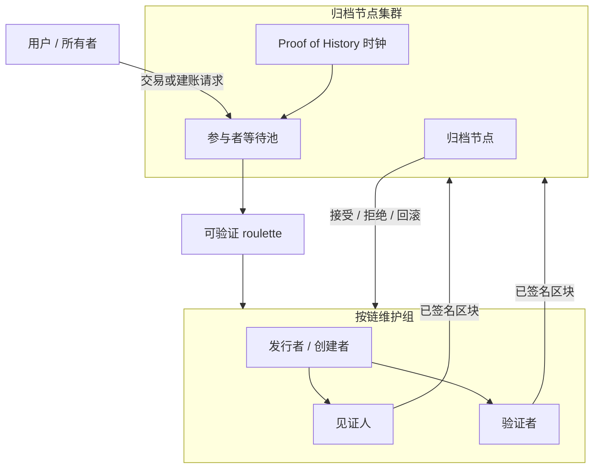

# 去中心化集群多链

## 并行原子分布式账本扩展（CoNET-DLE）

**作者：** Peter Xie  
**初稿：** 2023  
**修订：** 2026-08-11（编辑扩写 + 密码学专章；保留 2023 CoNET-DLE 论题）

**成对译本（必须同步更新）：** [`Decentralization Cluster multi-chain.md`](./Decentralization%20Cluster%20multi-chain.md)  
**同步守则：** `.cursor/rules/conet-layer2-whitepaper-bilingual-sync.mdc`

---

## 摘要

**CoNET 分布式账本扩展（CoNET-DLE）** 是一种集群化、轻量级的 **类 Layer-2 账本扩展** 系统。多个随机选出的见证人（witness）与验证者（validator）为单条短生命周期或价值有界的链组成 **维护组**。网络上大量维护组并发运行，形成 **并行原子账本**，而非挤在一条主链 tip 上。

**传输前提：** CoNET-DLE **加载在 CoNET DePIN 之上**。控制面与数据面的 gossip 以 **钱包地址（EOA）为网络身份**，而非 IP。消息经 OpenPGP 端到端加密，并由 **无法阅读明文** 的入口 / 邮箱节点中继，从而为 L2 参与者（发行者、见证人、验证者、用户）提供 **天然的元数据隐私**。

CoNET-DLE 保持区块链级的 **不可篡改性**，并面向持续可用、线性扩展、灵活参与与事件驱动时延。基于质押、按组本地的共识消除全局 PoW 竞跑。随质押节点增加，可并发维护的链数量上升。区块 **仅在有事件时** 产生，更适合交易作用域账本（如 CoNETCash 类资产链），而非固定间隔的空块。

本文是 **去中心化集群 / 多链** 层的设计白皮书。§7 密码学仅采用 **成熟、生产验证过的原语**（secp256k1 / EIP-191、OpenPGP、AES-GCM、SHA-256/Keccak-256、commit–reveal、可选 ECVRF）。它与 CoNET DePIN / CoNET-SI 及 CoNET **主链 / 注册表** 互补——**不是** 全局 PoS L1 的替代品。

---

## 1. 引言

链上应用扩展后，需要记录的状态越来越多。以主链为中心的共识在单一 tip 上浪费算力，全局出块终局过慢成为瓶颈。许多 L1 / L2 仍继承 **单一逻辑 tip**（或少量共享 tip），负载升高时再次出现拥堵与手续费压力。

CoNET-DLE 走另一条路：按 **账本分片**，而不只是在一条账本上做吞吐技巧。每个应用或资产实例可拥有自带发行者、见证人、验证者的 **轻量链**。安全与经济终局由以下机制加固：

1. 参与者在 CoNET 上的 **质押**。
2. **可验证随机选取**（归档节点熵上的 roulette）。
3. 新区块的 **100% 组内共识**（否则解散并重选）。
4. **归档节点集群** 存储全量状态并做质量检查 / 回滚。
5. 可选的 **主链 NFT** 绑定，用于限制资产链价值与所有权。

质押矿工按自身算力与网络能力决定同时承销多少条链。轻量验证者不必存全历史，可按需参与——减轻资本型 PoS 与 ASIC PoW 垄断带来的中心化压力。

**部署基底：** 该 L2 不另造 IP 覆盖网。它 **加载在 CoNET DePIN** 上，因此 waiting-pool 宣告、任务要约、出块提案与投票均以 **钱包寻址、OpenPGP 加密的 gossip** 传输（入口 A → 邮箱 B；listen 经入口 C ≠ B）。密码学细节见 **§7**。

---

## 2. 问题陈述

| 问题 | 为何重要 |
| --- | --- |
| 新区块共识缓慢 | 全局 tip 协定无法随需求扩展 |
| 计算资源浪费 | 空 tip / 争夺 tip 上的空转或竞跑 |
| 高 gas / 手续费 | 单一区块空间市场排挤小额支付 |
| 51% / 资本集中 | PoW 与 PoS 倾向资源垄断 |
| 可扩展性瓶颈 | 单链或单 rollup 天花板 |
| 共识中心化 | 大验证者 / 矿池主导选取 |

**设计目标：** 保留去中心化与不可篡改，但以 **并行、按账本的共识** 作为扩展单位。

---

## 3. 设计论题

### 3.1 并行原子账本

- **并行：** 多条链独立前进；节点增加 → 可维护链数量增加。
- **原子（按链）：** 在一条链内，新区块须获该步所选维护组（发行者 / 创建者、见证人、验证者，由链合约定义）的完全同意。
- **爆炸半径有界：** 一条链的危机不阻断无关链。

### 3.2 事件驱动出块

若无事件（交易 / 状态变更请求），则 **不产生新块**，避免空块开销，匹配支付 / 回执工作流。

### 3.3 集群化维护组

链的安全不依赖「全网每 slot 投票」，而依赖 **小规模随机抽取的组** 加上归档集群的最终质量检查。不诚实或超时成员被替换；质押面临风险。

### 3.4 与 CoNET 栈的关系（概念）

```text
+-------------------------------------------------------------+
| CoNET 主链 / 注册表（身份、质押、NFT、AddressPGP）            |
+-----------------------------+-------------------------------+
                              | 锚定 / 费用 / NFT / PGP 注册
+-----------------------------v-------------------------------+
| CoNET-DLE L2 - 去中心化集群（本文）                           |
|  多条资产 / 存储链 x 并发维护组                              |
+-----------------------------+-------------------------------+
                              | 加密 gossip（钱包 != IP）
+-----------------------------v-------------------------------+
| CoNET DePIN / CoNET-SI - 钱包地址 P2P + 入口/邮箱            |
|  OpenPGP 密文; A->B 发送; C->B listen; 零信任跳              |
+-------------------------------------------------------------+
```

**构造级隐私：** L2 角色不以 IP 互拨。它们寻址 **钱包 / PGP 身份**；DePIN 中继只转发密文。入口与邮箱节点获知路由 key id，而非业务明文或稳定客户端 IP（见 §7）。

历史产品示例：**CoNETCash** 类工具——每张票据为 NFT 背书、价值封顶的账本（经典上限约 **$100**），自带轻量链，由随机选出的 CBDC/发行者、见证人与验证者维护，并采用事件驱动出块。

---

## 4. 系统概览

### 4.1 两类链

| 类别 | 用途 | 说明 |
| --- | --- | --- |
| **资产类链** | 可转让价值，常绑定主链 NFT | 每条资产链价值 **封顶**（设计目标：不超过等值 **$100**）。转让费可从资产本身扣除。 |
| **存储类链** | 数据 / 日志 / 应用状态 | 捆绑的 CoNET 钱包支付存储；欠费则 **停止新块**。捆绑钱包可更换。 |

### 4.2 链属性

- **所有权** 由主链绑定（NFT / 注册表）与本地创世规则定义。
- **功能有限：** 创世嵌入该链 **唯一预定义 VM 程序**。链之间 **不** 自由互通（刻意隔离）。
- **安全来源：** 质押 + 随机组选取 + 归档质量检查；资产链额外继承 **主链 NFT** 绑定安全。

### 4.3 角色图



---

## 5. 角色

### 5.1 质押归档节点

- DLE 平面的全局 **全节点**：存储各链及质量检查所需完整状态。
- 对存入区块做 **最终质量检查**：接受，或 **解散该组** 并组织回滚 / 重新共识。
- 归档节点之间的对等网络主要用于 **归档发现与归档共识**；不随意把其它角色节点当对等 gossip 对象。
- **RPC** 仅对授权参与者与链所有者开放。
- 本地运行 **Proof of History（PoH）** 序列，为等待池事件打时间戳与排序（见 §7）。

### 5.2 归档节点组（集群）

- 归档节点通过 **NFT** 在 CoNET 注册，获得唯一 token ID。
- 当归档节点数超过设计参数的倍数（文档基线：**每组约 10**）时，集合 **分裂** 为更多组（例如总数 \(> N \times 10\) 时形成 \(N+1\) 组）。
- 成员资格由 **token ID 排序** 确定性归属（自动分组）。
- 新归档节点加入 **当前最小** 组（负载均衡）。
- 新链所属归档组由 **链 NFT token ID** 推导（奇偶或模映射，以注册表实现为准）。
- 较小的组可获得更高的人均收益；经济压力促进分裂与再平衡。

### 5.3 质押见证人

- 参与某条链的 **全生命周期**。
- 存储该链的 **全部数据**（链本地全参与者）。
- 不诚实 → 移出该链；质押 / 收益面临风险。
- 质押规模限制其可同时承销的链数量。

### 5.4 质押验证者

- **轻量** 节点：不必存储完整链历史。
- 可仅为 **单个区块**（或短任务）参与共识后离开。
- 实现无存储垄断的按需去中心化。

### 5.5 发行者 / 创建者

- 由 roulette 为创世或出块任务抽出。
- 执行链上预定义智能合约 / VM 逻辑以提出区块。
- 收集见证人与验证者签名，再向归档集群提交。

---

## 6. 共识模型

### 6.1 按链共识规则

- 新块接受要求该步所选维护组成员达到 **100% 同意**。
- 若同意失败（超时、拒签、签名冲突、归档拒绝）：

  1. **解散** 当前 tip 的维护组。
  2. **排除** 原组成员立即重选资格（防串谋）。
  3. 经可验证 roulette **重选** 新组。
  4. 可按合约规则 **罚没 / 再分配** 质押。

### 6.2 创世块流程

1. 用户向请求池提交 **新建账本请求**。
2. Roulette 在质押矿工中选出 **发行者**；发行者运行预定义合约构建创世（该链全局定义）。
3. 合约返回随机选出的 **见证人与验证者**。
4. 发行者签署创世并提交给见证人 / 验证者。
5. 见证人与验证者验证、本地存储并返回签名。
6. 归档集群质量检查后记录最终创世。

### 6.3 新块流程

1. 用户向发行者（或当前 tip 发行者角色）提交交易 / 事件。
2. 发行者运行链上预定义交易合约 → 候选块。
3. 合约（或选取层）返回验证者（及所需见证人集合）。
4. 发行者签署并分发验证。
5. 见证人 / 验证者验证并存储；签名回到发行者 / 归档路径。
6. 归档集群最终确认或回滚。

### 6.4 超时与继任

| 故障 | 恢复（设计） |
| --- | --- |
| **创建者 / 发行者超时** | 第一见证人成为发行者；上块验证者可晋升为见证人；重新验证 tip。 |
| **见证人超时** | 排除该见证人；上块验证者可成为见证人；重新验证。 |
| **拒签** | 合约解散组；新随机组；攻击者失去质押；诚实方可获奖励。 |
| **归档共识不完整** | 拒绝 tip；执行回滚程序（§9）。 |

---

## 7. 密码学（仅成熟原语）

本章规定 CoNET-DLE **作为加载于 CoNET DePIN 的 L2** 的密码学平面。下列构造均因已标准化或经生产验证而被选用。新颖 ZK/SNARK 栈 **不在** 基线范围。

### 7.1 威胁模型与隐私目标

| 对手 | 假定能力 | 密码层目标 |
| --- | --- | --- |
| 好奇的入口 / 邮箱跳 | 见密文、时序、收件人 **PGP key id** | 无法阅读 L2 业务明文 |
| 单跳网络观察者 | 见该跳 TCP 对端 IP | 无法在 A≠B / C≠B 路径上将该 IP 映射到 **逻辑** 收发钱包 |
| 维护组少数串谋 | 持有部分 secp256k1 密钥 | 无法伪造全组出块接受 |
| 自适应质押攻击者 | 购买质押、加入等待池 | 无法在不被发现的情况下偏置 roulette（commit 失败 / VRF 校验失败） |
| 离线存储攻击者 | 窃取单个验证者磁盘 | 受任务密钥与验证者无全历史要求限制 |

**非目标（基线）：** 对抗可关联 **全部** 入口节点的全球被动流量分析；对 **必须** 看见区块的一方（该链见证人）隐藏内容。隐私来自钱包地址 gossip + E2E 加密的 **自然属性**，而非 mixnet。

### 7.2 原语目录（实现基线）

| 层 | 原语 | 成熟锚点 | 在 CoNET-DLE 中的用途 |
| --- | --- | --- | --- |
| 钱包身份 | **secp256k1** ECDSA | Bitcoin / Ethereum | 节点与用户 EOA |
| 认证签名 | **EIP-191** `personal_sign` | 以太坊钱包 | Gossip 命令、listen、任务 ACK |
| 结构化域签名（可选） | **EIP-712** | 以太坊 dApp | 归档选取 commit、质押操作 |
| 目录 | 链上 **AddressPGP** 注册表 | CoNET 现网 | EOA → 用户 PGP + 路由密钥 |
| 非对称消息加密 | **OpenPGP**（RFC 4880 / **RFC 9580**）+ **X25519**（及所用的 Ed25519） | OpenPGP 生态 | 向收件人加密 L2 信封 |
| 对称 AEAD | **AES-256-GCM**（NIST SP 800-38D） | TLS、age 等 | 可选大包 / 会话封装 |
| 会话（listen 路径） | AES-256-CBC + 显式 MAC **或** 优先 GCM | 现有 CoNET-SI listen | 长连接会话密钥 |
| 哈希 | **SHA-256**、**Keccak-256** | NIST / 以太坊 | PoH tick、以太坊摘要、armor 哈希 |
| KDF | **HKDF-SHA256**（RFC 5869） | TLS 1.3、OpenPGP v6 | 派生任务 / 分片密钥 |
| 随机信标（主） | 基于 secp256k1 的 **Commit–reveal** | 经典分布式 RNG | 归档 roulette 熵 |
| 随机信标（可选） | **ECVRF**（IETF 草案 / 生产 VRF） | Algorand 等 | 不可偏置的每节点票据 |
| 密文完整性 | `keccak256(utf8(armor))` | CoNET fragment / ACK 实践 | 投递去重与邮箱 ACK |

**库指引（非规范）：** OpenPGP 用 `openpgp.js` / Sequoia / GPG；EIP-191 用 `ethers.js` / libsecp256k1；AES-GCM 用 OpenSSL / BoringSSL / WebCrypto；**禁止**自定义 ECC 曲线。

### 7.3 身份：钱包地址，非 IP

1. 每个 L2 参与者（用户、发行者、见证人、验证者、归档运营进程）以 secp256k1 派生的 **EOA** `0x` 地址标识。
2. 同一 EOA 在主链质押，并用 **EIP-191** 签署 DePIN 命令。
3. 每个参与者在 **AddressPGP** 注册绑定该 EOA 的 **OpenPGP** 证书（加密子钥 = 路由 key id）。
4. **IP 地址只是单跳的传输偶然**，绝非协议标识符。客户端 **不得** 要求知晓对端 IP 才能加入共识。

```text
逻辑身份:  EOA  ──注册──►  userPublicKeyArmored + routeKeyID
Gossip 寻址: encrypt(to = 用户 PGP | 路由 PGP)
物理路径:   客户端 → 入口 A/C → 邮箱 B   (A,C ≠ B)
```

### 7.4 DePIN gossip 密码学（发送路径 S → A → B）

与 CoNET DePIN 零信任邮箱路由对齐：

1. 发送方构建 L2 信封（JSON）：`{ timestamp, text, from: EOA, signMessage }`，其中 `signMessage = EIP-191(text)`。
2. `literal = base64(UTF8(JSON.stringify(envelope)))`。
3. 用 OpenPGP 将 `literal` 加密给 **收件人用户 PGP**（业务载荷 **不要** 加密给邮箱路由密钥）。
4. 将 `{ data: armoredCiphertext }` `POST` 到一个或多个健康 **入口节点 A**，且 **A ≠ B**（收件人邮箱）。
5. 入口 **A** 仅查看 OpenPGP 收件人 key id → 查找邮箱 **B** → 经节点间 HTTP 转发。**A 不解密。**
6. 邮箱 **B** 存储密文；**B 不解密** 业务载荷。仅收件人 R 用用户私钥打开。

`text` 中承载的 **L2 消息类型**（示例）：等待池宣告、任务要约、出块提案摘要、签名份额、超时投诉、存储费回执。应用解析器按需展开嵌套 JSON。

### 7.5 DePIN listen 密码学（R → C → B）

用于长期参与（等待池 / 任务 SSE 推送）：

1. 参与者将 listen 命令加密给 **邮箱 B 的路由 PGP**（非用户 PGP）：
   `{ command: 'mining', listenKind: 'dle' /* 或产品标签 */, walletAddress, algorithm, Securitykey, timestamp }`，并 EIP-191 签名。
2. HTTP/SSE 经健康 **入口 C ≠ B** 连接。
3. **B** 仅用路由密钥解密 listen 命令，将 `walletAddress` 绑定到 SSE，随后推送密文。
4. 会话 `Securitykey` 通道优先 **AES-256-GCM**；若兼容需要 AES-CBC，则必须对密文附加显式 HMAC-SHA256（Encrypt-then-MAC）。新部署应统一为 GCM。

`listenKind` 区分 DLE 任务流与 LayerMinus 挖矿 / chat，避免驱逐策略串管道。

### 7.6 为何形成 L2 的「天然隐私」

| 属性 | 机制 |
| --- | --- |
| 无 IP 身份 | 对等方以 EOA / PGP key id 寻址 |
| 隐藏发送入口 | 经任意入口 **A** 发送，而非直连 B |
| 隐藏接收入口 | 经任意入口 **C** listen，而非直连 B |
| 机密性 | OpenPGP E2E；中继只见密文 |
| 真实性 | EIP-191 将 `from` 绑定到信封 `text` |
| 角色可链接性受限 | 新鲜任务密钥（§7.10）；可选每链临时 PGP 子钥 |
| 元数据有界 | 中继得知「给 key id K 的密文」，而非金额或块体 |

残留元数据（大小、时间、key id）可接受；mixnet 级填充为可选加固，非基线必需。

### 7.7 区块与投票密码学（共识平面）

**区块摘要**

```text
blockHash = keccak256(rlp_or_canonical_encode(header || txs || stateRoot))
```

使用冻结的规范编码（RLP 或确定性 JSON + 长度前缀）。复用以太坊工具时优先 **Keccak-256**；若 PoH 与摘要统一使用 **SHA-256** 亦可——但 **同一对象不得混用** 摘要函数。

**成员投票**

```text
vote = EIP-191( "CoNET-DLE/vote/v1" || chainId || chainNFT || height || blockHash || role || eoa )
```

收集 **全部** 必要成员（发行者、见证人、验证者）的 ECDSA 签名。归档验证：

1. `ecrecover` 与 roulette 所选集合匹配。
2. 集合完整度 = 所需角色的 100%。
3. `blockHash` 与存入体重新计算的摘要一致（或体可用性证明）。

**基线不做自定义 BLS 门限密码学**——门限 BLS 在部分栈中成熟，但运维复杂；**显式收集** secp256k1 多重签名已足够且广泛可用。

### 7.8 可验证 roulette 密码学

#### 7.8.1 主方案：commit–reveal（推荐基线）

对归档组大小 \(n\)、轮次 \(r\)：

1. 每个归档 \(i\) 采样 \(s_i ← \{0,1\}^{256}\)。
2. **Commit：** 经 OpenPGP 加密（对归档对等方）或 gossip 广播：
   `C_i = keccak256(s_i || eoa_i || r || groupId)`，并对 `C_i` 做 EIP-191 证明。
3. 过 commit 截止（PoH tick / 墙钟界）后 **Reveal** \(s_i\)；对等方检查 `keccak256(...) = C_i`。
4. 聚合：
   `R = keccak256(s_1 || … || s_n || r || chainSeed)`
   缺 reveal → 该归档失去本轮 \(r\) 奖励；缺失过多则中止本轮。
5. 将 \(R\) 映射到等待池排序（在 PoH 有序列表上做 Fisher–Yates 或模索引），选出发行者、见证人、验证者、候补。

**性质：** reveal 前不可预测；至少一个诚实 \(s_i\) 即可抗偏置；仅用哈希 + 签名即可实现。

#### 7.8.2 可选：ECVRF 票据

每个合格质押者发布 `ticket = VRF_sk(seed_r)`。最高 / 按哈希排序的有效票据赢得角色。用标准 ECVRF verify 校验。在自适应参与下需要不可偏置的质押加权选取时，作为 **升级路径**；票据仍经 DePIN 密文通道 gossip。

#### 7.8.3 选取日志

归档集群将 `{ r, R, commits, reveals, selected[] }` 追加到 **选取链**（SHA-256/Keccak 哈希链接）。条目作为 L2 消息 gossip，并镜像到归档存储。智能合约创世仅在归档证明签名之后消费 `selected[]`。

### 7.9 Proof of History（排序基底）

归档节点维护本地序列：

```text
h_0 = IV
h_{t+1} = SHA-256(h_t)
```

周期发布 `(t, h_t, eventDigest)` 检查点。等待池加入 / 离开事件绑定最新 `(t, h_t)`。对等方通过重算（或验证检查点）核实区间。这 **不是** Solana 共识；它是 **可验证时延 / 排序辅助**，使归档在不完全信任 NTP 的情况下就参与者顺序达成一致。

### 7.10 任务密钥与见证人存储

| 材料 | 派生 | 寿命 |
| --- | --- | --- |
| 任务会话密钥 | `HKDF-SHA256(master = ECDH_or_shared, info = "dle|task|"‖taskId)` | 单块任务 |
| 链见证人存储密钥 | 由见证人质押密钥 + `chainNFT` 派生 | 链生命周期 |
| 投递 ACK id | `keccak256(utf8(openpgp_armor))` | 直至 ACK |

验证者投票后 **应当** 擦除任务密钥。见证人可用 OS 密钥库 / age / OpenPGP 对称包加密静态链数据——属实现选择，非协议强制。

### 7.11 反懒惰验证（假证明抽样）

对存储 / PoRep 类检查：复制节点偶尔提交带隐藏种子的 **假证明**。接受该证明的验证者在种子揭示后可被罚没。构造仅用哈希与 EIP-191 reveal——无奇异密码学。

### 7.12 具体消息形态（规范草图）

```text
L2Envelope {
  v: 1
  kind: "dle.task.offer" | "dle.block.propose" | "dle.vote" | "dle.roulette.commit" | …
  chainId: uint64          // CoNET L1 id，例如 224422
  chainNFT: bytes32
  from: address            // EOA
  ts: uint64               // unix 秒；拒绝 |now-ts| > 600
  body: json               // 按 kind
  signMessage: hex         // 对规范 body 字段的 EIP-191
}
→ UTF-8 JSON → base64 → OpenPGP encrypt(to = recipientUserPGP | routePGP)
→ 在入口 A 或 C 上 POST /post
```

### 7.13 实现检查清单

- [ ] 业务 L2 载荷加密给 **用户 PGP**；listen 命令加密给 **路由 PGP**。
- [ ] HTTP 入口 **A/C ≠ 邮箱 B**；永不把直连 B 当作产品路径。
- [ ] 每条命令均 EIP-191；拒绝错误的 `ecrecover`。
- [ ] listen 会话密钥用 AES-GCM（或 CBC+HMAC）；禁止裸 CBC。
- [ ] Roulette = commit–reveal（基线）+ SHA-256/Keccak；可选后续 ECVRF。
- [ ] 出块接受 = 对 `blockHash` 的全套 secp256k1 投票。
- [ ] 日志不含私钥；中继不做明文镜像。

---

## 8. 可验证 Roulette 与等待池（运维）

密码学细节以 **§7.8–§7.9** 为准。本节描述运维行为。

### 8.1 REST / gossip 等待池

- 非归档参与者通过 **DePIN gossip** 宣告就绪（并可保持面向归档的 REST/SSE 等待句柄），等待下一验证任务。
- 若参与者已有活跃等待会话，归档 **终止前一会话** 并将其排到顺序 **末尾**（防占坑）。
- 等待参与者排序由归档节点间的 **Proof of History** 时间戳协定（§7.9）。

### 8.2 经 CoNET DePIN 的匿名参与

- 参与者节点经 CoNET DePIN / CoNET-SI 的 **钱包地址 gossip** 到达 CoNET-DLE——**不以 IP 为身份**（§7.3–§7.6）。
- 等待池与任务消息为 OpenPGP 密文；入口 / 邮箱跳保持零信任。

### 8.3 创建验证组

1. 托管归档运行 **commit–reveal**（或 ECVRF）熵轮（§7.8）。
2. 聚合随机性驱动 **roulette**，抽出创建者、见证人、验证者（及候补位）。
3. 归档节点证明抽取后，记录到 **选取日志**。
4. 创建者执行智能合约以实例化或扩展该链。
5. 入选节点离开等待列表；未使用的候补回到原位置。

### 8.4 公地悲剧（PoRep / 懒惰验证）

见 §7.11。在 PoS 验证者与 PoRep 复制节点之间拆分挖矿收益；假证明抽样罚没懒惰验证者。

---

## 9. 归档质量检查与回滚

任一归档节点在组或归档共识未通过质量检查时可触发回滚。

1. 拒绝不合格 tip。
2. 解散该链当前维护组。
3. 重选全新随机组（**原成员无资格**参加立即一轮）。
4. 在新组下再生该块。
5. 惩罚作弊：

   - 作弊者可被禁止再加入归档；收益与质押进入 **收益 / 奖励池**。
   - 诚实举报者可按合约规则获奖励。

**终局：** 当归档组达到所需共识时，归档签名最终确认存入块。共识不完整 → 拒绝 + 回滚。

---

## 10. 虚拟机

CoNET-DLE VM 规定为 **简化、兼容 EOS 合约** 的执行环境，并带 DLE 特有扩展：

- 开发者在创世定义 **交易作用域** 链逻辑。
- 全局平台能力（选取、质押钩子、费用钩子）经 DLE host 函数提供。
- 每条链只运行 **一个** 预定义程序面——不是带自由跨链调用的开放多合约世界计算机。

*（编辑注：部分早期草稿提及「唯一 EVM」；一致的设计线是带有限、创世绑定逻辑的 **EOS 兼容简化 VM**。）*

---

## 11. 特性摘要

| 特性 | 机制 |
| --- | --- |
| 权益证明参与 | 质押成为发行者、见证人、验证者；100% 组共识 |
| 天然隐私传输 | L2 在 CoNET DePIN：钱包地址 gossip + OpenPGP E2E（§7） |
| 更好的去中心化 | 轻量验证者；无全量存储的按需参与 |
| 并发执行 | 同一质押者可以不同规则服务多条链 |
| 高可扩展性 | 按链动态聚类；参与者增加 → 可维护链增加 |
| 安全可靠 | 每组随机不同矿工；失败则解散并重选 |
| 高效计算资源 | 工作限于活跃事件与小组 |
| 伤害有限 | 链危机保持局部 |

---

## 12. 安全威胁模型

### 12.1 组内拜占庭分歧

**缓解：** 要求全组共识；失败则解散并重选；罚没攻击者质押。

### 12.2 每条资产链价值有限

价值封顶（如 **$100**）相对质押风险与协调成本限制攻击者收益——对 CoNETCash 类票据尤其相关。

### 12.3 创建者与见证人 / 验证者串谋

选取在大规模质押集合上随机且组短命 / 任务作用域，针对 **特定** 目标链凑齐固定串谋多数概率低且昂贵。串谋失败则质押受损。

### 12.4 签名 / 活性故障

由超时继任与拒签解散处理（§6.4）。

### 12.5 双花与垃圾（资产链）

转让由发行者 + 见证人 + 验证者验证。检出串谋 → 罚没 CBDC/见证人质押并奖励诚实验证者。经主链合约铸造 / 赎回控制垃圾；封顶链价值限制攻击成功收益。

### 12.6 归档俘获

随成员增长归档组分裂；质量检查要求归档组共识；作弊归档可被禁并转移质押。长期安全仍依赖归档集群诚实多数假设与主链注册表完整性。

### 12.7 传输 / 隐私对手

见 §7.1 与 §7.6。试图解密明文的中继因无会话密钥而失败。直连邮箱客户端属 **协议违规**，非支持模式——会削弱入口隐私。

---

## 13. 经济（设计大纲）

| 流 | 意图 |
| --- | --- |
| 质押 CONET（或指定资产） | 具备归档 / 见证人 / 验证者 / 发行者资格 |
| 存储费 | 捆绑钱包支付存储类链；欠费 → 停新块 |
| 资产转让费 | 按配置从资产类价值扣除 |
| 挖矿 / 任务奖励 | 支付诚实组成员；资助罚没再分配 |
| 组规模 vs 收益 | 较小归档组可提高人均份额 → 自然分裂 / 再平衡 |
| 主链治理 | 主观费用参数、铸票支持的稳定币种类、上币规则等——在适用时由代币持有者投票 |

CoNETCash 类铸毁历史上将部分铸 / 兑活动与 CONET 供给动态挂钩（按市价 burn/mint）——属 DLE 之上的 **应用层** 政策，并非每条存储链必需。

---

## 14. 对比速写

| 方案 | Tip 模型 | 典型瓶颈 | CoNET-DLE 对照 |
| --- | --- | --- | --- |
| 单体 L1 | 一个全局 tip | Gas + 出块时间 | 许多独立 tip |
| Optimistic / ZK L2 | 共享 rollup tip / 批市场 | Sequencer + L1 数据成本 | 并行按账本组 + DePIN 隐私传输 |
| App-chain / subnet | 每应用一条重链 | 验证者集成本 | 超轻量、事件驱动、价值封顶链 |
| 侧库 / 中心化 API | 链下可变 | 信任与可用性 | 链上不可篡改 + 归档检查 |
| 以 IP 为身份的 P2P L2 | libp2p / TCP 身份 | IP 元数据泄露 | 钱包地址 gossip；中继永不见明文 |

CoNET-DLE 精神上最接近 **「许多微账本 + 随机委员会 + 归档终局者」**，承载于 **CoNET DePIN 钱包地址 gossip**，优化私密、支付友好的有界状态机，而非通用共享区块空间。

---

## 15. 开放设计问题 / 实现备注

以下条目显式留下，便于工程冻结参数而不改写论题：

1. 精确归档组大小 \(K\)、分裂阈值与 NFT→组映射函数。
2. 冻结 **commit–reveal** 为 v1 roulette；规划可选 **ECVRF**（§7.8）。
3. 若生产加固允许某角色候补 / 低于字面 100% 的法定人数，需明确签名阈值。
4. PoH 参数：SHA-256 tick 速率、检查点间隔、跨归档验证预算。
5. 罚没金额、赏金份额与禁期。
6. VM 指令集冻结及质押 / roulette / 费用的 host ABI。
7. DLE vs 挖矿 vs chat 的 `listenKind` 字符串；新客户端会话 AEAD 仅 AES-256-GCM。
8. 规范块编码（RLP vs 确定性 JSON）与 `blockHash` 的单一哈希函数选择。
9. 归档状态与选取日志的跨版本迁移。
10. 清晰区分 **历史 Avalanche-subnet 时代主链草图** 与 **后期 CoNET L1 / DePIN 部署**——DLE 集群论题保持不变。

---

## 16. 结论

CoNET-DLE 提出以 **去中心化集群** 维护 **并行原子多链**：事件驱动出块、质押担保的随机维护组、归档集群质量终局，以及有界的按链伤害。作为 **加载在 CoNET DePIN 上的 L2**，它继承 **钱包地址（非 IP）gossip**、OpenPGP 端到端加密与零信任入口 / 邮箱跳——参与者天然隐私——同时将质押与 NFT 安全锚定于 CoNET 主链注册表。密码学停留在成熟原语（§7），使设计无需奇异证明系统即可实现。

---

## 参考文献

1. 原 CoNET-DLE 设计笔记 — Peter Xie，2023（本文谱系）。
2. 涵盖 CoNET-SI、CoNETCash 与 CoNET-DLE 的生态评述 — Cointime / 0x237，《CoNET：从基础设施层面出发，能否解决加密隐私问题？》（2023）。
3. **RFC 9580** — OpenPGP（废止 RFC 4880 / 6637）；X25519 加密配置。
4. **EIP-191** — Signed Data Standard（`personal_sign`）；**EIP-712** — 类型化结构化数据（可选域分离）。
5. **NIST SP 800-38D** — AES-GCM；**RFC 5869** — HKDF；**FIPS 180-4** — SHA-256；以太坊 **Keccak-256**。
6. IETF **ECVRF** 草案 / 生产 VRF 部署（可选 roulette 升级路径）。
7. Solana — Proof of History 作为可验证时延 / 排序基底（概念先驱；CoNET-DLE 仅将 PoH 用作归档排序辅助）。
8. Hardin, G. — *The Tragedy of the Commons*（§7.11 / §8.4 激励错配引用）。
9. CoNET Project — Layer Minus / DePIN / AddressPGP 邮箱路由（钱包地址 gossip，A/B/C 零信任跳）。
10. EOSIO / Antelope 合约模型 — 简化合约 VM 目标的先驱。

---

## 附录 A — 术语表

| 术语 | 含义 |
| --- | --- |
| **CoNET-DLE** | 分布式账本扩展；本集群多链 L2 层。 |
| **CoNET DePIN** | 钱包地址 P2P 基底；L2 gossip 传输（非 IP 身份）。 |
| **入口 A / 邮箱 B / 入口 C** | 发送入口 / 密文邮箱 / listen 入口；A,C ≠ B。 |
| **AddressPGP** | 链上注册表，绑定 EOA → 用户 PGP + 路由密钥。 |
| **维护组** | 某链 tip/任务的发行者/创建者 + 见证人 + 验证者。 |
| **归档节点** | 全量状态质量检查者与等待池宿主。 |
| **见证人** | 存储链数据的链本地全参与者。 |
| **验证者** | 轻量共识参与者。 |
| **可验证 roulette** | 归档协定的随机选取（commit–reveal 或 ECVRF）。 |
| **选取链** | 合约执行前协定抽取结果的日志。 |
| **资产类链** | 价值封顶的可转让账本（如 CoNETCash 票据）。 |
| **存储类链** | 付费数据/状态账本。 |
| **EIP-191 投票** | 对规范块/任务摘要的 secp256k1 签名。 |

## 附录 B — 端到端序列（新资产链）

```text
用户 → 请求池
     → 归档 roulette（发行者、见证人、验证者）
     → 发行者运行创世合约
     → 组签署创世
     → 归档质量检查 / 最终确认
     →（之后）用户事件 → 仅在需要时产生事件块
     → 欠费存储或罚没事件 → 按规则停块或重选
```
