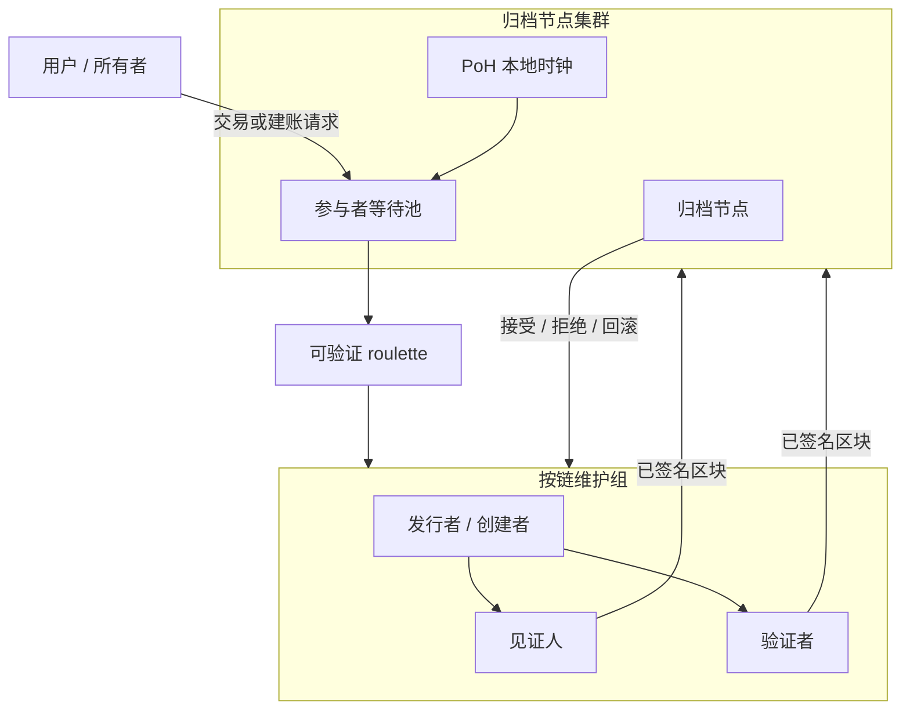

# 去中心化集群多链

## 并行原子分布式账本扩展（CoNET-DLE）

**作者：** Peter Xie  
**初稿：** 2023  
**修订：** 2026-08-11ab（产品冻结：无 tip 虚拟机——按类固定事件状态机；应用层组合 — §10）

**成对译本（必须同步更新）：** `[Decentralization Cluster multi-chain.md](./Decentralization%20Cluster%20multi-chain.md)`  
**同步守则：** `.cursor/rules/conet-layer2-whitepaper-bilingual-sync.mdc`

---

## 摘要

**CoNET 分布式账本扩展（CoNET-DLE）** 是一种集群化、轻量级的 **类 Layer-2 账本扩展** 系统：**大量并行、以事件为基础的原子链**（架构目标：容量随质押 / 归档分片增长，而非单一共享 tip）；每个区块由托管 **归档分片** 抽选的 **验证人委员会** **提案**（抽选 N_V=7，需 **Q_V=5/7** 签名），再仅由该分片的 **归档证书**（N_A=3f+1、Q_A=2f+1）**终局**——而非单一全局 tip 或单一归档节点。

- **并行：** 并发链随质押与归档平面裂变扩展；容量↑ → 可维护 tip↑——**不是** 无界免费吞吐的断言。
- **原子（按链）：** tip 前进须获 **Q_V=5/7** 验证人证明，再获托管分片的 **归档证书**（§6.5、§5.2.1）。
- **仅事件出块：** **无事件 ⇒ 不出块**；禁止空 slot 挖矿。
- **L1 出生证明：** 创建新链 **必须** 在 CoNET L1 铸造 **唯一 NFT**；NFT 绑定类别（**资产**、**存储** 或 **交易**）、所有权，以及经 \(H(\mathrm{nftContract}\|\mathrm{tokenId}\|R_e)\bmod S_e\) 决定的 **托管归档集群**（§5.2）。
- **资产封顶持续生效：** 每个资产事件 **重估** tip；若余额 **> 100 USDC**，转出 / 超额 **须建新链**（§4.6）。
- **交易类（原子 NFT 式出售）：** 用户开设 **交易** tip 作为 **L2 订单 / 状态协调器**，挂牌既有 **资产** 或 **存储** 链（报价 ≤ **100 USDC** 等值；**禁止大单**）。**最终原子交割**（支付卖方 **且** 转移标的 L1 NFT 所有权）在一笔 CoNET **L1 Settlement Contract** 调用中完成；交易 tip 随后 **关闭**（§4.7）。
- **存储类创作者经济 / 私密版权交付：** 与 Beamio `**CopyrightContentModule`** 同一论题：所有者碎片化并以授权 DePIN miner 封存私密组装 index；tip/L1 仅存 hash；买方付 **conet-GB**、绑定买方 PGP；**最先完成者** miner 交付买方绑定密文；短期访问 URL + 周期存储费；明文永不上链（§4.8）。
- **版权 ZERO / 版本树：** 存储 tip 形成 **谱系树**（原创 + 修改者）；每个分支点是可经交易类挂牌的 **独立 L1 NFT**；tip 记录 **社交历史**（点赞、评论、引用）作为拍卖估值的 **Web of Trust** 信号（§4.9）。
- **存储销售账本：** 每条存储 tip 维护仅追加的 **销售收入流水**，并 **引用** 实际发生价值转移的并行 **资产类** tip 交易（§4.10）。
- **归档平面裂变 + BFT 终局：** 随归档参与者增多，L2 归档平面按 **2 → 4 → 8 → …** **裂变**；托管分片为 **`H(nftContract∥tokenId∥R_e) mod S_e`**（非可磨号的 `tokenId mod S`），并以 epoch **MigrationCertificate** 交接（§5.2）；每个分片仅在 **N_A=3f+1** 成员中凑齐 **Q_A=2f+1** 签名后方可终局 tip（§5.2.1）。
- **手续费（双轨计价）：** **存储类** 按 **内容** 计费并以 **conet-GB** 结算；**资产类 / 交易类** 事件费以 **USDC** 计价（转账 / 挂牌金额的 **0.01%**）。每一笔 **0.01%** 事件费：**50% → 托管归档分片**，**50% → \(Q_V\) 接受签名的验证人**（§13）。

**传输前提：** CoNET-DLE **加载在 CoNET DePIN 之上**。控制面与数据面的 gossip 以 **钱包地址（EOA）为网络身份**，而非 IP。消息经 OpenPGP 端到端加密，并由 **无法阅读明文** 的入口 / 邮箱节点中继。

**天然隐私（产品冻结）：** 隐私为 **双轨**——**通讯隐私**（DePIN 钱包地址 gossip + OpenPGP）与 **资产隐私**。多地址微额碎片化 **提高链上聚类成本**，并打断 **单地址 = 完整投资组合** 的直接对应；**不** 声称强匿名性，也 **不** 声称「观察者必然失败」（§4.5）。收款 / 转账时，CoNET 冻结 **唯一规范**：基于 **ERC-5564** 的钱包配置（隐身元地址、临时公钥、view tag、announcement 事件、scan/spend 密钥、批量派生、恢复与扫描）——**不是** 可互换的 BIP-47 / BIP-352 运行时。BIP-47 / BIP-352 仅作 **设计参考**；BIP-352 面向 Bitcoin UTXO/Taproot，**不能** 直接作为 CoNET L1/EVM 方案。隐身留在 **钱包 / 客户端**；DLE tip / 归档 / 验证人委员会 **不** 运行地址预言机（§4.5、§7.6）。

**保管安全（有条件）：** 仅有地址碎片化 **并不会** 自动更安全。「非单一私钥掌控全部资产」只有在各碎片密钥处于 **独立密钥域与恢复域隔离** 时才成立。若全部碎片由 **同一助记词、同一设备、同一客户端数据库或同一弱恢复密码** 派生/恢复，攻击者拿到主种子或重组数据库后仍可拿走 **全部** 价值。产品钱包 **应当** 采用 **分层密钥保险库**（scan key 可在线；spend keys 分批派生；高价值碎片硬件或阈值签名；恢复映射加密；不同 shard 不同 derivation domain；单设备每小时合并/转出上限——§4.5、§12.9）。**更高要求的收款人匿名** 同样是 **客户端产品** 问题——钱包如何使用 L2——**不是** DLE tip/归档/验证人基础设施能替客户端解决的问题。

CoNET-DLE 保持区块链级的 **不可篡改性**，并面向持续可用、灵活参与与事件驱动时延。基于质押、按组本地的共识消除全局 PoW 竞跑。**随加入的 miner 增多，能并发承销的链可以更多**；聚合吞吐量可随独立归档分片上升——**不是**「miner 越多 ⇒ 每条 tip 单调越快」。

**关于区块链不可能三角的论题（冻结）：** CoNET-DLE **并非在数学上消除**区块链不可能三角，而是通过大量相互隔离、价值有界（资产 tip ≤ 100 USDC）、事件驱动的微型状态机，**重新划分**安全与扩展边界。聚合吞吐量可以随归档分片横向增长，但其安全性仍取决于归档分片诚实假设、委员会随机抽样、L1 原子结算、数据可用性及客户端密钥隔离（见 §3.4）。

本文是 **去中心化集群 / 多链** 层的设计白皮书。§7 密码学仅采用 **成熟、生产验证过的原语**（secp256k1 / EIP-191、OpenPGP、AES-GCM、SHA-256/Keccak-256、生产 roulette 用 **ECVRF**、commit–reveal **仅 MVP**）。它与 CoNET DePIN / CoNET-SI 及 CoNET **主链 / 注册表** 互补——**不是** 全局 PoS L1 的替代品。

---

## 1. 引言

链上应用扩展后，需要记录的状态越来越多。以主链为中心的共识在单一 tip 上浪费算力，全局出块终局过慢成为瓶颈。许多 L1 / L2 仍继承 **单一逻辑 tip**（或少量共享 tip），负载升高时再次出现拥堵与手续费压力。

CoNET-DLE 走另一条路：按 **账本分片**，而不只是在一条账本上做吞吐技巧。每个应用或资产实例可拥有自带发行者、见证人、验证者的 **轻量原子链**——随质押与归档分片增长，可有 **大量** 此类链并行。安全与经济终局由以下机制加固：

1. 参与者在 CoNET 上的 **质押**。
2. **可验证随机选取**（归档节点熵上的 roulette）进入 **小规模** 维护组。
3. 新区块提案的 **Q_V=5/7** 验证人法定人数（否则按 §6.5 解散 / 提升候补 / 重选）。
4. **归档节点集群** 存储全量状态并做质量检查 / 回滚。
5. **强制 CoNET L1 NFT**：每条新链唯一 token id、**恰好一类**（**资产 / 存储 / 交易**）、所有权，以及（资产类）经 **L1 oracle** 评估、**≤ 100 USDC 等值** 的入金——这是 **单 tip 直接损失上限**，**不是** 串谋动机 → 0 的断言（§12.2）。**交易类** 挂单出售既有资产或存储链；**跨层原子成交** 由 CoNET **L1 Settlement Contract** 执行，而非 tip 本地回滚（§4.7）。

质押矿工按自身算力与网络能力决定同时承销多少条链。轻量验证者不必存全历史，可按需参与——减轻资本型 PoS 与 ASIC PoW 垄断带来的中心化压力。

**部署基底：** 该 L2 不另造 IP 覆盖网。它 **加载在 CoNET DePIN** 上，因此 waiting-pool 宣告、任务要约、出块提案与投票均以 **钱包寻址、OpenPGP 加密的 gossip** 传输（入口 A → 邮箱 B；listen 经入口 C ≠ B）。密码学细节见 **§7**。

---

## 2. 问题陈述


| 问题          | 为何重要                   |
| ----------- | ---------------------- |
| 新区块共识缓慢     | 全局 tip 协定无法随需求扩展       |
| 计算资源浪费      | 空 tip / 争夺 tip 上的空转或竞跑 |
| 高 gas / 手续费 | 单一区块空间市场排挤小额支付         |
| 51% / 资本集中  | PoW 与 PoS 倾向资源垄断       |
| 可扩展性瓶颈      | 单链或单 rollup 天花板        |
| 共识中心化       | 大验证者 / 矿池主导选取          |


**设计目标：** 保留去中心化与不可篡改，但以 **并行、按账本的共识** 作为扩展单位——使聚合容量可随参与者与归档分片增长，**而不** 声称经典不可能三角已被消解（安全性仍有条件——§3.4）。

---

## 3. 设计论题

### 3.1 并行原子账本

- **并行（设计目标）：** 网络承载 **大量** 独立原子链；容量随质押 / 归档平面宽度扩展，而非共享全局 tip——**不是**「无限免费 TPS」的营销断言。
- **原子（按链）：** 在一条链内，新区块须获该步所选 **小规模** 维护组（发行者 / 创建者、见证人、验证者，由链合约定义）的完全同意。
- **爆炸半径有界：** 一条链的危机不阻断无关链；**资产** tip 另约束 **直接** 现金爆炸（≤ 100 USDC）。
- **随 miner 扩容：** 每增加诚实 miner，网络可 **同时** 承销的链更多；更大 roulette 池可 **降低** 攻击者份额 \(p\)——俘获风险仍须 \(P_{\mathrm{prop}}\) / \(P_{\mathrm{year}}\)（§12.3.1）。

### 3.2 事件驱动出块

若无事件（交易 / 状态变更 / 存储写入请求），则 **不产生新块**。**无事件 ⇒ 不出块。** 禁止空块开销，匹配支付 / 回执 / 存储工作流。有效 **每秒交易带宽** 是并行 tip 上活跃事件流之和——不是单一全局 slot 时钟的吞吐。

### 3.3 集群化维护组（每块 N_V=7、Q_V=5/7）

链的安全不依赖「全网每 slot 投票」，而依赖 **双层** 路径：针对 **当前区块提案** 的 **小规模、随机抽选验证人委员会**，再由 **归档分片 BFT** 签发 **归档证书**——唯有后者使 tip 终局（§5.2.1、§6.5）。

**安全根（产品冻结）：** 验证人委员会是 **提案层**（抽选 N_V=7，存入须 **7** 人中的 **Q_V=5** 个签名）；**单独不构成终局**。终局须持有含 **Q_A = 2f+1** 个不同归档签名的 **归档证书**，且分片规模为 **N_A = 3f+1**。任何单一归档节点不得单方接受、拒绝、回滚或存档 tip。**v1 不采用 Q_V=5/5**——全委员会一致被拒绝，因为一名离线 / 超时 / 恶意签署者即可拖死每一轮（§6.5）。

**规范的按块路径（产品冻结）：**

1. 链上出现 **新事件**（**无事件 ⇒ 不出块**）。
2. 托管该链的 **归档分片**（轮次协调者 + 对等方）从 **on-demand miner 等待队列** 中抽选 **N_V=7** 名验证人，外加 **S_{\mathrm{sb}}=2** 名候补。
3. 委员会 **投票**；在 T_{\mathrm{vote}} 内凑齐 **≥ Q_V=5** 个接受签名后 **提交** 区块 / 证明集。
4. 归档成员对存入做质检；若 **合格**，则凑齐 **≥ Q_A** 签名形成 **归档证书** 并 **存档**；否则按同一法定人数规则拒绝 / 重选（§6.3、§9）。

不诚实或超时成员按 §6.5 活性规则替换；双签 / 无正当拒签面临质押风险。大量此类委员会跨链 **并行**，确认时延是 **极小委员会** 法定人数加上 **小分片** 归档法定人数，而非全球 slot。

### 3.4 重新划分不可能三角的运行边界（并非消除）

经典区块链常被表述为 **不可能三角**：在 **去中心化、安全、可扩展** 三者中至多兼顾其二。

**产品冻结（规范主张）：**

> CoNET-DLE **并非在数学上消除**区块链不可能三角，而是通过大量相互隔离、价值有界（资产 tip ≤ **100 USDC**）、事件驱动的微型状态机，**重新划分**安全与扩展边界。聚合吞吐量可以随归档分片横向增长，但其安全性仍取决于归档分片诚实假设、委员会随机抽样、L1 原子结算、数据可用性及客户端密钥隔离。


| 三角顶点     | 经典单 tip 痛点             | CoNET-DLE 回应（有条件）                                                                                                                                                                                               |
| -------- | ---------------------- | ---------------------------------------------------------------------------------------------------------------------------------------------------------------------------------------------------------- |
| **可扩展性** | 单 tip 的 TPS / gas 市场饱和 | **事件驱动** 出块 + 跨大量 tip 的 **小集团并行共识** + **归档平面裂变**（2/4/8…，§5.2）→ **聚合** 带宽可随活跃账本与分片增长；**单 tip** 时延仍受 \(T_{\mathrm{vote}}\)、重选与归档法定人数约束——不是「miner 越多 ⇒ 永远更快」                                                                                                           |
| **安全性**  | 扩容常削弱经济终局或依赖 sequencer | 仍 **有条件**：归档分片 \(N_A=3f+1\) / \(Q_A=2f+1\)；委员会 \(Q_V=5/7\) + \(P_{\mathrm{prop}}\) / \(P_{\mathrm{year}}\)（§12.3.1）；\(E_C\le E_{\max}\)（§12.3.2）；L1 结算 / NFT；DA；资产 tip **直接** 爆炸 ≤**100 USDC**（非「串谋动机 → 0」）；客户端密钥域隔离（§4.5、§12.9） |
| **去中心化** | 全节点 / 验证者硬件与资本门槛集中权力   | **分角色**、按需参与者 **无需同步全部链数据**——仍受质押、抗磨号保证金与诚实分片假设约束                                                                                                              |


**不声称：** 数学上消解不可能三角；无界免费 TPS；串谋动机 → 0；观察者无法关联；miner 越多 ⇒ 每笔交易都更快。

### 3.5 与 CoNET 栈的关系（概念）

```text
+-------------------------------------------------------------+
| CoNET 主链 / 注册表（身份、质押、NFT、AddressPGP）            |
+-----------------------------+-------------------------------+
                              | 锚定 / 费用 / NFT / PGP 注册
+-----------------------------v-------------------------------+
| CoNET-DLE L2 - 去中心化集群（本文）                           |
|  多条资产 / 存储 / 交易链 x 并发维护组                        |
+-----------------------------+-------------------------------+
                              | 加密 gossip（钱包 != IP）
+-----------------------------v-------------------------------+
| CoNET DePIN / CoNET-SI - 钱包地址 P2P + 入口/邮箱            |
|  OpenPGP 密文; A->B 发送; C->B listen; 零信任跳              |
+-------------------------------------------------------------+
```

**构造级隐私：** L2 角色不以 IP 互拨。它们寻址 **钱包 / PGP 身份**；DePIN 中继只转发密文。入口与邮箱节点获知路由 key id，而非业务明文或稳定客户端 IP。另有 **资产持仓为多钱包碎片**，仅在客户端重组（§4.5、§7.6）。

产品主线：每条账本均为 **L1 NFT 绑定** 的 **资产 / 存储 / 交易** 类链（资产 tip 经 oracle **≤ 100 USDC**；交易挂单报价 ≤ **100 USDC**，**原子交割在 L1 `settleTrade`**，§4.7），由随机小维护组维护，且 **仅事件驱动** 出块。

---

## 4. 系统概览

### 4.1 创链门闸（强制 L1 NFT）

创建新 DLE 链 **不是** 可游离于 L2 的自由行为。创建者 **必须先** 在 **CoNET L1** 取得 **唯一 NFT**。该 NFT 是链的唯一公开身份，绑定：


| L1 NFT 绑定项     | 规则                                                                                                                               |
| -------------- | -------------------------------------------------------------------------------------------------------------------------------- |
| **唯一性**        | 一个 NFT id ↔ 一条 DLE 链；无 L1 mint 则无匿名创世。                                                                                           |
| **类别（三选一）**    | mint / 配置时固定为 **恰好一种**：**资产类**、**存储类** 或 **交易类**。                                                                                |
| **所有权 / 归档归属** | 所有者与付费方钩子绑定 NFT id；**归档分片** 为当前归档平面 epoch 下 \(i=H(\mathrm{nftContract}\|\mathrm{tokenId}\|R_e)\bmod S_e\)（§5.2）——**不是** 裸 `tokenId mod S`。任一 DLE 链的 **权威所有者** 为 CoNET L1 **`ownerOf(nftId)`**。 |
| **资产入金（仅资产类）** | 以 **L1 资产** 作为入金 / 资金；由 **L1 oracle** 估值；总值 **不得超过 100 USDC 等值**。**≤ 100 USDC** 边界在每个资产事件上经 oracle **重估复核**；超顶转出须 **建新链**（§4.6）。 |
| **交易标的（仅交易类）** | 创世绑定拟出售的 **标的** 资产类或存储类 NFT id；由 **L1 Settlement Contract** 原子支付卖方并转移 **该标的** 的 L1 所有权（§4.7）。                                    |


**微额碎片化作为损失边界（非防串谋定理）：** 将每条资产链封顶在 **≤ 100 USDC**，并鼓励大量微小并行账本，可约束 **每次成功资产 tip 俘获的直接经济损失**——这是一等 **损失上限**，而非仅 UX。它 **并不** 意味着串谋动机「趋于零」，也 **不能替代** 委员会安全、归档 BFT、俘获概率 P_{\mathrm{prop}} / P_{\mathrm{year}}（§12.3.1），或 **每 epoch 委员会累计暴露** E_C\le E_{\max}（§12.3.2）。同一碎片化亦是 **资产隐私** 的基底；**保管安全** 还须 **密钥域 + 恢复域隔离**（§4.5、§12.9）。运行期 **重估 + 溢出建链**（§4.6）在价格变动后仍守住 oracle 账面封顶。

### 4.2 三类链


| 类别       | 用途                                                       | 入金 / 收费规则                                                                                                                                                                                                     |
| -------- | -------------------------------------------------------- | ------------------------------------------------------------------------------------------------------------------------------------------------------------------------------------------------------------- |
| **资产类链** | 绑定 L1 NFT 的可转让价值账本                                       | 存入 **L1 资产** 作为链资金；**L1 oracle** 估值；**硬顶 ≤ 100 USDC 等值**。每个 **新事件** 须对转账 / 余额 **重估**（§4.6）。自创世起，每一次 **转账事件** 按转账金额（oracle 估值）的 **0.01%** 以 **USDC** 收费；该费 **50% → 托管归档**，**50% → \(Q_V\) 接受签名的验证人**（§13）。                             |
| **存储类链** | 数据 / 日志 / **创作者内容**（付费访问）；**版权 ZERO** 版本节点；**销售账本**      | 所有者可嵌入 **碎片化加密内容** + 访问策略（§4.8）。Tip 可分叉成 **版本树**（§4.9）。Tip 记录 **社交事件** 与仅追加的 **销售收入账本**，并关联并行 **资产类** tx（§4.10）。**按内容的费用与访问** 以 **conet-GB** 结算（非 USDC 0.01% 轨）；欠费则 **停止新块**。购买 **访问权** ≠ 购买 NFT；出售某分支走交易类（§4.7）。                       |
| **交易类链** | 出售既有 **资产** 或 **存储** 链的短命 **L2 挂单 / 撮合协调器**（整账本 NFT 式交易） | 由用户开设；创世绑定 **subjectNftId**；挂单报价 **≤ 100 USDC 等值**；**禁止大单**。Tip 协调冻结 / 撮合 / **SettleReady** AC；**原子付款 + NFT 转移** 在 CoNET **L1 Settlement Contract** 上执行，随后 **交易 tip 关闭**（§4.7）。挂单 / 成交 **事件费** 以 **USDC** 计价，在适用时按同一 **0.01% → 50% 归档 / 50% 验证人** 拆分，费基为报价 / 成交名义金额（§13）。 |


类别在 L1 NFT 创建 / 配置时选定，对该 NFT **不可变**。**无双类链：** 同一 tip 不能既是资产又是交易。「卖掉多枚碎片」= **多笔原子交易挂单**（各 ≤ 100 USDC），而非一笔超大单。

### 4.6 资产类事件重估与溢出建新链

**资产类** tip 的产品冻结（使 ≤ **100 USDC** 不变量在运行期生效，而非仅 mint 时）：

1. 每个 **新事件**（尤其是 **转账**）须用 **L1 oracle**（与入金同系）对该链余额 / 拟议转账 **重新评估**。
2. 若重估后 **链余额 ≤ 100 USDC 等值**，转账可在 **本链** 按 §6.3 正常进行（含以 **USDC** 计价的 **0.01%** 费，按 **50% 归档 / 50% 验证人** 拆分——§13）。
3. 若重估后 **链余额 > 100 USDC 等值**，拟离开本 tip 的 **转出部分**（或超过封顶的超额）**不得** 作为单笔超顶转账留在本链：所有者 / 客户端 **必须新建一条或多条资产类链**（新 L1 NFT + 每条 oracle 封顶入金 ≤ 100 USDC），并把该转出 / 超额价值迁到新 tip 上。
4. 共识与归档 **拒绝** 会使 tip 以重估余额 **> 100 USDC** 终局的资产转账事件，或试图在无匹配 **新链** 出生证明时送出超顶切片。

典型触发是 mint 后的 oracle 升值：创世入金 ≤100，但后续事件重估可能把经济余额推过封顶——故需 **事件时重估 + 溢出建链**，而非一次性检查。

### 4.7 交易类：L2 协调器 + L1 Settlement Contract 原子性

**整账本去中心化原子出售** 的产品冻结（类比对链出生证明做 **NFT 交易**）。

**角色分工（规范）：**


| 层                                | 职责                                                                   |
| -------------------------------- | -------------------------------------------------------------------- |
| **交易类 DLE tip**                  | **链下 / L2 订单簿与状态协调器**：挂单参数、冻结信号、撮合意向、`SettleReady` 归档证书              |
| **CoNET L1 Settlement Contract** | **跨层原子性的唯一提供者**：在 **一笔** L1 交易中支付卖方 **且** 转移 `subjectNftId`——否则二者皆不成 |


**为何 tip 本地「原子回滚」不够**

- DLE tip **无法回滚** 已在 **L1 终局** 的 NFT 转移（或付款）。
- 仅写「买方付款与 `subjectNftId` 转移须在同一 tip 结算事件集内成功，否则 tip 回滚」**并不构成跨层原子性**：任一侧单独提交都会使 L1 与 tip 状态分叉。
- 因此生产成交 **必须** 走 L1 结算合约；仅 tip 事件 **不足**。

**L1 Settlement Contract（产品冻结草图）**

调用形态（ABI 名示意；语义冻结）：

```text
settleTrade(
    tradeId,              // 交易类 NFT / 挂单 id
    subjectNftId,         // 待售资产类或存储类 NFT
    buyer,
    paymentProof,         // 报价资产的托管扣款 / 授权证明
    dleArchiveCertificate // 证明 tip 对该 tradeId + 报价 + 买方 + nonce + 期限已 SettleReady 的 AC
)
```

在 **一笔** CoNET L1 交易中，合约 **必须**：

1. 验证 **DLE 归档证书**（tip 身份、`daRoot` / 成交载荷 hash、≥ Q_A 归档签名—§5.2.1）。
2. 对照 AC 承诺的挂单 / 撮合字段，验证 **报价**、**nonce**、**期限** 与 **买方**（挂单时 oracle ≤ **100 USDC**）。
3. 将 **托管付款** 转给卖方（或与步骤 4 原子释放卖方索取权）。
4. 将 `**subjectNftId**` 转给 `buyer`（自卖方 / 冻结托管）。
5. 标记 `**tradeId` 已结算**（或在 L1 交易 NFT 注册表上 burn / 关闭）。
6. **拒绝重复执行** 同一 `tradeId` / settle nonce（幂等失败）。

任一步失败则 **整笔 L1 调用回滚**——无部分 NFT 转移、无部分放款。

**DLE tip 流程（协调器）：**

1. **标的：** 既有 **资产类** 或 **存储类** 链，以其 **L1 NFT**（`subjectNftId`）标识。卖方须为该标的当前 L1 所有者。
2. **开挂单：** 卖方 **铸造交易类** L1 NFT / DLE tip，创世绑定 `subjectNftId`、报价币种/金额（经 oracle **≤ 100 USDC 等值**）、托管 / 付款资产规则与成交 **期限**。**仅原子单——禁止大单**。
3. **挂单冻结：** 交易 tip 处于 **Open** / **Locked** 时，标的 NFT 在 L1 上 **禁止普通转让**（注册表 / 结算托管）；资产类标的拒绝成交前掏空 tip 的转出。冻结是 tip 协调的 **L1 锁**，不是 tip 仅有软状态。
4. **撮合 → SettleReady：** 买方锁定 / 授权付款（通常进入 **L1 结算托管**，或 `settleTrade` 可扣的 allowance）。Tip 记录撮合字段，并按正常 Q_V + **AC** 规则归档 `**SettleReady`** 事件。该 AC 即 `settleTrade` 的 `dleArchiveCertificate` 输入。
5. **L1 成交（原子交割）：** 任一允许调用方提交 `settleTrade(...)`。**仅当** L1 tx 成功后，权威所有权才是 **买方 = L1 `ownerOf(subjectNftId)`**，付款才终局。Tip 随后记录 **Settled**（附 L1 tx hash）并 **关闭**。**标的资产/存储 tip 在新所有者下继续**（**不**关闭）。
6. **L1 成交前失败 / 取消 / 过期：** tip 可走 **Cancelled** / **Expired → Closed** 并信号 L1 **解冻**；不得声称 tip 回滚能撤销已终局的 L1 转移（此时本不应有）。L1 成交成功后，tip 状态 **必须** 跟随 L1——不得发明 tip 独有的「反结算」。
7. **所售对象：** 是 **标的** NFT / 账本——不是挂单外壳。转让交易 NFT 本身 **不是** 购买挂牌链的产品路径。
8. **组合出售：** 出售多枚 ≤100 USDC 碎片须开 **多笔** 交易挂单（每标的 tip 一笔），与微额碎片化及单 tip 损失上限一致（§4.1、§4.5、§12.2）。

**交易 tip 生命周期：** `Open → Locked → Matched → SettleReady → Settled → Closed`（或未经 L1 成交的 `Cancelled` / `Expired → Closed`）。**Settled** 由 **L1 结算成功** 定义，而非仅 tip 投票。

### 4.8 存储类创作者经济（碎片化内容 + GB 访问权）

**创作者经济存储 tip** 的产品冻结（付费内容访问，**不**转移存储 NFT）：

1. **发布（所有者）：** 创建 / 配置时，所有者将作品拆成 **加密碎片**，生成 **组装 index**（碎片 hash + 顺序 + 碎片密钥 / 解包材料），并把该 index **封给授权交付 miner**——不是 tip、不是归档、也不是验证人委员会。碎片与加密 index 存入 **Beamio IPFS**（`keccak256(utf8(payload))` fragment hash）。存储 tip **只记公开承诺**：`contentIndexHash`、`authorizedNodeKeyHash[]`（AddressPGP / Guardian 节点 key id）、以 **conet-GB** 计价的 **访问价格**、访问有效期与可选保留策略。明文内容 **与明文 index** **绝不** 进入 tip 状态或共识投票。
2. **私密 index 移交（miner 如何拿到秘密且 tip 不暴露）：**

  | 层            | 承载                                       | 谁可读                |
  | ------------ | ---------------------------------------- | ------------------ |
  | **存储 tip**   | `contentIndexHash` + 授权 key-hash 集合 + 价格 | 所有人（仅承诺）           |
  | **IPFS**     | 组装 index 的 OpenPGP（或混合）**密文**            | 仅被列为收件人的 miner PGP |
  | **IPFS**     | 加密内容碎片                                   | 无 index 解包材料则无用    |
  | **Miner 本地** | 解密后的 index + 组装期临时明文                     | 仅该授权交付 miner       |
  | **买方包**      | 以 **买方 PGP** 加密的密文                       | 仅买方                |

  - **加密模式（产品默认）：** **OpenPGP 多收件人** — 一份 index 密文包，收件人为所有者选定的授权 miner PGP（任一可解密）。可选替代：**每 miner 一份副本**（`nodeKeyHash → indexCipherHash` 清单），便于独立吊销 / 重封而不必重加密共享 blob。
  - **配置路径：** 所有者客户端（1）本地生成明文 index；（2）加密给授权密钥；（3）上传密文 → 得到 `contentIndexHash`；（4）提交 tip **Configured** 事件，**仅**携带 hash + 授权集合 + 价格策略。Tip gossip / DePIN **从不**把可解密 index 当作 tip 载荷。
  - **信任边界：** 授权交付 miner **被信任** 在组装时可见明文（交付保管）。Tip 共识验证人与归档对等方只验证 **hash 与事件**——**没有** index 私钥，质检 **不得** 要求明文。所有者用以下手段缓解 miner 泄露：小授权集、质押 / 声誉遴选、轮换（向新集合重加密 index + 新 `contentIndexHash`）、水印、以及剔除 `nodeKeyHash` 的吊销事件。
  - **禁止「把秘密提交上 tip」反模式：** 拒绝任何把原始 index JSON、碎片 AES 密钥或未加密组装指令写入 tip 块或公开投票的程序。
3. **访问权：** 所有者设定谁可购买（开放 / 白名单）、**conet-GB** 价格与过期时间。改价 / 改策略是存储 tip 上的事件（服从冻结的存储类事件转移表，§4.8 / §6.3）。重封 index（新授权集）是带新 `contentIndexHash` 的 **Configured** 更新。
4. **购买（访客）：** 买方支付所有者设定的 **conet-GB** 价格，绑定 **买方 PGP**（`buyerPgpKeyHash` + AddressPGP 可查公钥），并开启购买事件。交付开始前须验付款与 PGP 绑定。**访问购买不转移** 存储链 L1 所有权（对照 §4.7）。购买事件是 **公开元数据**（谁买了、买方 key hash、截止时间）——**不** 再传私密 index。
5. **交付（授权 miner）：** miner 监听购买事件（DePIN gossip / tip feed）。持有匹配授权密钥的 miner：
  - 按 `contentIndexHash` 从 IPFS 拉取 index 密文；
  - 用 **自身** PGP 私钥链下解密 index；
  - 从 IPFS 拉取碎片并在本地 **重组** 内容；
  - 以 **买方 PGP** **再加密** 交付包；
  - 将买方绑定密文上传 IPFS，并记录 `buyerEncryptedContentHash`（以及 tip 程序要求的买方绑定 index 指针）。
6. **最先完成者：** 对该购买的首次有效完成锁定交付记录；后续完成者须失败或 no-op。共识 / 归档经正常 **Q_V=5/7** 提案路径证明购买与完成事件；明文不得出现在公开投票中。
7. **买方还原：** 仅买方持其 PGP 私钥可解密买方包，并凭 **买方绑定 index** 还原原文。中继、归档对等方与无关 miner 仅见密文 / hash。
8. **币种：** 访问价与相关内容交付费以 **conet-GB** 计价（存储类内容轨——§13）。§4.2 的 tip 保留 / 欠费停块规则对存储维护费仍适用。
9. **过期 / 保留：** 超过 `accessExpiresAt`（及/或欠费的 `storagePaidUntil`）后，miner 须停止签发访问 URL；过期购买须重新付费才能再开。
10. **Tip / 模块状态（对齐 CopyrightContentModule）：** 存储程序（以及作为 L1 邻近面的 Beamio catalog 模块）仅保留 **有界** 字段——**禁止** tip 上无界买方 / 评论 / URL 数组：


| 字段                                   | 含义                                                                  |
| ------------------------------------ | ------------------------------------------------------------------- |
| `contentIndexHash`                   | **加密** 组装 index 的 IPFS hash（`keccak256(utf8(payload))` → `bytes32`） |
| `authorizedNodeKeyHash[nodeKeyHash]` | 所有者选定的交付 miner / Guardian PGP key hash                              |
| `purchaseId`                         | 单次访问购买派生 id（`tipNft` / card + buyer + nonce）                        |
| `buyerPgpKeyHash`                    | 购买时绑定的买方 PGP（AddressPGP 可解析）                                        |
| `accessExpiresAt`                    | 该次购买的所有者设定访问截止                                                      |
| `storagePaidUntil`                   | 完成者节点被付费保留 / 服务的期限                                                  |
| `completedByNodeKeyHash`             | 最先完成者；锁定前为 `0`                                                      |
| `buyerEncryptedContentHash`          | 买方 PGP 密文包的 IPFS hash                                               |


1. **规范事件（与 CopyrightContentModule 同名语义）：**
  - `CopyrightContentConfigured` — index hash、授权集、价格 / 策略；
    - `CopyrightPurchaseOpened` — `purchaseId`、买方、`buyerPgpKeyHash`、`accessExpiresAt`；
    - `CopyrightDeliveryCompleted` — `purchaseId`、`nodeKeyHash`、`buyerEncryptedContentHash`；
    - `CopyrightStorageFeeCharged` — 向完成者收取周期保留费（DLE：**conet-GB**；Beamio catalog 路径可用 B-Unit indexer 行镜像）。
2. **买方绑定购买完整性：** 购买须由买方 EOA/AA 签名；签名至少绑定 `buyer + tipNftId + buyerPgpKeyHash + deadline + nonce`，防止第三方付款后替换交付用 PGP。
3. **短期访问 URL：** `Completed` 后，服务 miner（或薄代理）签发 **时限 HMAC / 签名 URL**，每次签发重新检查链 / tip 过期与买方授权。**禁止** 把永久裸 `getFragment` URL 当作产品访问路径。
4. **存储 / 保留费（完成者经济）：** 所有者 **周期** 向 **最先完成者**（或活跃授权集）付费以继续服务；更新 `storagePaidUntil`。优先周期续费而非一次永久预付。欠费 → 停 URL；被证明不服务的节点可从 `authorizedNodeKeyHash` 吊销。虚假「完成」索赔的结算 **宜** 等待买方可访问确认、挑战窗口或访问心跳——而非仅凭首次上报立即无条件打款。
5. **隐私与版权论题（本设计达成什么）：**


| 目标              | 机制                                                                          |
| --------------- | --------------------------------------------------------------------------- |
| **去中心化交付**      | 任一授权 DePIN miner 可竞速；首个有效完成者锁定；无需中心 CDN                                     |
| **版权控制**        | 所有者定价格、授权集、过期；访问 ≠ NFT 所有权；分叉为新 NFT（§4.9）                                   |
| **内容隐私（公开观察者）** | Tip/L1：仅 hash；IPFS：密文；中继：OpenPGP E2E；验证人委员会永不见明文                            |
| **载荷对买方私密**     | 最终包仅加密给 **买方 PGP**                                                          |
| **预告 vs 秘密**    | 公开 metadata / teaser 留在交付状态之外；动态交付 hash 留在 tip/模块——**不** 回写营销 metadata JSON |
| **抗 DoS tip**   | tip 上计数 + hash + mapping；评论正文 / URL 列表链下（IPFS / indexer）                    |


```
**诚实边界：** 授权交付 miner 在组装期可见明文（受信任保管集）。默认公开购买事件仍可能关联 **买方地址 ↔ 内容 id**；更强的不可链接（盲购）是未来选项，非 v1 共识。
```

1. **双表面、同一论题：**


| 表面                                    | 角色                                                                                                              |
| ------------------------------------- | --------------------------------------------------------------------------------------------------------------- |
| **DLE 存储类 tip FSM（§4.8）**             | 并行原子 tip 上的原生版权 ZERO / 创作者经济；费用用 **conet-GB**；Q_V=5/7 + 归档终局；**无 tip VM**（§10）                                                    |
| **Beamio `CopyrightContentModuleV1`** | 在 BeamioUserCard / issued-NFT catalog 路径上的同一状态机（Cluster 预检 + Master 写）；**不** 替代 DLE tip——产品桥 / L1 邻近 catalog 交付 |


```
Card + Module 扩展遵守 Factory 稳定边界；DLE tip 仍是隔离程序。Indexer 可在存储 tip 上独立记账访问销售（§4.10），与 catalog metadata 无关。
```

**内容访问生命周期：** `Configured → Purchased → Delivering → Completed`（或当 `accessExpiresAt` / 欠费 `storagePaidUntil` 时 `Expired`）。

**风险 → 缓解（规范）：**


| 风险                | 缓解                                        |
| ----------------- | ----------------------------------------- |
| 虚假最先完成者           | 锁定 `completedByNodeKeyHash`；延迟存储费至挑战 / 心跳 |
| 买方 PGP 被替换        | 购买签名绑定 `buyerPgpKeyHash`                  |
| 授权 miner 泄露 index | 小信任集；轮换 / 每 miner 封存；水印；吊销                |
| URL 重放            | 短期签名 URL + 过期检查                           |
| 已付费却不服务           | 周期 `storagePaidUntil`；挑战；吊销               |
| Tip 膨胀            | tip 上无无限买方 / URL 数组                       |
| 日志 / tip 明文       | 禁止；链上仅 hash                               |


**职责分离：**


| 动作                          | 转移对象                                   |
| --------------------------- | -------------------------------------- |
| 支付 **conet-GB** 购买访问权（§4.8） | 买方绑定密文包；**不是** 存储 NFT 所有者              |
| 交易类出售存储 tip（§4.7）           | 整本存储账本的 **L1 NFT 所有权**（任意树节点）——经 L1 `settleTrade`，非 tip 本地回滚 |
| 分叉 / 修改内容（§4.9）             | 新存储 NFT + tip；父节点谱系保留                  |
| 记账销售 / 关联资产 tx（§4.10）       | 存储 **收入流水** 行 + 指向并行 **资产类** tip 事件的指针 |


### 4.9 版权 ZERO：版本树、社交历史与 Web of Trust 估值

将存储类 tip 映射为 **版权 ZERO** 式创作图的产品冻结（版本化作品 + 可归因社交证明，服务市场）：

1. **版本树：** 每个存储 tip 是有向谱系中的一个 **节点**。**根** 为原创者 tip / L1 NFT。**修改者**（衍生、编辑、remix、本地化等）通过铸造 **新的存储类 L1 NFT + tip** **分叉**，并绑定：
  - `parentNftId`（直接父节点）；
  - 可选 `rootNftId`（树根）；
  - `lineageHash` / 内容增量或新的 `contentIndexHash`（§4.8）；
  - `modifier` 身份（EOA / AddressPGP）。
   父 tip **不被覆盖**；历史只追加。树可在保留费规则下任意加深 / 加宽。
2. **每个分支点是独立 NFT：** 每个节点（根或分支）有 **自己的** L1 NFT，可经 **交易类**（§4.7）独立挂牌，与兄弟或父节点无关。买某一分支只转移 **该节点** 所有权——除非另有挂单覆盖其他节点。
3. **Tip 上的社交 / 引用账本：** 存储程序接受经证明的事件，例如：
  - **点赞** / 取消（或带防刷规则的单向点赞）；
  - **评论**（评论正文 hash + 可选 IPFS fragment；签名绑定）；
  - **引用 / 引用计数**（另一 tip 或外部 id 引用本节点）；
  - 若产品开启，可选 **分享 / 浏览** 计数。
   这些是 **一等 tip 历史**，不是链下抓取。社交写入费（若有）以 **conet-GB** 结算。
4. **Web of Trust（WoT）基础：** 估值输入 **不只** 看原始计数。市场与索引器按 **谁** 签名加权——钱包声誉、AddressPGP 身份、历史质押 / 活跃度、签名者之间的图边。例：高信任公众人物（示意「马斯克」）的 **点赞** 或 **评论**，比匿名刷号钱包是更强的拍卖信号。DLE 记录 **已签名事件**；**WoT 评分** 可由开放索引器 / 拍卖场基于该不可变历史计算——共识 **不** 从点赞发明单一全局「价格预言机」。
5. **拍卖 / 市场用途：** 交易类挂单与外部拍卖 UI 宜为每个标的存储 NFT 展示：
  - 树位置（根 / 深度 / 父节点）；
  - 社交直方图（点赞、评论、引用）及 **签名者身份**；
  - 若配置了访问经济指标（§4.8 购买次数——注意隐私）；
   作为发现与出价的 **信任加权证据**——**不是** 保证底价。
6. **分离：**

  | 层                  | 角色                     |
  | ------------------ | ---------------------- |
  | 内容密文 + GB 访问（§4.8） | 谁可 **阅读** 作品           |
  | 版本树 + 分支 NFT（§4.9） | 谁 **拥有 / 分叉** 哪一版      |
  | 社交 / WoT 历史（§4.9）  | 用于估值的公开 **声誉图**        |
  | 销售收入流水（§4.10）      | 卖了什么、哪笔 **资产类** tx 付了款 |
  | 交易类成交（§4.7）        | **L1 `settleTrade`** 对所选节点 NFT 的原子 **所有权转移** |

7. **完整性：** 社交与分叉事件按 §6.3 成为 tip 块（仅事件、Q_V=5/7 + 归档）。无该钱包有效 EIP-191 / AddressPGP 绑定签名则无法伪造「名人点赞」。Tip 状态存计数 + 事件 hash；无界评论文本放 IPFS fragment，而非无限 on-tip 数组。

**树节点生命周期：** `Minted（根|分叉）→ 社交/内容事件… →（可选）经交易挂牌 → 在新所有者下 Settled`；所有权变更后节点 tip **继续存在**。

### 4.10 存储销售收入记账与并行资产类 tx

产品冻结：存储 tip 不仅是内容 + 社交历史——它也是该创作节点的 **销售账本**。经济结算可在 **独立、并行的资产类** tip 上完成（微额碎片化 ≤ **100 USDC**）；存储 tip **记录** 销售并 **指向** 这些资产 tx。

1. **销售收入流水（在存储 tip 上）：** 仅追加事件，例如：
  - `saleKind`：`accessPurchase` | `nodeNftTrade` | `royalty` | `other`（程序定义）；
  - `amount` + `currency`（访问通常为 **conet-GB**；NFT 交易货款按配置为 oracle 估值单位）；
  - `buyer` / `payee` / `feeSplit`（所有者、修改者、协议分成）；
  - `storageEventId`（本 tip 的销售事件 id）；
  - 可选隐私安全聚合（累计 `grossSales`、`netToOwner`），而不把明文内容放上 tip。
2. **并行资产类关联（价值在资产 tip 上移动时强制）：** 对应价值转移的每条收入行 **必须** 引用并行资产账本：
  - `assetNftId` — 执行付款或货款转移的资产类 L1 NFT / tip；
  - `assetTxId` / `assetEventHash` — 该 tip 的转账（或成交关联）事件；
  - 若销售由交易类 tip 中介，可选 `tradeNftId`（§4.7）。
   归档 / 索引器 **应** 拒绝声称资产结算却无匹配已终局资产 tip 事件的存储「已记账销售」（金额 / 当事方须符合程序规则）。
3. **双轨模型（无自由跨链调用）：**

  | 轨道                                                                                  | 链类别             | 承载                       |
  | ----------------------------------------------------------------------------------- | --------------- | ------------------------ |
  | **账本（Books）**                                                                       | **存储类**         | 卖了什么、卖给谁、费用拆分、谱系节点、关联指针  |
  | **现金 / 价值**                                                                         | **资产类**（并行 tip） | 实际 ≤100 USDC（重估）的转账 / 余额 |
  | 隔离保持：tip **不** 互相调用；关联靠各 tip 事件内的 **已提交引用** + 归档交叉核对。多个资产 tip 可随时间为同一存储节点注资（碎片化货款）。 |                 |                          |

4. **访问购买（conet-GB）：** 为内容访问支付的 GB（§4.8）仍写入存储收入行。若产品还在资产 tip 上移动 oracle 估值抵押（托管、打赏、版税池），同一行须关联该资产 tx。
5. **节点 NFT 交易：** 交易类成交转移存储 NFT 所有权时（§4.7），**标的存储 tip** 记一条 `nodeNftTrade` 收入 / 所有权出售流水，指向交易 tip 成交事件及买方资金所用的任意 **资产类** 付款 tip。
6. **分叉版税（可选程序规则）：** 子 tip 销售（§4.9）可在 **父**（或根）存储 tip 上发出版税行，并再次关联子销售的资产 tx id——树的账本可审计且无需合并 tip。
7. **拍卖 / WoT 用途：** 市场 **可** 在社交 WoT 信号旁展示累计已关联收入（毛 / 净）（§4.9）——仍是证据，不是共识底价。失败或未关联的「销售」不得虚增账本。

**销售行生命周期：** `SaleOpened →（可选 Locked）→ Booked`（含 `assetTxId`；访问还须交付完成）或未记账的 `Cancelled` / `Expired`。

### 4.3 链属性

- **所有权** 由 **L1 NFT**（`ownerOf`）与本地创世规则定义；交易成交在 L1 更新 **标的** 所有权（§4.7）。存储 **访问权** 出售更新购买 / 交付记录，而非 NFT 所有者（§4.8）。**分叉** 为修改者 mint 新 NFT；父节点所有权不变（§4.9）。**销售账本** 在存储 tip 上，并 **引用** 并行资产类 tx（§4.10）。
- **功能有限（无 tip VM）：** 创世绑定 **恰好一类**（**资产** / **存储** / **交易**）及该类的 **冻结事件模式** / 转移表（§6.3、§10）。Tip **不** 承载通用虚拟机或用户部署程序。链之间 **不** 自由互通（刻意隔离）。交易 tip 绑定标的 id；跨 tip 撮合靠索引 / matcher 任务，而非自由跨链调用。存储 tip 承载 content-index hash、购买 / 交付事件、**父谱系**、**社交事件** 记录，以及带 **资产 tip 引用** 的 **销售收入流水**（§4.8–§4.10）。任意应用工作流在 **应用层** 组合 tip + L1。
- **安全来源：** 质押 + 随机 **小规模组** 选取 + **归档分片 BFT**（归档证书，N_A=3f+1，Q_A=2f+1，§5.2.1）+ **L1 NFT** 绑定；资产链额外继承 **≤ 100 USDC** 经济边界；交易挂单继承 **≤ 100 USDC** 报价边界，且 **原子交割仅在 L1 `settleTrade`**（§4.7）；存储内容交付依赖 **PGP 碎片化 + 买方再加密**，使公开 tip 观察者永不见明文（§4.8）；社交估值依赖 **已签名 WoT 历史**，而非可伪造计数器（§4.9）；收入主张须有 **可关联且经 AC 终局的资产类事件**（§4.10）。
- **手续费计价（冻结）：** **存储类** 内容 / 访问 / 保留费 → **conet-GB**；**资产类 / 交易类** tip 事件费 → **USDC**、费率 **0.01%**，拆分 **50% 托管归档 / 50% \(Q_V\) 验证人**（§13）。资产类 tip 仍是 oracle ≤100 USDC 封顶下的并行 **价值轨**。

### 4.4 角色图




### 4.5 天然隐私 + 保管安全（提高聚类成本；ERC-5564 为规范）

经典公链因用户经济身份坍缩到 **一个**（或少数）地址而泄露 **谁拥有多少**——同一坍缩也意味着 **一把私钥** 可花光全部。CoNET-DLE 的产品回答是基线 **不要求** ZK 的 **天然隐私**，并以同一碎片集合获得 **更高资产安全**。资产隐私主张 **刻意收缩**：

> **主张（冻结）：** 多地址碎片化 **提高链上聚类成本**，并 **打断**「单地址 = 所有者完整投资组合」的直接对应。它 **不** 主张强匿名性、全局身份不可链接，或「观察者必然失败」。

1. **入金即碎片化：** 所有者将价值移入 L2（资产类入金 / mint）时，经济单元 **已经碎片化**——大量 **≤ 100 USDC** 原子链和/或分布在 **大量不同钱包地址** 上的余额。
2. **仅客户端可见完整持仓：** 只有 **所有者客户端** 持有将这些碎片 **重组** 为单一逻辑资产的映射。公开 tip 扫描者不再能轻易拿到 **单地址投资组合倾倒**；他们面对的是 **更难的聚类问题**。
3. **残留聚类通道（诚实残留风险）：** 观察者仍可能通过下列信息（等）聚类碎片：
   - **同一 L1 入金 / 跨链来源**；
   - **同一时间窗口创建的大量 NFT**；
   - **相似金额**；
   - **同一 gas payer**；
   - **Oracle 调用时序**；
   - **同一设备的网络时序**（客户端 ↔ 入口/邮箱）；
   - **同时花费** 行为；
   - NFT / 交易结算后的 **重新汇集**；
   - **费用付款地址**（含 DLE 手续费 EOA）。

   产品钱包 **应当** 针对易用通道做加固（新鲜隐身收款、尽量避免共享 gas EOA、避免天真合并）。加固 **不会** 把本设计变成 mixnet 或 ZK 匿名集。
4. **通讯隐私：** 一切 L2 任务、转账指令与共识消息走 **CoNET DePIN** 钱包地址 gossip + OpenPGP E2E（§7）——中继永不见明文金额或意图。
5. **转账同享双轨隐私：** 一次转账同时具备 **通讯隐私** 与 **资产隐私**。价值以 **碎片化** 事件移动；**接收方也不是单一钱包地址收款**——收款散落在仅接收方客户端能重组的地址集合上。
6. **规范收款协议 = ERC-5564（CoNET L1 / EVM）：** 产品钱包冻结 **唯一** 隐身 / 收款码配置。BIP-47、BIP-352 与 ERC-5564 同属 ECDH「设计参考族」，但 **不是** 可任意互换的运行时。CoNET L1 为 **EVM 账户模型**，因此：

   | 决策 | 冻结 |
   | --- | --- |
   | **CoNET 规范** | **ERC-5564**（需要时配合 ERC-6538 元地址注册表） |
   | **BIP-47** | 仅设计参考（可复用支付码谱系）——**不是** CoNET L1 运行时 |
   | **BIP-352** | 仅设计参考；面向 **Bitcoin UTXO / Taproot 输入**；**不能** 直接套到 EVM 账户；收款方须 **扫描区块** 检测付款——**不** 作为 CoNET 的 EVM 配置 |

   **CoNET ERC-5564 配置必须冻结（钱包层规范）：**

   | 元素 | 角色 |
   | --- | --- |
   | **隐身元地址（stealth meta-address）** | 收款方公开收款码（scan + spend 公钥） |
   | **临时公钥（ephemeral public key）** | 付款方生成；随付款公布 |
   | **View tag** | 廉价过滤器，使扫描者跳过多数 announcement |
   | **Announcement 事件** | 链上（或 L1 索引）通知：发生了隐身付款 |
   | **Scan key / spend key** | Scan 发现归属；仅 spend 可动用资金 |
   | **多地址批量派生** | 付款方预测 **n** 个收款 EOA，各付 **≤ 100 USDC** 级原子碎片（§4.6） |
   | **钱包恢复与扫描协议** | 由助记词 / scan key 重扫 announcement，重建碎片映射 |

   | 层 | 角色 |
   | --- | --- |
   | **收款方** | 发布一份 **ERC-5564 隐身元地址** |
   | **付款方客户端** | 派生 **n** 个隐身地址、发出 announcement、支付 ≤100 USDC 级碎片 |
   | **仅收款方** | 用 **scan key** 扫描，用 **spend key** 花费，并在客户端映射中重组 |
   | **DLE tip / 归档 / 验证人委员会** | 只见普通多地址事件 + hash；**不** 生成、分配或「预言」收款地址 |

   **硬边界：** CoNET-DLE **不** 增加链上地址预言机、归档辅助地址工厂或验证人介导的密钥交换。隐身派生与扫描留在 **钱包 / 客户端**；DLE 只 **承接碎片化结果**。

   **收款人匿名不是 L2 基础设施职责：** 在「单地址 ≠ 完整投资组合」之上进一步提高收款方可链接性成本（更强匿名集、时序/gas 卫生、收款 UX）属于 **客户端产品设计**——钱包如何使用 DLE 的多地址 + ERC-5564 表面。tip、归档分片与验证人委员会 **不能** 为设计不良的客户端发明收款人匿名。
7. **保管安全（有条件——多私钥 ≠ 默认更安全）：** 各碎片 **应当** 由 **不同私钥** 控制，但该主张是 **有条件的**：

   > 「非单一私钥掌控全部资产」**仅当** 这些密钥被 **独立保护** 时成立。若全部碎片私钥由 **同一助记词、同一设备、同一客户端数据库或同一弱恢复密码**（如六位 PIN）派生或恢复，攻击者获得主种子或客户端重组数据库后仍可夺走 **全部** 价值。

   须区分三层：

   | 层 | 作用 | 单独是否足以构成保管安全？ |
   | --- | --- | --- |
   | **地址碎片化** | 多 EOA / tip；提高聚类成本；打断单地址投资组合倾倒 | **否** |
   | **密钥域隔离** | 花费材料不共置；不同派生域；高价值切片硬件 / 阈值 | 多钥安全主张的 **必要条件** |
   | **恢复域隔离** | 恢复映射加密；独立恢复秘密；无单一弱密码解锁全部 spend key | 多钥安全主张的 **必要条件** |

   **分层密钥保险库（产品应当）：**

   | 实践 | 角色 |
   | --- | --- |
   | **Scan key 可在线** | 发现隐身付款 / 重建视图，而不暴露 spend |
   | **Spend keys 分批派生** | 分批派生花费材料；勿将整棵 spend 树常开常热 |
   | **高价值碎片硬件或阈值签名** | 较大切片冷存 / 多方控制 |
   | **恢复映射加密** | 重组库静态密文；解锁 ≠ 明文倾倒全部密钥 |
   | **不同 shard 不同 derivation domain** | 不同 DLE / 归档分片上下文使用不同派生域 |
   | **单设备每小时合并/转出上限** | 约束一台被攻破的热客户端每小时可合并或转出的价值 |

   地址碎片化仍与 ≤100 USDC **单 tip 损失上限** 及 E_C\le E_{\max}（§12.2–§12.3.2）互补——它们约束 **tip / 委员会** 爆炸，而非 **客户端种子** 爆炸。
8. **结果（诚实表述）：** 产品 **提高聚类成本** 并消除 **单地址投资组合等价**，**不** 声称关联不可能；保管爆炸半径 **仅在** 密钥域 + 恢复域隔离（及可选保险库加固）下缩小——而非仅靠地址数量（§7.6、§12.8–§12.9）。

---

## 5. 角色

### 5.1 质押归档节点

- DLE 平面的全局 **全节点**：存储各链及质量检查所需完整状态。
- 参与 **分片 BFT**：对存入区块做质量检查；**提议** 接受或拒绝；在分片达到 **Q_A** 时 **签署** 归档证书或拒绝证书（§5.2.1）。
- 归档节点之间的对等网络主要用于 **归档发现与归档共识**；不随意把其它角色节点当对等 gossip 对象。
- **RPC** 仅对授权参与者与链所有者开放。客户端仅在持有可验证 **归档证书** 时视 tip 为终局——**不** 以单一归档 RPC 成功为准。
- **本地**运行 **Proof of History（PoH）** 序列，作为可验证节拍 / 防回拨时钟（见 §7.9）。等待池与 tip 事件的 **规范顺序不能** 仅靠 PoH 建立——须有 **归档法定人数证书**（§5.2.1）。

### 5.2 归档节点组（集群）— 二的幂裂变

归档节点通过 **NFT** 在 CoNET 注册，各获唯一 token ID。随 **归档参与者增多**，整个 **L2 归档平面** 不会永久停留在单一巨型集群，而是 **裂变** 为多个并行的、类似 **cluster** 的分片，使负载与 gossip 带宽随参与增长。

**规范裂变阶梯（产品冻结）：** 平面宽度 \(S_e \in \{2,4,8,\ldots,2^k\}\) 在成员 / 负载越过阈值时加倍。裂变 **仅当** 裂变后每个子分片仍能维持活跃成员 \(N_A \ge 4\)（§5.2.1）。

#### 5.2.0 归属：哈希路由（拒绝可磨号的 `tokenId mod S`）

**已拒绝（可攻击）：** \(i = \mathrm{tokenId} \bmod S\)。

若 `tokenId` 连续或可预测，攻击者可 **反复 mint 磨号** 直到残类落入目标桶，从而：

1. 把链 NFT 集中灌入某一归档分片（热点 / DoS）；
2. 把 tip 定向到攻击者已部分控制的分片；
3. 把 **归档 NFT** 磨进目标分片成员集。

**产品冻结 — epoch 加盐归属：**

\[
i \;=\; H\!\bigl(\mathrm{nftContract}\,\|\,\mathrm{tokenId}\,\|\,R_e\bigr) \bmod S_e
\]

| 符号 | 含义 |
| --- | --- |
| \(H\) | 密码学哈希（SHA-256 或 Keccak-256；域分隔标签 `dle.archive.place.v1`） |
| \(\mathrm{nftContract}\) | 链 NFT / 归档 NFT 合约的 CoNET L1 地址 |
| \(\mathrm{tokenId}\) | 该 NFT 的 id |
| \(S_e\) | **归档平面 epoch** \(e\) 下的平面宽度 |
| \(R_e\) | epoch \(e\) 的公开 **归属盐**：与 roulette 同源的 **CoNET L1 已终局** 熵（§7.8）——例如 `H("dle.place" ‖ L1FinalizedBlockHash_e ‖ e)`——在 epoch \(e\) 接纳新归属决策 **之前** 公布 |

固定 epoch \(e\) 内 \(S_e\)、\(R_e\) 不变 → 归属 **确定且可公开复算**。每枚 **链 NFT** 与每枚 **归档 NFT** 使用同一公式。分片 \(i\) 是 epoch \(e\) 下 **唯一** 有权托管该链等待队列、抽选 **\(N_V=7\)** 验证人 + 候补、质检并签发归档证书的集群（§6.3、§6.5、§5.2.1）。

**抗磨号（产品冻结）：**

| 规则 | 要求 |
| --- | --- |
| **禁止廉价归档磨号** | 归档 NFT 铸造 / 激活须在 CoNET L1 缴纳 **实质性保证金 / 质押**（及冷静期）。EOA **不得** 靠低成本反复 mint 刷到目标 \(i\) 才获得分片服务资格。未质押 / 冷静期内的归档 NFT **不计入** \(N_A\)，**不得** 签 AC。 |
| **铸造 vs \(R_e\)** | 使用已公开 \(R_e\) 的归属仍须面对保证金 / 费用；可选更强模式：mint 在窗口内 commit `tokenId`，绑定 **下一** 尚未公布的 \(R_{e+1}\)（commit-then-reveal 盐），使事后挑残类失败。 |
| **速率限制** | 每 EOA / 每块归档激活上限（治理参数）进一步约束磨号。 |
| **链 NFT** | 资产入金 / 交易挂单 / 存储开设费用已为 mint 定价；向同一分片灌 tip 仍 **经济有界**，且在固定 \(R_e\) 下只得随机 \(H(\ldots)\) 桶，而非自选尾数残类。 |

**负载均衡与带宽：** 裂变形成 **cluster 式并行能力**——各分片独立等待队列、**本地** PoH 时钟与归档 BFT——聚合 **事件带宽** 随 \(S_e\) 增长，而非挤在单一归档 gossip 网上。

**成员资格：** 归档节点服务其 **已激活** 归档 NFT 在当前 \((S_e,R_e)\) 下的分片 \(i\)。裂变后重映射 **不是**「瞬时静默改写」：必须走 **epoch 迁移** 协议（§5.2.2）。

**经济：** 单分片人数更少可提高人均手续费份额；该压力与裂变 **同向**（分片↑ → 可并行承销的 tip↑）。

### 5.2.1 归档分片 BFT 与归档证书（产品冻结）

等待池、roulette 抽选、质检、接受/拒绝、回滚与存档 **运行在托管归档分片上**——但 **安全根不是单一归档运营者**。每个分片是经典部分同步 BFT 委员会。没有法定人数证书，任何 tip 都不终局。


| 符号       | 定义                                                      |
| -------- | ------------------------------------------------------- |
| f        | 该分片可容忍的拜占庭归档成员上界（f \ge 1）                               |
| N_A      | 该分片活跃归档成员数，**必须** N_A = 3f+1                            |
| Q_A      | 终局法定人数，**必须** Q_A = 2f+1                                |
| **产品下限** | N_A \ge 4（故 f \ge 1）。低于该下限的分片 **不得** 签发新归档证书（只读 / 仅迁移）。 |


**两层分工：**


| 层          | 角色                                  | 法定人数                         |
| ---------- | ----------------------------------- | ---------------------------- |
| **验证人委员会** | 提案 tip 块；存入须 **N_V=7** 中的 **Q_V=5** | **Q_V = 5/7**（§6.5）          |
| **归档分片**   | **唯一终局层** — 质检 + 存档                 | N_A = 3f+1 中的 **Q_A = 2f+1** |


任一归档成员可 **提议** 接受或拒绝。**无** 成员可在缺少携带 **≥ Q_A** 个不同归档签名的证书时，对 tip 存档、带终局效力地拒绝，或回滚。「仅简单多数」「全体归档一致」以及「Q_V=5/5 验证人全票」**不是** 产品规则。

**归档证书（AC）** — tip 终局的唯一对象：

```text
AC = {
  chainNftId, height, blockHash,
  selectionLogRef, daRoot, round, archiveShardId
} + ≥ QA 个不同归档 EIP-191 / secp256k1 签名
```

签署 AC 即断言：（1）委员会已存入有效 **Q_V=5/7** 证明集；（2）质量不变量成立（§4.6–§4.10、§6.3）；（3）签署者可按 `daRoot` 提供块正文（或其纠删份额）。

**无 sticky leader。** 每一 **经法定人数证明** 的 selection-log / epoch 轮次对分片内归档 NFT id **确定性排序**，选出 **协调者**，可组装 roulette 证据并聚合 AC 签名。本地 PoH tick 可为提案打标签，但 **协调者资格与规范轮次身份** 来自 **Q_A 背书** 的选取日志（或 AC 字段）——**不是** 任一节点的 PoH 链。协调者 **没有** 单方否决或终局权。任一成员可广播等价 AC 候选；先凑齐 Q_A 的有效集合生效。

**冲突 tip / 双证书。** 在诚实-f 假设下，法定人数相交 ⇒ 同一 `(chainNftId, height)` **至多一个** 合法 AC。若出现两个冲突 AC（双签 / 分叉证书）：

1. 双签归档成员被 **罚没** 并移出分片名册。
2. fork-choice 在 **CoNET L1** 经争议 / checkpoint 合约解决：恰好保留一条 tip；**无 AC** 的 tip **永不** 计入可花费余额。

**网络分区（安全优先于活性）。** 仅持有 **≥ Q_A** 的连通分量可签发 AC。少数分区 **不能** 终局。若双方都 **< Q_A**，tip **停滞**（活性暂停）——**不** 产生双终局。客户端忽略无可验证 AC 的单节点 RPC 声明。

**拒绝 / 回滚证书。** 解散已存入 tip 并强制重选，须持有带 **≥ Q_A** 签名的 **拒绝证书**（或等价物）——从而避免单归档以单方「拒绝」审查。

**归档审查 / 强制退出（L1 逃生舱）。** 活跃链在超时 T_{\mathrm{archive}} 内无新 AC 后，链所有者（或持有最新 **Q_V-有效** 验证人证明 + 见证人 DA 证明的挑战者）可在 CoNET L1 提交带保证金的 `**ArchiveCensorshipChallenge`**。成功则：暂停该分片对该链的托管、允许按已公布规则 **确定性 re-home**，和/或 L1 仲裁 finalize/关闭。恶意挑战失去保证金。

**数据可用性与资产恢复。**

- 每份 AC **必须** 含 `daRoot`。分片成员对块体保持 **Q_A 可恢复** 冗余；**见证人** 保留链本地全量副本。
- **经济真相：** 仅有 AC 覆盖的 tip 状态可花费。未获证事件非终局。
- 若已有 AC 但正文丢失：凭见证人 / 纠删份额重建。重建失败：L1 挑战冻结该高度，并从 **上一 AC 状态根** 恢复可证明资产。**L1 NFT 所有权** 始终在 CoNET L1 `ownerOf`。

#### 5.2.2 Epoch 裂变迁移与 MigrationCertificate

当平面推进 \(S_e \rightarrow S_{e+1}=2S_e\)（并公布 \(R_{e+1}\)）时，大量 tip 会改变托管分片。**禁止静默重映射。** 每次裂变必须跑 **epoch 迁移**，产出由 **旧分片与新分片** 共同签名的 **MigrationCertificate（MC）**。

**MigrationCertificate（产品冻结草图）：**

```text
MC = {
  e, e+1,
  S_e, S_{e+1},
  R_e, R_{e+1},
  fromShardId, toShardId,
  tipSetRoot,           // 本边迁移 tip 的 Merkle / DA 根（chainNftId, height, tipHead）
  historyCommit,        // 旧分片仍须可服务的历史承诺
  migrateDeadline
} + ≥ Q_A 来自 fromShard 的签名  +  ≥ Q_A 来自 toShard 的签名
```

| 阶段 | 规则 |
| --- | --- |
| **Announce** | 治理 / 自动阈值发出裂变意图：新 \(S_{e+1}\)、\(R_{e+1}\)、迁移窗口 \([t_0,t_1]\)。客户端为每枚 NFT 计算新 \(i'\)。 |
| **Freeze / drain** | 将离开某分片的 tip：拒绝会与交接竞态的 **新** 块存入（或仅允许「迁移安全」关闭）。进行中的验证人轮次须在 **旧** 分片下完成，或在交接前以拒绝证书中止。未完成的 **交易** tip 留在当前宿主直至按 §4.7 Settled/Cancelled/Expired，再迁移；L1 `settleTrade` 仍以 L1 为准。 |
| **双服务窗口** | 该边 MC 终局前，**旧分片** 对迁移前高度的 AC 终局仍权威；**新分片** 可预热拷贝历史并背书就绪。客户端 **应当** 查两侧；冲突 → MC 前优先旧分片 AC。 |
| **数据义务** | 旧分片 **必须** 提供 `historyCommit` 引用的 tip 正文 / DA 份额。隐瞒 → 同族 **`ArchiveCensorshipChallenge`** / 罚没（§5.2.1）——迁移不能成为藏匿历史的借口。 |
| **MC 终局** | 两侧对同一 MC 载荷达到 \(Q_A\)（可选 L1 检查点 `MC.hash`）后，epoch \(e+1\) 归属成为这些 tip 的唯一权威。旧分片停止对已迁移 tip 签发新 AC。 |
| **迁移后** | 仅新分片抽选验证人并签发 AC。后续 AC 中的 tip `archiveShardId` 必须匹配 \((S_{e+1},R_{e+1})\) 下的 \(i'\)。 |

**不变量：**

1. MC 终局后，任何 tip 不得有 **两个冲突的活跃宿主**。
2. 任何 tip 不得 **孤儿化**（旧已停、新从未接受）而无 L1 逃生舱。
3. epoch \(e+1\) 的归属公式使用 \(R_{e+1}\)—**不是** 会重新打开磨号叙事的 `tokenId mod S` 残类改写。

### 5.3 质押见证人

- 参与某条链的 **全生命周期**。
- 存储该链的 **全部数据**（链本地全参与者）。
- 不诚实 → 移出该链；质押 / 收益面临风险。
- 质押规模限制其可同时承销的链数量。

### 5.4 On-demand 验证者（等待队列）

- **轻量** miner：不必存储完整链历史。
- 向由归档节点托管 / 排序的 **on-demand miner 等待队列** 宣告就绪（§8）。
- 可被抽中为某一区块委员会的 **N_V=7** 名成员之一（或 **S_{\mathrm{sb}}=2** 候补），任务结束后离开。
- 实现无存储垄断的按需去中心化。

### 5.5 发行者 / 创建者（可选提案角色）

- 创世或类规则要求指定提案人时：由 roulette 在质押矿工中抽出，或由抽选委员会中之一按类规则组装区块。
- 从 **类型化 tip 事件** 组装候选块，并对照该类 **冻结转移表** 校验（无 VM 执行）——再由 **验证人委员会** 投票。
- 在 **≥ Q_V** 票后，提交存入 **归档分片** 做质量检查与 **归档证书** 聚合——**非** 委员会单独最终确认（§5.2.1）。

---

## 6. 共识模型

### 6.1 按链共识规则

- 对每个 **事件驱动** 区块：维护委员会由托管 **归档分片** 从 **on-demand miner 等待队列** 抽选 **N_V=7** 名验证人，外加 **S_{\mathrm{sb}}=2** 名候补（§6.5）。
- Tip **提案** 接受要求这 **7** 人中 **≥ Q_V=5** 个接受签名（**Q_V=5/7**）。Tip **终局** 要求规模为 **N_A = 3f+1** 的分片出具带 **≥ Q_A = 2f+1** 归档签名的 **归档证书**（§5.2.1）——而非单一归档节点的接受/拒绝。
- **已拒绝的产品规则：** Q_V=5/5（五人全票）。它对「一名诚实者否决非法块」的安全性最大，但 **任一** 离线 / 超时 / 攻击 / 恶意拒签都会卡住本轮；griefers 可反复重进等待池并永远拒签，除非适用 §6.5 边界。
- 若提案法定人数或归档法定人数检查失败（超时、拒签、签名冲突、拒绝证书）：按 §6.5 执行 **候补提升 → 解散 → 冷却 → 重选**，再按适用情况走归档拒绝/回滚（§9）。

### 6.2 创世块流程

1. 用户 **铸造 / 配置唯一 CoNET L1 NFT**，并选择 **恰好一种** 类别：**资产**、**存储** 或 **交易**。
2. **仅资产类：** 存入 L1 资产；**L1 oracle** 估值；若估值 **> 100 USDC 等值** 则拒绝。
3. **仅交易类：** 绑定 `subjectNftId`（卖方拥有的既有资产或存储 NFT）；设定原子挂单报价 **≤ 100 USDC 等值**；拒绝超大报价（§4.7）。
4. **存储类创作者内容（可选）：** 所有者可附带 `contentIndexHash`、授权 miner PGP key hash，以及以 **conet-GB** 计价的 **访问价格**（§4.8）。
5. **存储类分叉（可选）：** 若铸造分支，绑定 `parentNftId` / `rootNftId` / `lineageHash`，用于版权 ZERO 版本树（§4.9）。
6. 用户向请求池提交 **新建账本请求**（引用 NFT id + 类别 + 入金 / 标的证明）。
7. Roulette 在质押矿工中可选出 **发行者**；发行者按 **类固定事件模式** 组装创世（含按类别的手续费钩子——资产/交易为 **USDC 0.01%**，存储为 **conet-GB**——§13）——**无 tip VM**。
8. 托管 **归档分片** 从等待队列抽选 **N_V=7** 名 on-demand 验证人 + **S_{\mathrm{sb}}=2** 候补；可选发行者组装创世。
9. 委员会投票；凑齐 **≥ Q_V=5** 个接受签名后提交创世证明。
10. 归档分片 **验证**；合格则签发 **归档证书**（Q_A=2f+1）并 **存档** 最终创世（§5.2.1）。

### 6.3 新块流程（规范）

1. 链上提交 **新事件**。**无事件则不出块。**
2. **仅资产类 — 重估：** 用 **L1 oracle** 重估链余额 / 转账（§4.6）。若重估余额 **> 100 USDC**，本 tip 接受该转账前须先为转出 / 超额部分 **溢出建新链**；否则拒绝。
3. **仅交易类 — 挂单不变量：** 拒绝把报价抬到 **> 100 USDC**、在未取消/过期/L1 成交时解冻标的 NFT、在无已验证 L1 `settleTrade` tx 时标记 **Settled**，或声称 tip 可单独「原子回滚」L1 状态的事件（§4.7）。**Closed** 后拒绝一切新块。
4. **仅存储类 — 内容访问：** 购买事件须 **conet-GB** 付款 + **买方 PGP** 绑定；交付完成事件须有效授权 miner 最先完成者证明（`buyerEncryptedContentHash`）。拒绝将明文内容写入 tip 状态的事件（§4.8）。
5. **仅存储类 — 社交 / 分叉：** 点赞 / 评论 / 引用事件须有效签名绑定（EIP-191 / AddressPGP）；分叉创世须引用既有 `parentNftId`。拒绝未签名的「名人」归因（§4.9）。
6. **仅存储类 — 销售账本：** 声称发生价值转移的 `SaleBooked` / 收入流水事件 **必须** 含 `assetNftId` + `assetTxId`（或明确为无资产轨的仅 GB 访问销售）；拒绝未关联的虚增账本行（§4.10）。
7. 托管 **归档分片** 检测 / 接受（符合封顶的）事件，并对 **on-demand miner 等待队列** 运行可验证 roulette（协调者组装证据；对等方背书 — §5.2.1、§7.8）。
8. 归档分片为 **该链当前区块** **抽选 N_V=7 名验证人 + S_{\mathrm{sb}}=2 候补**（§6.5）。
9. 按类型化事件与该类转移表组装候选块（可选发行者或委员会组装者）——**无 tip VM**（§10）。
10. **收费（双轨计价 — §13）：**
  - **资产类转账：** 按转账金额 **0.01%** 以 **USDC** 收费；该费 **50% → 托管归档分片**（AC 签署者之间），**50% → \(Q_V\) 接受签名的验证人**（在已存档 tip 上于 ≥5 名接受签署者之间均分）。
  - **存储类写入 / 保留 / 访问购买 / 社交：** **按内容** 以 **conet-GB** 收费（非 USDC 0.01% 轨）；欠保留费则拒绝新块；访问价付给所有者（交付 miner 可按配置分成）。
  - **交易类挂单 / 成交：** 挂单 / 成交钩子在适用时对报价 / 成交名义金额以 **USDC** 按同一 **0.01% → 50/50 归档/验证人** 拆分收费；欠挂单费可停后续交易事件。
11. 委员会 **投票**；在 T_{\mathrm{vote}} 内凑齐 **≥ Q_V=5** 个接受签名后，**提交** 证明 / 签名块到归档路径（**仅提案层**）。
12. **归档成员验证** 投票集（≥ Q_V）、区块质量、`daRoot`、（资产类）重估后 **≤ 100 USDC** 不变量、（交易类）**SettleReady** / 关闭规则与 **L1 `settleTrade` 关联**（禁止 tip 单独标 Settled），以及（存储类）购买 / 交付 / 社交签名者 / 谱系 / **销售↔资产 tx 关联** 不变量（§4.8–§4.10）。
13. 若 **合格** 且 **≥ Q_A** 归档签名形成 **归档证书** → **存档**（最终确认并存储）；否则拒绝证书 / 解散 / 重选（§5.2.1、§6.5、§9）。

### 6.4 超时与继任


| 故障                              | 恢复（产品冻结 — 细节见 §6.5）                                                       |
| ------------------------------- | ------------------------------------------------------------------------- |
| **委员会成员超时 / 沉默**                | T_{\mathrm{vote}} 后计为 **未投票**；若仍有 **≥ Q_V** 接受 → 继续；否则 **提升候补**，再解散 / 重选。 |
| **无正当拒签**（在线但无选票）               | **罚没** 该身份绑定质押；施加 **冷却**；提升候补或重选。                                         |
| **网络故障**（无 listen 心跳 / 不可达）     | **排除但不罚没**（或仅轻度可用性扣分）；若未达 Q_V 仍可重选。                                       |
| **归档不完整 / 质检失败**                | 签发 **拒绝证书**（≥ Q_A）；执行回滚（§9）；原委员会进入 **冷却**。                                |
| **归档分片分区 / < Q_A**              | Tip **停滞**；无冲突终局（§5.2.1）。                                                 |
| **归档审查超过 T_{\mathrm{archive}}** | 带保证金的 L1 `**ArchiveCensorshipChallenge`** → re-home / L1 仲裁（§5.2.1）。      |
| **重选 griefing 超过 R_{\max}**     | 停止该高度的验证人重抽；升级到归档拒绝 / L1 挑战路径（§6.5）。                                      |


### 6.5 验证人委员会法定人数与活性（产品冻结）

**Q_V=5/5 的问题：** 要求五人全部签名意味着一名离线、超时、被攻击或恶意拒签即可卡住 tip。「仅解散并重选」**不够**——攻击者可重进等待池并永远拒签。因此 v1 冻结 **抽 7 / 7 中取 5** 的提案层，再以 **Q_A=2f+1** 做归档确认。


| 符号                  | v1 冻结                                   | 含义                                                |
| ------------------- | --------------------------------------- | ------------------------------------------------- |
| N_V                 | **7**                                   | 本 tip 高度抽选的 **活跃委员会** 验证人数                        |
| Q_V                 | **5**                                   | 存入所需接受签名数（**Q_V/N_V = 5/7**）                      |
| S_{\mathrm{sb}}     | **2**                                   | 同一 roulette 轮次抽选的有序 **候补** 验证人                    |
| T_{\mathrm{vote}}   | **30 s** 墙钟（可选本地 PoH 测量）                | 自委员会公布到选票截止的 **最长投票窗**                            |
| C_{\mathrm{cool}}   | 随后 **32** 个 tip 高度 **或** **15 分钟**，取较长者 | 该链上服务失败 / 解散轮次后的 **按身份重选冷却**                      |
| R_{\max}            | **3**                                   | 同一 `(chainNftId, height)` 上 **最多连续** 解散→重选轮次，之后升级 |
| B_{\mathrm{refuse}} | 合约规定的绑定质押比例                             | **无正当拒签** 的 **罚没**（见故障归因）                         |


**为何 5/7 可容忍故障：** 在 N_V=7、Q_V=5 下，即便 **至多 2** 名抽中验证人离线、缓慢或拜占庭（不签名），tip 仍可存入——**5** 份诚实接受仍可清过提案层。若 **≥ 3** 名诚实成员拒绝接受，非法块仍会失败（可将接受计数压在 Q_V 以下）。归档终局仍按 §5.2.1 独立成立。

**候补委员会机制。**

1. Roulette 在同一选取日志条目中公布有序列表：`committee[7]` 与 `standby[2]`。
2. 若在 T_{\mathrm{vote}} 时接受计数 **< Q_V**，归档协调者按序将候补 **提升** 到空缺 / 超时席位（**不** 整轮重抽），并开启 **短延时** T_{\mathrm{sb}} = 15\mathrm{s}。
3. 若提升后仍 **< Q_V**，则 **解散** 活跃集、施加冷却；若 R < R_{\max} 则 **重选** 新的 N_V+S_{\mathrm{sb}} 抽选；否则升级。

**故障归因（网络 vs 恶意）。**


| 证据                                                                   | 分类                   | 惩罚                                                           |
| -------------------------------------------------------------------- | -------------------- | ------------------------------------------------------------ |
| 在 T_{\mathrm{vote}} 内有效的 **接受** 或 **拒绝** 选票                          | 诚实参与                 | 仅当接受签在已存档 tip 上时分享手续费                                        |
| 身份 **在** 邮箱 / gossip **listen 池**（心跳新鲜）但到 T_{\mathrm{vote}} **无** 选票 | **无正当拒签**            | **罚没** B_{\mathrm{refuse}}；**冷却** C_{\mathrm{cool}}；移出立即重选资格 |
| 身份 **不在** listen 池 / ≥ T_{\mathrm{vote}} 无心跳                         | **网络 / 可用性故障**       | **不罚没**（可选轻度可用性分数衰减）；该席位身份仍 **冷却**；席位可被候补提升                  |
| 同高度冲突接受+拒绝 / 双签                                                      | **双签（equivocation）** | 全额罚没 + 永久排除出该链等待池，直至 L1 清算                                   |
| T_{\mathrm{vote}} 之后的选票                                              | 忽略                   | 仅因迟到选票不罚没                                                    |


归档成员须在存入包中记录 `selectionLogRef`、选票位图与 listen 心跳见证人，以便争议可审计。

**反 griefing 边界。**

- 在 `(chain, height)` 的解散轮次中被抽中（委员会或候补）的身份 **不得** 在同一高度被重抽，并须等待 C_{\mathrm{cool}} 后方可为该链上 **任何** 新 tip 服务。
- 连续 **R_{\max}=3** 次重选仍无法形成 Q_V 存入后，托管分片 **不得** 继续对该高度 roulette：签发 **拒绝证书**（若曾尝试存入）或将该事件标为 **stalled**，并允许所有者 / 挑战者走 **L1** 升级（与 `ArchiveCensorshipChallenge` 同族，附 R_{\max} 耗尽证据）。
- 无正当拒签后的等待池 **重入** 须先完成罚没 + 冷却；无质押的 spam 加入在队列准入时拒绝（§8）。

**安全注记。** 相对「一名诚实者否决非法提案」而言，Q_V=5/7 **弱于** 全票 5/5，但对 **活性更强**。**已终局** tip 的安全仍落在 **归档 Q_A=2f+1** 质检上——验证人单独永不终局。

---

## 7. 密码学（仅成熟原语）

本章规定 CoNET-DLE **作为加载于 CoNET DePIN 的 L2** 的密码学平面。下列构造均因已标准化或经生产验证而被选用。新颖 ZK/SNARK 栈 **不在** 基线范围。

### 7.1 威胁模型与隐私目标


| 对手            | 假定能力                      | 密码层目标                                                                     |
| ------------- | ------------------------- | ------------------------------------------------------------------------- |
| 好奇的入口 / 邮箱跳   | 见密文、时序、收件人 **PGP key id** | 无法阅读 L2 业务明文                                                              |
| 单跳网络观察者       | 见该跳 TCP 对端 IP             | 无法在 A≠B / C≠B 路径上将该 IP 映射到 **逻辑** 收发钱包                                    |
| 维护组少数串谋       | 持有部分 secp256k1 密钥         | 无法在密钥不足时伪造 **Q_V=5/7** 存入                                                 |
| 分片内 ≤ f 个归档串谋 | 持有 ≤ f 把归档密钥              | 无法伪造归档证书（Q_A=2f+1）（§5.2.1）                                                |
| 自适应质押攻击者      | 购买质押、加入等待池                | 无法私有偏置生产 R_e（L1 哈希 + ECVRF）；MVP commit–reveal 承认 last-revealer 中止偏置（§7.8） |
| 离线存储攻击者       | 窃取单个验证者磁盘                 | 受任务密钥与验证者无全历史要求限制                                                         |


**非目标（基线）：** 对抗可关联 **全部** 入口节点的全球被动流量分析；对 **必须** 看见区块的一方（该链见证人）隐藏内容。**通讯隐私** 来自钱包地址 gossip + E2E 加密的 **自然属性**（非 mixnet）。**资产隐私** 来自多钱包碎片化 **提高聚类成本**（仅客户端重组；ERC-5564 收款）的 **自然属性**——**不是** 强匿名，也 **不是** 基线 ZK（§4.5）。

### 7.2 原语目录（实现基线）


| 层               | 原语                                                             | 成熟锚点                        | 在 CoNET-DLE 中的用途                           |
| --------------- | -------------------------------------------------------------- | --------------------------- | ------------------------------------------ |
| 钱包身份            | **secp256k1** ECDSA                                            | Bitcoin / Ethereum          | 节点与用户 EOA                                  |
| 认证签名            | **EIP-191** `personal_sign`                                    | 以太坊钱包                       | Gossip 命令、listen、任务 ACK                    |
| 结构化域签名（可选）      | **EIP-712**                                                    | 以太坊 dApp                    | 归档选取 commit、质押操作                           |
| 目录              | 链上 **AddressPGP** 注册表                                          | CoNET 现网                    | EOA → 用户 PGP + 路由密钥                        |
| 非对称消息加密         | **OpenPGP**（RFC 4880 / **RFC 9580**）+ **X25519**（及所用的 Ed25519） | OpenPGP 生态                  | 向收件人加密 L2 信封                               |
| 对称 AEAD         | **AES-256-GCM**（NIST SP 800-38D）                               | TLS、age 等                   | 可选大包 / 会话封装                                |
| 会话（listen 路径）   | AES-256-CBC + 显式 MAC **或** 优先 GCM                              | 现有 CoNET-SI listen          | 长连接会话密钥                                    |
| 哈希              | **SHA-256**、**Keccak-256**                                     | NIST / 以太坊                  | 本地 PoH tick、以太坊摘要、armor 哈希                 |
| KDF             | **HKDF-SHA256**（RFC 5869）                                      | TLS 1.3、OpenPGP v6          | 派生任务 / 分片密钥                                |
| 随机信标（**生产**）    | **ECVRF** + CoNET L1 已终局块哈希                                    | IETF ECVRF / Algorand 类 VRF | 不可偏置 roulette 种子 R_e（§7.8.1）               |
| 随机信标（**仅 MVP**） | 基于 secp256k1 的 **Commit–reveal**                               | 经典分布式 RNG                   | 引导 / 测试网；存在 **last-revealer bias**（§7.8.3） |
| 密文完整性           | `keccak256(utf8(armor))`                                       | CoNET fragment / ACK 实践     | 投递去重与邮箱 ACK                                |


**库指引（非规范）：** OpenPGP 用 `openpgp.js` / Sequoia / GPG；EIP-191 用 `ethers.js` / libsecp256k1；AES-GCM 用 OpenSSL / BoringSSL / WebCrypto；**禁止**自定义 ECC 曲线。

### 7.3 身份：钱包地址，非 IP

1. 每个 L2 参与者（用户、发行者、见证人、验证者、归档运营进程）以 secp256k1 派生的 **EOA** `0x` 地址标识。
2. 同一 EOA 在主链质押，并用 **EIP-191** 签署 DePIN 命令。
3. 每个参与者在 **AddressPGP** 注册绑定该 EOA 的 **OpenPGP** 证书（加密子钥 = 路由 key id）。
4. **IP 地址只是单跳的传输偶然**，绝非协议标识符。客户端 **不得** 要求知晓对端 IP 才能加入共识。

```text
逻辑身份:  EOA  ──注册──►  userPublicKeyArmored + routeKeyID
Gossip 寻址: encrypt(to = 用户 PGP | 路由 PGP)
物理路径:   客户端 → 入口 A/C → 邮箱 B   (A,C ≠ B)
```

### 7.4 DePIN gossip 密码学（发送路径 S → A → B）

与 CoNET DePIN 零信任邮箱路由对齐：

1. 发送方构建 L2 信封（JSON）：`{ timestamp, text, from: EOA, signMessage }`，其中 `signMessage = EIP-191(text)`。
2. `literal = base64(UTF8(JSON.stringify(envelope)))`。
3. 用 OpenPGP 将 `literal` 加密给 **收件人用户 PGP**（业务载荷 **不要** 加密给邮箱路由密钥）。
4. 将 `{ data: armoredCiphertext }` `POST` 到一个或多个健康 **入口节点 A**，且 **A ≠ B**（收件人邮箱）。
5. 入口 **A** 仅查看 OpenPGP 收件人 key id → 查找邮箱 **B** → 经节点间 HTTP 转发。**A 不解密。**
6. 邮箱 **B** 存储密文；**B 不解密** 业务载荷。仅收件人 R 用用户私钥打开。

`text` 中承载的 **L2 消息类型**（示例）：等待池宣告、任务要约、出块提案摘要、签名份额、超时投诉、存储费回执。应用解析器按需展开嵌套 JSON。

### 7.5 DePIN listen 密码学（R → C → B）

用于长期参与（等待池 / 任务 SSE 推送）：

1. 参与者将 listen 命令加密给 **邮箱 B 的路由 PGP**（非用户 PGP）：
  `{ command: 'mining', listenKind: 'dle' /* 或产品标签 */, walletAddress, algorithm, Securitykey, timestamp }`，并 EIP-191 签名。
2. HTTP/SSE 经健康 **入口 C ≠ B** 连接。
3. **B** 仅用路由密钥解密 listen 命令，将 `walletAddress` 绑定到 SSE，随后推送密文。
4. 会话 `Securitykey` 通道优先 **AES-256-GCM**；若兼容需要 AES-CBC，则必须对密文附加显式 HMAC-SHA256（Encrypt-then-MAC）。新部署应统一为 GCM。

`listenKind` 区分 DLE 任务流与 LayerMinus 挖矿 / chat，避免驱逐策略串管道。

### 7.6 为何形成 L2 的「天然隐私」

天然隐私是 **始终同行的两层**（§4.5）：

**A. 通讯隐私（DePIN 传输）**


| 属性       | 机制                            |
| -------- | ----------------------------- |
| 无 IP 身份  | 对等方以 EOA / PGP key id 寻址      |
| 隐藏发送入口   | 经任意入口 **A** 发送，而非直连 B         |
| 隐藏接收入口   | 经任意入口 **C** listen，而非直连 B     |
| 机密性      | OpenPGP E2E；中继只见密文            |
| 真实性      | EIP-191 将 `from` 绑定到信封 `text` |
| 角色可链接性受限 | 新鲜任务密钥（§7.10）；可选每链临时 PGP 子钥   |
| 元数据有界    | 中继得知「给 key id K 的密文」，而非金额或块体  |


**B. 资产隐私（提高聚类成本 + ERC-5564 收款）**


| 属性                    | 机制                                                   |
| --------------------- | ---------------------------------------------------- |
| 入金已碎片化                | 入金 L2 时价值拆到 **大量钱包地址** / ≤100 USDC 原子链               |
| 仅客户端持有投资组合映射           | 只有 **客户端** 将碎片重组为单一逻辑持仓                              |
| 转账双隐私                 | 同一转账走加密 DePIN 路径，并以 **多地址** 发送                       |
| 收款非单一地址               | 收款方亦跨 **多个** 钱包接收；仅收款方客户端重组                          |
| 规范收款 = ERC-5564       | 元地址、临时公钥、view tag、announcement、scan/spend、批量 *n*、恢复/扫描（§4.5） |
| 每个隐身 EOA 原子 ≤100 USDC | 付款方对每个派生地址打微碎片；DLE tip 强制封顶（§4.6）                    |
| 仅收款方 spend 密钥         | 付款方可算隐身地址，**不能** 得花费密钥                                 |
| 非 L2 基础设施             | tip / 归档 / 验证人委员会 **不** 运行地址预言机                      |
| 打断单地址等价               | 单个 EOA **不是** 用户全部资产（观察者仍可能经残留通道聚类——§4.5）                              |
| 有条件的多钥保管               | 不同 spend key **仅当** 具备密钥域 + 恢复域隔离时才有意义；同助记词/设备/库/PIN ⇒ 整仓仍可被拿走（§4.5、§12.9） |
| 分层密钥保险库（客户端）          | Scan key 可在线；spend 分批；高价值硬件/阈值；恢复映射加密；分片派生域；每小时合并/转出上限（§4.5） |


残留传输元数据（大小、时间、key id）与 §4.5 的 **残留聚类通道** 可接受；mixnet 级填充 / ZK 屏蔽为可选加固，**不是** 基线主张。资产隐私 **不** 声称在客户端泄露重组映射、或观察者利用共享入金 / gas / 时序信号时仍强匿名。**更高要求的收款人匿名** 是使用 L2 时的 **客户端产品** 选择——**不是** DLE tip/归档/验证人功能。保管收益 **不是**「地址越多越安全」，而是 **隔离的 spend/恢复域**（外加可选保险库加固）。**BIP-47 / BIP-352 仅设计参考**；CoNET 的 EVM 运行时为 **ERC-5564**。DLE 只 **承接** 由此产生的碎片 tip。

### 7.7 区块与投票密码学（共识平面）

**区块摘要**

```text
blockHash = keccak256(rlp_or_canonical_encode(header || txs || stateRoot))
```

使用冻结的规范编码（RLP 或确定性 JSON + 长度前缀）。复用以太坊工具时优先 **Keccak-256**；若 PoH 与摘要统一使用 **SHA-256** 亦可——但 **同一对象不得混用** 摘要函数。

**成员投票**

```text
vote = EIP-191( "CoNET-DLE/vote/v1" || chainId || chainNFT || height || blockHash || role || eoa )
```

收集 **全部** 必要成员（发行者、见证人、验证者）的 ECDSA 签名。归档验证：

1. `ecrecover` 与 roulette 所选集合匹配。
2. 集合完整度 = 所需角色的 100%。
3. `blockHash` 与存入体重新计算的摘要一致（或体可用性证明）。

**基线不做自定义 BLS 门限密码学**——门限 BLS 在部分栈中成熟，但运维复杂；**显式收集** secp256k1 多重签名已足够且广泛可用。

### 7.8 可验证 roulette 密码学

**产品冻结：** 生产 roulette **必须** 使用 **CoNET L1 已终局熵 + 每归档 ECVRF**。**Commit–reveal 仅用于 MVP / 引导**——**不是** 生产级随机性主张。口头说法「至少一个诚实随机即可抗偏置」**不完整**（见 §7.8.3 last-revealer bias）。

#### 7.8.1 生产方案：L1 终局哈希 ∥ epoch ∥ 归档 VRF 输出

对托管归档分片规模 N_A = 3f+1、固定 epoch e，以及一条 **已公开约定**、**已经终局** 的 CoNET L1 区块（非仍可重组的 tip）：


R_e = H\big(\mathrm{L1FinalizedBlockHash}\big e \big \mathrm{VRF}*1 \big \cdots \big \mathrm{VRF}*{N_A}\big)


其中 H 为 **Keccak-256**（或 SHA-256；ABI 冻结其一），拼接为规范长度前缀；每个归档成员 i 发布


\mathrm{VRF}*i = \mathsf{ECVRF}*{sk_i}(\mathrm{L1FinalizedBlockHash}\big e \big \mathrm{shardId}).


**规范步骤：**

1. **Epoch 绑定：** e 为 **Q_A 背书** 选取日志中公布的固定整数日程（墙钟 / L1 高度对齐）。本地 PoH 可标注提案；**规范** e 以法定人数证明值为准。某一 tip 高度的抽选恰好绑定一个 e。
2. **外部熵：** `L1FinalizedBlockHash` 取自 CoNET L1 **终局之后**（如 N 个确认 / CL justified-finalized 头——实现冻结）。归档 **不得** 用未公开或非终局的 L1 哈希替代。
3. **每归档 ECVRF：** 每个活跃分片成员对同一输入输出 VRF 证明与结果；对等方用其已登记 VRF 公钥 **校验**。缺失 / 无效 VRF → 该成员对本轮 R_e **不贡献**（罚没 / 无费），但 **不** 允许协调者伪造熵。
4. **规范聚合：** 将有效 VRF 输出按归档 NFT id（或 EOA）升序排序后按上式哈希。**任何** 持有 L1 哈希、epoch、分片名册与 VRF 证明的参与者均可 **复算** R_e 与当选集合——无需信任单一归档 RPC。
5. **等待池快照（非单方私有）：** 资格列表 \mathcal{W}_e 是 join commitment 纳入 **快照根** `poolRoot_e` 的 on-demand miner 集合，并由 **≥ Q_A** 归档签名背书（或锚定到 L1）。单一归档在 R_e 绑定后 **不得** 私自改池。快照截止与熵输入使用同一 L1 高度 / epoch。
6. **映射到席位：** 在 \mathcal{W}*e 上对 R_e 做 Fisher–Yates / 模索引，得到有序 **N_V=7** 委员会 + **S*{\mathrm{sb}}=2** 候补（§6.5）。可选发行者席位使用同一 R_e 流与不同 domain 标签。

**性质：** 绑定哈希在 L1 终局前不可预测；**无** 对私有 s_i 的 last-revealer 中止通道（VRF 输出由密钥 + 公开输入决定）；可公开复算；池快照经法定人数背书。

#### 7.8.2 生产 ECVRF 票据（可选质押加权路径）

需要质押加权票据时，合格质押者还可发布

`ticket = ECVRF_sk(R_e || roleDomain)`。

最高 / 按哈希排序的 **有效** 票据赢得角色。用标准 ECVRF verify 校验。票据经 DePIN 密文通道 gossip。该路径 **补充** §7.8.1，**不** 取代 L1 绑定种子。

#### 7.8.3 仅 MVP：commit–reveal（以及为何「一个诚实种子」不完整）

早期测试网 / 引导在尚无 L1 终局管线时，归档可运行经典 commit–reveal：

1. 每个归档 i 采样 s_i ← 0,1^{256}。
2. **Commit：** `C_i = keccak256(s_i || eoa_i || e || shardId)`，并附 EIP-191 证明。
3. 截止后 **Reveal** s_i；对等方检查承诺。
4. 仅对 **已揭示** 的值聚合 `R = keccak256(s_1 || … || s_n || e || chainSeed)`。
5. 将 R 按与生产相同方式映射到 \mathcal{W}_e。

**Last-revealer bias（强制附注）。** 「至少一个诚实 s_i 即可抗偏置」的说法 **假定** 所有已 commit 方都会 **reveal**。**最后揭示者** 可先观察他人 reveal、复算将出现的 R，然后：

- 若委员会结果有利则揭示自己的 s_i；或
- 若不利则 **故意不揭示**（中止 / 强制重抽）。

对未揭示的罚没 / 拒付可 **提高攻击成本**，但 **不能消除** 该密码学偏置通道。因此 commit–reveal **仅限 MVP**，客户端必须如此标注，且 **不得** 宣传为生产级不可偏置随机。生产部署 **必须** 迁移到 §7.8.1。

#### 7.8.4 选取日志

归档分片将 `{ e, L1FinalizedBlockHash, poolRoot_e, R_e, vrfProofs[], selected[] }`（或 MVP `{ e, commits, reveals, R, selected[] }`）追加到 **选取链**（SHA-256/Keccak 哈希链接）。条目作为 L2 消息 gossip，并镜像到归档存储。Tip 创世 / 区块组装仅在 **≥ Q_A** 归档证明签名之后消费 `selected[]`（与归档证书同一法定人数 — §5.2.1）——**无 tip VM**。客户端在校验抽选时 **应当** 本地复算 R_e。

### 7.9 Proof of History（本地节拍时钟 — 非共享顺序）

**产品冻结：**

> **PoH provides a verifiable local sequencing clock; canonical event ordering is determined by archive quorum certificates.**  
> （PoH 提供可验证的**本地**节拍时钟；**规范**事件顺序由**归档法定人数证书**决定。）

每个归档节点可维护 **本地** 序列：

```text
h_0 = IV
h_{t+1} = SHA-256(h_t)
```

并周期发布 `(t, h_t, eventDigest)` **检查点**，作为该节点相对其 IV 的连续计算证据（可验证时延 / 防回拨）。对等方可重算 **该** 链上的声称区间。

**单独一条 PoH 链 *不能* 证明（也不得声称能证明）：**


| 主张                         | 为何仅靠 PoH 失败         |
| -------------------------- | ------------------- |
| 事件 A 被 **所有** 归档在事件 B 之前看到 | 其他节点可能有不同输入或投递顺序    |
| 每个归档使用 **相同** 输入集          | 本地哈希不强制相同 mempool   |
| 没有事件被 **审查**               | 归档可从其本地链省略事件        |
| **不存在** 两个竞争顺序             | 两个归档可发布冲突的 PoH 标注序列 |


因此 PoH 是 **本地节拍器 / 防回拨时钟**，不是「归档节点间的事件顺序协定」。等待池顺序、`poolRoot_e`、选取日志条目、tip 高度与存档终局，仅当相关对象携带 **归档法定人数证书**（**≥ Q_A** 签名）时才成为规范真相——与归档证书、选取日志背书同族（§5.2.1、§7.8.4、§8.1）。

**允许的 PoH 用途：**

1. 本地墙钟替代 / 提案节流。
2. 将 *提案* 绑定到本地 `(t, h_t)`，使签名者难以改写自身近期历史。
3. 超时（T_{\mathrm{vote}} 等）的可选测量辅助——**除非未来 ABI 另冻结**，超时执行与活性仍遵循墙钟 / L1 对齐规则。

**禁止表述：** 把孤立的 PoH 检查点描述为跨归档共识、共享 FIFO，或等待池排名的唯一来源。

### 7.10 任务密钥与见证人存储


| 材料        | 派生                                                | 寿命     |
| --------- | ------------------------------------------------- | ------ |
| 任务会话密钥    | `HKDF-SHA256(master = ECDH_or_shared, info = "dle | task   |
| 链见证人存储密钥  | 由见证人质押密钥 + `chainNFT` 派生                          | 链生命周期  |
| 投递 ACK id | `keccak256(utf8(openpgp_armor))`                  | 直至 ACK |


验证者投票后 **应当** 擦除任务密钥。见证人可用 OS 密钥库 / age / OpenPGP 对称包加密静态链数据——属实现选择，非协议强制。

### 7.11 反懒惰验证（假证明抽样）

对存储 / PoRep 类检查：复制节点偶尔提交带隐藏种子的 **假证明**。接受该证明的验证者在种子揭示后可被罚没。构造仅用哈希与 EIP-191 reveal——无奇异密码学。

### 7.12 具体消息形态（规范草图）

```text
L2Envelope {
  v: 1
  kind: "dle.task.offer" | "dle.block.propose" | "dle.vote" | "dle.roulette.commit" | …
  chainId: uint64          // CoNET L1 id，例如 224422
  chainNFT: bytes32
  from: address            // EOA
  ts: uint64               // unix 秒；拒绝 |now-ts| > 600
  body: json               // 按 kind
  signMessage: hex         // 对规范 body 字段的 EIP-191
}
→ UTF-8 JSON → base64 → OpenPGP encrypt(to = recipientUserPGP | routePGP)
→ 在入口 A 或 C 上 POST /post
```

### 7.13 实现检查清单

- [ ] 业务 L2 载荷加密给 **用户 PGP**；listen 命令加密给 **路由 PGP**。
- [ ] HTTP 入口 **A/C ≠ 邮箱 B**；永不把直连 B 当作产品路径。
- [ ] 每条命令均 EIP-191；拒绝错误的 `ecrecover`。
- [ ] listen 会话密钥用 AES-GCM（或 CBC+HMAC）；禁止裸 CBC。
- [ ] 生产 roulette = R_e = H(\mathrm{L1FinalizedBlockHash}e\mathrm{VRF}_i)，含 ECVRF 校验 + Q_A 背书的 `poolRoot_e`；commit–reveal 仅 MVP（§7.8）。
- [ ] 出块提案接受 = 对 `blockHash` 的 **≥ Q_V** 份 secp256k1 接受票（§6.5）。
- [ ] 日志不含私钥；中继不做明文镜像。

---

## 8. 可验证 Roulette 与等待池（运维）

密码学细节以 **§7.8–§7.9** 为准。本节描述运维行为。

### 8.1 On-demand miner 等待队列

- 非归档的 **on-demand miner** 通过 **DePIN gossip** 宣告就绪（并可保持面向归档的 REST/SSE 等待句柄），进入 **等待队列**。
- 当链上出现 **新事件** 时，归档节点 **仅从此队列** 抽选该链当前区块的 **N_V=7** 名验证人 + **S_{\mathrm{sb}}=2** 候补。
- 若参与者已有活跃等待会话，归档 **终止前一会话** 并将其排到顺序 **末尾**（防占坑）。
- 等待参与者的 **规范** 顺序是 **Q_A 背书** 的 `poolRoot_e` / 选取日志条目所编码的顺序（§7.8.1、§7.9）——**不是**「跨归档协定的 PoH 时间戳」。节点可为 join 提案附加本地 PoH 标签作为防回拨证据。
- **抽选快照：** 在 epoch e / 绑定的 L1 高度，归档将 \mathcal{W}_e 冻结在 **≥ Q_A** 成员背书的 `poolRoot_e` 下（§7.8.1）。客户端与验证人依据该根 + R_e 复算当选集合；**任何** 单一归档的本地等待列表或本地 PoH 链都不是权威真相。

### 8.2 经 CoNET DePIN 的匿名参与

- 参与者节点经 CoNET DePIN / CoNET-SI 的 **钱包地址 gossip** 到达 CoNET-DLE——**不以 IP 为身份**（§7.3–§7.6）。
- 等待池与任务消息为 OpenPGP 密文；入口 / 邮箱跳保持零信任。

### 8.3 创建验证人委员会（按事件 / 按块）

1. 托管 **归档分片** 观察到链上 **新事件**（或创世请求）。
2. 分片冻结 `poolRoot_e`（≥ Q_A 背书）并计算生产种子
  R_e = H(\mathrm{L1FinalizedBlockHash}e\mathrm{VRF}_i)（§7.8.1）。MVP 测试网可临时使用 commit–reveal（§7.8.3），并须标明 last-revealer 风险。
3. Roulette 将 R_e 映射到 \mathcal{W}*e，为该链 **当前区块** 抽选 **N_V=7 名验证人 + S*{\mathrm{sb}}=2 候补**（可选：合约要求时另抽提案人 / 发行者位）（§6.5），并 **拒绝** 会违反委员会累计暴露 E_C\le E_{\max} 的抽选（§12.3.2）。**任何** 持有公开输入的一方均可复算同一集合。
4. **≥ Q_A** 归档背书抽取后，记录到 **选取日志**。
5. 委员会投票；在 T_{\mathrm{vote}} 内凑齐 **≥ Q_V=5** 个接受签名（必要时提升候补）后 **提交**；归档分片 **质量检查** 后签发 **归档证书**（Q_A=2f+1），合格则 **存档**（§6.3、§5.2.1）。
6. 入选 miner 离开本次任务的等待列表；从未被提升的未用候补回到原位置；解散身份进入 **冷却** C_{\mathrm{cool}}。

### 8.4 公地悲剧（PoRep / 懒惰验证）

见 §7.11。在 PoS 验证者与 PoRep 复制节点之间拆分挖矿收益；假证明抽样罚没懒惰验证者。

---

## 9. 归档质量检查与回滚

任一归档成员在 **Q_V** 验证人存入或质量检查失败时可 **提议** 回滚；**执行** 须持有带 **≥ Q_A = 2f+1** 归档签名的 **拒绝证书**（§5.2.1）——而非单方归档决定。

1. 为不合格 tip 收集 **拒绝证书**（或在本轮未能凑齐接受 AC）。
2. 解散该链当前维护组（施加 §6.5 冷却 / 拒签罚没）。
3. 若 R < R_{\max} 则重选全新随机组（**原成员处于冷却**）。
4. 在新组下再生该块；若 R_{\max} 耗尽则升级（§6.5）。
5. 惩罚作弊：
  - 作弊者可被禁止再加入归档；收益与质押进入 **收益 / 奖励池**。
  - 双签 / 冲突 AC 的归档成员被 **罚没** 并移出分片名册。
  - 验证人无正当拒签按 §6.5 罚没；网络故障沉默不罚没。
  - 诚实举报者可按合约规则获奖励。

**终局：** 存入块 **仅当** 托管分片（N_A = 3f+1）出具带 **≥ Q_A** 个不同签名的 **归档证书** 时方为最终确认。归档法定人数不完整 → 无终局（停滞或拒绝 + 回滚）。客户端与索引器 **不得** 将单一归档 RPC 成功视为终局。

---

## 10. 无 tip 虚拟机——按类固定事件状态机

**产品冻结：** 原子 tip **不** 承载通用虚拟机。每条 tip 是 **按类固定的事件状态机**（**资产** / **存储** / **交易**）。Tip 验证人对照冻结转移表校验类型化事件（§6.3）；**不** 执行用户部署程序。

| 层 | 职责 |
| --- | --- |
| **DLE tip** | 三类固定事件模式 + AC 终局；刻意隔离（无自由跨 tip 调用）。 |
| **CoNET L1 EVM** | NFT 出生 / 所有权、oracle 估值、`settleTrade`、注册表 / ERC-5564——**不是** tip 字节码。 |
| **应用层** | 钱包、索引器、Beamio 模块及可选 L1 业务合约把 tip + L1 **编排** 成产品。 |

**为何无 tip VM：** 资产转账、存储/版权交付与交易协调已覆盖本 L2 价值面；tip VM 会增加执行 / 计量 / 升级面却无相称产品收益，并与 tip 隔离设计冲突。

---

## 11. 特性摘要


| 特性                       | 机制                                                                                                          |
| ------------------------ | ----------------------------------------------------------------------------------------------------------- |
| 权益证明参与                   | 质押成为发行者、见证人、验证者；每块 **N_V=7**、**Q_V=5/7** 提案法定人数（§6.5）                                                       |
| 大量并行原子链                  | 并发 tip 随质押 / 归档分片扩展；每条链事件原子（非「无限免费 TPS」）                                                                                           |
| 归档抽 7 + 2 候补             | 新事件：归档 roulette → **7** 名验证人 + **2** 候补 → **≥5** 票 → **归档证书**（§6.3、§6.5、§5.2.1）                             |
| 归档平面裂变 2/4/8…            | 归档节点↑ → \(S_e=2^k\)；按 \(H(\mathrm{contract}\|\mathrm{tokenId}\|R_e)\bmod S_e\) 路由；裂变经 **MigrationCertificate**（§5.2） |
| 归档分片 BFT 终局              | 每分片 N_A=3f+1、Q_A=2f+1；AC 为 tip 唯一终局；无 sticky leader；L1 逃生舱（§5.2.1）                                          |
| 不可能三角边界（§3.4）            | **并非** 消除不可能三角；大量隔离、价值有界 tip；聚合吞吐随归档分片；安全性 **有条件**                                                                               |
| 按需角色参与                   | 分角色无需同步全量数据；可按容量加入/退出共识                                                                                     |
| L1 NFT 出生证明              | 创世前唯一 CoNET L1 NFT；类别 = 资产 **或** 存储 **或** 交易                                                                |
| 资产封顶 + 微额碎片化             | mint **与** 每事件 Oracle ≤ **100 USDC**；超顶转出 → **建新链**（§4.6）                                                   |
| 交易类原子 NFT 出售             | Tip = L2 协调器；L1 `settleTrade` 原子付款 + 转移 **标的 NFT**；随后 tip **关闭**（§4.7）                                      |
| 存储 / CopyrightContent 交付 | 碎片化密文；私密 index → 授权 miner PGP；tip 仅 hash；**conet-GB** 访问；最先完成者 → 买方 PGP 包；短期 URL + `storagePaidUntil`（§4.8） |
| 版权 ZERO 版本树              | 父子存储 NFT；各分支可独立挂牌；社交点赞/评论/引用为 tip 历史；WoT 加权拍卖信号（§4.9）                                                       |
| 存储销售 ↔ 资产 tx             | 存储 tip 维护销售收入流水；价值在并行 **资产类** tip 上移动；行关联 `assetNftId`/`assetTxId`（§4.10）                                   |
| 双轨手续费（§13）               | **存储：** 内容 / 访问 / 保留以 **conet-GB**。**资产/交易：** **0.01%** 以 **USDC**；该费 **50% 归档 / 50% \(Q_V\) 验证人**。**仅靠 0.01%** 不足以覆盖完整安全预算。 |
| 无 tip VM（§10）              | 仅按类固定事件 FSM；验证人校验转移表；应用层组合 tip + L1；**无** 用户部署 tip 程序                                                                                      |
| 事件驱动出块                   | **无事件 ⇒ 不出块**；永不挖空 tip                                                                                      |
| 天然隐私（双轨）                 | 通讯：DePIN + OpenPGP（§7）；资产：提高聚类成本 + 打断单地址投资组合映射；**非** 强匿名（§4.5）                                                         |
| 公开码预测 *n*（客户端）           | **规范 ERC-5564**（元地址、临时公钥、view tag、announcement、scan/spend、批量 *n*、恢复/扫描）；BIP-47/BIP-352 仅参考；**非** tip/归档/验证人委员会职责（§4.5）                     |
| 碎片保管安全                   | 有条件：多 EOA ≠ 更安全；须 **密钥域 + 恢复域** 隔离 + 分层保险库（产品应当）（§4.5、§12.9）                                                                          |
| 收款人匿名边界                   | 更强收款方可链接性成本 = **客户端产品** 设计如何使用 L2；**非** tip/归档/验证人基础设施（§4.5）                                                                          |
| 更好的去中心化                  | 轻量验证者；无全量存储的按需参与                                                                                            |
| 并发执行                     | 同一质押者可以不同规则服务多条链                                                                                            |
| 聚合可扩展性                   | 按链动态聚类；参与者 / 分片↑ → 可维护 tip↑（有条件：依赖 DA 与诚实假设）                                                                                       |
| 安全可靠                     | 随机不同矿工；5/7 法定人数 + 候补 + R_{\max} 反 grief；归档 Q_A 终局                                                           |
| 高效计算资源                   | 工作限于活跃事件与小组                                                                                                 |
| 单 tip 现金爆炸有界             | 资产 tip **直接** oracle 损失 ≤ **100 USDC**；**不能** 使串谋动机归零（§12.2）                                                |
| 俘获概率须量化                  | 用 P_{\mathrm{prop}} / P_{\mathrm{year}}—不能只靠 p^{5}，也不能只靠封顶（§12.3.1）                                         |
| 委员会暴露上限                  | 每 epoch / 轮次：同一委员会并发赋值上 E_C=\sum_j V_j\le E_{\max}（§12.3.2）                                                 |


---

## 12. 安全威胁模型

### 12.1 组内拜占庭分歧

**缓解：** 要求 **Q_V=5/7**（而非 5/5）；失败则提升候补再按 §6.5 解散/重选；罚没 **双签** 与 **无正当拒签**；以 R_{\max} 限制连续重选。

### 12.2 每条资产链价值有限（≤ 100 USDC）— 封顶能做什么、不能做什么

每条资产类链在入金 / mint 时由 **L1 oracle** 硬顶 **≤ 100 USDC 等值**，并在 **每个新事件** 上再次重估（§4.6）。若重估显示余额 **> 100 USDC**，转出 / 超额 **必须** 经 **新链** 迁出——不得把单一 tip 胀过封顶。

**准确产品结论（冻结）：**

> **100 USDC** 上限约束 **单个资产 tip 上的直接经济损失**。它 **不能代替** 委员会安全、归档安全与 **跨 tip** 风险控制——也 **不能** 推出串谋动机「趋于零」。

**为何单靠封顶不能消除串谋动机**


| 残留通道              | 为何「每 tip ≤100 USDC」仍不够                                                  |
| ----------------- | ----------------------------------------------------------------------- |
| **同一委员会、很多 tip**  | 恶意 Q_V 集合可在窗口内被赋给（或重抽进）**多条** tip；损失会在 tip 间 **累加**，除非对 E_C 封顶（§12.3.2） |
| **批量同步转移**        | 攻击者可编排大量并行微 tip / 事件，使单次被腐化的抽选窗口击中 **整组** ≤100 USDC 切片                  |
| **账外 / NFT 效用价值** | 存储 / 身份 / 版权 NFT 所代表的内容或权利可能 **远高于 100 USDC**，即便关联资产 tip 已封顶            |
| **Oracle 低估**     | 被操纵或滞后的 oracle 可使 **账面** 估值 ≤100，而 **真实** 可转让价值更高                       |
| **交易类附带权利**       | 原子挂单报价 ≤100 USDC，但成交转移的是 **标的 NFT 所有权**；附带权利 / 未来现金流可能超出挂单报价            |
| **非盗取型攻击收益**      | 审查、勒索、选择性延迟或 **隐私泄露** 的收益可以高于直接盗取 tip 账面余额                              |


**重要：** 较低的 **单委员会** 俘获概率 **不等于** 较低的 **年化** 俘获概率。运营方与客户端 **必须** 使用 §12.3.1；只引用「≤ 100 USDC」而不给出 P_{\mathrm{year}} **以及** E_C\le E_{\max}（§12.3.2），安全论证不完整。

### 12.3 创建者与见证人 / 验证者串谋

缓解叠层：

1. **随机短命小规模组** 分布于大规模质押集合 → 当攻击者等待池份额 p 适中时，**单次** P_{\mathrm{prop}} 较小（§12.3.1）。
2. **单 tip 损失上限：** 每条资产 tip 的 **直接** oracle 损失 ≤100 USDC——**不是** 攻击者总期望收益 → 0 的断言（§12.2）。
3. **委员会累计暴露** E_C\le E_{\max}，使一次抽选不能为无界并发微 tip 背书（§12.3.2）。
4. 串谋失败面临 **质押罚没**；诚实成员可从手续费 / 罚没再分配中获奖励。
5. 可花费终局仍须 **归档证书**——仅提案层俘获不够（§5.2.1、§12.3.1）。

### 12.3.1 委员会俘获概率（必须量化）

**教学基线（已拒绝的 v0 Q_V=5/5）。** 若攻击者控制等待池比例为 p，且抽样真正独立均匀，则 **五人全部** 被控制的概率为


P_{\mathrm{capture}}^{(5/5)} = p^{5}.


| 攻击者池份额 p | P_{\mathrm{capture}}^{(5/5)}=p^{5} |
| -------- | ---------------------------------- |
| 10%      | 10^{-5}                            |
| 20%      | 3.2\times 10^{-4}                  |
| 33%      | \approx 3.9\times 10^{-3}          |
| 50%      | 3.125\times 10^{-2}                |


**v1 产品冻结（N_V=7，Q_V=5）。** 恶意 **提案存入** **不要求** 七席全控——只需 **≥ 5** 个接受签名。在同样 i.i.d. 模型下（K\sim\mathrm{Binomial}(7,p)）：


P_{\mathrm{prop}}
= \Pr[K \ge 5]
= \binom{7}{5} p^{5}(1-p)^{2}

- \binom{7}{6} p^{6}(1-p)
- p^{7}.


| 攻击者池份额 p | P_{\mathrm{prop}}=\Pr[K\ge 5]（约） |
| -------- | -------------------------------- |
| 10%      | 1.765\times 10^{-4}              |
| 20%      | 4.672\times 10^{-3}              |
| 33%      | \approx 4.34\times 10^{-2}       |
| 50%      | 2.266\times 10^{-1}              |


因此从 5/5 改为 5/7 **提高了** 单次提案俘获概率（§6.5 的活性折中）。安全论证 **必须** 使用 P_{\mathrm{prop}}，而非 p^{5}。

**累计 / 年化风险。** 若网络在某窗口（如一年）内形成 M 次独立委员会抽选，则 **至少一次** 提案层俘获的概率为


P_{\mathrm{year}}^{\mathrm{prop}}
= 1 - (1 - P_{\mathrm{prop}})^{M}
\approx 1 - e^{-MP_{\mathrm{prop}}}
\quad (P_{\mathrm{prop}}\ll 1).


该窗口内期望俘获次数：\mathbb{E}[N_{\mathrm{cap}}] = MP_{\mathrm{prop}}。

示意性 M（数量级；生产须计量真实抽选）：


| 抽选 / 日 | M / 年                     | p=5                                                   | p=10                                              | p=20                                                           |
| ------ | ------------------------- | ----------------------------------------------------- | ------------------------------------------------- | -------------------------------------------------------------- |
| 10^{2} | \approx 3.65\times 10^{4} | \mathbb{E}\approx 0.22, P_{\mathrm{year}}\approx 0.20 | \mathbb{E}\approx 6.4, P_{\mathrm{year}}\approx 1 | \mathbb{E}\approx 1.7\times 10^{2}, P_{\mathrm{year}}\approx 1 |
| 10^{3} | \approx 3.65\times 10^{5} | \mathbb{E}\approx 2.2, P_{\mathrm{year}}\approx 0.89  | \mathbb{E}\approx 64, P_{\mathrm{year}}\approx 1  | \mathbb{E}\gg 1, P_{\mathrm{year}}\approx 1                    |
| 10^{6} | \approx 3.65\times 10^{8} | \mathbb{E}\gg 1, P_{\mathrm{year}}\approx 1           | 同左                                                | 同左                                                             |


**结论：** 在每天数百万委员会时，「很小的」P_{\mathrm{prop}} 仍可使年化提案俘获 **近乎必然**，除非把 p 压到 **极低**（和/或限制 M）。**因此「每条链 ≤ 100 USDC」是单 tip 直接损失上限，不能代替 P_{\mathrm{year}}、归档 BFT 或 E_C\le E_{\max}。**

**损失核算（产品冻结）— 仅现金账面价值。**


\mathbb{E}[\text{年化提案俘获账面损失}]
\le
100\mathrm{USDC}\times\mathbb{E}[N_{\mathrm{cap}}]
=
100\mathrm{USDC}\times MP_{\mathrm{prop}},


尚未计入罚没再分配，尚未计入可花费盗窃仍须 **归档证书**（§5.2.1），并 **排除** 非现金收益（审查 / 勒索 / 隐私）与 oracle 低估下的 NFT 效用（§12.2）。若归档拜占庭份额为 p_A，在地板分片 N_A=4、Q_A=3 上且独立，则


P_{\mathrm{AC}} = \Pr[\mathrm{Binomial}(4,p_A)\ge 3],
\qquad
P_{\mathrm{tip}}^{\mathrm{final}} \approx P_{\mathrm{prop}}\cdot P_{\mathrm{AC}}


（仅作 **示意**——真实对手可能相关化两个池）。例如 p=p_A=0.10：P_{\mathrm{prop}}\approx 1.8\times 10^{-4}，P_{\mathrm{AC}}=3.7\times 10^{-3}，联合 \approx 6.5\times 10^{-7} / tip——仍须折入 1-(1-P_{\mathrm{tip}})^{M}。

**运营义务（产品冻结）。**

1. 公布并监测等待池攻击者份额代理指标（质押集中度、身份聚类）。
2. 跟踪 M（委员会抽选 / 日），并在保守 p 下计算 P_{\mathrm{year}}。
3. 通过高 Sybil 成本质押、冷却（§6.5）与队列准入压低 p——不能只靠话术。
4. 不得在未给出 M、P_{\mathrm{year}} 与现行 E_{\max} 策略（§12.3.2）时声称「因为 p^{5} 很小所以俘获可忽略」或「因为 tip ≤ 100 USDC 所以俘获可忽略」。
5. 不得仅凭单 tip 封顶声称「串谋动机 → 0」（§12.2）。

### 12.3.2 委员会累计暴露 E_C\le E_{\max}（产品冻结）

单 tip 封顶 **并不能** 阻止同一恶意委员会在短窗口内为 **许多** 微 tip 背书。生产抽选 **必须** 在每个 **epoch**（或选择日志轮次窗口——冻结一种 ABI 日程）强制 **委员会累计暴露** 上限：


E_C
=
\sum_{j\in\text{committee assignments}} V_j
\le
E_{\max}.


| 符号       | 含义                                                                     |
| -------- | ---------------------------------------------------------------------- |
| j        | 该 epoch 内由该委员会（或重叠成员集合）当前承接的 tip / 事件赋值                                |
| V_j      | 赋值 j 的 oracle **直接** 暴露（资产 tip 重估余额；交易挂单用报价；当委员会能动用时计入存储关联的资产轨）        |
| E_C      | 该委员会在该 epoch 内上述 V_j 之和                                                |
| E_{\max} | 协议常量（治理可调）；**必须** E_{\max}\ge 100\mathrm{USDC}，且 **宜** \ll「无界多 tip 组合」 |


**规范规则：**

1. Roulette / 赋值 **必须拒绝**（或排队）会使该抽选委员会 E_C>E_{\max} 的新 tip 赋值。
2. 归档 **不得** 对违反已发布 epoch 快照下 E_C\le E_{\max} 的 tip 签发 AC。
3. E_{\max} 是 **跨 tip** 控制；它补充——而非替代——P_{\mathrm{year}} 与归档 Q_A 终局。
4. 具体数值 E_{\max}、暴露按精确 7 元组还是重叠 miner、纯存储 tip 如何计入 V_j，仍为开放参数（§15）——**不等式形式** 已冻结。

### 12.4 签名 / 活性故障

由 T_{\mathrm{vote}}、候补提升、故障归因（网络 vs 恶意）、冷却 C_{\mathrm{cool}} 与 R_{\max} 升级处理（§6.4、§6.5）。

### 12.5 双花与垃圾（资产链）

转让由发行者 + 见证人 + 验证者验证。检出串谋 → 罚没 CBDC/见证人质押并奖励诚实验证者。经主链合约铸造 / 赎回控制垃圾；单 tip 账面封顶 **限制单 tip 直接现金上行**，而 E_C\le E_{\max} 限制并发多 tip 现金上行（§12.2–§12.3.2）。

### 12.6 归档俘获 / 双签 / 审查

随成员增长，归档平面以哈希归属 \(H(\mathrm{contract}\|\mathrm{tokenId}\|R_e)\bmod S_e\) **裂变** 为 \(S_e \in \{2,4,8,\ldots\}\)（§5.2），俘获须对准托管该链的分片——而非单一全局归档集合。可磨号的 `tokenId mod S` **已拒绝**。

**BFT 假设（产品冻结）：** 每个分片维持 N_A = 3f+1 活跃归档，仅以 Q_A = 2f+1 签名终局（§5.2.1）。至多 f 个成员拜占庭时安全成立。该界限下法定人数相交阻止同一高度出现两个冲突终局 tip；双签可罚没并在 L1 解决。无 Q_A 的分区导致 **停滞**，而非双终局（安全优先于活性）。

**审查：** 单一归档（或少数方）不能单方永远拒绝或扣留终局——拒绝须 Q_A；超过 T_{\mathrm{archive}} 的持续无进展解锁带保证金的 L1 `**ArchiveCensorshipChallenge`** 与 re-home。**DA：** AC 绑定的 `daRoot` + 见证人 / 纠删冗余；可花费余额须有 AC。作弊归档可被禁并转移质押。长期安全仍依赖每分片的 f 界限与主链注册表完整性。

### 12.7 传输 / 隐私对手

见 §7.1 与 §7.6。试图解密明文的中继因无会话密钥而失败。直连邮箱客户端属 **协议违规**，非支持模式——会削弱入口隐私。

### 12.8 资产关联对手

碎片化 **提高** 从 **单一** 收款 EOA 拼出「Alice 总余额」的成本，并打断 **单地址投资组合等价**——**并不** 默认使关联失败。观察者仍可能经共享 L1 入金来源、铸造时序、相似金额、共享 gas / 费用付款方、oracle 与设备网络时序、同时花费，以及交易后重新汇集等通道聚类（§4.5）。攻破用户客户端（或泄露重组 / scan 秘密）超出链上隐私范围——映射保管属 **客户端安全** 问题。

### 12.9 单钥扣押 / 钓鱼 / 共享恢复域

经典链上，盗取 **一把** 热钱包私钥常掏空用户经济生活。在 DLE 碎片化下，若某钥 **仅** 控制一个 **已独立保护** 的碎片 EOA，至多能动用该碎片的 ≤100 USDC 切片（外加受害者自行合并的部分）。若全部碎片共享同一助记词、同一设备保险库、同一客户端重组数据库或同一弱恢复密码，则该 **恢复域** 一旦失陷，爆炸半径主张 **失效**，整仓仍可被掏空（§4.5）。

**产品义务：** 钱包 **应当** 实现分层密钥保险库实践（scan key 可在线；spend 分批派生；高价值碎片硬件/阈值；恢复映射加密；分片派生域；单设备每小时合并/转出上限）。tip / 归档 / 验证人基础设施 **不** 强制这些客户端控制。

---

## 13. 经济（设计大纲）

### 13.1 为何 **仅靠 0.01%** 不足以覆盖完整安全预算

每条资产 tip 封顶 **≤ 100 USDC**。在费率 **0.01%** 下，满封顶转账的 **最大** tip 事件费为：

\[
100\ \mathrm{USDC} \times 0.01\% = 0.01\ \mathrm{USDC}.
\]

若该费全部由 **五名** 接受验证人平分：

\[
0.01 / 5 = 0.002\ \mathrm{USDC}
\]

每人——且 **尚未** 覆盖：**归档节点**、**网络传输**、**Oracle**、**L1 NFT mint**、**数据保存**、**重选 / 抽选失败成本**，以及 **conet-GB ↔ USDC** 价格波动。

**诚实冻结：** **0.01%** tip 事件费是资产/交易共识分红的 **产品常量**，**不是** 声称它单独即可支撑端到端可持续安全预算。可持续经济 **必须** 组合：(i) 下文 USDC 0.01% 拆分，(ii) **存储类按内容的 conet-GB 费**（随体积放大），(iii) 另行配置的 L1 mint / oracle / 挑战保证金，以及 (iv) 后续可选的费率治理——而非「0.01% 包办一切」。

### 13.2 手续费计价（产品冻结）

| 链类别 | 费基 | 币种 |
| --- | --- | --- |
| **存储类** | 按配置的 **内容大小 / 保留 / 访问 / 社交**（§4.8–§4.9） | **conet-GB**（CoNET L1 `GBToken` ERC-20） |
| **资产类** | 每次 **转账** 事件：转账金额（oracle 估值）的 **0.01%** | **USDC** |
| **交易类** | 挂单 / 成交钩子在适用时对报价或成交名义金额收 **0.01%** | **USDC** |

CNET 质押仍是角色 **资格 / 罚没** 资产，**不是** 按事件收费单位。

### 13.3 **0.01%** 的拆分（资产 / 交易）

每一笔 **USDC 0.01%** tip 事件费：

| 份额 | 接收方 | 拆分规则 |
| --- | --- | --- |
| **50%** | **托管归档分片** | 在形成 **归档证书** 的成员（\(Q_A\) 签署者）之间均分，除非治理另行规定加权 |
| **50%** | **\(Q_V\) 接受签名的验证人** | 在已存档 tip 上于 ≥5 名接受签署者之间均分 |

从未接受的候补、仅拒签的投票者、以及未签署的归档成员 **不** 分享该事件费。存储类 **conet-GB** 内容 / 访问流与此 50/50 USDC 拆分 **相互独立**（所有者 / 交付 miner 份额见 §4.8）。

### 13.4 现金流表

| 流                | 意图                                                                                                                        |
| ---------------- | ------------------------------------------------------------------------------------------------------------------------- |
| 质押 CONET（CNET）   | 具备归档 / 见证人 / 验证者 / 发行者资格；罚没抵押                                                                                             |
| L1 NFT mint + 类别 | 每条链的出生证明；绑定 **资产 / 存储 / 交易**；mint gas / 协议 mint 费与 tip **0.01%** **分开**                                                              |
| 资产入金             | 存入 L1 资产；**L1 oracle** 估值；硬顶 **≤ 100 USDC 等值**                                                                            |
| 资产事件重估           | 每个资产 **事件** 重估余额；若 **> 100 USDC**，转出超额须 **建新链**（§4.6）                                                                     |
| 资产事件费            | 转账金额的 **0.01%** 以 **USDC** 收取；**50% 归档 / 50% \(Q_V\) 验证人**（§13.3）                                                         |
| 存储费              | 随 **存储内容** 计费；以 **conet-GB** 支付；欠费 → 停新块                                                                                  |
| 存储访问购买           | 所有者定价的 **conet-GB** 付款以换取买方绑定交付；**不** 转移存储 NFT（§4.8）                                                                      |
| 交付节点保留费          | 周期 **conet-GB** 付给最先完成者 / 授权集；推进 `storagePaidUntil`（§4.8）                                                                 |
| 存储社交 / 分叉        | 已签名点赞 / 评论 / 引用事件；分叉 mint 带 `parentNftId` 的子存储 NFT；拍卖 WoT 输入（§4.9）                                                        |
| 存储销售流水           | 在存储 tip 上记录访问 / NFT / 版税销售；关联并行 **资产类** 付款 tx（§4.10）                                                                      |
| 交易挂单 / 成交        | 报价 ≤ **100 USDC**；tip → **SettleReady** AC；**L1 `settleTrade`** 原子付款 + 转移 **标的 NFT**；随后 tip **关闭**；事件费以 **USDC** 按 §13.3（§4.7） |
| 挖矿 / 任务奖励        | 主要从 **USDC 0.01%** 流（验证人 + 归档）与 **存储 conet-GB** 流支付诚实组成员；资助罚没再分配                                                            |
| 组规模 vs 收益        | 裂变为更多 2^k 分片 + 单分片人数更少 → 人均 **归档 50%** 份额↑与 **并行带宽**↑（§5.2）                                                               |
| 主链治理             | 入金资产、上币规则等；可修订费率。默认：**0.01%**、**100 USDC 封顶**、**50/50 归档/验证人**、**存储 = conet-GB / 其余 = USDC**                               |


---

## 14. 对比速写


| 方案                 | Tip 模型              | 典型瓶颈                | CoNET-DLE 对照        |
| ------------------ | ------------------- | ------------------- | ------------------- |
| 单体 L1              | 一个全局 tip            | Gas + 出块时间          | 许多独立 tip            |
| Optimistic / ZK L2 | 共享 rollup tip / 批市场 | Sequencer + L1 数据成本 | 并行按账本组 + DePIN 隐私传输 |
| App-chain / subnet | 每应用一条重链             | 验证者集成本              | 超轻量、事件驱动、价值封顶链      |
| 侧库 / 中心化 API       | 链下可变                | 信任与可用性              | 链上不可篡改 + 归档检查       |
| 以 IP 为身份的 P2P L2   | libp2p / TCP 身份     | IP 元数据泄露            | 钱包地址 gossip；中继永不见明文 |


CoNET-DLE 精神上最接近 **「许多微账本 + 随机委员会 + 归档终局者」**，承载于 **CoNET DePIN 钱包地址 gossip**，优化私密、支付友好的有界状态机，而非通用共享区块空间。相对声称 **解决** **不可能三角** 的口号，DLE 主张 **重新划分运行边界** 且安全性有条件（§3.4）。

---

## 15. 开放设计问题 / 实现备注

以下条目显式留下，便于工程冻结参数而不改写论题：

1. 推动归档平面宽度 \(S_e\) 沿 2 \to 4 \to 8 \to \cdots 升级的精确 **阈值**（成员数 / 负载），且裂变后每分片须保持 N_A \ge 4。归属已产品冻结：\(i = H(\mathrm{nftContract}\|\mathrm{tokenId}\|R_e)\bmod S_e\) 并配合抗磨号保证金；裂变须 **MigrationCertificate** 双分片 \(Q_A\)（§5.2）——**不是** \(i=\mathrm{tokenId}\bmod S\)。开放的是保证金数值、可选 commit-to-\(R_{e+1}\) mint 窗口、MC 的 L1 检查点 ABI。验证人提案层已产品冻结：**N_V=7**、**Q_V=5/7**、**S_{\mathrm{sb}}=2**、T_{\mathrm{vote}}=30\mathrm{s}、C_{\mathrm{cool}}、R_{\max}=3（§6.5）——非 5/5。**归档分片 BFT** 已产品冻结：N_A=3f+1、Q_A=2f+1、归档证书终局、无 sticky leader、L1 逃生舱（§5.2.1）——不再是开放的法定人数问题。**委员会俘获公式** 形式已产品冻结（§12.3.1）：P_{\mathrm{prop}}=\Pr[\mathrm{Bin}(7,p)\ge 5]、P_{\mathrm{year}}=1-(1-P_{\mathrm{prop}})^{M}；开放的是实测 M、保守 p 估计与联合归档相关性——而非可否忽略年化风险。**单 tip 100 USDC** 仅为 **直接损失上限**（§12.2）——不是「串谋动机 → 0」。**委员会累计暴露** 形式已冻结：E_C=\sum_j V_j\le E_{\max}（§12.3.2）；开放的是数值 E_{\max}、epoch vs 轮次窗口，以及纯存储 tip 如何计入 V_j。
2. Roulette 随机性形式已产品冻结（§7.8）：生产 R_e = H(\mathrm{L1FinalizedBlockHash}e\mathrm{VRF}_i)（ECVRF + Q_A 背书的 `poolRoot_e`）；commit–reveal **仅 MVP**（已承认 last-revealer bias）。待开项：L1 终局深度 N、VRF 公钥注册 ABI、`poolRoot` Merkle 精确编码。
3. 无正当拒签的精确绑定罚没比例 B_{\mathrm{refuse}}、网络故障沉默的可选轻度可用性分数衰减，以及 T_{\mathrm{vote}} / T_{\mathrm{sb}} 是否仅墙钟、或同时引用本地 PoH 测量（§6.5）——**不得** 把 PoH 当作共享顺序（§7.9）。
4. PoH 已产品冻结为 **仅本地** 节拍时钟；规范顺序 = 归档 QC（§7.9）。待开项：SHA-256 tick 速率、检查点发布间隔、join 提案附带多少本地 PoH 证据——而非 PoH 能否单独给等待池排序。
5. 罚没金额、赏金份额、禁期，以及 `**ArchiveCensorshipChallenge**` 的具体 T_{\mathrm{archive}} / 保证金规模（费率 **0.01%**、**50/50 归档/验证人**、资产封顶 **100 USDC**，以及双轨 **存储=conet-GB / 资产·交易=USDC** 为产品冻结默认——见 §13）。开放：归档 **50%** 在 AC 签署者 vs 全分片间如何加权；tip **USDC** 是原生 Base USDC、conet-USDC 还是 oracle 单位；0.01% 之外的独立 L1 mint / oracle / 保留费行。
6. **类事件模式 / 转移表** 冻结（编码 + 校验规则——**不是** tip VM），含质押 / roulette / **USDC + conet-GB** 费用钩子；L1 NFT mint 的类别 + 入金 ABI；交易 tip 事件类型 **挂单 / 撮合 / SettleReady / 关闭**（仅协调——**原子交割是 L1 `settleTrade`**，§4.7）；存储类事件类型 **contentIndexHash / 购买 / 最先完成者交付**（§4.8）、**父谱系 / 社交事件**（§4.9）以及 **销售流水 + 资产 tx 引用**（§4.10）；AC checkpoint / 争议 / 审查挑战的 L1 ABI（§5.2.1）。
7. 开放交易 tip 的 Matcher / 订单索引发现（链外索引 vs 专用索引角色）——不得绕过原子 ≤100 USDC 或 L1 所有权规则（§4.7）。**L1 Settlement Contract** 的 `settleTrade` ABI（AC 验证、付款托管资产集、冻结/解冻钩子、防重放）在 **语义上** 已产品冻结（§4.7）；开放的是具体合约地址、付款代币白名单，以及谁可调用 `settleTrade`（任意人 vs 有保证金 relayer）。
8. 交付 miner 授权集规模、最先完成者 **挑战 / 心跳**（保留打款前）、签名 URL TTL、多收件人 vs 每 miner index 密文，以及可选盲购隐私（§4.8 / CopyrightContentModule 论题）。
9. 拍卖 UI 开放的 **Web of Trust** 评分公式（哪些身份图、衰减、防女巫）——DLE 冻结 **已签名历史**，而非单一全局 WoT 预言机（§4.9）。
10. 存储 `SaleBooked` ↔ 资产 tip 终局的归档交叉核对策略（时间窗、多资产碎片货款）（§4.10）——资产 tip「终局」指 **已有 AC**。
11. DLE vs 挖矿 vs chat 的 `listenKind` 字符串；新客户端会话 AEAD 仅 AES-256-GCM。
12. 规范块编码（RLP vs 确定性 JSON）与 `blockHash` / AC 字段的单一哈希函数选择。
13. 归档状态、选取日志与 AC checkpoint 的跨版本迁移。
14. 清晰区分 **历史 Avalanche-subnet 时代主链草图** 与 **后期 CoNET L1 / DePIN 部署**——DLE 集群论题保持不变。
15. 钱包层 **ERC-5564 CoNET 配置** 细节（announcement 合约 / 注册表、默认 *n*、view-tag 参数、恢复/扫描 UX）以及客户端如何公布 **隐身元地址**（AddressPGP / tip 外二维码）——必须留在 tip/归档/验证人委员会路径 **之外**；**不得** 把 BIP-47 / BIP-352 留作 CoNET L1 的备选运行时（§4.5）。
16. 分层 **密钥保险库** 参数（spend 派生批次大小、硬件/阈值策略、恢复映射加密、分片 derivation domain ID、默认单设备每小时合并/转出上限）以及 **密钥域 / 恢复域** 隔离 UX——仅客户端产品；非 tip/归档/验证人共识（§4.5、§12.9）。
16. 归档 DA 份额的纠删编码参数（须保持 Q_A 可恢复）与见证人同步 SLA（§5.2.1）。

---

## 16. 结论

CoNET-DLE 提出以 **去中心化集群** 维护 **大量并行、以事件为基础的原子链**：**无事件 ⇒ 不出块**；每个事件由托管 **归档分片**（按 \(i=H(\mathrm{nftContract}\|\mathrm{tokenId}\|R_e)\bmod S_e\)，\(S_e \in \{2,4,8,\ldots\}\)—**非** 可磨号的 `tokenId mod S`）从其等待队列抽选 **N_V=7** 名 on-demand 验证人 + **S_{\mathrm{sb}}=2** 候补，形成 **Q_V=5/7** 证明（提案层，§6.5）后，该分片 **仅以** **N_A=3f+1**、**Q_A=2f+1** 下的 **归档证书** 终局——而非单一归档节点（§5.2.1）。随归档参与者增多，归档平面经 epoch **MigrationCertificate** 交接按 **2 → 4 → 8 → …** **裂变**，形成类似 cluster 的负载均衡与更大 **聚合** 带宽，且每分片保持 N_A \ge 4（§5.2）。强制 **L1 NFT** 出生证明（三选一：**资产 / 存储 / 交易**）。资产链入金经 oracle 估值硬顶 **≤ 100 USDC**，**每个事件重估**，若余额 **> 100 USDC** 则转出超额须 **建新链**（§4.6）；每次转账以 **USDC** 支付 **0.01%**，拆分 **50% 托管归档 / 50% \(Q_V\) 验证人**——并承认 **仅靠 0.01%** 无法覆盖完整安全栈（§13）。存储链按 **内容以 conet-GB** 收费，并可在同一 **CopyrightContentModule** 论题下承载 **创作者内容**：碎片化密文、私密 index 封给授权 miner、以 **conet-GB** 计价的访问权、**最先完成者** 买方 PGP 交付、短期 URL，以及 tip/L1 仅存 hash（§4.8）。在 **版权 ZERO** 下，存储 tip 形成原创与修改版的 **版本树**——每个节点是可独立交易的 L1 NFT——同时 **已签名的点赞、评论与引用** 累积为拍卖估值的 **Web of Trust** 证据基（§4.9）。每条存储 tip 还维护 **销售收入流水**，并 **关联** 价值实际发生移动的并行 **资产类** tip 交易（§4.10）。**交易类** tip 是报价 ≤ **100 USDC** 的 **L2 订单 / 状态协调器**；**跨层原子交割**（付款 + 转移 **标的 L1 NFT**）仅在 CoNET **L1 Settlement Contract** `settleTrade` 中完成；交易 tip 随后 **关闭**，标的账本在新所有者下继续（§4.7）。微额碎片化将 **单资产 tip 的直接账面损失** 封顶在 ≤100 USDC——它 **并不** 使串谋动机趋于零；俘获 **频率** 仍须用 P_{\mathrm{prop}} / P_{\mathrm{year}}，并发多 tip 现金风险须用 E_C\le E_{\max}（§12.2–§12.3.2）。分角色、按需参与降低了当今网络的高门槛。Tip 是 **按类固定的事件状态机**，**无 tip VM**；应用工作流在 **应用层** 组合 tip 与 L1（§10）。本文对 **区块链不可能三角** 的回答 **不是** 它已被消除：CoNET-DLE **重新划分运行边界**——大量隔离、价值有界、事件驱动的 tip；聚合吞吐可随归档分片扩展；安全性仍 **有条件** 地依赖分片诚实、委员会抽样、L1 结算、DA 与客户端密钥隔离（§3.4）。作为 **加载在 CoNET DePIN 上的 L2**，它继承 **钱包地址（非 IP）gossip**、OpenPGP 端到端加密与零信任入口 / 邮箱跳。**天然隐私** 为双轨：上述 **通讯** 平面，加上 **提高链上聚类成本**、打断 **单地址 = 完整投资组合** 的 **资产** 隐私——**不是** 强匿名（§4.5）。转账保持同一双轨。多地址收款采用 CoNET **规范 ERC-5564** 钱包配置（元地址、临时公钥、view tag、announcement、scan/spend 密钥）；BIP-47 / BIP-352 **仅设计参考**——**不是** DLE tip/归档/验证人委员会地址预言机（§4.5）。保管安全仅在 **密钥域 + 恢复域隔离**（分层保险库应当）下上升——仅有地址碎片化不够（§4.5、§7.6、§12.9）。质押与 NFT 安全锚定于 CoNET 主链注册表。生产 roulette 绑定 **L1 终局熵 + 归档 ECVRF**，使抽选可公开复算并摆脱 last-revealer 中止偏置；commit–reveal 仅保留为 MVP（§7.8）。密码学停留在成熟原语（§7），使设计无需奇异证明系统即可实现。

---

## 参考文献

1. 原 CoNET-DLE 设计笔记 — Peter Xie，2023（本文谱系）。
2. 涵盖 CoNET-SI、CoNETCash 与 CoNET-DLE 的生态评述 — Cointime / 0x237，《CoNET：从基础设施层面出发，能否解决加密隐私问题？》（2023）。
3. **RFC 9580** — OpenPGP（废止 RFC 4880 / 6637）；X25519 加密配置。
4. **EIP-191** — Signed Data Standard（`personal_sign`）；**EIP-712** — 类型化结构化数据（可选域分离）。
5. **NIST SP 800-38D** — AES-GCM；**RFC 5869** — HKDF；**FIPS 180-4** — SHA-256；以太坊 **Keccak-256**。
6. IETF **ECVRF**（RFC / 草案谱系）与生产 VRF 部署——与 CoNET L1 已终局块哈希共同构成 **规范生产** roulette 熵（§7.8.1）。
7. Solana — Proof of History 作为可验证时延 / 本地节拍先驱；CoNET-DLE 仅将 PoH 用作 **本地** 时钟——事件的 **规范** 顺序由归档法定人数证书决定（§7.9）。
8. Hardin, G. — *The Tragedy of the Commons*（§7.11 / §8.4 激励错配引用）。
9. CoNET Project — Layer Minus / DePIN / AddressPGP 邮箱路由（钱包地址 gossip，A/B/C 零信任跳）。
10. **BIP-47** — Reusable Payment Codes（对 CoNET L1 **仅设计参考**；非规范 EVM 运行时）。
11. **BIP-352** — 面向 Bitcoin UTXO/Taproot 的 Silent Payments（**仅设计参考**；**不是** EVM 即插即用；收款方须扫描区块）。
12. **ERC-5564** / **ERC-6538** — **CoNET L1 / EVM 规范** 隐身地址与隐身元地址注册表（钱包层冻结见 §4.5）。

---

## 附录 A — 术语表


| 术语                                        | 含义                                                                                                                                                                      |
| ----------------------------------------- | ----------------------------------------------------------------------------------------------------------------------------------------------------------------------- |
| **CoNET-DLE**                             | 分布式账本扩展；本集群多链 L2 层。                                                                                                                                                     |
| **CoNET DePIN**                           | 钱包地址 P2P 基底；L2 gossip 传输（非 IP 身份）。                                                                                                                                      |
| **入口 A / 邮箱 B / 入口 C**                    | 发送入口 / 密文邮箱 / listen 入口；A,C ≠ B。                                                                                                                                        |
| **AddressPGP**                            | 链上注册表，绑定 EOA → 用户 PGP + 路由密钥。                                                                                                                                           |
| **维护组**                                   | 每块：**N_V=7** 名 on-demand 验证人 + **S_{\mathrm{sb}}=2** 候补；存入须 **Q_V=5**（§6.5）。                                                                                            |
| **N_V / Q_V**                             | 抽选委员会规模 **7** / 接受法定人数 **5**（产品冻结 §6.5）。                                                                                                                                |
| **P_{\mathrm{prop}} / P_{\mathrm{year}}** | 提案俘获 \Pr[\mathrm{Bin}(7,p)\ge 5]；年化至少一次俘获 1-(1-P_{\mathrm{prop}})^{M}（§12.3.1）。                                                                                         |
| **E_C / E_{\max}**                        | 每 epoch 委员会累计暴露 \sum_j V_j\le E_{\max}；阻止同一委员会为无界微 tip 背书（§12.3.2）。                                                                                                     |
| **100 USDC 单 tip 上限**                     | 约束单资产 tip 的 **直接** oracle 损失；**不能** 使串谋动机归零，也不能代替 P_{\mathrm{year}} / 归档 BFT / E_{\max}（§12.2）。                                                                         |
| **候补 S_{\mathrm{sb}}**                    | **2** 名有序候补，在整轮解散前可提升（§6.5）。                                                                                                                                            |
| **On-demand miner 等待队列**                  | 可被单块抽选的轻量 miner 队列（§8.1）。                                                                                                                                               |
| **归档节点**                                  | 全量状态质量检查者与等待池宿主；分片 BFT 的一员。                                                                                                                                             |
| **归档平面裂变**                                | L2 归档分片按 \(S_e=2,4,8,\ldots\) 扩增；按 \(H(\mathrm{contract}\|\mathrm{tokenId}\|R_e)\bmod S_e\) 路由；重映射经 **MigrationCertificate**（§5.2）。 |
| **归属盐 \(R_e\)** | 来自 L1 终局熵的公开 epoch 盐，用于归档归属哈希（§5.2.0、§7.8）。 |
| **MigrationCertificate（MC）** | \(S_e\to S_{e+1}\) tip 交接的双分片 \(Q_A\) 证书；禁止静默重映射（§5.2.2）。 |
| **N_A / Q_A**                             | 每分片归档成员数 N_A=3f+1 与终局法定人数 Q_A=2f+1（§5.2.1）。                                                                                                                             |
| **归档证书（AC）**                              | tip 终局的唯一对象：tip 身份 + `daRoot` + ≥ Q_A 归档签名（§5.2.1）。                                                                                                                     |
| **归档协调者**                                 | 每轮确定性的 roulette/AC 聚合组装者；**无** sticky leader / 单方终局权（§5.2.1）。                                                                                                           |
| **ArchiveCensorshipChallenge**            | 超过 T_{\mathrm{archive}} 无进展时的带保证金 L1 逃生舱（§5.2.1）。                                                                                                                       |
| **天然隐私**                                  | 双轨：DePIN **通讯** 隐私 + **提高聚类成本**、打断单地址投资组合等价的 **资产** 隐私——**非** 强匿名（§4.5、§7.6）。                                                                                                                   |
| **隐身元地址（ERC-5564）**                        | 收款方在 CoNET L1/EVM 上的公开收款码；付款方由此派生 *n* 个隐身 EOA（客户端层）（§4.5）。                                                                                                  |
| **向前预测 *n* 个钱包**                          | 付款方客户端经 **ERC-5564** CoNET 配置派生 *n* 个收款地址；各打 ≤100 USDC 原子额度（§4.5）。                                                                                              |
| **地址预言机（DLE 禁止）**                         | tip/归档/验证人委员会 **不得** 生成或分配收款地址；隐身留在钱包层（§4.5）。                                                                                                                           |
| **聚类残留通道**                                 | 共享 L1 入金、铸造时序、金额、gas/费用付款方、oracle/设备时序、同时花费、重新汇集（§4.5、§12.8）。                                                                                                                           |
| **地址碎片化**                                  | 多 EOA / tip；提高聚类成本；**本身** 不等于保管隔离（§4.5）。                                                                                                                                    |
| **密钥域隔离**                                  | 花费材料不共置；不同派生 / 硬件 / 阈值域（§4.5、§12.9）。                                                                                                                                    |
| **恢复域隔离**                                  | 恢复映射加密；独立恢复秘密；无单一弱 PIN 解锁全部 spend key（§4.5、§12.9）。                                                                                                                                    |
| **分层密钥保险库**                                | Scan key 可在线；spend 分批；高价值硬件/阈值；恢复映射加密；分片派生域；每小时合并/转出上限（§4.5）。                                                                                                                                    |
| **碎片保管**                                  | 在密钥域 + 恢复域隔离下的有条件多钥安全——非仅靠地址数量（§4.5、§12.9）。                                                                                                                                    |
| **见证人**                                   | 存储链数据的链本地全参与者。                                                                                                                                                          |
| **验证者**                                   | 轻量共识参与者。                                                                                                                                                                |
| **可验证 roulette**                          | 可公开复算的委员会抽选：生产 R_e 来自 L1 终局哈希 + epoch + 归档 ECVRF；commit–reveal 仅 MVP（§7.8）。                                                                                             |
| **Last-revealer bias**                    | Commit–reveal 中止通道：最后一方观察他人 reveal 后再决定揭示或拒揭示；罚没提高成本，不能消除偏置（§7.8.3）。                                                                                                    |
| **选取链**                                   | tip 创世 / 区块组装前协定抽取结果的日志；条目仅在 **≥ Q_A** 背书后成为规范真相。                                                                                                                                |
| **无 tip VM**                                | 产品冻结：tip 为按类固定事件 FSM；无通用或用户部署的 tip 程序；在应用层 + L1 组合（§10）。                                                                                                                      |
| **按类事件 FSM**                              | 资产 / 存储 / 交易 tip 的冻结类型化事件转移表；验证人校验，**不** 执行字节码（§6.3、§10）。                                                                                                                      |
| **Proof of History（PoH）**                 | 可验证的 **本地** 节拍 / 防回拨时钟（h_{t+1}=\mathrm{SHA256}(h_t)）；**不是** 跨归档共享顺序（§7.9）。                                                                                              |
| **规范事件顺序**                                | 由 **归档法定人数证书**（AC / 选取日志 / `poolRoot_e`）决定，而非任一单独 PoH 链（§7.9）。                                                                                                          |
| **资产类链**                                  | 可转让账本；L1 入金 ≤ **100 USDC**（oracle）；每事件重估；超顶转出 → 建新链（§4.6）；**0.01%** 费以 **USDC**（**50% 归档 / 50% 验证人**——§13）。                                                                                    |
| **溢出建新链**                                 | 重估资产余额 **> 100 USDC** 时，转出 / 超额须 mint 新资产 tip（§4.6）。                                                                                                                    |
| **存储类链**                                  | 数据/状态 / 创作者内容账本；保留费 + 可选 **以 GB 计价的访问权**（§4.8）；版权 ZERO 树节点（§4.9）；销售账本（§4.10）。                                                                                           |
| **内容访问购买**                                | 支付 **conet-GB** 换取买方绑定加密交付；不转移存储 NFT 所有权（§4.8）。                                                                                                                         |
| **私密 index 移交**                           | 组装 index 用授权 miner PGP 封存于 IPFS；tip 仅存 `contentIndexHash`（§4.8）。                                                                                                        |
| **CopyrightContentModule 论题**             | Beamio catalog / UserCard 模块上同一私密版权交付状态机；DLE tip 为原生并行账本表面（§4.8）。                                                                                                       |
| **最先完成者**                                 | 首个有效授权 miner 提交 `buyerEncryptedContentHash` 即锁定该 `purchaseId` 的交付（§4.8）。                                                                                                |
| **storagePaidUntil**                      | 向交付 miner 支付的保留 / 服务截止；欠费则停访问 URL（§4.8）。                                                                                                                                |
| **买方绑定 index**                            | miner 再加密后，仅买方 PGP 可解密的组装 index / 交付包（§4.8）。                                                                                                                            |
| **版权 ZERO 树**                             | 存储 NFT 谱系：根原创者 + 修改者分叉；各节点可独立挂牌（§4.9）。                                                                                                                                  |
| **Web of Trust（WoT）信号**                   | 按签名者身份加权的已签名社交/引用历史，用于拍卖发现——不是共识价格（§4.9）。                                                                                                                               |
| **销售收入流水**                                | 存储 tip 上仅追加的访问 / NFT / 版税销售账本；关联 `assetNftId`/`assetTxId`（§4.10）。                                                                                                       |
| **并行资产类 tx**                              | 被存储销售行引用的价值轨 tip 事件；仍受 **≤ 100 USDC** 重估约束（§4.6、§4.10）。                                                                                                                 |
| **交易类链**                                  | 短命 **L2 挂单 / 撮合协调器** tip；绑定标的资产/存储 NFT；报价 ≤ **100 USDC**；tip 达 **SettleReady**；**原子** 付款 + NFT 转移仅经 CoNET **L1 Settlement Contract** `settleTrade`；随后 tip **关闭**（§4.7）。 |
| **L1 Settlement Contract**                | 在 **一笔** L1 交易中执行 `settleTrade` 的 CoNET L1 合约：验证 DLE 归档证书 + 报价/nonce/期限/买方，转移托管付款，转移 `subjectNftId`，标记 `tradeId` 已结算，防止重复执行。跨层交易原子性的唯一实现处（§4.7）。                        |
| **SettleReady**                           | 撮合冻结与买方意向经 AC 归档后的交易 tip 状态；表示可调用 L1 `settleTrade`——**尚非** L1 所有权转移（§4.7）。                                                                                              |
| **标的 NFT**                                | 经交易 tip 出售的资产或存储 L1 NFT；所有权权威为 L1 `ownerOf`。                                                                                                                            |
| **conet-GB**                              | **存储类** 手续费币种（内容 / 访问 / 保留）：CoNET L1 `GBToken` ERC-20。资产/交易 tip 事件费为 **USDC**（§13）。                                                                                                                          |
| **区块链不可能三角**                              | 去中心化、安全、可扩展三者经典互斥；CoNET-DLE **重新划分运行边界**，**不** 声称已消除（§3.4）。                                                                                                                      |
| **EIP-191 投票**                            | 对规范块/任务摘要的 secp256k1 签名。                                                                                                                                                |


## 附录 B — 端到端序列（新资产链）

```text
用户 → 铸造唯一 CoNET L1 NFT（类别 = 资产）
     → 存入 L1 资产；L1 oracle 估值 ≤ 100 USDC
     → 托管分片 i = H(nftContract‖tokenId‖R_e) mod S_e（S_e ∈ {2,4,8,…}；§5.2）
     → 在该归档集群请求池（NFT id + 入金证明）
     → 该集群归档从其 on-demand 等待队列抽选 N_V=7 验证人 + S_sb=2 候补
     → 委员会投票；≥ Q_V=5 接受后提交创世 / 首 tip
     → 归档质检 → 归档证书（QA=2f+1）→ 合格则存档
     →（之后）每个新事件 → oracle 重估余额（§4.6）
     → 若余额 > 100 USDC → 为转出超额 mint 新链
     → 同一分片重抽 7+2 → ≥5 票 → 存档（仅符合封顶的 tip）
     → 转账费 0.01%（USDC）：50% 归档分片 / 50% 给该块 ≥5 名接受验证人（§13）
     → 无事件 ⇒ 不出块；失败 ⇒ 候补提升 / 解散 / 冷却 / 重选（§6.5）
```

## 附录 C — 端到端序列（新存储链）

```text
用户 → 铸造唯一 CoNET L1 NFT（类别 = 存储）
     →（可选创作者内容）碎片化并加密内容；
       用授权 miner PGP 加密组装 index；
       上传碎片/index 至 IPFS；设定以 conet-GB 计价的访问价（§4.8）
     → 托管分片 i = H(nftContract‖tokenId‖R_e) mod S_e（S_e ∈ {2,4,8,…}；§5.2）
     → 在该归档集群请求池（NFT id + contentIndexHash）
     → 该集群抽 7+2 → ≥5 票 → 存档
     → 写入 / 保留事件 → 按内容以 conet-GB 收费
     → 欠费 ⇒ 停新块；无事件 ⇒ 不出块
```

## 附录 D — 端到端序列（交易类原子出售）

```text
卖方拥有标的链 C（资产或存储 L1 NFT #S）
     → 铸造唯一 CoNET L1 NFT（类别 = 交易），绑定 subjectNftId = #S
     → 设定原子报价 ≤ 100 USDC（oracle）；拒绝大单
     → 托管分片 i = H(nftContract‖tradeTokenId‖R_e) mod S_e
     → Open/Locked 期间 L1 冻结 / 托管标的 NFT（§4.7）
     → 归档抽 7+2 → ≥5 票 → 挂单 tip 存档
     → 买方在 L1 结算托管锁定 / 授权付款
     → tip 撮合 → SettleReady 事件 → 归档证书（AC）
     → 调用方：L1 Settlement.settleTrade(tradeId, #S, buyer, paymentProof, AC)
           → 验证 AC + 报价/nonce/期限/买方
           → 同笔 L1 tx：付款给卖方 且 标的 NFT → 买方
           → 标记 tradeId 已结算（防重放）
     → tip 记录 Settled（L1 tx hash）→ Closed；归档保留证明
     → 标的链 C 在新所有者下继续
     → L1 成交前取消/过期 → tip Closed + L1 解冻 #S
     → tip 单独无法撤销已 L1 终局的转移（本不应发生）
```

## 附录 E — 端到端序列（存储内容访问购买）

```text
所有者（客户端本地）→ 生成组装 index + 加密碎片
     → 以 OpenPGP 多收件人把 index 加密给授权 miner PGP
     → 上传 index 密文 + 碎片至 IPFS → contentIndexHash
     → tip Configured（= CopyrightContentConfigured）：仅 hash + authorizedNodeKeyHash[] + GB 价格
       （明文 index 永不进 tip / 永不进验证人委员会投票）（§4.8）
访客 → 支付所有者设定的 conet-GB + 绑定买方 PGP（签名绑定 buyerPgpKeyHash）
     → 归档抽 7+2 → ≥5 票 → CopyrightPurchaseOpened 存档（Purchased）
授权 miner → 监听购买 → 确认 nodeKeyHash 在授权集
     → 按 contentIndexHash 拉取 index 密文 → 用 miner PGP 链下解密
     → 拉取碎片 → tip 外重组明文
     → 以买方 PGP 再加密交付包 → 上传 IPFS
     → 最先完成者 → CopyrightDeliveryCompleted + buyerEncryptedContentHash
所有者 / tip → 周期 CopyrightStorageFeeCharged → storagePaidUntil
买方 → 短期签名 URL（检查过期）→ 用买方 PGP 解密
     → 凭买方绑定 index 还原
     → accessExpiresAt 或欠费 storagePaidUntil → 停止服务；须重新付费再开
注：不转移存储 L1 NFT 所有权（对照附录 D）
     Beamio CopyrightContentModuleV1 在 catalog 路径使用同一状态机
```

## 附录 F — 端到端序列（版权 ZERO 分叉 + 社交 + 拍卖信号）

```text
根存储 NFT #R（创作者 tip）已在线
修改者 → mint 存储 NFT #B，parentNftId=#R，新 contentIndexHash（§4.9）
     → 归档抽 7+2 → ≥5 票 → 分叉创世存档
访客 V（高信任钱包）→ 对 #B 点赞 + 评论（EIP-191 / AddressPGP）
     → tip 记录已签名社交事件（不可变历史）
索引器 / 拍卖 UI → 将 V 的信号按 WoT 加权，高于女巫钱包
卖方 → 开设交易类 tip，挂牌 subjectNftId=#B（原子 ≤100 USDC）
买方 → 成交 → L1 ownerOf(#B)=买方；#R 不变；#B tip 继续
市场仍展示 #B 的树位置 + 社交/WoT 直方图供发现
```

## 附录 G — 端到端序列（存储销售账本 ↔ 资产 tip）

```text
存储 tip #S（创作者内容）已挂牌 / 已标访问价
买方在并行资产类 tip #A 上付款（≤100 USDC 轨）→ 资产事件 TxA 终局
     →（和/或）在 #S 上以 conet-GB 支付访问权
存储 tip #S → SaleBooked 行：saleKind、金额、当事方、assetNftId=#A、assetTxId=TxA
归档 / 索引器交叉核对：TxA 存在且匹配 → 接受记账
可选：#S 所有权经交易成交 → 另一流水行 + 交易 tip id + 付款资产 tip
子 tip #B 销售可在 #S 上发出版税行，关联 #B 的资产 TxB（§4.9–§4.10）
```

