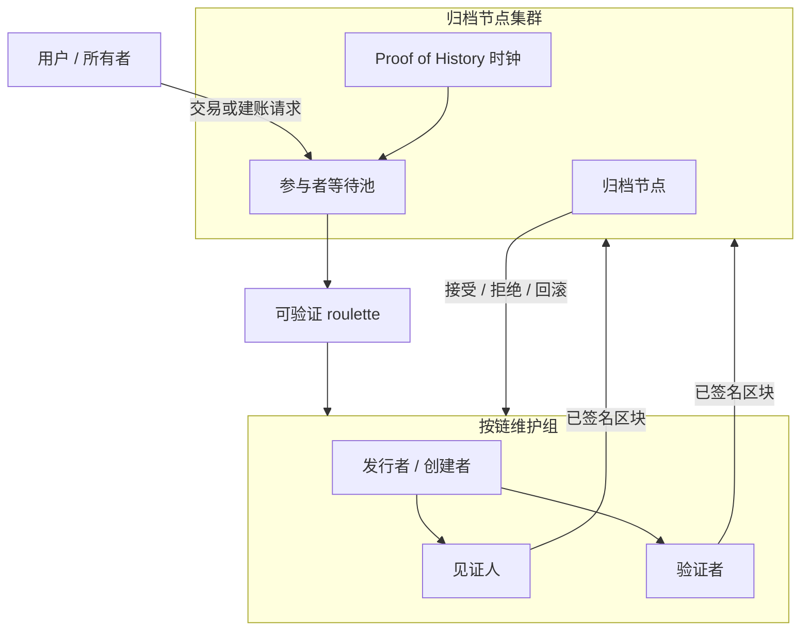

# 去中心化集群多链

## 并行原子分布式账本扩展（CoNET-DLE）

**作者：** Peter Xie  
**初稿：** 2023  
**修订：** 2026-08-11o（BIP-47 / BIP-352 / ERC-5564 公开码预测 *n* 地址；仅客户端；非 tip/归档/5 验证人 — §4.5）

**成对译本（必须同步更新）：** [`Decentralization Cluster multi-chain.md`](./Decentralization%20Cluster%20multi-chain.md)  
**同步守则：** `.cursor/rules/conet-layer2-whitepaper-bilingual-sync.mdc`

---

## 摘要

**CoNET 分布式账本扩展（CoNET-DLE）** 是一种集群化、轻量级的 **类 Layer-2 账本扩展** 系统：**无限并行、以事件为基础的原子链**；每个区块由 **归档节点** 从 **on-demand miner 等待队列** 抽选的 **5 名验证人** 委员会共识，而非单一全局 tip。

- **并行：** 并发链数量原则上 **无上界**；质押容量↑ → 可维护链↑。
- **原子（按链）：** tip 前进须获该链当前维护组完全同意。
- **仅事件出块：** **无事件 ⇒ 不出块**；禁止空 slot 挖矿。
- **L1 出生证明：** 创建新链 **必须** 在 CoNET L1 铸造 **唯一 NFT**；NFT 绑定类别（**资产**、**存储** 或 **交易**）、所有权，以及由 **token id 尾数残类** 决定的 **托管归档集群**。
- **资产封顶持续生效：** 每个资产事件 **重估** tip；若余额 **> 100 USDC**，转出 / 超额 **须建新链**（§4.6）。
- **交易类（原子 NFT 式出售）：** 用户开设 **交易** 链，挂牌既有 **资产** 或 **存储** 链；挂单仅允许 **原子单**（报价 ≤ **100 USDC** 等值），**禁止大单**。成交时 **标的链 L1 NFT 所有权** 转给买方；**交易** 链随后 **关闭**（§4.7）。
- **存储类创作者经济 / 私密版权交付：** 与 Beamio **`CopyrightContentModule`** 同一论题：所有者碎片化并以授权 DePIN miner 封存私密组装 index；tip/L1 仅存 hash；买方付 **conet-GB**、绑定买方 PGP；**最先完成者** miner 交付买方绑定密文；短期访问 URL + 周期存储费；明文永不上链（§4.8）。
- **版权 ZERO / 版本树：** 存储 tip 形成 **谱系树**（原创 + 修改者）；每个分支点是可经交易类挂牌的 **独立 L1 NFT**；tip 记录 **社交历史**（点赞、评论、引用）作为拍卖估值的 **Web of Trust** 信号（§4.9）。
- **存储销售账本：** 每条存储 tip 维护仅追加的 **销售收入流水**，并 **引用** 实际发生价值转移的并行 **资产类** tip 交易（§4.10）。
- **归档平面裂变：** 随归档参与者增多，L2 归档平面按 **2 → 4 → 8 → …**（二的幂）**裂变** 为并行集群，各自类似可负载均衡的 **cluster**，聚合带宽更大（§5.2）。
- **手续费统一为 conet-GB：** 全部 DLE 服务费以 **conet-GB**（CoNET L1 `GBToken` ERC-20）结算。

**传输前提：** CoNET-DLE **加载在 CoNET DePIN 之上**。控制面与数据面的 gossip 以 **钱包地址（EOA）为网络身份**，而非 IP。消息经 OpenPGP 端到端加密，并由 **无法阅读明文** 的入口 / 邮箱节点中继。

**天然隐私（产品冻结）：** 隐私为 **双轨**——**通讯隐私**（DePIN 钱包地址 gossip + OpenPGP）与 **资产隐私**。资产入金 L2 时，价值已 **碎片化** 到 **大量钱包地址**；只有 **客户端** 能将这些碎片重组为单一逻辑持仓。**转账** 同样具备双轨隐私：加密任务/通讯路径 + 多地址发送/接收。**公开码 / 隐身支付** 复用 **既有隐私转账 / 隐身地址技术**（**BIP-47** / **BIP-352** / **ERC-5564** 族）：收款方分享一份 **公开收款码**；付款方 **客户端** 预测 **n** 个收款地址，并对每个地址发送 **≤ 100 USDC** 级原子额度；**只有收款方** 能派生对应私钥。这 **不属于** DLE tip、归档分片或 **5** 验证人委员会的职责——DLE 只承接多地址碎片化结果与客户端重组，**不** 发明链上「地址预言机」（§4.5）。二者共同解决经典区块链的 **资产可链接隐私** 失效（§4.5、§7.6）。

**同一碎片化带来的保管安全：** 价值不集中在 **一个** EOA / **一把** 私钥下，单钥被盗或被胁迫无法夺走所有者的 **全部** 资产——资产安全性随碎片集合进一步提高（§4.5、§12.9）。

CoNET-DLE 保持区块链级的 **不可篡改性**，并面向持续可用、线性扩展、灵活参与与事件驱动时延。基于质押、按组本地的共识消除全局 PoW 竞跑。**随加入的 miner 增多，能并发同时维护的链越来越多，全局安全能力越来越强**——与单 tip 越拥堵越中心化相反。

**关于区块链不可能三角的论题：** 通过 **无限并行原子 tip**、**仅事件出块**、**小集团并行共识**、**≤100 USDC 微额碎片化资产**，以及 **分角色、按需加入/退出**（并非每个角色都同步全量数据），CoNET-DLE 的设计使 **可扩展性、安全性与去中心化随参与增长而互相加强**，而非被迫永久三选二（见 §3.4）。

本文是 **去中心化集群 / 多链** 层的设计白皮书。§7 密码学仅采用 **成熟、生产验证过的原语**（secp256k1 / EIP-191、OpenPGP、AES-GCM、SHA-256/Keccak-256、commit–reveal、可选 ECVRF）。它与 CoNET DePIN / CoNET-SI 及 CoNET **主链 / 注册表** 互补——**不是** 全局 PoS L1 的替代品。

---

## 1. 引言

链上应用扩展后，需要记录的状态越来越多。以主链为中心的共识在单一 tip 上浪费算力，全局出块终局过慢成为瓶颈。许多 L1 / L2 仍继承 **单一逻辑 tip**（或少量共享 tip），负载升高时再次出现拥堵与手续费压力。

CoNET-DLE 走另一条路：按 **账本分片**，而不只是在一条账本上做吞吐技巧。每个应用或资产实例可拥有自带发行者、见证人、验证者的 **轻量原子链**——原则上可 **无限多条** 并行。安全与经济终局由以下机制加固：

1. 参与者在 CoNET 上的 **质押**。
2. **可验证随机选取**（归档节点熵上的 roulette）进入 **小规模** 维护组。
3. 新区块的 **100% 组内共识**（否则解散并重选）。
4. **归档节点集群** 存储全量状态并做质量检查 / 回滚。
5. **强制 CoNET L1 NFT**：每条新链唯一 token id、**恰好一类**（**资产 / 存储 / 交易**）、所有权，以及（资产类）经 **L1 oracle** 评估、**≤ 100 USDC 等值** 的入金——以碎片化 / 微额化使小共识组串谋不经济。**交易类** 挂单通过原子成交转移既有资产或存储链的 **标的 NFT 所有权**（§4.7）。

质押矿工按自身算力与网络能力决定同时承销多少条链。轻量验证者不必存全历史，可按需参与——减轻资本型 PoS 与 ASIC PoW 垄断带来的中心化压力。

**部署基底：** 该 L2 不另造 IP 覆盖网。它 **加载在 CoNET DePIN** 上，因此 waiting-pool 宣告、任务要约、出块提案与投票均以 **钱包寻址、OpenPGP 加密的 gossip** 传输（入口 A → 邮箱 B；listen 经入口 C ≠ B）。密码学细节见 **§7**。

---

## 2. 问题陈述

| 问题 | 为何重要 |
| --- | --- |
| 新区块共识缓慢 | 全局 tip 协定无法随需求扩展 |
| 计算资源浪费 | 空 tip / 争夺 tip 上的空转或竞跑 |
| 高 gas / 手续费 | 单一区块空间市场排挤小额支付 |
| 51% / 资本集中 | PoW 与 PoS 倾向资源垄断 |
| 可扩展性瓶颈 | 单链或单 rollup 天花板 |
| 共识中心化 | 大验证者 / 矿池主导选取 |

**设计目标：** 保留去中心化与不可篡改，但以 **并行、按账本的共识** 作为扩展单位——使 **参与者↑ → 并发链↑ → 全局安全↑ → 门槛↓**，而非 **负载↑ → 手续费↑ → 更中心化**。

---

## 3. 设计论题

### 3.1 并行原子账本

- **无限并行（设计目标）：** 网络承载 **无上界** 的独立原子链集合；容量随质押参与扩展，而非共享全局 tip。
- **原子（按链）：** 在一条链内，新区块须获该步所选 **小规模** 维护组（发行者 / 创建者、见证人、验证者，由链合约定义）的完全同意。
- **爆炸半径有界：** 一条链的危机不阻断无关链。
- **随 miner 扩容：** 每增加诚实 miner，网络可 **同时** 承销的链更多；聚合安全能力随参与 **上升**。

### 3.2 事件驱动出块

若无事件（交易 / 状态变更 / 存储写入请求），则 **不产生新块**。**无事件 ⇒ 不出块。** 禁止空块开销，匹配支付 / 回执 / 存储工作流。有效 **每秒交易带宽** 是并行 tip 上活跃事件流之和——不是单一全局 slot 时钟的吞吐。

### 3.3 集群化维护组（每块 5 名验证人）

链的安全不依赖「全网每 slot 投票」，而依赖针对 **当前区块** 的 **5 名验证人小委员会**，加上归档集群的质量检查与存档。

**规范的按块路径（产品冻结）：**

1. 链上出现 **新事件**（**无事件 ⇒ 不出块**）。
2. 托管该链的 **归档节点** 从 **on-demand miner 等待队列** 中抽选 **5** 名验证人。
3. 该 **5 人集团进行投票并提交** 区块 / 证明集。
4. 归档节点 **验证** 提交；若 **合格** 则 **存档**（最终确认并存储）；否则拒绝 / 重选（§6.3、§9）。

不诚实或超时成员被替换；质押面临风险。大量 5 人组跨链 **并行**，确认时延是 **极小委员会** 投票，而非全球 slot——交易 **越来越快**。

### 3.4 解决区块链不可能三角

经典区块链常被表述为 **不可能三角**：在 **去中心化、安全、可扩展** 三者中至多兼顾其二。CoNET-DLE 的产品论题是：本 L2 通过把共识单位从「一条共享 tip」改为「许多事件驱动的原子 tip」，**打破被迫三选二**：

| 三角顶点 | 经典单 tip 痛点 | CoNET-DLE 回应 |
| --- | --- | --- |
| **可扩展性** | 单 tip 的 TPS / gas 市场饱和 | **事件驱动** 出块 + 跨无界链的 **小集团并行共识** + **归档平面裂变**（按 NFT 尾数 2/4/8…，§5.2）→ 聚合带宽与确认速度随活跃账本、miner 与归档分片增长 |
| **安全性** | 扩容常削弱经济终局或依赖 sequencer | miner↑ → **可并发维护容量↑**、roulette 池↑ → **全局安全更强**；按链爆炸半径有界；**≤100 USDC 微额碎片化** 使针对任一维护组的 **串谋动机趋于零**；**多钥碎片** 缩小单钥扣押爆炸半径（§4.5） |
| **去中心化** | 全节点 / 验证者硬件与资本门槛集中权力 | **分角色** 参与者（发行者 / 见证人 / 轻量验证者 / 归档）**无需同步全部链数据**；可 **按需加入、退出共识** → 降低参与门槛 → 网络随时间 **更分散、更健康** |

**正向循环：** 更分散的 miner → 可承销更多并行原子链 → 更高事件 TPS 与更快 tip → 微资产仍不值得攻击 → 更低门槛继续吸引参与者。安全、规模与去中心化 **共同放大**，而非互相牺牲。

### 3.5 与 CoNET 栈的关系（概念）

```text
+-------------------------------------------------------------+
| CoNET 主链 / 注册表（身份、质押、NFT、AddressPGP）            |
+-----------------------------+-------------------------------+
                              | 锚定 / 费用 / NFT / PGP 注册
+-----------------------------v-------------------------------+
| CoNET-DLE L2 - 去中心化集群（本文）                           |
|  多条资产 / 存储 / 交易链 x 并发维护组                        |
+-----------------------------+-------------------------------+
                              | 加密 gossip（钱包 != IP）
+-----------------------------v-------------------------------+
| CoNET DePIN / CoNET-SI - 钱包地址 P2P + 入口/邮箱            |
|  OpenPGP 密文; A->B 发送; C->B listen; 零信任跳              |
+-------------------------------------------------------------+
```

**构造级隐私：** L2 角色不以 IP 互拨。它们寻址 **钱包 / PGP 身份**；DePIN 中继只转发密文。入口与邮箱节点获知路由 key id，而非业务明文或稳定客户端 IP。另有 **资产持仓为多钱包碎片**，仅在客户端重组（§4.5、§7.6）。

产品主线：每条账本均为 **L1 NFT 绑定** 的 **资产 / 存储 / 交易** 类链（资产 tip 经 oracle **≤ 100 USDC**；交易挂单为 **原子报价 ≤ 100 USDC**），由随机小维护组维护，且 **仅事件驱动** 出块。

---

## 4. 系统概览

### 4.1 创链门闸（强制 L1 NFT）

创建新 DLE 链 **不是** 可游离于 L2 的自由行为。创建者 **必须先** 在 **CoNET L1** 取得 **唯一 NFT**。该 NFT 是链的唯一公开身份，绑定：

| L1 NFT 绑定项 | 规则 |
| --- | --- |
| **唯一性** | 一个 NFT id ↔ 一条 DLE 链；无 L1 mint 则无匿名创世。 |
| **类别（三选一）** | mint / 配置时固定为 **恰好一种**：**资产类**、**存储类** 或 **交易类**。 |
| **所有权 / 归档归属** | 所有者、付费方钩子、归档组映射由 NFT id 推导。任一 DLE 链的 **权威所有者** 为 CoNET L1 **`ownerOf(nftId)`**。 |
| **资产入金（仅资产类）** | 以 **L1 资产** 作为入金 / 资金；由 **L1 oracle** 估值；总值 **不得超过 100 USDC 等值**。**≤ 100 USDC** 边界在每个资产事件上经 oracle **重估复核**；超顶转出须 **建新链**（§4.6）。 |
| **交易标的（仅交易类）** | 创世绑定拟出售的 **标的** 资产类或存储类 NFT id；成交转移 **该标的** 的 L1 所有权（§4.7）。 |

**以微额碎片化防串谋：** 将每条资产链封顶在 **≤ 100 USDC**，并鼓励大量微小并行账本，使贿赂或俘获 **小规模** 维护组的期望收益低于质押 / 声誉成本——**碎片化与微额化是一等安全机制**，而非仅 UX。同一碎片化亦是 **资产隐私** 与 **保管安全** 的基底（非单一私钥掌握全部资产——§4.5）。运行期 **重估 + 溢出建链**（§4.6）在 oracle 变动后仍守住封顶。

### 4.2 三类链

| 类别 | 用途 | 入金 / 收费规则 |
| --- | --- | --- |
| **资产类链** | 绑定 L1 NFT 的可转让价值账本 | 存入 **L1 资产** 作为链资金；**L1 oracle** 估值；**硬顶 ≤ 100 USDC 等值**。每个 **新事件** 须对转账 / 余额 **重估**（§4.6）。自创世起，每一次 **转账事件** 按转账金额的 **0.01%** 向 **当前 5 名验证人共识组** 支付手续费，以 **conet-GB** 结算。 |
| **存储类链** | 数据 / 日志 / **创作者内容**（付费访问）；**版权 ZERO** 版本节点；**销售账本** | 所有者可嵌入 **碎片化加密内容** + 访问策略（§4.8）。Tip 可分叉成 **版本树**（§4.9）。Tip 记录 **社交事件** 与仅追加的 **销售收入账本**，并关联并行 **资产类** tx（§4.10）。访问 / 费用以 **conet-GB**；欠费则 **停止新块**。购买 **访问权** ≠ 购买 NFT；出售某分支走交易类（§4.7）。 |
| **交易类链** | 出售既有 **资产** 或 **存储** 链的短命 **原子挂单 / 托管**（整账本 NFT 式交易） | 由用户开设；创世绑定 **subjectNftId**；挂单报价 **≤ 100 USDC 等值**；**禁止大单**。成交：**标的 L1 NFT 所有权 → 买方**，货款给卖方，随后 **交易 tip 关闭**（§4.7）。费用以 **conet-GB**（挂单 / 成交钩子）结算。 |

类别在 L1 NFT 创建 / 配置时选定，对该 NFT **不可变**。**无双类链：** 同一 tip 不能既是资产又是交易。「卖掉多枚碎片」= **多笔原子交易挂单**（各 ≤ 100 USDC），而非一笔超大单。

### 4.6 资产类事件重估与溢出建新链

**资产类** tip 的产品冻结（使 ≤ **100 USDC** 不变量在运行期生效，而非仅 mint 时）：

1. 每个 **新事件**（尤其是 **转账**）须用 **L1 oracle**（与入金同系）对该链余额 / 拟议转账 **重新评估**。
2. 若重估后 **链余额 ≤ 100 USDC 等值**，转账可在 **本链** 按 §6.3 正常进行（含 **conet-GB** 的 **0.01%** 费）。
3. 若重估后 **链余额 > 100 USDC 等值**，拟离开本 tip 的 **转出部分**（或超过封顶的超额）**不得** 作为单笔超顶转账留在本链：所有者 / 客户端 **必须新建一条或多条资产类链**（新 L1 NFT + 每条 oracle 封顶入金 ≤ 100 USDC），并把该转出 / 超额价值迁到新 tip 上。
4. 共识与归档 **拒绝** 会使 tip 以重估余额 **> 100 USDC** 终局的资产转账事件，或试图在无匹配 **新链** 出生证明时送出超顶切片。

典型触发是 mint 后的 oracle 升值：创世入金 ≤100，但后续事件重估可能把经济余额推过封顶——故需 **事件时重估 + 溢出建链**，而非一次性检查。

### 4.7 交易类：原子挂单与标的 NFT 所有权转移

**整账本去中心化原子出售** 的产品冻结（类比对链出生证明做 **NFT 交易**）：

1. **标的：** 既有 **资产类** 或 **存储类** 链，以其 **L1 NFT**（`subjectNftId`）标识。卖方须为该标的当前 L1 所有者。
2. **开挂单：** 卖方 **铸造交易类** L1 NFT / DLE tip，创世绑定 `subjectNftId`、报价币种/金额（经 oracle **≤ 100 USDC 等值**）与托管规则。**仅原子单——禁止大单**（超顶报价或成交一律拒绝）。
3. **挂单冻结：** 交易 tip 处于 **Open** / **Locked** 时，标的链 L1 NFT **禁止再转让**；资产类标的拒绝会在成交前掏空 tip 的转出（由归档 / 注册表强制）。
4. **撮合与结算（原子）：** 买方货款托管与 **`subjectNftId` 的 L1 所有权更新为买方** 须在同一结算事件集内成功，否则 tip **回滚**。成功后标的权威所有者为 **买方 = L1 `ownerOf(subjectNftId)`**。**标的资产/存储 tip 在新所有者下继续存在**（**不**关闭）。
5. **关闭交易 tip：** 在 **Settled**、**Cancelled** 或 **Expired** 后，**交易类** 链 **关闭**：不再出块；归档保留证明轨迹。关闭交易 tip **不会** 删除或停用标的账本。
6. **所售对象：** 是 **标的** NFT / 账本——不是挂单外壳。转让交易 NFT 本身 **不是** 购买挂牌链的产品路径。
7. **组合出售：** 出售多枚 ≤100 USDC 碎片须开 **多笔** 交易挂单（每标的 tip 一笔），与微额碎片化及防串谋一致（§4.1、§4.5）。

**交易 tip 生命周期：** `Open → Locked → Matched → Settled → Closed`（或 `Cancelled` / `Expired → Closed`）。

### 4.8 存储类创作者经济（碎片化内容 + GB 访问权）

**创作者经济存储 tip** 的产品冻结（付费内容访问，**不**转移存储 NFT）：

1. **发布（所有者）：** 创建 / 配置时，所有者将作品拆成 **加密碎片**，生成 **组装 index**（碎片 hash + 顺序 + 碎片密钥 / 解包材料），并把该 index **封给授权交付 miner**——不是 tip、不是归档、也不是 5 人验证委员会。碎片与加密 index 存入 **Beamio IPFS**（`keccak256(utf8(payload))` fragment hash）。存储 tip **只记公开承诺**：`contentIndexHash`、`authorizedNodeKeyHash[]`（AddressPGP / Guardian 节点 key id）、以 **conet-GB** 计价的 **访问价格**、访问有效期与可选保留策略。明文内容 **与明文 index** **绝不** 进入 tip 状态或共识投票。
2. **私密 index 移交（miner 如何拿到秘密且 tip 不暴露）：**
   | 层 | 承载 | 谁可读 |
   | --- | --- | --- |
   | **存储 tip** | `contentIndexHash` + 授权 key-hash 集合 + 价格 | 所有人（仅承诺） |
   | **IPFS** | 组装 index 的 OpenPGP（或混合）**密文** | 仅被列为收件人的 miner PGP |
   | **IPFS** | 加密内容碎片 | 无 index 解包材料则无用 |
   | **Miner 本地** | 解密后的 index + 组装期临时明文 | 仅该授权交付 miner |
   | **买方包** | 以 **买方 PGP** 加密的密文 | 仅买方 |

   - **加密模式（产品默认）：** **OpenPGP 多收件人** — 一份 index 密文包，收件人为所有者选定的授权 miner PGP（任一可解密）。可选替代：**每 miner 一份副本**（`nodeKeyHash → indexCipherHash` 清单），便于独立吊销 / 重封而不必重加密共享 blob。
   - **配置路径：** 所有者客户端（1）本地生成明文 index；（2）加密给授权密钥；（3）上传密文 → 得到 `contentIndexHash`；（4）提交 tip **Configured** 事件，**仅**携带 hash + 授权集合 + 价格策略。Tip gossip / DePIN **从不**把可解密 index 当作 tip 载荷。
   - **信任边界：** 授权交付 miner **被信任** 在组装时可见明文（交付保管）。Tip 共识验证人与归档对等方只验证 **hash 与事件**——**没有** index 私钥，质检 **不得** 要求明文。所有者用以下手段缓解 miner 泄露：小授权集、质押 / 声誉遴选、轮换（向新集合重加密 index + 新 `contentIndexHash`）、水印、以及剔除 `nodeKeyHash` 的吊销事件。
   - **禁止「把秘密提交上 tip」反模式：** 拒绝任何把原始 index JSON、碎片 AES 密钥或未加密组装指令写入 tip 块或公开投票的程序。
3. **访问权：** 所有者设定谁可购买（开放 / 白名单）、**conet-GB** 价格与过期时间。改价 / 改策略是存储 tip 上的事件（服从 tip VM 规则）。重封 index（新授权集）是带新 `contentIndexHash` 的 **Configured** 更新。
4. **购买（访客）：** 买方支付所有者设定的 **conet-GB** 价格，绑定 **买方 PGP**（`buyerPgpKeyHash` + AddressPGP 可查公钥），并开启购买事件。交付开始前须验付款与 PGP 绑定。**访问购买不转移** 存储链 L1 所有权（对照 §4.7）。购买事件是 **公开元数据**（谁买了、买方 key hash、截止时间）——**不** 再传私密 index。
5. **交付（授权 miner）：** miner 监听购买事件（DePIN gossip / tip feed）。持有匹配授权密钥的 miner：
   - 按 `contentIndexHash` 从 IPFS 拉取 index 密文；
   - 用 **自身** PGP 私钥链下解密 index；
   - 从 IPFS 拉取碎片并在本地 **重组** 内容；
   - 以 **买方 PGP** **再加密** 交付包；
   - 将买方绑定密文上传 IPFS，并记录 `buyerEncryptedContentHash`（以及 tip 程序要求的买方绑定 index 指针）。
6. **最先完成者：** 对该购买的首次有效完成锁定交付记录；后续完成者须失败或 no-op。共识 / 归档经正常 **5 验证人** 路径证明购买与完成事件；明文不得出现在公开投票中。
7. **买方还原：** 仅买方持其 PGP 私钥可解密买方包，并凭 **买方绑定 index** 还原原文。中继、归档对等方与无关 miner 仅见密文 / hash。
8. **币种：** 访问价与相关内容交付费以 **conet-GB** 计价（与 DLE 统一手续费币种相同）。§4.2 的 tip 保留 / 欠费停块规则对存储维护费仍适用。
9. **过期 / 保留：** 超过 `accessExpiresAt`（及/或欠费的 `storagePaidUntil`）后，miner 须停止签发访问 URL；过期购买须重新付费才能再开。
10. **Tip / 模块状态（对齐 CopyrightContentModule）：** 存储程序（以及作为 L1 邻近面的 Beamio catalog 模块）仅保留 **有界** 字段——**禁止** tip 上无界买方 / 评论 / URL 数组：

| 字段 | 含义 |
| --- | --- |
| `contentIndexHash` | **加密** 组装 index 的 IPFS hash（`keccak256(utf8(payload))` → `bytes32`） |
| `authorizedNodeKeyHash[nodeKeyHash]` | 所有者选定的交付 miner / Guardian PGP key hash |
| `purchaseId` | 单次访问购买派生 id（`tipNft` / card + buyer + nonce） |
| `buyerPgpKeyHash` | 购买时绑定的买方 PGP（AddressPGP 可解析） |
| `accessExpiresAt` | 该次购买的所有者设定访问截止 |
| `storagePaidUntil` | 完成者节点被付费保留 / 服务的期限 |
| `completedByNodeKeyHash` | 最先完成者；锁定前为 `0` |
| `buyerEncryptedContentHash` | 买方 PGP 密文包的 IPFS hash |

11. **规范事件（与 CopyrightContentModule 同名语义）：**
    - `CopyrightContentConfigured` — index hash、授权集、价格 / 策略；
    - `CopyrightPurchaseOpened` — `purchaseId`、买方、`buyerPgpKeyHash`、`accessExpiresAt`；
    - `CopyrightDeliveryCompleted` — `purchaseId`、`nodeKeyHash`、`buyerEncryptedContentHash`；
    - `CopyrightStorageFeeCharged` — 向完成者收取周期保留费（DLE：**conet-GB**；Beamio catalog 路径可用 B-Unit indexer 行镜像）。
12. **买方绑定购买完整性：** 购买须由买方 EOA/AA 签名；签名至少绑定 `buyer + tipNftId + buyerPgpKeyHash + deadline + nonce`，防止第三方付款后替换交付用 PGP。
13. **短期访问 URL：** `Completed` 后，服务 miner（或薄代理）签发 **时限 HMAC / 签名 URL**，每次签发重新检查链 / tip 过期与买方授权。**禁止** 把永久裸 `getFragment` URL 当作产品访问路径。
14. **存储 / 保留费（完成者经济）：** 所有者 **周期** 向 **最先完成者**（或活跃授权集）付费以继续服务；更新 `storagePaidUntil`。优先周期续费而非一次永久预付。欠费 → 停 URL；被证明不服务的节点可从 `authorizedNodeKeyHash` 吊销。虚假「完成」索赔的结算 **宜** 等待买方可访问确认、挑战窗口或访问心跳——而非仅凭首次上报立即无条件打款。
15. **隐私与版权论题（本设计达成什么）：**

| 目标 | 机制 |
| --- | --- |
| **去中心化交付** | 任一授权 DePIN miner 可竞速；首个有效完成者锁定；无需中心 CDN |
| **版权控制** | 所有者定价格、授权集、过期；访问 ≠ NFT 所有权；分叉为新 NFT（§4.9） |
| **内容隐私（公开观察者）** | Tip/L1：仅 hash；IPFS：密文；中继：OpenPGP E2E；5 验证人永不见明文 |
| **载荷对买方私密** | 最终包仅加密给 **买方 PGP** |
| **预告 vs 秘密** | 公开 metadata / teaser 留在交付状态之外；动态交付 hash 留在 tip/模块——**不** 回写营销 metadata JSON |
| **抗 DoS tip** | tip 上计数 + hash + mapping；评论正文 / URL 列表链下（IPFS / indexer） |

    **诚实边界：** 授权交付 miner 在组装期可见明文（受信任保管集）。默认公开购买事件仍可能关联 **买方地址 ↔ 内容 id**；更强的不可链接（盲购）是未来选项，非 v1 共识。

16. **双表面、同一论题：**

| 表面 | 角色 |
| --- | --- |
| **DLE 存储类 tip VM（§4.8）** | 并行原子 tip 上的原生版权 ZERO / 创作者经济；费用用 **conet-GB**；5 验证人 + 归档终局 |
| **Beamio `CopyrightContentModuleV1`** | 在 BeamioUserCard / issued-NFT catalog 路径上的同一状态机（Cluster 预检 + Master 写）；**不** 替代 DLE tip——产品桥 / L1 邻近 catalog 交付 |

    Card + Module 扩展遵守 Factory 稳定边界；DLE tip 仍是隔离程序。Indexer 可在存储 tip 上独立记账访问销售（§4.10），与 catalog metadata 无关。

**内容访问生命周期：** `Configured → Purchased → Delivering → Completed`（或当 `accessExpiresAt` / 欠费 `storagePaidUntil` 时 `Expired`）。

**风险 → 缓解（规范）：**

| 风险 | 缓解 |
| --- | --- |
| 虚假最先完成者 | 锁定 `completedByNodeKeyHash`；延迟存储费至挑战 / 心跳 |
| 买方 PGP 被替换 | 购买签名绑定 `buyerPgpKeyHash` |
| 授权 miner 泄露 index | 小信任集；轮换 / 每 miner 封存；水印；吊销 |
| URL 重放 | 短期签名 URL + 过期检查 |
| 已付费却不服务 | 周期 `storagePaidUntil`；挑战；吊销 |
| Tip 膨胀 | tip 上无无限买方 / URL 数组 |
| 日志 / tip 明文 | 禁止；链上仅 hash |

**职责分离：**

| 动作 | 转移对象 |
| --- | --- |
| 支付 **conet-GB** 购买访问权（§4.8） | 买方绑定密文包；**不是** 存储 NFT 所有者 |
| 交易类出售存储 tip（§4.7） | 整本存储账本的 **L1 NFT 所有权**（任意树节点） |
| 分叉 / 修改内容（§4.9） | 新存储 NFT + tip；父节点谱系保留 |
| 记账销售 / 关联资产 tx（§4.10） | 存储 **收入流水** 行 + 指向并行 **资产类** tip 事件的指针 |

### 4.9 版权 ZERO：版本树、社交历史与 Web of Trust 估值

将存储类 tip 映射为 **版权 ZERO** 式创作图的产品冻结（版本化作品 + 可归因社交证明，服务市场）：

1. **版本树：** 每个存储 tip 是有向谱系中的一个 **节点**。**根** 为原创者 tip / L1 NFT。**修改者**（衍生、编辑、remix、本地化等）通过铸造 **新的存储类 L1 NFT + tip** **分叉**，并绑定：
   - `parentNftId`（直接父节点）；
   - 可选 `rootNftId`（树根）；
   - `lineageHash` / 内容增量或新的 `contentIndexHash`（§4.8）；
   - `modifier` 身份（EOA / AddressPGP）。
   父 tip **不被覆盖**；历史只追加。树可在保留费规则下任意加深 / 加宽。
2. **每个分支点是独立 NFT：** 每个节点（根或分支）有 **自己的** L1 NFT，可经 **交易类**（§4.7）独立挂牌，与兄弟或父节点无关。买某一分支只转移 **该节点** 所有权——除非另有挂单覆盖其他节点。
3. **Tip 上的社交 / 引用账本：** 存储程序接受经证明的事件，例如：
   - **点赞** / 取消（或带防刷规则的单向点赞）；
   - **评论**（评论正文 hash + 可选 IPFS fragment；签名绑定）；
   - **引用 / 引用计数**（另一 tip 或外部 id 引用本节点）；
   - 若产品开启，可选 **分享 / 浏览** 计数。
   这些是 **一等 tip 历史**，不是链下抓取。社交写入费（若有）以 **conet-GB** 结算。
4. **Web of Trust（WoT）基础：** 估值输入 **不只** 看原始计数。市场与索引器按 **谁** 签名加权——钱包声誉、AddressPGP 身份、历史质押 / 活跃度、签名者之间的图边。例：高信任公众人物（示意「马斯克」）的 **点赞** 或 **评论**，比匿名刷号钱包是更强的拍卖信号。DLE 记录 **已签名事件**；**WoT 评分** 可由开放索引器 / 拍卖场基于该不可变历史计算——共识 **不** 从点赞发明单一全局「价格预言机」。
5. **拍卖 / 市场用途：** 交易类挂单与外部拍卖 UI 宜为每个标的存储 NFT 展示：
   - 树位置（根 / 深度 / 父节点）；
   - 社交直方图（点赞、评论、引用）及 **签名者身份**；
   - 若配置了访问经济指标（§4.8 购买次数——注意隐私）；
   作为发现与出价的 **信任加权证据**——**不是** 保证底价。
6. **分离：**
   | 层 | 角色 |
   | --- | --- |
   | 内容密文 + GB 访问（§4.8） | 谁可 **阅读** 作品 |
   | 版本树 + 分支 NFT（§4.9） | 谁 **拥有 / 分叉** 哪一版 |
   | 社交 / WoT 历史（§4.9） | 用于估值的公开 **声誉图** |
   | 销售收入流水（§4.10） | 卖了什么、哪笔 **资产类** tx 付了款 |
   | 交易类成交（§4.7） | 所选节点 NFT 的原子 **所有权转移** |
7. **完整性：** 社交与分叉事件按 §6.3 成为 tip 块（仅事件、5 验证人 + 归档）。无该钱包有效 EIP-191 / AddressPGP 绑定签名则无法伪造「名人点赞」。Tip 状态存计数 + 事件 hash；无界评论文本放 IPFS fragment，而非无限 on-tip 数组。

**树节点生命周期：** `Minted（根|分叉）→ 社交/内容事件… →（可选）经交易挂牌 → 在新所有者下 Settled`；所有权变更后节点 tip **继续存在**。

### 4.10 存储销售收入记账与并行资产类 tx

产品冻结：存储 tip 不仅是内容 + 社交历史——它也是该创作节点的 **销售账本**。经济结算可在 **独立、并行的资产类** tip 上完成（微额碎片化 ≤ **100 USDC**）；存储 tip **记录** 销售并 **指向** 这些资产 tx。

1. **销售收入流水（在存储 tip 上）：** 仅追加事件，例如：
   - `saleKind`：`accessPurchase` | `nodeNftTrade` | `royalty` | `other`（程序定义）；
   - `amount` + `currency`（访问通常为 **conet-GB**；NFT 交易货款按配置为 oracle 估值单位）；
   - `buyer` / `payee` / `feeSplit`（所有者、修改者、协议分成）；
   - `storageEventId`（本 tip 的销售事件 id）；
   - 可选隐私安全聚合（累计 `grossSales`、`netToOwner`），而不把明文内容放上 tip。
2. **并行资产类关联（价值在资产 tip 上移动时强制）：** 对应价值转移的每条收入行 **必须** 引用并行资产账本：
   - `assetNftId` — 执行付款或货款转移的资产类 L1 NFT / tip；
   - `assetTxId` / `assetEventHash` — 该 tip 的转账（或成交关联）事件；
   - 若销售由交易类 tip 中介，可选 `tradeNftId`（§4.7）。
   归档 / 索引器 **应** 拒绝声称资产结算却无匹配已终局资产 tip 事件的存储「已记账销售」（金额 / 当事方须符合程序规则）。
3. **双轨模型（无自由跨链调用）：**
   | 轨道 | 链类别 | 承载 |
   | --- | --- | --- |
   | **账本（Books）** | **存储类** | 卖了什么、卖给谁、费用拆分、谱系节点、关联指针 |
   | **现金 / 价值** | **资产类**（并行 tip） | 实际 ≤100 USDC（重估）的转账 / 余额 |
   隔离保持：tip **不** 互相调用；关联靠各 tip 事件内的 **已提交引用** + 归档交叉核对。多个资产 tip 可随时间为同一存储节点注资（碎片化货款）。
4. **访问购买（conet-GB）：** 为内容访问支付的 GB（§4.8）仍写入存储收入行。若产品还在资产 tip 上移动 oracle 估值抵押（托管、打赏、版税池），同一行须关联该资产 tx。
5. **节点 NFT 交易：** 交易类成交转移存储 NFT 所有权时（§4.7），**标的存储 tip** 记一条 `nodeNftTrade` 收入 / 所有权出售流水，指向交易 tip 成交事件及买方资金所用的任意 **资产类** 付款 tip。
6. **分叉版税（可选程序规则）：** 子 tip 销售（§4.9）可在 **父**（或根）存储 tip 上发出版税行，并再次关联子销售的资产 tx id——树的账本可审计且无需合并 tip。
7. **拍卖 / WoT 用途：** 市场 **可** 在社交 WoT 信号旁展示累计已关联收入（毛 / 净）（§4.9）——仍是证据，不是共识底价。失败或未关联的「销售」不得虚增账本。

**销售行生命周期：** `SaleOpened →（可选 Locked）→ Booked`（含 `assetTxId`；访问还须交付完成）或未记账的 `Cancelled` / `Expired`。

### 4.3 链属性

- **所有权** 由 **L1 NFT**（`ownerOf`）与本地创世规则定义；交易成交在 L1 更新 **标的** 所有权（§4.7）。存储 **访问权** 出售更新购买 / 交付记录，而非 NFT 所有者（§4.8）。**分叉** 为修改者 mint 新 NFT；父节点所有权不变（§4.9）。**销售账本** 在存储 tip 上，并 **引用** 并行资产类 tx（§4.10）。
- **功能有限：** 创世嵌入该链 **唯一预定义 VM 程序**。链之间 **不** 自由互通（刻意隔离）。交易 tip 绑定标的 id；跨 tip 撮合靠索引 / matcher 任务，而非自由跨链调用。存储创作者程序承载 content-index hash、购买 / 交付钩子、**父谱系**、**社交事件** 钩子，以及带 **资产 tip 引用** 的 **销售收入流水**（§4.8–§4.10）。
- **安全来源：** 质押 + 随机 **小规模组** 选取 + 归档质量检查 + **L1 NFT** 绑定；资产链额外继承 **≤ 100 USDC** 经济边界；交易挂单继承 **原子 ≤ 100 USDC** 报价边界；存储内容交付依赖 **PGP 碎片化 + 买方再加密**，使公开 tip 观察者永不见明文（§4.8）；社交估值依赖 **已签名 WoT 历史**，而非可伪造计数器（§4.9）；收入主张须有 **可关联且已终局的资产类事件**（§4.10）。
- **统一手续费币种：** **conet-GB**（CoNET L1 GBToken ERC-20）——不是按链法币单位，也不是第二套 L2 gas token——亦含存储 **访问购买** 与可选社交写入费。

### 4.4 角色图



### 4.5 天然隐私 + 保管安全（仅客户端可重组）

经典公链因用户经济身份坍缩到 **一个**（或少数）地址而泄露 **谁拥有多少**——同一坍缩也意味着 **一把私钥** 可花光全部。CoNET-DLE 的产品回答是基线 **不要求** ZK 的 **天然隐私**，并以同一碎片集合获得 **更高资产安全**：

1. **入金即碎片化：** 所有者将价值移入 L2（资产类入金 / mint）时，经济单元 **已经碎片化**——大量 **≤ 100 USDC** 原子链和/或分布在 **大量不同钱包地址** 上的余额。
2. **仅客户端可见完整持仓：** 只有 **所有者客户端** 持有将这些碎片 **重组** 为单一逻辑资产的映射。扫描 L2 tip 的观察者只见大量无关 EOA 与微账本——而非一份合并投资组合。
3. **通讯隐私：** 一切 L2 任务、转账指令与共识消息走 **CoNET DePIN** 钱包地址 gossip + OpenPGP E2E（§7）——中继永不见明文金额或意图。
4. **转账同享双轨隐私：** 一次转账同时具备 **通讯隐私** 与 **资产隐私**。价值以 **碎片化** 事件移动；**接收方也不是单一钱包地址收款**——收款散落在仅接收方客户端能重组的地址集合上。
5. **公开码 → 预测 *n* 个地址（既有隐身 / 隐私转账技术）：** 产品钱包集成 **成熟、已有规范** 的客户端密码学——**不是** 新的 DLE 共识功能：
   | 层 | 角色 |
   | --- | --- |
   | **收款方** | 发布一份 **公开收款码**（payment code / silent-payment address / stealth meta-address） |
   | **付款方客户端** | 由该码（加上协议 ECDH / 临时材料）**预测 *n* 个收款地址**，并对每个地址支付 **≤ 100 USDC** 级原子碎片（按 §4.6 需要新建资产 tip 或余额切片） |
   | **仅收款方** | 派生这些地址的 **私钥**，并在客户端映射中重组碎片 |
   | **DLE tip / 归档 / 5 验证人** | 只见普通多地址转账事件 + hash；**不** 生成、分配或「预言」收款地址 |

   **先验艺术（规范族，不在 tip 上重造）：** **BIP-47** 可复用支付码（静态码 → ECDH 后大地址序列）、**BIP-352** Silent Payments（静态码 → 付款方派生一次性输出；仅收款方 spend 密钥）、**ERC-5564 / ERC-6538** 隐身元地址（EVM 上同一 ECDH 隐身模式）。实现可任选一种配置；白皮书冻结的是上表 **产品语义**。

   **硬边界：** CoNET-DLE **不** 增加链上地址预言机、归档辅助地址工厂或验证人介导的密钥交换。隐私转账派生留在 **钱包 / 客户端**；DLE 只 **承接碎片化结果**（大量 EOA / tip + 仅客户端可重组）。
6. **保管安全（非单一私钥总控）：** 各碎片由 **不同私钥** 控制。盗钥、钓鱼或胁迫 **一把** 密钥，最多暴露该碎片切片——而非所有者的 **全部** 资产。因此资产安全性随碎片化 **进一步提高**，与 ≤100 USDC 防串谋边界互补。
7. **结果：** 链上观察者难以关联「人 ↔ 总财富」或「付款方 ↔ 收款方」；攻击者也难以「一钥掏空全部财富」——本文在产品层对 **区块链资产隐私** 与 **更强保管安全** 的主张（§7.6、§12.9）。

---

## 5. 角色

### 5.1 质押归档节点

- DLE 平面的全局 **全节点**：存储各链及质量检查所需完整状态。
- 对存入区块做 **最终质量检查**：接受，或 **解散该组** 并组织回滚 / 重新共识。
- 归档节点之间的对等网络主要用于 **归档发现与归档共识**；不随意把其它角色节点当对等 gossip 对象。
- **RPC** 仅对授权参与者与链所有者开放。
- 本地运行 **Proof of History（PoH）** 序列，为等待池事件打时间戳与排序（见 §7）。

### 5.2 归档节点组（集群）— 二的幂裂变

归档节点通过 **NFT** 在 CoNET 注册，各获唯一 token ID。随 **归档参与者增多**，整个 **L2 归档平面** 不会永久停留在单一巨型集群，而是 **裂变** 为多个并行的、类似 **cluster** 的分片，使负载与 gossip 带宽随参与增长。

**规范裂变阶梯（产品冻结）：**

| 归档平面宽度 \(S\) | 链 / 归档归属键 | 含义 |
| --- | --- | --- |
| **2** | `tokenId mod 2` | NFT **尾数奇偶**（双数 / 单数残类） |
| **4** | `tokenId mod 4` | NFT **尾数对 4** 的残类 |
| **8** | `tokenId mod 8` | NFT **尾数对 8** 的残类 |
| **\(2^k\)**（\(k \ge 4\)） | `tokenId mod 2^k` | 同一规则延续：**16 / 32 / …**（随归档人口抬升） |

- **触发：** 归档成员数（及持续负载）越过设计阈值时，平面升级 \(S \leftarrow 2S\)（2→4→8→…）。每一步将并行归档集群数 **加倍**。
- **确定性路由：** 每枚 **链 NFT** 与每枚 **归档 NFT** 映射到分片下标 \(i = \mathrm{tokenId} \bmod S\)。仅该分片有权托管该链的等待队列、抽选 **5** 名验证人、质检与存档（§6.3）。
- **负载均衡与带宽：** 裂变形成 **cluster 式并行能力**——各分片独立等待队列、PoH 节拍与归档共识——聚合 **事件带宽** 随 \(S\) 增长，而非挤在单一归档 gossip 网上。
- **成员资格：** 归档节点服务与自身归档 NFT 残类匹配的分片（或保持 \(i = \mathrm{tokenId} \bmod S\) 的显式再平衡规则）。新归档按当前 \(S\) 加入；裂变后由同一 token id **确定性重映射**，无需手工改派链归属。
- **经济：** 单分片人数更少可提高人均手续费份额；该压力与裂变 **同向**（分片↑ → 可并行承销的 tip↑）。

### 5.3 质押见证人

- 参与某条链的 **全生命周期**。
- 存储该链的 **全部数据**（链本地全参与者）。
- 不诚实 → 移出该链；质押 / 收益面临风险。
- 质押规模限制其可同时承销的链数量。

### 5.4 On-demand 验证者（等待队列）

- **轻量** miner：不必存储完整链历史。
- 向由归档节点托管 / 排序的 **on-demand miner 等待队列** 宣告就绪（§8）。
- 可被抽中为某一区块委员会的 **恰好 5** 名成员之一，任务结束后离开。
- 实现无存储垄断的按需去中心化。

### 5.5 发行者 / 创建者（可选提案角色）

- 创世或合约要求指定提案人时：由 roulette 在质押矿工中抽出，或由 5 人中之一按合约规则组装区块。
- 执行链上预定义智能合约 / VM 逻辑，组装供 **5 名验证人集团** 投票的候选块。
- 投票完成后提交给 **归档** 做质量检查——委员会单独不能最终确认。

---

## 6. 共识模型

### 6.1 按链共识规则

- 对每个 **事件驱动** 区块：维护委员会为 **恰好 5 名验证人**，由托管 **归档** 从 **on-demand miner 等待队列** 抽选。
- 新块接受要求这 **5** 人 **100% 同意**（全组投票），再经 **归档质量检查** 后方可存档。
- 若同意或归档检查失败（超时、拒签、签名冲突、归档拒绝）：

  1. **解散** 当前 tip 的这 5 人。
  2. **排除** 原组成员立即重选资格（防串谋）。
  3. 经可验证 roulette 从等待队列 **重选** 新的 **5** 人。
  4. 可按合约规则 **罚没 / 再分配** 质押。

### 6.2 创世块流程

1. 用户 **铸造 / 配置唯一 CoNET L1 NFT**，并选择 **恰好一种** 类别：**资产**、**存储** 或 **交易**。
2. **仅资产类：** 存入 L1 资产；**L1 oracle** 估值；若估值 **> 100 USDC 等值** 则拒绝。
3. **仅交易类：** 绑定 `subjectNftId`（卖方拥有的既有资产或存储 NFT）；设定原子挂单报价 **≤ 100 USDC 等值**；拒绝超大报价（§4.7）。
4. **存储类创作者内容（可选）：** 所有者可附带 `contentIndexHash`、授权 miner PGP key hash，以及以 **conet-GB** 计价的 **访问价格**（§4.8）。
5. **存储类分叉（可选）：** 若铸造分支，绑定 `parentNftId` / `rootNftId` / `lineageHash`，用于版权 ZERO 版本树（§4.9）。
6. 用户向请求池提交 **新建账本请求**（引用 NFT id + 类别 + 入金 / 标的证明）。
7. Roulette 在质押矿工中可选出 **发行者**；发行者运行预定义合约构建创世（含以 **conet-GB** 计费的手续费钩子）。
8. 托管 **归档** 从等待队列抽选 **5 名 on-demand 验证人**（与后续块相同委员会规模）。
9. 这 **5** 人投票并提交创世证明。
10. 归档集群 **验证**；合格则 **存档** 最终创世。

### 6.3 新块流程（规范）

1. 链上提交 **新事件**。**无事件则不出块。**
2. **仅资产类 — 重估：** 用 **L1 oracle** 重估链余额 / 转账（§4.6）。若重估余额 **> 100 USDC**，本 tip 接受该转账前须先为转出 / 超额部分 **溢出建新链**；否则拒绝。
3. **仅交易类 — 挂单不变量：** 拒绝把报价抬到 **> 100 USDC**、在未取消/成交时解冻标的 NFT，或试图在无原子付款 + **标的所有权转移** 时结算的事件（§4.7）。**Closed** 后拒绝一切新块。
4. **仅存储类 — 内容访问：** 购买事件须 **conet-GB** 付款 + **买方 PGP** 绑定；交付完成事件须有效授权 miner 最先完成者证明（`buyerEncryptedContentHash`）。拒绝将明文内容写入 tip 状态的事件（§4.8）。
5. **仅存储类 — 社交 / 分叉：** 点赞 / 评论 / 引用事件须有效签名绑定（EIP-191 / AddressPGP）；分叉创世须引用既有 `parentNftId`。拒绝未签名的「名人」归因（§4.9）。
6. **仅存储类 — 销售账本：** 声称发生价值转移的 `SaleBooked` / 收入流水事件 **必须** 含 `assetNftId` + `assetTxId`（或明确为无资产轨的仅 GB 访问销售）；拒绝未关联的虚增账本行（§4.10）。
7. 托管 **归档节点** 检测 / 接受（符合封顶的）事件，并对 **on-demand miner 等待队列** 运行可验证 roulette。
8. 归档为 **该链当前区块** **抽选恰好 5 名验证人**。
9. 组装候选块（预定义链 VM / 合约；可选发行者或委员会组装者）。
10. **收费（conet-GB）：**
   - **资产类转账：** 按金额 **0.01%** 支付给该块的 **5 人共识组**。
   - **存储类写入 / 保留 / 访问购买 / 社交：** 按内容计费、所有者定价的 **访问** 费及可选社交写入费；欠保留费则拒绝新块；访问价付给所有者（交付 miner 可按配置分成）。
   - **交易类挂单 / 成交：** 挂单与结算费用钩子（产品参数）；欠挂单费可停后续交易事件。
11. **5 人集团投票并提交** 证明 / 签名块到归档路径。
12. **归档节点验证** 投票集、区块质量、（资产类）重估后 **≤ 100 USDC** 不变量、（交易类）原子成交 / 关闭规则，以及（存储类）购买 / 交付 / 社交签名者 / 谱系 / **销售↔资产 tx 关联** 不变量（§4.8–§4.10）。
13. 若 **合格** → **存档**（最终确认并存储）；否则拒绝，解散这 5 人并重选（§9）。

### 6.4 超时与继任

| 故障 | 恢复（设计） |
| --- | --- |
| **委员会成员超时** | 排除该验证人；法定人数不足则解散这 5 人；归档从等待队列 **重抽 5 人**。 |
| **拒签** | 解散这 5 人；新随机 **5** 人；攻击者失去质押；诚实方可获奖励。 |
| **归档质量检查失败 / 共识不完整** | 拒绝 tip；执行回滚（§9）；原 5 人不得立即重选。 |

---

## 7. 密码学（仅成熟原语）

本章规定 CoNET-DLE **作为加载于 CoNET DePIN 的 L2** 的密码学平面。下列构造均因已标准化或经生产验证而被选用。新颖 ZK/SNARK 栈 **不在** 基线范围。

### 7.1 威胁模型与隐私目标

| 对手 | 假定能力 | 密码层目标 |
| --- | --- | --- |
| 好奇的入口 / 邮箱跳 | 见密文、时序、收件人 **PGP key id** | 无法阅读 L2 业务明文 |
| 单跳网络观察者 | 见该跳 TCP 对端 IP | 无法在 A≠B / C≠B 路径上将该 IP 映射到 **逻辑** 收发钱包 |
| 维护组少数串谋 | 持有部分 secp256k1 密钥 | 无法伪造全组出块接受 |
| 自适应质押攻击者 | 购买质押、加入等待池 | 无法在不被发现的情况下偏置 roulette（commit 失败 / VRF 校验失败） |
| 离线存储攻击者 | 窃取单个验证者磁盘 | 受任务密钥与验证者无全历史要求限制 |

**非目标（基线）：** 对抗可关联 **全部** 入口节点的全球被动流量分析；对 **必须** 看见区块的一方（该链见证人）隐藏内容。**通讯隐私** 来自钱包地址 gossip + E2E 加密的 **自然属性**（非 mixnet）。**资产隐私** 来自多钱包入金碎片化与仅客户端重组的 **自然属性**（§4.5）——非基线 ZK。

### 7.2 原语目录（实现基线）

| 层 | 原语 | 成熟锚点 | 在 CoNET-DLE 中的用途 |
| --- | --- | --- | --- |
| 钱包身份 | **secp256k1** ECDSA | Bitcoin / Ethereum | 节点与用户 EOA |
| 认证签名 | **EIP-191** `personal_sign` | 以太坊钱包 | Gossip 命令、listen、任务 ACK |
| 结构化域签名（可选） | **EIP-712** | 以太坊 dApp | 归档选取 commit、质押操作 |
| 目录 | 链上 **AddressPGP** 注册表 | CoNET 现网 | EOA → 用户 PGP + 路由密钥 |
| 非对称消息加密 | **OpenPGP**（RFC 4880 / **RFC 9580**）+ **X25519**（及所用的 Ed25519） | OpenPGP 生态 | 向收件人加密 L2 信封 |
| 对称 AEAD | **AES-256-GCM**（NIST SP 800-38D） | TLS、age 等 | 可选大包 / 会话封装 |
| 会话（listen 路径） | AES-256-CBC + 显式 MAC **或** 优先 GCM | 现有 CoNET-SI listen | 长连接会话密钥 |
| 哈希 | **SHA-256**、**Keccak-256** | NIST / 以太坊 | PoH tick、以太坊摘要、armor 哈希 |
| KDF | **HKDF-SHA256**（RFC 5869） | TLS 1.3、OpenPGP v6 | 派生任务 / 分片密钥 |
| 随机信标（主） | 基于 secp256k1 的 **Commit–reveal** | 经典分布式 RNG | 归档 roulette 熵 |
| 随机信标（可选） | **ECVRF**（IETF 草案 / 生产 VRF） | Algorand 等 | 不可偏置的每节点票据 |
| 密文完整性 | `keccak256(utf8(armor))` | CoNET fragment / ACK 实践 | 投递去重与邮箱 ACK |

**库指引（非规范）：** OpenPGP 用 `openpgp.js` / Sequoia / GPG；EIP-191 用 `ethers.js` / libsecp256k1；AES-GCM 用 OpenSSL / BoringSSL / WebCrypto；**禁止**自定义 ECC 曲线。

### 7.3 身份：钱包地址，非 IP

1. 每个 L2 参与者（用户、发行者、见证人、验证者、归档运营进程）以 secp256k1 派生的 **EOA** `0x` 地址标识。
2. 同一 EOA 在主链质押，并用 **EIP-191** 签署 DePIN 命令。
3. 每个参与者在 **AddressPGP** 注册绑定该 EOA 的 **OpenPGP** 证书（加密子钥 = 路由 key id）。
4. **IP 地址只是单跳的传输偶然**，绝非协议标识符。客户端 **不得** 要求知晓对端 IP 才能加入共识。

```text
逻辑身份:  EOA  ──注册──►  userPublicKeyArmored + routeKeyID
Gossip 寻址: encrypt(to = 用户 PGP | 路由 PGP)
物理路径:   客户端 → 入口 A/C → 邮箱 B   (A,C ≠ B)
```

### 7.4 DePIN gossip 密码学（发送路径 S → A → B）

与 CoNET DePIN 零信任邮箱路由对齐：

1. 发送方构建 L2 信封（JSON）：`{ timestamp, text, from: EOA, signMessage }`，其中 `signMessage = EIP-191(text)`。
2. `literal = base64(UTF8(JSON.stringify(envelope)))`。
3. 用 OpenPGP 将 `literal` 加密给 **收件人用户 PGP**（业务载荷 **不要** 加密给邮箱路由密钥）。
4. 将 `{ data: armoredCiphertext }` `POST` 到一个或多个健康 **入口节点 A**，且 **A ≠ B**（收件人邮箱）。
5. 入口 **A** 仅查看 OpenPGP 收件人 key id → 查找邮箱 **B** → 经节点间 HTTP 转发。**A 不解密。**
6. 邮箱 **B** 存储密文；**B 不解密** 业务载荷。仅收件人 R 用用户私钥打开。

`text` 中承载的 **L2 消息类型**（示例）：等待池宣告、任务要约、出块提案摘要、签名份额、超时投诉、存储费回执。应用解析器按需展开嵌套 JSON。

### 7.5 DePIN listen 密码学（R → C → B）

用于长期参与（等待池 / 任务 SSE 推送）：

1. 参与者将 listen 命令加密给 **邮箱 B 的路由 PGP**（非用户 PGP）：
   `{ command: 'mining', listenKind: 'dle' /* 或产品标签 */, walletAddress, algorithm, Securitykey, timestamp }`，并 EIP-191 签名。
2. HTTP/SSE 经健康 **入口 C ≠ B** 连接。
3. **B** 仅用路由密钥解密 listen 命令，将 `walletAddress` 绑定到 SSE，随后推送密文。
4. 会话 `Securitykey` 通道优先 **AES-256-GCM**；若兼容需要 AES-CBC，则必须对密文附加显式 HMAC-SHA256（Encrypt-then-MAC）。新部署应统一为 GCM。

`listenKind` 区分 DLE 任务流与 LayerMinus 挖矿 / chat，避免驱逐策略串管道。

### 7.6 为何形成 L2 的「天然隐私」

天然隐私是 **始终同行的两层**（§4.5）：

**A. 通讯隐私（DePIN 传输）**

| 属性 | 机制 |
| --- | --- |
| 无 IP 身份 | 对等方以 EOA / PGP key id 寻址 |
| 隐藏发送入口 | 经任意入口 **A** 发送，而非直连 B |
| 隐藏接收入口 | 经任意入口 **C** listen，而非直连 B |
| 机密性 | OpenPGP E2E；中继只见密文 |
| 真实性 | EIP-191 将 `from` 绑定到信封 `text` |
| 角色可链接性受限 | 新鲜任务密钥（§7.10）；可选每链临时 PGP 子钥 |
| 元数据有界 | 中继得知「给 key id K 的密文」，而非金额或块体 |

**B. 资产隐私（多钱包碎片 + 客户端重组）**

| 属性 | 机制 |
| --- | --- |
| 入金已碎片化 | 入金 L2 时价值拆到 **大量钱包地址** / ≤100 USDC 原子链 |
| 无公开投资组合 | 只有 **客户端** 将碎片重组为单一逻辑持仓 |
| 转账双隐私 | 同一转账走加密 DePIN 路径，并以 **多地址** 发送 |
| 收款非单一地址 | 收款方亦跨 **多个** 钱包接收；仅收款方客户端重组 |
| 公开码 → 预测 *n* | 客户端使用 BIP-47 / BIP-352 / ERC-5564 族隐身 / 支付码密码学（§4.5） |
| 每个预测 EOA 原子 ≤100 USDC | 付款方对每个预测地址打微碎片；DLE tip 强制封顶（§4.6） |
| 仅收款方私钥 | 付款方可算地址，**不能** 得花费密钥 |
| 非 L2 基础设施 | tip / 归档 / 5 验证人 **不** 运行地址预言机 |
| 打断单地址关联 | 观察者不能把单个 EOA 当成「用户全部资产」 |
| 非单一私钥总控 | 每碎片不同密钥；一把被盗 ≠ 整仓被夺 |

残留传输元数据（大小、时间、key id）可接受；mixnet 级填充为可选加固。资产隐私 **不** 声称在客户端泄露重组映射时仍完美匿名——**该映射的保管权留在客户端**。各碎片密钥仍需常规钱包卫生；收益是 **爆炸半径缩小**，而非魔法免疫。隐身 / 支付码配置属 **钱包层** 标准；DLE 只 **承接** 由此产生的碎片 tip。

### 7.7 区块与投票密码学（共识平面）

**区块摘要**

```text
blockHash = keccak256(rlp_or_canonical_encode(header || txs || stateRoot))
```

使用冻结的规范编码（RLP 或确定性 JSON + 长度前缀）。复用以太坊工具时优先 **Keccak-256**；若 PoH 与摘要统一使用 **SHA-256** 亦可——但 **同一对象不得混用** 摘要函数。

**成员投票**

```text
vote = EIP-191( "CoNET-DLE/vote/v1" || chainId || chainNFT || height || blockHash || role || eoa )
```

收集 **全部** 必要成员（发行者、见证人、验证者）的 ECDSA 签名。归档验证：

1. `ecrecover` 与 roulette 所选集合匹配。
2. 集合完整度 = 所需角色的 100%。
3. `blockHash` 与存入体重新计算的摘要一致（或体可用性证明）。

**基线不做自定义 BLS 门限密码学**——门限 BLS 在部分栈中成熟，但运维复杂；**显式收集** secp256k1 多重签名已足够且广泛可用。

### 7.8 可验证 roulette 密码学

#### 7.8.1 主方案：commit–reveal（推荐基线）

对归档组大小 \(n\)、轮次 \(r\)：

1. 每个归档 \(i\) 采样 \(s_i ← \{0,1\}^{256}\)。
2. **Commit：** 经 OpenPGP 加密（对归档对等方）或 gossip 广播：
   `C_i = keccak256(s_i || eoa_i || r || groupId)`，并对 `C_i` 做 EIP-191 证明。
3. 过 commit 截止（PoH tick / 墙钟界）后 **Reveal** \(s_i\)；对等方检查 `keccak256(...) = C_i`。
4. 聚合：
   `R = keccak256(s_1 || … || s_n || r || chainSeed)`
   缺 reveal → 该归档失去本轮 \(r\) 奖励；缺失过多则中止本轮。
5. 将 \(R\) 映射到等待池排序（在 PoH 有序列表上做 Fisher–Yates 或模索引），选出发行者、见证人、验证者、候补。

**性质：** reveal 前不可预测；至少一个诚实 \(s_i\) 即可抗偏置；仅用哈希 + 签名即可实现。

#### 7.8.2 可选：ECVRF 票据

每个合格质押者发布 `ticket = VRF_sk(seed_r)`。最高 / 按哈希排序的有效票据赢得角色。用标准 ECVRF verify 校验。在自适应参与下需要不可偏置的质押加权选取时，作为 **升级路径**；票据仍经 DePIN 密文通道 gossip。

#### 7.8.3 选取日志

归档集群将 `{ r, R, commits, reveals, selected[] }` 追加到 **选取链**（SHA-256/Keccak 哈希链接）。条目作为 L2 消息 gossip，并镜像到归档存储。智能合约创世仅在归档证明签名之后消费 `selected[]`。

### 7.9 Proof of History（排序基底）

归档节点维护本地序列：

```text
h_0 = IV
h_{t+1} = SHA-256(h_t)
```

周期发布 `(t, h_t, eventDigest)` 检查点。等待池加入 / 离开事件绑定最新 `(t, h_t)`。对等方通过重算（或验证检查点）核实区间。这 **不是** Solana 共识；它是 **可验证时延 / 排序辅助**，使归档在不完全信任 NTP 的情况下就参与者顺序达成一致。

### 7.10 任务密钥与见证人存储

| 材料 | 派生 | 寿命 |
| --- | --- | --- |
| 任务会话密钥 | `HKDF-SHA256(master = ECDH_or_shared, info = "dle|task|"‖taskId)` | 单块任务 |
| 链见证人存储密钥 | 由见证人质押密钥 + `chainNFT` 派生 | 链生命周期 |
| 投递 ACK id | `keccak256(utf8(openpgp_armor))` | 直至 ACK |

验证者投票后 **应当** 擦除任务密钥。见证人可用 OS 密钥库 / age / OpenPGP 对称包加密静态链数据——属实现选择，非协议强制。

### 7.11 反懒惰验证（假证明抽样）

对存储 / PoRep 类检查：复制节点偶尔提交带隐藏种子的 **假证明**。接受该证明的验证者在种子揭示后可被罚没。构造仅用哈希与 EIP-191 reveal——无奇异密码学。

### 7.12 具体消息形态（规范草图）

```text
L2Envelope {
  v: 1
  kind: "dle.task.offer" | "dle.block.propose" | "dle.vote" | "dle.roulette.commit" | …
  chainId: uint64          // CoNET L1 id，例如 224422
  chainNFT: bytes32
  from: address            // EOA
  ts: uint64               // unix 秒；拒绝 |now-ts| > 600
  body: json               // 按 kind
  signMessage: hex         // 对规范 body 字段的 EIP-191
}
→ UTF-8 JSON → base64 → OpenPGP encrypt(to = recipientUserPGP | routePGP)
→ 在入口 A 或 C 上 POST /post
```

### 7.13 实现检查清单

- [ ] 业务 L2 载荷加密给 **用户 PGP**；listen 命令加密给 **路由 PGP**。
- [ ] HTTP 入口 **A/C ≠ 邮箱 B**；永不把直连 B 当作产品路径。
- [ ] 每条命令均 EIP-191；拒绝错误的 `ecrecover`。
- [ ] listen 会话密钥用 AES-GCM（或 CBC+HMAC）；禁止裸 CBC。
- [ ] Roulette = commit–reveal（基线）+ SHA-256/Keccak；可选后续 ECVRF。
- [ ] 出块接受 = 对 `blockHash` 的全套 secp256k1 投票。
- [ ] 日志不含私钥；中继不做明文镜像。

---

## 8. 可验证 Roulette 与等待池（运维）

密码学细节以 **§7.8–§7.9** 为准。本节描述运维行为。

### 8.1 On-demand miner 等待队列

- 非归档的 **on-demand miner** 通过 **DePIN gossip** 宣告就绪（并可保持面向归档的 REST/SSE 等待句柄），进入 **等待队列**。
- 当链上出现 **新事件** 时，归档节点 **仅从此队列** 抽选该链当前区块的 **5 名验证人**。
- 若参与者已有活跃等待会话，归档 **终止前一会话** 并将其排到顺序 **末尾**（防占坑）。
- 等待参与者排序由归档节点间的 **Proof of History** 时间戳协定（§7.9）。

### 8.2 经 CoNET DePIN 的匿名参与

- 参与者节点经 CoNET DePIN / CoNET-SI 的 **钱包地址 gossip** 到达 CoNET-DLE——**不以 IP 为身份**（§7.3–§7.6）。
- 等待池与任务消息为 OpenPGP 密文；入口 / 邮箱跳保持零信任。

### 8.3 创建 5 人验证组（按事件 / 按块）

1. 托管 **归档** 观察到链上 **新事件**（或创世请求）。
2. 归档对 **on-demand miner 等待队列** 运行 **commit–reveal**（或 ECVRF）熵轮（§7.8）。
3. Roulette 为该链 **当前区块** 抽选 **恰好 5 名验证人**（可选：合约要求时另抽提案人 / 发行者位）。
4. 归档节点证明抽取后，记录到 **选取日志**。
5. 这 **5** 人投票并 **提交**；归档 **质量检查**，合格则 **存档**（§6.3）。
6. 入选 miner 离开本次任务的等待列表；未使用的候补（若有）回到原位置。

### 8.4 公地悲剧（PoRep / 懒惰验证）

见 §7.11。在 PoS 验证者与 PoRep 复制节点之间拆分挖矿收益；假证明抽样罚没懒惰验证者。

---

## 9. 归档质量检查与回滚

任一归档节点在组或归档共识未通过质量检查时可触发回滚。

1. 拒绝不合格 tip。
2. 解散该链当前维护组。
3. 重选全新随机组（**原成员无资格**参加立即一轮）。
4. 在新组下再生该块。
5. 惩罚作弊：

   - 作弊者可被禁止再加入归档；收益与质押进入 **收益 / 奖励池**。
   - 诚实举报者可按合约规则获奖励。

**终局：** 当归档组达到所需共识时，归档签名最终确认存入块。共识不完整 → 拒绝 + 回滚。

---

## 10. 虚拟机

CoNET-DLE VM 规定为 **简化、兼容 EOS 合约** 的执行环境，并带 DLE 特有扩展：

- 开发者在创世定义 **交易作用域** 链逻辑。
- 全局平台能力（选取、质押钩子、费用钩子）经 DLE host 函数提供。
- 每条链只运行 **一个** 预定义程序面——不是带自由跨链调用的开放多合约世界计算机。

*（编辑注：部分早期草稿提及「唯一 EVM」；一致的设计线是带有限、创世绑定逻辑的 **EOS 兼容简化 VM**。）*

---

## 11. 特性摘要

| 特性 | 机制 |
| --- | --- |
| 权益证明参与 | 质押成为发行者、见证人、验证者；每块 **5 验证人** 组 100% 共识 |
| 无限并行原子链 | 无上界并发 tip；每条链事件原子 |
| 归档从等待队列抽 5 人 | 新事件：归档 roulette → **5** 名 on-demand 验证人 → 投票 → 存档（§6.3） |
| 归档平面裂变 2/4/8… | 归档节点↑ → \(S=2^k\) 并行集群；按 `tokenId mod S` 路由（§5.2） |
| 不可能三角共扩 | miner↑ → 链↑ + 安全↑ + 门槛↓（§3.4） |
| 按需角色参与 | 分角色无需同步全量数据；可按容量加入/退出共识 |
| L1 NFT 出生证明 | 创世前唯一 CoNET L1 NFT；类别 = 资产 **或** 存储 **或** 交易 |
| 资产封顶 + 微额碎片化 | mint **与** 每事件 Oracle ≤ **100 USDC**；超顶转出 → **建新链**（§4.6） |
| 交易类原子 NFT 出售 | 挂牌资产/存储标的；报价 ≤ **100 USDC**；成交 → **标的 L1 owner = 买方**；交易 tip **关闭**（§4.7） |
| 存储 / CopyrightContent 交付 | 碎片化密文；私密 index → 授权 miner PGP；tip 仅 hash；**conet-GB** 访问；最先完成者 → 买方 PGP 包；短期 URL + `storagePaidUntil`（§4.8） |
| 版权 ZERO 版本树 | 父子存储 NFT；各分支可独立挂牌；社交点赞/评论/引用为 tip 历史；WoT 加权拍卖信号（§4.9） |
| 存储销售 ↔ 资产 tx | 存储 tip 维护销售收入流水；价值在并行 **资产类** tip 上移动；行关联 `assetNftId`/`assetTxId`（§4.10） |
| 手续费用 conet-GB | 资产转账：**0.01%** 给共识组；存储：内容 + **访问** + 可选社交费；交易：挂单/成交钩子；均以 **conet-GB** |
| 事件驱动出块 | **无事件 ⇒ 不出块**；永不挖空 tip |
| 天然隐私（双轨） | 通讯：DePIN + OpenPGP（§7）；资产：多钱包碎片、仅客户端重组；转账同享双轨（§4.5） |
| 公开码预测 *n*（客户端） | BIP-47 / BIP-352 / ERC-5564 族；公开码 → *n* 地址 → ≤100 USDC 原子付款；**非** tip/归档/5 验证人职责（§4.5） |
| 碎片保管安全 | 非单一私钥掌控全部资产；单钥失窃爆炸半径缩小（§4.5、§12.9） |
| 更好的去中心化 | 轻量验证者；无全量存储的按需参与 |
| 并发执行 | 同一质押者可以不同规则服务多条链 |
| 高可扩展性 | 按链动态聚类；参与者增加 → 可维护链增加 |
| 安全可靠 | 每组随机不同矿工；失败则解散并重选 |
| 高效计算资源 | 工作限于活跃事件与小组 |
| 伤害有限 | 链危机保持局部 |

---

## 12. 安全威胁模型

### 12.1 组内拜占庭分歧

**缓解：** 要求全组共识；失败则解散并重选；罚没攻击者质押。

### 12.2 每条资产链价值有限（≤ 100 USDC）

每条资产类链在入金 / mint 时由 **L1 oracle** 硬顶 **≤ 100 USDC 等值**，并在 **每个新事件** 上再次重估（§4.6）。若重估显示余额 **> 100 USDC**，转出 / 超额 **必须** 经 **新链** 迁出——不得把单一 tip 胀过封顶。该边界——非事后软目标——相对质押风险与协调成本限制攻击者收益。

### 12.3 创建者与见证人 / 验证者串谋

缓解叠层：

1. **随机短命小规模组** 分布于大规模质押集合 → 针对 **特定** NFT 链凑齐固定串谋多数概率低。
2. **微额碎片化：** 价值拆到大量 ≤100 USDC 原子链，俘获单个维护组收益有限。
3. 串谋失败面临 **质押罚没**；诚实成员可从手续费 / 罚没再分配中获奖励。

### 12.4 签名 / 活性故障

由超时继任与拒签解散处理（§6.4）。

### 12.5 双花与垃圾（资产链）

转让由发行者 + 见证人 + 验证者验证。检出串谋 → 罚没 CBDC/见证人质押并奖励诚实验证者。经主链合约铸造 / 赎回控制垃圾；封顶链价值限制攻击成功收益。

### 12.6 归档俘获

随成员增长，归档平面按 NFT 尾数残类 **裂变** 为 \(S \in \{2,4,8,\ldots\}\)（§5.2），俘获须对准托管该链的分片——而非单一全局归档集合。质量检查要求该分片归档共识；作弊归档可被禁并转移质押。长期安全仍依赖各归档集群诚实多数假设与主链注册表完整性。

### 12.7 传输 / 隐私对手

见 §7.1 与 §7.6。试图解密明文的中继因无会话密钥而失败。直连邮箱客户端属 **协议违规**，非支持模式——会削弱入口隐私。

### 12.8 资产关联对手

试图用公开 tip 拼出「Alice 总余额」或单一收款 EOA 的观察者，在持仓与收款 **散落于大量钱包** 且重组映射 **仅客户端持有** 时失败（§4.5）。攻破用户客户端（或泄露重组秘密）超出链上隐私范围——映射保管属 **客户端安全** 问题。

### 12.9 单钥扣押 / 对「主钱包」的钓鱼

经典链上，盗取 **一把** 热钱包私钥常掏空用户经济生活。在 DLE 碎片化下，若该钥只控制一个碎片 EOA，至多能动用该碎片的 ≤100 USDC 切片（外加受害者愚蠢地自行合并的部分）。**资产安全性上升**，因为 **不存在掌控全部资产的单一私钥**（§4.5）。运维仍应隔离客户端重组映射，切勿把全部碎片密钥堆在同一未保护转储中。

---

## 13. 经济（设计大纲）

**统一币种：** 全部 DLE 服务费（资产转账费、存储费及相关共识分红）以 **conet-GB**（CoNET L1 `GBToken` ERC-20）计价与结算。CNET 质押仍是角色 **资格 / 罚没** 资产，不是按事件收费单位。

| 流 | 意图 |
| --- | --- |
| 质押 CONET（CNET） | 具备归档 / 见证人 / 验证者 / 发行者资格；罚没抵押 |
| L1 NFT mint + 类别 | 每条链的出生证明；绑定 **资产 / 存储 / 交易** |
| 资产入金 | 存入 L1 资产；**L1 oracle** 估值；硬顶 **≤ 100 USDC 等值** |
| 资产事件重估 | 每个资产 **事件** 重估余额；若 **> 100 USDC**，转出超额须 **建新链**（§4.6） |
| 资产事件费 | 自创世起：每次 **转账** 事件按金额 **0.01%** 支付给 **5 人共识组**，以 **conet-GB** 结算 |
| 存储费 | 随 **存储内容** 计费；以 **conet-GB** 支付；欠费 → 停新块 |
| 存储访问购买 | 所有者定价的 **conet-GB** 付款以换取买方绑定交付；**不** 转移存储 NFT（§4.8） |
| 交付节点保留费 | 周期 **conet-GB** 付给最先完成者 / 授权集；推进 `storagePaidUntil`（§4.8） |
| 存储社交 / 分叉 | 已签名点赞 / 评论 / 引用事件；分叉 mint 带 `parentNftId` 的子存储 NFT；拍卖 WoT 输入（§4.9） |
| 存储销售流水 | 在存储 tip 上记录访问 / NFT / 版税销售；关联并行 **资产类** 付款 tx（§4.10） |
| 交易挂单 / 成交 | 原子报价 ≤ **100 USDC**；成交转移 **标的 NFT** 所有权（任意树节点）；交易 tip 关闭；费用以 **conet-GB**（§4.7） |
| 挖矿 / 任务奖励 | 支付诚实组成员（主要来自 0.01% / 存储费流）；资助罚没再分配 |
| 组规模 vs 收益 | 裂变为更多 \(2^k\) 分片 + 单分片人数更少 → 人均份额↑与 **并行带宽**↑（§5.2） |
| 主链治理 | oracle 支持的入金资产、上币规则等——在适用时由代币持有者投票。**费率 0.01%** 与 **100 USDC 封顶** 为产品常量，除非治理明示修订 |

---

## 14. 对比速写

| 方案 | Tip 模型 | 典型瓶颈 | CoNET-DLE 对照 |
| --- | --- | --- | --- |
| 单体 L1 | 一个全局 tip | Gas + 出块时间 | 许多独立 tip |
| Optimistic / ZK L2 | 共享 rollup tip / 批市场 | Sequencer + L1 数据成本 | 并行按账本组 + DePIN 隐私传输 |
| App-chain / subnet | 每应用一条重链 | 验证者集成本 | 超轻量、事件驱动、价值封顶链 |
| 侧库 / 中心化 API | 链下可变 | 信任与可用性 | 链上不可篡改 + 归档检查 |
| 以 IP 为身份的 P2P L2 | libp2p / TCP 身份 | IP 元数据泄露 | 钱包地址 gossip；中继永不见明文 |

CoNET-DLE 精神上最接近 **「许多微账本 + 随机委员会 + 归档终局者」**，承载于 **CoNET DePIN 钱包地址 gossip**，优化私密、支付友好的有界状态机，而非通用共享区块空间。相对在 **不可能三角** 上强制二选的方案，DLE 主张随 miner 增长三者 **共同放大**（§3.4）。

---

## 15. 开放设计问题 / 实现备注

以下条目显式留下，便于工程冻结参数而不改写论题：

1. 推动归档平面宽度 \(S\) 沿 \(2 \to 4 \to 8 \to \cdots\) 升级的精确 **阈值**（成员数 / 负载）。归属映射已产品冻结：\(i = \mathrm{tokenId} \bmod S\)（§5.2）。每块验证人委员会规模产品冻结为 **5**（§6.3）。
2. 冻结 **commit–reveal** 为 v1 roulette；规划可选 **ECVRF**（§7.8）。
3. 若生产加固允许某角色候补 / 低于字面 100% 的法定人数，需明确签名阈值。
4. PoH 参数：SHA-256 tick 速率、检查点间隔、跨归档验证预算。
5. 罚没金额、赏金份额与禁期（费率 **0.01%** 与资产封顶 **100 USDC** 为产品冻结默认——见 §13）。
6. VM 指令集冻结及质押 / roulette / **conet-GB** 费用钩子的 host ABI；L1 NFT mint 的类别 + 入金 ABI；交易类 **标的冻结 / 原子成交 / 关闭** 的 host ABI；存储类 **contentIndexHash / 购买 / 最先完成者交付**（§4.8）、**父谱系 / 社交事件**（§4.9）以及 **销售流水 + 资产 tx 引用**（§4.10）的 host ABI。
7. 开放交易 tip 的 Matcher / 订单索引发现（链外索引 vs 专用索引角色）——不得绕过原子 ≤100 USDC 或 L1 所有权规则（§4.7）。
8. 交付 miner 授权集规模、最先完成者 **挑战 / 心跳**（保留打款前）、签名 URL TTL、多收件人 vs 每 miner index 密文，以及可选盲购隐私（§4.8 / CopyrightContentModule 论题）。
9. 拍卖 UI 开放的 **Web of Trust** 评分公式（哪些身份图、衰减、防女巫）——DLE 冻结 **已签名历史**，而非单一全局 WoT 预言机（§4.9）。
10. 存储 `SaleBooked` ↔ 资产 tip 终局的归档交叉核对策略（时间窗、多资产碎片货款）（§4.10）。
11. DLE vs 挖矿 vs chat 的 `listenKind` 字符串；新客户端会话 AEAD 仅 AES-256-GCM。
12. 规范块编码（RLP vs 确定性 JSON）与 `blockHash` 的单一哈希函数选择。
13. 归档状态与选取日志的跨版本迁移。
14. 清晰区分 **历史 Avalanche-subnet 时代主链草图** 与 **后期 CoNET L1 / DePIN 部署**——DLE 集群论题保持不变。
15. 钱包层隐身 / 支付码 **配置冻结**（BIP-47 vs BIP-352 vs ERC-5564）、向前预测批次的默认 *n*，以及客户端如何公布 **公开收款码**（AddressPGP / tip 外二维码）——必须留在 tip/归档/5 验证人路径 **之外**（§4.5）。

---

## 16. 结论

CoNET-DLE 提出以 **去中心化集群** 维护 **无限并行、以事件为基础的原子链**：**无事件 ⇒ 不出块**；每个事件由托管 **归档分片**（按 NFT `tokenId mod S`，\(S \in \{2,4,8,\ldots\}\)）从其等待队列抽选 **5** 名 on-demand 验证人，**投票提交** 后由该分片 **质检并存档**。随归档参与者增多，归档平面按 **2 → 4 → 8 → …** **裂变**，形成类似 cluster 的负载均衡与更大带宽（§5.2）。强制 **L1 NFT** 出生证明（三选一：**资产 / 存储 / 交易**）。资产链入金经 oracle 估值硬顶 **≤ 100 USDC**，**每个事件重估**，若余额 **> 100 USDC** 则转出超额须 **建新链**（§4.6）；每次转账向共识组支付 **0.01%**（**conet-GB**）。存储链按内容同币种收费，并可在同一 **CopyrightContentModule** 论题下承载 **创作者内容**：碎片化密文、私密 index 封给授权 miner、以 **conet-GB** 计价的访问权、**最先完成者** 买方 PGP 交付、短期 URL，以及 tip/L1 仅存 hash（§4.8）。在 **版权 ZERO** 下，存储 tip 形成原创与修改版的 **版本树**——每个节点是可独立交易的 L1 NFT——同时 **已签名的点赞、评论与引用** 累积为拍卖估值的 **Web of Trust** 证据基（§4.9）。每条存储 tip 还维护 **销售收入流水**，并 **关联** 价值实际发生移动的并行 **资产类** tip 交易（§4.10）。**交易类** tip 以 **原子 ≤ 100 USDC** 挂牌既有资产或存储链；成交时 **标的 L1 NFT 所有权** 转给买方，**交易 tip 关闭**，标的账本在新所有者下继续（§4.7）。微额碎片化使针对任一维护组的 **串谋动机趋于零**。分角色、按需参与降低了当今网络的高门槛。上述机制共同构成本文对 **区块链不可能三角** 的回答：随 miner 增多，并发链、聚合 TPS 与全局安全与去中心化 **共同放大**（§3.4）。作为 **加载在 CoNET DePIN 上的 L2**，它继承 **钱包地址（非 IP）gossip**、OpenPGP 端到端加密与零信任入口 / 邮箱跳。**天然隐私** 为双轨：上述 **通讯** 平面，加上入金时多钱包 **资产** 碎片且 **仅客户端** 可重组——转账保持同一双轨。多地址收款借助 **既有** 隐身 / 支付码技术（BIP-47 / BIP-352 / ERC-5564 族）：一份 **公开收款码** 让付款方预测 **n** 个地址并打入 **≤ 100 USDC** 原子额度；**只有收款方** 持有花费密钥——**不是** DLE tip/归档/5 验证人地址预言机（§4.5）。同一碎片化 **提升保管安全**：**非单一私钥** 掌控全部资产（§4.5、§7.6、§12.9）。质押与 NFT 安全锚定于 CoNET 主链注册表。密码学停留在成熟原语（§7），使设计无需奇异证明系统即可实现。

---

## 参考文献

1. 原 CoNET-DLE 设计笔记 — Peter Xie，2023（本文谱系）。
2. 涵盖 CoNET-SI、CoNETCash 与 CoNET-DLE 的生态评述 — Cointime / 0x237，《CoNET：从基础设施层面出发，能否解决加密隐私问题？》（2023）。
3. **RFC 9580** — OpenPGP（废止 RFC 4880 / 6637）；X25519 加密配置。
4. **EIP-191** — Signed Data Standard（`personal_sign`）；**EIP-712** — 类型化结构化数据（可选域分离）。
5. **NIST SP 800-38D** — AES-GCM；**RFC 5869** — HKDF；**FIPS 180-4** — SHA-256；以太坊 **Keccak-256**。
6. IETF **ECVRF** 草案 / 生产 VRF 部署（可选 roulette 升级路径）。
7. Solana — Proof of History 作为可验证时延 / 排序基底（概念先驱；CoNET-DLE 仅将 PoH 用作归档排序辅助）。
8. Hardin, G. — *The Tragedy of the Commons*（§7.11 / §8.4 激励错配引用）。
9. CoNET Project — Layer Minus / DePIN / AddressPGP 邮箱路由（钱包地址 gossip，A/B/C 零信任跳）。
10. EOSIO / Antelope 合约模型 — 简化合约 VM 目标的先驱。
11. **BIP-47** — Reusable Payment Codes for Hierarchical Deterministic Wallets（Justus Ranvier）；静态支付码 → ECDH 派生地址序列。
12. **BIP-352** — Silent Payments；静态 silent-payment 地址 → 付款方派生一次性输出；仅收款方 spend 密钥。
13. **ERC-5564** / **ERC-6538** — 以太坊隐身地址与隐身元地址注册表（EVM 上 ECDH 隐身模式）。

---

## 附录 A — 术语表

| 术语 | 含义 |
| --- | --- |
| **CoNET-DLE** | 分布式账本扩展；本集群多链 L2 层。 |
| **CoNET DePIN** | 钱包地址 P2P 基底；L2 gossip 传输（非 IP 身份）。 |
| **入口 A / 邮箱 B / 入口 C** | 发送入口 / 密文邮箱 / listen 入口；A,C ≠ B。 |
| **AddressPGP** | 链上注册表，绑定 EOA → 用户 PGP + 路由密钥。 |
| **维护组** | 每块：**恰好 5** 名 on-demand 验证人，由归档从等待队列抽选。 |
| **On-demand miner 等待队列** | 可被单块抽选的轻量 miner 队列（§8.1）。 |
| **归档节点** | 全量状态质量检查者与等待池宿主。 |
| **归档平面裂变** | L2 归档分片按 \(S=2,4,8,\ldots\) 扩增；按 NFT `tokenId mod S` 路由（§5.2）。 |
| **天然隐私** | 双轨：DePIN **通讯** 隐私 + 多钱包 **资产** 碎片与仅客户端重组（§4.5、§7.6）。 |
| **公开收款码** | 收款方公布的静态 payment / silent / stealth 元地址；付款方由此预测 *n* 个 EOA（客户端层）（§4.5）。 |
| **向前预测 *n* 个钱包** | 付款方客户端经 BIP-47 / BIP-352 / ERC-5564 族派生 *n* 个收款地址；各打 ≤100 USDC 原子额度（§4.5）。 |
| **地址预言机（DLE 禁止）** | tip/归档/5 验证人 **不得** 生成或分配收款地址；隐身留在钱包层（§4.5）。 |
| **碎片保管** | 多密钥 / 多 EOA；单钥失陷不等于整仓被夺（§4.5、§12.9）。 |
| **见证人** | 存储链数据的链本地全参与者。 |
| **验证者** | 轻量共识参与者。 |
| **可验证 roulette** | 归档协定的随机选取（commit–reveal 或 ECVRF）。 |
| **选取链** | 合约执行前协定抽取结果的日志。 |
| **资产类链** | 可转让账本；L1 入金 ≤ **100 USDC**（oracle）；每事件重估；超顶转出 → 建新链（§4.6）；**0.01%** 费以 **conet-GB**。 |
| **溢出建新链** | 重估资产余额 **> 100 USDC** 时，转出 / 超额须 mint 新资产 tip（§4.6）。 |
| **存储类链** | 数据/状态 / 创作者内容账本；保留费 + 可选 **以 GB 计价的访问权**（§4.8）；版权 ZERO 树节点（§4.9）；销售账本（§4.10）。 |
| **内容访问购买** | 支付 **conet-GB** 换取买方绑定加密交付；不转移存储 NFT 所有权（§4.8）。 |
| **私密 index 移交** | 组装 index 用授权 miner PGP 封存于 IPFS；tip 仅存 `contentIndexHash`（§4.8）。 |
| **CopyrightContentModule 论题** | Beamio catalog / UserCard 模块上同一私密版权交付状态机；DLE tip 为原生并行账本表面（§4.8）。 |
| **最先完成者** | 首个有效授权 miner 提交 `buyerEncryptedContentHash` 即锁定该 `purchaseId` 的交付（§4.8）。 |
| **storagePaidUntil** | 向交付 miner 支付的保留 / 服务截止；欠费则停访问 URL（§4.8）。 |
| **买方绑定 index** | miner 再加密后，仅买方 PGP 可解密的组装 index / 交付包（§4.8）。 |
| **版权 ZERO 树** | 存储 NFT 谱系：根原创者 + 修改者分叉；各节点可独立挂牌（§4.9）。 |
| **Web of Trust（WoT）信号** | 按签名者身份加权的已签名社交/引用历史，用于拍卖发现——不是共识价格（§4.9）。 |
| **销售收入流水** | 存储 tip 上仅追加的访问 / NFT / 版税销售账本；关联 `assetNftId`/`assetTxId`（§4.10）。 |
| **并行资产类 tx** | 被存储销售行引用的价值轨 tip 事件；仍受 **≤ 100 USDC** 重估约束（§4.6、§4.10）。 |
| **交易类链** | 原子挂单/托管 tip；绑定标的资产/存储 NFT；报价 ≤ **100 USDC**；成交 → 标的 owner = 买方；随后 **关闭**（§4.7）。 |
| **标的 NFT** | 经交易 tip 出售的资产或存储 L1 NFT；所有权权威为 L1 `ownerOf`。 |
| **conet-GB** | DLE 统一手续费币种：CoNET L1 `GBToken` ERC-20（含存储访问价）。 |
| **区块链不可能三角** | 去中心化、安全、可扩展三者经典互斥；CoNET-DLE 论题为经并行原子 tip 共扩（§3.4）。 |
| **EIP-191 投票** | 对规范块/任务摘要的 secp256k1 签名。 |

## 附录 B — 端到端序列（新资产链）

```text
用户 → 铸造唯一 CoNET L1 NFT（类别 = 资产）
     → 存入 L1 资产；L1 oracle 估值 ≤ 100 USDC
     → 托管分片 i = tokenId mod S（S ∈ {2,4,8,…}；§5.2）
     → 在该归档集群请求池（NFT id + 入金证明）
     → 该集群归档从其 on-demand 等待队列抽选 5 名验证人
     → 5 人投票并提交创世 / 首 tip
     → 归档质量检查 → 合格则存档
     →（之后）每个新事件 → oracle 重估余额（§4.6）
     → 若余额 > 100 USDC → 为转出超额 mint 新链
     → 同一分片重抽 5 人 → 投票 → 存档（仅符合封顶的 tip）
     → 转账费 0.01% 给该块 5 人，以 conet-GB
     → 无事件 ⇒ 不出块；失败 ⇒ 解散并重选 5 人
```

## 附录 C — 端到端序列（新存储链）

```text
用户 → 铸造唯一 CoNET L1 NFT（类别 = 存储）
     →（可选创作者内容）碎片化并加密内容；
       用授权 miner PGP 加密组装 index；
       上传碎片/index 至 IPFS；设定以 conet-GB 计价的访问价（§4.8）
     → 托管分片 i = tokenId mod S（S ∈ {2,4,8,…}；§5.2）
     → 在该归档集群请求池（NFT id + contentIndexHash）
     → 该集群抽 5 人 → 投票 → 存档
     → 写入 / 保留事件 → 按内容以 conet-GB 收费
     → 欠费 ⇒ 停新块；无事件 ⇒ 不出块
```

## 附录 D — 端到端序列（交易类原子出售）

```text
卖方拥有标的链 C（资产或存储 L1 NFT #S）
     → 铸造唯一 CoNET L1 NFT（类别 = 交易），绑定 subjectNftId = #S
     → 设定原子报价 ≤ 100 USDC（oracle）；拒绝大单
     → 托管分片 i = tradeTokenId mod S
     → Open/Locked 期间冻结标的 NFT 转让 / 防掏空（§4.7）
     → 归档抽 5 人 → 挂单 tip 存档
     → 买方锁定货款 → 撮合 → 结算事件
     → 原子：支付卖方 且 L1 ownerOf(#S) → 买方
     → 标的链 C 在新所有者下继续
     → 交易 tip → Closed（不再出块）；归档保留证明
     → 未成交取消/过期 → 解冻 #S，关闭交易 tip
```

## 附录 E — 端到端序列（存储内容访问购买）

```text
所有者（客户端本地）→ 生成组装 index + 加密碎片
     → 以 OpenPGP 多收件人把 index 加密给授权 miner PGP
     → 上传 index 密文 + 碎片至 IPFS → contentIndexHash
     → tip Configured（= CopyrightContentConfigured）：仅 hash + authorizedNodeKeyHash[] + GB 价格
       （明文 index 永不进 tip / 永不进 5 人投票）（§4.8）
访客 → 支付所有者设定的 conet-GB + 绑定买方 PGP（签名绑定 buyerPgpKeyHash）
     → 归档抽 5 人 → CopyrightPurchaseOpened 存档（Purchased）
授权 miner → 监听购买 → 确认 nodeKeyHash 在授权集
     → 按 contentIndexHash 拉取 index 密文 → 用 miner PGP 链下解密
     → 拉取碎片 → tip 外重组明文
     → 以买方 PGP 再加密交付包 → 上传 IPFS
     → 最先完成者 → CopyrightDeliveryCompleted + buyerEncryptedContentHash
所有者 / tip → 周期 CopyrightStorageFeeCharged → storagePaidUntil
买方 → 短期签名 URL（检查过期）→ 用买方 PGP 解密
     → 凭买方绑定 index 还原
     → accessExpiresAt 或欠费 storagePaidUntil → 停止服务；须重新付费再开
注：不转移存储 L1 NFT 所有权（对照附录 D）
     Beamio CopyrightContentModuleV1 在 catalog 路径使用同一状态机
```

## 附录 F — 端到端序列（版权 ZERO 分叉 + 社交 + 拍卖信号）

```text
根存储 NFT #R（创作者 tip）已在线
修改者 → mint 存储 NFT #B，parentNftId=#R，新 contentIndexHash（§4.9）
     → 归档抽 5 人 → 分叉创世存档
访客 V（高信任钱包）→ 对 #B 点赞 + 评论（EIP-191 / AddressPGP）
     → tip 记录已签名社交事件（不可变历史）
索引器 / 拍卖 UI → 将 V 的信号按 WoT 加权，高于女巫钱包
卖方 → 开设交易类 tip，挂牌 subjectNftId=#B（原子 ≤100 USDC）
买方 → 成交 → L1 ownerOf(#B)=买方；#R 不变；#B tip 继续
市场仍展示 #B 的树位置 + 社交/WoT 直方图供发现
```

## 附录 G — 端到端序列（存储销售账本 ↔ 资产 tip）

```text
存储 tip #S（创作者内容）已挂牌 / 已标访问价
买方在并行资产类 tip #A 上付款（≤100 USDC 轨）→ 资产事件 TxA 终局
     →（和/或）在 #S 上以 conet-GB 支付访问权
存储 tip #S → SaleBooked 行：saleKind、金额、当事方、assetNftId=#A、assetTxId=TxA
归档 / 索引器交叉核对：TxA 存在且匹配 → 接受记账
可选：#S 所有权经交易成交 → 另一流水行 + 交易 tip id + 付款资产 tip
子 tip #B 销售可在 #S 上发出版税行，关联 #B 的资产 TxB（§4.9–§4.10）
```
